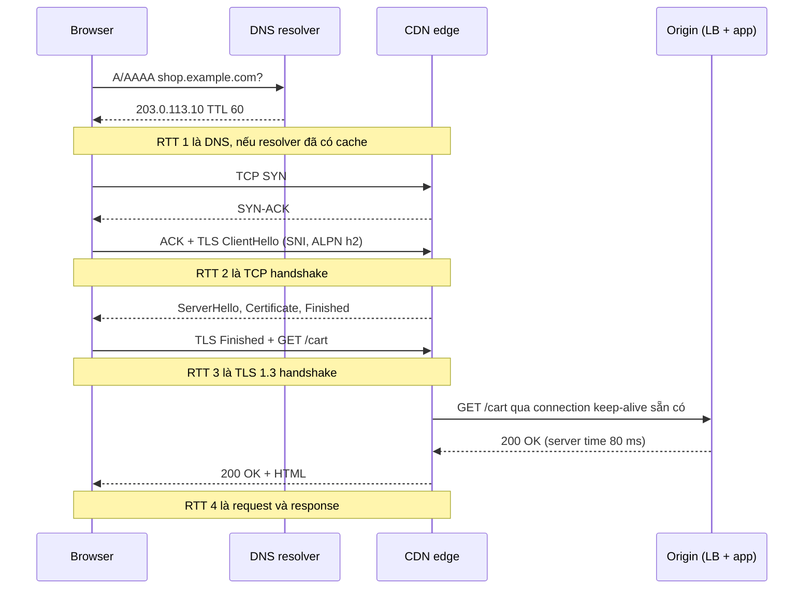
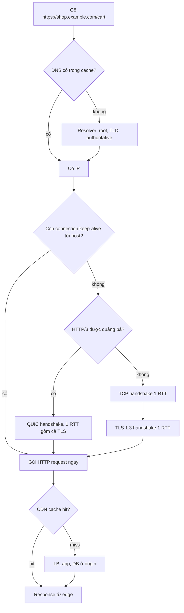

## Bối cảnh & vấn đề

Một team mobile báo cáo: "API của các anh chậm quá, mở màn hình giỏ hàng mất gần 2 giây". Team backend mở dashboard: p99 latency của endpoint `GET /cart` là **80 ms**. Hai bên cãi nhau vài ngày, mỗi bên đưa ra số liệu "chứng minh" mình đúng. Cả hai đều đúng, vì họ đang đo **hai đoạn khác nhau** của cùng một hành trình.

Server chỉ đo được khoảng thời gian từ lúc request tới handler tới lúc response được ghi ra socket. Người dùng thì cảm nhận toàn bộ chuỗi: phân giải tên miền (DNS), mở kết nối TCP, bắt tay TLS, gửi request qua nhiều hop (CDN, load balancer, reverse proxy), chờ server xử lý, rồi nhận response qua một mạng di động có thể mất gói 2–3%. Với một user ở xa region, mỗi **round-trip** (một lượt đi và về của gói tin) có thể tốn 150–250 ms. Nếu trước byte đầu tiên cần 4 round-trip, bạn đã mất gần 1 giây trước khi code của mình kịp chạy.

Đây là lý do interview senior thường mở màn bằng câu kinh điển "Điều gì xảy ra khi bạn gõ URL vào trình duyệt?". Interviewer không muốn nghe bạn đọc thuộc bảy tầng OSI. Họ muốn biết bạn có **mental model** đủ tốt để: đếm được bao nhiêu round-trip, biết bước nào cache được, và khi có sự cố thì biết đo ở đâu. Bài này xây mental model đó. Các bài sau đi sâu từng tầng: [TCP & connection](/tracks/networking/learn/tcp-connections), [DNS](/tracks/networking/learn/dns), [TLS](/tracks/networking/learn/tls-https), [HTTP versions](/tracks/networking/learn/http-versions).

## Khái niệm

### Mô hình tầng: mỗi tầng giải quyết một bài toán

Mạng Internet được thiết kế theo **tầng** (layer): mỗi tầng chỉ lo một bài toán và dựa vào dịch vụ của tầng bên dưới. Mô hình OSI có bảy tầng, nhưng trong thực tế backend, mô hình TCP/IP bốn tầng hữu ích hơn:

- **Link** (Ethernet, Wi-Fi): chuyển frame giữa hai máy trên cùng một mạng vật lý.
- **Internet** (IP): đưa **packet** từ máy nguồn tới máy đích qua nhiều router, theo địa chỉ IP. IP là "best effort": gói có thể mất, trùng, đến sai thứ tự.
- **Transport** (TCP, UDP, và QUIC chạy trên UDP): phân biệt các ứng dụng trên cùng một máy bằng **port**, và (với TCP/QUIC) biến dòng packet không tin cậy thành luồng dữ liệu tin cậy.
- **Application** (HTTP, DNS, TLS nằm giữa transport và HTTP): ngữ nghĩa của ứng dụng.

Tách tầng có lý do rất thực dụng: HTTP không cần biết gói tin đi qua cáp quang hay 4G, và TCP không cần biết payload là JSON hay video. Nhưng cái giá là mỗi tầng có **chi phí thiết lập riêng** (TCP handshake, TLS handshake), và các chi phí này cộng dồn theo round-trip. Khi nói "L4 load balancer" hay "L7 load balancer" (xem [Proxy & load balancer](/tracks/networking/learn/proxy-load-balancer)), con số 4 và 7 lấy từ cách đánh số OSI: L4 là transport, L7 là application.

**Interview angle:** nói được "IP best-effort, TCP biến nó thành stream tin cậy, TLS thêm bảo mật, HTTP thêm ngữ nghĩa" là đủ; đừng sa đà vào tầng session/presentation của OSI.

### RTT, latency và bandwidth

**RTT** (round-trip time) là thời gian để một gói đi từ client tới server và nhận được gói trả lời. RTT bị chặn dưới bởi **tốc độ ánh sáng trong cáp quang** (khoảng 200.000 km/s, tức 5 µs/km). Hà Nội tới Singapore khoảng 2.200 km theo đường chim bay, nên RTT lý thuyết tối thiểu cỡ 22 ms; thực tế với định tuyến và thiết bị trung gian thường 40–60 ms. Tới US East thì 200+ ms là chuyện bình thường.

**Bandwidth** (băng thông) là lượng dữ liệu truyền được mỗi giây. Hai khái niệm độc lập: một đường ống to (bandwidth cao) vẫn có thể dài (RTT cao). Với phần lớn API call, payload chỉ vài KB, nên thời gian truyền dữ liệu gần như bằng 0; thứ quyết định latency là **số round-trip × RTT**. Nâng gói cước từ 100 Mbps lên 1 Gbps không làm handshake nhanh hơn một mili giây nào. Bài [TCP & connection](/tracks/networking/learn/tcp-connections) sẽ giải thích thêm vì sao TCP slow start khiến ngay cả response lớn trên connection mới cũng bị chi phối bởi RTT.

Ví dụ: RTT 100 ms, cold HTTPS request với TLS 1.3 cần khoảng 1 RTT cho DNS (nếu cache miss ở resolver gần), 1 RTT cho TCP, 1 RTT cho TLS, 1 RTT cho request/response. Tổng ~400 ms trước khi thấy byte đầu, dù server chỉ xử lý 20 ms.

**Interview angle:** câu "latency là vấn đề của RTT, không phải bandwidth" là tín hiệu senior; kèm theo phép nhân RTT × số round-trip thì càng thuyết phục.

### TCP: stream tin cậy, có thứ tự

**TCP** (Transmission Control Protocol, RFC 9293) cung cấp cho ứng dụng một **byte stream** hai chiều, tin cậy và có thứ tự. Để làm được điều đó trên nền IP không tin cậy, TCP đánh **sequence number** cho từng byte, bên nhận gửi **ACK** xác nhận, gói nào mất thì bên gửi **retransmit**. TCP còn có **flow control** (không gửi nhanh hơn bên nhận xử lý được, qua receive window) và **congestion control** (không gửi nhanh hơn mạng chịu được, qua congestion window).

Trước khi gửi dữ liệu, hai bên phải thống nhất sequence number ban đầu qua **3-way handshake**: `SYN` → `SYN-ACK` → `ACK`. Handshake này tốn **1 RTT** trước khi byte ứng dụng đầu tiên được gửi đi. Đổi lại, sau đó ứng dụng có thể coi TCP như một đường ống: ghi bytes vào một đầu, đầu kia đọc ra đúng thứ tự.

Cái giá của "đúng thứ tự" là **head-of-line (HOL) blocking**: nếu segment số 5 bị mất, các segment 6, 7, 8 đã tới nơi vẫn phải nằm chờ trong buffer của kernel cho tới khi segment 5 được gửi lại, vì TCP hứa giao bytes theo thứ tự. Với một file tải về thì không sao, nhưng khi nhiều request độc lập dùng chung một TCP connection (HTTP/2), mất một gói làm tất cả cùng chờ. Chi tiết ở [HTTP versions](/tracks/networking/learn/http-versions).

**Interview angle:** interviewer hay hỏi "TCP đảm bảo gì?"; trả lời đủ bốn ý: reliable, ordered, flow control, congestion control, và nêu cái giá là handshake + HOL blocking.

### UDP: datagram, không hứa hẹn gì

**UDP** (User Datagram Protocol, RFC 768) gần như chỉ thêm port và checksum lên IP. Mỗi lần gửi là một **datagram** độc lập: không handshake, không ACK, không retransmit, không thứ tự, không congestion control. Header chỉ 8 byte so với 20+ byte của TCP.

UDP hợp với ba loại việc. Thứ nhất, request/response nhỏ trong một gói, nơi tự retry rẻ hơn handshake: **DNS** là ví dụ điển hình. Thứ hai, dữ liệu thời gian thực mà gói trễ thì vô dụng: voice/video call, game; một frame âm thanh tới muộn 300 ms thì bỏ đi còn hơn chờ. Thứ ba, làm **nền cho giao thức transport mới** chạy ở user space: **QUIC**.

Ví dụ: một DNS query `A shop.example.com` là một datagram UDP tới port 53, response cũng là một datagram. Nếu mất, resolver đơn giản gửi lại sau timeout. Không có connection nào phải mở hay đóng.

**Interview angle:** "UDP không tin cậy nên dùng cho video" là câu trả lời nông; câu trả lời tốt nói rõ **ai** lo reliability (ứng dụng hoặc giao thức phía trên như QUIC) và vì sao làm vậy lại có lợi.

### QUIC và vì sao HTTP/3 chạy trên UDP

**QUIC** (RFC 9000) là giao thức transport tin cậy, được xây trên UDP, và là nền của **HTTP/3** (RFC 9114). Nghe có vẻ nghịch lý: dùng giao thức "không tin cậy" để làm transport tin cậy. Thực ra QUIC tự làm lại mọi thứ TCP làm (sequence number, ACK, retransmit, congestion control), chỉ khác ở ba điểm quyết định.

Một, QUIC có **stream độc lập ở tầng transport**: loss recovery theo từng stream, nên mất gói của stream A không chặn stream B. Hai, QUIC **gộp handshake transport và TLS 1.3** thành một: connection mới chỉ tốn 1 RTT, và 0-RTT khi resume (có rủi ro replay, xem [TLS](/tracks/networking/learn/tls-https)). Ba, QUIC định danh connection bằng **connection ID** chứ không phải bộ 4-tuple (IP nguồn, port nguồn, IP đích, port đích), nên khi điện thoại chuyển từ Wi-Fi sang 4G (đổi IP), connection vẫn sống.

Câu hỏi tự nhiên: sao không sửa TCP? Vì TCP nằm trong **kernel** của hàng tỷ thiết bị, và các middlebox (NAT, firewall) trên Internet đã "học thuộc" hình dạng gói TCP; mọi thay đổi header đều có nguy cơ bị drop. Chạy trên UDP cho phép QUIC triển khai ở **user space** (trong browser, trong thư viện), cập nhật theo release của app thay vì chờ OS, và mã hoá gần hết header để middlebox không can thiệp được.

**Interview angle:** câu follow-up quen thuộc là "UDP không tin cậy thì sao QUIC tin cậy được?"; trả lời: QUIC tự làm ACK/retransmit ở user space, UDP chỉ là lớp vỏ để đi qua mạng.

### Các hop trung gian: CDN, load balancer, reverse proxy

Request của người dùng hiếm khi đi thẳng tới process Node của bạn. Một đường đi điển hình: browser → **CDN edge** (gần user, có thể trả từ cache) → **load balancer** (phân phối tới nhiều instance) → có thể thêm **reverse proxy** (Nginx, Envoy sidecar) → app → database. Mỗi hop có thể **terminate** TCP và TLS, rồi mở connection mới (hoặc dùng connection pool) tới hop kế tiếp.

Hệ quả thực tế: mỗi hop có timeout riêng, header riêng (`X-Forwarded-For`, `Via`), cache riêng, và log riêng. Khi debug, "request có tới server không?" phải được hỏi cho **từng hop**. Các bài [Proxy & load balancer](/tracks/networking/learn/proxy-load-balancer), [CDN & HTTP caching](/tracks/networking/learn/cdn-caching) và [Timeout & 5xx](/tracks/networking/learn/timeouts-production-debugging) đi sâu phần này.

Ví dụ: user ở Sài Gòn gọi API; TLS terminate ở CDN edge Singapore (RTT 30 ms), edge dùng connection keep-alive sẵn có tới origin ở Tokyo. Handshake đắt (đi qua mạng di động) chỉ xảy ra trên đoạn ngắn user → edge, còn đoạn dài edge → origin tái sử dụng connection ấm.

**Interview angle:** nhắc tới việc CDN terminate TLS gần user để rút ngắn handshake cho thấy bạn hiểu CDN không chỉ để cache file tĩnh.

## Cơ chế hoạt động

Theo dõi lần đầu tiên browser tải `https://shop.example.com/cart`, không có gì trong cache.



Diễn giải từng bước:

1. **DNS**: browser kiểm tra cache của chính nó, rồi cache của OS, rồi hỏi **recursive resolver** (của ISP, hoặc 8.8.8.8, 1.1.1.1). Nếu resolver cũng chưa có, nó đi hỏi root → TLD `.com` → authoritative server của `example.com`, mỗi bước là một round-trip nữa. Kết quả có **TTL** để các tầng cache giữ lại. Chi tiết ở [DNS](/tracks/networking/learn/dns).
2. **TCP handshake** (1 RTT): `SYN`, `SYN-ACK`, `ACK`. Gói `ACK` cuối có thể đi kèm luôn dữ liệu đầu tiên (ClientHello), nên handshake chỉ tốn đúng một round-trip.
3. **TLS 1.3 handshake** (1 RTT): ClientHello chứa **SNI** (hostname, để edge chọn đúng certificate) và **ALPN** (danh sách protocol như `h2`, `http/1.1`). Server trả certificate và các khoá; client **verify** chain và hostname. Request HTTP đầu tiên được gửi ngay cùng `Finished`. Với TLS 1.2 đầy đủ, bước này tốn 2 RTT.
4. **HTTP request/response** (1 RTT + server time): edge kiểm tra cache; miss thì chuyển tiếp tới origin qua connection đã mở sẵn, origin xử lý, response đi ngược về.
5. **Tải tài nguyên con**: browser parse HTML, phát hiện CSS/JS/ảnh. Với HTTP/2, các request này **multiplex** trên cùng connection vừa mở, không tốn thêm handshake.

Tổng cộng khoảng **4 RTT + server time** trước byte đầu tiên của HTML. Với RTT 150 ms trên mạng di động xa region, đó là 600 ms + 80 ms. Lần truy cập thứ hai rẻ hơn nhiều: DNS nằm trong cache (tới hết TTL), connection keep-alive có thể còn mở (bỏ 2 RTT), nếu connection đã đóng thì **TLS session resumption** vẫn giúp handshake nhẹ hơn, và CDN có thể trả thẳng từ cache.

Luồng quyết định tổng quát, bao gồm các điểm tắt nhờ cache:



Sơ đồ này cũng là **bản đồ tối ưu**: mỗi nhánh "có" là một chỗ bạn tiết kiệm được round-trip. Giữ connection sống lâu (keep-alive, HTTP/2), cho DNS TTL hợp lý, bật HTTP/3 ở edge, và đặt cache gần user.

## Ví dụ thực tế

### Đo từng pha của một request bằng Node.js

Browser có Resource Timing API để đo từng pha. Trong Node, bạn có thể tự gắn listener vào socket để thấy chi phí DNS, TCP, TLS và TTFB (time to first byte), và thấy chúng biến mất khi connection được tái sử dụng. Script dưới đây chạy một HTTPS server local (certificate ký bởi một CA nội bộ tự tạo), gọi hai lần qua cùng một agent keep-alive:

```ts
import https from "node:https";
import fs from "node:fs";
import { once } from "node:events";

const server = https.createServer(
  { key: fs.readFileSync("srv.key"), cert: fs.readFileSync("srv.crt") },
  (_req, res) => setTimeout(() => res.end("ok"), 20), // 20 ms of "server time"
);
server.listen(8443, "127.0.0.1"); await once(server, "listening");
const agent = new https.Agent({ keepAlive: true, ca: fs.readFileSync("ca.crt") });

function timed(label: string) {
  return new Promise<void>((resolve) => {
    const t0 = performance.now();
    const marks: Record<string, number> = {};
    const mark = (k: string) => (marks[k] = performance.now() - t0);
    const req = https.get({ host: "localhost", port: 8443, path: "/", agent, family: 4 }, (res) => {
      res.once("data", () => mark("firstByte"));
      res.on("end", () => {
        const f = (k: string) => (marks[k] === undefined ? "  (reused)" : `${marks[k].toFixed(1).padStart(6)} ms`);
        console.log(`${label}\n  dns ${f("lookup")} | tcp ${f("connect")} | tls ${f("secureConnect")} | ttfb ${f("firstByte")}`);
        resolve();
      });
    });
    req.on("socket", (s) => {
      s.once("lookup", () => mark("lookup"));
      s.once("connect", () => mark("connect"));
      s.once("secureConnect", () => mark("secureConnect"));
    });
  });
}

await timed("request 1 (cold connection)");
await timed("request 2 (keep-alive)");
server.close(); agent.destroy();
```

Output khi chạy trên Node 24 (thời gian cộng dồn từ lúc bắt đầu request):

```text
request 1 (cold connection)
  dns    7.2 ms | tcp    8.1 ms | tls   13.5 ms | ttfb   38.2 ms
request 2 (keep-alive)
  dns   (reused) | tcp   (reused) | tls   (reused) | ttfb   21.7 ms
```

Trên localhost, RTT gần bằng 0 nên các pha chỉ tốn chi phí CPU. Qua mạng thật, mỗi pha `tcp` và `tls` cộng thêm **một RTT đầy đủ**: với RTT 150 ms, request 1 sẽ mất khoảng 450 ms + server time, còn request 2 chỉ khoảng 150 ms + server time. Đó chính là giá trị của keep-alive.

### Điều tra "API chậm" từ phía mobile

Quay lại câu chuyện đầu bài. Cách làm có cấu trúc:

1. **Đo phía client**, không đo phía server. Trên web dùng Resource Timing (`domainLookupStart/End`, `connectStart/End`, `secureConnectionStart`, `requestStart`, `responseStart`); trên mobile dùng metric của HTTP client (OkHttp `EventListener`, `URLSessionTaskMetrics`) và gửi về hệ thống RUM (real user monitoring).
2. **Phân rã**: nếu `connectEnd - connectStart` và `requestStart - secureConnectionStart` chiếm phần lớn, vấn đề là handshake (connection không được tái sử dụng, hoặc user ở quá xa). Nếu `responseStart - requestStart` lớn mà server time nhỏ, thời gian nằm ở các hop trung gian hoặc hàng đợi. Nếu `responseEnd - responseStart` lớn, payload quá to hoặc mạng mất gói.
3. **Hành động theo từng loại**: đưa TLS termination về edge gần user (CDN), bật TLS 1.3 + session resumption, đảm bảo app giữ connection (một HTTP client dùng chung, không tạo mới mỗi call), cân nhắc **HTTP/3** cho mạng loss cao và chuyển mạng thường xuyên, nén payload (br/gzip), bỏ over-fetching, gộp request waterfall thành một endpoint aggregate.
4. **Retry có kỷ luật**: timeout phía client hợp lý, exponential backoff + jitter, chỉ retry request idempotent (xem [HTTP semantics](/tracks/networking/learn/http-versions)).

### Partner báo "không truy cập được API"

Khi một đối tác nói API của bạn không truy cập được từ mạng của họ nhưng mọi người khác vẫn dùng bình thường, hãy đi từ dưới lên theo đúng các tầng của sơ đồ trên, và xin dữ liệu từ **cả hai phía**:

- **DNS**: họ resolve ra IP nào? `dig +trace api.example.com`, và `dig @<resolver nội bộ của họ>`. Mạng doanh nghiệp có thể dùng **split-horizon DNS** hoặc cache IP cũ sau một lần migrate.
- **Reachability**: `curl -v https://api.example.com/health` từ máy của họ; `mtr`/`traceroute` để thấy gói dừng ở đâu; firewall egress của họ có allowlist theo IP cũ không?
- **TLS**: `openssl s_client -connect api.example.com:443 -servername api.example.com` để xem chain và version. Client cũ chỉ hỗ trợ TLS 1.0/1.1 sẽ fail nếu bạn đã tắt chúng. Proxy doanh nghiệp làm **TLS interception** thay certificate của bạn bằng certificate của họ; nếu SDK của bạn dùng certificate pinning, kết nối sẽ bị từ chối.
- **HTTP/edge**: WAF, geo-block, rate limit có chặn dải IP của họ? Tra log edge theo IP nguồn và thời điểm.
- **MTU / PMTUD blackhole**: handshake treo đúng lúc server gửi certificate (gói lớn), đặc biệt qua VPN hay tunnel có MTU nhỏ, vì gói ICMP "fragmentation needed" bị firewall chặn.

Output minh hoạ (illustrative, không phải log thật) của một trường hợp TLS interception:

```text
$ openssl s_client -connect api.example.com:443 -servername api.example.com
depth=1 CN = Corp Proxy Inspection CA
verify error:num=20:unable to get local issuer certificate
```

Issuer là CA của proxy doanh nghiệp chứ không phải CA công khai của bạn: request đã bị giải mã giữa đường.

## Trade-offs & lựa chọn thay thế

| Tiêu chí | TCP (+ TLS 1.3) | UDP thuần | QUIC (HTTP/3) |
| --- | --- | --- | --- |
| Handshake trước dữ liệu | 1 RTT TCP + 1 RTT TLS | 0 | 1 RTT (0-RTT khi resume) |
| Tin cậy, có thứ tự | Có, toàn connection | Không | Có, theo từng stream |
| HOL blocking khi mất gói | Toàn connection | Không áp dụng | Chỉ stream bị mất gói |
| Đổi mạng (Wi-Fi sang 4G) | Connection chết | Không áp dụng | Sống nhờ connection ID |
| Triển khai | Kernel, mọi nơi hỗ trợ | Kernel | User space, thư viện |
| Middlebox, firewall | Đi qua mọi nơi | Hay bị chặn ngoài port 53/443 | UDP 443 có thể bị chặn, cần fallback |
| Công cụ debug | tcpdump, Wireshark đọc được | Dễ | Header mã hoá, cần key log |

**Khi nào chọn cái nào.** Với service-to-service trong datacenter (RTT dưới 1 ms, gần như không mất gói), TCP với connection pool là lựa chọn mặc định: đơn giản, công cụ debug đầy đủ, lợi ích của QUIC gần như bằng 0. Với traffic từ người dùng cuối, đặc biệt mobile và thị trường xa region, HTTP/3 ở **edge** (CDN) mang lại lợi ích rõ rệt mà app không phải đổi gì, vì origin phía sau vẫn nói HTTP/1.1 hoặc HTTP/2. UDP thuần chỉ nên dùng khi bạn thực sự muốn tự quản lý reliability (game, media realtime, telemetry chấp nhận mất mẫu); tự viết reliability trên UDP cho API thông thường là tự làm lại TCP một cách tệ hơn.

Một trade-off khác nằm ở **vị trí terminate TLS**: terminate ở edge gần user rút ngắn handshake nhưng nghĩa là edge thấy plaintext; terminate ở origin giữ end-to-end nhưng mọi handshake đi đường dài. Bài [TLS](/tracks/networking/learn/tls-https) phân tích chi tiết.

## Edge cases & failure modes

- **Mạng loss cao**: TCP hiểu mất gói là tắc nghẽn và giảm congestion window; trên 4G yếu với 2–5% loss, throughput và latency tệ đi nhiều lần. Server metric không thấy gì vì server không biết client đang retransmit.
- **SYN bị mất**: nếu gói `SYN` đầu tiên mất, client chờ **initial RTO** (retransmission timeout) trước khi gửi lại; RFC 6298 đặt giá trị khởi điểm 1 giây. Đó là nguồn của các spike latency "tròn 1 giây" rất đặc trưng.
- **UDP bị chặn**: nhiều mạng doanh nghiệp chặn UDP ngoài port 53. Client HTTP/3 phải **fallback** về TCP; nếu implementation chờ QUIC timeout quá lâu trước khi fallback, user thấy chậm hơn cả khi không có HTTP/3.
- **DNS resolver chậm hoặc chết**: mọi connection mới đều phải chờ; với Node, `dns.lookup` chạy trên libuv threadpool nên DNS chậm còn làm nghẽn cả `fs` và `crypto` (xem [DNS](/tracks/networking/learn/dns)).
- **Clock lệch**: máy client có đồng hồ sai vài ngày sẽ thấy certificate "chưa có hiệu lực" hoặc "đã hết hạn", và báo lỗi TLS dù server hoàn toàn bình thường.
- **Path MTU blackhole**: gói nhỏ (handshake TCP, ClientHello) đi được, gói lớn (certificate chain) bị drop im lặng; kết nối treo ở giữa TLS handshake. Hay gặp qua VPN, GRE tunnel, hoặc mạng có firewall chặn ICMP.
- **Một hop trung gian đổi hành vi**: CDN bật HTTP/3 hay đổi TLS policy có thể làm vỡ client cũ mà bạn không hề deploy gì. Luôn đọc changelog của edge provider và có canary.

## Pitfalls

- ❌ Kết luận "API nhanh" chỉ từ server-side p99 → ✅ đo cả client-side (RUM, Resource Timing), vì DNS, handshake và retransmit không bao giờ xuất hiện trong log server.
- ❌ Nghĩ tăng bandwidth sẽ giảm latency của API → ✅ giảm số round-trip (keep-alive, HTTP/2/3, CDN gần user), vì latency của payload nhỏ gần như chỉ phụ thuộc RTT.
- ❌ Tạo HTTP client/agent mới cho mỗi request → ✅ một client dùng chung với keep-alive, vì mỗi connection mới tốn thêm 2 RTT handshake (và DNS lookup).
- ❌ Trả lời câu "gõ URL" bằng cách đọc thuộc bảy tầng OSI → ✅ đi theo thứ tự DNS → TCP/QUIC → TLS → HTTP → hop trung gian, đếm RTT và chỉ ra chỗ cache được.
- ❌ Nói "HTTP/3 dùng UDP nên không tin cậy" → ✅ QUIC tự làm reliability theo từng stream ở user space; UDP chỉ là lớp vận chuyển đi qua được middlebox.
- ❌ Debug sự cố của partner chỉ bằng log phía mình → ✅ xin `dig`, `curl -v`, `openssl s_client` từ mạng của họ và đi từ DNS lên HTTP.
- ❌ Bật HTTP/3 rồi coi như xong → ✅ theo dõi tỉ lệ fallback và latency theo loại mạng, vì UDP bị chặn ở nhiều mạng doanh nghiệp.

## Tóm tắt

- Một HTTPS request đi qua **DNS → TCP (hoặc QUIC) → TLS → HTTP**, qua nhiều hop (CDN, LB, proxy) trước khi tới app.
- Latency của API nhỏ = **số round-trip × RTT** + server time; bandwidth hầu như không liên quan.
- Cold HTTPS với TLS 1.3 tốn khoảng 2 RTT handshake (TCP + TLS) trước request; TLS 1.2 tốn thêm 1 RTT; HTTP/3 gộp còn 1 RTT.
- **TCP** = stream tin cậy, có thứ tự, flow/congestion control, cái giá là handshake và HOL blocking. **UDP** = datagram không hứa hẹn.
- **QUIC** làm lại reliability trên UDP ở user space: stream độc lập, handshake gộp với TLS, connection ID sống qua đổi mạng.
- Lần truy cập sau rẻ hơn nhờ DNS cache, keep-alive, TLS session resumption và CDN cache.
- "API chậm" phải được đo **phía client** và phân rã theo pha; sự cố của partner phải được điều tra từ dưới lên với dữ liệu của cả hai phía.
