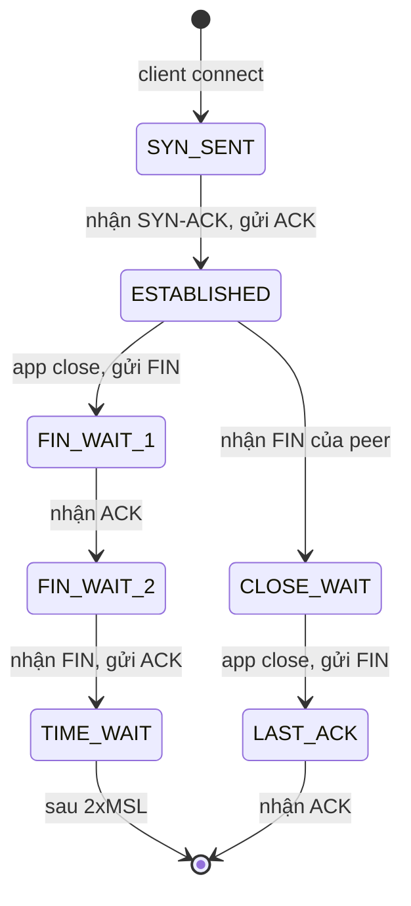
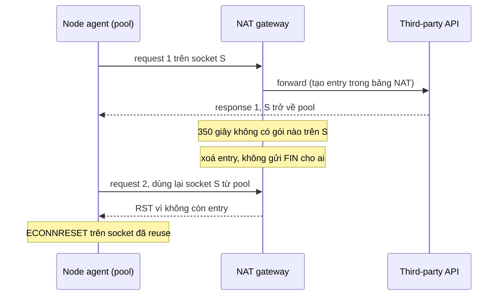

## Bối cảnh & vấn đề

Service checkout gọi service pricing nội bộ qua HTTPS. Upstream trả lời trong 15 ms, nhưng dashboard của checkout cho thấy p99 của cuộc gọi đó lên tới **1 giây**, thỉnh thoảng có `ETIMEDOUT`, và sau vài ngày chạy thì số file descriptor của process tăng đều không giảm. Code trông vô hại:

```ts
import https from "node:https";

export function callPricing(sku: string) {
  return new Promise((resolve, reject) => {
    const req = https.request(
      { host: "pricing.internal", path: `/p/${sku}`, agent: new https.Agent({ keepAlive: true }) },
      (res) => { let b = ""; res.on("data", (c) => (b += c)); res.on("end", () => resolve(JSON.parse(b))); },
    );
    req.on("error", reject);
    req.end();
  });
}
```

Tác giả đã "bật keep-alive" nhưng lại tạo **một agent mới cho mỗi lần gọi**, nên connection không bao giờ được dùng lại: mỗi request trả đủ DNS lookup, TCP handshake, TLS handshake, rồi để lại một socket keep-alive mồ côi trong agent không ai tham chiếu. Không có timeout, nên khi một gói `SYN` bị mất, request ngồi chờ retransmit của kernel.

Hầu hết sự cố network ở tầng ứng dụng đều quy về **vòng đời của TCP connection**: mở tốn bao nhiêu, giữ bao lâu, ai đóng trước, và khi một thiết bị ở giữa lặng lẽ quên connection thì chuyện gì xảy ra. Bài này đi qua từng giai đoạn đó, với số liệu thật từ Node.js và Linux.

## Khái niệm

### Connection = bộ 4-tuple và một cặp state machine

Một TCP connection được định danh bằng **4-tuple**: (IP nguồn, port nguồn, IP đích, port đích). Server lắng nghe trên một port cố định (443); client dùng một **ephemeral port** (port tạm) do OS cấp. Hai đầu connection mỗi bên giữ một **state machine** riêng trong kernel: `SYN_SENT`, `ESTABLISHED`, `FIN_WAIT_1`, `CLOSE_WAIT`, `TIME_WAIT`... Kernel cũng cấp cho ứng dụng một **file descriptor** (FD) để đọc/ghi socket.

Hiểu 4-tuple giải thích nhiều giới hạn thực tế. Một client có thể mở hàng chục nghìn connection tới **cùng một** `IP:port` đích, mỗi cái khác nhau ở port nguồn. Khi port nguồn cạn, không thể mở thêm connection tới đích đó nữa, dù CPU và RAM còn thừa.

Ví dụ: `10.0.1.5:51234 → 10.0.2.9:443` và `10.0.1.5:51235 → 10.0.2.9:443` là hai connection khác nhau từ cùng một pod tới cùng một upstream.

**Interview angle:** nhắc tới 4-tuple khi trả lời câu port exhaustion cho thấy bạn hiểu giới hạn là **theo từng đích**, không phải toàn máy.

### Chi phí mở connection và vì sao keep-alive quan trọng

Mở một connection HTTPS mới tốn: một DNS lookup (nếu chưa cache), **1 RTT** cho TCP handshake, **1 RTT** cho TLS 1.3 (2 RTT với TLS 1.2), thêm CPU cho phép tính khoá bất đối xứng ở cả hai phía. Connection mới còn bắt đầu ở trạng thái **slow start** (xem phần dưới), nên response lớn đầu tiên chậm hơn.

**HTTP keep-alive** (persistent connection) là việc tái sử dụng một TCP/TLS connection cho nhiều request nối tiếp. Trong HTTP/1.1, connection **mặc định là persistent** trừ khi một bên gửi `Connection: close`. Phía server giữ connection idle trong một khoảng (Node: `server.keepAliveTimeout`, mặc định 5 giây); phía client giữ connection rảnh trong một **pool** để dùng lại.

Chi phí của keep-alive nằm ở server: mỗi connection idle giữ một FD và vài KB đến vài chục KB bộ nhớ (buffer kernel, TLS state). Vì vậy server luôn có idle timeout; và timeout này phải được phối hợp với các tầng phía trước, nếu không sẽ sinh ra race dẫn tới 502 (bài [Timeout & 5xx](/tracks/networking/learn/timeouts-production-debugging)).

Phía client trong Node: từ **Node 19**, `http.globalAgent` bật `keepAlive` mặc định (verify), và `fetch` (dựa trên undici) luôn dùng pool. Nhưng nếu bạn tự tạo `new http.Agent()` ở sai chỗ, bạn tự tắt lợi ích đó.

**Interview angle:** đừng nhầm **HTTP keep-alive** (tái sử dụng connection cho nhiều request) với **TCP keepalive** (gói probe để phát hiện connection chết); interviewer rất hay bẫy chỗ này.

### Đóng connection: FIN, CLOSE_WAIT và TIME_WAIT

Đóng connection TCP là một quá trình bốn bước: bên muốn đóng gửi `FIN`, bên kia `ACK`; khi bên kia cũng đóng thì gửi `FIN` của mình, bên đầu `ACK`. Bên gửi `FIN` **trước** gọi là **active closer**; bên nhận `FIN` trước là **passive closer**.

Passive closer vào trạng thái **`CLOSE_WAIT`** khi nhận `FIN` và ở đó cho tới khi **ứng dụng** gọi `close()`. Nhiều socket `CLOSE_WAIT` tồn đọng là dấu hiệu code của bạn không đóng socket (leak), không phải vấn đề của kernel.

Active closer, sau khi gửi `ACK` cuối cùng, vào **`TIME_WAIT`** và ở đó **2×MSL** (maximum segment lifetime). Linux cố định 60 giây. Lý do có hai: nếu `ACK` cuối bị mất, bên kia sẽ gửi lại `FIN` và bên này vẫn còn state để trả lời; và các segment trễ của connection cũ không bị hiểu nhầm là dữ liệu của một connection mới dùng lại đúng 4-tuple đó. `TIME_WAIT` là tính năng an toàn, không phải lỗi.

Ví dụ: client gửi `Connection: close`, server Node trả response rồi đóng socket trước, nên `TIME_WAIT` nằm ở **phía server**. Ngược lại, nếu client (hoặc agent của nó) chủ động đóng, `TIME_WAIT` nằm ở client, và mỗi socket đó giữ một ephemeral port trong 60 giây.

**Interview angle:** câu hỏi "TIME_WAIT nằm ở phía nào?" có đáp án "phía đóng trước", và câu follow-up là "vậy trong kiến trúc của bạn ai đóng trước?".

### Ephemeral port exhaustion

Linux cấp ephemeral port trong dải `net.ipv4.ip_local_port_range`, mặc định **32768–60999**, tức khoảng **28.000 port** (verify trên distro của bạn). Mỗi connection outbound tới cùng một `(IP đích, port đích)` cần một port nguồn khác nhau, và port đó bị giữ trong suốt vòng đời connection **cộng thêm** 60 giây `TIME_WAIT` nếu phía client đóng trước.

Phép tính: 28.000 port ÷ 60 giây ≈ **466 connection mới mỗi giây** tới một đích là trần bền vững khi mỗi request dùng một connection rồi client đóng. Một service chạy 800 RPS không keep-alive tới một upstream sẽ cạn port trong vài chục giây. Triệu chứng: `connect EADDRNOTAVAIL`, hoặc connect chậm bất thường vì kernel phải tìm port rảnh.

Cách sửa đúng không phải là "tune kernel" mà là **dùng lại connection**: agent keep-alive với `maxSockets` hợp lý, hoặc undici pool. `net.ipv4.tcp_tw_reuse` cho phép tái sử dụng socket `TIME_WAIT` cho connection outbound mới khi có TCP timestamps, nhưng nó chỉ là giảm nhẹ. `tcp_tw_recycle` từng được khuyên dùng đã bị **xoá khỏi Linux 4.12** vì làm hỏng kết nối từ client sau NAT.

**Interview angle:** trả lời tốt đưa ra được phép chia port/60s và kết luận "keep-alive mới là fix", thay vì liệt kê sysctl.

### Congestion control và slow start

TCP không biết mạng giữa hai đầu chịu được bao nhiêu, nên nó dò dần. Bên gửi giữ một **congestion window** (cwnd): số byte tối đa được gửi mà chưa nhận ACK. Connection mới bắt đầu với **initial window** nhỏ, theo RFC 6928 là **10 segment**, khoảng 14,6 KB với MSS 1.460 byte. Mỗi RTT không mất gói, cwnd gần như **gấp đôi**: đó là **slow start**. Khi phát hiện mất gói, thuật toán loss-based (Reno, CUBIC, mặc định của Linux) giảm cwnd mạnh; **BBR** thì ước lượng băng thông và RTT thay vì dựa vào mất gói.

Hệ quả: một response 200 KB trên connection **mới** cần khoảng 4–5 RTT chỉ để "mở rộng cửa sổ" (14 → 28 → 56 → 112 → 224 KB), bất kể đường truyền 1 Gbps hay 10 Gbps. Với RTT 150 ms, đó là 600–750 ms. Trên connection **ấm** (cwnd đã lớn), cùng response đó có thể chỉ tốn 1–2 RTT.

Thêm một chi tiết: Linux mặc định `net.ipv4.tcp_slow_start_after_idle = 1`, nghĩa là connection idle lâu hơn một RTO sẽ **reset cwnd** về initial window (verify). Connection keep-alive ngủ vài giây rồi gửi response lớn vẫn bị slow start lại. Với server phục vụ traffic dạng burst, nhiều team tắt option này.

**Interview angle:** câu "sao tăng bandwidth không giúp?" cần được trả lời bằng cơ chế: latency = RTT × số round-trip, và slow start quyết định số round-trip cho response lớn trên connection mới.

### TCP keepalive và middlebox quên connection

Giữa client và server thường có các **middlebox** giữ state của connection: **NAT gateway**, firewall stateful, load balancer, proxy. Chúng không thể giữ state mãi, nên có **idle timeout**: AWS NAT Gateway là **350 giây**; nhiều firewall doanh nghiệp ngắn hơn. Khi hết timeout, middlebox xoá entry **mà không báo cho hai đầu**. Hai đầu vẫn tin connection đang `ESTABLISHED`.

Lần sau client dùng lại socket đó từ pool, gói tin tới middlebox không còn entry: AWS NAT Gateway trả **RST** cho resource phía sau nó, client nhận `ECONNRESET`; firewall khác có thể drop im lặng, client thấy timeout. Triệu chứng đặc trưng: lỗi **tập trung sau những khoảng yên ắng** (đêm, cuối tuần, service ít traffic).

**TCP keepalive** là cơ chế kernel gửi một probe rỗng sau một khoảng idle, giúp (1) giữ entry của middlebox luôn "tươi", (2) phát hiện connection chết. Mặc định Linux chờ **2 giờ** mới probe, vô dụng với NAT 350 giây. Node cho phép `socket.setKeepAlive(true, 30_000)` để probe sau 30 giây idle; `http.Agent` có `keepAliveMsecs` cho mục đích này.

**Interview angle:** dấu hiệu "lỗi sau lúc yên ắng" gần như luôn chỉ về idle timeout của một thiết bị ở giữa; nói được con số 350 giây của NAT Gateway là điểm cộng.

## Cơ chế hoạt động

Vòng đời một connection từ góc nhìn của bên chủ động đóng và bên bị động đóng:



Nhánh trái là **active closer**: sau khi đóng, socket còn nằm trong `TIME_WAIT` 60 giây (Linux), giữ 4-tuple và ephemeral port. Nhánh phải là **passive closer**: `CLOSE_WAIT` kéo dài bao lâu hoàn toàn do ứng dụng quyết định; nếu code quên đóng socket sau khi peer đã đóng, socket nằm ở `CLOSE_WAIT` mãi và FD rò rỉ.

Kịch bản idle connection bị NAT Gateway quên, dẫn tới `ECONNRESET`:



Có ba cách phá chuỗi này, và nên dùng kết hợp. Thứ nhất, cho **pool của client đóng socket idle sớm hơn** timeout của middlebox (undici `keepAliveTimeout`, `http.Agent` `timeout`): socket chưa kịp bị quên thì đã bị bỏ. Thứ hai, bật **TCP keepalive** với khoảng dưới timeout của middlebox, để entry luôn được làm mới. Thứ ba, **retry một lần** các request idempotent khi gặp `ECONNRESET` trên một socket được reuse (lỗi xảy ra trước khi server nhận request, nên retry an toàn cho `GET`; với `POST` thì chỉ retry khi có idempotency key, xem [HTTP semantics](/tracks/networking/learn/http-versions)).

Quy tắc tổng quát cho mọi cặp client/server có keep-alive: **bên client phải bỏ connection idle trước bên server (và trước mọi middlebox ở giữa)**. Nếu server hay middlebox đóng trước, luôn tồn tại một khoảng hở mà client gửi request vào một socket vừa bị đóng.

## Ví dụ thực tế

### Keep-alive giảm 200 connection xuống còn 1

Script gửi 200 request tuần tự tới một server local, một lần không keep-alive và một lần có, đếm số TCP connection server nhận được:

```ts
import http from "node:http";
import { once } from "node:events";

const server = http.createServer((_req, res) => res.end("ok"));
let connections = 0;
server.on("connection", () => connections++);
server.listen(0, "127.0.0.1");
await once(server, "listening");
const { port } = server.address() as { port: number };

async function run(label: string, agent: http.Agent) {
  connections = 0;
  const t0 = performance.now();
  for (let i = 0; i < 200; i++) {
    await new Promise<void>((resolve, reject) => {
      http.get({ host: "127.0.0.1", port, path: "/", agent }, (res) => {
        res.resume();
        res.on("end", resolve);
      }).on("error", reject);
    });
  }
  const ms = (performance.now() - t0).toFixed(0);
  console.log(`${label}: 200 requests, ${connections} TCP connections, ${ms} ms`);
}

await run("keepAlive=false", new http.Agent({ keepAlive: false }));
await run("keepAlive=true ", new http.Agent({ keepAlive: true, maxSockets: 10 }));
server.close();
process.exit(0);
```

Output trên Node 24, localhost:

```text
keepAlive=false: 200 requests, 200 TCP connections, 105 ms
keepAlive=true : 200 requests, 1 TCP connections, 31 ms
```

Trên localhost, không keep-alive đã chậm hơn 3 lần chỉ vì chi phí syscall và handshake. Qua mạng thật với RTT 2 ms trong cùng region, mỗi connection mới cộng thêm ít nhất 2 ms (TCP) và 2 ms nữa nếu có TLS, nên 200 request tuần tự chênh nhau gần một giây.

### Nhìn thấy TIME_WAIT tích tụ

Cùng server, gửi 500 request không keep-alive rồi đếm socket theo trạng thái (chạy trên macOS; trên Linux dùng `ss -tan state time-wait`):

```ts
import http from "node:http";
import { once } from "node:events";
import { execSync } from "node:child_process";

const server = http.createServer((_req, res) => res.end("ok"));
server.listen(4100, "127.0.0.1");
await once(server, "listening");
const agent = new http.Agent({ keepAlive: false });
for (let i = 0; i < 500; i++) {
  await new Promise<void>((r) => http.get({ host: "127.0.0.1", port: 4100, agent }, (res) => { res.resume(); res.on("end", r); }));
}
console.log(execSync("netstat -an -p tcp | grep '127.0.0.1.4100' | awk '{print $6}' | sort | uniq -c").toString().trim());
server.close();
```

```text
1 CLOSE_WAIT
   1 FIN_WAIT_2
   1 LISTEN
 499 TIME_WAIT
```

Kiểm tra kỹ thì các socket `TIME_WAIT` có địa chỉ local là `127.0.0.1.4100`, tức **phía server**: client Node gửi `Connection: close`, server đóng trước nên server là active closer. Ở production, vị trí `TIME_WAIT` phụ thuộc bên nào đóng trước; nếu là client (agent hủy socket, client tự đóng sau response), mỗi socket giữ một ephemeral port của client trong 60 giây và bạn sẽ gặp đúng bài toán cạn port ở trên. Lệnh kiểm tra trên Linux: `ss -s` để xem tổng, `ss -tan state time-wait '( dport = :443 )' | wc -l` để đếm theo đích.

### Sửa client gọi pricing

```ts
import { Agent, request } from "undici";

// One pool per upstream, created once at module load.
const pricingPool = new Agent({
  connections: 50,          // cap concurrent sockets to this origin
  keepAliveTimeout: 10_000, // drop idle sockets after 10s (below any middlebox idle timeout)
  connect: { timeout: 1_000 },
});

export async function callPricing(sku: string): Promise<{ price: number }> {
  const res = await request(`https://pricing.internal/p/${encodeURIComponent(sku)}`, {
    dispatcher: pricingPool,
    signal: AbortSignal.timeout(2_000), // whole-request deadline
  });
  if (res.statusCode !== 200) {
    await res.body.dump(); // release the socket back to the pool
    throw new Error(`pricing returned ${res.statusCode}`);
  }
  return (await res.body.json()) as { price: number };
}
```

Bốn thay đổi: pool tạo **một lần** ở module scope nên connection được tái sử dụng; giới hạn số socket để không dội bom upstream; timeout cho cả connect lẫn toàn request, nên một `SYN` bị mất không còn làm request treo tới timeout của OS; và luôn tiêu thụ body (kể cả khi lỗi) để socket được trả về pool thay vì bị giữ. Spike "tròn 1 giây" trước đây chính là **initial RTO** của `SYN` bị mất (RFC 6298), cộng với DNS lookup cho mỗi request mới.

## Trade-offs & lựa chọn thay thế

| Chiến lược connection | Ưu | Nhược | Khi nào dùng |
| --- | --- | --- | --- |
| Connection mới mỗi request | Đơn giản, không có state cũ, cân bằng tải tự nhiên qua DNS/LB | Handshake mỗi lần, slow start, TIME_WAIT, cạn port | Gọi rất thưa (vài lần/phút), script |
| Pool HTTP/1.1 keep-alive | Bỏ handshake, cwnd ấm, dễ debug | Phải phối hợp idle timeout, một request/connection tại một thời điểm | Mặc định cho service-to-service |
| HTTP/2 một connection multiplex | Ít socket nhất, header compression | Mất gói chặn mọi stream, dính một backend sau L4 LB | gRPC, nhiều request nhỏ song song |
| TCP keepalive bật | Giữ entry NAT/firewall, phát hiện peer chết | Thêm vài gói nhỏ, không thay được idle timeout ở pool | Connection sống lâu qua NAT, DB connection |

Khi nào chọn gì. Mặc định cho mọi HTTP client trong service là **một pool dùng chung cho mỗi upstream**, với idle timeout ngắn hơn idle timeout của server và của mọi middlebox ở giữa. Tăng `maxSockets`/`connections` không phải lúc nào cũng tốt: quá nhiều connection tới một upstream nhỏ làm nó quá tải, và đó là vấn đề của rate limiting chứ không phải networking. Với connection sống rất lâu (WebSocket, connection tới DB, gRPC stream), bật TCP keepalive hoặc ping ở tầng ứng dụng là bắt buộc nếu có NAT ở giữa.

## Edge cases & failure modes

- **Idle timeout lệch nhau**: server đóng connection idle sau 5 giây, client pool giữ 60 giây, nên client đôi khi gửi vào socket vừa đóng và nhận `ECONNRESET` hoặc "socket hang up". Luật: client bỏ trước.
- **CLOSE_WAIT tích tụ**: code không tiêu thụ hoặc hủy response body, socket không được đóng sau khi peer đã đóng; FD tăng dần tới `EMFILE: too many open files`.
- **Cạn ephemeral port sau NAT dùng chung**: NAT gateway cũng có giới hạn port cho mỗi đích (AWS NAT Gateway hỗ trợ khoảng 55.000 connection đồng thời tới một đích duy nhất, verify); nhiều pod dùng chung một NAT gọi cùng một API bên thứ ba có thể cạn port ở tầng NAT, không phải ở pod.
- **Slow start sau idle**: connection keep-alive idle vài giây rồi gửi response lớn bị reset cwnd; latency response lớn cao bất thường dù connection "ấm".
- **SYN retransmit**: mất `SYN` làm connect chờ 1 giây, rồi 2, 4 giây theo exponential backoff; không có connect timeout thì request có thể treo hàng chục giây.
- **Retry sai loại request**: retry `POST` khi gặp `ECONNRESET` giữa chừng (sau khi request đã gửi) có thể tạo giao dịch trùng; chỉ an toàn khi lỗi xảy ra trên socket reuse **trước** khi byte request nào được ghi, hoặc khi có idempotency key.
- **Scale-out không nhận traffic**: pool giữ connection lâu tới các instance cũ; instance mới sau scale-out gần như không nhận request cho tới khi connection cũ bị đóng. Đặt `maxLifetime`/giới hạn số request mỗi connection để phân phối lại.

## Pitfalls

- ❌ `new https.Agent({ keepAlive: true })` bên trong hàm gọi API → ✅ tạo agent/pool một lần ở module scope, vì agent mới nghĩa là pool mới và không connection nào được dùng lại.
- ❌ Gọi HTTP không có timeout → ✅ `AbortSignal.timeout()` cho toàn request và connect timeout riêng, vì mặc định có thể chờ tới timeout của OS (hàng chục giây tới vài phút).
- ❌ Thấy nhiều `TIME_WAIT` là tìm cách "tắt" nó bằng sysctl → ✅ giảm số connection mới bằng keep-alive; `TIME_WAIT` là cơ chế an toàn, còn `tcp_tw_recycle` đã bị xoá khỏi kernel.
- ❌ Nhầm HTTP keep-alive với TCP keepalive → ✅ cái trước tái sử dụng connection cho nhiều request, cái sau là probe phát hiện connection chết và giữ NAT entry.
- ❌ Idle timeout của client pool dài hơn server/NAT → ✅ client luôn bỏ connection idle trước, vì bên đóng trước quyết định ai nhận lỗi.
- ❌ Không đọc hết body khi status không phải 2xx → ✅ `res.body.dump()` hoặc `res.resume()`, vì socket chỉ trở về pool khi body đã được tiêu thụ.
- ❌ Chỉ tăng bandwidth khi API chậm với mạng xa → ✅ giữ connection ấm, giảm response đầu dưới ~14 KB, đưa edge gần user, vì slow start tính theo RTT.

## Tóm tắt

- Connection TCP được định danh bằng **4-tuple**; mở connection HTTPS mới tốn DNS + 1 RTT TCP + 1 RTT TLS 1.3 + slow start.
- **HTTP keep-alive** tái sử dụng connection; trong Node, tạo agent/pool một lần và dùng chung, luôn có timeout.
- Bên đóng trước vào **TIME_WAIT** (Linux 60 giây); bên đóng sau có thể kẹt ở **CLOSE_WAIT** nếu app không đóng socket.
- Khoảng 28.000 ephemeral port ÷ 60 giây ≈ 466 connection mới/giây tới một đích nếu client đóng trước; fix là keep-alive, không phải sysctl.
- **Slow start** bắt đầu từ ~10 segment (~14 KB) và gấp đôi mỗi RTT; response lớn trên connection mới tốn nhiều RTT bất kể bandwidth.
- Middlebox (NAT Gateway 350 giây) quên connection idle mà không báo; lỗi `ECONNRESET` sau lúc yên ắng là dấu hiệu kinh điển.
- Luật vàng: **client bỏ connection idle trước server và middlebox**; bật TCP keepalive cho connection sống lâu; chỉ retry request idempotent.
