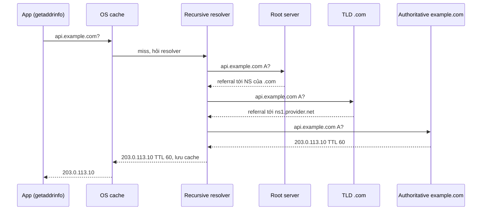
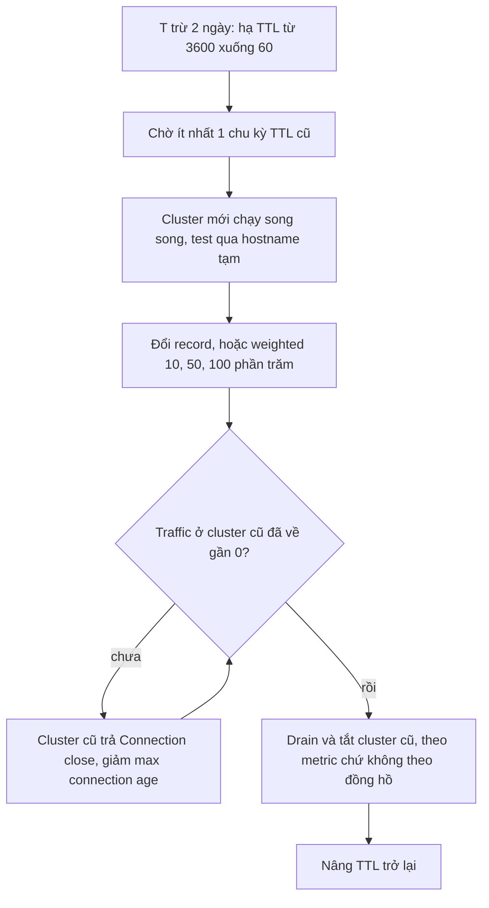

## Bối cảnh & vấn đề

Team platform chuyển API `api.example.com` từ cluster cũ sang cluster mới. Kế hoạch đơn giản: 22h đổi record A sang IP của load balancer mới, 23h tắt cluster cũ. Tới 23h, dashboard của cluster cũ vẫn còn **20% traffic**. Một số request tới từ mobile app, một số từ service nội bộ viết bằng Java, và một phần đáng kể từ một đối tác gọi API qua connection pool. Nếu tắt cluster cũ đúng giờ, 20% người dùng sẽ gặp lỗi.

Không ai làm sai lệnh DNS nào. Vấn đề là DNS **không có cơ chế đẩy invalidation**: mỗi tầng cache giữ bản ghi tới hết TTL mà nó nhận được, một số client tự cache lâu hơn TTL, và quan trọng nhất, client đang có **connection mở sẵn** tới IP cũ không bao giờ hỏi lại DNS. DNS chỉ được hỏi khi mở connection mới.

DNS thường bị coi là "hạ tầng, không phải việc của dev", cho tới khi một cuộc migrate, một sự cố `ECONNREFUSED ::1`, hay một service Node chậm bí ẩn vì threadpool bị DNS chiếm. Bài này giải thích DNS đủ sâu để bạn xử lý những tình huống đó.

## Khái niệm

### Không gian tên, zone và authoritative server

**DNS** (Domain Name System) là cơ sở dữ liệu phân tán ánh xạ **tên** (như `api.example.com`) sang **record** (IP, tên khác, text...). Tên được tổ chức thành cây: root (`.`) → TLD (`com`) → domain (`example.com`) → subdomain (`api.example.com`). Mỗi nhánh được **uỷ quyền** (delegate) cho một tổ chức quản lý; phần cây mà một tổ chức quản lý gọi là **zone**.

Mỗi zone có **authoritative nameserver**: server nắm nguồn sự thật cho các record trong zone đó (Route 53, Cloudflare DNS, hay BIND tự vận hành). Việc uỷ quyền được thực hiện bằng record **NS** ở zone cha: zone `com` chứa record NS nói rằng "`example.com` do `ns1.provider.net` quản lý".

Ví dụ: khi bạn mua domain `example.com` và dùng Cloudflare, registrar ghi NS của Cloudflare vào zone `.com`; từ đó mọi câu hỏi về `*.example.com` cuối cùng đều tới nameserver của Cloudflare.

**Interview angle:** phân biệt được authoritative server (nguồn sự thật) và recursive resolver (bộ đệm hỏi hộ) là nền cho mọi câu hỏi về cache và TTL.

### Recursive resolver và quá trình phân giải

Client (stub resolver trong OS) không tự đi hỏi root. Nó gửi câu hỏi tới một **recursive resolver**: của ISP, của công ty, của cloud VPC (`169.254.169.253` hay `.2` trong AWS VPC), hoặc public như `8.8.8.8`, `1.1.1.1`. Resolver làm phần việc nặng: hỏi root server để biết ai quản lý `.com`, hỏi server `.com` để biết ai quản lý `example.com`, rồi hỏi authoritative server để lấy record thật. Mỗi câu trả lời trung gian cũng được cache theo TTL của nó.

Vì resolver cache mạnh, phần lớn truy vấn được trả lời trong 1 RTT tới resolver (vài ms nếu resolver gần). Cache miss hoàn toàn có thể tốn 3–4 RTT tới các server khác nhau trên thế giới, tức hàng trăm ms.

Ví dụ: `dig +trace api.example.com` cho bạn thấy từng bước root → TLD → authoritative, rất hữu ích khi nghi ngờ delegation sai hoặc NS record cũ.

**Interview angle:** khi được hỏi "gõ URL thì chuyện gì xảy ra", nêu thứ tự cache: browser → OS → recursive resolver → root/TLD/authoritative.

### Các loại record quan trọng

- **A / AAAA**: tên → địa chỉ IPv4 / IPv6. `api.example.com. 60 IN A 203.0.113.10`.
- **CNAME**: tên → **tên khác** (canonical name). Resolver nhận CNAME sẽ tiếp tục phân giải tên đích. `www.example.com. CNAME example-shop.cdn-provider.net.`
- **NS**: uỷ quyền zone cho nameserver. **SOA**: metadata của zone (serial, và giá trị dùng cho negative caching).
- **MX**: mail server. **TXT**: text tuỳ ý, dùng cho SPF, DKIM, xác minh sở hữu domain (`_acme-challenge`, verify với Google/Microsoft).
- **CAA**: CA nào được phép cấp certificate cho domain.
- **SRV** và **HTTPS/SVCB** (RFC 9460): mô tả service endpoint; record HTTPS có thể quảng bá HTTP/3 (`alpn="h3"`) ngay trong DNS, giúp client bỏ qua bước học qua header `Alt-Svc`.

Record được trả kèm **TTL** (time to live, giây): tầng cache được giữ nó bao lâu.

**Interview angle:** biết record HTTPS/SVCB và TXT dùng cho xác minh domain là dấu hiệu bạn đã làm việc với custom domain và certificate thật.

### CNAME không được đặt ở zone apex

**Zone apex** (hay root domain, naked domain) là chính `example.com`, không có subdomain. Apex **bắt buộc** có record **SOA** và **NS**. Theo RFC 1034 (và làm rõ ở RFC 2181 §10.1), một tên đã có CNAME thì **không được có record nào khác**: CNAME nghĩa là "tên này là bí danh của tên kia, hãy hỏi tên kia cho mọi loại record". Nếu apex vừa có CNAME vừa có SOA/NS, resolver không biết nghe theo cái nào. Vì vậy không thể CNAME `example.com` tới `my-lb-123.elb.amazonaws.com`.

Đây là vấn đề thật vì load balancer và CDN thường chỉ cho bạn một **hostname**, và IP phía sau thay đổi liên tục. Các DNS provider giải quyết bằng tính năng riêng: **ALIAS/ANAME** hoặc **CNAME flattening**. Provider tự phân giải hostname đích ở phía server, rồi trả về **A/AAAA** cho client như thể đó là record bình thường. Route 53 **alias record** trỏ trực tiếp tới tài nguyên AWS (ALB, CloudFront, S3 website) và cập nhật khi IP của tài nguyên đổi; Cloudflare làm "CNAME flattening" tự động ở apex.

Ví dụ: ở Route 53, tạo record `example.com` loại A, bật "Alias", chọn ALB. Client hỏi `example.com A` và nhận IP hiện tại của ALB.

**Interview angle:** đừng chỉ nói "không được"; nêu lý do (SOA/NS bắt buộc + CNAME không được đứng chung record khác) và cách làm với Route 53 alias hoặc Cloudflare flattening.

### TTL và cache nhiều tầng

Một record có thể nằm trong cache ở ít nhất bốn tầng: **browser** (Chrome giữ cache riêng), **OS** (systemd-resolved, mDNSResponder trên macOS; Windows DNS Client), **recursive resolver**, và đôi khi **runtime/ứng dụng** (JVM cache theo `networkaddress.cache.ttl`, thư viện như `cacheable-lookup`, hoặc gián tiếp qua connection pool). Mỗi tầng giữ bản ghi tới hết TTL **tính từ lúc nó nhận được**, nên thời gian lan truyền thực tế có thể lên tới gần 2 lần TTL khi các tầng xếp chồng.

TTL không phải là "thời gian đổi có hiệu lực" mà là **thời gian tối đa một bản cũ có thể được dùng**, và chỉ đúng khi mọi tầng tôn trọng nó. Một số resolver đặt TTL tối thiểu (ví dụ không cache dưới 30 giây), một số client giữ lâu hơn. Còn có **negative caching** (RFC 2308): câu trả lời "không tồn tại" (NXDOMAIN) cũng được cache theo giá trị lấy từ SOA. Nếu bạn tạo record mới ngay sau khi ai đó đã hỏi nó (và nhận NXDOMAIN), họ có thể tiếp tục thấy NXDOMAIN thêm vài phút tới vài giờ.

Ví dụ: record có TTL 3600. Bạn đổi IP lúc 22:00. Một resolver đã cache lúc 21:59 sẽ trả IP cũ tới 22:59; OS cache một bản lấy từ resolver đó lúc 22:58 sẽ giữ tiếp tới 23:58 nếu nó tính TTL còn lại sai.

**Interview angle:** nêu được "DNS không có invalidation, chỉ có hết hạn" và negative caching cho thấy bạn đã từng bị DNS cắn thật.

### DNS trong Node.js: dns.lookup vs dns.resolve

Node có **hai** cơ chế phân giải hoàn toàn khác nhau (tài liệu chính thức có hẳn mục "Implementation considerations"):

- **`dns.lookup()`** gọi `getaddrinfo(3)` của OS. Nó tôn trọng `/etc/hosts`, `nsswitch.conf`, search domain, giống hệt mọi chương trình khác trên máy. Vì `getaddrinfo` là hàm **blocking**, Node chạy nó trên **libuv threadpool**, mặc định **4 thread**, dùng chung với `fs`, `crypto.pbkdf2`, `zlib`. Đây là cơ chế **mặc định** của `http`, `https`, `net.connect` và `fetch`.
- **`dns.resolve*()`** (và `dns.Resolver`) dùng thư viện **c-ares**, gửi truy vấn DNS trực tiếp qua network, **không** dùng threadpool, **không** đọc `/etc/hosts`.

Node **không cache** kết quả DNS. Mỗi connection mới gọi `dns.lookup` một lần. Với keep-alive thì hiếm; không keep-alive thì mỗi request một lần. Khi DNS server chậm (vài trăm ms mỗi truy vấn) và có nhiều connection mới, 4 thread bị chiếm hết, và các thao tác **không liên quan** như đọc file, băm mật khẩu, nén gzip cũng xếp hàng. Latency lan rộng ra những endpoint "không hề gọi network".

**Interview angle:** câu hỏi bẫy kinh điển; câu trả lời mạnh nói rõ "lookup = getaddrinfo trên threadpool dùng chung", và cách chứng minh bằng đo độ trễ của `fs`/`crypto` khi DNS chậm.

### IPv6, thứ tự kết quả và Happy Eyeballs

`localhost` trên hầu hết hệ thống hiện đại resolve ra **cả** `::1` (IPv6) và `127.0.0.1` (IPv4). Trước Node 17, `dns.lookup` sắp xếp lại để IPv4 đứng trước. Từ **Node 17**, mặc định là **`verbatim`**: giữ nguyên thứ tự OS trả về, thường `::1` đứng trước (verify). Nếu server chỉ listen `127.0.0.1` (hoặc container chỉ bind IPv4), client thử `::1` và nhận `ECONNREFUSED ::1:3000`.

**Happy Eyeballs** (RFC 8305) là thuật toán client thử kết nối IPv6 và IPv4 gần như song song (lệch nhau khoảng 250 ms), dùng cái nào thành công trước. Browser đã làm việc này từ lâu. Node thêm option `autoSelectFamily` cho `net.connect`, và từ **Node 20** nó được bật mặc định (verify). Trên Node 24, `net.getDefaultAutoSelectFamily()` trả `true` và `dns.getDefaultResultOrder()` trả `"verbatim"`.

Ví dụ: `dns.lookup('localhost', { all: true })` trên macOS với Node 24 trả `[ { address: '::1', family: 6 }, { address: '127.0.0.1', family: 4 } ]`.

**Interview angle:** câu follow-up thường là "Happy Eyeballs là gì và vì sao client cần nó"; nêu được nó tránh việc một đường IPv6 hỏng làm cả kết nối treo.

## Cơ chế hoạt động

Phân giải `api.example.com` khi mọi cache đều trống:



Resolver nhận hai **referral** (chỉ đường: "tôi không biết, nhưng hãy hỏi server này") trước khi tới authoritative server. Mỗi referral cũng có TTL riêng, thường dài (NS của `.com` có TTL tính bằng ngày), nên sau lần đầu, resolver hầu như chỉ còn phải hỏi authoritative server. Record cuối cùng được lưu ở resolver và OS với TTL 60 giây; trong 60 giây đó, mọi truy vấn trên máy này trả lời từ cache.

Điểm quan trọng nhất cho vận hành: **DNS chỉ được hỏi khi mở connection mới**. Nếu app giữ connection keep-alive tới `203.0.113.10` trong 30 phút, suốt 30 phút đó nó không hỏi lại DNS, dù TTL chỉ 60 giây. Migration bằng DNS vì vậy phải tính cả **tuổi thọ connection**, không chỉ TTL:



Hạ TTL phải xảy ra **trước** ít nhất một chu kỳ TTL cũ: nếu TTL cũ là 3600 và bạn hạ xuống 60 lúc 21:59, các resolver đã cache lúc 21:58 vẫn giữ bản TTL 3600 thêm một giờ. Trong lúc cắt, cho cluster cũ gửi `Connection: close` (hoặc giới hạn tuổi thọ connection) buộc client mở connection mới và vì vậy hỏi lại DNS. Chỉ tắt cluster cũ khi metric cho thấy traffic đã về gần 0.

## Ví dụ thực tế

### dns.lookup xếp hàng sau crypto trên threadpool

Script chiếm cả 4 thread mặc định của libuv bằng 4 job `pbkdf2` nặng, rồi đo thời gian một `dns.lookup` đơn giản:

```ts
import dns from "node:dns/promises";
import crypto from "node:crypto";
import { promisify } from "node:util";

const pbkdf2 = promisify(crypto.pbkdf2);

async function timeLookup(label: string) {
  const t0 = performance.now();
  await dns.lookup("localhost");
  console.log(`${label.padEnd(34)} dns.lookup took ${(performance.now() - t0).toFixed(1)} ms`);
}

await timeLookup("idle threadpool");
// Occupy all 4 default libuv threads with CPU-heavy work (~0.5 s each).
const busy = Array.from({ length: 4 }, () => pbkdf2("pw", "salt", 600_000, 64, "sha512"));
await timeLookup("threadpool busy with 4 pbkdf2 jobs");
await Promise.all(busy);
```

Output trên Node 24, chạy mặc định và chạy với `UV_THREADPOOL_SIZE=8`:

```text
$ node pool.ts
idle threadpool                    dns.lookup took 5.3 ms
threadpool busy with 4 pbkdf2 jobs dns.lookup took 149.6 ms
$ UV_THREADPOOL_SIZE=8 node pool.ts
idle threadpool                    dns.lookup took 5.4 ms
threadpool busy with 4 pbkdf2 jobs dns.lookup took 0.3 ms
```

Chiều ngược lại cũng đúng và nguy hiểm hơn ở production: DNS server chậm 500 ms, 4 lookup đồng thời chiếm hết threadpool, và mọi `fs.readFile`, `bcrypt`, `zlib.gzip` phải chờ. Cách chứng minh: đo độ trễ event loop và độ trễ của một thao tác threadpool đơn giản (ví dụ `fs.stat` định kỳ), so với metric DNS latency; hoặc chạy `strace`/`perf` để thấy các thread bị kẹt trong `getaddrinfo`. Giảm thiểu: keep-alive (ít lookup), cache DNS ở app (`cacheable-lookup`, hoặc option `lookup` tuỳ biến), tăng `UV_THREADPOOL_SIZE` (tối đa 1024), hoặc chạy local caching resolver (dnsmasq, NodeLocal DNSCache trên Kubernetes).

### ECONNREFUSED ::1 sau khi nâng Node

Server chỉ listen IPv4, client gọi `localhost`:

```ts
import http from "node:http";
import { once } from "node:events";

const server = http.createServer((_req, res) => res.end("ok"));
server.listen(3917, "127.0.0.1"); // IPv4 only
await once(server, "listening");

function get(opts: http.RequestOptions) {
  return new Promise<string>((resolve) => {
    http.get({ host: "localhost", port: 3917, path: "/", ...opts }, (res) => {
      res.resume();
      resolve(`status ${res.statusCode} via ${res.socket.remoteAddress}`);
    }).on("error", (e: NodeJS.ErrnoException) => resolve(`${e.code} ${e.message}`));
  });
}

console.log("autoSelectFamily=false:", await get({ autoSelectFamily: false }));
console.log("autoSelectFamily=true :", await get({ autoSelectFamily: true }));
console.log("host 127.0.0.1        :", await get({ host: "127.0.0.1" }));
server.close();
```

Output trên Node 24 (macOS):

```text
autoSelectFamily=false: ECONNREFUSED connect ECONNREFUSED ::1:3917
autoSelectFamily=true : status 200 via 127.0.0.1
host 127.0.0.1        : status 200 via 127.0.0.1
```

Không có Happy Eyeballs, client thử `::1` trước (thứ tự verbatim) và bị từ chối. Các cách sửa, theo thứ tự nên ưu tiên: cho server listen `::` (dual-stack, nhận cả IPv4 lẫn IPv6 trên hầu hết OS), gọi thẳng `127.0.0.1` trong config local, bật `autoSelectFamily` (mặc định ở Node mới), hoặc `dns.setDefaultResultOrder('ipv4first')` như biện pháp tạm. Một bẫy khác khi debug: trên máy dev có thể đã có một process khác listen `::1:3000`; client khi đó nhận **404 từ một server lạ** thay vì lỗi, rất khó hiểu nếu không kiểm tra `res.socket.remoteAddress`.

### Kiểm tra record và TTL bằng dig

Output minh hoạ (illustrative, giá trị IP và TTL phụ thuộc thời điểm):

```text
$ dig +noall +answer api.example.com
api.example.com.   47   IN  CNAME  api-prod.example.net.
api-prod.example.net. 12 IN  A     203.0.113.10

$ dig +noall +answer example.com SOA
example.com.  3600  IN  SOA  ns1.provider.net. hostmaster.example.com. 2026092901 7200 900 1209600 300
```

TTL `47` là thời gian **còn lại** trong cache của resolver, không phải TTL gốc. Giá trị cuối cùng của SOA (`300`) cùng với TTL của chính record SOA quyết định thời gian cache câu trả lời NXDOMAIN (lấy giá trị nhỏ hơn, theo RFC 2308).

## Trade-offs & lựa chọn thay thế

| Cách cắt traffic | Tốc độ có hiệu lực | Rollback | Rủi ro chính |
| --- | --- | --- | --- |
| Đổi record DNS | Chậm, phụ thuộc TTL + tuổi thọ connection | Chậm như lúc đổi | Client cache lâu, connection pool giữ IP cũ |
| Weighted DNS (10/50/100%) | Chậm, nhưng dần dần | Có, vẫn chậm | Phân phối không đều do resolver lớn gom nhiều user |
| Đổi target group ở load balancer | Gần như tức thì cho connection mới | Tức thì | LB là điểm dùng chung, phải cùng region/tài khoản |
| Proxy/service mesh routing | Tức thì, theo từng request | Tức thì | Thêm thành phần, cần mesh sẵn có |

| Cơ chế phân giải trong Node | Đọc /etc/hosts | Dùng threadpool | Mặc định cho http/fetch |
| --- | --- | --- | --- |
| `dns.lookup` (getaddrinfo) | Có | Có (4 thread mặc định) | Có |
| `dns.resolve*` (c-ares) | Không | Không | Không |

Khi nào chọn gì. Cắt traffic ở **tầng load balancer hoặc proxy** luôn tốt hơn ở DNS khi có thể: nhanh, rollback được, không phụ thuộc cache của người khác. DNS vẫn cần cho những thay đổi mà LB không bao được (đổi region, đổi nhà cung cấp, chuyển giữa hai tài khoản cloud), và khi đó phải lập kế hoạch TTL trước. Trong Node, giữ `dns.lookup` mặc định để hành vi giống hệ điều hành (quan trọng với `/etc/hosts`, service discovery của Kubernetes qua search domain), nhưng giảm số lần gọi bằng keep-alive và cache; chỉ chuyển sang `dns.resolve` khi bạn chắc chắn không cần `/etc/hosts`.

## Edge cases & failure modes

- **Client không tôn trọng TTL**: JVM cũ, một số SDK hay thiết bị IoT cache DNS vô thời hạn; migration phải giữ IP cũ chạy lâu hơn nhiều so với TTL.
- **Connection pool và HTTP/2/gRPC**: connection sống hàng giờ không bao giờ resolve lại; cần giới hạn tuổi thọ connection (server gửi `GOAWAY` với HTTP/2, `Connection: close` với HTTP/1.1) để client hỏi lại DNS.
- **Negative caching**: tạo record mới cho một subdomain đã từng bị hỏi (và trả NXDOMAIN) sẽ không hiện ngay; đợi hết thời gian cache âm theo SOA.
- **Kubernetes `ndots:5`**: tên ngắn như `api.partner.com` (2 dấu chấm, ít hơn 5) bị thử lần lượt với mọi search domain trước khi hỏi tên thật, tạo 4–5 truy vấn thừa mỗi lần; dùng FQDN có dấu chấm cuối hoặc chỉnh `ndots`.
- **DNS resolver chết hoặc bị rate limit**: resolver của VPC có giới hạn số gói mỗi giây cho mỗi network interface (AWS: 1.024 gói/giây, verify); service mở nhiều connection mới có thể chạm trần và nhận timeout DNS ngẫu nhiên.
- **Split-horizon DNS**: cùng một tên trả IP khác nhau tuỳ mạng hỏi (nội bộ vs công khai); đối tác hoặc máy dev có thể thấy IP khác bạn.
- **Dangling CNAME**: record CNAME trỏ tới tài nguyên đã xoá (bucket, app trên PaaS) cho phép kẻ khác đăng ký lại tài nguyên đó và chiếm subdomain của bạn (subdomain takeover).

## Pitfalls

- ❌ Hạ TTL đúng lúc đổi record → ✅ hạ trước ít nhất một chu kỳ TTL cũ, vì các resolver đã cache vẫn giữ TTL cũ tới hết hạn.
- ❌ Tắt cluster cũ theo đồng hồ ("TTL 60 giây thì 5 phút là đủ") → ✅ theo metric traffic thực tế, và buộc connection cũ đóng bằng `Connection: close` hoặc giới hạn tuổi thọ.
- ❌ Cố tạo CNAME ở apex → ✅ dùng alias record (Route 53) hoặc CNAME flattening (Cloudflare), vì apex bắt buộc có SOA/NS và CNAME không được đứng chung.
- ❌ Nghĩ `fetch` trong Node "không liên quan threadpool" → ✅ nhớ mặc định dùng `dns.lookup` trên libuv threadpool, dùng chung với `fs`/`crypto`/`zlib`.
- ❌ Sửa `ECONNREFUSED ::1` bằng cách hard-code IP khắp code → ✅ cho server listen dual-stack `::` và để client dùng Happy Eyeballs.
- ❌ Dùng DNS round-robin như load balancer chính → ✅ dùng LB thật, vì DNS không biết instance nào khoẻ và client cache làm phân phối lệch.
- ❌ Để record trỏ tới tài nguyên đã xoá → ✅ gỡ DNS trước khi xoá tài nguyên và rà soát định kỳ, để tránh subdomain takeover.

## Tóm tắt

- DNS là cơ sở dữ liệu phân tán: **recursive resolver** hỏi hộ và cache, **authoritative server** giữ nguồn sự thật cho zone.
- A/AAAA trỏ tới IP, CNAME trỏ tới tên khác; **không CNAME ở apex** vì apex cần SOA/NS, dùng ALIAS/alias record/CNAME flattening.
- DNS không có invalidation: mỗi tầng giữ record tới hết **TTL**; còn có negative caching cho NXDOMAIN.
- DNS chỉ được hỏi khi mở connection mới; connection keep-alive giữ IP cũ bất kể TTL.
- Migrate: hạ TTL trước, chạy song song, ưu tiên cắt ở tầng LB, buộc connection cũ đóng, tắt theo metric.
- Node: `dns.lookup` = getaddrinfo trên **libuv threadpool 4 thread** (mặc định cho http/fetch); `dns.resolve` = c-ares qua network. Node không cache DNS.
- Node 17+ giữ thứ tự **verbatim** nên `localhost` có thể ra `::1` trước; server nên listen `::`, client dựa vào Happy Eyeballs (`autoSelectFamily`).
