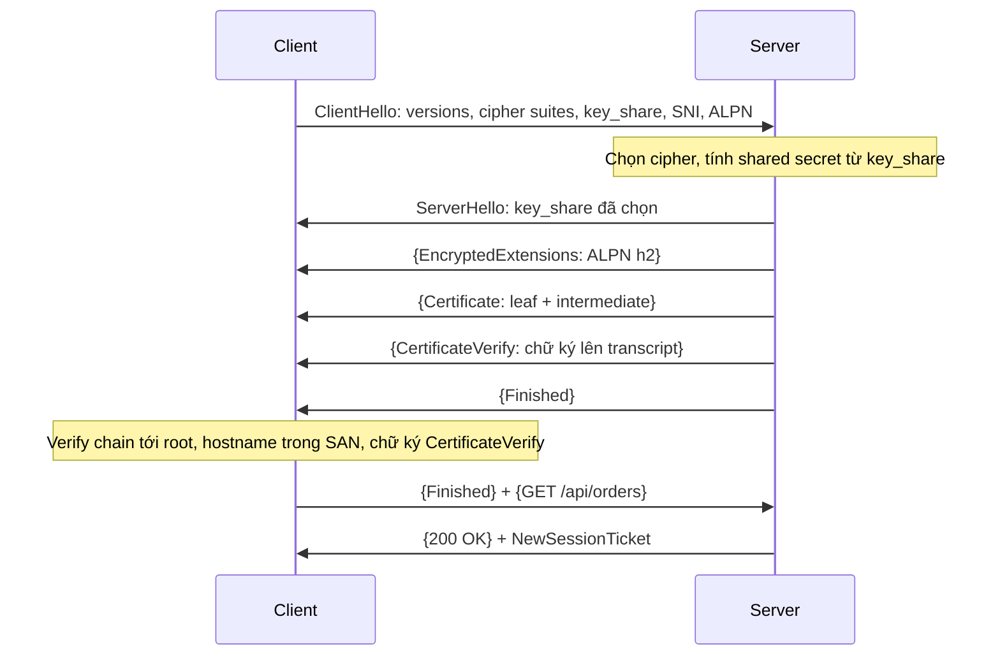
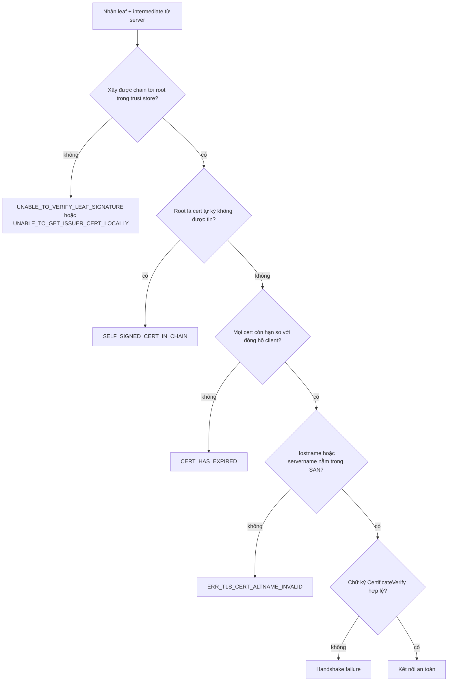

## Bối cảnh & vấn đề

Một service Node gọi API nội bộ `https://billing.corp.internal` và nhận lỗi `UNABLE_TO_VERIFY_LEAF_SIGNATURE`. Mở cùng URL bằng Chrome thì thấy ổ khoá xanh bình thường. Một đồng nghiệp đề xuất "fix nhanh": đặt `NODE_TLS_REJECT_UNAUTHORIZED=0`. Lỗi biến mất, PR được merge. Ba tháng sau, bài pentest chỉ ra service đó chấp nhận **bất kỳ certificate nào**, kể cả certificate do kẻ tấn công tự ký trên một máy trong cùng mạng. Toàn bộ token gọi billing có thể bị đọc trộm.

Câu chuyện này lặp lại ở rất nhiều team, vì TLS thường chỉ được hiểu ở mức "HTTPS là HTTP có mã hoá". Để debug được lỗi certificate, chọn nơi terminate TLS, hay trả lời câu interview "public key trong certificate dùng để làm gì", bạn cần biết TLS đảm bảo **những gì**, handshake diễn ra thế nào, và tại sao browser và Node lại cư xử khác nhau với cùng một server.

Một hiểu lầm rất phổ biến (kể cả trong nhiều tài liệu phổ thông) là mô hình "server gửi public key, client dùng nó mã hoá dữ liệu, server dùng private key giải mã". Đó là mô tả gần đúng của **RSA key transport** trong TLS 1.2 trở về trước, và nó đã bị **loại bỏ hoàn toàn khỏi TLS 1.3**. Bài này mô tả đúng cơ chế hiện hành.

## Khái niệm

### Ba đảm bảo của TLS

**TLS** (Transport Layer Security) chạy giữa TCP và HTTP, cung cấp ba đảm bảo. **Bảo mật** (confidentiality): người ở giữa không đọc được nội dung. **Toàn vẹn** (integrity): mọi thay đổi trên đường truyền đều bị phát hiện. **Xác thực server** (authentication): client chắc chắn đang nói chuyện với chủ sở hữu thật của hostname, không phải kẻ mạo danh. Tuỳ chọn thêm, **mTLS** (mutual TLS) cho phép server xác thực cả client bằng certificate.

Điều TLS **không** che giấu: IP nguồn/đích, kích thước và thời điểm của gói, và (nếu không có ECH) **hostname trong SNI**. Người ở giữa không đọc được path `/api/orders/42` hay header `Authorization`, nhưng biết bạn đang kết nối tới `api.example.com`.

HTTPS đơn giản là HTTP chạy bên trong TLS, mặc định port 443. "SSL" là tên các phiên bản cũ (SSL 2.0/3.0) đã bị cấm từ lâu; ngày nay chỉ nên bật TLS 1.2 và 1.3.

**Interview angle:** khi được hỏi "HTTPS bảo vệ gì", nêu đủ ba đảm bảo và cả những gì không được che (SNI, IP, kích thước) là câu trả lời senior.

### Mật mã đối xứng, bất đối xứng và key exchange

**Mật mã đối xứng** (symmetric) dùng cùng một khoá để mã hoá và giải mã; rất nhanh (AES-GCM có tăng tốc phần cứng, hàng GB/s). Vấn đề là hai bên phải có **chung một khoá bí mật** mà chưa từng gặp nhau. **Mật mã bất đối xứng** (asymmetric) dùng cặp khoá public/private; chậm hơn nhiều bậc, nhưng giải quyết được bài toán tin cậy và trao đổi khoá.

TLS 1.3 kết hợp cả hai. Trong handshake, hai bên dùng **ephemeral (EC)DHE** (Elliptic Curve Diffie-Hellman Ephemeral): mỗi bên sinh một cặp khoá **tạm thời** cho riêng connection này, gửi public part trong message `key_share`, rồi mỗi bên tự kết hợp private part của mình với public part của bên kia để ra cùng một **shared secret**. Không ai gửi secret qua mạng; người nghe lén thấy hai public part nhưng không tính ra được secret. Từ shared secret, cả hai dùng HKDF để suy ra các **session key đối xứng**, và mọi dữ liệu ứng dụng được mã hoá bằng **AEAD** (AES-128/256-GCM hoặc ChaCha20-Poly1305), vừa mã hoá vừa chống sửa đổi.

Ví dụ: output của Node khi kết nối tới server TLS 1.3 hiển thị cipher `TLS_AES_256_GCM_SHA384`: AES-256 ở chế độ GCM cho dữ liệu, SHA-384 cho key schedule. Không có tên thuật toán key exchange hay chữ ký trong cipher suite nữa, vì TLS 1.3 tách chúng ra thành extension riêng.

**Interview angle:** câu "session key được thiết lập thế nào trong TLS 1.3" cần có ba từ khoá: ephemeral (EC)DHE, `key_share`, và symmetric AEAD cho dữ liệu.

### Certificate public key dùng để ký, không phải để mã hoá dữ liệu

Nếu key exchange đã lo phần bí mật, thì certificate để làm gì? Để **chống man-in-the-middle**. (EC)DHE một mình không biết mình đang trao đổi khoá với ai; kẻ ở giữa có thể làm DH với client và một DH khác với server. Certificate gắn **public key dài hạn** của server với **hostname**, được một **CA** (Certificate Authority) mà client tin cậy ký xác nhận.

Trong handshake TLS 1.3, server gửi certificate rồi gửi message **`CertificateVerify`**: một **chữ ký** bằng private key dài hạn lên hash của toàn bộ transcript handshake tới lúc đó (bao gồm cả các `key_share`). Client verify chữ ký bằng public key trong certificate. Chỉ người nắm private key mới tạo được chữ ký đó, và chữ ký ràng buộc với chính các key_share của phiên này, nên kẻ ở giữa không thể thay key_share của mình vào.

Tóm lại: public key trong certificate được dùng để **xác minh chữ ký** (chứng minh danh tính), không dùng để mã hoá dữ liệu hay mã hoá session key trong TLS 1.3. Mô hình "client mã hoá pre-master secret bằng public key của server" là RSA key transport của TLS 1.2, đã bị loại vì không có forward secrecy.

**Interview angle:** red flag lớn nhất ở câu này là "public key của server mã hoá toàn bộ dữ liệu client gửi"; interviewer sẽ đào tiếp để xem bạn chỉ biết mô hình TLS 1.2 cũ hay không.

### Forward secrecy

**Forward secrecy** (hay perfect forward secrecy) nghĩa là: nếu private key dài hạn của server bị lộ trong tương lai, kẻ đã ghi lại traffic cũ vẫn **không** giải mã được. Với ephemeral (EC)DHE, session key phụ thuộc vào khoá tạm thời mà hai bên xoá ngay sau handshake; private key dài hạn chỉ dùng để ký. Lộ nó cho phép mạo danh server **từ đó về sau**, nhưng không mở được quá khứ.

Với RSA key transport (TLS 1.2), pre-master secret được mã hoá bằng public key dài hạn. Ai có private key và bản ghi traffic cũ thì giải mã được mọi phiên đã ghi. Đó là lý do TLS 1.3 chỉ cho phép key exchange có forward secrecy.

Ví dụ: một server bị lộ private key do backup rơi ra ngoài một năm sau. Với TLS 1.3, kẻ tấn công từng ghi lại traffic năm ngoái vẫn không đọc được gì; họ chỉ có thể mạo danh server cho tới khi certificate bị thu hồi và thay mới.

**Interview angle:** follow-up quen thuộc: "nếu private key lộ sau một năm thì sao?"; trả lời bằng phân biệt "mạo danh tương lai" và "giải mã quá khứ".

### Certificate chain và trust store

Certificate của server (**leaf**) thường không do root CA ký trực tiếp mà do một **intermediate CA** ký; intermediate lại do **root CA** ký. Root CA nằm sẵn trong **trust store** của client (browser, OS, hoặc Node). Để verify, client phải xây được chuỗi leaf → intermediate → root, kiểm tra từng chữ ký, hạn hiệu lực (`notBefore`/`notAfter`), mục đích sử dụng (key usage), và **hostname khớp SAN** (Subject Alternative Name; trường CN đã bị các client hiện đại bỏ qua).

Server có trách nhiệm gửi **leaf + intermediate(s)** trong handshake. Nhiều server cấu hình sai chỉ gửi leaf. Browser thường vẫn chạy được vì chúng **cache intermediate** đã gặp trước đó hoặc tự tải intermediate qua URL trong trường AIA của certificate. Node **không** làm vậy, nên Node báo `UNABLE_TO_VERIFY_LEAF_SIGNATURE` trong khi Chrome hiện ổ khoá xanh. Thêm một khác biệt: Node dùng **bộ CA đóng gói sẵn** (từ Mozilla) chứ mặc định không đọc trust store của OS, nên CA nội bộ mà IT cài vào máy không có tác dụng với Node cho tới khi bạn dùng `NODE_EXTRA_CA_CERTS`, option `ca`, hoặc cờ `--use-system-ca` ở các bản Node mới (verify).

Các lỗi thường gặp trong Node:

- `UNABLE_TO_VERIFY_LEAF_SIGNATURE` / `UNABLE_TO_GET_ISSUER_CERT_LOCALLY`: thiếu intermediate, hoặc CA không nằm trong trust store của Node.
- `SELF_SIGNED_CERT_IN_CHAIN` / `DEPTH_ZERO_SELF_SIGNED_CERT`: chain kết thúc ở một certificate tự ký không được tin (thường là proxy TLS interception hoặc môi trường dev).
- `CERT_HAS_EXPIRED` / `CERT_NOT_YET_VALID`: hết hạn, hoặc **đồng hồ máy client lệch**.
- `ERR_TLS_CERT_ALTNAME_INVALID`: hostname không nằm trong SAN.

**Interview angle:** giải thích được "vì sao browser chạy mà Node lỗi" (intermediate cache/AIA và trust store riêng) là dấu hiệu bạn từng debug chuyện này thật.

### SNI và ALPN

**SNI** (Server Name Indication, RFC 6066) là extension trong ClientHello chứa hostname client muốn tới. Một IP (một load balancer, một CDN edge) phục vụ hàng nghìn domain; không có SNI, server không biết nên trình certificate nào và trả certificate mặc định, dẫn tới hostname mismatch. Load balancer L4 và proxy cũng có thể **route theo SNI** mà không cần giải mã (TLS passthrough). SNI đi ở dạng plaintext; **ECH** (Encrypted Client Hello) là cơ chế mới mã hoá phần này (verify trạng thái hỗ trợ ở client và CDN của bạn).

**ALPN** (Application-Layer Protocol Negotiation, RFC 7301) cho phép client gửi danh sách protocol (`h2`, `http/1.1`) trong ClientHello, server chọn một trong ServerHello. Nhờ vậy việc chọn HTTP/2 không tốn thêm round-trip nào.

Ví dụ: gọi `https://10.0.3.14` trực tiếp bằng IP. Client không gửi SNI (SNI không cho phép địa chỉ IP), server trả certificate mặc định cho `*.internal.example.com`, và verify hostname thất bại vì `10.0.3.14` không có trong SAN. Cách sửa: gọi bằng hostname (qua DNS nội bộ hay `/etc/hosts`), hoặc trong Node đặt `servername: 'pricing.internal.example.com'` để gửi SNI và verify theo hostname đó, hoặc cấp certificate có **IP SAN**.

**Interview angle:** câu follow-up hay gặp: "gọi service bằng IP thì làm sao cho verify đúng?"; câu trả lời an toàn là dùng `servername` hoặc IP SAN, tuyệt đối không tắt verify.

### Session resumption và 0-RTT

Sau handshake đầy đủ, server TLS 1.3 có thể gửi **session ticket** (một PSK, pre-shared key). Lần kết nối sau, client trình ticket để bỏ qua xác thực certificate và rút ngắn handshake. Nếu cả hai bên cho phép, client còn có thể gửi **early data (0-RTT)**: dữ liệu ứng dụng mã hoá bằng khoá suy ra từ PSK, gửi ngay trong flight đầu cùng ClientHello, tiết kiệm trọn một RTT.

Cái giá là **replay**: early data không có cơ chế chống phát lại của handshake đầy đủ. Kẻ ở giữa có thể ghi lại flight đầu và gửi lại nhiều lần; server (hoặc nhiều server khác nhau trong cluster không chia sẻ trạng thái chống replay) có thể xử lý cùng một request nhiều lần. Early data cũng có forward secrecy yếu hơn vì phụ thuộc vào PSK. RFC 8446 yêu cầu ứng dụng chỉ dùng 0-RTT cho request an toàn khi bị lặp lại.

RFC 8470 định nghĩa cách HTTP xử lý: proxy/CDN nhận request qua early data và chuyển tiếp thì thêm header **`Early-Data: 1`**; origin nếu không muốn rủi ro có thể trả **`425 Too Early`**, buộc client gửi lại sau khi handshake hoàn tất.

**Interview angle:** trả lời đủ "0-RTT tiết kiệm 1 RTT nhưng có thể bị replay, nên chỉ cho request idempotent; origin dùng `Early-Data` và `425`" là điểm tối đa.

## Cơ chế hoạt động

Handshake TLS 1.3 đầy đủ (1-RTT). Ngoặc nhọn là phần đã được mã hoá bằng handshake key:



Từng bước:

1. **ClientHello** mang mọi thứ server cần để chốt ngay trong một lượt: các phiên bản và cipher suite hỗ trợ, `key_share` (public part của khoá tạm thời, client đoán trước nhóm đường cong như X25519), SNI và ALPN. Đây là lý do TLS 1.3 chỉ tốn 1 RTT, còn TLS 1.2 cần một lượt riêng để thoả thuận rồi mới trao đổi khoá.
2. **ServerHello** trả `key_share` của server. Từ lúc này cả hai đã có shared secret, nên mọi thứ tiếp theo đều được mã hoá, **kể cả certificate** (TLS 1.2 gửi certificate dạng plaintext).
3. **Certificate + CertificateVerify**: server chứng minh danh tính bằng chữ ký lên transcript. **Finished** là MAC trên toàn bộ transcript, chống việc ai đó sửa bất kỳ message nào trong handshake (ví dụ ép hạ phiên bản).
4. Client verify rồi gửi **Finished** kèm luôn request HTTP đầu tiên. Server trả response và thường gửi thêm **NewSessionTicket** cho lần sau.

Quá trình verify certificate phía client, và các nhánh sinh ra lỗi quen thuộc của Node:



Mỗi nhánh lỗi gợi ý một hướng sửa khác nhau: thiếu intermediate thì sửa **server** (gửi full chain); CA nội bộ thì thêm CA vào **client** (`NODE_EXTRA_CA_CERTS`, option `ca`); hết hạn thì gia hạn hoặc sửa đồng hồ; sai hostname thì sửa SAN hoặc cách gọi. Không nhánh nào có câu trả lời đúng là "tắt verify".

## Ví dụ thực tế

### Tái hiện lỗi certificate với CA nội bộ

Tạo một CA nội bộ và certificate cho `pricing.internal` (SAN gồm `pricing.internal`, `localhost`) bằng `openssl`, rồi gọi server từ Node theo ba cách:

```ts
import https from "node:https";
import fs from "node:fs";
import { once } from "node:events";

const server = https.createServer(
  { key: fs.readFileSync("srv.key"), cert: fs.readFileSync("srv.crt") },
  (_req, res) => res.end("ok"),
);
server.listen(8443, "127.0.0.1");
await once(server, "listening");

function call(label: string, opts: https.RequestOptions) {
  return new Promise<void>((resolve) => {
    https.get({ host: "127.0.0.1", port: 8443, path: "/", ...opts }, (res) => {
      const s = res.socket as import("node:tls").TLSSocket;
      console.log(`${label}: ${res.statusCode} ${s.getProtocol()} ${s.getCipher().name} alpn=${s.alpnProtocol}`);
      res.resume(); resolve();
    }).on("error", (e: NodeJS.ErrnoException) => { console.log(`${label}: ${e.code} ${e.message}`); resolve(); });
  });
}

await call("1. default trust store    ", { servername: "pricing.internal" });
await call("2. ca: internal CA        ", { servername: "pricing.internal", ca: fs.readFileSync("ca.crt") });
await call("3. ca ok, wrong servername", { servername: "billing.internal", ca: fs.readFileSync("ca.crt") });
server.close();
```

Output trên Node 24:

```text
1. default trust store    : UNABLE_TO_VERIFY_LEAF_SIGNATURE unable to verify the first certificate; if the root CA is installed locally, try running Node.js with --use-system-ca
2. ca: internal CA        : 200 TLSv1.3 TLS_AES_256_GCM_SHA384 alpn=false
3. ca ok, wrong servername: ERR_TLS_CERT_ALTNAME_INVALID Hostname/IP does not match certificate's altnames: Host: billing.internal. is not in the cert's altnames: DNS:pricing.internal, DNS:localhost
```

Ba điểm đáng chú ý. Lần 1, trust store mặc định của Node không biết CA nội bộ, và thông báo lỗi của Node 24 gợi ý luôn cờ `--use-system-ca`. Lần 2, thêm CA qua option `ca` là đủ: TLS 1.3 với AES-256-GCM, và `alpn=false` vì client không đề nghị ALPN nào. Lần 3 cho thấy option `servername` quyết định hostname được verify, đây cũng chính là cách gọi service bằng IP mà vẫn verify đúng. Ở production, thay vì truyền `ca` ở từng chỗ, đặt `NODE_EXTRA_CA_CERTS=/etc/ssl/internal-ca.pem` cho process.

### Chặn 0-RTT cho endpoint không idempotent

CDN bật 0-RTT mặc định và gắn `Early-Data: 1` khi chuyển tiếp request nhận qua early data. Origin từ chối các request có side effect:

```ts
import express from "express";

const app = express();
const EARLY_DATA_SAFE = new Set(["GET", "HEAD", "OPTIONS"]);

app.use((req, res, next) => {
  if (req.get("early-data") === "1" && !EARLY_DATA_SAFE.has(req.method)) {
    // RFC 8470: tell the client to retry after the handshake completes
    return res.status(425).send("Too Early");
  }
  next();
});

app.post("/checkout", (_req, res) => res.status(201).json({ orderId: "ord_123" }));
```

Request minh hoạ (illustrative, giả lập header mà CDN sẽ thêm):

```text
$ curl -s -o /dev/null -w "%{http_code}\n" -X POST -H "Early-Data: 1" http://localhost:3000/checkout
425
$ curl -s -o /dev/null -w "%{http_code}\n" -X POST http://localhost:3000/checkout
201
```

Browser nhận `425` sẽ tự gửi lại sau khi handshake hoàn tất. Dù vậy, `POST /checkout` vẫn nên có **idempotency key** vì replay không chỉ tới từ 0-RTT mà còn từ retry của client và proxy.

## Trade-offs & lựa chọn thay thế

| Nơi terminate TLS | Ưu | Nhược | Khi nào dùng |
| --- | --- | --- | --- |
| Tại load balancer, HTTP tới backend | Cert tập trung (ACM tự gia hạn), LB đọc HTTP để route/WAF, backend nhẹ CPU | Plaintext trong VPC, ai vào được mạng nội bộ có thể sniff | Phần lớn web app trong VPC tin cậy |
| Tại LB rồi re-encrypt tới backend | Mã hoá cả đoạn nội bộ, LB vẫn route L7 được | Phải cấp và xoay cert cho backend, tốn CPU hai lần | Compliance (PCI DSS, HIPAA), zero-trust |
| Passthrough ở L4, backend terminate | End-to-end thật, LB không thấy nội dung | LB không route theo path/header, không WAF, backend giữ private key | Yêu cầu backend giữ khoá, protocol không phải HTTP |
| mTLS giữa service (service mesh) | Mã hoá + xác thực danh tính từng service | Hạ tầng mesh, vận hành CA nội bộ, debug khó hơn | Microservices nhiều team, zero-trust |

Khi nào chọn gì. Terminate ở LB là mặc định hợp lý cho đa số hệ thống: vận hành đơn giản, và LB cần thấy HTTP để làm những việc có giá trị (routing, WAF, header `X-Forwarded-*`). Khi có yêu cầu compliance hoặc mô hình zero-trust ("mạng nội bộ không được tin"), thêm **re-encrypt** hoặc **mTLS qua mesh**; mesh còn cho bạn xác thực service-to-service, thứ mà re-encrypt đơn thuần không có. Passthrough chỉ nên dùng khi thật sự cần backend giữ khoá hoặc khi giao thức không phải HTTP. Với việc xoay certificate cho 200 pod, đừng tự viết script: dùng cert-manager (Kubernetes) hoặc CA của mesh với certificate ngắn hạn tự gia hạn, và reload không downtime (server đọc lại cert khi file đổi, hoặc `tls.Server#setSecureContext` trong Node).

Về 0-RTT: bật ở edge cho các request đọc là lợi ích rõ ràng trên mạng RTT cao; chỉ cần origin xử lý `Early-Data` cho các endpoint có side effect.

## Edge cases & failure modes

- **Server không gửi intermediate**: browser chạy, Node/curl/Java lỗi; luôn kiểm tra bằng `openssl s_client -showcerts` hoặc công cụ kiểm tra SSL sau mỗi lần thay cert.
- **Certificate hết hạn lúc nửa đêm**: nguyên nhân outage kinh điển; tự động gia hạn (ACME, ACM) và alert trước 14–30 ngày. Thời hạn tối đa của certificate công khai đang được CA/Browser Forum rút ngắn dần theo lộ trình (200 ngày từ 2026, tiến tới 47 ngày) (verify), nên gia hạn thủ công sẽ không còn khả thi.
- **Đồng hồ lệch**: VM hay thiết bị không đồng bộ NTP thấy certificate chưa hiệu lực hoặc đã hết hạn.
- **TLS interception của proxy doanh nghiệp**: proxy thay certificate bằng certificate do CA nội bộ của họ ký; client pin certificate hoặc không tin CA đó sẽ lỗi. SDK dùng certificate pinning sẽ ngừng hoạt động hoàn toàn trong mạng đó.
- **Client cũ chỉ hỗ trợ TLS 1.0/1.1**: tắt các phiên bản cũ làm vỡ thiết bị hay SDK cũ của đối tác; đo tỉ lệ handshake theo version trước khi tắt.
- **Replay 0-RTT trong cluster**: chống replay dựa trên bộ nhớ của từng server; nhiều edge server không chia sẻ trạng thái nên cùng một early data có thể được chấp nhận ở hai nơi.
- **`NODE_TLS_REJECT_UNAUTHORIZED=0` lọt vào production**: tắt verify cho **mọi** connection của process, không chỉ connection bạn định sửa.

## Pitfalls

- ❌ Nói "public key của server mã hoá dữ liệu client gửi" → ✅ TLS 1.3 dùng ephemeral (EC)DHE để có session key, public key trong certificate chỉ để **ký** `CertificateVerify`.
- ❌ `NODE_TLS_REJECT_UNAUTHORIZED=0` hoặc `rejectUnauthorized: false` để "fix" lỗi cert → ✅ sửa server gửi full chain, hoặc thêm CA nội bộ qua `NODE_EXTRA_CA_CERTS`/`ca`, vì tắt verify mở cửa cho MITM.
- ❌ Thấy browser chạy là kết luận cert đúng → ✅ kiểm tra bằng `openssl s_client -connect host:443 -servername host -showcerts`, vì browser tự vá chain thiếu intermediate.
- ❌ Gọi service bằng IP rồi tắt verify vì hostname mismatch → ✅ đặt `servername` hoặc cấp cert có IP SAN.
- ❌ Bật 0-RTT cho mọi request → ✅ chỉ cho request idempotent; origin trả `425 Too Early` khi thấy `Early-Data: 1` trên endpoint có side effect.
- ❌ Gia hạn certificate bằng lịch nhắc thủ công → ✅ ACME/ACM tự động + alert hết hạn, vì thời hạn cert đang ngắn dần.
- ❌ Coi mạng nội bộ là an toàn mặc định khi có yêu cầu compliance → ✅ re-encrypt hoặc mTLS cho đoạn LB tới backend.

## Tóm tắt

- TLS đảm bảo **bảo mật, toàn vẹn, xác thực server**; không che IP, kích thước gói và (nếu không có ECH) SNI.
- TLS 1.3: **1 RTT**, key exchange bằng **ephemeral (EC)DHE** qua `key_share`, dữ liệu mã hoá bằng AEAD đối xứng; RSA key transport đã bị loại.
- Public key trong certificate dùng để **ký `CertificateVerify`** lên transcript, chống MITM; không dùng để mã hoá dữ liệu.
- **Forward secrecy**: lộ private key sau này không giải mã được traffic đã ghi, chỉ cho phép mạo danh về sau.
- Client verify chain leaf → intermediate → root, hạn, SAN; Node không tự tải intermediate và dùng trust store riêng, nên Node lỗi khi browser vẫn chạy.
- **SNI** chọn certificate theo hostname, **ALPN** chọn `h2`/`http/1.1` trong handshake; gọi bằng IP thì dùng `servername` hoặc IP SAN.
- **0-RTT** tiết kiệm 1 RTT nhưng có thể bị replay: chỉ cho request idempotent, dùng `Early-Data` và `425 Too Early`.
- Terminate ở LB là mặc định; re-encrypt hoặc mTLS khi cần compliance/zero-trust; tự động hoá gia hạn và xoay cert.
