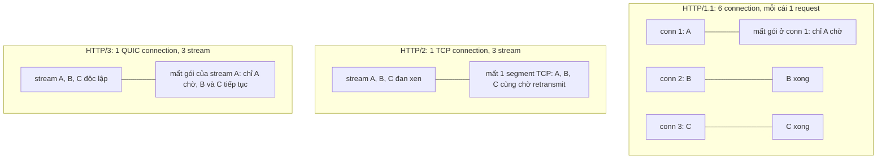
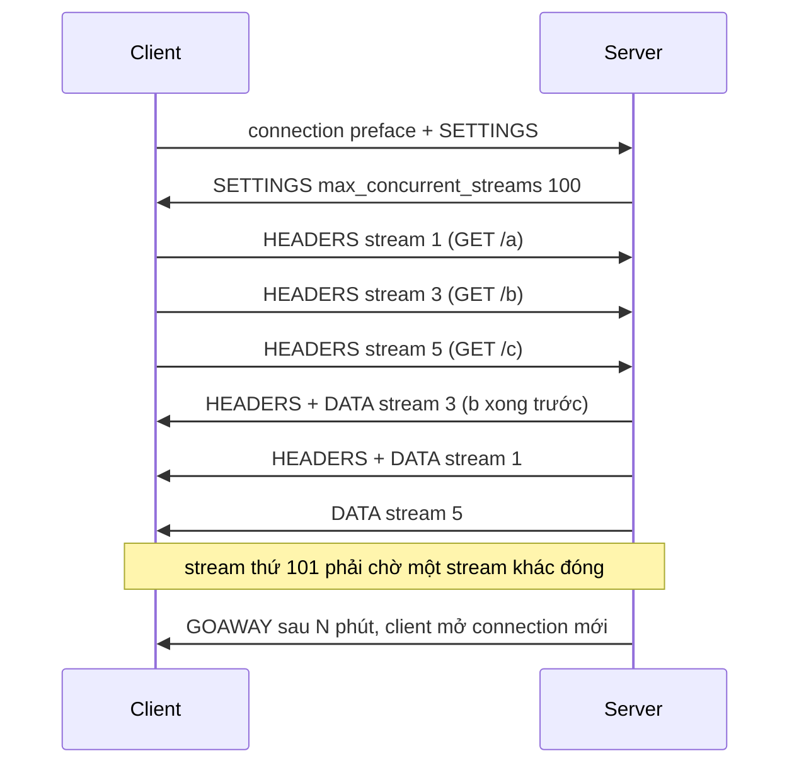

## Bối cảnh & vấn đề

Hai sự cố có vẻ không liên quan. Sự cố thứ nhất: sau một đợt mạng chập chờn, bộ phận hỗ trợ nhận hàng chục khiếu nại "bị trừ tiền hai lần". Log cho thấy mobile SDK có cơ chế tự retry khi timeout, và nó retry cả `POST /checkout`. Request đầu thực ra đã thành công ở server; chỉ có response bị mất trên đường về.

Sự cố thứ hai: team chuyển service-to-service từ HTTP/1.1 sang gRPC (chạy trên HTTP/2) để "nhanh hơn". Sau khi scale từ 3 lên 10 pod, một pod chạy 90% CPU còn 9 pod gần như rảnh. Load balancer L4 không hề lỗi; nó chỉ phân phối **connection**, và client gRPC chỉ mở **một** connection.

Cả hai đều bắt nguồn từ việc hiểu HTTP ở mức "gửi request, nhận response". Thực tế HTTP có hai lớp cần nắm: **ngữ nghĩa** (method nào an toàn để lặp lại, status code nghĩa là gì, theo RFC 9110) và **cách truyền trên dây** (HTTP/1.1, HTTP/2, HTTP/3 dùng connection khác nhau thế nào). Ngữ nghĩa quyết định retry có an toàn không; cách truyền quyết định latency, cân bằng tải và những kiểu lỗi mới ở scale lớn.

## Khái niệm

### Safe và idempotent

RFC 9110 định nghĩa hai tính chất của method. **Safe**: client không yêu cầu và không mong đợi thay đổi state trên server; về mặt ngữ nghĩa đây là thao tác chỉ đọc. Các method safe: `GET`, `HEAD`, `OPTIONS`, `TRACE`. **Idempotent**: gửi cùng request N lần có **tác dụng lên server** giống gửi 1 lần. Các method idempotent: mọi method safe cộng thêm `PUT` và `DELETE`.

`POST` **không** idempotent: hai lần `POST /orders` tạo hai đơn. `PATCH` không được RFC đảm bảo idempotent: `PATCH {"op":"increment","path":"/stock"}` chạy hai lần là trừ hai lần, dù `PATCH {"status":"shipped"}` thì idempotent trên thực tế.

Hai điểm hay bị hiểu sai. Thứ nhất, idempotent nói về **tác dụng phụ**, không phải response: `DELETE /orders/42` lần đầu trả `204`, lần hai trả `404`, nhưng state cuối cùng giống nhau (đơn không còn). Thứ hai, đây là **cam kết ngữ nghĩa**: server có thể cài đặt `GET` gây side effect (ghi log thì không sao, nhưng `GET /unsubscribe?id=...` xoá dữ liệu thì là lỗi thiết kế), và các tầng trung gian sẽ tin cam kết đó.

**Interview angle:** câu hỏi quen: "`DELETE` trả 404 lần hai thì có còn idempotent không?"; trả lời: có, vì idempotent là về state trên server, không phải status code.

### Vì sao ngữ nghĩa quyết định retry

Nhiều tầng tự động retry mà ứng dụng không hay biết: browser retry request trên connection keep-alive bị đóng, proxy (Nginx `proxy_next_upstream`, Envoy retry policy) retry sang upstream khác, SDK và thư viện HTTP retry khi timeout. Các tầng này dựa vào method để quyết định: RFC 9110 cho phép client tự động retry request idempotent, và các proxy mặc định chỉ retry method idempotent (Nginx mặc định không chuyển request non-idempotent sang upstream khác, verify).

Bài toán gốc là **không phân biệt được "request chưa tới" với "response bị mất"**. Khi timeout, client không biết server đã xử lý chưa. Với `GET` hay `PUT`, gửi lại luôn an toàn. Với `POST`, gửi lại có thể tạo bản ghi trùng. Đó chính là sự cố "trừ tiền hai lần" ở đầu bài.

**Interview angle:** nói được "timeout không cho biết request đã được xử lý hay chưa" là điểm cốt lõi; mọi thiết kế retry đều xoay quanh câu đó.

### Idempotency key

**Idempotency key** biến một `POST` thành an toàn để retry. Client sinh một ID duy nhất (UUID) cho mỗi **ý định** nghiệp vụ (một lần bấm "Thanh toán"), gửi kèm header `Idempotency-Key`, và dùng lại đúng key đó khi retry. Server lưu kết quả theo key: lần đầu thì thực hiện và lưu response; lần sau với cùng key thì trả lại response đã lưu mà không thực hiện lại. Cách làm này được Stripe phổ biến và đang được IETF chuẩn hoá (draft `Idempotency-Key`, verify trạng thái).

Các chi tiết làm nên một cài đặt đúng: lưu key **nguyên tử** cùng với side effect (cùng transaction DB, hoặc unique constraint trên key), xử lý request **đang chạy** với cùng key (trả `409 Conflict` thay vì chạy song song), so khớp **fingerprint** của body để phát hiện key bị dùng lại cho request khác (trả `422`), đặt **TTL** cho key (ví dụ 24 giờ), và **scope** key theo user/tenant để người này không đoán được key của người kia.

**Interview angle:** câu follow-up "cài đặt `Idempotency-Key` cho checkout thế nào" chấm điểm ở chi tiết: atomic với side effect, xử lý concurrent, fingerprint, TTL.

### HTTP/1.1: một request đang bay mỗi connection

**HTTP/1.1** (RFC 9112) là giao thức text: request line, header, dòng trống, body. Connection mặc định persistent, nhưng tại một thời điểm mỗi connection chỉ xử lý **một** request/response. **Pipelining** (gửi nhiều request liên tiếp không chờ response) có trong spec nhưng response vẫn phải trả **theo thứ tự**, nên một response chậm chặn mọi response sau nó; cộng với nhiều proxy cài đặt sai, pipelining thực tế không được browser nào bật.

Hệ quả là **head-of-line blocking ở tầng HTTP**: request chậm chặn request sau trên cùng connection. Browser đối phó bằng cách mở khoảng **6 connection mỗi origin**; và web developer thời đó đối phó tiếp bằng **domain sharding** (chia asset ra `static1.`, `static2.` để có thêm connection), **concatenation** (gộp mọi JS thành một file), **sprite** ảnh. Mỗi connection thêm là một lần handshake và một lần slow start.

**Interview angle:** giải thích được vì sao có con số 6 connection và vì sao domain sharding từng hợp lý là nền để trả lời câu HTTP/2.

### HTTP/2: binary framing và multiplexing

**HTTP/2** (RFC 9113) giữ nguyên ngữ nghĩa HTTP (method, header, status) nhưng thay cách truyền. Mọi thứ được chia thành **frame** nhị phân (HEADERS, DATA, SETTINGS, RST_STREAM, GOAWAY...), mỗi frame thuộc một **stream** có ID. Nhiều stream **đan xen** trên cùng một TCP connection: đó là **multiplexing**. Header được nén bằng **HPACK** (bảng động lưu các header đã gửi, nên `cookie`, `user-agent`, `authorization` lặp lại gần như miễn phí).

HTTP/2 xoá HOL blocking ở tầng HTTP: response chậm của stream 3 không chặn stream 5. Một connection cho mỗi origin là đủ, và domain sharding trở thành **phản tác dụng** (thêm handshake, phá vỡ multiplexing và việc ưu tiên stream), concatenation cũng bớt cần thiết (nhiều file nhỏ không còn tốn thêm connection, lại cache tốt hơn khi chỉ một file đổi).

Nhưng HTTP/2 vẫn chạy trên **một TCP connection**. Mất một segment TCP thì kernel giữ lại mọi byte phía sau cho tới khi retransmit xong, bất kể chúng thuộc stream nào: **HOL blocking ở tầng TCP**. Trên mạng loss cao, một connection HTTP/2 có thể tệ hơn 6 connection HTTP/1.1 (mất gói trên một connection chỉ chặn 1/6 số request). Hai điểm nữa: mỗi bên công bố **`SETTINGS_MAX_CONCURRENT_STREAMS`** (RFC khuyến nghị không dưới 100), quá số đó thì request phải xếp hàng; và **Server Push** đã bị các browser lớn gỡ bỏ (Chrome từ bản 106, verify), nên dùng `103 Early Hints` hoặc `<link rel=preload>` thay thế.

**Interview angle:** câu trả lời đạt điểm tối đa cho HOL blocking nói rõ **tầng**: HTTP/1.1 ở tầng HTTP (theo connection), HTTP/2 hết ở tầng HTTP nhưng còn ở tầng TCP, HTTP/3 giải quyết ở tầng transport.

### HTTP/2 ở scale: cân bằng tải và Rapid Reset

Vì client HTTP/2 (đặc biệt gRPC) giữ **một connection sống rất lâu**, load balancer **L4** (chỉ thấy TCP) phân phối theo connection: 3 client × 1 connection thì tối đa 3 backend nhận tải, và pod mới thêm vào sau scale-out gần như không nhận gì cho tới khi connection cũ bị đóng. Cách sửa: dùng LB **L7** hiểu HTTP/2 và cân bằng theo **request/stream** (ALB, Envoy, Nginx với gRPC), hoặc **client-side load balancing** (gRPC resolver + `round_robin`), và giới hạn tuổi thọ connection ở server (gửi **GOAWAY** sau N phút hay N request, như `MAX_CONNECTION_AGE` của gRPC) để client kết nối lại và phân bố lại.

**Rapid Reset** (CVE-2023-44487, công bố tháng 10/2023) khai thác chính multiplexing: client mở stream rồi hủy ngay bằng `RST_STREAM`, lặp lại liên tục. Stream bị hủy không tính vào giới hạn concurrent streams, nhưng server vẫn tốn công khởi tạo và dọn dẹp từng stream. Một số ít connection tạo được tải khổng lồ; các CDN lớn ghi nhận những đợt DDoS kỷ lục khi đó. Bản vá (trong Nginx, Envoy, Node.js, Go, và các LB cloud) giới hạn tốc độ reset; bài học là mọi component nói HTTP/2 với Internet phải được vá và theo dõi.

**Interview angle:** câu "gRPC sau L4 LB, một pod 90% CPU" gần như luôn có đáp án "một connection dài bị ghim vào một pod"; nêu được hai hướng sửa (L7 hoặc client-side LB + max connection age) là đủ.

### HTTP/3 và QUIC

**HTTP/3** (RFC 9114) ánh xạ ngữ nghĩa HTTP lên **QUIC** (RFC 9000). Mỗi request là một QUIC stream với loss recovery **độc lập**, nên mất gói chỉ chặn stream liên quan: HOL blocking được giải quyết ở tầng transport. Header nén bằng **QPACK** (RFC 9204), biến thể của HPACK chịu được việc các stream tới không theo thứ tự. Handshake gộp transport + TLS 1.3 trong 1 RTT, và **connection migration** giữ connection khi client đổi mạng (xem [hành trình request](/tracks/networking/learn/request-journey)).

Client không biết trước server hỗ trợ HTTP/3 (vì phải thử UDP). Server quảng bá qua header **`Alt-Svc: h3=":443"; ma=86400`** trong response HTTP/1.1 hoặc HTTP/2, hoặc qua **bản ghi DNS HTTPS** (`alpn="h3"`). Client ghi nhớ và lần sau thử QUIC, đồng thời vẫn sẵn sàng **fallback về TCP** nếu UDP bị chặn. Vì vậy bật HTTP/3 ở edge gần như không có rủi ro vỡ kết nối.

**Interview angle:** câu hỏi rollout HTTP/3 chấm điểm ở chỗ bạn **đo trước** (RUM theo loại mạng, quốc gia), bật ở **edge/CDN** thay vì ở app, và theo dõi tỉ lệ fallback.

## Cơ chế hoạt động

So sánh ba phiên bản khi một gói tin bị mất trong lúc tải ba tài nguyên A, B, C:



Ở HTTP/1.1, mỗi connection chỉ mang một request, nên mất gói chỉ ảnh hưởng request trên connection đó; cái giá là nhiều connection, nhiều handshake, và HOL ở tầng HTTP khi có nhiều request hơn số connection. HTTP/2 gom mọi thứ vào một connection nên rẻ hơn nhiều khi mạng tốt, nhưng TCP không biết khái niệm stream: segment mất chặn cả connection. HTTP/3 chuyển khái niệm stream xuống transport nên loss recovery tách theo stream.

Luồng một client HTTP/2 multiplex nhiều request, và cách server giới hạn:



Stream do client mở có ID lẻ (1, 3, 5...). Response có thể về **theo bất kỳ thứ tự nào**: đó là khác biệt cốt lõi với pipelining của HTTP/1.1. `GOAWAY` là cách lịch sự để server yêu cầu client chuyển sang connection mới mà không làm hỏng stream đang chạy: rất hữu ích khi deploy, khi muốn phân bố lại tải, hay khi muốn client resolve lại DNS.

## Ví dụ thực tế

### HTTP/2 multiplexing vs 6 socket HTTP/1.1

Mỗi response mất 100 ms (giả lập một API call nhỏ). Gửi 60 request đồng thời qua một session HTTP/2, rồi qua HTTP/1.1 với giới hạn 6 socket như browser:

```ts
import http2 from "node:http2";
import http from "node:http";
import { once } from "node:events";
import { setTimeout as sleep } from "node:timers/promises";

// Each response takes 100 ms, like a small API call.
const h2server = http2.createServer({ settings: { maxConcurrentStreams: 100 } });
let h2conns = 0;
h2server.on("session", () => h2conns++);
h2server.on("stream", async (stream) => { await sleep(100); stream.respond({ ":status": 200 }); stream.end("ok"); });
h2server.listen(0, "127.0.0.1"); await once(h2server, "listening");

const h1server = http.createServer(async (_req, res) => { await sleep(100); res.end("ok"); });
let h1conns = 0;
h1server.on("connection", () => h1conns++);
h1server.listen(0, "127.0.0.1"); await once(h1server, "listening");

// HTTP/2: 60 concurrent requests on ONE session
const session = http2.connect(`http://127.0.0.1:${(h2server.address() as any).port}`);
let t0 = performance.now();
await Promise.all(Array.from({ length: 60 }, () => new Promise<void>((resolve) => {
  const req = session.request({ ":path": "/" });
  req.resume(); req.on("end", resolve); req.end();
})));
console.log(`HTTP/2   : 60 requests, ${h2conns} connection(s), ${(performance.now() - t0).toFixed(0)} ms`);
session.close();

// HTTP/1.1: same 60 requests, browser-like limit of 6 sockets per origin
const agent = new http.Agent({ keepAlive: true, maxSockets: 6 });
t0 = performance.now();
await Promise.all(Array.from({ length: 60 }, () => new Promise<void>((resolve) => {
  http.get({ host: "127.0.0.1", port: (h1server.address() as any).port, agent }, (res) => { res.resume(); res.on("end", resolve); });
})));
console.log(`HTTP/1.1 : 60 requests, ${h1conns} connection(s), ${(performance.now() - t0).toFixed(0)} ms`);
h1server.close(); h2server.close(); agent.destroy();
```

Output trên Node 24 (localhost, cleartext h2c):

```text
HTTP/2   : 60 requests, 1 connection(s), 114 ms
HTTP/1.1 : 60 requests, 6 connection(s), 1049 ms
```

Với HTTP/1.1, 60 request chia cho 6 connection thành 10 "đợt" nối tiếp, mỗi đợt 100 ms: HOL blocking ở tầng HTTP hiện ra rõ ràng. HTTP/2 chạy cả 60 song song trên một connection. Trên localhost không có mất gói nên không thấy được mặt trái (HOL ở tầng TCP); trên mạng thật loss cao, khoảng cách này thu hẹp hoặc đảo chiều.

### Idempotency key cho checkout

Server tối giản lưu kết quả theo key (production dùng Redis/Postgres với TTL và scope theo user):

```ts
import http from "node:http";
import { once } from "node:events";
import { randomUUID } from "node:crypto";

type Saved = { status: number; body: string; fingerprint: string } | "in-flight";
const store = new Map<string, Saved>(); // production: Redis/Postgres with TTL, scoped per user
let ordersCreated = 0;

const server = http.createServer(async (req, res) => {
  let raw = "";
  for await (const c of req) raw += c;
  const key = req.headers["idempotency-key"];
  if (typeof key !== "string") return void res.writeHead(400).end("Idempotency-Key required");

  const saved = store.get(key);
  if (saved === "in-flight") return void res.writeHead(409).end("request with this key is in progress");
  if (saved) {
    if (saved.fingerprint !== raw) return void res.writeHead(422).end("key reused with a different body");
    res.writeHead(saved.status, { "Idempotent-Replayed": "true" });
    return void res.end(saved.body);
  }
  store.set(key, "in-flight");
  const body = JSON.stringify({ orderId: `ord_${++ordersCreated}` }); // the side effect
  store.set(key, { status: 201, body, fingerprint: raw });
  res.writeHead(201).end(body);
});
server.listen(0, "127.0.0.1"); await once(server, "listening");
const url = `http://127.0.0.1:${(server.address() as { port: number }).port}/checkout`;

const key = randomUUID();
const send = (k: string, body: string) =>
  fetch(url, { method: "POST", headers: { "Idempotency-Key": k }, body });

for (const [label, k, body] of [
  ["first attempt      ", key, '{"cart":"c1"}'],
  ["retry after timeout", key, '{"cart":"c1"}'],
  ["same key, new body ", key, '{"cart":"c2"}'],
] as const) {
  const r = await send(k, body);
  console.log(label, r.status, r.headers.get("idempotent-replayed") ?? "-", await r.text());
}
console.log("orders actually created:", ordersCreated);
server.close();
```

Output:

```text
first attempt       201 - {"orderId":"ord_1"}
retry after timeout 201 true {"orderId":"ord_1"}
same key, new body  422 - key reused with a different body
orders actually created: 1
```

Retry nhận lại đúng response cũ, chỉ một đơn hàng được tạo. Ở hệ thống thật, bước "đánh dấu in-flight" phải là thao tác nguyên tử (`SET key NX` trong Redis, hoặc `INSERT ... ON CONFLICT DO NOTHING` với unique constraint) và kết quả phải được lưu **trong cùng transaction** với việc tạo đơn; nếu không, crash giữa hai bước vẫn có thể gây trùng hoặc mất.

## Trade-offs & lựa chọn thay thế

| Tiêu chí | HTTP/1.1 | HTTP/2 | HTTP/3 |
| --- | --- | --- | --- |
| Transport | TCP (+TLS) | TCP + TLS (h2), h2c hiếm dùng | QUIC trên UDP, TLS 1.3 bắt buộc |
| Song song | 1 request/connection, ~6 connection/origin | Multiplex nhiều stream/connection | Multiplex, stream độc lập ở transport |
| HOL blocking | Tầng HTTP, theo connection | Tầng TCP khi mất gói | Chỉ stream bị mất gói |
| Nén header | Không | HPACK | QPACK |
| Handshake mới | TCP + TLS (2 RTT với TLS 1.3) | Như HTTP/1.1 | 1 RTT, 0-RTT khi resume |
| Cân bằng tải | Nhiều connection, L4 cũng đều | Cần L7 hoặc client-side LB | Cần LB hỗ trợ QUIC/UDP |
| Debug, tooling | Dễ nhất, đọc được bằng mắt | Cần công cụ hiểu frame | Header mã hoá, cần key log |

Khi nào chọn gì. Với **browser ↔ edge**, bật HTTP/2 là mặc định và HTTP/3 ở CDN là lợi ích gần như miễn phí, đặc biệt cho mobile và mạng loss cao; origin phía sau CDN vẫn có thể là HTTP/1.1. Với **service-to-service**, pool HTTP/1.1 keep-alive đơn giản và cân bằng tải đều với mọi loại LB; HTTP/2 (gRPC) đáng giá khi có nhiều request nhỏ song song, streaming hai chiều, hay cần contract chặt, nhưng phải đi kèm L7 LB hoặc client-side LB và giới hạn tuổi thọ connection. HTTP/3 giữa các service trong datacenter hầu như không mang lại gì vì RTT rất nhỏ và gần như không mất gói.

Về rollout HTTP/3: đo RUM theo loại mạng và quốc gia trước, bật ở CDN cho một phần traffic, so sánh TTFB/p75 LCP/tỉ lệ lỗi giữa hai nhóm, theo dõi tỉ lệ fallback về TCP và CPU ở edge, và nhớ rằng 0-RTT cần xử lý riêng ở origin (xem [TLS](/tracks/networking/learn/tls-https)).

## Edge cases & failure modes

- **Retry không idempotent ở nhiều tầng**: SDK, proxy và app cùng retry `POST` khi timeout sẽ nhân đôi, nhân ba side effect; chỉ retry ở một tầng và chỉ khi có idempotency key.
- **Idempotency key không nguyên tử**: kiểm tra "key đã tồn tại chưa" rồi mới insert tạo race khi hai retry tới cùng lúc; dùng unique constraint hoặc `SET NX`.
- **`SETTINGS_MAX_CONCURRENT_STREAMS` quá nhỏ**: client HTTP/2 có hàng trăm request đồng thời trên một connection bị xếp hàng, latency tăng dù server rảnh; client tốt sẽ mở thêm connection khi chạm trần.
- **Connection HTTP/2 ghim vào một backend**: sau scale-out, pod mới rảnh; sau khi một pod chết, mọi client dồn vào các pod còn lại và giữ nguyên phân bố lệch đó.
- **Rapid Reset và các tấn công ở tầng frame**: server/proxy HTTP/2 chưa vá có thể bị làm cạn CPU bởi rất ít connection.
- **UDP bị chặn hoặc bị giới hạn tốc độ**: mạng doanh nghiệp, một số ISP; client phải fallback về TCP, và cài đặt chờ QUIC quá lâu trước khi fallback làm user chậm hơn.
- **Header quá lớn**: cookie phình to vượt giới hạn header của proxy (HTTP/2 có `SETTINGS_MAX_HEADER_LIST_SIZE`, Nginx có `large_client_header_buffers`) gây `431` hoặc `400` chỉ cho một số user.

## Pitfalls

- ❌ Cho SDK tự retry mọi request khi timeout → ✅ chỉ tự retry method idempotent; `POST` chỉ retry khi có `Idempotency-Key`, vì timeout không cho biết server đã xử lý hay chưa.
- ❌ Nghĩ `DELETE` trả 404 lần hai là "không idempotent" → ✅ idempotent là về state trên server, không phải status code.
- ❌ Giữ domain sharding và concatenation khi đã có HTTP/2 → ✅ một origin, nhiều file nhỏ cache độc lập, vì sharding thêm handshake và phá multiplexing.
- ❌ Đặt gRPC sau L4 LB rồi ngạc nhiên vì lệch tải → ✅ L7 LB theo request hoặc client-side LB, cộng max connection age.
- ❌ Thiết kế dựa vào HTTP/2 Server Push → ✅ `103 Early Hints` hoặc preload, vì browser lớn đã bỏ push.
- ❌ Bật HTTP/3 ở origin Node thay vì ở edge → ✅ bật ở CDN/edge, origin giữ HTTP/1.1 hoặc HTTP/2, quảng bá bằng `Alt-Svc`/DNS HTTPS record.
- ❌ Nói "HTTP/2 đã hết head-of-line blocking" → ✅ hết ở tầng HTTP, còn ở tầng TCP khi mất gói.

## Tóm tắt

- **Safe** = không đổi state (`GET`, `HEAD`, `OPTIONS`, `TRACE`); **idempotent** = N lần như 1 lần về state (safe + `PUT`, `DELETE`). `POST` không, `PATCH` không được đảm bảo.
- Retry tự động chỉ an toàn với request idempotent; `POST` cần **idempotency key** nguyên tử, có fingerprint và TTL.
- HTTP/1.1: một request/connection, HOL ở tầng HTTP, browser mở ~6 connection/origin.
- HTTP/2: binary frame, multiplex stream trên một TCP, HPACK; còn HOL ở tầng TCP; Server Push đã bị bỏ.
- HTTP/2 ở scale: connection dài làm L4 LB lệch tải (dùng L7/client-side LB + `GOAWAY`/max age); vá Rapid Reset (CVE-2023-44487).
- HTTP/3 = HTTP trên QUIC: stream độc lập ở transport, QPACK, 1-RTT, connection migration; quảng bá qua `Alt-Svc` hoặc DNS HTTPS record, luôn có fallback TCP.
- Rollout HTTP/3: đo RUM trước, bật ở edge, so sánh theo nhóm, theo dõi fallback và 0-RTT.
