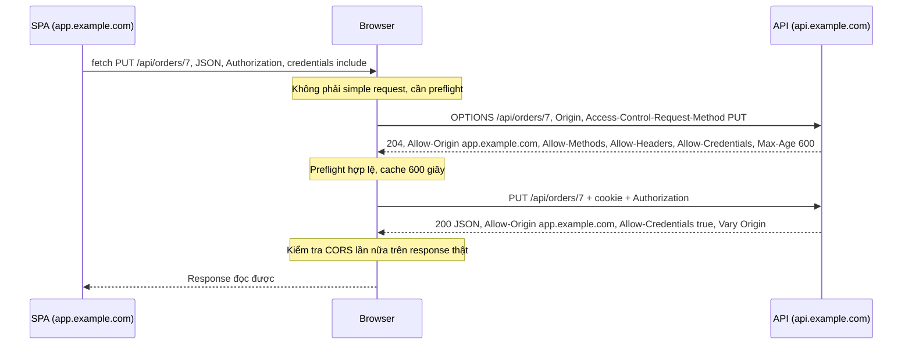
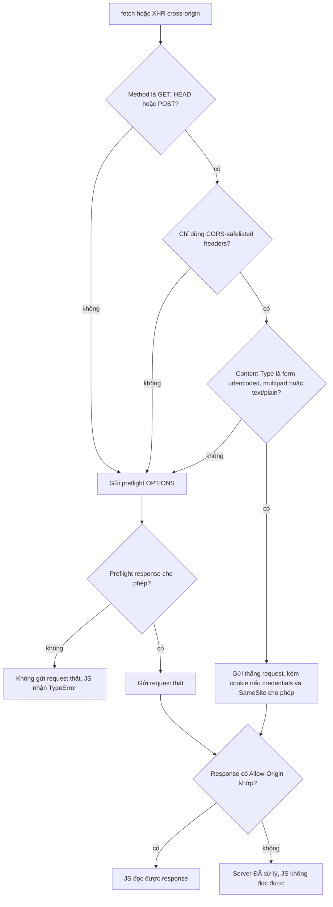

## Bối cảnh & vấn đề

Một SPA chạy ở `https://app.staging.example.io` gọi API ở `https://api.staging.example.com`. Trên máy dev (cả hai chạy trên `localhost`) mọi thứ ổn. Lên staging, login "thành công" nhưng mọi request sau đó đều bị coi là chưa đăng nhập, vì browser **không gửi cookie session**. Console đầy lỗi đỏ:

```text
Access to fetch at 'https://api.staging.example.com/me' from origin 'https://app.staging.example.io'
has been blocked by CORS policy: The value of the 'Access-Control-Allow-Origin' header in the response
must not be the wildcard '*' when the request's credentials mode is 'include'.
```

Cấu hình phía API là `app.use(cors({ origin: '*', credentials: true }))`, cookie được set bằng `res.cookie('sid', token, { httpOnly: true })`. Có ít nhất ba lỗi ở đây, và cả ba đều đến từ việc hiểu sai CORS là gì.

CORS là một trong những chủ đề bị hiểu sai nhiều nhất trong web, kể cả bởi dev nhiều năm kinh nghiệm. Hiểu lầm phổ biến nhất: "CORS là cơ chế bảo mật giúp server chặn request từ domain lạ, và vì vậy chống được CSRF". Cả hai vế đều sai. CORS là cơ chế để **nới lỏng** một chính sách của browser; nó không chặn request nào tới server, và nó không phải là biện pháp chống CSRF. Bài này giải thích từ gốc: Same-Origin Policy, rồi CORS, rồi cookie, rồi CSRF.

## Khái niệm

### Origin và site

**Origin** là bộ ba **scheme + host + port**. `https://shop.example.com` có scheme `https`, host `shop.example.com`, port mặc định 443. Hai URL cùng origin khi cả ba phần giống hệt; path không liên quan.

| URL A | URL B | Cùng origin? | Lý do |
| --- | --- | --- | --- |
| `https://a.com/x` | `https://a.com/y` | Có | Chỉ khác path |
| `https://a.com` | `http://a.com` | Không | Khác scheme |
| `https://a.com` | `https://a.com:8443` | Không | Khác port |
| `https://app.a.com` | `https://api.a.com` | Không | Khác host |

**Site** là khái niệm rộng hơn: scheme + **registrable domain** (eTLD+1, tức tên miền bạn mua được, như `example.com`; với `co.uk` thì là `example.co.uk`). `https://app.example.com` và `https://api.example.com` **khác origin nhưng cùng site**. `https://app.example.io` và `https://api.example.com` **khác site**. Phân biệt này quan trọng vì **CORS dựa trên origin**, còn **cookie `SameSite` dựa trên site**.

**Interview angle:** câu follow-up kinh điển: "`app.example.com` và `api.example.com` có same-site không, same-origin không?"; trả lời: same-site, cross-origin, và nêu hệ quả với cookie.

### Same-Origin Policy chặn đọc, không chặn gửi

**Same-Origin Policy** (SOP) là quy tắc của browser: JavaScript chạy ở origin A **không được đọc** dữ liệu của origin B, gồm response của `fetch`/XHR, DOM của iframe, pixel của canvas có ảnh cross-origin. Lý do: browser tự động đính kèm cookie của B vào request tới B. Nếu JS của trang độc hại đọc được response, nó có thể đọc email, số dư tài khoản của bạn ở B chỉ bằng một `fetch`.

Nhưng SOP **không** cấm gửi. Web từ đầu đã cho phép nhúng và gửi cross-origin: ``, `<script src>`, `<link>`, `<iframe>`, và đặc biệt `<form method="POST" action="https://b.com/...">`. Những request này vẫn tới server B, vẫn kèm cookie (nếu `SameSite` cho phép), và server vẫn xử lý. Chỉ có JS của A là không đọc được kết quả.

Ví dụ: trang `attacker.com` chạy `fetch('https://bank.com/api/balance', { credentials: 'include' })`. Request **được gửi** tới bank, kèm cookie. Bank trả số dư. Browser nhận response, thấy không có header CORS cho phép `attacker.com`, và **không đưa** response cho JS. Server của bank không hề biết có gì bị "chặn".

**Interview angle:** red flag lớn nhất là "CORS là firewall phía server chặn request"; câu trả lời đúng nhấn mạnh CORS do **browser** enforce, curl/Postman/server-to-server không bị ảnh hưởng.

### CORS: server cho phép origin khác đọc response

**CORS** (Cross-Origin Resource Sharing, định nghĩa trong Fetch Standard) là cách server B nói với browser: "tôi cho phép JS của origin A đọc response này". Browser gửi header **`Origin: https://a.com`** trong request cross-origin; server trả **`Access-Control-Allow-Origin: https://a.com`** (hoặc `*` cho dữ liệu công khai không cần credentials). Nếu khớp, browser đưa response cho JS; nếu không, JS nhận `TypeError: Failed to fetch` và console in lỗi CORS.

Các header phụ: `Access-Control-Allow-Credentials: true` (cho phép request có cookie/`Authorization`), `Access-Control-Expose-Headers` (header nào ngoài danh sách safelisted mà JS được đọc, ví dụ `X-Request-Id`), và nhóm header cho preflight ở phần sau.

CORS là cơ chế **nới lỏng** SOP, không phải thắt chặt. Không có CORS, cross-origin read đã bị cấm sẵn. Mọi header `Access-Control-*` bạn thêm vào đều **mở thêm** quyền.

**Interview angle:** nói được "CORS là opt-in để nới lỏng SOP" thay vì "CORS để bảo vệ API" là tín hiệu hiểu đúng bản chất.

### Simple request và preflight

Không phải request cross-origin nào cũng được gửi thẳng. Fetch Standard chia làm hai loại. **Simple request** (spec gọi là request không cần preflight) thoả mọi điều kiện: method là `GET`, `HEAD` hoặc `POST`; chỉ dùng **CORS-safelisted headers** (`Accept`, `Accept-Language`, `Content-Language`, `Content-Type` với vài giá trị, `Range` đơn giản); và `Content-Type` (nếu có) thuộc `application/x-www-form-urlencoded`, `multipart/form-data`, hoặc `text/plain`. Đây chính là những gì một `<form>` HTML đã gửi được từ trước khi có CORS, nên cho gửi thẳng không mở thêm rủi ro nào.

Mọi request khác (method `PUT`/`DELETE`/`PATCH`, header `Authorization` hay `X-Tenant-Id`, hoặc `Content-Type: application/json`) cần **preflight**: trước request thật, browser tự gửi một `OPTIONS` với `Access-Control-Request-Method` và `Access-Control-Request-Headers`, hỏi "tôi có được gửi request kiểu này không?". Server trả `Access-Control-Allow-Origin`, `Access-Control-Allow-Methods`, `Access-Control-Allow-Headers` (và `Allow-Credentials` nếu cần). Chỉ khi preflight đạt, browser mới gửi request thật. Response của request thật **cũng** phải có `Access-Control-Allow-Origin`.

`Access-Control-Max-Age` cho phép browser cache kết quả preflight, nhưng browser tự đặt trần: Chromium tối đa **2 giờ**, Firefox 24 giờ; không có header thì mặc định chỉ 5 giây (verify). Preflight cache theo cặp (origin, URL), nên API có nhiều URL động (`/orders/1`, `/orders/2`) vẫn preflight cho từng URL.

**Interview angle:** interviewer hay hỏi "vì sao `Content-Type: application/json` gây preflight?"; câu trả lời: vì form HTML không gửi được JSON, nên đó là "năng lực mới" cần server đồng ý trước.

### Credentials: cookie cross-origin

Mặc định `fetch` cross-origin **không** gửi cookie (`credentials: 'same-origin'`). Muốn gửi, client phải đặt `credentials: 'include'`, và server phải thoả **đồng thời**: `Access-Control-Allow-Origin` là **origin cụ thể** (không được `*`), `Access-Control-Allow-Credentials: true`, và với preflight thì `Allow-Headers`/`Allow-Methods` cũng không được dùng `*` theo nghĩa wildcard. Echo origin động thì phải thêm **`Vary: Origin`**, nếu không CDN hoặc cache trung gian có thể lưu response mang `Allow-Origin` của origin này rồi trả cho origin khác.

Ngay cả khi CORS đúng, cookie còn phải qua cửa **`SameSite`**. `SameSite=Strict` chỉ gửi cookie trong request same-site; `Lax` (mặc định của Chrome khi cookie không khai báo, verify với browser khác) gửi thêm khi điều hướng top-level bằng `GET`; `None` gửi cả cross-site nhưng bắt buộc kèm `Secure`. Một SPA ở `example.io` gọi API ở `example.com` là **cross-site**, nên cookie `Lax` không đi theo `fetch`. Thêm nữa, browser ngày càng hạn chế **third-party cookie** (Safari và Firefox chặn mặc định; Chrome có chính sách riêng thay đổi theo thời gian, verify), nên kiến trúc dựa vào cookie cross-site rất mong manh.

**Interview angle:** câu debug cookie cross-origin chấm điểm ở chỗ bạn thấy **cả ba tầng**: `credentials: 'include'` ở client, CORS với origin cụ thể + `Allow-Credentials`, và `SameSite`/third-party cookie.

### CSRF và vì sao CORS không chống được

**CSRF** (Cross-Site Request Forgery) là tấn công khiến browser của nạn nhân gửi một request có **side effect** tới site mà nạn nhân đang đăng nhập, lợi dụng việc cookie tự động đi kèm. Kẻ tấn công **không cần đọc** response; họ chỉ cần request được thực hiện (chuyển tiền, đổi email, xoá địa chỉ).

CORS không ngăn được điều đó vì CORS chỉ quyết định việc **đọc**. Một `<form method="POST">` hoặc `fetch(url, { method: 'POST', mode: 'no-cors', body: formData })` là simple request: không preflight, được gửi thẳng, kèm cookie nếu `SameSite` cho phép, và server thực hiện side effect. Việc attacker không đọc được response chẳng giúp gì.

Preflight chỉ "vô tình" bảo vệ khi API **bắt buộc** thứ mà simple request không có (ví dụ `Content-Type: application/json` hay một custom header) và **từ chối** mọi thứ khác. Nếu API vì lý do legacy chấp nhận cả `application/x-www-form-urlencoded`, lớp bảo vệ vô tình đó biến mất. Biện pháp chống CSRF thật: cookie `SameSite=Lax/Strict`, **CSRF token** (synchronizer token hoặc double-submit cookie), kiểm tra header **`Origin`** / **`Sec-Fetch-Site`** ở server cho mọi request đổi state, và với API JSON thì yêu cầu custom header để buộc preflight.

**Interview angle:** câu hỏi "CORS có chống CSRF không?" chỉ có một đáp án đúng: không; điểm cộng là đưa ra được một request cụ thể vẫn đi qua (form POST) và liệt kê biện pháp thật.

## Cơ chế hoạt động

Luồng preflight cho `PUT` với JSON và `Authorization` từ SPA tới API khác origin:



Hai lần kiểm tra diễn ra ở **browser**: một cho preflight (được phép gửi không?) và một cho response thật (được phép đọc không?). Server chỉ việc trả đúng header; nó không "chặn" gì cả. Nếu preflight thất bại, request thật **không được gửi**; đây là trường hợp duy nhất CORS thực sự ngăn một request tới server, và nó chỉ áp dụng cho request không-simple.

Browser quyết định có preflight hay không theo luồng sau:



Nhánh cuối cùng bên phải là điểm mấu chốt của CSRF: với simple request, server **đã xử lý** request dù JS không đọc được response.

## Ví dụ thực tế

### CORS allowlist đúng cách, và bằng chứng server vẫn xử lý request

Server tối giản với allowlist bằng `Set`, luôn gửi `Vary: Origin`, trả preflight bằng `204`. Client là Node `fetch` (không enforce CORS, nên ta nhìn thấy đúng những gì server trả):

```ts
import http from "node:http";
import { once } from "node:events";

const ALLOWED = new Set(["https://app.example.com", "https://admin.example.com"]);

const server = http.createServer((req, res) => {
  const origin = req.headers.origin;
  res.setHeader("Vary", "Origin");
  if (origin && ALLOWED.has(origin)) {
    res.setHeader("Access-Control-Allow-Origin", origin);
    res.setHeader("Access-Control-Allow-Credentials", "true");
  }
  if (req.method === "OPTIONS") {
    res.setHeader("Access-Control-Allow-Methods", "GET, POST, PUT, DELETE");
    res.setHeader("Access-Control-Allow-Headers", "Content-Type, Authorization");
    res.setHeader("Access-Control-Max-Age", "600");
    res.writeHead(204).end();
    return;
  }
  res.setHeader("Content-Type", "application/json");
  res.end(JSON.stringify({ ok: true }));
});
server.listen(0, "127.0.0.1");
await once(server, "listening");
const { port } = server.address() as { port: number };
const url = `http://127.0.0.1:${port}/api/orders`;

async function show(label: string, init: RequestInit) {
  const r = await fetch(url, init);
  const pick = ["access-control-allow-origin", "access-control-allow-credentials",
    "access-control-allow-methods", "access-control-allow-headers", "access-control-max-age", "vary"];
  console.log(`--- ${label}: ${r.status}`);
  for (const h of pick) if (r.headers.has(h)) console.log(`${h}: ${r.headers.get(h)}`);
}

await show("preflight from allowed origin", {
  method: "OPTIONS",
  headers: { Origin: "https://app.example.com", "Access-Control-Request-Method": "PUT",
    "Access-Control-Request-Headers": "content-type,authorization" },
});
await show("actual PUT from allowed origin", { method: "PUT", headers: { Origin: "https://app.example.com" } });
await show("PUT from evil origin", { method: "PUT", headers: { Origin: "https://evilexample.com" } });
server.close();
```

Output trên Node 24:

```text
--- preflight from allowed origin: 204
access-control-allow-origin: https://app.example.com
access-control-allow-credentials: true
access-control-allow-methods: GET, POST, PUT, DELETE
access-control-allow-headers: Content-Type, Authorization
access-control-max-age: 600
vary: Origin
--- actual PUT from allowed origin: 200
access-control-allow-origin: https://app.example.com
access-control-allow-credentials: true
vary: Origin
--- PUT from evil origin: 200
vary: Origin
```

Dòng cuối là bài học quan trọng nhất: request từ origin lạ **vẫn nhận 200**, handler vẫn chạy. Việc thiếu `Access-Control-Allow-Origin` chỉ khiến **browser** giấu response khỏi JS. Nếu handler `PUT` có side effect, side effect đã xảy ra. (Trong browser thật, `PUT` sẽ bị preflight chặn trước; nhưng một `POST` form-encoded thì không.)

### Lỗi echo Origin bằng regex không neo đầu

Middleware sau echo `Origin` nếu khớp `/example\.com$/` và bật credentials. Kiểm tra regex với vài origin:

```ts
const re = /example\.com$/;
for (const o of ["https://app.example.com", "https://evilexample.com", "https://example.com.attacker.io", "https://attacker-example.com"])
  console.log(o.padEnd(36), re.test(o));

const good = /^https:\/\/([a-z0-9-]+\.)?example\.com$/;
console.log("--- anchored");
for (const o of ["https://app.example.com", "https://evilexample.com", "https://attacker-example.com", "http://app.example.com"])
  console.log(o.padEnd(36), good.test(o));
```

```text
https://app.example.com              true
https://evilexample.com              true
https://example.com.attacker.io      false
https://attacker-example.com         true
--- anchored
https://app.example.com              true
https://evilexample.com              false
https://attacker-example.com         false
http://app.example.com               false
```

Kẻ tấn công chỉ cần mua `evilexample.com`. Trang của họ gọi API với `credentials: 'include'`, server echo origin kèm `Allow-Credentials: true`, và JS của kẻ tấn công **đọc được** dữ liệu của nạn nhân. Echo origin có credentials mà không kiểm tra chặt tương đương **tắt SOP** cho người dùng của bạn. Ngoài regex neo đủ hai đầu và ranh giới subdomain, cách an toàn nhất là so khớp chính xác với một `Set` sau khi chuẩn hoá (`new URL(origin).origin`), và không bao giờ whitelist `null` (origin của iframe sandbox và `file://`).

### Sửa bài toán cookie ở staging

Ba lỗi trong cấu hình đầu bài và cách sửa:

```ts
// API (Express) — https://api.staging.example.com
import cors from "cors";

const ALLOWED = new Set(["https://app.staging.example.io"]);
app.use(cors({
  origin: (origin, cb) => cb(null, !origin || ALLOWED.has(origin)), // echoes the exact origin, adds Vary: Origin
  credentials: true,
}));
res.cookie("sid", token, { httpOnly: true, secure: true, sameSite: "none" }); // cross-site needs None + Secure

// SPA — https://app.staging.example.io
await fetch("https://api.staging.example.com/me", { credentials: "include" });
```

Bản sửa này chạy được nhưng vẫn mong manh vì phụ thuộc third-party cookie. Cách bền vững hơn: đưa API về **cùng site** (`api.app.staging.example.io` cho phép cookie `SameSite=Lax`), hoặc tốt nhất là **cùng origin** bằng cách cho SPA gọi `/api/*` và để reverse proxy/CDN rewrite sang API. Khi đó không cần CORS, không cần `SameSite=None`, không phụ thuộc chính sách cookie của browser.

## Trade-offs & lựa chọn thay thế

| Kiến trúc | CORS | Cookie | Rủi ro, chi phí |
| --- | --- | --- | --- |
| Cùng origin (`/api` qua reverse proxy) | Không cần | First-party, `Lax`/`Strict` | Cần proxy/rewrite; đơn giản và bền nhất |
| Cùng site, khác origin (`api.example.com`) | Cần, với credentials | `SameSite=Lax` vẫn gửi | Phải quản lý allowlist, preflight |
| Khác site (`example.io` và `example.com`) | Cần, với credentials | `SameSite=None; Secure`, dễ bị chặn | Phụ thuộc chính sách third-party cookie |
| Token trong header (`Authorization: Bearer`) | Cần, header gây preflight | Không dùng cookie | Không bị CSRF kiểu cookie, nhưng token lưu ở JS dễ lộ qua XSS |

| Biện pháp chống CSRF | Bảo vệ được | Hạn chế |
| --- | --- | --- |
| `SameSite=Lax/Strict` | Phần lớn request cross-site | Không bảo vệ tấn công từ subdomain cùng site |
| CSRF token (synchronizer, double-submit) | Mọi request đổi state | Phải tích hợp vào form và client |
| Kiểm tra `Origin` / `Sec-Fetch-Site` | Request từ browser hiện đại | Cần xử lý request không có header |
| Bắt buộc JSON/custom header + từ chối form | Buộc preflight cho mọi request | Vỡ nếu API vẫn nhận form-encoded |

Khi nào chọn gì. Nếu bạn kiểm soát cả frontend lẫn API, **cùng origin qua reverse proxy** gần như luôn là lựa chọn tốt nhất: không CORS, không preflight, cookie first-party. Khi API phục vụ nhiều frontend thuộc các domain khác nhau, dùng CORS với **allowlist chính xác** và cân nhắc token trong header thay vì cookie cross-site. Chống CSRF luôn là **nhiều lớp**: `SameSite` làm lớp nền, kiểm tra `Origin`/`Sec-Fetch-Site` cho mọi request đổi state, và CSRF token cho ứng dụng dùng cookie session.

## Edge cases & failure modes

- **Preflight chậm**: API JSON gọi trên mỗi phím gõ tạo gấp đôi số request; mỗi preflight là một RTT. Giảm bằng `Access-Control-Max-Age` (nhớ trần 2 giờ của Chromium), gộp request, debounce, hoặc đưa về cùng origin để bỏ hẳn preflight.
- **Preflight bị auth middleware chặn**: `OPTIONS` không mang `Authorization` hay cookie; nếu middleware xác thực chạy trước CORS và trả `401`, browser báo lỗi CORS khó hiểu. CORS middleware phải chạy trước auth.
- **Thiếu `Vary: Origin` sau CDN**: response mang `Allow-Origin: https://a.com` bị cache và trả cho `https://b.com`; b bị lỗi CORS ngẫu nhiên, hoặc tệ hơn là origin không được phép lại đọc được.
- **Origin `null`**: iframe sandbox, `file://`, một số redirect gửi `Origin: null`; whitelist `null` là mở cửa cho mọi trang tự nhúng iframe sandbox.
- **Lỗi 5xx không có header CORS**: error handler trả `500` mà không đi qua CORS middleware, nên browser báo "CORS error" thay vì lỗi thật, gây debug sai hướng.
- **WebSocket không có CORS**: handshake WebSocket gửi `Origin` nhưng browser không enforce gì; server phải tự kiểm tra (xem [Realtime](/tracks/networking/learn/realtime)).
- **API nhận cả form-encoded**: vì legacy, API JSON cũng parse `application/x-www-form-urlencoded`; mọi endpoint đổi state trở thành mục tiêu CSRF bằng form HTML đơn giản.

## Pitfalls

- ❌ Nghĩ CORS chặn request tới server → ✅ CORS chỉ quyết định JS có đọc được response; simple request vẫn tới server và được xử lý.
- ❌ Dùng CORS thay cho chống CSRF → ✅ `SameSite`, CSRF token, kiểm tra `Origin`/`Sec-Fetch-Site`.
- ❌ `Access-Control-Allow-Origin: *` cùng credentials → ✅ echo origin cụ thể từ allowlist + `Allow-Credentials: true` + `Vary: Origin`.
- ❌ Echo `Origin` bằng regex chỉ neo cuối, hay whitelist `null` → ✅ so khớp chính xác với `Set` sau khi chuẩn hoá bằng `new URL(origin).origin`.
- ❌ Quên `credentials: 'include'` ở `fetch` rồi sửa server mãi → ✅ kiểm tra đủ ba tầng: client credentials, CORS headers, `SameSite`.
- ❌ "Fix" lỗi CORS bằng extension tắt CORS trên browser → ✅ sửa header ở server hoặc đưa API về cùng origin; extension chỉ che lỗi trên máy bạn.
- ❌ Đặt auth middleware trước CORS middleware → ✅ CORS trước để preflight `OPTIONS` không bị `401`.

## Tóm tắt

- **Origin** = scheme + host + port; **site** = scheme + registrable domain. CORS theo origin, `SameSite` theo site.
- **SOP** cấm JS đọc dữ liệu cross-origin nhưng không cấm gửi request (form, img, script).
- **CORS** là opt-in để **nới lỏng** SOP: server trả `Access-Control-Allow-Origin` cho origin được phép đọc; do browser enforce.
- **Simple request** (GET/HEAD/POST, header safelisted, content-type kiểu form) gửi thẳng; còn lại cần **preflight** `OPTIONS`; `Max-Age` bị browser giới hạn (Chromium 2 giờ).
- Credentials cần origin cụ thể + `Allow-Credentials: true` + `Vary: Origin`, và cookie còn phải qua `SameSite` (cross-site cần `None; Secure`).
- **CORS không chống CSRF**: form POST vẫn tới server kèm cookie; dùng `SameSite`, CSRF token, kiểm tra `Origin`/`Sec-Fetch-Site`.
- Echo origin bằng regex lỏng + credentials = tắt SOP; đưa API về **cùng origin** qua reverse proxy là cách đơn giản và bền nhất.
