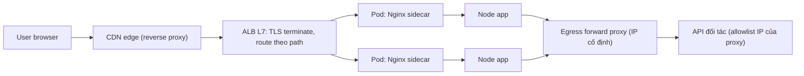
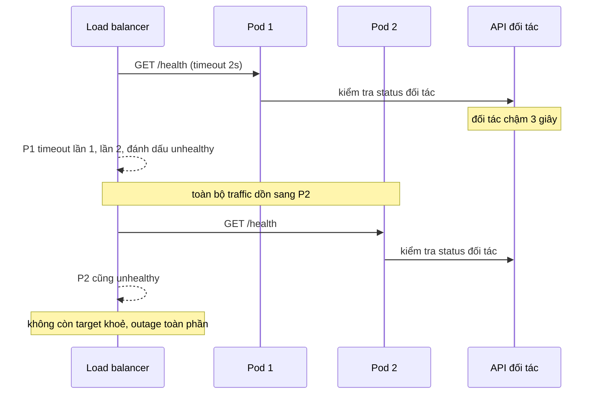
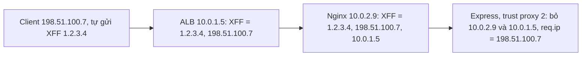

## Bối cảnh & vấn đề

Một đợt khuyến mãi, traffic tăng gấp ba. Event loop của các pod Node bận hơn, DB pool gần cạn, và endpoint `/health` (vốn gọi DB, Redis và cả API trạng thái của đối tác thanh toán) bắt đầu mất hơn 2 giây. Load balancer cấu hình timeout 2 giây, 2 lần fail liên tiếp là unhealthy. Từng pod bị đánh dấu unhealthy và rút khỏi rotation; tải dồn sang các pod còn lại, chúng chậm hơn, tới lượt chúng fail health check. Orchestrator restart các pod "hỏng". Trong vài phút, toàn bộ fleet đang restart liên tục, đúng lúc cần capacity nhất.

Cùng tuần đó, team security phát hiện rate limiter theo IP bị vượt dễ dàng: kẻ tấn công chỉ cần gửi header `X-Forwarded-For: 1.2.3.4` ngẫu nhiên, và app (cấu hình `trust proxy = true`) tin ngay đó là IP client.

Cả hai sự cố đều nằm ở lớp **proxy và load balancer**, lớp đứng giữa người dùng và code của bạn. Lớp này quyết định request tới instance nào, instance nào được coi là khoẻ, và app nhìn thấy thông tin gì về client. Hiểu sai nó dẫn tới outage do chính cơ chế "high availability" gây ra.

## Khái niệm

### Forward proxy và reverse proxy

**Proxy** là thành phần đứng giữa, nhận request rồi gửi tiếp thay mặt ai đó. Câu hỏi phân biệt là: nó đại diện cho **ai**, và ai **cấu hình** nó.

**Forward proxy** đại diện cho **client**. Client biết nó tồn tại và được cấu hình để đi qua nó (biến môi trường `HTTPS_PROXY`, cấu hình browser, PAC file). Dùng cho: egress proxy của doanh nghiệp (lọc, log, chặn traffic ra ngoài), che IP của client, **egress allowlist** cho service backend gọi API bên thứ ba (đối tác chỉ whitelist một IP cố định của proxy). Với HTTPS, client gửi `CONNECT api.partner.com:443` để proxy mở một **tunnel TCP**; proxy chỉ thấy hostname, không thấy nội dung (trừ khi làm TLS interception).

**Reverse proxy** đại diện cho **server**. Client không biết nó tồn tại; client tưởng đang nói chuyện với origin. Nginx, Envoy, HAProxy, AWS ALB, CDN đều là reverse proxy. Chúng làm: **TLS termination**, load balancing, nén, cache, rate limit, routing theo host/path, thêm header. Hệ quả quan trọng: kết nối TCP tới app đến từ **IP của proxy**, nên app phải đọc IP client từ header do proxy thêm vào.

Ví dụ: service Node gọi API của đối tác qua Squid ở subnet egress (forward proxy); còn người dùng gọi service đó qua ALB → Nginx (hai reverse proxy).

**Interview angle:** trả lời bằng câu "forward proxy do client cấu hình và đại diện client; reverse proxy do server vận hành và client không biết" kèm một ví dụ production cho mỗi loại.

### VPN và zero-trust khác proxy ở đâu

**VPN** (Virtual Private Network) tạo một **tunnel mã hoá** ở tầng mạng (L3) và đưa máy client vào một mạng ảo: máy nhận một IP trong mạng nội bộ, bảng định tuyến được sửa để các subnet đích đi qua tunnel. Vì hoạt động ở tầng IP, **mọi ứng dụng** (SSH, psql, browser, gRPC) đều đi qua mà không cần cấu hình riêng. Các giao thức phổ biến: IPsec, **WireGuard** (chạy trên UDP, cấu hình đơn giản, dùng các thuật toán hiện đại), OpenVPN (dựa trên TLS).

Proxy thì hoạt động ở **tầng ứng dụng** (HTTP proxy, SOCKS): chỉ ứng dụng nào được cấu hình mới đi qua, và proxy hiểu (một phần) giao thức. **Split tunnel** chỉ đưa subnet nội bộ qua VPN; **full tunnel** đưa mọi traffic. Điều cần nhớ: VPN chỉ mã hoá đoạn **client → VPN server**. Từ VPN server ra đích, traffic đi như bình thường, nên request HTTP thuần vẫn là plaintext trên đoạn đó.

**Zero-trust network access** (ZTNA) bỏ giả định "đã vào mạng là được tin". Thay vì cho máy vào cả subnet, mỗi request tới mỗi ứng dụng được xác thực theo **danh tính** người dùng và **tình trạng thiết bị**, thường qua một access proxy (identity-aware proxy). Lợi ích chính là giảm **lateral movement**: một laptop bị chiếm không tự động chạm được mọi máy trong mạng.

Ví dụ: dev cần truy cập RDS private. **VPN** vào VPC cho truy cập rộng, tiện nhưng rủi ro. **Bastion host** là một máy có SSH mở, phải vá và quản lý key. **AWS SSM Session Manager port forwarding** không cần mở port inbound nào, xác thực qua IAM, có log phiên đầy đủ; thường là lựa chọn tốt nhất cho truy cập DB tạm thời.

**Interview angle:** câu so sánh VPN/proxy/ZTNA chấm điểm ở chỗ bạn nói đúng **tầng** (L3 vs L7), phạm vi (mọi app vs app được cấu hình), và mô hình tin cậy (mạng vs danh tính).

### Load balancer L4 và L7

**Load balancer L4** làm việc với TCP/UDP: nó thấy IP và port, không đọc HTTP. Quyết định routing xảy ra **một lần cho mỗi connection**; sau đó mọi byte của connection đi tới cùng backend. L4 rất nhanh, latency thấp, xử lý hàng triệu connection, có thể **pass-through TLS** (backend terminate) và giữ nguyên IP nguồn (AWS NLB), hoặc truyền IP qua **Proxy Protocol**. Ví dụ: AWS NLB, HAProxy ở `mode tcp`, IPVS.

**Load balancer L7** là reverse proxy hiểu HTTP: đọc host, path, header, cookie, và quyết định routing **cho từng request**. Nó có thể route `/api/*` sang service này, `/static/*` sang service khác, retry sang backend khác, rewrite header, chạy WAF, xác thực, và thường **terminate TLS** rồi mở connection (HTTP hoặc HTTPS re-encrypt) tới backend. Ví dụ: AWS ALB, Nginx, Envoy, Traefik.

Khác biệt "theo connection vs theo request" có hệ quả lớn với **HTTP/2 và gRPC**: client mở một connection dài và multiplex mọi request trên đó; L4 ghim cả connection vào một backend, nên một pod gánh toàn bộ tải của client đó. L7 hiểu HTTP/2 cân bằng từng stream sang các backend khác nhau (xem [HTTP versions](/tracks/networking/learn/http-versions)).

**Interview angle:** câu hỏi "L4 và L7 thấy gì, TLS terminate ở đâu" kèm theo tình huống gRPC lệch tải là combo rất hay gặp.

### Thuật toán cân bằng tải

- **Round-robin** (và weighted round-robin): lần lượt từng backend. Đơn giản, đều khi các request tốn chi phí gần như nhau. Tệ khi thời gian xử lý rất khác nhau: một backend có thể "xui" nhận nhiều request nặng liên tiếp và tụt lại.
- **Least connections / least outstanding requests**: gửi tới backend đang có ít connection hoặc request đang xử lý nhất. Thích ứng với request dài và backend chậm. Nhược điểm: backend **mới khởi động** (cache lạnh, JIT chưa ấm) có 0 request nên bị dồn tải ngay; cần **slow start** (tăng dần tỉ trọng trong vài chục giây). ALB hỗ trợ cả "least outstanding requests" và slow start.
- **Power of two choices**: chọn ngẫu nhiên hai backend, gửi tới cái ít tải hơn. Gần tốt như least-connections nhưng không cần trạng thái toàn cục chính xác; Envoy dùng cách này cho least-request.
- **Consistent hashing** (theo user, tenant, session key): cùng một key luôn tới cùng backend, giữ **cache locality** và "sticky" tự nhiên. Khi thêm/bớt node, chỉ khoảng 1/N số key bị chuyển chỗ (thay vì gần như toàn bộ với `hash % N`). Nhược điểm: **hot key**: một tenant chiếm 40% traffic sẽ đè bẹp đúng một node.
- **IP hash**: một dạng hash theo IP client, dùng làm sticky session thô sơ; lệch nặng khi nhiều user đứng sau một NAT.

Mọi thuật toán phải đi kèm **health check** và **outlier detection** (loại backend trả nhiều lỗi 5xx hay chậm bất thường).

**Interview angle:** câu hỏi "khi nào mỗi thuật toán là lựa chọn sai" quan trọng hơn định nghĩa; chuẩn bị sẵn ví dụ request không đều cho round-robin, pod lạnh cho least-connections, hot tenant cho consistent hashing.

### X-Forwarded-For và lấy IP client đúng

Sau reverse proxy, `req.socket.remoteAddress` là IP của proxy. Proxy vì vậy thêm header **`X-Forwarded-For`** (XFF): mỗi proxy **append** IP của peer mà nó nhận connection vào cuối danh sách. Sau ALB → Nginx → Node, header có dạng `X-Forwarded-For: <client>, <ALB node>`, và peer TCP của Node là Nginx. RFC 7239 chuẩn hoá header **`Forwarded: for=...;proto=...;host=...`**, nhưng XFF vẫn phổ biến hơn nhiều.

Vấn đề: phần **bên trái** của XFF có thể do client tự đặt. Nếu client gửi `X-Forwarded-For: 1.2.3.4`, ALB sẽ append IP thật, thành `1.2.3.4, 198.51.100.7`. Cách duy nhất đúng là **đếm từ phải sang**, bỏ qua đúng số proxy mà **bạn** kiểm soát; giá trị đầu tiên không thuộc proxy của bạn là IP client. Express làm việc này qua `app.set('trust proxy', N)`: N là số hop tin cậy. `trust proxy = true` nghĩa là "tin tất cả", Express lấy giá trị **trái nhất**, và kẻ tấn công tự chọn IP của mình để vượt rate limit hay IP allowlist.

Khi có **CDN** phía trước, CDN cũng là một hop; hoặc dùng header riêng của CDN (`CloudFront-Viewer-Address`, `CF-Connecting-IP`) và **chặn** mọi traffic không đi qua CDN (security group chỉ cho phép dải IP của CDN), nếu không kẻ tấn công gọi thẳng vào LB và tự đặt header đó.

**Interview angle:** câu trả lời mạnh chỉ ra "trái nhất là do client kiểm soát, phải sang trái theo số hop tin cậy", và red flag là `trust proxy = true`.

### Health check: liveness và readiness

**Health check** là cách LB/orchestrator quyết định một instance có nên nhận traffic hay có nên bị restart. Có hai câu hỏi khác nhau và phải tách thành hai endpoint. **Liveness**: "process còn sống và không bị kẹt không?". Nếu fail, restart là đúng. Liveness **không được** gọi dependency: DB chậm không phải lý do để restart app. **Readiness**: "instance này có nên nhận traffic ngay bây giờ không?". Nếu fail, rút khỏi rotation nhưng không restart. Readiness có thể kiểm tra dependency **thiết yếu** (có DB thì mới phục vụ được), nhưng nên có timeout ngắn và cache kết quả.

Kubernetes tách rõ ba loại probe: startup, liveness, readiness. LB cloud như ALB chỉ có một health check cho target group, gần với readiness; nhưng khi **mọi** target cùng unhealthy, ALB chuyển sang "fail open" và gửi request tới tất cả (verify), trong khi Kubernetes readiness fail đồng loạt thì Service không còn endpoint nào và mọi request đều lỗi.

**Interview angle:** câu follow-up "readiness có nên fail khi Redis (cache) chết không?" không có đáp án duy nhất; tranh luận tốt: nếu app vẫn phục vụ được (chậm hơn) khi mất cache thì **không**, vì fail readiness đồng loạt biến sự cố cache thành outage toàn phần.

## Cơ chế hoạt động

Vị trí của forward proxy và reverse proxy trong một hệ thống điển hình:



Mọi thứ bên trái app là **reverse proxy**: người dùng không biết chúng tồn tại, và mỗi hop append một IP vào `X-Forwarded-For`. Bên phải app là **forward proxy**: app được cấu hình (`HTTPS_PROXY`) để đi qua nó, dùng `CONNECT` để mở tunnel TLS tới đối tác, và đối tác chỉ thấy IP cố định của proxy.

Cơ chế cascading failure của health check phụ thuộc dependency, như trong câu chuyện đầu bài:



Vấn đề cốt lõi là health check **tương quan**: mọi pod cùng phụ thuộc một thứ (API đối tác, DB chung), nên khi thứ đó chậm, mọi pod cùng fail **cùng lúc**. Health check khi đó không còn phân biệt được "pod hỏng" với "dependency hỏng", và cơ chế loại bỏ pod hỏng tự biến thành cơ chế loại bỏ **tất cả** pod. Thêm vào đó, khi tải cao, chính request `/health` phải xếp hàng sau request thật trong event loop và DB pool, nên nó fail đúng lúc capacity quý nhất.

Luồng lấy IP client qua hai proxy:



Express ghép peer TCP (`10.0.2.9`) vào cuối danh sách XFF, rồi bỏ đi đúng N = 2 hop tin cậy từ phải sang. Giá trị `1.2.3.4` do client tự chèn nằm ở bên trái và không bao giờ được chọn.

## Ví dụ thực tế

### Chọn IP client theo số hop tin cậy

Hàm dưới mô phỏng logic `trust proxy = N` của Express (peer TCP là hop đầu tiên, sau đó đọc XFF từ phải sang trái):

```ts
// Returns the client IP given the TCP peer address, the X-Forwarded-For header,
// and how many proxies in front of us we control (like Express `trust proxy = N`).
export function clientIp(peer: string, xff: string | undefined, trustedHops: number): string {
  const chain = [...(xff ?? "").split(",").map((s) => s.trim()).filter(Boolean), peer];
  // chain = [claimed client, ..., proxy N-1, peer]; walk from the right
  const idx = Math.max(0, chain.length - 1 - trustedHops);
  return chain[idx];
}

const cases: Array<[string, string, string | undefined, number]> = [
  ["direct, no proxy", "198.51.100.7", undefined, 0],
  ["ALB -> Node, honest client", "10.0.1.5", "198.51.100.7", 1],
  ["ALB -> Node, spoofed XFF", "10.0.1.5", "1.2.3.4, 198.51.100.7", 1],
  ["ALB -> Nginx -> Node", "10.0.2.9", "1.2.3.4, 198.51.100.7, 10.0.1.5", 2],
  ["trust proxy = true (leftmost)", "10.0.1.5", "1.2.3.4, 198.51.100.7", 99],
];
for (const [label, peer, xff, hops] of cases)
  console.log(label.padEnd(32), "->", clientIp(peer, xff, hops));
```

Output:

```text
direct, no proxy                 -> 198.51.100.7
ALB -> Node, honest client       -> 198.51.100.7
ALB -> Node, spoofed XFF         -> 198.51.100.7
ALB -> Nginx -> Node             -> 198.51.100.7
trust proxy = true (leftmost)    -> 1.2.3.4
```

Chỉ dòng cuối bị lừa. Trong Express thật: `app.set('trust proxy', 2)` cho ALB → Nginx → Node, hoặc truyền danh sách subnet của proxy (`app.set('trust proxy', ['10.0.0.0/16'])`) để không phụ thuộc số hop khi topology thay đổi. Kiểm tra bằng một endpoint tạm `GET /whoami` trả `{ ip: req.ip, ips: req.ips }` sau mỗi lần đổi hạ tầng.

### Consistent hashing vs hash modulo N

Phân phối 10.000 tenant lên 4 node, rồi thêm node thứ 5, đếm số tenant bị chuyển chỗ:

```ts
import { createHash } from "node:crypto";

const h = (s: string) => createHash("md5").update(s).digest().readUInt32BE(0);

class Ring {
  private points: Array<[number, string]> = [];
  private vnodes: number;
  constructor(nodes: string[], vnodes = 100) {
    this.vnodes = vnodes;
    nodes.forEach((n) => this.add(n));
  }
  add(node: string) {
    for (let i = 0; i < this.vnodes; i++) this.points.push([h(`${node}#${i}`), node]);
    this.points.sort((a, b) => a[0] - b[0]);
  }
  get(key: string): string {
    const k = h(key);
    const p = this.points.find(([pos]) => pos >= k) ?? this.points[0];
    return p[1];
  }
}

const keys = Array.from({ length: 10_000 }, (_, i) => `tenant-${i}`);
const ring = new Ring(["api-1", "api-2", "api-3", "api-4"]);
const before = new Map(keys.map((k) => [k, ring.get(k)]));
ring.add("api-5");
const moved = keys.filter((k) => ring.get(k) !== before.get(k)).length;
const modBefore = new Map(keys.map((k) => [k, h(k) % 4]));
const modMoved = keys.filter((k) => h(k) % 5 !== modBefore.get(k)).length;
console.log(`consistent hashing: ${moved} / 10000 keys moved (${(moved / 100).toFixed(1)}%)`);
console.log(`hash % N          : ${modMoved} / 10000 keys moved (${(modMoved / 100).toFixed(1)}%)`);
```

Output:

```text
consistent hashing: 1832 / 10000 keys moved (18.3%)
hash % N          : 8032 / 10000 keys moved (80.3%)
```

Lý thuyết cho biết thêm node thứ 5 chỉ nên chuyển khoảng 1/5 = 20% key; ring với 100 virtual node mỗi node cho 18,3%. `hash % N` chuyển 80%, tức gần như toàn bộ cache locality mất sạch mỗi lần scale. Virtual node (nhiều điểm trên ring cho mỗi node vật lý) giúp phân phối đều hơn. Với hot tenant chiếm 40% traffic, consistent hashing không tự cứu được: phải tách tenant đó ra pool riêng, hoặc hash theo `(tenant, sub-key)` để trải tải của nó lên nhiều node (đánh đổi một phần locality).

### Health check tách liveness và readiness

```ts
import express from "express";

const app = express();
let lastLoopLagMs = 0;
setInterval(() => {                      // event-loop lag sampler
  const t = performance.now();
  setImmediate(() => (lastLoopLagMs = performance.now() - t));
}, 1000).unref();

// Liveness: is this process alive and not stuck? No dependency calls.
app.get("/livez", (_req, res) => {
  res.status(lastLoopLagMs < 1000 ? 200 : 503).json({ loopLagMs: Math.round(lastLoopLagMs) });
});

// Readiness: should this pod receive traffic? Essential deps only, short timeout, cached result.
let ready = { ok: true, checkedAt: 0 };
app.get("/readyz", async (_req, res) => {
  if (Date.now() - ready.checkedAt > 5_000) {
    const ok = await Promise.race([
      db.query("SELECT 1").then(() => true, () => false),
      new Promise<boolean>((r) => setTimeout(() => r(false), 300)),
    ]);
    ready = { ok, checkedAt: Date.now() };
  }
  res.status(ready.ok ? 200 : 503).end();
});
```

Response minh hoạ (illustrative):

```text
$ curl -s localhost:3000/livez
{"loopLagMs":3}
$ curl -s -o /dev/null -w "%{http_code}\n" localhost:3000/readyz
200
```

Không còn gọi API đối tác (dependency không thiết yếu cho việc phục vụ; nếu đối tác chết thì endpoint thanh toán trả lỗi có kiểm soát, còn các endpoint khác vẫn chạy). Redis là cache nên không nằm trong readiness. DB check có timeout 300 ms riêng và kết quả được cache 5 giây, nên health check không nhân tải lên DB theo số pod × tần suất check. Phía LB: interval/threshold đủ khoan dung (ví dụ unhealthy sau 3 lần fail liên tiếp) để một đợt GC hay spike ngắn không rút pod.

## Trade-offs & lựa chọn thay thế

| Tiêu chí | L4 (NLB, HAProxy tcp) | L7 (ALB, Nginx, Envoy) |
| --- | --- | --- |
| Thấy gì | IP, port | Host, path, header, cookie, body |
| Quyết định routing | Mỗi connection | Mỗi request (kể cả stream HTTP/2) |
| TLS | Pass-through hoặc terminate | Thường terminate, có thể re-encrypt |
| IP client tới backend | Giữ nguyên hoặc Proxy Protocol | Qua `X-Forwarded-For` / `Forwarded` |
| Tính năng | Throughput cao, latency thấp, UDP | Routing theo path, retry, WAF, auth, rewrite |
| gRPC/HTTP/2 | Lệch tải theo connection | Cân bằng theo request |

| Thuật toán | Tốt khi | Sai khi |
| --- | --- | --- |
| Round-robin | Request đồng đều, backend giống nhau | Thời gian xử lý rất khác nhau |
| Least connections / outstanding | Request dài, backend có tốc độ khác nhau | Pod mới lạnh bị dồn tải (cần slow start) |
| Consistent hashing | Cần cache locality, sticky theo key | Có hot key, tenant quá lớn |
| IP hash | Sticky đơn giản không cần cookie | Nhiều user sau một NAT |

Khi nào chọn gì. Web app và API HTTP: **L7** gần như luôn đúng, vì những gì L7 làm được (routing, retry có kiểm soát, header, WAF) đáng giá hơn vài trăm micro giây latency. Dùng **L4** cho giao thức không phải HTTP, throughput cực cao, cần IP tĩnh (NLB có Elastic IP), hoặc khi backend bắt buộc tự terminate TLS. Thuật toán mặc định: least outstanding requests (hoặc power of two choices) với slow start; chỉ chuyển sang consistent hashing khi locality thực sự quan trọng (cache in-process lớn, WebSocket room) và có kế hoạch cho hot key.

## Edge cases & failure modes

- **Health check tương quan**: kiểm tra dependency dùng chung trong health check làm mọi instance fail cùng lúc; outage toàn phần do chính cơ chế HA.
- **Retry của LB nhân tải**: L7 retry request bị timeout sang backend khác trong lúc hệ thống đã quá tải, nhân đôi tải đúng lúc tệ nhất; giới hạn retry và chỉ retry method idempotent.
- **Sticky session làm lệch tải**: cookie sticky ghim user vào backend; sau deploy hay scale, phân phối không tự cân bằng lại.
- **XFF bị giả mạo khi LB bị bypass**: service có IP public hoặc security group mở cho phép gọi thẳng, bỏ qua CDN/LB, và tự đặt header IP.
- **Connection draining thiếu**: rút backend khỏi LB khi request đang chạy dở gây lỗi 5xx; cấu hình deregistration delay và cho app xử lý `SIGTERM` (ngừng nhận, hoàn tất request đang chạy).
- **Hot tenant với consistent hashing**: một tenant lớn làm node của nó quá tải trong khi các node khác rảnh.
- **VPN full tunnel làm chậm mọi thứ**: toàn bộ traffic Internet của nhân viên đi vòng qua VPN concentrator; split tunnel giải quyết nhưng đổi lại mất khả năng giám sát.

## Pitfalls

- ❌ `/health` gọi DB, Redis và API đối tác → ✅ tách `/livez` (không gọi dependency) và `/readyz` (chỉ dependency thiết yếu, timeout ngắn, cache kết quả).
- ❌ `app.set('trust proxy', true)` → ✅ đặt đúng số hop hoặc subnet của proxy, vì `true` lấy IP trái nhất do client kiểm soát.
- ❌ Đặt gRPC sau L4 LB rồi scale thêm pod → ✅ L7 LB hiểu HTTP/2 hoặc client-side LB, cộng max connection age.
- ❌ Round-robin cho workload có request lúc 10 ms lúc 10 giây → ✅ least outstanding requests hoặc power of two choices, kèm slow start.
- ❌ Dùng `hash % N` để sticky theo tenant → ✅ consistent hashing với virtual node, vì scale thêm một node không làm mất 80% cache locality.
- ❌ Nói "VPN mã hoá mọi thứ" → ✅ VPN chỉ mã hoá đoạn client tới VPN server; từ đó ra đích vẫn cần TLS.
- ❌ Cho dev vào DB qua VPN rộng hoặc bastion mở SSH → ✅ SSM port forwarding hoặc ZTNA theo danh tính, không mở port inbound.

## Tóm tắt

- **Forward proxy** đại diện client (client cấu hình, egress, `CONNECT` tunnel); **reverse proxy** đại diện server (TLS termination, LB, cache, routing).
- **VPN** là tunnel L3 cho mọi ứng dụng, chỉ mã hoá tới VPN server; **ZTNA** xác thực từng request theo danh tính thay vì tin mạng.
- **L4** route theo connection, nhanh, pass-through TLS; **L7** route theo request, terminate TLS, hiểu HTTP; HTTP/2 và gRPC cần L7 hoặc client-side LB.
- Round-robin cho request đều; least outstanding/power of two cho request không đều (kèm slow start); consistent hashing cho locality (cẩn thận hot key).
- `X-Forwarded-For` đọc **từ phải sang** theo số hop tin cậy; `trust proxy = true` cho phép giả mạo IP.
- Tách **liveness** (không gọi dependency) và **readiness** (dependency thiết yếu, timeout, cache); health check tương quan gây cascading failure.
