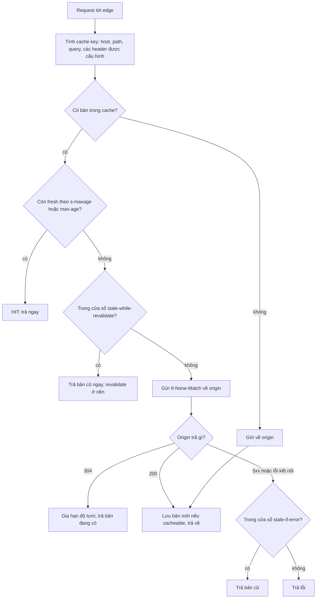
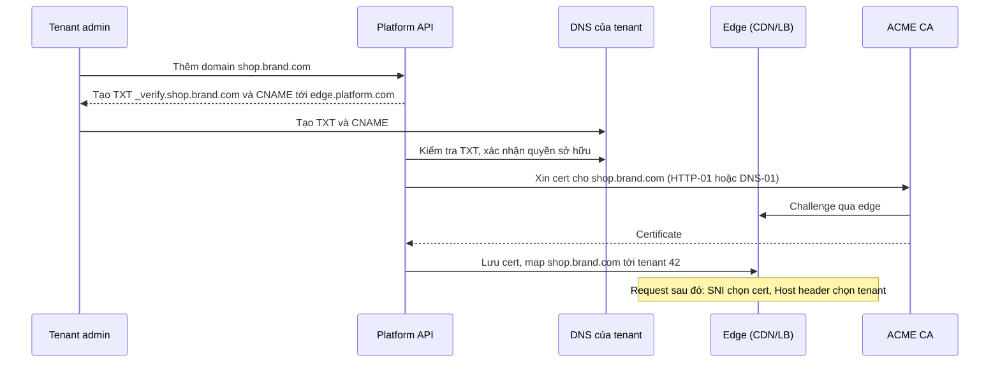

## Bối cảnh & vấn đề

Một nền tảng e-commerce multi-tenant đặt CDN trước API để giảm tải origin. Endpoint `GET /api/price-list` trả bảng giá riêng của từng tenant, tenant được xác định từ header `X-Tenant-Id` mà frontend gửi kèm. Ai đó thêm `Cache-Control: public, max-age=300` để "tăng hit rate". Vài giờ sau, một tenant báo khách hàng của họ đang thấy **bảng giá của tenant khác**.

CDN không có lỗi. Cache key mặc định của nó là method + host + path + query; header `X-Tenant-Id` không nằm trong cache key, và response cũng không khai báo `Vary: X-Tenant-Id`. Với CDN, mọi request `GET /api/price-list` trên cùng host là **cùng một tài nguyên**. Response đầu tiên được cache sẽ trả cho mọi người trong 5 phút.

Cache là tối ưu có đòn bẩy lớn nhất trong hệ thống web: một cache hit ở edge tiết kiệm cả RTT tới origin lẫn tài nguyên của origin. Nhưng cache sai là một trong những sự cố **bảo mật** tệ nhất, vì nó rò dữ liệu của người này sang người khác một cách im lặng. Bài này đi qua mô hình caching của HTTP (RFC 9111), các directive quan trọng, cache key, và cách thiết kế lớp edge cho nền tảng multi-tenant có custom domain.

## Khái niệm

### Private cache, shared cache và CDN

HTTP phân biệt hai loại cache. **Private cache** thuộc về một người dùng: cache của browser. Nó được phép lưu response chứa dữ liệu cá nhân, vì chỉ chính người đó đọc lại. **Shared cache** phục vụ nhiều người dùng: proxy doanh nghiệp, reverse proxy cache (Nginx, Varnish), và **CDN** (Content Delivery Network).

**CDN** là mạng các **edge server** đặt ở hàng trăm địa điểm gần người dùng. Người dùng được đưa tới edge gần nhất (qua **anycast**: cùng một IP được quảng bá từ nhiều nơi, định tuyến Internet tự chọn nơi gần nhất; hoặc qua DNS theo vị trí). Edge terminate TLS, trả response từ cache nếu có, nếu không thì gửi request về **origin** qua connection đã mở sẵn. Như đã thấy ở [hành trình request](/tracks/networking/learn/request-journey), ngay cả khi cache miss, CDN vẫn giúp vì handshake đắt chỉ xảy ra trên đoạn ngắn user → edge.

Vì CDN là shared cache, mọi quyết định "có lưu response này không" phải trả lời câu hỏi: **response này có giống nhau cho mọi người gửi cùng request không?**

**Interview angle:** nói rõ "CDN là shared cache, nên response theo user phải `private` hoặc không cache" là nền cho mọi câu hỏi về rò dữ liệu qua CDN.

### Freshness: max-age, s-maxage và tuổi của response

Một response trong cache ở một trong hai trạng thái: **fresh** (còn tươi, dùng luôn không hỏi origin) hoặc **stale** (cũ, phải revalidate hoặc lấy mới). Thời gian tươi được tính từ các directive của `Cache-Control`:

- **`max-age=N`**: tươi trong N giây, áp dụng cho mọi cache.
- **`s-maxage=N`**: chỉ áp dụng cho **shared cache**, ghi đè `max-age` với chúng. Cho phép "browser giữ 0 giây nhưng CDN giữ 60 giây".
- Header `Age` cho biết response đã nằm trong cache bao lâu; response tươi khi `Age` < thời gian tươi.

Nhiều CDN còn hỗ trợ header riêng chỉ dành cho chúng: **`CDN-Cache-Control`** (RFC 9213) hay `Surrogate-Control`; CDN đọc và thường **gỡ** header đó trước khi gửi xuống browser, cho phép tách chính sách cache của edge khỏi browser một cách rõ ràng.

Ví dụ: `Cache-Control: public, max-age=0, s-maxage=60` cho bảng giá công khai: CDN phục vụ từ cache tối đa 60 giây, browser luôn hỏi lại (và thường được CDN trả rất nhanh).

**Interview angle:** biết `s-maxage` và vì sao cần nó (tách chính sách browser và CDN) là câu trả lời senior cho câu hỏi Cache-Control.

### private, public, no-cache, no-store

Bốn directive hay bị nhầm nhất:

- **`private`**: chỉ private cache (browser) được lưu; shared cache không được lưu. Dùng cho dữ liệu theo user mà vẫn muốn browser cache (trang profile, giỏ hàng).
- **`public`**: shared cache được lưu, **kể cả** khi request có header `Authorization` (mặc định RFC 9111 cấm shared cache lưu response cho request có `Authorization`, trừ khi response có `public`, `s-maxage` hoặc `must-revalidate`). `public` trên response cá nhân là cách nhanh nhất để rò dữ liệu.
- **`no-cache`**: được **lưu**, nhưng **phải revalidate** với origin trước mỗi lần dùng. Tên gây hiểu nhầm; nó không có nghĩa "không cache".
- **`no-store`**: không được lưu ở bất kỳ đâu. Dùng cho dữ liệu nhạy cảm (thông tin thanh toán, token, trang admin).

Thêm hai directive hữu ích: **`must-revalidate`** (khi đã stale thì không được dùng bản cũ nếu không revalidate được, kể cả khi origin chết) và **`immutable`** (nội dung không bao giờ đổi trong thời gian tươi; dùng cho asset có hash trong tên file như `app.3f9a2c.js`).

**Interview angle:** câu hỏi bẫy "`no-cache` nghĩa là không cache?"; trả lời: không, nó nghĩa là phải revalidate; muốn không lưu thì dùng `no-store`.

### Validation: ETag, Last-Modified và 304

Khi response đã stale (hoặc có `no-cache`), cache không nhất thiết phải tải lại toàn bộ; nó có thể **revalidate**. Origin gửi kèm một **validator**: **`ETag`** (định danh phiên bản, thường là hash nội dung) hoặc `Last-Modified`. Lần sau cache gửi request có điều kiện `If-None-Match: "<etag>"` (hoặc `If-Modified-Since`). Nếu nội dung chưa đổi, origin trả **`304 Not Modified`** không có body; cache gia hạn độ tươi và dùng bản đang có. Nếu đã đổi, origin trả `200` với nội dung mới và ETag mới.

Revalidation vẫn tốn một RTT tới origin nhưng tiết kiệm băng thông và thường cả chi phí render (nếu origin tính ETag rẻ hơn tạo body, ví dụ từ `updated_at` hoặc version trong DB). ETag có hai loại: strong (`"abc"`, giống từng byte) và weak (`W/"abc"`, tương đương về ngữ nghĩa); một số proxy biến strong thành weak khi nén lại nội dung.

**Interview angle:** interviewer có thể hỏi "ETag tính thế nào cho rẻ?"; câu trả lời tốt dùng version/`updated_at` thay vì băm toàn bộ body sau khi đã render.

### stale-while-revalidate và stale-if-error

RFC 5861 thêm hai directive giúp che giấu latency và sự cố của origin. **`stale-while-revalidate=N`**: sau khi hết hạn tươi, trong N giây tiếp theo cache được **trả ngay bản cũ** cho người dùng đồng thời gửi một request revalidate **ở nền**. Người dùng không bao giờ phải chờ origin trong cửa sổ đó. **`stale-if-error=N`**: nếu revalidate thất bại (origin trả 5xx hay không kết nối được), cache được dùng bản cũ thêm N giây.

Kết hợp lại: `Cache-Control: public, s-maxage=60, stale-while-revalidate=30, stale-if-error=86400` cho danh mục sản phẩm nghĩa là CDN phục vụ từ cache 60 giây, 30 giây tiếp theo vẫn trả ngay trong khi làm mới nền, và nếu origin sập thì vẫn phục vụ bản cũ tới một ngày. Mức hỗ trợ khác nhau giữa các CDN (verify với CDN của bạn).

**Interview angle:** nhắc `stale-while-revalidate` như công cụ chống **thundering herd** và che latency origin là điểm cộng.

### Cache key và Vary

**Cache key** là thứ CDN dùng để quyết định hai request có phải "cùng một tài nguyên" không. Mặc định thường gồm method, scheme, host, path và query string. Mọi thứ khác (header, cookie) **không** nằm trong key trừ khi bạn cấu hình. **`Vary`** là cách origin nói "response này phụ thuộc vào header X, hãy tách cache theo giá trị của X". `Vary: Accept-Encoding` là phổ biến và vô hại (tách bản gzip, br, không nén). `Vary: Origin` cần thiết khi echo CORS origin (xem [CORS](/tracks/networking/learn/cors-same-origin)).

Nhưng `Vary: Cookie` hoặc `Vary: Authorization` thường đưa **hit rate về gần 0**, vì mỗi user có cookie khác nhau; đó là dấu hiệu response đó vốn không nên ở shared cache. Nhiều CDN còn không tôn trọng đầy đủ `Vary` mà yêu cầu cấu hình cache key tường minh (CloudFront dùng cache policy; các CDN khác có cấu hình tương tự). Nguyên tắc an toàn: **mọi thứ ảnh hưởng tới response phải nằm trong cache key**, hoặc response đó không được cache ở edge.

**Interview angle:** câu "bảng giá của tenant này bị trả cho tenant khác" gần như luôn có đáp án "yếu tố phân biệt tenant không nằm trong cache key, và response bị đánh dấu cacheable".

## Cơ chế hoạt động

Quyết định của một CDN edge khi nhận request:



Đọc sơ đồ từ trên xuống. Bước **tính cache key** là nơi quyết định tính đúng đắn: nếu hai request lẽ ra khác nhau (khác tenant, khác ngôn ngữ, khác user) lại có cùng key, mọi bước sau đều sai. Các bước còn lại quyết định **hiệu năng**: fresh thì trả ngay, stale thì revalidate (rẻ nếu được 304), và `stale-while-revalidate`/`stale-if-error` cho phép edge phục vụ ngay cả khi origin chậm hay sập.

Một response chỉ được **lưu** ở shared cache khi: method cacheable (thường là `GET`), status cacheable, không có `no-store` hay `private`, và (nếu request có `Authorization`) response có `public`/`s-maxage`/`must-revalidate`. Cookie trong request hay `Set-Cookie` trong response được mỗi CDN xử lý khác nhau: nhiều CDN mặc định không cache response có `Set-Cookie`, nhưng đừng dựa vào mặc định.

Luồng onboarding một custom domain của tenant trên nền tảng SaaS:



Tenant chứng minh quyền sở hữu bằng bản ghi **TXT**, rồi trỏ domain về edge của nền tảng bằng **CNAME** (với apex thì dùng ALIAS/A tới IP anycast, xem [DNS](/tracks/networking/learn/dns)). Nền tảng xin certificate tự động qua **ACME** (RFC 8555): HTTP-01 cần domain đã trỏ về edge; DNS-01 cần quyền ghi TXT. Ở runtime, edge dùng **SNI** để chọn certificate (xem [TLS](/tracks/networking/learn/tls-https)) và **Host header** để xác định tenant. Nhiều CDN có sản phẩm "SaaS custom hostnames" làm sẵn toàn bộ luồng này.

## Ví dụ thực tế

### ETag và 304 trên một endpoint catalog

Server trả catalog công khai với `s-maxage=60`, `stale-while-revalidate=30` và ETag tính từ nội dung; client gửi lại với `If-None-Match`:

```ts
import http from "node:http";
import { createHash } from "node:crypto";
import { once } from "node:events";

const catalog = { sku: "A-100", price: 1990, currency: "USD" };

const server = http.createServer((req, res) => {
  const body = JSON.stringify(catalog);
  const etag = `"${createHash("sha1").update(body).digest("base64url").slice(0, 16)}"`;
  res.setHeader("Cache-Control", "public, max-age=0, s-maxage=60, stale-while-revalidate=30");
  res.setHeader("ETag", etag);
  res.setHeader("Vary", "Accept-Encoding");
  if (req.headers["if-none-match"] === etag) return void res.writeHead(304).end();
  res.setHeader("Content-Type", "application/json");
  res.end(body);
});
server.listen(0, "127.0.0.1");
await once(server, "listening");
const url = `http://127.0.0.1:${(server.address() as { port: number }).port}/catalog/A-100`;

const r1 = await fetch(url);
const etag = r1.headers.get("etag")!;
console.log("1st:", r1.status, "etag", etag, "bytes", (await r1.text()).length);
console.log("    cache-control:", r1.headers.get("cache-control"));
const r2 = await fetch(url, { headers: { "If-None-Match": etag } });
console.log("2nd:", r2.status, "bytes", (await r2.text()).length);
catalog.price = 2190;
const r3 = await fetch(url, { headers: { "If-None-Match": etag } });
console.log("3rd:", r3.status, "etag", r3.headers.get("etag"), "bytes", (await r3.text()).length);
server.close();
```

Output trên Node 24:

```text
1st: 200 etag "W0VDPGlX5OoVnoJY" bytes 45
    cache-control: public, max-age=0, s-maxage=60, stale-while-revalidate=30
2nd: 304 bytes 0
3rd: 200 etag "Xhp7MhM0mJMCqpjf" bytes 45
```

Lần 2 nội dung chưa đổi nên origin trả `304` không body; lần 3 giá đổi nên ETag đổi và origin trả `200` với nội dung mới. Với payload thật cỡ vài trăm KB, `304` tiết kiệm đáng kể băng thông, và nếu ETag lấy từ `updated_at` trong DB thì origin còn khỏi phải render body.

### Sửa sự cố bảng giá rò giữa tenant

Nguyên nhân là tổ hợp: response được đánh dấu `public` (cho phép shared cache lưu), yếu tố phân biệt tenant (`X-Tenant-Id`) không nằm trong cache key, và không có `Vary`. Có ba hướng sửa, chọn theo mức độ dữ liệu thực sự giống nhau giữa các người dùng:

```ts
// Option A: data differs per user or is sensitive -> never cache at the edge
res.setHeader("Cache-Control", "private, no-cache");

// Option B: data differs per tenant only -> put the tenant in the URL (part of every cache key)
//   GET /api/tenants/42/price-list
res.setHeader("Cache-Control", "public, max-age=0, s-maxage=300, stale-while-revalidate=60");

// Option C: tenant is derived from the Host (custom domain) -> make sure Host is in the cache key
//   and keep Vary for anything else that changes the body
res.setHeader("Vary", "Accept-Encoding");
```

Phương án B an toàn nhất vì tenant nằm trong **path**, thứ mà mọi CDN luôn đưa vào cache key; không phụ thuộc cấu hình `Vary` hay cache policy. Nếu bắt buộc giữ header, cấu hình cache policy của CDN để đưa header đó vào key **và** thêm `Vary: X-Tenant-Id`, rồi viết test tự động: gọi cùng URL với hai tenant và assert body khác nhau. Sau khi sửa, **purge** cache của đường dẫn đó để xoá các bản đã rò.

Headers minh hoạ (illustrative) trước và sau khi sửa, khi gọi qua CDN:

```text
# before
GET /api/price-list   X-Tenant-Id: 7   ->  200  x-cache: Hit from edge   (body of tenant 3)
# after
GET /api/tenants/7/price-list          ->  200  x-cache: Miss from edge  (body of tenant 7)
GET /api/tenants/7/price-list          ->  200  x-cache: Hit from edge   (body of tenant 7)
```

## Trade-offs & lựa chọn thay thế

| Chính sách | Hit rate | Độ tươi | Rủi ro | Phù hợp |
| --- | --- | --- | --- | --- |
| `no-store` | 0 | Luôn mới | Không | Dữ liệu nhạy cảm, thanh toán |
| `private, no-cache` | Chỉ browser, luôn revalidate | Mới | Thấp | Dữ liệu theo user |
| `public, s-maxage` ngắn + SWR | Cao | Trễ tối đa vài chục giây | Rò dữ liệu nếu cache key sai | Catalog, bảng giá theo tenant (tenant trong URL) |
| `public, max-age` dài + `immutable` | Rất cao | Đổi URL khi đổi nội dung | Gần như không | Asset có hash trong tên file |
| Purge theo sự kiện + TTL dài | Rất cao | Gần tức thì khi purge thành công | Purge lỗi để lại dữ liệu cũ lâu | Nội dung ít đổi, cần cập nhật nhanh |

Khi nào chọn gì. Asset tĩnh: **tên file có hash + `max-age=31536000, immutable`**, không bao giờ cần purge. API công khai hoặc theo tenant: **`s-maxage` ngắn + `stale-while-revalidate`**, với yếu tố phân biệt nằm trong URL hoặc Host; chấp nhận dữ liệu trễ vài chục giây để đổi lấy tải origin thấp và latency ổn định. Dữ liệu theo user: không cache ở edge, chỉ tối ưu bằng ETag ở browser. TTL dài kèm purge theo sự kiện chỉ nên dùng khi purge là một phần được giám sát của luồng cập nhật, vì một lần purge lỗi có thể để dữ liệu sai sống rất lâu.

Với thiết kế edge cho multi-tenant custom domain: dùng sản phẩm custom hostname của CDN nếu quy mô vừa phải (nhanh, không phải tự vận hành ACME và lưu trữ cert), tự xây với ACME + lưu cert tập trung khi cần kiểm soát hoàn toàn hoặc số domain rất lớn. Dù cách nào, cache key luôn phải có Host, rate limit và WAF nên theo tenant để cô lập noisy neighbor, và cần giám sát cert sắp hết hạn cùng các domain đã bị tenant gỡ DNS.

## Edge cases & failure modes

- **Rò dữ liệu qua cache**: response cá nhân bị đánh dấu `public`, hay yếu tố phân biệt không nằm trong cache key; kiểm thử tự động với nhiều user/tenant cho mọi endpoint cacheable.
- **Cache `Set-Cookie`**: response có `Set-Cookie` bị cache và phát cho người khác, gán session của người này cho người kia; đảm bảo CDN không cache response có `Set-Cookie` hoặc gỡ nó.
- **Thundering herd khi hết hạn**: một key nóng hết hạn cùng lúc ở nhiều edge, hàng nghìn request dội về origin; dùng `stale-while-revalidate`, request collapsing của CDN, hoặc origin shield.
- **Cache poisoning qua unkeyed header**: origin dùng một header (như `X-Forwarded-Host`) để tạo link trong response nhưng header đó không nằm trong cache key; kẻ tấn công gửi header độc hại một lần và response độc bị cache cho mọi người.
- **Purge không đồng bộ**: purge lan tới các edge trong vài giây tới vài phút; trong khoảng đó người dùng ở các vùng khác nhau thấy phiên bản khác nhau.
- **Dangling CNAME của tenant**: tenant gỡ DNS nhưng nền tảng vẫn cấu hình hostname (hoặc ngược lại, tenant để CNAME trỏ vào nền tảng sau khi huỷ tài khoản); kẻ khác có thể đăng ký hostname đó trên nền tảng và chiếm domain của tenant (subdomain takeover). Định kỳ kiểm tra DNS và thu hồi hostname không còn trỏ đúng.
- **Rate limit của ACME**: onboarding hàng loạt domain hoặc retry lỗi liên tục chạm giới hạn cấp cert của CA; cần hàng đợi và backoff.

## Pitfalls

- ❌ Thêm `public, max-age` vào endpoint trả dữ liệu theo user/tenant để "tăng hit rate" → ✅ đưa yếu tố phân biệt vào URL/Host, hoặc dùng `private`, vì CDN là shared cache.
- ❌ Dùng `no-cache` khi muốn không lưu → ✅ `no-store`; `no-cache` vẫn lưu, chỉ bắt revalidate.
- ❌ `Vary: Cookie` cho mọi response → ✅ tách dữ liệu cá nhân ra endpoint riêng không cache ở edge, vì `Vary: Cookie` đưa hit rate về 0.
- ❌ Purge CDN mỗi lần deploy asset → ✅ tên file có hash + `immutable`, không cần purge.
- ❌ Echo CORS origin mà thiếu `Vary: Origin` → ✅ luôn thêm `Vary: Origin`, nếu không CDN trả header CORS của origin này cho origin khác.
- ❌ Chỉ đo server latency sau khi bật CDN → ✅ đo hit rate, TTFB phía client theo vùng, và tỉ lệ request về origin.
- ❌ Để custom hostname của tenant tồn tại mãi → ✅ kiểm tra DNS định kỳ, thu hồi hostname không còn trỏ về nền tảng, để tránh subdomain takeover.

## Tóm tắt

- **Private cache** (browser) được lưu dữ liệu cá nhân; **shared cache** (CDN, proxy) phục vụ nhiều người nên chỉ lưu response giống nhau cho mọi người.
- `max-age` cho mọi cache, `s-maxage` cho shared cache; `private` chỉ browser, `public` cho phép shared cache kể cả khi có `Authorization`.
- `no-cache` = lưu nhưng phải revalidate; `no-store` = không lưu; `immutable` cho asset có hash.
- **ETag + `If-None-Match` → 304** tiết kiệm băng thông khi revalidate; `stale-while-revalidate` và `stale-if-error` che latency và sự cố origin.
- **Cache key** quyết định tính đúng đắn: mọi thứ ảnh hưởng tới response phải nằm trong key (tốt nhất là trong URL/Host); `Vary` tách cache theo header.
- Rò dữ liệu giữa tenant qua CDN = response cacheable + yếu tố tenant không nằm trong cache key.
- Edge cho custom domain: TXT xác minh, CNAME/ALIAS tới edge, ACME cấp cert theo SNI, Host → tenant, và giám sát dangling CNAME.
