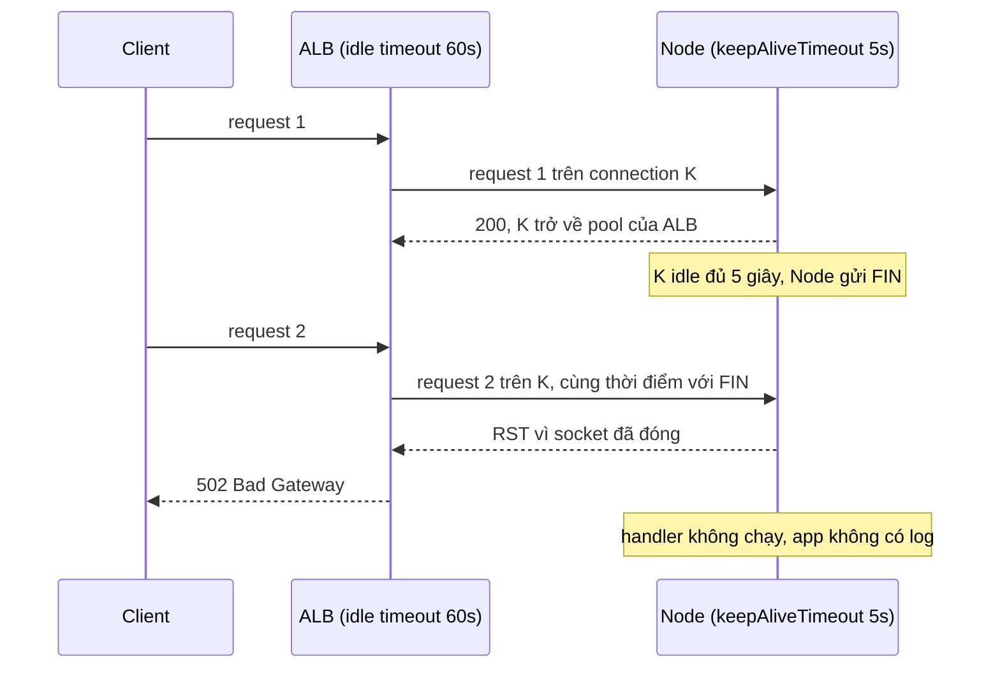
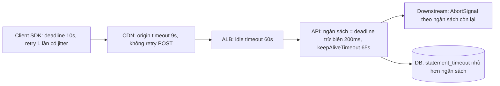

## Bối cảnh & vấn đề

API Node chạy sau AWS ALB. Traffic vừa phải, CPU 30%, không có lỗi nào trong log ứng dụng. Nhưng metric `HTTPCode_ELB_502_Count` cho thấy khoảng 0,1% request trả **502**, rải rác suốt ngày. Team thử tăng số pod, tăng memory, thêm retry ở client; con số không đổi. Ai đó còn đề xuất "chuyển sang NLB cho chắc".

Cùng thời gian, team khác gặp vấn đề upload: file lớn hơn khoảng 1 MB bị Nginx trả `413 Request Entity Too Large`. Một đồng nghiệp "sửa" bằng `client_max_body_size 0;` (không giới hạn) và `proxy_read_timeout 3600s;`. Hết `413`, nhưng giờ một số upload lớn **treo mãi**, và có lần disk của node Nginx đầy.

Cả hai sự cố có chung một gốc: **mỗi hop trong chuỗi proxy có timeout và hành vi buffering riêng**, và khi chúng không được phối hợp, lỗi xuất hiện ở những chỗ ứng dụng không nhìn thấy. Bài này dạy cách đọc mã lỗi của proxy để biết điều tra ở đâu, giải thích keep-alive race gây 502, cách cấu hình Node và Nginx, và cách thiết kế timeout/retry nhất quán cho cả chuỗi client → CDN → LB → API → downstream → DB.

## Khái niệm

### 502, 503, 504 và 499: mỗi mã chỉ một hướng điều tra

Khi bạn thấy 5xx từ một reverse proxy (ALB, Nginx, Envoy, CDN), mã lỗi cho biết **proxy đã thấy gì** ở phía upstream:

- **`502 Bad Gateway`**: proxy nhận được response **không hợp lệ** từ upstream, hoặc connection tới upstream bị **đóng/reset** giữa chừng. Nguyên nhân điển hình: app crash hoặc restart (OOM kill), keep-alive race, upstream trả response sai giao thức (gửi HTTPS tới port HTTP), header response quá lớn. Hướng điều tra: log connection, restart/OOM, cấu hình keep-alive.
- **`503 Service Unavailable`**: không có upstream nào khoẻ để gửi tới, hoặc proxy/app chủ động từ chối vì quá tải hay đang maintenance. Nên kèm header `Retry-After`. Hướng điều tra: health check, số target khoẻ, capacity, circuit breaker.
- **`504 Gateway Timeout`**: upstream **không trả lời** trong timeout của proxy. Nguyên nhân điển hình: query DB chậm, deadlock, event loop bị block, downstream treo. Hướng điều tra: latency upstream, và con số timeout của proxy.
- **`499`** (riêng Nginx, không có trong RFC): **client tự đóng** connection trước khi Nginx kịp trả lời. Thường là client timeout ngắn hơn server, hoặc người dùng bấm hủy.

Con số thời gian là manh mối mạnh. 504 xuất hiện **đúng tròn 60 giây** gần như chắc chắn là timeout mặc định của một hop nào đó (ALB idle timeout mặc định 60 giây, Nginx `proxy_read_timeout` mặc định 60 giây). Tìm hop có timeout đó, rồi tìm vì sao upstream chậm hơn nó.

**Interview angle:** interviewer muốn nghe mỗi mã dẫn tới một hướng điều tra khác nhau, và "504 đúng 60 giây" là gợi ý về timeout mặc định chứ không phải về app.

### ALB access log: elb_status_code và target_status_code

ALB ghi hai status trong access log: **`elb_status_code`** (cái client nhận) và **`target_status_code`** (cái target trả). Nếu `elb_status_code = 502` và `target_status_code = -`, nghĩa là ALB **không nhận được response nào** từ target: connection bị đóng, reset, hay target trả dữ liệu không đọc được. Kết hợp với `target_processing_time = -1` và thời điểm request, đây là dấu vân tay của lỗi ở tầng connection, không phải lỗi trong code.

Nếu `target_status_code = 502` thì chính app (hoặc một proxy phía sau ALB, như Nginx sidecar) trả 502; lúc đó cần nhìn xuống hop tiếp theo.

Ví dụ một dòng log (đã rút gọn, illustrative): `... 0.000 -1 -1 502 - 312 0 "GET https://api.example.com:443/orders HTTP/1.1" ...`: `request_processing_time` 0, `target_processing_time` -1, `elb_status_code` 502, `target_status_code` `-`.

**Interview angle:** biết đọc `target_status_code = -` để phân biệt "app trả lỗi" với "connection tới app có vấn đề" là kỹ năng debug production rất được đánh giá cao.

### Timeout của Node HTTP server

`http.Server` của Node có bốn timeout cần biết (giá trị mặc định kiểm chứng trên Node 24, verify với phiên bản của bạn):

- **`server.keepAliveTimeout`** (mặc định **5.000 ms**): sau khi gửi xong response, giữ connection idle bao lâu để chờ request tiếp theo trước khi đóng.
- **`server.headersTimeout`** (mặc định **60.000 ms**): thời gian tối đa để nhận xong header của một request; chống Slowloris.
- **`server.requestTimeout`** (mặc định **300.000 ms**): thời gian tối đa để nhận xong toàn bộ request (header + body).
- **`server.timeout`** (mặc định 0, tức tắt): socket inactivity timeout.

Điểm then chốt là **`keepAliveTimeout` 5 giây nhỏ hơn rất nhiều so với idle timeout của load balancer** (ALB mặc định 60 giây, có thể cấu hình 1–4.000 giây). LB giữ connection tới target trong pool của nó lâu hơn app sẵn sàng giữ; đó là tiền đề của keep-alive race. Khi tăng `keepAliveTimeout`, lời khuyên phổ biến là giữ `headersTimeout` lớn hơn `keepAliveTimeout` (từng có bug ở một số phiên bản Node cũ khi ngược lại, verify).

**Interview angle:** thuộc hai con số "Node 5 giây, ALB 60 giây" và biết quy tắc "upstream giữ idle lâu hơn downstream" là đủ để trả lời câu 502 kinh điển.

### Keep-alive race

**Keep-alive race** xảy ra khi hai đầu của một connection keep-alive idle có timeout khác nhau, và bên có timeout **ngắn hơn** là bên **nhận** request. Server (Node) đóng connection idle sau 5 giây bằng cách gửi `FIN`. Đúng trong khoảng vài mili giây đó, LB (vẫn coi connection là còn dùng được vì timeout của nó là 60 giây) lấy connection từ pool và gửi request mới. Request tới một socket mà server đã đóng: server trả `RST`, LB không nhận được response, và trả **502** cho client.

App không log gì vì request **chưa bao giờ tới handler**. Tỉ lệ lỗi tỉ lệ với số lần connection idle đúng khoảng 5 giây rồi được tái sử dụng, nên nó xuất hiện ở traffic vừa phải (traffic rất cao thì connection hiếm khi idle đủ lâu, traffic rất thấp thì ít request rơi vào cửa sổ race). Cách sửa là đảo ngược thứ tự: **app giữ idle lâu hơn LB** (`keepAliveTimeout` = 65 giây với ALB 60 giây), để LB luôn là bên đóng connection idle trước. Bên chủ động đóng sẽ không bao giờ gửi request vào socket mà chính nó đã đóng.

Đây là cùng một quy tắc đã gặp ở [TCP connection](/tracks/networking/learn/tcp-connections), nhìn từ phía server: **bên gửi request phải bỏ connection idle trước bên nhận**.

**Interview angle:** câu trả lời mạnh vừa đưa ra giả thuyết (race), vừa đưa ra bằng chứng xác nhận (access log `target_status_code = -`), vừa loại trừ nguyên nhân khác (OOM, restart, health check).

### Buffering ở reverse proxy: body lớn và response stream

Nginx mặc định **buffer** cả hai chiều. **`proxy_request_buffering on`**: Nginx đọc **toàn bộ** request body của client (ra file tạm trên disk nếu lớn) rồi mới gửi cho upstream. Ưu điểm: upstream không bị chiếm connection bởi client upload chậm. Nhược điểm: upload 2 GB chiếm 2 GB disk tạm của Nginx, và upstream không thấy byte nào cho tới khi client gửi xong. **`proxy_buffering on`**: Nginx buffer response của upstream, nên response streaming (SSE, stream token) bị giữ lại (xem [Realtime](/tracks/networking/learn/realtime)).

Giới hạn kích thước body: **`client_max_body_size`** mặc định **1m**; vượt quá thì trả `413`. Đặt `0` nghĩa là **không giới hạn**, mở cửa cho việc một client gửi body vô hạn làm đầy disk tạm. Timeout: `proxy_connect_timeout`, `proxy_send_timeout`, `proxy_read_timeout` đều mặc định **60 giây**; `proxy_read_timeout` là thời gian tối đa giữa **hai lần đọc liên tiếp** từ upstream, không phải tổng thời gian response.

Còn một chi tiết hay bị bỏ qua: Nginx mặc định nói **HTTP/1.0** với upstream và không giữ connection. Muốn keep-alive tới upstream phải có `keepalive N` trong block `upstream`, `proxy_http_version 1.1`, và `proxy_set_header Connection ""`.

**Interview angle:** câu review config Nginx upload chấm điểm ở chỗ bạn thấy **cả ba**: `0` là DoS, buffering chiếm disk và che tiến độ, timeout 3.600 giây che upstream bị kẹt; và đề xuất presigned URL.

### Timeout budget, deadline và retry amplification

Trong một chuỗi client → CDN → LB → API → downstream → DB, timeout phải **giảm dần từ ngoài vào trong**. Mỗi tầng bên trong phải bỏ cuộc **trước** tầng bên ngoài, để nó còn thời gian trả một lỗi có nghĩa (một `503` có body giải thích, một fallback) thay vì bị tầng ngoài cắt ngang và trả `504` chung chung. Nếu API chờ DB 30 giây nhưng LB chỉ chờ API 10 giây, 20 giây còn lại của query là **công việc vô ích**: client đã nhận 504 từ lâu.

Cách làm tốt hơn timeout cố định từng hop là **deadline propagation**: tầng ngoài cùng đặt một **deadline tuyệt đối** (thời điểm phải xong), truyền xuống qua header (gRPC có sẵn `grpc-timeout`); mỗi tầng tính ngân sách còn lại = deadline − bây giờ − biên an toàn, và dùng nó làm timeout cho lời gọi tiếp theo. Tầng nào thấy ngân sách đã âm thì trả lỗi ngay, không gọi xuống nữa.

**Retry amplification**: nếu SDK retry 3 lần (4 lần thử), API retry downstream 3 lần (4 lần thử), LB retry 1 lần (2 lần thử), thì một request của người dùng có thể thành **4 × 2 × 4 = 32** lời gọi tới downstream trong trường hợp xấu nhất, đúng lúc downstream đang quá tải. Quy tắc: retry ở **một tầng** (thường gần client nhất có đủ ngữ cảnh), chỉ cho request idempotent (xem [HTTP semantics](/tracks/networking/learn/http-versions)), với **exponential backoff + jitter** và **retry budget** (ví dụ retry không quá 10% số request). Thêm **circuit breaker**: khi downstream lỗi liên tục, ngừng gọi một thời gian và trả fallback ngay.

Một ngoại lệ quan trọng: **idle/keep-alive timeout đi theo chiều ngược lại**. Timeout xử lý (request/response) giảm dần từ ngoài vào trong; timeout giữ connection idle thì **tăng dần** từ ngoài vào trong (app > LB > client), như phần keep-alive race ở trên.

**Interview angle:** câu hỏi mở về timeout chain chấm điểm ở ba ý: giảm dần + deadline propagation, retry ở một tầng + phép nhân amplification, và phân biệt idle timeout đi ngược chiều.

## Cơ chế hoạt động

Keep-alive race giữa ALB (idle 60 giây) và Node (keepAliveTimeout 5 giây):



FIN của Node và request của ALB "đi ngang qua nhau" trên dây. ALB chưa kịp xử lý FIN nên vẫn coi K là dùng được. Khi đặt `keepAliveTimeout` = 65 giây, ALB đóng K sau 60 giây idle, trước khi Node nghĩ tới việc đóng; ALB không bao giờ gửi request vào một connection mà chính nó đã đóng, nên race biến mất.

Timeout budget cho cả chuỗi, với timeout xử lý giảm dần và idle timeout tăng dần:



Đọc từ trái sang phải: mỗi tầng có ít thời gian hơn tầng bên trái nó cho việc **xử lý**, và chỉ có một tầng (SDK) được retry. Với **idle timeout** thì ngược lại: ALB 60 giây, app 65 giây, để bên phía client của mỗi connection luôn là bên đóng trước. Lưu ý với ALB: idle timeout cũng là thời gian tối đa ALB chờ target trả byte đầu tiên, nên request xử lý lâu hơn 60 giây sẽ nhận 504 từ ALB bất kể timeout của app.

## Ví dụ thực tế

### Sửa 502 lẻ tẻ sau ALB

```ts
import express from "express";

const app = express();
app.get("/orders", (_req, res) => res.json({ orders: [] }));

const server = app.listen(3000);
server.keepAliveTimeout = 65_000; // > ALB idle timeout (60s): the ALB always closes idle connections first
server.headersTimeout = 66_000;   // keep it above keepAliveTimeout
// requestTimeout (default 300s) stays: it bounds slow uploads, not idle keep-alive
```

Kiểm chứng trước và sau khi deploy bằng ALB access log (Athena), đếm các dòng `elb_status_code = 502` với `target_status_code = '-'`:

```sql
SELECT date_trunc('hour', from_iso8601_timestamp(time)) AS hour, count(*) AS elb_502_no_target_response
FROM alb_logs
WHERE elb_status_code = 502 AND target_status_code = '-'
GROUP BY 1 ORDER BY 1;
```

Kết quả minh hoạ (illustrative) quanh thời điểm deploy lúc 14:00:

```text
        hour         | elb_502_no_target_response
---------------------+----------------------------
 2026-09-28 12:00:00 |                        131
 2026-09-28 13:00:00 |                        127
 2026-09-28 14:00:00 |                         41
 2026-09-28 15:00:00 |                          0
```

Nếu 502 vẫn còn sau khi sửa, loại trừ các nguyên nhân khác: pod bị OOM kill hay restart (so thời điểm với sự kiện của orchestrator), health check làm target bị deregister khi đang có request (cần deregistration delay và xử lý `SIGTERM`), response header quá lớn, hoặc target nói sai giao thức. Câu hỏi follow-up: giữa service Node và một upstream mà nó gọi bằng keep-alive agent, vai trò đảo lại: Node là **client**, nên agent của Node phải bỏ connection idle **trước** upstream (idle timeout của agent nhỏ hơn keepAliveTimeout của upstream).

### Upload lớn qua Nginx

Config ban đầu và các vấn đề:

```nginx
server {
  listen 443 ssl;
  client_max_body_size 0;          # "fix": unlimited -> anyone can fill the temp disk
  proxy_read_timeout 3600s;        # hides a stuck upstream for an hour
  proxy_request_buffering on;      # whole body goes to disk before Node sees a byte
  location /upload {
    proxy_pass http://node_upstream;
  }
}
```

Bản sửa theo từng endpoint, giữ giới hạn mặc định chặt cho phần còn lại:

```nginx
upstream node_upstream {
  server 127.0.0.1:3000;
  keepalive 32;
}
server {
  listen 443 ssl;
  client_max_body_size 1m;                  # default for normal API calls

  location /upload {
    client_max_body_size 50m;               # explicit, per endpoint
    proxy_request_buffering off;            # stream the body to Node as it arrives
    proxy_read_timeout 60s;                 # fail fast if the upstream stalls
    proxy_http_version 1.1;
    proxy_set_header Connection "";
    proxy_pass http://node_upstream;
  }
}
```

Tốt nhất là đưa app ra khỏi đường đi của dữ liệu: API cấp **presigned URL**, client upload thẳng lên object storage:

```ts
import { S3Client, PutObjectCommand } from "@aws-sdk/client-s3";
import { getSignedUrl } from "@aws-sdk/s3-request-presigner";
import { randomUUID } from "node:crypto";

const s3 = new S3Client({});

export async function createUploadUrl(userId: string, contentType: string, size: number) {
  if (size > 50 * 1024 * 1024) throw new Error("file too large");
  const key = `uploads/${userId}/${randomUUID()}`;
  const url = await getSignedUrl(
    s3,
    new PutObjectCommand({ Bucket: "user-uploads", Key: key, ContentType: contentType, ContentLength: size }),
    { expiresIn: 300 },
  );
  return { url, key }; // client PUTs the file to `url`, then tells the API that `key` is ready
}
```

Presigned PUT ký cả `ContentType` và `ContentLength` nên client không đổi được sau khi xin URL (verify cách SDK phiên bản của bạn đưa header vào chữ ký); với nhu cầu giới hạn khoảng kích thước linh hoạt hơn, dùng presigned POST với policy `content-length-range`. Vì file không còn đi qua app, các kiểm tra an toàn phải chuyển sang **sau khi upload**: sự kiện S3 kích hoạt worker quét virus, kiểm tra magic bytes thay vì tin `Content-Type`, và chỉ đánh dấu file là "sẵn sàng" khi qua hết.

### Deadline propagation giữa hai service

API đọc deadline tuyệt đối từ header, trừ biên an toàn, và truyền tiếp xuống pricing:

```ts
import http from "node:http";
import { once } from "node:events";
import { setTimeout as sleep } from "node:timers/promises";

// Downstream "pricing" service: sometimes slow.
const pricing = http.createServer(async (req, res) => {
  await sleep(req.url === "/slow" ? 800 : 50);
  res.end(JSON.stringify({ price: 1990 }));
});
pricing.listen(0, "127.0.0.1"); await once(pricing, "listening");
const pricingUrl = `http://127.0.0.1:${(pricing.address() as any).port}`;

// API: reads the caller's absolute deadline, keeps a safety margin, propagates it.
const api = http.createServer(async (req, res) => {
  const deadline = Number(req.headers["x-request-deadline"] ?? Date.now() + 1000);
  const budget = deadline - Date.now() - 50; // 50 ms to build our own response
  if (budget <= 0) return void res.writeHead(504).end("deadline already passed");
  try {
    const r = await fetch(pricingUrl + req.url, {
      signal: AbortSignal.timeout(budget),
      headers: { "x-request-deadline": String(deadline - 50) },
    });
    res.end(await r.text());
  } catch (e) {
    res.writeHead(504).end(`pricing timed out after ${budget} ms (${(e as Error).name})`);
  }
});
api.listen(0, "127.0.0.1"); await once(api, "listening");
const apiUrl = `http://127.0.0.1:${(api.address() as any).port}`;

for (const path of ["/fast", "/slow"]) {
  const t0 = Date.now();
  const r = await fetch(apiUrl + path, { headers: { "x-request-deadline": String(t0 + 500) } });
  console.log(`${path}: ${r.status} after ${Date.now() - t0} ms -> ${await r.text()}`);
}
api.close(); pricing.close();
process.exit(0);
```

Output trên Node 24:

```text
/fast: 200 after 70 ms -> {"price":1990}
/slow: 504 after 458 ms -> pricing timed out after 449 ms (TimeoutError)
```

Client cho 500 ms; API trả lỗi có nghĩa sau 458 ms, **trước** deadline của client, thay vì để client tự timeout mà không biết tầng nào chậm. Pricing cũng nhận được deadline và (nếu cài đặt tương tự) sẽ tự hủy công việc khi quá hạn thay vì tiếp tục tốn tài nguyên. Deadline dùng thời gian tuyệt đối nên phụ thuộc đồng hồ các máy được đồng bộ (NTP); gRPC tránh vấn đề này bằng cách truyền **thời lượng còn lại** thay vì thời điểm.

## Trade-offs & lựa chọn thay thế

| Chiến lược timeout/retry | Ưu | Nhược | Khi nào dùng |
| --- | --- | --- | --- |
| Timeout cố định mỗi hop | Đơn giản, dễ cấu hình | Dễ lệch, tầng trong làm việc vô ích sau khi tầng ngoài đã bỏ cuộc | Hệ thống nhỏ, ít hop |
| Deadline propagation | Mọi tầng biết ngân sách thật, hủy công việc vô ích | Phải truyền header qua mọi service, cần đồng hồ đồng bộ nếu dùng thời điểm tuyệt đối | Microservices, gRPC |
| Retry ở mọi tầng | "Bền" khi lỗi thoáng qua | Amplification nhân lên, bão retry khi quá tải | Tránh |
| Retry một tầng + backoff + jitter + budget | Kiểm soát được tải, vẫn chịu lỗi thoáng qua | Phải thống nhất tầng nào retry | Mặc định |
| Circuit breaker + fallback | Fail nhanh, bảo vệ downstream đang chết | Cần chọn ngưỡng, fallback phải có ý nghĩa | Downstream không thiết yếu hoặc hay chập chờn |

| Upload lớn | Ưu | Nhược |
| --- | --- | --- |
| Qua Nginx với buffering | Upstream không bị client chậm chiếm giữ | Tốn disk tạm, app không thấy tiến độ |
| Qua Nginx, `proxy_request_buffering off` | Stream tới app, không tốn disk | App bị chiếm connection bởi client chậm |
| Presigned URL lên object storage | App ra khỏi đường dữ liệu, scale vô hạn | Kiểm tra an toàn chuyển sang xử lý bất đồng bộ sau upload |

Khi nào chọn gì. Với timeout, tối thiểu phải đảm bảo **thứ tự đúng** (xử lý giảm dần vào trong, idle tăng dần vào trong) ngay cả khi chưa có deadline propagation; thêm deadline khi số hop nội bộ từ ba trở lên. Retry chỉ ở một tầng, với ngân sách; circuit breaker cho mọi downstream mà việc nó chậm có thể kéo sập service của bạn. Với upload, presigned URL là mặc định cho file từ vài MB trở lên; qua proxy chỉ khi cần xử lý nội dung đồng bộ.

## Edge cases & failure modes

- **Keep-alive race hai chiều**: đã sửa phía ALB → app nhưng quên phía app → upstream (agent keep-alive của app giữ lâu hơn upstream); cùng một bài toán, vai trò đảo ngược.
- **Request dài hơn idle timeout của ALB**: export báo cáo 90 giây nhận 504 lúc 60 giây dù app vẫn đang chạy và sẽ trả kết quả vào hư không; chuyển sang job bất đồng bộ + polling, hoặc tăng idle timeout có chủ đích.
- **Retry storm**: downstream chậm → timeout → retry ở nhiều tầng → tải tăng gấp nhiều lần → downstream chậm hơn; backoff + jitter + budget + circuit breaker.
- **Timeout không hủy công việc**: client đã bỏ, nhưng query DB vẫn chạy tới cùng; truyền `AbortSignal` xuống, đặt `statement_timeout` ở DB.
- **Deploy gây 502**: target bị rút khỏi LB trong khi còn request dở; cần deregistration delay, xử lý `SIGTERM` (ngừng nhận connection mới, chờ request đang chạy, đóng keep-alive), và readiness fail trước khi process dừng.
- **Proxy buffer làm đầy disk**: `client_max_body_size 0` + buffering bật = một client có thể làm đầy thư mục tạm của Nginx và làm hỏng mọi request khác trên node đó.
- **499 hàng loạt**: client (SDK mobile, CDN) có timeout ngắn hơn server; server vẫn làm việc cho request mà không ai chờ kết quả.

## Pitfalls

- ❌ Thêm retry ở client để "che" 502 lẻ tẻ → ✅ tìm keep-alive race: `keepAliveTimeout` của app phải lớn hơn idle timeout của LB.
- ❌ Đổ lỗi cho ALB mà không kiểm tra timeout → ✅ đọc access log: `target_status_code = -` nghĩa là lỗi ở tầng connection, không phải ở code.
- ❌ `client_max_body_size 0` để hết 413 → ✅ giới hạn hợp lý theo endpoint, hoặc presigned URL cho file lớn.
- ❌ Tăng `proxy_read_timeout` lên một giờ → ✅ fail nhanh và đưa việc dài ra job bất đồng bộ, vì timeout dài chỉ che upstream bị kẹt.
- ❌ Timeout của API dài hơn timeout của LB phía trước → ✅ timeout xử lý giảm dần từ ngoài vào trong, hoặc truyền deadline.
- ❌ Retry ở SDK, API và LB cùng lúc → ✅ retry ở một tầng, chỉ request idempotent, backoff + jitter + retry budget.
- ❌ Nghĩ `proxy_read_timeout` là tổng thời gian response → ✅ nó là khoảng tối đa giữa hai lần đọc liên tiếp từ upstream.

## Tóm tắt

- **502** = response lỗi hoặc connection bị đóng/reset từ upstream; **503** = không có upstream khoẻ hoặc quá tải; **504** = upstream không trả lời kịp; **499** (Nginx) = client tự đóng.
- 504 tròn 60 giây gần như luôn là timeout mặc định của một hop (ALB idle, Nginx `proxy_read_timeout`).
- ALB log `target_status_code = -` với 502 nghĩa là không có response từ target: nghi keep-alive race, crash, restart.
- Node `keepAliveTimeout` mặc định 5 giây < ALB 60 giây gây **keep-alive race**; đặt 65 giây và `headersTimeout` lớn hơn.
- Nginx mặc định `client_max_body_size 1m`, buffer request và response, timeout 60 giây; upload lớn nên dùng presigned URL.
- Timeout xử lý **giảm dần** từ ngoài vào trong (tốt nhất là deadline propagation); idle timeout **tăng dần** vào trong.
- Retry ở **một tầng**, chỉ idempotent, backoff + jitter + budget; amplification là tích số lần thử của mọi tầng; thêm circuit breaker.
