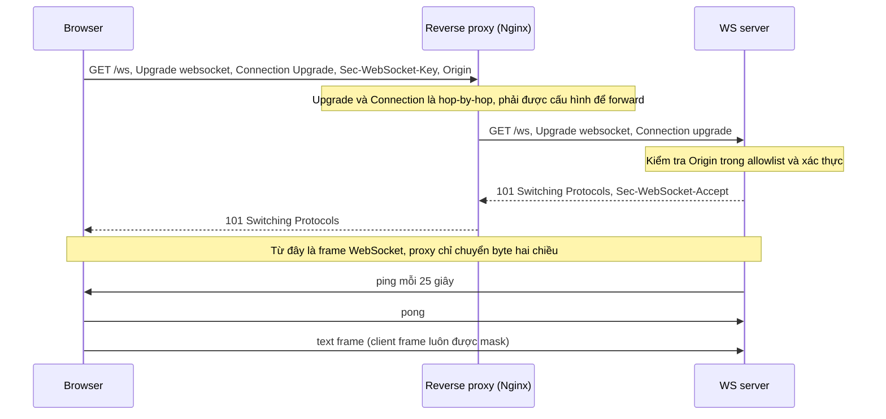
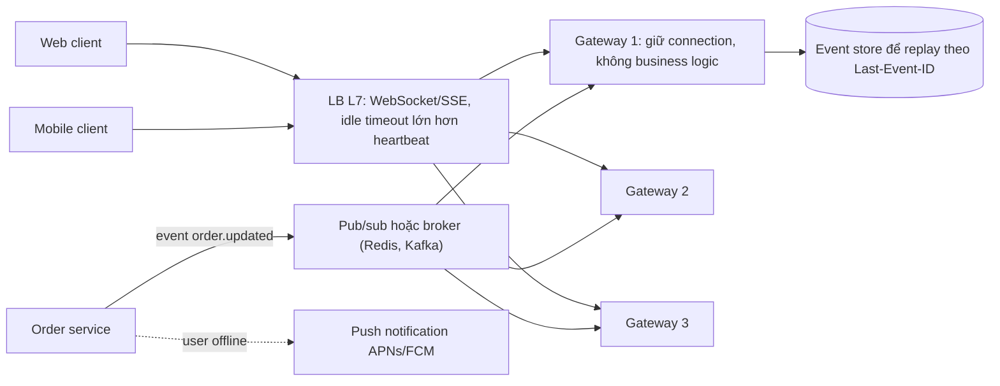

## Bối cảnh & vấn đề

Tính năng "trạng thái đơn hàng realtime" chạy hoàn hảo trên môi trường dev: một instance Socket.IO, người dùng thấy "Đang giao" xuất hiện ngay khi shipper cập nhật. Lên production với 4 instance sau load balancer, bắt đầu có báo cáo: một số người dùng **không nhận được cập nhật**, một số khác thấy trình duyệt **reconnect liên tục**, console đầy lỗi `400 Bad Request` với thông điệp `Session ID unknown`.

Một team khác làm notification bằng Server-Sent Events. Local thì event tới từng cái một. Production thì client nhận **tất cả event dồn một cục** sau khoảng 30 giây.

Realtime trên web khác về bản chất với request/response thông thường: connection sống **lâu** (vài phút tới vài giờ), server phải **chủ động đẩy** dữ liệu, và mọi thành phần ở giữa (proxy, LB, CDN, middleware nén) được thiết kế cho request ngắn có thể phá vỡ nó theo những cách không hiển nhiên. Bài này so sánh các cơ chế, giải thích handshake và framing, rồi đi vào các vấn đề khi scale: sticky session, pub/sub backplane, buffering, và reconnect storm.

## Khái niệm

### Short polling và long polling

**Short polling**: client hỏi server theo chu kỳ cố định ("có gì mới không?") bằng request HTTP thường, server trả ngay dù có dữ liệu hay không. Đơn giản, stateless, cache được, đi qua mọi proxy. Cái giá: độ trễ trung bình bằng nửa chu kỳ, và lãng phí lớn: 10.000 người dùng poll mỗi 2 giây là 5.000 request/giây, phần lớn trả về "không có gì".

**Long polling**: client gửi request, server **giữ** request đó cho tới khi có dữ liệu mới (hoặc tới timeout, ví dụ 25–30 giây, thì trả rỗng), rồi client gửi ngay request tiếp theo. Gần realtime hơn và ít request thừa hơn. Nhưng mỗi client chiếm một connection mở, server phải quản lý hàng nghìn request đang chờ, và timeout phải nhỏ hơn idle timeout của mọi proxy ở giữa (xem [Timeout & 5xx](/tracks/networking/learn/timeouts-production-debugging)). Với server kiểu thread-per-request (servlet blocking, PHP-FPM), mỗi request chờ chiếm một thread, nên long polling rất đắt; với Node (event loop, non-blocking I/O) thì một request chờ chỉ tốn một ít bộ nhớ.

Ví dụ: trang admin xem số đơn mới mỗi phút dùng short polling 30 giây là đủ, lại tận dụng được cache của CDN. Chat thì không.

**Interview angle:** đừng gạt polling đi như "kém"; short polling là lựa chọn đúng khi cập nhật hiếm, cần cache, hoặc hạ tầng không hỗ trợ connection dài.

### Server-Sent Events

**Server-Sent Events** (SSE, định nghĩa trong HTML Standard) là một response HTTP **thường**, với `Content-Type: text/event-stream`, không bao giờ kết thúc; server ghi từng **event** vào đó. Mỗi event là các dòng `field: value`, kết thúc bằng một **dòng trống**: `data:` (payload, có thể nhiều dòng), `event:` (tên event tuỳ chọn), `id:` (ID để resume), `retry:` (thời gian chờ reconnect, ms). Dòng bắt đầu bằng `:` là comment, thường dùng làm **heartbeat**.

Phía browser, `new EventSource('/events')` lo mọi thứ: parse stream, phát event, và **tự reconnect** khi connection đứt, gửi kèm header **`Last-Event-ID`** chứa `id` cuối cùng nhận được. Server dùng giá trị đó để gửi lại những gì client đã bỏ lỡ. SSE chạy trên HTTP bình thường nên cookie, CORS, auth header (với `fetch`-based client), HTTP/2 đều hoạt động như mọi request khác.

Giới hạn: một chiều (server → client; client gửi dữ liệu bằng request HTTP riêng), chỉ text (UTF-8). Và giới hạn **connection của browser**: với HTTP/1.1, browser chỉ mở khoảng **6 connection mỗi domain**, tính chung cho **mọi tab**; mở 7 tab mỗi tab một EventSource thì tab thứ 7 (và mọi request khác tới domain đó) bị treo. Với HTTP/2, các EventSource là stream trên một connection, giới hạn là `SETTINGS_MAX_CONCURRENT_STREAMS` (thường 100).

**Interview angle:** câu follow-up "10 tab mở SSE qua HTTP/1.1 thì sao?" có đáp án là giới hạn 6 connection mỗi domain; cách sửa là HTTP/2 hoặc chia sẻ một connection giữa các tab (SharedWorker, BroadcastChannel).

### WebSocket: handshake và framing

**WebSocket** (RFC 6455) là kênh **full-duplex** (hai chiều cùng lúc) trên một TCP connection, bắt đầu bằng một request HTTP/1.1 rồi "nâng cấp". Client gửi `GET /ws` với các header `Upgrade: websocket`, `Connection: Upgrade`, `Sec-WebSocket-Key: <16 byte ngẫu nhiên, base64>`, `Sec-WebSocket-Version: 13`, và `Origin`. Server đồng ý thì trả **`101 Switching Protocols`** kèm `Sec-WebSocket-Accept`, là base64 của SHA-1 (key ghép với một GUID cố định trong RFC). Giá trị này chứng minh server thực sự hiểu WebSocket, không phải một server HTTP ngây thơ vô tình trả 101.

Sau 101, cùng TCP connection đó không còn nói HTTP nữa mà trao đổi **frame**: text, binary, và control frame (`ping`, `pong`, `close`). Frame từ client tới server bắt buộc được **mask** (XOR với một key ngẫu nhiên) để chống cache poisoning ở các proxy cũ không hiểu WebSocket. Overhead mỗi frame chỉ 2–14 byte, so với hàng trăm byte header của một request HTTP.

WebSocket cũng có thể chạy trên HTTP/2 (RFC 8441, qua extended CONNECT) và HTTP/3 (RFC 9220), nhưng hỗ trợ ở proxy và server không đồng đều; phần lớn production vẫn dùng WebSocket trên HTTP/1.1 (verify với hạ tầng của bạn).

**Interview angle:** mô tả đúng các header của handshake, mã 101, và việc sau đó connection chuyển sang frame là mức cơ bản; điểm cộng là giải thích vì sao client phải mask.

### Proxy và WebSocket: hop-by-hop header và idle timeout

`Upgrade` và `Connection` là **hop-by-hop header**: theo HTTP, proxy phải **gỡ** chúng trước khi chuyển tiếp, vì chúng chỉ có nghĩa với một hop. Vì vậy reverse proxy phải được cấu hình **tường minh** để chuyển tiếp yêu cầu nâng cấp. Với Nginx: `proxy_http_version 1.1`, `proxy_set_header Upgrade $http_upgrade`, `proxy_set_header Connection "upgrade"`. Thiếu các dòng này, upstream nhận một `GET` thường và trả 200/400, client báo "WebSocket connection failed".

Vấn đề thứ hai là **idle timeout**: Nginx `proxy_read_timeout` mặc định 60 giây, ALB idle timeout 60 giây, NAT gateway 350 giây. Một WebSocket không có traffic trong khoảng đó sẽ bị cắt. Cách sửa là **heartbeat**: server gửi `ping` (hoặc message ứng dụng) định kỳ với chu kỳ nhỏ hơn timeout nhỏ nhất trên đường đi, đồng thời phát hiện client đã chết (không nhận `pong`) để giải phóng tài nguyên.

**Interview angle:** câu hỏi "reverse proxy cần gì để hỗ trợ WebSocket" có ba ý: forward `Upgrade`/`Connection`, HTTP/1.1 tới upstream, và idle timeout đủ dài hoặc heartbeat.

### WebSocket và Origin: Cross-Site WebSocket Hijacking

Browser **không áp dụng CORS** cho WebSocket. Trang ở `attacker.com` có thể mở `new WebSocket('wss://app.example.com/ws')`, browser gửi handshake **kèm cookie** của `app.example.com` (nếu `SameSite` cho phép), và nếu server chấp nhận, JS của kẻ tấn công đọc và gửi message trên kênh đã xác thực của nạn nhân. Đây là **Cross-Site WebSocket Hijacking** (CSWSH).

Browser luôn gửi header `Origin` trong handshake; server **phải tự kiểm tra** nó với allowlist trước khi trả 101. Tốt hơn nữa là không xác thực WebSocket bằng cookie mà bằng token ngắn hạn gửi trong message đầu tiên (hoặc qua `auth` của Socket.IO), và kiểm tra quyền **cho từng message** thay vì chỉ lúc kết nối, vì token có thể hết hạn hay bị thu hồi trong khi connection vẫn sống hàng giờ.

**Interview angle:** câu "vì sao server WebSocket phải tự kiểm tra `Origin`" có đáp án gọn: vì không có CORS cho WebSocket và cookie vẫn được gửi kèm (xem [CORS](/tracks/networking/learn/cors-same-origin)).

### Socket.IO không phải WebSocket

**Socket.IO** là thư viện realtime xây trên **Engine.IO**, có giao thức riêng. Client Socket.IO không nói chuyện được với server WebSocket thuần và ngược lại. Mặc định kết nối bắt đầu bằng **HTTP long polling**, rồi **nâng cấp** lên WebSocket nếu được. Nó thêm event có tên, **acknowledgement**, room, namespace, tự reconnect, heartbeat (mặc định v4: `pingInterval` 25 giây, `pingTimeout` 20 giây, verify), và buffer message khi mất kết nối.

Điểm quan trọng cho scale: trong giai đoạn long polling, một "session" Socket.IO gồm **nhiều request HTTP riêng lẻ**, và trạng thái session nằm trong **bộ nhớ của một instance**. Nếu LB gửi request polling thứ hai tới instance khác, instance đó không biết session ID và trả `400 Session ID unknown`, client reconnect, và vòng lặp tiếp diễn. Vì vậy tài liệu Socket.IO yêu cầu **sticky session** khi có nhiều node và polling được bật. Còn một WebSocket thuần đã nâng cấp thì là **một** TCP connection, LB không thể "chuyển" nó sang backend khác giữa chừng; sticky chỉ cần thiết cho các giao thức nhiều request (như polling của Socket.IO) hoặc khi muốn reconnect quay về cùng instance.

Vấn đề thứ hai là **broadcast**: mỗi instance chỉ biết socket kết nối vào nó. `io.to('order:42').emit(...)` trên instance A không tới người dùng đang kết nối vào instance B. Cần một **adapter** (Redis adapter, Redis Streams adapter, hoặc adapter dựa trên message broker) để các instance chuyển tiếp event cho nhau.

**Interview angle:** câu scale Socket.IO từ 1 lên 4 instance có hai đáp án phải nêu đủ: sticky session cho polling, và adapter pub/sub cho broadcast.

## Cơ chế hoạt động

Handshake WebSocket đi qua reverse proxy:



Sau `101`, proxy không còn hiểu nội dung; nó chỉ chuyển byte giữa hai connection. Vì vậy mọi quy tắc về timeout, logging, retry của L7 proxy gần như không áp dụng nữa, và **heartbeat** trở thành cơ chế duy nhất giữ connection sống qua các idle timeout và phát hiện client đã biến mất.

Kiến trúc scale cho realtime ở quy mô lớn:



Các **gateway** chỉ làm một việc: giữ connection, xác thực, subscribe theo user/tenant/room, và chuyển event xuống client. Business logic nằm ở service khác, phát event lên **pub/sub** hoặc **broker**; mọi gateway nhận event và gửi cho những client của mình quan tâm. Tách như vậy cho phép deploy business logic mà không cắt connection, và scale gateway theo số connection (bộ nhớ, file descriptor) độc lập với scale service theo CPU. **Event store** cho phép replay những gì client bỏ lỡ khi reconnect (at-least-once, client phải xử lý trùng); khi người dùng offline hẳn (app mobile chạy nền), dùng **push notification**.

## Ví dụ thực tế

### SSE bị dồn cục vì một tầng buffer

Hai endpoint cùng gửi 3 event cách nhau 500 ms; một endpoint đi qua stream gzip không flush (giống một compression middleware hay proxy đang buffer). Client đọc stream và in thời điểm nhận:

```ts
import http from "node:http";
import zlib from "node:zlib";
import { once } from "node:events";
import { setTimeout as sleep } from "node:timers/promises";

const server = http.createServer(async (req, res) => {
  const gzip = req.url === "/gzip";
  res.writeHead(200, {
    "Content-Type": "text/event-stream",
    "Cache-Control": "no-cache",
    ...(gzip ? { "Content-Encoding": "gzip" } : {}),
  });
  const out: NodeJS.WritableStream = gzip ? zlib.createGzip() : res;
  if (gzip) (out as zlib.Gzip).pipe(res);
  for (let id = 1; id <= 3; id++) {
    out.write(`id: ${id}\nevent: order\ndata: {"orderId":42,"step":${id}}\n\n`);
    await sleep(500);
  }
  out.end();
});
server.listen(0, "127.0.0.1");
await once(server, "listening");
const { port } = server.address() as { port: number };

for (const path of ["/plain", "/gzip"]) {
  const t0 = performance.now();
  const res = await fetch(`http://127.0.0.1:${port}${path}`);
  const decoder = new TextDecoder();
  for await (const chunk of res.body!) {
    const ids = [...decoder.decode(chunk).matchAll(/id: (\d+)/g)].map((m) => m[1]);
    console.log(`${path.padEnd(6)} +${(performance.now() - t0).toFixed(0).padStart(4)} ms  received ids [${ids}]`);
  }
}
server.close();
```

Output trên Node 24:

```text
/plain +  12 ms  received ids [1]
/plain + 510 ms  received ids [2]
/plain +1011 ms  received ids [3]
/gzip  +1513 ms  received ids [1,2,3]
```

Không có dòng code nào sai trong handler; chỉ cần một tầng giữ dữ liệu lại là "realtime" biến thành "một cục ở cuối". Ở production, tầng đó có thể là: Nginx `proxy_buffering on` (mặc định), compression middleware, CDN không hỗ trợ streaming cho content type đó, hay runtime serverless không stream response. Cách sửa: gửi `X-Accel-Buffering: no` (Nginx tôn trọng header này) hoặc `proxy_buffering off` cho location SSE; tắt nén cho `text/event-stream` (hoặc flush sau mỗi event); giữ `Cache-Control: no-cache`; gửi heartbeat comment mỗi khoảng 15 giây để không bị idle timeout. Con số "30 giây" trong sự cố thường trùng với một timeout hay kích thước buffer của một tầng nào đó: tìm tầng có con số đó.

Handler SSE production-ready tối thiểu:

```ts
import express from "express";

const app = express();

app.get("/events", async (req, res) => {
  res.writeHead(200, {
    "Content-Type": "text/event-stream",
    "Cache-Control": "no-cache",
    "X-Accel-Buffering": "no",          // tell Nginx not to buffer this response
  });
  const lastId = Number(req.get("last-event-id") ?? 0);
  for (const e of await loadEventsAfter(req.user.id, lastId)) {   // replay what was missed
    res.write(`id: ${e.id}\nevent: ${e.type}\ndata: ${JSON.stringify(e.data)}\n\n`);
  }
  const unsubscribe = subscribe(req.user.id, (e) =>
    res.write(`id: ${e.id}\nevent: ${e.type}\ndata: ${JSON.stringify(e.data)}\n\n`));
  const heartbeat = setInterval(() => res.write(": ping\n\n"), 15_000);
  req.on("close", () => { clearInterval(heartbeat); unsubscribe(); }); // avoid leaks
});
```

Không đặt header `Connection: keep-alive` như nhiều hướng dẫn cũ: HTTP/1.1 đã persistent mặc định, và trên HTTP/2 các header connection-specific bị cấm (RFC 9113 §8.2.2).

### Tính Sec-WebSocket-Accept

Giá trị accept là hàm xác định của key, có thể kiểm tra bằng ví dụ trong RFC 6455:

```ts
import { createHash } from "node:crypto";

const GUID = "258EAFA5-E914-47DA-95CA-C5AB0DC85B11"; // fixed by RFC 6455
const key = "dGhlIHNhbXBsZSBub25jZQ==";             // sample key from the RFC
console.log(createHash("sha1").update(key + GUID).digest("base64"));
```

```text
s3pPLMBiTxaQ9kYGzzhZRbK+xOo=
```

Kết quả khớp đúng giá trị mẫu trong RFC. Cơ chế này không phải bảo mật (ai cũng tính được); nó chỉ chứng minh server có ý thức xử lý handshake WebSocket, tránh việc một server HTTP không liên quan bị lừa "nâng cấp".

### Scale Socket.IO từ 1 lên 4 instance

```ts
import { Server } from "socket.io";
import { createAdapter } from "@socket.io/redis-adapter";
import { createClient } from "redis";

const pub = createClient({ url: process.env.REDIS_URL });
const sub = pub.duplicate();
await Promise.all([pub.connect(), sub.connect()]);

const io = new Server(httpServer, {
  adapter: createAdapter(pub, sub),                   // broadcasts reach sockets on every instance
  cors: { origin: ["https://app.example.com"], credentials: true },
  pingInterval: 25_000,                               // must stay below every idle timeout on the path
});

io.use(async (socket, next) => {
  try {
    socket.data.user = await verifyToken(socket.handshake.auth.token);
    next();
  } catch {
    next(new Error("unauthorized"));
  }
});

io.on("connection", (socket) => socket.join(`user:${socket.data.user.id}`));

// Anywhere in the cluster (e.g. a consumer of order events):
export function notifyOrderUpdated(userId: string, order: { id: string; status: string }) {
  io.to(`user:${userId}`).emit("order:updated", order);
}
```

Cộng với sticky session ở LB (ALB target group stickiness bằng cookie, Nginx `ip_hash` hay `hash $cookie_...`, hoặc Kubernetes Ingress affinity). Nếu toàn bộ client của bạn hỗ trợ WebSocket, có thể ép `transports: ['websocket']` ở client để bỏ polling và không cần sticky nữa, đổi lại mất fallback khi một proxy doanh nghiệp chặn WebSocket. Triệu chứng minh hoạ (illustrative) trước khi sửa, nhìn từ browser:

```text
GET  /socket.io/?EIO=4&transport=polling&t=Pab1           200  (instance A creates sid=Xy7)
POST /socket.io/?EIO=4&transport=polling&sid=Xy7          400  {"code":1,"message":"Session ID unknown"}  (routed to instance C)
```

## Trade-offs & lựa chọn thay thế

| Tiêu chí | Short polling | Long polling | SSE | WebSocket |
| --- | --- | --- | --- | --- |
| Chiều dữ liệu | Client hỏi | Client hỏi, server giữ | Server → client | Hai chiều |
| Độ trễ | Nửa chu kỳ poll | Thấp | Thấp | Thấp nhất |
| Hạ tầng | HTTP thường, cache được | HTTP, timeout cẩn thận | HTTP thường, cần tắt buffering | Proxy phải hỗ trợ Upgrade |
| Reconnect, resume | Không cần | Tự làm | Có sẵn (`Last-Event-ID`) | Tự làm (hoặc thư viện) |
| Binary | Có | Có | Không (text) | Có |
| Trạng thái trên server | Stateless | Request đang chờ | Connection mở | Connection mở, stateful |
| Chi phí khi scale | Nhiều request thừa | Nhiều connection | Nhiều connection, pub/sub | Nhiều connection, pub/sub, sticky nếu có polling |

Khi nào chọn gì. **Notification, trạng thái đơn hàng, stream log, stream token của AI**: dữ liệu chỉ đi một chiều nên **SSE** thường đủ và đơn giản hơn nhiều: HTTP thường, auth như mọi request, tự reconnect có resume, multiplex tốt trên HTTP/2. **Chat, collaborative editing, game, presence**: cần hai chiều latency thấp nên chọn **WebSocket** (hoặc Socket.IO nếu cần room, ack, fallback có sẵn). **Cập nhật hiếm hoặc cần cache**: short polling. **Người dùng mobile khi app ở nền**: không giữ connection được, dùng **push notification** (APNs/FCM) và đồng bộ lại khi app mở.

Với 200.000 người dùng đồng thời, các lựa chọn hạ tầng: tự vận hành gateway (Node xử lý được hàng chục nghìn connection mỗi instance nếu đủ RAM và file descriptor) + Redis/Kafka làm backplane; hoặc dịch vụ managed (API Gateway WebSocket, các nhà cung cấp pub/sub realtime) đổi chi phí lấy việc không phải vận hành. Tiêu chí quyết định thường là chi phí theo số connection-phút và mức độ cần tuỳ biến.

## Edge cases & failure modes

- **Reconnect storm sau deploy**: deploy cắt 200.000 connection cùng lúc, mọi client reconnect trong cùng vài giây, dội vào auth service và DB; dùng backoff ngẫu nhiên (jitter) ở client, drain gateway dần dần (đóng từng phần connection với độ trễ ngẫu nhiên), và cache kết quả xác thực.
- **Rolling deploy làm mất connection**: gateway nhận `SIGTERM` phải gửi close frame (hoặc event "reconnect sớm") rồi chờ, thay vì biến mất; LB cần deregistration delay đủ dài.
- **Idle timeout cắt connection im lặng**: thiếu heartbeat, connection qua ALB/Nginx/NAT bị cắt sau 60–350 giây không traffic; client có thể không phát hiện cho tới khi gửi message.
- **Slow consumer**: client trên mạng yếu không đọc kịp, buffer gửi phía server phình to; theo dõi `bufferedAmount`/`writableLength`, ngắt hoặc bỏ bớt message cho client chậm (backpressure).
- **Giới hạn file descriptor**: mỗi connection là một FD; `ulimit -n` mặc định 1.024 trên nhiều hệ thống sẽ chặn ở khoảng một nghìn connection.
- **Mất message khi reconnect**: event phát ra trong lúc client đang reconnect bị mất nếu không có `id` + store để replay; thiết kế at-least-once và client xử lý trùng theo `id`.
- **Token hết hạn trên connection sống lâu**: xác thực chỉ lúc handshake nghĩa là người dùng bị thu hồi quyền vẫn nhận dữ liệu hàng giờ; kiểm tra định kỳ, ngắt connection khi token hết hạn.

## Pitfalls

- ❌ Chọn WebSocket cho mọi tính năng "realtime" → ✅ SSE cho luồng một chiều, vì nó là HTTP thường, tự reconnect và resume.
- ❌ Scale Socket.IO lên nhiều instance mà không có sticky session → ✅ sticky session khi polling được bật (hoặc ép chỉ WebSocket), vì session polling nằm trong bộ nhớ một instance.
- ❌ Dùng `io.emit` và nghĩ nó tới mọi client trong cluster → ✅ Redis adapter hoặc broker làm backplane.
- ❌ Tin rằng WebSocket được CORS bảo vệ → ✅ server tự kiểm tra `Origin` và xác thực bằng token, kiểm tra quyền theo message.
- ❌ Proxy không forward `Upgrade`/`Connection` → ✅ `proxy_http_version 1.1` + `Upgrade $http_upgrade` + `Connection "upgrade"`, cộng heartbeat nhỏ hơn idle timeout.
- ❌ Bật compression và proxy buffering cho SSE → ✅ `X-Accel-Buffering: no`, tắt nén cho `text/event-stream`, heartbeat comment.
- ❌ Không dọn dẹp khi client ngắt → ✅ `req.on('close')` hủy interval và subscription, nếu không bộ nhớ rò theo từng connection.

## Tóm tắt

- **Short polling** đơn giản và cache được; **long polling** giữ request tới khi có dữ liệu; cả hai vẫn hữu ích trong đúng hoàn cảnh.
- **SSE**: response HTTP `text/event-stream` không kết thúc, một chiều, tự reconnect với `Last-Event-ID`; HTTP/1.1 bị giới hạn ~6 connection mỗi domain cho mọi tab.
- **WebSocket**: `GET` + `Upgrade` → `101` + `Sec-WebSocket-Accept`, sau đó là frame hai chiều; client frame được mask.
- Proxy phải forward hop-by-hop header `Upgrade`/`Connection` và có idle timeout lớn hơn chu kỳ heartbeat.
- WebSocket **không có CORS**: server phải kiểm tra `Origin` để chống Cross-Site WebSocket Hijacking.
- **Socket.IO** bắt đầu bằng long polling: cần **sticky session** khi nhiều node, và **adapter pub/sub** để broadcast xuyên instance.
- SSE bị dồn cục là do một tầng buffer (proxy, nén, CDN): tắt buffering, flush, heartbeat.
- Ở quy mô lớn: gateway giữ connection tách khỏi business logic, pub/sub fan-out, event store để replay, jitter khi reconnect, push notification cho người dùng offline.
