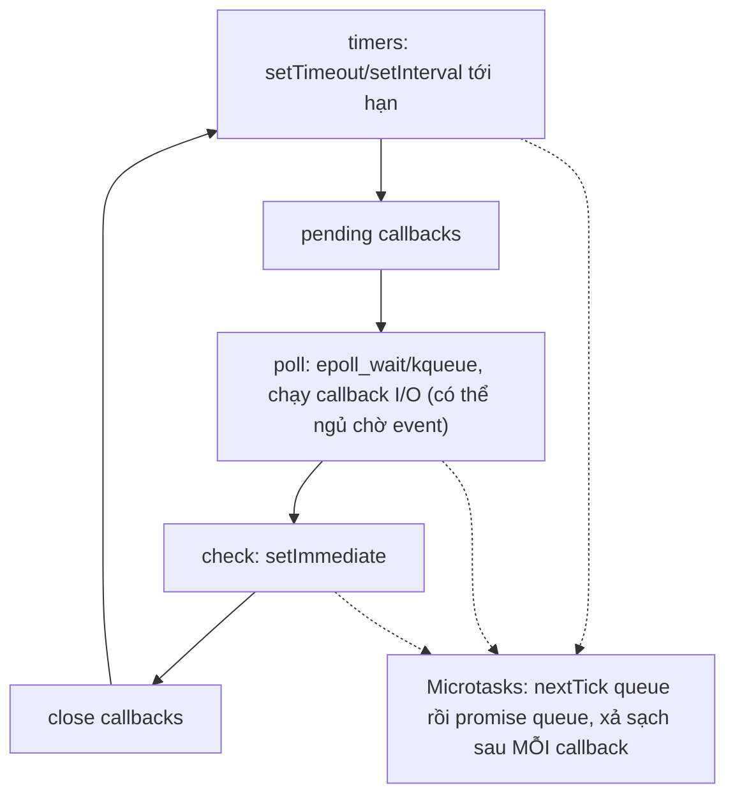
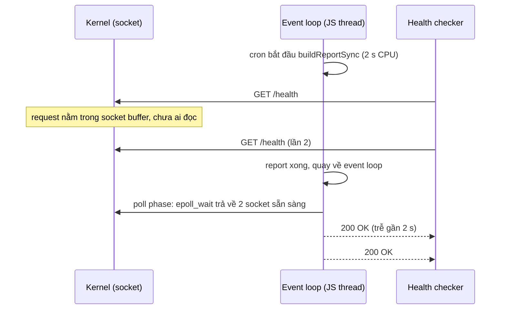
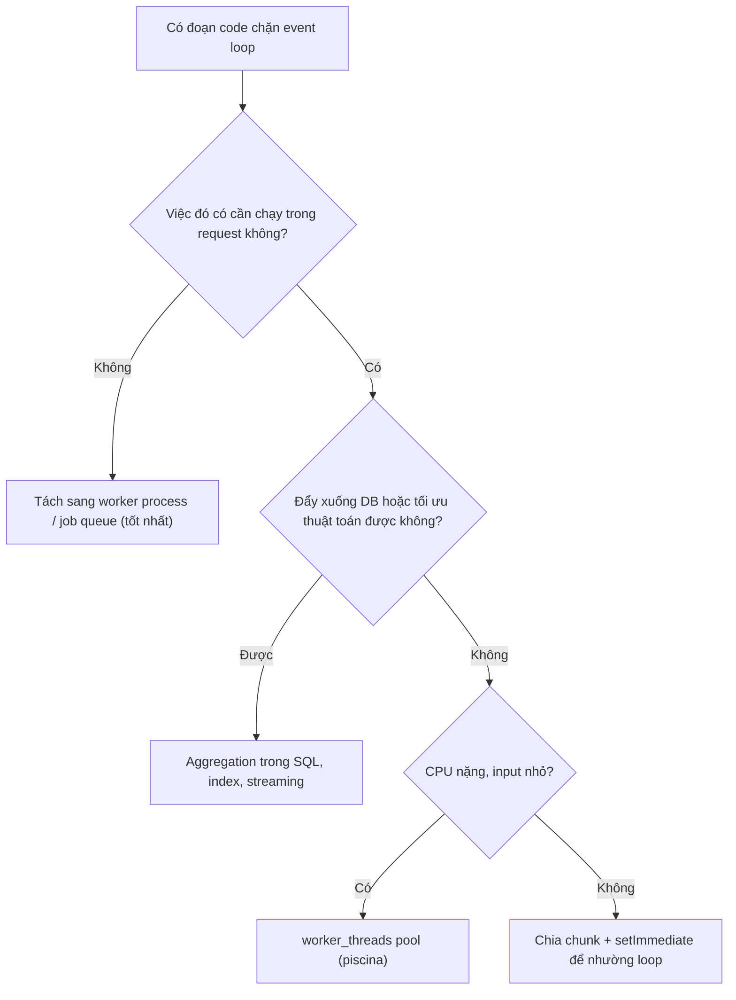

## Bối cảnh & vấn đề

Một API Node phục vụ dashboard có p99 ổn định 50 ms. Mỗi đêm lúc 2 giờ, một cron trong **cùng process** dựng báo cáo tháng: đọc 300.000 dòng, tính toán, sort, `JSON.stringify` ra file. Trong 20 phút đó, p99 nhảy lên 2 giây, vài health check timeout và Kubernetes restart pod giữa chừng. Người trực nhìn dashboard: máy 8 core, CPU tổng chỉ 12%. "CPU còn dư sao lại chậm?"

12% trên 8 core chính là **một core chạy 100%**. Core đó là thread duy nhất chạy JavaScript. Trong lúc vòng lặp dựng báo cáo chạy, không callback nào khác được chạy: request mới nằm chờ trong kernel, timer trễ, health check không được trả lời. Node xử lý hàng nghìn request **đồng thời** (concurrency) rất tốt, nhưng không chạy JS **song song** (parallelism). Hiểu đúng hai khái niệm này, cùng với cách event loop lập lịch công việc, là điều kiện để viết backend Node không tự làm nghẽn chính mình.

**Interview angle:** câu hỏi "p99 tăng khi chạy report, CPU chỉ một core bận" là bài kiểm tra xem bạn có nhận ra event loop bị chặn và biết đo nó bằng số liệu, không đoán mò.

## Khái niệm

### Concurrency và parallelism

**Concurrency** là khả năng có nhiều việc **cùng đang tiến triển** trong một khoảng thời gian: bắt đầu việc B trước khi việc A xong, xen kẽ chúng. Nó là thuộc tính của **cấu trúc chương trình**, và có thể có trên một core duy nhất. **Parallelism** là nhiều việc **chạy tại cùng một thời điểm** trên nhiều core. Nó là thuộc tính của **thực thi**, cần phần cứng nhiều core.

Ví dụ đời thường: một người phục vụ quán cà phê nhận order bàn 1, trong lúc máy pha chạy thì nhận order bàn 2, rồi quay lại lấy ly cho bàn 1. Đó là concurrency với một người. Thuê thêm người thứ hai cùng pha một lúc là parallelism. Một server Node xử lý 10.000 request đồng thời vì phần lớn thời gian mỗi request là **chờ** (chờ DB, chờ upstream); trong lúc chờ, thread JS chuyển sang request khác. Nhưng khi có việc cần **tính toán** 2 giây, không có "người thứ hai" nào trong JS.

Parallelism trong một process Node vẫn tồn tại, chỉ không ở tầng JS của bạn: kernel xử lý network song song, libuv threadpool chạy `fs`/`crypto`/`zlib` trên 4 thread, `worker_threads` chạy JS trên thread khác, và `cluster`/nhiều pod chạy nhiều process. Hệ quả thực tế: đánh dấu một hàm CPU-bound là `async` **không làm nó nhanh hơn** hay bớt chặn; `async` chỉ thay đổi cách trả kết quả, không đẩy việc sang thread khác.

### Preemptive scheduling

**Scheduler** của OS quyết định thread nào chạy trên core nào. Linux dùng **preemptive scheduling**: mỗi thread được một lượt (time slice, cỡ mili-giây), hết lượt thì kernel dùng timer interrupt **giành lại CPU** bất kể thread đang làm gì, rồi cho thread khác chạy. Nhờ vậy một chương trình có vòng lặp vô hạn không làm treo cả máy: các process khác vẫn được lượt.

Cái giá của preemption là thread có thể bị ngắt **ở bất kỳ lệnh máy nào**, kể cả giữa lúc đọc và ghi một biến. Đó là lý do lập trình đa luồng cần lock và atomic: bạn không biết thread khác sẽ chen vào ở đâu.

### Cooperative scheduling và run-to-completion

Event loop của JavaScript dùng **cooperative scheduling**: một đoạn code (một callback, một đoạn giữa hai `await`) chạy **tới khi tự trả quyền**: kết thúc hàm, hoặc gặp `await`. Không ai ngắt nó giữa chừng. Mô hình này gọi là **run-to-completion**.

Hai hệ quả ngược chiều nhau. Mặt tốt: giữa hai điểm `await`, code của bạn chạy **nguyên khối**; không ai sửa biến JS của bạn giữa chừng, nên không cần lock cho state trong memory. Race condition trong JS chỉ xảy ra **tại** các điểm `await`/callback, dễ suy luận hơn đa luồng rất nhiều (bài [race condition](/tracks/os-concurrency/learn/race-conditions-async) đi sâu phần này). Mặt xấu: một đoạn chạy lâu **chặn tất cả**. Vòng lặp 2 giây nghĩa là 2 giây không request nào, timer nào, health check nào được xử lý.

**Interview angle:** "OS preempt, event loop thì không" là câu trả lời ngắn nhất cho vì sao một vòng lặp nặng làm treo cả server Node nhưng không treo được cả máy.

### Event loop của Node

**Event loop** là vòng lặp trong libuv lặp đi lặp lại: hỏi kernel "có gì sẵn sàng chưa?", rồi chạy callback tương ứng. Mỗi vòng đi qua các **phase** theo thứ tự cố định:

1. **timers**: chạy callback của `setTimeout`/`setInterval` đã tới hạn.
2. **pending callbacks**: một số callback I/O bị hoãn từ vòng trước (ví dụ lỗi TCP).
3. **poll**: hỏi kernel qua `epoll_wait`/`kqueue` những socket nào sẵn sàng, chạy callback I/O; nếu không có gì làm, loop **ngủ** ở đây tới khi có event hoặc tới hạn timer gần nhất.
4. **check**: chạy callback `setImmediate`.
5. **close callbacks**: ví dụ `socket.on('close')`.

Xen giữa mọi callback là hai hàng đợi **microtask**: hàng `process.nextTick` và hàng promise (`.then`, phần tiếp theo sau `await`). Sau mỗi callback, Node **xả sạch** microtask trước khi sang callback kế tiếp. Vì vậy `await Promise.resolve()` **không** nhường cho timer hay I/O: phần sau `await` chạy ngay trong đợt xả microtask, trước khi loop kịp quay lại phase timers. Muốn thực sự nhường cho request khác, phải đi qua một macrotask như `setImmediate`.

### Blocking the event loop

Mọi thứ chạy lâu trên thread JS đều "chặn event loop". Các thủ phạm hay gặp trong backend:

- **Tính toán CPU**: dựng báo cáo, sort mảng triệu phần tử, tính diff, resize ảnh bằng thư viện JS thuần.
- **API `*Sync`**: `fs.readFileSync`, `crypto.pbkdf2Sync`, `bcrypt.hashSync`, `zlib.gzipSync` trong request path.
- **JSON lớn**: `JSON.parse`/`JSON.stringify` 50 MB có thể mất hàng trăm ms và không chia nhỏ được.
- **Regex thảm hoạ (ReDoS)**: regex có backtracking lũy thừa như `/(a+)+$/` với input độc hại chạy vài giây.
- **Vòng lặp microtask vô hạn**: đệ quy `process.nextTick` hoặc promise tự resolve liên tục làm loop không bao giờ tới phase poll.

Password hashing là trường hợp đặc biệt nguy hiểm: nó **cố ý chậm** (vài chục tới vài trăm ms mỗi lần) để chống brute force. Bản `Sync` chạy trên thread JS, nên 20 login đồng thời có thể làm mọi request khác đứng chờ vài giây; attacker chỉ cần spam endpoint login để DoS cả service với chi phí rất thấp.

### Đo event loop: lag và ELU

Hai metric cần có trên mọi service Node. **Event loop lag (delay)**: đặt một timer định kỳ và đo nó trễ bao nhiêu so với lịch; `perf_hooks.monitorEventLoopDelay()` làm việc này với histogram (p50/p99/max). Lag p99 vượt vài chục ms là dấu hiệu có code chặn. **Event loop utilization (ELU)**: `performance.eventLoopUtilization()` trả tỷ lệ thời gian loop **bận** chạy callback so với thời gian **rảnh** ngủ chờ event. ELU gần 1 nghĩa là loop không còn thời gian rảnh, dù CPU của máy trông "còn dư".

Để tìm **cái gì** chặn: `node --cpu-prof` ghi CPU profile mở bằng Chrome DevTools, hoặc flame graph (clinic.js, `0x`), hoặc `--prof`. Lag cho biết **có** vấn đề; profile cho biết **ở đâu**.

### Cách Go và Java giải cùng bài toán

**Go** có **goroutine**: "thread" nhẹ do runtime quản lý, stack khởi đầu vài KB và tự lớn (2 KB từ Go 1.4 (verify)). Runtime dùng mô hình **M:N**: N goroutine được map lên M OS thread (mặc định M bằng số core, `GOMAXPROCS`). Code viết kiểu blocking (`conn.Read()`), nhưng khi goroutine chờ I/O, runtime **park** nó và cho goroutine khác chạy trên OS thread đó, bên dưới vẫn là epoll. Từ Go 1.14, runtime có **preemption** bất đồng bộ nên một goroutine vòng lặp nặng không chiếm core mãi (verify). Và vì chạy trên nhiều core, goroutine có parallelism thật.

**Java virtual threads** (GA ở Java 21, JEP 444) đi cùng hướng: hàng triệu virtual thread được mount lên một nhóm nhỏ **carrier thread**; khi virtual thread block I/O, nó được unmount và carrier chạy virtual thread khác. Lưu ý lịch sử: block bên trong `synchronized` từng **pin** virtual thread vào carrier (carrier bị giữ), vấn đề được giải ở JDK 24 (JEP 491) (verify).

Khác biệt cốt lõi so với Node: Go và Java cho **parallelism CPU** tự nhiên và code blocking-style dễ đọc, nhưng vì có preemption và nhiều core, **shared state trong memory cần lock** (mutex, `AtomicInteger`, channel). Node không có parallelism JS, nhưng một counter trong memory dùng chung bởi mọi request không cần lock.

**Interview angle:** follow-up "cái nào cần lock cho một counter dùng chung?" Go và Java cần (data race thật), Node thì không cho `counter++` thuần, nhưng vẫn cần cẩn thận với read-await-write.

## Cơ chế hoạt động

### Một vòng event loop



Đọc sơ đồ từ trên xuống: loop đi vòng qua năm phase. Ở phase poll, nếu không có callback nào chờ và chưa tới hạn timer, loop **chặn trong kernel** (`epoll_wait`) và không tốn CPU; đây là trạng thái "rảnh" mà ELU đo. Đường chấm chấm cho thấy microtask không phải một phase: chúng được xả sau **từng** callback ở mọi phase. Một callback chạy 2 giây ở bất kỳ phase nào sẽ giữ cả vòng lại: timer không được kiểm tra, poll không được gọi, socket mới không được accept.

### Report đồng bộ chặn request khác



Kernel vẫn nhận TCP connection và dữ liệu request trong suốt 2 giây (nó chạy độc lập với process), nhưng không ai trong process đọc chúng. Khi report xong, loop tới phase poll và thấy một loạt socket sẵn sàng cùng lúc, trả lời dồn dập. Từ phía client, latency của request đơn giản nhất cũng bằng thời gian report chạy. Nếu probe của Kubernetes có `timeoutSeconds: 1`, pod bị đánh dấu không khoẻ.

### Chọn cách sửa



Thứ tự ưu tiên phản ánh chi phí: việc không cần trả kết quả ngay (báo cáo đêm) nên rời khỏi API process hoàn toàn, để API scale và chết độc lập. Việc cần kết quả ngay thì trước tiên hỏi "có nên tính ở đây không" (DB giỏi aggregation hơn JS). Chỉ khi thật sự phải tính trong process mới dùng `worker_threads`; còn chia chunk là cách rẻ nhất nhưng chỉ cải thiện **công bằng** (request khác được chen vào), không giảm tổng CPU.

## Ví dụ thực tế

### Đo tác động của report đồng bộ và bản chia chunk

Health checker chạy ở process riêng (như kubelet), gọi `/health` mỗi 50 ms:

```ts
// pinger.ts
const port = process.argv[2];
let worst = 0, stop = false;
process.on('message', () => { stop = true; });
while (!stop) {
  const t = performance.now();
  await fetch(`http://127.0.0.1:${port}/health`).then((r) => r.text());
  worst = Math.max(worst, performance.now() - t);
  await new Promise((r) => setTimeout(r, 50));
}
process.send!(worst);
process.exit(0);
```

```ts
// block.ts
import http from 'node:http';
import { fork } from 'node:child_process';
import { once } from 'node:events';

function buildReportSync(n: number): number {          // CPU-bound, chạy liền một mạch
  let acc = 0;
  for (let i = 0; i < n; i++) acc += Math.sqrt(i) % 7;
  return acc;
}

async function buildReportChunked(n: number, chunk = 2_000_000): Promise<number> {
  let acc = 0;
  for (let i = 0; i < n; i += chunk) {
    const end = Math.min(n, i + chunk);
    for (let j = i; j < end; j++) acc += Math.sqrt(j) % 7;
    await new Promise((r) => setImmediate(r));          // nhường event loop sau mỗi chunk
  }
  return acc;
}

const server = http.createServer((_req, res) => res.end('ok')).listen(0);
await once(server, 'listening');
const { port } = server.address() as { port: number };

async function probe(label: string, job: () => Promise<unknown>) {
  const pinger = fork('./pinger.ts', [String(port)]);   // health checker ở process khác, như kubelet
  await new Promise((r) => setTimeout(r, 300));
  let last = performance.now(), lag = 0;                // đo timer 10 ms bị trễ bao nhiêu
  const tick = setInterval(() => { const now = performance.now(); lag = Math.max(lag, now - last - 10); last = now; }, 10);
  const elu0 = performance.eventLoopUtilization();
  const t0 = performance.now();
  await job();
  const took = performance.now() - t0;
  const elu = performance.eventLoopUtilization(elu0);
  await new Promise((r) => setTimeout(r, 300));
  clearInterval(tick);
  pinger.send('stop');
  const [worst] = (await once(pinger, 'message')) as [number];
  console.log(`${label}: job ${took.toFixed(0)} ms | /health worst ${worst.toFixed(0)} ms | timer lag max ${lag.toFixed(0)} ms | ELU ${elu.utilization.toFixed(2)}`);
}

await probe('sync   ', async () => buildReportSync(150_000_000));
await probe('chunked', () => buildReportChunked(150_000_000));
server.close();
```

Output thật (macOS M1, Node 24.21):

```text
sync   : job 2034 ms | /health worst 1988 ms | timer lag max 2025 ms | ELU 1.00
chunked: job 1971 ms | /health worst 36 ms | timer lag max 38 ms | ELU 1.00
```

Cùng khối lượng tính toán (khoảng 2 giây CPU), bản đồng bộ làm health check trễ gần 2 giây và timer 10 ms trễ 2 giây. Bản chia chunk giữ health check ở 36 ms. Chú ý **ELU = 1.00 ở cả hai**: chia chunk không giảm việc, loop vẫn bận 100%, chỉ là request khác được chen vào giữa các chunk. Nếu traffic cao, chunking vẫn làm mọi request chậm hơn; cách sửa bền vững là đưa report ra khỏi process. Dùng lag làm alert (ví dụ p99 > 100 ms trong 5 phút) để biết trước khi user phàn nàn.

### Login storm: pbkdf2Sync vs pbkdf2

```ts
// login.ts
import { pbkdf2, pbkdf2Sync } from 'node:crypto';
import { promisify } from 'node:util';
const pbkdf2Async = promisify(pbkdf2);
const ITER = 600_000;                                     // mức OWASP gợi ý cho PBKDF2-SHA256 (verify)

async function storm(label: string, login: () => Promise<unknown>) {
  let last = performance.now(), lag = 0;
  const tick = setInterval(() => { const n = performance.now(); lag = Math.max(lag, n - last - 5); last = n; }, 5);
  const t0 = performance.now();
  await Promise.all(Array.from({ length: 8 }, login));     // 8 login cùng lúc
  const total = performance.now() - t0;
  await new Promise((r) => setTimeout(r, 20));
  clearInterval(tick);
  console.log(`${label}: 8 login xong sau ${total.toFixed(0)} ms, event loop bị chặn tối đa ${lag.toFixed(0)} ms`);
}

await storm('pbkdf2Sync ', async () => pbkdf2Sync('pw', 'salt', ITER, 32, 'sha256'));
await storm('pbkdf2 async', () => pbkdf2Async('pw', 'salt', ITER, 32, 'sha256'));
```

Output thật:

```text
pbkdf2Sync : 8 login xong sau 598 ms, event loop bị chặn tối đa 593 ms
pbkdf2 async: 8 login xong sau 172 ms, event loop bị chặn tối đa 6 ms
```

Bản `Sync` chạy tám hash nối tiếp trên thread JS: 600 ms không request nào được phục vụ. Bản async đẩy hash sang threadpool (4 thread), loop gần như không bị chặn, và tổng thời gian còn ngắn hơn vì 4 hash chạy song song. Nhưng async **không miễn phí**: 4 thread threadpool bị chiếm, nên `fs`, `dns.lookup`, `zlib` khác phải xếp hàng (bài [I/O models & libuv](/tracks/os-concurrency/learn/io-models-libuv) đo hiện tượng này). Với login, vẫn cần rate limit theo IP/tài khoản và giới hạn số hash đồng thời.

### Microtask không nhường cho timer

```ts
// micro.ts
setTimeout(() => console.log('timeout 0 ms'), 0);
setImmediate(() => console.log('immediate'));

async function loop(): Promise<void> {
  for (let i = 0; i < 3; i++) {
    await Promise.resolve();                        // chỉ nhường cho microtask queue
    console.log(`after await #${i}`);
  }
  await new Promise((r) => setImmediate(r));        // nhường thật cho event loop
  console.log('after setImmediate yield');
}
loop();
process.nextTick(() => console.log('nextTick'));
console.log('sync end');
```

Output thật (file ESM):

```text
sync end
after await #0
after await #1
after await #2
nextTick
timeout 0 ms
immediate
after setImmediate yield
```

Ba lần `await Promise.resolve()` chạy hết trước cả timer 0 ms: microtask được xả trọn trước khi loop sang phase timers. Chỉ khi `await` một promise resolve bởi `setImmediate`, timer và immediate đã đăng ký trước mới có cơ hội chạy. Hai chi tiết cần biết: trong **module ESM**, `nextTick` chạy sau các promise microtask đang có vì bản thân module được đánh giá trong một promise job (trong CommonJS thì `nextTick` chạy trước); và thứ tự giữa `setTimeout(0)` và `setImmediate` khi gọi từ main module **không được đảm bảo** (phụ thuộc thời điểm loop khởi động), chỉ đảm bảo khi cả hai được gọi từ trong một callback I/O.

## Trade-offs & lựa chọn thay thế

| Mô hình | Code trông thế nào | Parallelism CPU | Shared state | Memory mỗi task | Điểm yếu |
|---|---|---|---|---|---|
| Thread-per-request (Java/.NET cổ điển) | Blocking, tuần tự | Có | Cần lock | Stack ~1 MB (verify) | 10k request chậm = 10k thread |
| Event loop (Node) | async/await | Không (chỉ 1 thread JS) | Không cần lock cho JS state | Vài KB (closure, promise) | Một tác vụ CPU chặn tất cả |
| Goroutine (Go) | Blocking-style | Có, M:N | Cần mutex/channel | Stack vài KB, tự lớn | Data race, goroutine leak |
| Virtual thread (Java 21+) | Blocking-style | Có, M:N | Cần lock | Nhỏ, stack trên heap | Pinning (đã cải thiện), thư viện cũ |
| Node + worker_threads | async + message | Có cho phần tách ra | Chỉ `SharedArrayBuffer` | Isolate vài MB | Copy dữ liệu, chi phí khởi tạo |

Node thắng khi workload là **I/O-bound**: API gateway, BFF, realtime, CRUD gọi DB. Một thread JS, không lock, memory thấp mỗi connection. Go và Java virtual thread thắng khi có **CPU đáng kể lẫn I/O** trong cùng request, hoặc khi đội muốn code blocking-style dễ đọc và chấp nhận lo data race. Trong hệ thống Node, tác vụ CPU nặng định kỳ (báo cáo, xử lý ảnh, video) nên nằm ở service hoặc worker riêng, có khi viết bằng ngôn ngữ khác; trong request thì dùng `worker_threads` pool cho phần tính toán ngắn.

## Edge cases & failure modes

- **Health check bị chặn dẫn tới restart giữa chừng**: liveness probe timeout khi loop bị chặn, pod bị kill, job đang chạy mất, lần chạy sau lại bị kill: vòng lặp chết. Liveness nên có `failureThreshold` đủ rộng, và việc nặng không nên nằm trong process phục vụ probe.
- **`JSON.parse` payload lớn từ client**: body 50 MB parse đồng bộ hàng trăm ms. Giới hạn body size ở cửa vào (`express.json({ limit: '1mb' })`), dùng streaming parser cho import lớn.
- **ReDoS**: regex validate email/URL do bạn tự viết có thể bị input 30 ký tự làm treo vài giây. Dùng thư viện đã kiểm chứng, giới hạn độ dài input trước khi match.
- **Microtask starvation**: đệ quy `process.nextTick` hoặc một vòng `while` chỉ `await Promise.resolve()` không bao giờ để loop tới poll phase: I/O chết đói dù code "có await".
- **Chunking vẫn chậm dưới tải**: chunk quá lớn (200 ms) thì lag vẫn cao; chunk quá nhỏ thì overhead lập lịch lớn. Đo lag sau khi chia, nhắm mỗi chunk dưới ~10 ms.
- **GC pause**: heap vài GB với nhiều object sống lâu có thể gây pause major GC hàng trăm ms, cũng hiện ra như event loop lag. Phân biệt bằng `--trace-gc` hoặc metric GC của `perf_hooks`.
- **Timer không chính xác**: `setTimeout(fn, 100)` là "không sớm hơn 100 ms", không phải "đúng 100 ms"; dưới tải nó có thể trễ bằng độ dài callback dài nhất đang chạy.

## Pitfalls

- ❌ "Node xử lý được 10k request đồng thời nên chạy được mọi thứ song song" → ✅ Node cho concurrency I/O, không cho parallelism JS; CPU-bound phải tách ra.
- ❌ Bọc hàm CPU-bound trong `async` hoặc `new Promise` để "không chặn" → ✅ code vẫn chạy trên thread JS; chỉ `worker_threads`, process khác hoặc threadpool mới thật sự chạy song song.
- ❌ `bcrypt.hashSync`, `crypto.pbkdf2Sync`, `fs.readFileSync` trong request handler → ✅ bản async, cộng rate limit cho endpoint đắt. `*Sync` chỉ dùng lúc khởi động.
- ❌ Chỉ theo dõi CPU% của máy → ✅ theo dõi event loop lag p99 và ELU theo từng process; 12% trên 8 core có thể là một loop đang bão hoà.
- ❌ Dùng `await Promise.resolve()` để "nhường" trong vòng lặp dài → ✅ `await new Promise(r => setImmediate(r))` (hoặc `scheduler.yield()` nếu runtime hỗ trợ (verify)).
- ❌ Chạy cron nặng trong cùng process API → ✅ job queue với worker riêng, hoặc Kubernetes CronJob chạy một process riêng.
- ❌ Tin rằng Go/Java "không có vấn đề này" nên không cần nghĩ → ✅ họ đổi vấn đề chặn loop lấy vấn đề data race; cả hai đều cần hiểu mô hình concurrency.

## Tóm tắt

- Concurrency là cấu trúc (nhiều việc xen kẽ), parallelism là thực thi đồng thời trên nhiều core; Node cho concurrency I/O trên một thread JS.
- OS preempt thread bất kỳ lúc nào; event loop là cooperative, một callback chạy tới khi xong hoặc `await`, nên code nặng chặn mọi thứ.
- Mỗi vòng loop: timers, pending, poll (epoll/kqueue, có thể ngủ), check, close; microtask (nextTick, promise) được xả sau mỗi callback và không nhường cho timer.
- Report đồng bộ 2 s làm health check trễ 2 s; chia chunk giữ latency thấp nhưng ELU vẫn 1.0. Cách bền là tách ra worker/job queue.
- Password hashing `Sync` là DoS chờ xảy ra; bản async giải phóng loop nhưng chiếm threadpool, vẫn cần rate limit.
- Đo bằng event loop lag (`monitorEventLoopDelay`) và ELU (`eventLoopUtilization`); tìm thủ phạm bằng `--cpu-prof`/flame graph.
- Go goroutine và Java virtual thread dùng M:N scheduling, code blocking-style, có parallelism nhưng cần lock cho shared state; Node không cần lock cho JS state nhưng không có parallelism JS.
