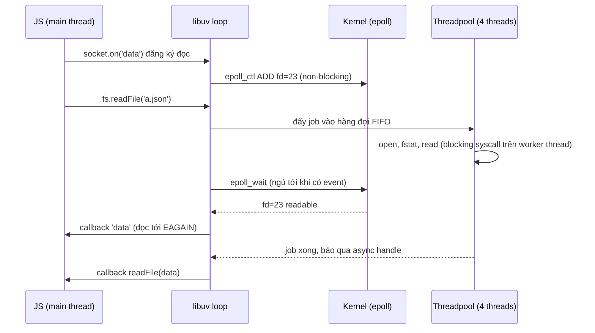
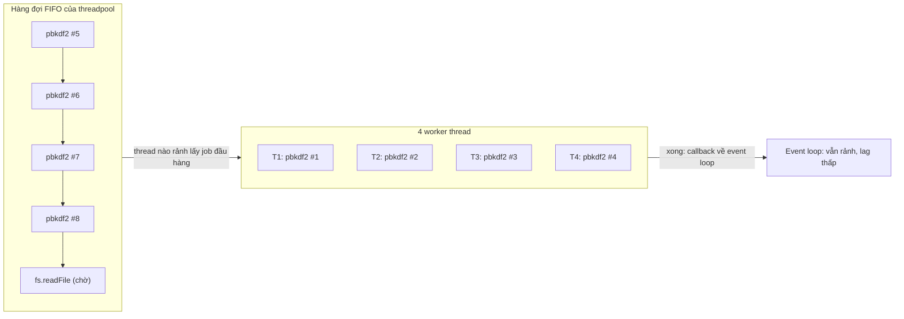
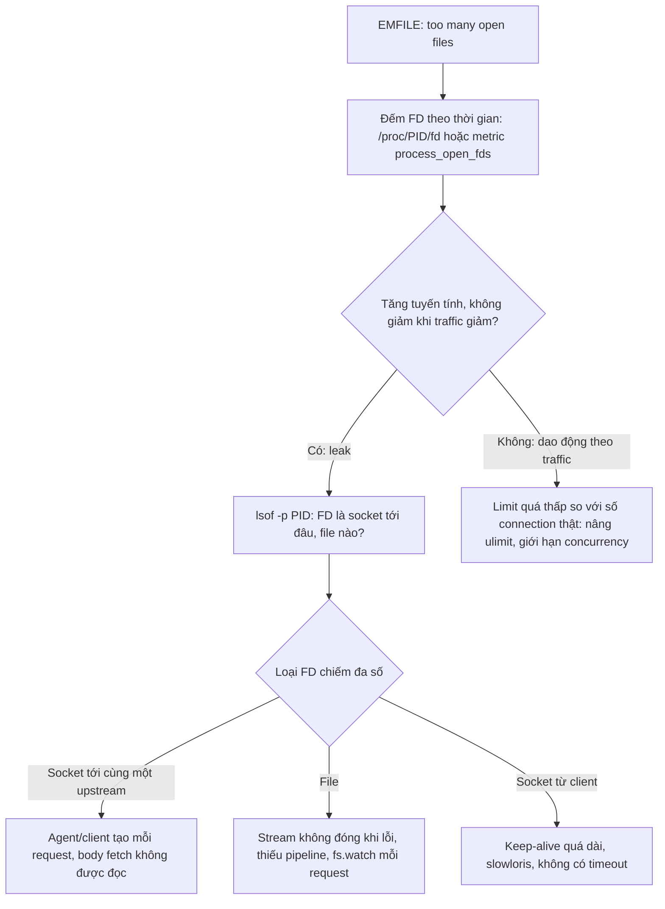

## Bối cảnh & vấn đề

Endpoint login của một API Node dùng `bcrypt.hash` bản async, đúng như sách vở khuyên. Mỗi sáng thứ Hai lúc 9 giờ, khi cả công ty đăng nhập, không chỉ login chậm: endpoint tải file tĩnh (`fs.readFile`) và endpoint gọi service nội bộ bằng hostname (`dns.lookup`) cũng chậm theo, p99 từ 20 ms lên 800 ms. CPU chưa tới 50%, event loop lag thấp. Không có code nào "chặn event loop" cả. Vậy cái gì đang nghẽn?

Cùng tuần đó, một service khác chết với `Error: EMFILE: too many open files` sau khoảng 6 giờ chạy, chỉ ở production. Restart thì khoẻ, 6 giờ sau lại chết.

Cả hai sự cố nằm ở tầng mà lập trình viên Node hiếm khi nhìn: **cách Node thực sự làm I/O**. Socket đi qua `epoll` trên event loop; file, DNS lookup và crypto đi qua một **threadpool 4 thread**; và mỗi socket, mỗi file đang mở là một **file descriptor** trong một bảng có giới hạn. Bài này đi từ các mô hình I/O của OS tới cách libuv ghép chúng lại, rồi tới quy trình điều tra hai sự cố trên.

**Interview angle:** "login chậm làm `fs.readFile` chậm theo" là câu hỏi phân biệt người hiểu threadpool với người chỉ thuộc "Node non-blocking".

## Khái niệm

### File descriptor

**File descriptor (FD)** là một số nguyên nhỏ mà kernel trả cho process khi nó mở một tài nguyên I/O; nó là chỉ số vào **bảng FD** của process. Không chỉ file: **socket TCP/UDP, pipe, eventfd, epoll instance, timerfd** đều là FD. `0`, `1`, `2` là stdin, stdout, stderr. Mọi syscall I/O (`read`, `write`, `close`) nhận FD làm tham số.

Với backend, điều quan trọng là: **mỗi connection là một FD**. Một API giữ 500 connection từ client, 20 connection tới Postgres, 10 tới Redis, và 200 keep-alive socket tới các upstream HTTP đang dùng khoảng 730 FD. Số FD mỗi process bị giới hạn bởi **`RLIMIT_NOFILE`** (`ulimit -n`), có **soft limit** (giá trị đang áp dụng, process tự nâng được tới hard) và **hard limit** (trần, chỉ root nâng). Nhiều hệ thống mặc định soft là 1024; Docker và Kubernetes thường đặt cao hơn nhiều, tuỳ runtime (verify cho môi trường của bạn bằng `cat /proc/<pid>/limits`).

Chạm soft limit, mọi syscall tạo FD mới (`open`, `accept`, `socket`) trả **`EMFILE`** ("too many open files" cho process này). **`ENFILE`** thì khác: bảng file của **toàn hệ thống** đã đầy (`fs.file-max`), hiếm gặp hơn.

### Blocking I/O

**Blocking I/O** là cách mặc định của syscall: `read(fd)` trên socket chưa có dữ liệu sẽ làm thread **ngủ** trong kernel cho tới khi có dữ liệu. Code đơn giản và tuần tự, nhưng một thread chỉ chờ được **một** thứ tại một thời điểm. Phục vụ 10.000 connection bằng blocking I/O nghĩa là 10.000 thread, với toàn bộ chi phí stack và context switch đã phân tích ở bài [process & thread](/tracks/os-concurrency/learn/processes-threads).

### Non-blocking I/O

Đặt cờ **`O_NONBLOCK`** lên FD thì `read` **trả về ngay**: có dữ liệu thì trả dữ liệu, chưa có thì trả lỗi **`EAGAIN`** ("thử lại sau") thay vì ngủ. Thread không bị kẹt, nhưng giờ nó phải biết **khi nào** nên thử lại. Hỏi vòng liên tục từng socket (busy polling) đốt CPU vô ích. Non-blocking I/O một mình chưa đủ; nó cần đi cùng một cơ chế báo "FD nào đã sẵn sàng".

### I/O multiplexing: select, poll, epoll, kqueue

**I/O multiplexing** cho phép một thread đưa cho kernel **một tập FD** và chờ **một lần** cho tới khi **bất kỳ** FD nào sẵn sàng đọc hoặc ghi. Các thế hệ API:

- **`select`**: truyền bitmap FD mỗi lần gọi; giới hạn cứng `FD_SETSIZE` (thường 1024); kernel và app đều phải quét toàn bộ tập: O(n) mỗi lần.
- **`poll`**: bỏ giới hạn 1024 nhưng vẫn truyền cả danh sách mỗi lần và vẫn O(n).
- **`epoll`** (Linux) và **`kqueue`** (BSD/macOS): kernel **giữ interest list** giữa các lần gọi. App đăng ký FD một lần (`epoll_ctl`), rồi `epoll_wait` chỉ trả về **những FD đã sẵn sàng**. Chi phí tỷ lệ với số event, không phải số FD đang theo dõi. 10.000 connection idle gần như không tốn gì.

epoll có hai chế độ. **Level-triggered** (mặc định): FD còn dữ liệu chưa đọc thì mỗi lần `epoll_wait` đều báo lại. **Edge-triggered** (`EPOLLET`): chỉ báo khi trạng thái **thay đổi**, nên app phải đọc tới khi gặp `EAGAIN`, nếu không sẽ không bao giờ được báo lại. libuv lo chi tiết này cho bạn.

**Giới hạn quan trọng**: epoll **không hỗ trợ regular file**. `epoll_ctl` trên FD của một file thường trả `EPERM`, vì với kernel một file trên đĩa luôn "sẵn sàng" (đọc có thể chậm do đĩa, nhưng không bao giờ "chưa có dữ liệu" theo nghĩa của socket). Đây là gốc rễ của thiết kế threadpool trong libuv.

### Asynchronous (completion-based) I/O

Multiplexing là mô hình **readiness**: kernel báo "FD đã sẵn sàng", app tự gọi `read`. Mô hình **completion** đi xa hơn: app gửi yêu cầu "đọc 64 KB từ FD này vào buffer này", kernel làm xong rồi báo "đã **hoàn tất**". Windows có **IOCP** theo mô hình này từ lâu, và libuv dùng IOCP trên Windows cho cả socket lẫn file. Linux có **`io_uring`** (từ kernel 5.1): hai ring buffer chia sẻ giữa app và kernel, hỗ trợ cả file thường. libuv từng dùng io_uring cho một số thao tác `fs` trên Linux rồi tắt mặc định do vấn đề bảo mật, có thể bật lại qua biến môi trường `UV_USE_IO_URING` (verify theo phiên bản Node của bạn).

### libuv: event loop cộng threadpool

**libuv** là thư viện C cung cấp event loop và I/O bất đồng bộ cho Node. Nó chia I/O thành hai đường:

1. **Network** (TCP, UDP, pipe, TTY, signal, timer): non-blocking FD đăng ký vào epoll/kqueue/IOCP, xử lý **ngay trên event loop**. Không tốn thread nào ngoài main thread.
2. **Những thứ không có API non-blocking tốt**: chạy **blocking** trên **threadpool**, xong thì báo lại event loop. Gồm:
   - gần như toàn bộ `fs.*` bản async (trừ `fs.watch` dùng inotify/FSEvents);
   - `dns.lookup()`, vì nó gọi `getaddrinfo()` của libc (đọc `/etc/hosts`, `nsswitch`), vốn blocking. `dns.resolve*()` dùng c-ares qua network, **không** dùng threadpool;
   - `crypto.pbkdf2`, `crypto.scrypt`, `crypto.randomBytes`/`randomFill` (bản callback), `crypto.generateKeyPair`;
   - `zlib` bản async;
   - native addon tự gửi việc vào pool, như `bcrypt` hay `sharp` (tuỳ thư viện).

Threadpool có **4 thread mặc định**, đặt bằng biến môi trường **`UV_THREADPOOL_SIZE`** (tối đa 1024 từ libuv 1.30 (verify)). Pool được tạo **lười** ở lần đầu cần tới và **dùng chung** cho mọi loại việc trên: một hàng đợi FIFO duy nhất. Vì vậy đặt biến này qua môi trường khi khởi động process (`UV_THREADPOOL_SIZE=16 node server.js`); gán `process.env.UV_THREADPOOL_SIZE` trong code chỉ có tác dụng nếu chạy trước khi pool được tạo, và rất dễ sai (verify).

**Interview angle:** interviewer hay hỏi "HTTP request có dùng threadpool không?" Không: socket đi qua epoll. Nhưng `dns.lookup` trước khi connect (khi dùng hostname) **có**, nên threadpool nghẽn vẫn làm request HTTP ra ngoài chậm.

### Khi threadpool bão hoà

Threadpool bão hoà khi cả 4 thread đang bận và có việc mới tới: việc mới **xếp hàng**. Event loop vẫn chạy bình thường (lag thấp), nhưng callback của mọi thao tác dùng pool tới muộn. Đây chính là sự cố sáng thứ Hai: 20 login đồng thời, mỗi `bcrypt.hash` chiếm một thread khoảng 100 ms, và `fs.readFile` của trang tĩnh phải chờ sau cả hàng đợi hash.

Tăng `UV_THREADPOOL_SIZE` giúp khi việc trong pool là **I/O chờ** (đọc file trên network storage, `getaddrinfo` chậm): nhiều thread chờ song song. Nhưng với việc **CPU** (hash, nén), thêm thread quá số core thật chỉ làm chúng tranh nhau CPU, không nhanh hơn, và còn tranh với chính event loop.

## Cơ chế hoạt động

### Đường đi của một socket read và một file read



Hai đường chạy song song. Socket: libuv đăng ký FD với epoll một lần, rồi ngủ trong `epoll_wait`; khi kernel báo FD 23 có dữ liệu, loop đọc (tới khi gặp `EAGAIN`) và gọi callback JS. Không thread nào bị chiếm trong lúc chờ. File: libuv đẩy một job vào hàng đợi threadpool; một worker thread gọi `open`, `fstat`, `read` kiểu **blocking** (worker bị chiếm suốt thời gian đó), xong thì đánh thức loop qua một async handle (bên dưới là eventfd, cũng nằm trong epoll), và loop gọi callback. Lưu ý `fs.promises.readFile` gồm **nhiều** job nối tiếp (open, stat, read theo từng khối, close), nên khi pool nghẽn, nó phải xếp hàng nhiều lần.

### Hàng đợi threadpool khi login storm



Sơ đồ khớp với output đo được ở phần ví dụ: 4 hash đầu chiếm cả 4 thread, 4 hash sau và `fs.readFile` nằm trong hàng đợi. `readFile` không liên quan gì tới login vẫn phải chờ một "đợt" hash xong. Event loop hoàn toàn rảnh, nên metric event loop lag **không** phát hiện được vấn đề này; cần đo latency của chính các thao tác fs/dns, hoặc theo dõi độ dài hàng đợi (không có metric chuẩn, phải tự instrument).

### Điều tra EMFILE



Câu hỏi đầu tiên luôn là **leak hay tải thật**. Leak tăng đều theo thời gian (hoặc theo số request đã phục vụ) và không giảm khi traffic giảm lúc đêm; tải thật dao động theo traffic. Nếu là leak, `lsof` cho biết loại FD và đích, thu hẹp nhanh về một đoạn code. Tăng `ulimit` khi đang leak chỉ đổi 6 giờ thành 60 giờ.

## Ví dụ thực tế

### Đo threadpool bão hoà

```ts
// pool.ts
import { pbkdf2 } from 'node:crypto';
import { readFile } from 'node:fs/promises';

const t0 = performance.now();
const at = () => `${(performance.now() - t0).toFixed(0).padStart(4)} ms`;

// 8 "login" đồng thời, mỗi cái vài chục-trăm ms CPU trên threadpool
for (let i = 1; i <= 8; i++) {
  pbkdf2('secret', 'salt', 600_000, 64, 'sha256', () => console.log(`${at()}  pbkdf2 #${i} done`));
}
// một thao tác fs không liên quan, xếp hàng SAU 8 hash
readFile(new URL(import.meta.url)).then(() => console.log(`${at()}  fs.readFile done`));
// timer không dùng threadpool
setTimeout(() => console.log(`${at()}  setTimeout(50) fired`), 50);
```

Output thật (macOS M1 8 core, Node 24.21):

```text
--- UV_THREADPOOL_SIZE mặc định (4)
  52 ms  setTimeout(50) fired
 172 ms  pbkdf2 #1 done
 175 ms  pbkdf2 #4 done
 185 ms  pbkdf2 #3 done
 198 ms  pbkdf2 #2 done
 342 ms  pbkdf2 #5 done
 343 ms  fs.readFile done
 364 ms  pbkdf2 #6 done
 370 ms  pbkdf2 #7 done
 398 ms  pbkdf2 #8 done
--- UV_THREADPOOL_SIZE=16
   1 ms  fs.readFile done
  55 ms  setTimeout(50) fired
 251 ms  pbkdf2 #1 done
 287 ms  pbkdf2 #5 done
 299 ms  pbkdf2 #3 done
 317 ms  pbkdf2 #2 done
 322 ms  pbkdf2 #4 done
 326 ms  pbkdf2 #7 done
 327 ms  pbkdf2 #6 done
 337 ms  pbkdf2 #8 done
```

Với pool 4: hash hoàn thành theo **hai đợt** (khoảng 180 ms và 350 ms), và `readFile` một file vài trăm byte mất 343 ms vì phải chờ đợt đầu giải phóng thread. Timer không bị ảnh hưởng (52 ms): event loop rảnh. Với pool 16: `readFile` có thread rảnh ngay (1 ms), tất cả hash chạy cùng lúc. Nhưng tổng thời gian **không giảm đáng kể** (337 so với 398 ms), và mỗi hash chậm hơn (251 so với 172 ms cho cái đầu tiên): 8 hash CPU-bound tranh nhau 8 core (4 trong đó là efficiency core). Tăng pool giải được **xếp hàng** cho việc nhẹ, không tạo thêm CPU. Cách sửa gốc cho login storm: rate limit, giới hạn số hash đồng thời bằng semaphore (để luôn chừa thread cho fs/dns), hoặc tách auth ra service riêng.

### Tái hiện EMFILE

```ts
// fd.ts
import { open, type FileHandle } from 'node:fs/promises';
import { readdirSync } from 'node:fs';

const fdCount = () => readdirSync('/proc/self/fd').length;   // Linux: mỗi entry là một FD đang mở
console.log('FD lúc khởi động:', fdCount());

const leaked: FileHandle[] = [];
try {
  for (let i = 0; ; i++) {
    leaked.push(await open('/etc/hostname'));                // mở mà không close()
    if (i % 20 === 0) console.log(`opened ${i + 1}, FD = ${fdCount()}`);
  }
} catch (e) {
  console.log(`lỗi: ${(e as Error).message}`);
  try { fdCount(); } catch (e2) { console.log(`ngay cả đếm FD cũng lỗi: ${(e2 as NodeJS.ErrnoException).code}`); }
}
await Promise.all(leaked.map((h) => h.close()));
console.log('FD sau khi close hết:', fdCount());
```

```bash
docker run --rm --ulimit nofile=64:64 -v "$PWD":/app -w /app node:22-alpine node --experimental-strip-types fd.ts
```

Output thật (Node 22.23, Linux):

```text
FD lúc khởi động: 18
opened 1, FD = 20
opened 21, FD = 40
opened 41, FD = 60
lỗi: EMFILE: too many open files, open '/etc/hostname'
ngay cả đếm FD cũng lỗi: EMFILE
FD sau khi close hết: 19
```

Một process Node vừa khởi động đã dùng 18 FD (stdio, epoll, eventfd, pipe nội bộ, file của chính nó). Với limit 64, leak 46 file là chết. Dòng đáng chú ý: khi đã chạm limit, **ngay cả `readdir` để chẩn đoán cũng lỗi**, giống production nơi `EMFILE` làm hỏng cả log ra file, `accept()` connection mới, và mở connection DB. Đóng hết handle thì FD về lại mức bình thường. (Số 19/20 lệch một vì `readdirSync` tự mở một FD cho thư mục trong lúc đếm.)

### Điều tra trên production

```bash
PID=$(pgrep -f "node dist/server.js")
cat /proc/$PID/limits | grep "open files"                 # soft/hard limit thật của process
ls /proc/$PID/fd | wc -l                                  # số FD hiện tại, chạy lại sau 10 phút
lsof -nP -p $PID | awk '{print $5}' | sort | uniq -c      # đếm theo loại: IPv4, REG, FIFO...
lsof -nP -p $PID -a -i | awk '{print $9}' | sed 's/.*->//' | sort | uniq -c | sort -rn | head
```

Output minh hoạ (không phải từ một lần chạy thật):

```text
Max open files            65536                65536                files
18234
  17890 IPv4
    301 REG
     43 FIFO
  17512 10.0.3.41:443
    210 10.0.1.12:5432
```

Đọc kết quả: 17.512 socket tới cùng một upstream HTTPS, trong khi pool Postgres chỉ 210. Đó là dấu hiệu kinh điển của leak connection HTTP ra ngoài. Ba nguyên nhân hay gặp nhất trong Node:

- **Tạo `http.Agent`, SDK client hoặc DB pool mới trong mỗi request** thay vì một instance dùng chung: mỗi cái giữ socket keep-alive riêng, không bao giờ đóng.
- **Không đọc body của `fetch`**: với undici (engine của `fetch` trong Node), connection chỉ được trả về pool khi body được đọc hết hoặc bị huỷ. Code chỉ kiểm tra `res.ok` rồi bỏ đi giữ connection cho tới khi GC dọn, và undici khuyến nghị luôn consume hoặc cancel body (verify hành vi theo phiên bản).
- **Stream không đóng khi lỗi**: `readable.pipe(writable)` không huỷ nguồn khi đích lỗi; dùng `stream.pipeline()` để mọi stream được destroy.

```ts
const res = await fetch(url);
if (!res.ok) {
  await res.body?.cancel();          // trả connection về pool ngay cả khi không cần body
  throw new Error(`upstream ${res.status}`);
}
const data = await res.json();       // đọc hết body cũng trả connection
```

## Trade-offs & lựa chọn thay thế

| Mô hình | Thread cho N connection | Chi phí mỗi lần chờ | Hỗ trợ file thường | Ví dụ |
|---|---|---|---|---|
| Blocking, thread-per-connection | N | Context switch, stack | Có | Apache prefork, JDBC cổ điển |
| Non-blocking + busy polling | 1 | Đốt CPU | Không có ý nghĩa | Hầu như không dùng |
| `select`/`poll` | 1 | O(N) mỗi lần gọi | Luôn báo "sẵn sàng" | Code cũ, số FD nhỏ |
| `epoll`/`kqueue` (readiness) | 1 (hoặc vài) | O(số event) | Không (`EPERM` với epoll) | Node, Nginx, Redis, Netty |
| IOCP / `io_uring` (completion) | 1 (hoặc vài) | Rất thấp, ít syscall | Có | libuv trên Windows, runtime mới |
| Threadpool cho blocking call | Kích thước pool | Xếp hàng khi bận | Có | libuv `fs`, `dns.lookup`, `crypto` |

Với ứng dụng Node, bạn không chọn trực tiếp giữa các cơ chế này (libuv chọn), nhưng bạn chọn **đường đi của công việc**. Network I/O: cứ để event loop lo, nó scale tới hàng chục nghìn connection. File I/O nhiều (đọc/ghi file lớn liên tục, network filesystem chậm): cân nhắc tăng `UV_THREADPOOL_SIZE` và dùng stream để mỗi job nhỏ. CPU trong threadpool (hash, nén): giới hạn concurrency và chừa thread; nếu nặng thì tách sang `worker_threads` pool riêng hoặc service riêng để không tranh với fs/dns. DNS: nếu `dns.lookup` chậm hoặc nhiều, cache kết quả, dùng keep-alive để giảm số lần lookup, hoặc `dns.resolve` (không qua threadpool, nhưng bỏ qua `/etc/hosts`).

## Edge cases & failure modes

- **Threadpool nghẽn nhưng event loop lag thấp**: metric thường dùng không bắt được. Đo latency của `fs`/`dns` riêng, hoặc thêm span tracing quanh các thao tác này.
- **`dns.lookup` chậm làm mọi HTTP call chậm**: resolver chậm (DNS server quá tải, `ndots:5` trong Kubernetes khiến mỗi hostname thử nhiều domain search) chiếm thread pool vài trăm ms mỗi lần. Dùng FQDN có dấu chấm cuối, keep-alive, và cache.
- **FD limit trong container khác máy dev**: `ulimit -n` trên laptop khác với limit của container runtime; test tải ở dev không tái hiện được `EMFILE`. Đọc `/proc/<pid>/limits` trong container thật.
- **`accept()` trả `EMFILE`**: server không nhận thêm connection nhưng process vẫn "sống", health check (nếu dùng connection sẵn có) vẫn xanh. libuv có cơ chế tạm dừng accept, nhưng triệu chứng từ phía client là timeout.
- **Socket `CLOSE_WAIT` tích tụ**: đầu bên kia đã đóng, nhưng app không `close()` socket của mình, FD không được giải phóng. `ss -tanp state close-wait` để đếm.
- **Edge-triggered đọc thiếu** (khi tự viết native code): không đọc tới `EAGAIN` thì connection "treo" vĩnh viễn vì không có event mới.
- **File trên network storage (NFS/EFS)**: mỗi `read` có thể mất hàng chục ms, 4 thread pool nghẽn rất nhanh dù CPU rảnh.

## Pitfalls

- ❌ "Node non-blocking nên mọi I/O đều không tốn thread" → ✅ socket đi qua epoll, còn `fs`, `dns.lookup`, `crypto`, `zlib` chiếm một trong 4 thread của pool dùng chung.
- ❌ Đặt `UV_THREADPOOL_SIZE=128` để "cho nhanh" với việc CPU → ✅ thread nhiều hơn core không tạo thêm CPU; dùng cho I/O chờ, còn CPU thì giới hạn concurrency hoặc tách ra.
- ❌ Gán `process.env.UV_THREADPOOL_SIZE` ở giữa code → ✅ đặt qua môi trường khi khởi động (`ENV UV_THREADPOOL_SIZE=8` trong Dockerfile), trước khi pool được tạo.
- ❌ Chỉ kiểm tra `res.ok` của `fetch` rồi bỏ body → ✅ luôn `await res.json()/text()` hoặc `res.body?.cancel()` để trả connection về pool.
- ❌ Tạo `new Pool()`, `new http.Agent()`, `new S3Client()` trong handler → ✅ một instance ở module scope, dùng chung cho mọi request.
- ❌ `readable.pipe(writable)` cho stream có thể lỗi → ✅ `await pipeline(readable, transform, writable)` để lỗi được lan và mọi FD được đóng.
- ❌ Tăng `ulimit -n` là fix cho `EMFILE` → ✅ đầu tiên phân biệt leak hay tải thật bằng đồ thị FD theo thời gian; tăng limit chỉ đúng khi số connection hợp lệ thật sự cao.

## Tóm tắt

- FD là chỉ số vào bảng tài nguyên đang mở của process: file, socket, pipe. Mỗi connection là một FD; `EMFILE` là chạm `ulimit -n` của process, `ENFILE` là của cả hệ thống.
- Blocking I/O chiếm một thread mỗi lần chờ; non-blocking trả `EAGAIN` và cần multiplexing để biết khi nào thử lại.
- `select`/`poll` quét O(n) mỗi lần; `epoll`/`kqueue` giữ interest list trong kernel và chỉ trả FD sẵn sàng, cho một thread phục vụ hàng nghìn socket.
- epoll không hỗ trợ file thường, nên libuv chạy `fs` (cùng `dns.lookup`, `crypto.pbkdf2/scrypt/randomBytes`, `zlib`) blocking trên threadpool 4 thread dùng chung; IOCP và io_uring là mô hình completion.
- Threadpool bão hoà làm mọi thao tác dùng pool xếp hàng trong khi event loop vẫn rảnh; tăng `UV_THREADPOOL_SIZE` giúp I/O chờ, không giúp CPU.
- Điều tra `EMFILE`: đếm FD theo thời gian để phân biệt leak và tải, rồi `lsof` để tìm loại FD và đích; thủ phạm hay gặp là client tạo mỗi request, body `fetch` không được đọc, stream không đóng khi lỗi.
