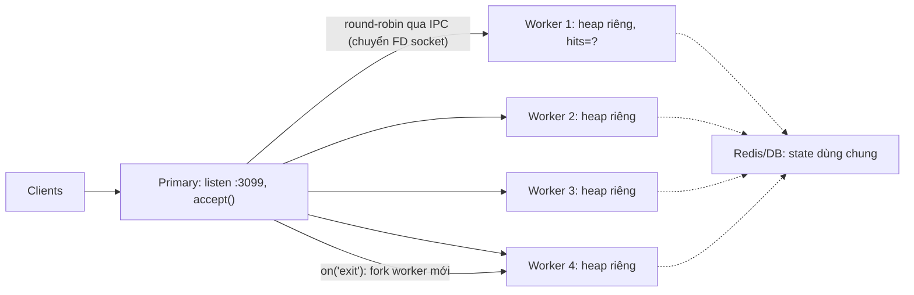
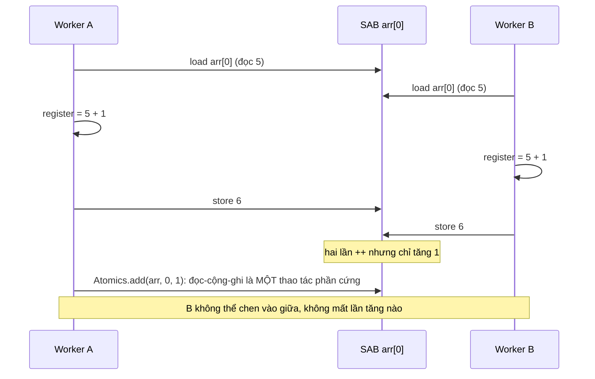
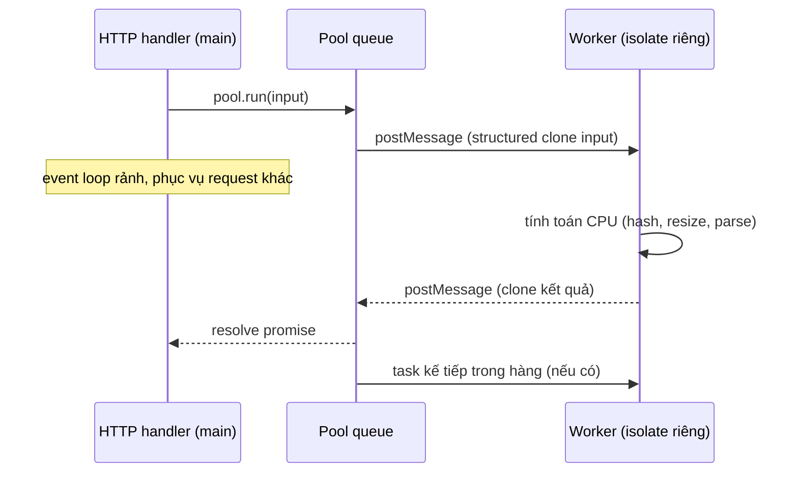

## Bối cảnh & vấn đề

Một API Node chạy trên VM 8 core. Dashboard cho thấy process ở 100% của **một** core và 7 core còn lại gần như ngủ; latency tăng theo traffic. Đội đưa ra ba đề xuất cùng lúc: "bật `cluster`", "chuyển phần resize ảnh sang `worker_threads`", và "chạy 8 container". Một người khác thử `worker_threads` cho mọi request và thấy chậm **hơn**. Không ai sai hoàn toàn, nhưng mỗi cách giải một bài toán khác nhau, với chi phí khác nhau.

Như bài [concurrency & event loop](/tracks/os-concurrency/learn/concurrency-event-loop) đã phân tích, một process Node chạy JS trên một thread. Muốn dùng thêm core, bạn phải có **thêm thread JS** (worker) hoặc **thêm process** (cluster, container). Bài này so sánh các cách đó, đo chi phí thật của việc chuyển dữ liệu giữa các thread, và giải thích vùng khó nhất: **shared memory** với `SharedArrayBuffer` và `Atomics`, nơi JS lần đầu gặp đầy đủ độ khó của lập trình đa luồng.

**Interview angle:** câu "8 core mà chỉ dùng 1" là cơ hội để phân biệt scale HTTP (nhiều process) với tăng tốc tác vụ CPU (worker), và để nhắc chuyện state in-memory.

## Khái niệm

### cluster

**`cluster`** cho phép một process Node (**primary**) fork nhiều process Node con (**worker**) cùng chạy một file server và **cùng lắng nghe một port**. Mặc định trên mọi nền tảng trừ Windows, primary nhận connection rồi phân phối cho worker theo **round-robin** (`SCHED_RR`); lựa chọn còn lại là để OS tự phân phối (`SCHED_NONE`), thường mất cân bằng. Worker giao tiếp với primary qua IPC.

Vì worker là **process**, chúng có heap riêng, crash độc lập (primary fork lại worker mới), và **không chia sẻ memory**. Mọi state trong memory (session, cache, rate limit counter, WebSocket room) giờ tồn tại N bản khác nhau. Đây là điều cần chuẩn bị trước khi bật cluster: đưa state ra Redis/DB, hoặc chấp nhận sai lệch (cache cục bộ mỗi process là chấp nhận được, rate limit thì thường không).

### Nhiều process ngoài Node: PM2 và container

**PM2 cluster mode** là cluster được đóng gói kèm restart, log, zero-downtime reload, hợp với VM không có orchestrator. Trên **Kubernetes**, cách phổ biến nhất là **một process Node mỗi pod**, pod request khoảng 1 CPU, và scale bằng số replica. Orchestrator đã làm những gì primary của cluster làm (restart, phân phối traffic qua Service, health check), lại làm tốt hơn: thấy được từng process qua probe, scale theo metric, đặt pod lên node khác nhau.

Chạy `cluster` **bên trong** pod thường bị khuyên tránh: hai tầng quản lý process chồng nhau; probe chỉ thấy primary nên một worker treo không bị phát hiện; CPU limit của pod bị chia cho N worker khiến throttling khó đoán; và memory limit phải đủ cho N heap. Ngoại lệ hợp lý: node rất lớn với ít pod, hoặc khi chi phí mỗi pod (sidecar, overhead) cao.

### worker_threads

**`worker_threads`** tạo thread thật trong cùng process. Mỗi worker có **V8 isolate riêng** (heap, GC riêng) và **event loop riêng**, nên nó chạy JS song song với main thread. Khởi tạo một worker tốn vài chục ms và vài MB tới vài chục MB memory (đo được 22 ms ở phần ví dụ), vì phải dựng isolate và nạp lại module.

Worker trao đổi bằng **`postMessage`**, và dữ liệu mặc định được **structured clone**: thuật toán sao chép sâu của HTML spec, hỗ trợ object, array, `Map`, `Set`, `Date`, typed array, nhưng không hỗ trợ function, class instance (mất prototype), hay symbol. Clone tốn thời gian ở **cả hai phía** (serialize và deserialize), tỷ lệ với kích thước dữ liệu. Có hai cách tránh copy:

- **Transfer**: `postMessage(buf, [buf])` chuyển **quyền sở hữu** một `ArrayBuffer` sang worker. Không copy byte nào, nhưng bên gửi mất quyền truy cập (`byteLength` về 0).
- **Share**: `SharedArrayBuffer` là vùng byte mà **cả hai** thread cùng đọc/ghi.

Nếu có thể, đặt `resourceLimits` (`maxOldGenerationSizeMb`...) cho worker để một task ngốn memory không kéo cả process vào OOM.

### Worker pool

Vì tạo worker đắt, không bao giờ tạo một worker **cho mỗi request**. Dùng **pool**: tạo N worker lúc khởi động, giữ một hàng đợi task, worker nào rảnh thì nhận task tiếp theo. Thư viện chuẩn trong hệ sinh thái là **piscina**. Kích thước pool nên bằng số core **khả dụng** trừ đi phần cho main thread; trên pod có CPU limit 2, pool 1–2 worker, không phải `os.cpus().length` (đọc bài [container resources](/tracks/os-concurrency/learn/container-resources) về vì sao con số này sai trong container).

Worker đúng chỗ khi task **CPU thuần** và **dữ liệu vào/ra nhỏ so với thời gian tính**: hash, nén, parse, resize ảnh, tính toán số. Worker sai chỗ khi việc là **I/O-bound** (đã async sẵn, worker chỉ thêm overhead), khi dữ liệu phải clone lớn hơn thời gian tính, hoặc khi việc nên chạy bất đồng bộ ở service khác.

### SharedArrayBuffer

**`SharedArrayBuffer` (SAB)** là một vùng memory byte thô mà nhiều agent (main thread, các worker) **cùng trỏ tới**. Gửi SAB qua `postMessage` không copy byte: bên nhận nhận một view vào cùng memory. Bạn thao tác qua typed array (`Int32Array`, `Float64Array`), không thể đặt object JS vào đó.

SAB mang lại tốc độ (ring buffer giữa thread, tính toán số lớn song song, WASM multithread) nhưng cũng mang **toàn bộ** vấn đề của đa luồng: data race, reordering, cần đồng bộ tường minh. Trên browser, SAB chỉ dùng được khi trang **cross-origin isolated** (header `Cross-Origin-Opener-Policy: same-origin` và `Cross-Origin-Embedder-Policy: require-corp`), biện pháp chống tấn công kiểu Spectre dùng SAB làm đồng hồ độ phân giải cao.

### Data race và Atomics

`arr[0]++` trên một SAB trông như một thao tác, nhưng CPU thực hiện **ba bước**: đọc giá trị vào register, cộng 1, ghi lại. Hai thread cùng làm: cả hai đọc 5, cả hai ghi 6, một lần tăng bị mất. Đây là **data race**: hai thread truy cập cùng vị trí memory, ít nhất một bên ghi, không có đồng bộ.

**`Atomics`** cung cấp thao tác **nguyên tử** trên SAB: `Atomics.add`, `sub`, `and`, `or`, `exchange`, `compareExchange` (CAS: "ghi giá trị mới chỉ khi giá trị hiện tại bằng giá trị tôi mong đợi"), `load`, `store`. Phần cứng đảm bảo không thread nào chen vào giữa. Thêm vào đó là **`Atomics.wait(arr, idx, value)`**: ngủ cho tới khi `arr[idx]` khác `value` và ai đó gọi **`Atomics.notify`**. Đây là nền để dựng mutex, semaphore, hàng đợi giữa thread mà không busy-wait. (Node cho phép `Atomics.wait` trên main thread nhưng nó **chặn event loop**; browser cấm trên main thread.)

### Memory model: visibility và reordering

Vấn đề thứ hai tinh vi hơn data race. Compiler (JIT của V8) và CPU được phép **sắp xếp lại** các lệnh đọc/ghi độc lập để chạy nhanh hơn, và mỗi core có cache riêng. Hệ quả: thread A ghi `data = 42` rồi `ready = 1`, nhưng thread B có thể thấy `ready = 1` **trước** khi thấy `data = 42`, hoặc không bao giờ thấy `ready` đổi nếu JIT kéo phép đọc ra ngoài vòng lặp. Java giải bằng `volatile`/`synchronized`, C++ bằng `std::atomic` với memory order.

JS có **memory model** riêng trong ECMAScript spec. Truy cập thường vào SAB là **"unordered"**: không có đảm bảo thứ tự giữa các thread. Thao tác `Atomics.*` là **sequentially consistent**: mọi thread thấy chúng theo cùng một thứ tự toàn cục, và chúng đóng vai trò hàng rào (barrier) cho các truy cập xung quanh. Quy tắc thực hành: **mọi biến dùng để đồng bộ giữa thread phải đọc/ghi bằng `Atomics`**. Với object JS thông thường, vấn đề này **không tồn tại**: mỗi isolate có heap riêng, không ai khác nhìn thấy chúng.

**Interview angle:** "vì sao busy-wait trên một cờ trong SAB mà không dùng Atomics là sai?" JIT có thể hoist phép đọc ra khỏi vòng lặp (vòng lặp vô hạn), và không có đảm bảo thấy dữ liệu ghi trước cờ; lại còn đốt CPU. Dùng `Atomics.wait`/`notify`.

## Cơ chế hoạt động

### cluster phân phối connection



Primary là process duy nhất thật sự `accept()` trên port. Mỗi connection mới được gửi (dưới dạng file descriptor qua kênh IPC) cho worker kế tiếp theo vòng tròn; từ đó worker xử lý toàn bộ request trên connection đó. Vì mỗi worker có heap riêng, biến `hits` trong code tồn tại bốn bản; state cần nhất quán phải nằm ở Redis/DB (đường chấm). Khi một worker chết, primary nhận sự kiện `exit` và fork worker thay thế. Lưu ý round-robin phân phối **connection**, không phải request: một client giữ keep-alive gửi 1.000 request sẽ dính một worker.

### Lost update trên SharedArrayBuffer



Nửa trên là interleaving gây mất cập nhật: cả hai worker đọc cùng giá trị cũ trước khi bên nào kịp ghi. Với 4 worker mỗi cái tăng 1 triệu lần, phần ví dụ đo được chỉ khoảng 1,4 triệu thay vì 4 triệu. Nửa dưới: `Atomics.add` dùng lệnh nguyên tử của CPU (như `LOCK XADD` trên x86 hoặc cặp LDXR/STXR / LDADD trên ARM), nên bộ ba đọc-cộng-ghi không thể bị chen. Đúng, nhưng chậm hơn vì các core phải tranh nhau quyền sở hữu cache line chứa biến đó.

### Một task đi qua worker pool



Thời gian một task = clone input + chờ trong hàng + tính toán + clone output. Worker chỉ đáng khi phần tính toán chiếm ưu thế. Nếu input là object 300.000 dòng (clone 250 ms theo số đo bên dưới) mà phần tính chỉ 50 ms, bạn đã làm chậm request và còn chặn main thread trong lúc serialize. Khi đó hãy truyền dữ liệu dạng `ArrayBuffer` có transfer, hoặc để worker tự đọc dữ liệu từ nguồn (file, DB) thay vì nhận qua message.

## Ví dụ thực tế

### cluster: một port, bốn process, bốn bản state

```ts
// cluster.ts
import cluster from 'node:cluster';
import http from 'node:http';
import { availableParallelism } from 'node:os';

const WORKERS = Math.min(4, availableParallelism());
let hits = 0;                                            // state in-memory: mỗi process một bản

if (cluster.isPrimary) {
  console.log(`primary ${process.pid}, schedulingPolicy=${cluster.schedulingPolicy === cluster.SCHED_RR ? 'SCHED_RR' : 'SCHED_NONE'}`);
  for (let i = 0; i < WORKERS; i++) cluster.fork();
  cluster.on('exit', (w, code, signal) => {
    console.log(`worker ${w.process.pid} died (${signal ?? code}), forking lại`);
    cluster.fork();                                     // tự hồi phục khi một worker crash
  });
  let ready = 0;
  cluster.on('listening', async () => {
    if (++ready < WORKERS) return;
    const seen: string[] = [];
    for (let i = 0; i < 8; i++) {
      const r = await fetch('http://127.0.0.1:3099/', { headers: { connection: 'close' } });
      seen.push(await r.text());
    }
    console.log(seen.join('\n'));
    for (const w of Object.values(cluster.workers ?? {})) w?.process.kill();
    process.exit(0);
  });
} else {
  http.createServer((_req, res) => res.end(`pid ${process.pid} hits=${++hits}`)).listen(3099); // cùng port
}
```

Output thật (Node 24.21):

```text
primary 41065, schedulingPolicy=SCHED_RR
pid 41066 hits=1
pid 41067 hits=1
pid 41069 hits=1
pid 41068 hits=1
pid 41066 hits=2
pid 41067 hits=2
pid 41069 hits=2
pid 41068 hits=2
```

Tám request (mỗi cái một connection mới nhờ `connection: close`) được chia đều theo vòng tròn. Và `hits` cho thấy vấn đề của state in-memory: sau 8 request, không process nào nghĩ con số là 8. Một rate limiter "100 request/phút" viết bằng biến trong memory sẽ thực tế cho phép 400.

### worker_threads pool so với main thread

```ts
// workerpool.ts
import { Worker } from 'node:worker_threads';
import { availableParallelism } from 'node:os';
import { once } from 'node:events';

const src = `
  const { parentPort } = require('node:worker_threads');
  const fib = (n) => (n < 2 ? n : fib(n - 1) + fib(n - 2));
  parentPort.on('message', ({ id, n }) => parentPort.postMessage({ id, result: fib(n) }));
`;
const fib = (n: number): number => (n < 2 ? n : fib(n - 1) + fib(n - 2));

type Job = { n: number; resolve: (v: number) => void };

class WorkerPool {
  #idle: Worker[] = [];
  #queue: Job[] = [];
  #pending = new Map<number, (v: number) => void>();
  #seq = 0;
  constructor(size: number) {
    for (let i = 0; i < size; i++) {
      const w = new Worker(src, { eval: true });                  // tạo MỘT lần, tái sử dụng
      w.on('message', ({ id, result }: { id: number; result: number }) => {
        this.#pending.get(id)!(result);
        this.#pending.delete(id);
        this.#idle.push(w);
        this.#drain();
      });
      this.#idle.push(w);
    }
  }
  run(n: number): Promise<number> {
    return new Promise((resolve) => { this.#queue.push({ n, resolve }); this.#drain(); });
  }
  #drain() {                                                      // mỗi worker chạy một task tại một thời điểm
    while (this.#idle.length && this.#queue.length) {
      const w = this.#idle.pop()!;
      const { n, resolve } = this.#queue.shift()!;
      const id = ++this.#seq;
      this.#pending.set(id, resolve);
      w.postMessage({ id, n });
    }
  }
  close() { return Promise.all(this.#idle.map((w) => w.terminate())); }
}

const tasks = Array<number>(8).fill(35);
let t = performance.now();
tasks.forEach((n) => fib(n));
console.log(`main thread, tuần tự   : ${(performance.now() - t).toFixed(0)} ms (event loop bị chặn suốt)`);

t = performance.now();
const one = new Worker(src, { eval: true });
await once(one, 'online');
console.log(`khởi tạo 1 worker      : ${(performance.now() - t).toFixed(0)} ms`);
await one.terminate();

const size = Math.min(4, availableParallelism());
const pool = new WorkerPool(size);
t = performance.now();
await Promise.all(tasks.map((n) => pool.run(n)));
console.log(`pool ${size} worker, 8 task : ${(performance.now() - t).toFixed(0)} ms (event loop rảnh)`);
await pool.close();
```

Output thật (macOS M1, Node 24.21):

```text
main thread, tuần tự   : 720 ms (event loop bị chặn suốt)
khởi tạo 1 worker      : 22 ms
pool 4 worker, 8 task : 225 ms (event loop rảnh)
```

Pool 4 worker nhanh hơn khoảng 3,2 lần (không phải 4 lần: có chi phí khởi tạo trong lần chạy đầu, và 4 trong 8 core của M1 là efficiency core), và quan trọng hơn, main thread rảnh để phục vụ request trong lúc đó. Nếu tạo worker mới cho mỗi task, 22 ms khởi tạo cộng thêm vào **mỗi** request. Pool ở đây không giới hạn độ dài hàng đợi; bản production (piscina) có `maxQueue` để từ chối sớm thay vì tích task vô hạn khi quá tải.

### Clone, copy và transfer

```ts
// clone.ts
import { Worker } from 'node:worker_threads';
import { once } from 'node:events';

// worker chỉ trả lại một con số để main đo round-trip
const w = new Worker(`
  const { parentPort } = require('node:worker_threads');
  parentPort.on('message', (m) => parentPort.postMessage(1));
`, { eval: true });
const roundTrip = async (label: string, send: () => void) => {
  const t = performance.now();
  send();
  await once(w, 'message');
  console.log(`${label.padEnd(24)}: ${(performance.now() - t).toFixed(1)} ms`);
};

const rows = Array.from({ length: 300_000 }, (_, i) => ({ id: i, name: 'user' + i, tags: ['a', 'b'] }));
await roundTrip('clone object 300k rows', () => w.postMessage(rows));        // structured clone cả object graph

const big = new ArrayBuffer(200 * 1024 * 1024);                              // 200 MB
await roundTrip('copy ArrayBuffer 200MB', () => w.postMessage(big));         // copy từng byte
await roundTrip('transfer 200MB', () => w.postMessage(big, [big]));          // chuyển quyền sở hữu
console.log(`sau transfer, main thấy big.byteLength = ${big.byteLength}`);
await w.terminate();
```

Output thật:

```text
clone object 300k rows  : 254.9 ms
copy ArrayBuffer 200MB  : 182.1 ms
transfer 200MB          : 1.3 ms
sau transfer, main thấy big.byteLength = 0
```

Clone 300.000 object nhỏ tốn 255 ms, phần lớn trong đó **chạy trên main thread** (serialize), tức là chặn event loop gần bằng việc tự tính luôn. Transfer 200 MB gần như miễn phí vì chỉ chuyển quyền sở hữu; main mất quyền truy cập buffer. Bài học: thiết kế message giữa thread quanh **byte** (buffer có transfer) hoặc **tham chiếu** (đường dẫn file, id bản ghi), không quanh object graph lớn.

### Data race trên SharedArrayBuffer

```ts
// atomics.ts
import { Worker, isMainThread, workerData } from 'node:worker_threads';
import { once } from 'node:events';

const WORKERS = 4, ITER = 1_000_000;
type Mode = 'plain' | 'atomic';

if (isMainThread) {
  for (const mode of ['plain', 'atomic'] as Mode[]) {
    const shared = new Int32Array(new SharedArrayBuffer(4));      // 4 byte dùng chung thật sự
    const t0 = performance.now();
    await Promise.all(Array.from({ length: WORKERS }, () =>
      once(new Worker(new URL(import.meta.url), { workerData: { buf: shared.buffer, mode } }), 'exit')));
    console.log(`${mode.padEnd(6)}: counter = ${shared[0].toLocaleString('en-US')} / ${(WORKERS * ITER).toLocaleString('en-US')} (${(performance.now() - t0).toFixed(0)} ms)`);
  }
} else {
  const { buf, mode } = workerData as { buf: SharedArrayBuffer; mode: Mode };
  const arr = new Int32Array(buf);
  if (mode === 'plain') for (let i = 0; i < ITER; i++) arr[0]++;   // load, +1, store: bị chen ngang
  else for (let i = 0; i < ITER; i++) Atomics.add(arr, 0, 1);      // read-modify-write nguyên tử
}
```

Output thật:

```text
plain : counter = 1,393,196 / 4,000,000 (72 ms)
atomic: counter = 4,000,000 / 4,000,000 (128 ms)
```

Hơn 65% số lần tăng bị mất với `++` thường; con số thay đổi mỗi lần chạy, đặc trưng của data race. `Atomics.add` luôn đúng nhưng chậm gần gấp đôi vì bốn core tranh cùng một cache line. Trong thực tế, thiết kế tốt là **giảm chia sẻ**: mỗi worker đếm vào ô riêng rồi cộng lại cuối cùng, dùng Atomics chỉ cho điểm đồng bộ.

## Trade-offs & lựa chọn thay thế

| Cách | Đơn vị | Chia sẻ memory | Cô lập lỗi | Chi phí | Hợp với |
|---|---|---|---|---|---|
| Nhiều pod/container (1 process mỗi pod) | Process | Không | Cao nhất | Overhead mỗi pod | HTTP API trên Kubernetes, mặc định |
| `cluster` / PM2 | Process | Không | Cao | Heap x N trên một máy | VM không orchestrator |
| `worker_threads` pool | Thread + isolate | `SharedArrayBuffer`, transfer | Trung bình | Khởi tạo, clone | Tác vụ CPU ngắn trong request |
| `SharedArrayBuffer` + `Atomics` | Byte thô | Có | Thấp (bug khó tìm) | Độ phức tạp | Tính toán số, ring buffer, WASM |
| Service/worker riêng qua queue | Process ở máy khác | Không | Cao nhất | Vận hành thêm service | Việc nặng, bất đồng bộ, scale riêng |

Dùng thêm core để phục vụ **nhiều request HTTP hơn**: thêm process, trên Kubernetes là thêm replica, trên VM là cluster/PM2. Để một **tác vụ CPU** không chặn event loop mà vẫn trả kết quả trong request (dưới vài trăm ms): `worker_threads` pool. Tách **service riêng** khi một hoặc nhiều điều sau đúng: cần scale độc lập (API 10 pod, xử lý ảnh 50 pod lúc cao điểm), tác vụ có thể crash hoặc ngốn memory (native lib như ffmpeg, sharp) và không được kéo API chết theo, user không cần chờ kết quả đồng bộ (trả `202 Accepted` rồi thông báo qua webhook/WebSocket/polling), hoặc ngôn ngữ khác (Go, Rust) hợp hơn. Cái giá của service riêng là thêm deploy, monitor, contract và queue; đội nhỏ có thể bắt đầu bằng worker pool và tách ra khi số liệu chứng minh cần.

## Edge cases & failure modes

- **Sticky session với cluster**: WebSocket hoặc Socket.IO long-polling cần mọi request của một client tới cùng worker; round-robin theo connection làm vỡ handshake. Cần sticky theo IP/cookie ở LB, hoặc adapter Redis.
- **Worker crash vì lỗi native**: exception JS trong worker phát sự kiện `'error'` ở main, nhưng segfault trong native addon giết **cả process**. Việc dùng native lib rủi ro nên nằm ở process riêng.
- **Worker không có `resourceLimits`**: một task giải nén "zip bomb" làm heap worker phình, cộng dồn vào RSS của process, và container bị OOM-kill cùng mọi request đang chạy.
- **Hàng đợi pool vô hạn**: khi tải vượt khả năng tính toán, task tích trong memory và latency tăng không giới hạn. Đặt `maxQueue`, trả 503 sớm.
- **Pool lớn hơn CPU quota**: pool 8 worker trên pod limit 2 CPU gây CFS throttling, mọi thứ chậm hơn pool 2.
- **Deadlock với `Atomics.wait`**: hai worker chờ nhau trên hai ô khác nhau mà không ai `notify`; hoặc gọi `Atomics.wait` trên main thread làm treo event loop.
- **`postMessage` class instance**: prototype bị mất, method biến mất ở bên nhận; lỗi chỉ lộ ra lúc runtime (`x.method is not a function`).
- **Tràn số `Int32Array`**: counter chia sẻ vượt 2^31-1 quay về âm; dùng `BigInt64Array` với `Atomics` cho bộ đếm lớn.

## Pitfalls

- ❌ Dùng `worker_threads` để phục vụ HTTP hoặc cho việc I/O-bound → ✅ I/O đã async trên event loop; worker dành cho CPU. Scale HTTP bằng process/pod.
- ❌ `new Worker()` trong mỗi request → ✅ pool khởi tạo sẵn (piscina), kích thước theo CPU khả dụng, có `maxQueue`.
- ❌ Gửi object graph lớn qua `postMessage` → ✅ transfer `ArrayBuffer`, hoặc gửi tham chiếu (path, id) để worker tự đọc.
- ❌ Bật `cluster` mà vẫn giữ session/rate limit/cache quan trọng trong memory → ✅ đưa state dùng chung ra Redis/DB trước khi có hơn một process.
- ❌ Chạy `cluster` bên trong pod Kubernetes theo thói quen → ✅ một process mỗi pod, để orchestrator restart và scale; chỉ dùng cluster trong pod khi có lý do đo được.
- ❌ Đọc/ghi thường trên `SharedArrayBuffer` để đồng bộ giữa thread → ✅ `Atomics.load/store/compareExchange` cho biến đồng bộ, `Atomics.wait/notify` thay cho busy-wait.
- ❌ Chọn `SharedArrayBuffer` vì "nhanh hơn" khi message passing là đủ → ✅ bắt đầu bằng message + transfer; chỉ dùng shared memory khi đo được lợi ích và chấp nhận độ khó.

## Tóm tắt

- Muốn dùng thêm core, Node cần thêm thread JS (`worker_threads`) hoặc thêm process (`cluster`, PM2, nhiều pod).
- `cluster`: primary accept và chia connection round-robin cho worker process; state in-memory bị nhân N bản, phải ra Redis/DB. Trên Kubernetes, ưu tiên một process mỗi pod.
- `worker_threads`: isolate và event loop riêng, khởi tạo khoảng vài chục ms; luôn dùng pool, kích thước theo CPU khả dụng.
- `postMessage` structured clone tốn thời gian ở cả hai phía (300k object: 255 ms); transfer `ArrayBuffer` gần như miễn phí nhưng bên gửi mất quyền truy cập.
- `SharedArrayBuffer` là memory dùng chung thật; `++` thường mất cập nhật (1,4M/4M), `Atomics.add` luôn đúng nhưng chậm hơn.
- Memory model JS: truy cập thường trên SAB là unordered, `Atomics` là sequentially consistent; object JS thường không bị vấn đề này vì mỗi isolate có heap riêng.
- Tách service riêng khi cần scale độc lập, cô lập lỗi/memory, xử lý bất đồng bộ, hoặc ngôn ngữ khác; worker pool khi cần kết quả trong request và việc ngắn.
