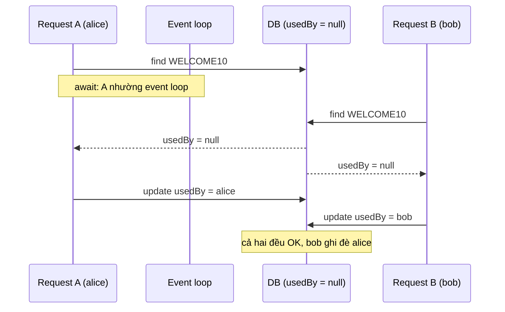
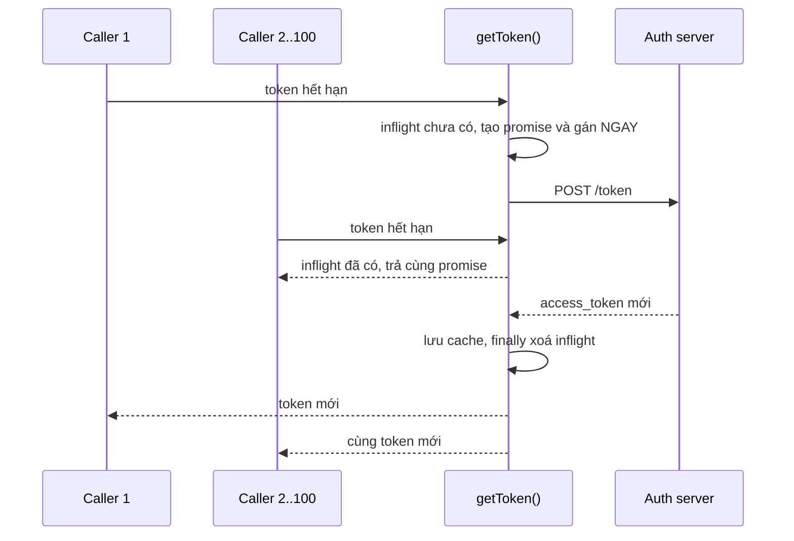
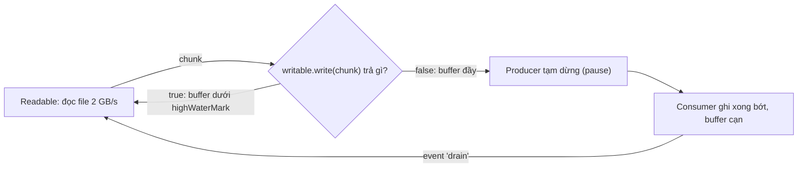

## Bối cảnh & vấn đề

Chiến dịch marketing phát mã `WELCOME10`, mỗi mã chỉ dùng được một lần. Code đổi mã trông hoàn toàn hợp lý:

```ts
async function redeem(code: string, userId: string) {
  const c = await db.coupon.find(code);
  if (c.usedBy) throw new Error('used');
  await db.coupon.update(code, { usedBy: userId });
}
```

Sáng hôm sau, báo cáo cho thấy một số mã được dùng hai, ba lần. Unit test đều xanh, code review không ai thấy lỗi. Một người trong đội phản bác: "Node single-threaded, làm gì có race condition?" Nhưng chỉ cần user bấm nút hai lần, hoặc app mobile retry khi mạng chập chờn, hai request chạy **xen kẽ**: cả hai `find` thấy `usedBy = null` trước khi bên nào kịp `update`. Và khi service chạy 10 pod, hai request có thể rơi vào hai process khác nhau, lúc đó không có gì trong JS có thể ngăn chúng.

Cùng tuần, một helper lấy access token cho service-to-service gọi auth server **100 lần** trong một giây khi token hết hạn, bị rate limit, và vì refresh token xoay vòng nên 99 lần sau đều nhận lỗi `invalid_grant`. Cả hai lỗi có chung một gốc: **check-then-act qua `await`**. Bài này giải thích vì sao nó xảy ra trong JS, và bộ công cụ để xử lý: thao tác atomic ở tầng dữ liệu, async mutex, semaphore, single-flight, giới hạn concurrency và backpressure.

**Interview angle:** trả lời "Node single-thread nên không có race" là red flag rõ ràng nhất trong track này.

## Khái niệm

### Race condition và data race

**Race condition** là lỗi mà kết quả đúng hay sai phụ thuộc vào **thứ tự xen kẽ** của các thao tác mà chương trình không kiểm soát. Nó là lỗi logic ở tầng thiết kế: hai luồng công việc cùng dựa trên một giả định ("coupon chưa dùng") mà giả định đó có thể đổi giữa lúc kiểm tra và lúc hành động.

**Data race** hẹp hơn: hai thread truy cập **cùng vị trí memory** đồng thời, ít nhất một bên ghi, không có đồng bộ (bài [tận dụng nhiều core](/tracks/os-concurrency/learn/multicore-node) có ví dụ trên `SharedArrayBuffer`). JavaScript thông thường **không có data race** vì chỉ một thread chạm vào heap. Nhưng nó **có race condition**, vì race condition không cần hai thread: chỉ cần hai tác vụ xen kẽ và một trạng thái dùng chung, dù trạng thái đó ở trong memory, trong DB, hay trong Redis.

### Check-then-act và read-modify-write

Hai hình dạng race gặp nhiều nhất:

- **Check-then-act**: kiểm tra một điều kiện rồi hành động dựa trên nó. `if (!exists) create()`, `if (stock > 0) sell()`, `if (!token) refresh()`. Sai khi điều kiện đổi giữa check và act.
- **Read-modify-write**: đọc giá trị, tính giá trị mới ở app, ghi lại. `balance = read(); write(balance - 100)`. Sai khi hai bên cùng đọc giá trị cũ; một cập nhật bị ghi đè, gọi là **lost update**.

Cách sửa gốc cho cả hai là làm cho "kiểm tra và hành động" trở thành **một bước không thể chen ngang** (atomic), ở nơi dữ liệu sống. Với DB: `UPDATE coupons SET used_by = $2 WHERE code = $1 AND used_by IS NULL` rồi kiểm tra số dòng bị ảnh hưởng; unique constraint; `INSERT ... ON CONFLICT`. Với Redis: `SET key value NX`, `INCR`, script Lua. Bài [deadlock & DB locking](/tracks/os-concurrency/learn/deadlock-db-locking) đi sâu các lựa chọn ở DB.

### Điểm xen kẽ trong JavaScript: await

Nhờ run-to-completion (xem [event loop](/tracks/os-concurrency/learn/concurrency-event-loop)), đoạn code **giữa hai `await`** chạy nguyên khối. Nhưng mỗi `await` là một chỗ hàm **trả quyền** cho event loop, và bất kỳ callback nào khác (một request khác, một timer) có thể chạy trước khi hàm tiếp tục. Mọi biến bạn đọc **trước** `await` có thể đã lỗi thời **sau** `await`.

Hệ quả thực hành rất cụ thể: khi đọc code async, đánh dấu mọi `await` như một "khe hở". Hàm `redeem` có hai khe: sau `find` và sau `update`. Điều kiện `c.usedBy` được kiểm tra trên dữ liệu đọc trước khe thứ nhất, và hành động xảy ra sau nó. Ngược lại, `counter++` không có `await` ở giữa thì an toàn trong một process Node, dù có 1.000 request đồng thời.

### Critical section, mutex và semaphore

**Critical section** là đoạn code truy cập tài nguyên dùng chung mà tại một thời điểm chỉ nên có một (hoặc tối đa N) bên chạy. **Mutex** (mutual exclusion) cho phép **tối đa một** holder; thường có khái niệm **owner**: ai lock thì người đó unlock. **Semaphore** là một **bộ đếm permit**: `acquire` giảm counter (chờ nếu bằng 0), `release` tăng lại; semaphore khởi tạo với N cho phép tối đa N holder đồng thời. Mutex gần giống semaphore với N = 1, trừ khái niệm owner.

Trong JS, vì không có hai thread tranh nhau JS state, mutex có ý nghĩa khác: **async mutex** tuần tự hoá một đoạn **có `await` bên trong** (ví dụ "chỉ một luồng được refresh token", "ghi file cấu hình tuần tự"). Semaphore trong JS chủ yếu dùng để **giới hạn concurrency**: tối đa 10 lời gọi đồng thời tới một API bên thứ ba, tối đa 4 lần resize ảnh cùng lúc. Một **connection pool** chính là một semaphore: `max: 20` nghĩa là tối đa 20 query cùng lúc, query thứ 21 xếp hàng.

Giới hạn quan trọng: mutex và semaphore trong memory chỉ có tác dụng **trong một process**. Với nhiều pod, cần lock ở tầng chung: DB (`SELECT ... FOR UPDATE`, advisory lock) hoặc Redis (bài [distributed lock](/tracks/os-concurrency/learn/distributed-locks-idempotency)).

### Single-flight

**Single-flight** (tên từ package `singleflight` của Go) là pattern: khi nhiều caller cùng cần một kết quả đắt (refresh token, load cấu hình, tính cache miss), chỉ **một** lời gọi thật được thực hiện, những caller khác **chờ cùng promise đó**. Trong JS, cách làm tự nhiên là lưu **promise đang chạy** (không phải kết quả) vào một biến; caller tới sau thấy promise tồn tại thì `await` nó.

Hai chi tiết quyết định đúng sai: gán promise **đồng bộ**, trước bất kỳ `await` nào (nếu không, khe hở lại xuất hiện); và **xoá** promise khi xong, **kể cả khi lỗi**, nếu không một lần lỗi sẽ được trả cho mọi caller mãi mãi. Khi promise chung bị reject, **mọi** caller đang chờ nhận cùng lỗi đó, là hành vi mong muốn (không ai được một token cũ giả vờ đúng), nhưng caller cần có retry riêng nếu phù hợp.

### Giới hạn concurrency

`Promise.all(items.map(process))` với 10.000 item khởi động 10.000 tác vụ **cùng lúc**: 10.000 connection tới upstream, cạn connection pool, cạn file descriptor, bị rate limit. **Bounded concurrency** giữ tối đa N tác vụ chạy, tác vụ mới chỉ bắt đầu khi một cái xong. Cách viết phổ biến: N "worker" async cùng rút task từ một chỉ số chung, hoặc dùng `p-limit`. Lỗi hay gặp khi tự viết: quên `await` các worker, gom kết quả theo thứ tự hoàn thành thay vì theo index, và nuốt lỗi.

### Backpressure

**Backpressure** là cơ chế để consumer chậm **báo cho producer chậm lại**. Không có nó, producer nhanh (đọc file từ SSD 2 GB/s) đổ dữ liệu vào consumer chậm (insert DB 20 MB/s), và phần chênh lệch tích trong memory tới khi OOM. Cùng khái niệm xuất hiện ở mọi tầng: TCP flow control window, consumer lag của Kafka, hàng đợi có giới hạn.

Trong Node stream, `writable.write(chunk)` trả **`false`** khi buffer nội bộ vượt **`highWaterMark`**; producer đúng mực phải dừng và chờ event **`'drain'`**. `readable.pipe()` và `stream.pipeline()` làm việc này tự động; `pipeline` còn lan lỗi và destroy mọi stream khi một stream lỗi. Lỗi kinh điển là `readable.on('data', c => writable.write(c))`: bỏ qua giá trị trả về, dữ liệu dồn không giới hạn. Mặc định `highWaterMark` của byte stream là 64 KiB từ Node 22 (trước đó 16 KiB) (verify), object mode là 16 object.

## Cơ chế hoạt động

### Hai request xen kẽ qua await



Không có hai thread nào ở đây. Event loop chạy A tới `await` đầu tiên, rồi chạy B tới `await` đầu tiên, vì cả hai đang chờ DB. Kết quả trả về theo thứ tự bất kỳ, và cả hai nhánh đều qua được `if` vì cùng dựa trên dữ liệu đọc trước khi bên kia ghi. Sơ đồ giống hệt khi A và B chạy ở hai pod khác nhau, chỉ khác là event loop được thay bằng hai process: đó là lý do fix phải nằm ở DB chứ không ở JS.

### Single-flight cho refresh token



Điểm mấu chốt nằm ở bước "gán NGAY": biến `inflight` được gán **trong cùng đoạn đồng bộ** với lúc kiểm tra nó, nên không có khe hở giữa check và act. Caller 2 tới 100 thấy promise và chờ nó, không ai gọi auth server lần thứ hai. `finally` xoá promise dù thành công hay lỗi, để lần hết hạn tiếp theo (hoặc lần thử lại sau lỗi) tạo promise mới.

### Backpressure trong pipeline



Vòng này là thứ `pipeline()` làm cho bạn. Khi `write` trả `false`, producer dừng đọc (với file stream, không đọc thêm từ đĩa; với socket, kernel ngừng nhận và TCP window thu lại, báo ngược tới tận client). Khi consumer ghi bớt và buffer cạn, event `'drain'` báo producer đọc tiếp. Memory luôn giới hạn khoảng `highWaterMark` mỗi stream, dù file có 5 GB.

## Ví dụ thực tế

### Tái hiện race coupon và sửa bằng thao tác atomic

Cách tái hiện race trong test: **bắn N request song song** vào cùng tài nguyên, với DB giả có độ trễ để mở rộng khe hở.

```ts
// race.ts
const sleep = (ms: number) => new Promise<void>((r) => setTimeout(r, ms));

// "DB" giả lập: mỗi lời gọi tốn 5 ms round-trip
type Coupon = { usedBy: string | null };
const coupons = new Map<string, Coupon>([['WELCOME10', { usedBy: null }]]);
const db = {
  async find(code: string): Promise<Coupon> { await sleep(5); return { ...coupons.get(code)! }; },
  async update(code: string, patch: Partial<Coupon>) { await sleep(5); Object.assign(coupons.get(code)!, patch); },
  // kiểm tra + ghi trong MỘT bước, như UPDATE coupons SET used_by=$2 WHERE code=$1 AND used_by IS NULL
  async claim(code: string, userId: string): Promise<number> {
    await sleep(5);
    const c = coupons.get(code)!;
    if (c.usedBy) return 0;
    c.usedBy = userId;
    return 1;
  },
};

async function redeemRacy(code: string, userId: string) {
  const c = await db.find(code);                 // điểm xen kẽ #1
  if (c.usedBy) throw new Error(`${userId}: used`);
  await db.update(code, { usedBy: userId });     // điểm xen kẽ #2
  return `${userId}: OK`;
}
async function redeemAtomic(code: string, userId: string) {
  if ((await db.claim(code, userId)) === 0) throw new Error(`${userId}: used`);
  return `${userId}: OK`;
}

for (const [name, fn] of [['racy', redeemRacy], ['atomic', redeemAtomic]] as const) {
  coupons.get('WELCOME10')!.usedBy = null;
  const out = await Promise.allSettled(['alice', 'bob', 'carol'].map((u) => fn('WELCOME10', u)));
  const text = out.map((o) => (o.status === 'fulfilled' ? o.value : (o.reason as Error).message));
  console.log(name.padEnd(6), text.join(' | '), '→ usedBy =', coupons.get('WELCOME10')!.usedBy);
}
```

Output thật (Node 24.21):

```text
racy   alice: OK | bob: OK | carol: OK → usedBy = carol
atomic alice: OK | bob: used | carol: used → usedBy = alice
```

Ba user cùng "đổi thành công" một mã, và DB chỉ nhớ người cuối. Bản atomic: đúng một người thành công. Trong DB thật, `claim` là một câu SQL:

```sql
UPDATE coupons SET used_by = $2, used_at = now()
WHERE code = $1 AND used_by IS NULL;
-- rowCount = 1: mình thắng; rowCount = 0: người khác đã dùng
```

Câu này đúng trên **10 pod** vì DB tự tuần tự hoá hai UPDATE trên cùng một row (row lock) và đánh giá lại điều kiện `used_by IS NULL` sau khi bên trước commit. Không cần mutex nào trong JS.

### Single-flight cho token

```ts
// singleflight.ts
const sleep = (ms: number) => new Promise<void>((r) => setTimeout(r, ms));
type TokenResponse = { access_token: string; expires_in: number };
let authCalls = 0;
async function callAuthServer(): Promise<TokenResponse> {
  authCalls++;
  await sleep(50);
  return { access_token: 't' + authCalls, expires_in: 300 };
}

// ❌ check-then-act qua await
let token: string | null = null, expiresAt = 0;
async function getTokenRacy(): Promise<string> {
  if (!token || Date.now() > expiresAt) {
    const body = await callAuthServer();
    token = body.access_token;
    expiresAt = Date.now() + body.expires_in * 1000;
  }
  return token;
}

// ✅ single-flight + refresh sớm 30 s
let cached: { token: string; expiresAt: number } | null = null;
let inflight: Promise<string> | null = null;
async function getToken(): Promise<string> {
  if (cached && Date.now() < cached.expiresAt - 30_000) return cached.token;
  inflight ??= (async () => {
    try {
      const body = await callAuthServer();
      cached = { token: body.access_token, expiresAt: Date.now() + body.expires_in * 1000 };
      return cached.token;
    } finally {
      inflight = null;                       // xoá cả khi lỗi để lần sau thử lại
    }
  })();
  return inflight;
}

await Promise.all(Array.from({ length: 100 }, getTokenRacy));
console.log('racy         : 100 caller →', authCalls, 'lần gọi auth server');
authCalls = 0;
const tokens = await Promise.all(Array.from({ length: 100 }, getToken));
console.log('single-flight: 100 caller →', authCalls, 'lần gọi auth server, số token khác nhau:', new Set(tokens).size);
```

Output thật:

```text
racy         : 100 caller → 100 lần gọi auth server
single-flight: 100 caller → 1 lần gọi auth server, số token khác nhau: 1
```

Refresh sớm 30 giây (clock skew) tránh request fail đúng mép hết hạn. Với nhiều pod, mỗi pod một lần refresh thường chấp nhận được. Nếu auth server chỉ cho một refresh token dùng một lần (rotation), cần lưu token ở Redis và dùng distributed lock để chỉ một pod refresh.

### Semaphore và async mutex

```ts
// semaphore.ts
class Semaphore {
  #waiters: (() => void)[] = [];
  #permits: number;
  constructor(permits: number) { this.#permits = permits; }
  async acquire(): Promise<() => void> {
    if (this.#permits > 0) this.#permits--;
    else await new Promise<void>((r) => this.#waiters.push(r));   // xếp hàng FIFO
    let released = false;
    return () => {                                                 // release chỉ có tác dụng 1 lần
      if (released) return;
      released = true;
      const next = this.#waiters.shift();
      if (next) next();                                            // chuyển permit thẳng cho người chờ
      else this.#permits++;
    };
  }
  async use<T>(fn: () => Promise<T>): Promise<T> {
    const release = await this.acquire();
    try { return await fn(); } finally { release(); }              // luôn trả permit, kể cả khi throw
  }
}
const Mutex = class extends Semaphore { constructor() { super(1); } };

const sleep = (ms: number) => new Promise<void>((r) => setTimeout(r, ms));
const sem = new Semaphore(3);
let active = 0, peak = 0;
const t0 = performance.now();
await Promise.all(Array.from({ length: 10 }, (_, i) =>
  sem.use(async () => {
    active++; peak = Math.max(peak, active);
    await sleep(100);                                              // gọi API bên ngoài
    active--;
  })));
console.log(`10 task, semaphore(3): peak = ${peak}, tổng ${(performance.now() - t0).toFixed(0)} ms`);

const mutex = new Mutex();
let balance = 100;
const withdraw = (amt: number) => mutex.use(async () => {
  const b = balance; await sleep(5);                               // đọc - await - ghi, nhưng đã tuần tự hoá
  if (b < amt) return 'insufficient';
  balance = b - amt; return 'ok';
});
console.log('mutex withdraw x3 (70 mỗi lần):', await Promise.all([withdraw(70), withdraw(70), withdraw(70)]), 'balance =', balance);
```

Output thật:

```text
10 task, semaphore(3): peak = 3, tổng 403 ms
mutex withdraw x3 (70 mỗi lần): [ 'ok', 'insufficient', 'insufficient' ] balance = 30
```

10 task mỗi cái 100 ms với tối đa 3 đồng thời mất 4 "đợt" (403 ms), và không bao giờ quá 3. Mutex biến đoạn read-await-write thành tuần tự, số dư đúng. Hai chi tiết thiết kế: `release` idempotent (gọi hai lần không tạo thêm permit), và `use()` bọc `try/finally` để lỗi không làm rò permit, lỗi hay gặp nhất khi tự viết semaphore. Nhớ rằng mutex này chỉ đúng trong **một process**; với số dư thật trong DB, dùng câu UPDATE có điều kiện.

### Sửa helper giới hạn concurrency

```ts
// limit.ts
const sleep = (ms: number) => new Promise<void>((r) => setTimeout(r, ms));

// ❌ bản lỗi
async function runLimitedBuggy<T>(tasks: (() => Promise<T>)[], limit: number) {
  const results: T[] = [];
  let i = 0;
  const worker = async () => { while (i < tasks.length) results.push(await tasks[i++]()); };
  Array.from({ length: limit }, worker);
  return results;
}

// ✅ giữ thứ tự, await mọi worker, gom lỗi, tuỳ chọn fail-fast
async function runLimited<T>(tasks: (() => Promise<T>)[], limit: number, { failFast = false } = {}) {
  const results: PromiseSettledResult<T>[] = new Array(tasks.length);
  let next = 0, stopped = false, running = 0, peak = 0;
  const worker = async () => {
    while (!stopped && next < tasks.length) {
      const idx = next++;                               // lấy index TRƯỚC await
      running++; peak = Math.max(peak, running);
      try {
        results[idx] = { status: 'fulfilled', value: await tasks[idx]() };
      } catch (reason) {
        results[idx] = { status: 'rejected', reason };
        if (failFast) stopped = true;                   // ngừng lập lịch task mới
      } finally {
        running--;
      }
    }
  };
  await Promise.all(Array.from({ length: Math.min(limit, tasks.length) }, worker));
  return { results, peak };
}

const tasks = [30, 10, 20, 5, 25, 15].map((ms, i) => async () => {
  await sleep(ms);
  if (i === 3) throw new Error('task 3 failed');
  return `r${i}`;
});

process.on('unhandledRejection', (e) => console.log('unhandledRejection:', (e as Error).message));
console.log('buggy →', await runLimitedBuggy(tasks, 2));
await sleep(100);
const { results, peak } = await runLimited(tasks, 2);
console.log('fixed →', results.map((r) => (r.status === 'fulfilled' ? r.value : `ERR(${(r.reason as Error).message})`)), 'peak =', peak);
```

Output thật:

```text
buggy → []
unhandledRejection: task 3 failed
fixed → [ 'r0', 'r1', 'r2', 'ERR(task 3 failed)', 'r4', 'r5' ] peak = 2
```

Bản lỗi trả mảng **rỗng** ngay lập tức (không `await` các worker), lỗi của task 3 thành `unhandledRejection` (trên Node hiện đại, mặc định làm **crash process** nếu không có handler), và nếu có kết quả thì thứ tự theo lúc hoàn thành, không khớp input. Bản sửa: `await Promise.all(workers)`; lấy `idx` **trước** `await` rồi ghi `results[idx]`; bắt lỗi từng task theo kiểu `allSettled`; `failFast` dừng lập lịch task mới sau lỗi đầu tiên (các task đang chạy vẫn chạy xong; muốn huỷ chúng cần truyền `AbortSignal` vào task).

### Backpressure: bỏ qua write() và dùng pipeline

```ts
// backpressure.ts
import { Writable, Readable } from 'node:stream';
import { pipeline } from 'node:stream/promises';

// consumer chậm: ~1 ms cho mỗi chunk 64 KB (như ghi vào DB/S3)
const slowSink = () => new Writable({
  highWaterMark: 64 * 1024,
  write(_chunk, _enc, cb) { setTimeout(cb, 1); },
});
const newChunk = () => Buffer.alloc(64 * 1024);          // dữ liệu mới, như đọc từ file/socket
const MB = (n: number) => `${(n / 1024 / 1024).toFixed(0)} MB`;

{ // ❌ bỏ qua giá trị trả về của write()
  const sink = slowSink();
  let falseCount = 0;
  for (let i = 0; i < 2000; i++) if (!sink.write(newChunk())) falseCount++;
  console.log(`ignore write(): false ${falseCount} lần, writableLength = ${MB(sink.writableLength)}, arrayBuffers = ${MB(process.memoryUsage().arrayBuffers)}`);
  sink.destroy();
}
await new Promise((r) => setTimeout(r, 200));
{ // ✅ pipeline tự dừng producer khi buffer đầy, chạy tiếp khi 'drain'
  const src = Readable.from((function* () { for (let i = 0; i < 2000; i++) yield newChunk(); })());
  const sink = slowSink();
  let peak = 0;
  const timer = setInterval(() => { peak = Math.max(peak, sink.writableLength); }, 5);
  const t0 = performance.now();
  await pipeline(src, sink);
  clearInterval(timer);
  console.log(`pipeline      : xong sau ${(performance.now() - t0).toFixed(0)} ms, writableLength đỉnh = ${(peak / 1024).toFixed(0)} KB`);
}
```

Output thật:

```text
ignore write(): false 2000 lần, writableLength = 125 MB, arrayBuffers = 125 MB
pipeline      : xong sau 2390 ms, writableLength đỉnh = 64 KB
```

`write()` đã trả `false` ngay từ chunk đầu tiên và 2.000 lần liền, nhưng code không nghe: 125 MB nằm chờ trong buffer của một consumer chậm. Với file 5 GB, process OOM. `pipeline` giữ buffer ở đúng `highWaterMark` (64 KB) suốt quá trình. Với bài toán "đọc CSV 5 GB và insert vào DB", mô hình đúng là `pipeline(fs.createReadStream(), csvParser(), batchTransform(1000), dbWriter)` trong đó `dbWriter` là một Writable chỉ gọi callback sau khi batch insert xong, nên tốc độ đọc file tự khớp với tốc độ DB.

### Kể chuyện một bug concurrency (behavioral)

Khi được hỏi "kể về một bug concurrency bạn từng gặp", cấu trúc STAR với các chi tiết kỹ thuật ở trên giúp câu trả lời thuyết phục: **tình huống** (triệu chứng khó tái hiện: đơn trùng, coupon dùng nhiều lần, job chạy hai lần, và impact đo được), **hành động** (tương quan log theo correlation id và timestamp để dựng lại interleaving; viết test bắn N request song song như `race.ts` để tái hiện ổn định; đọc log lock/deadlock của DB), **fix gốc** (thao tác atomic, unique constraint, idempotency key) cộng **lưới an toàn** (alert, job đối soát), và **kết quả** bằng số liệu thật của bạn. Kết bằng bài học thiết kế, ví dụ "mọi check-then-act qua `await` đều đáng nghi", và test nào lẽ ra đã bắt được bug trước production.

## Trade-offs & lựa chọn thay thế

| Công cụ | Phạm vi đúng | Chi phí | Hỏng khi | Dùng cho |
|---|---|---|---|---|
| Thao tác atomic ở DB (UPDATE có điều kiện, constraint, ON CONFLICT) | Mọi process, mọi pod | 1 round-trip | Logic quá phức tạp để viết bằng SQL | Coupon, tồn kho, số dư, "tạo nếu chưa có" |
| Async mutex trong memory | Một process | Gần 0 | Có hơn một process/pod | Tuần tự hoá thao tác cục bộ (ghi file, refresh cache cục bộ) |
| Single-flight | Một process | Gần 0 | Cần đúng một lần trên toàn cluster | Refresh token, cache miss đắt, load config |
| Semaphore / p-limit | Một process | Thêm latency khi xếp hàng | Giới hạn toàn cục qua nhiều pod | Giới hạn gọi API ngoài, batch job |
| Distributed lock (Redis, advisory lock) | Nhiều pod | Round-trip + failure modes | GC pause, failover (xem bài riêng) | Điều phối việc ngoài DB |
| Stream + backpressure | Luồng dữ liệu | Code theo mô hình stream | Tự viết vòng `on('data')` | File lớn, import/export, proxy |

Nguyên tắc chọn: **đưa tính đúng đắn xuống nơi dữ liệu sống** trước tiên. Nếu invariant diễn đạt được bằng một câu SQL có điều kiện hoặc một constraint, đó là lời giải đúng trên mọi số pod và không có lớp lock thứ hai để hỏng. Công cụ trong memory (mutex, single-flight, semaphore) là **tối ưu hoá cục bộ**: giảm tải, giảm trùng lặp, không phải cơ chế đảm bảo tính đúng trên toàn hệ thống.

## Edge cases & failure modes

- **Mutex trong memory tưởng là đủ**: đúng khi dev chạy một process, sai ngay khi scale lên 2 pod hoặc bật cluster. Đây là red flag interviewer tìm trong câu hỏi oversell.
- **Single-flight không xoá promise khi lỗi**: một lần auth server trả 500 và mọi request sau đó nhận cùng lỗi cho tới khi restart.
- **Semaphore rò permit**: `acquire` mà không `release` trong nhánh lỗi; sau đủ số lỗi, mọi request treo ở `acquire` vĩnh viễn. Luôn dùng `try/finally`, và cân nhắc timeout khi chờ permit.
- **Deadlock với async mutex**: hàm giữ mutex gọi một hàm khác cũng xin cùng mutex (mutex JS thường không reentrant): chờ chính mình mãi mãi.
- **`Promise.all` fail-fast không huỷ gì**: khi một promise reject, `Promise.all` reject ngay nhưng các tác vụ khác **vẫn chạy** và vẫn ghi DB. Muốn dừng thật cần `AbortController`.
- **Retry của client tạo race**: timeout ở client, client retry, request cũ vẫn đang chạy ở server: hai request cùng lúc cho cùng thao tác. Cần idempotency key.
- **Backpressure bị cắt ở giữa**: một Transform tự viết đẩy dữ liệu bằng `this.push()` trong vòng lặp mà bỏ qua giá trị trả về, hoặc một Writable gọi `callback()` trước khi ghi xong, làm vô hiệu cơ chế cho mọi stream phía trước.
- **Race giữa cache và DB**: đọc DB, ghi cache, trong lúc đó request khác cập nhật DB và xoá cache; cache giữ giá trị cũ. Đây cũng là check-then-act, chỉ ở tầng khác.

## Pitfalls

- ❌ "Node single-thread nên không có race condition" → ✅ mọi `await` là một điểm xen kẽ, và nhiều pod thì chắc chắn chạy song song.
- ❌ `SELECT` rồi `UPDATE` với giá trị tính ở app → ✅ một câu `UPDATE ... WHERE <điều kiện>` rồi kiểm tra `rowCount`, hoặc constraint/`ON CONFLICT`.
- ❌ Mutex trong memory để chống oversell trên nhiều pod → ✅ atomic ở DB; lock chỉ trong memory là tối ưu hoá cục bộ.
- ❌ Cache kết quả thay vì cache **promise** khi chống gọi trùng → ✅ lưu promise đang chạy, gán đồng bộ trước mọi `await`, xoá trong `finally`.
- ❌ `Promise.all(items.map(fn))` với hàng nghìn item → ✅ giới hạn concurrency (p-limit hoặc worker pattern có `await Promise.all(workers)`), kích thước theo pool connection và rate limit của đích.
- ❌ `readable.on('data', c => writable.write(c))` → ✅ `await pipeline(readable, ..., writable)`; nếu tự viết, dừng khi `write()` trả `false` và chờ `'drain'`.
- ❌ Semaphore tự viết không có `finally` → ✅ API `use(fn)` bọc `try/finally`, `release` idempotent.

## Tóm tắt

- Race condition là lỗi phụ thuộc thứ tự xen kẽ; JS không có data race trên object thường nhưng có race condition tại mọi `await` và giữa các pod.
- Hai hình dạng chính: check-then-act và read-modify-write (lost update). Fix gốc: biến kiểm tra và hành động thành một bước atomic ở nơi dữ liệu sống.
- Mutex: tối đa một holder; semaphore: tối đa N. Trong JS, async mutex tuần tự hoá đoạn có `await`, semaphore giới hạn concurrency; cả hai chỉ đúng trong một process.
- Single-flight: lưu promise đang chạy, gán đồng bộ, xoá trong `finally`; 100 caller thành 1 lời gọi.
- Giới hạn concurrency: `await` mọi worker, lấy index trước `await`, gom lỗi kiểu `allSettled`, fail-fast bằng cờ dừng lập lịch.
- Backpressure: `write()` trả `false` khi vượt `highWaterMark`, chờ `'drain'`; `pipeline()` làm tự động và dọn dẹp khi lỗi. Bỏ qua nó thì memory tăng không giới hạn.
- Khi kể về bug concurrency: triệu chứng, cách tái hiện (N request song song), fix gốc ở tầng dữ liệu, lưới an toàn, số liệu, bài học.
