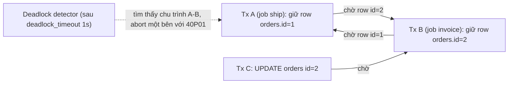
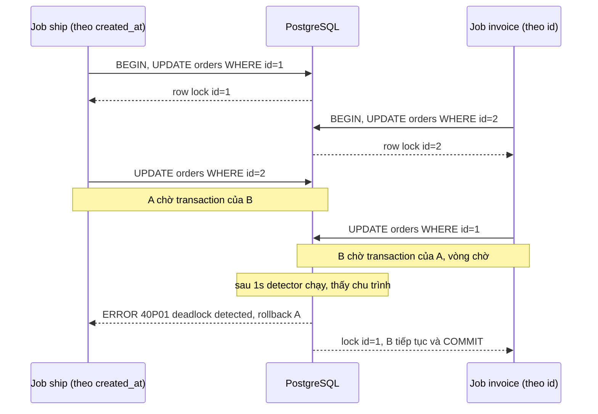
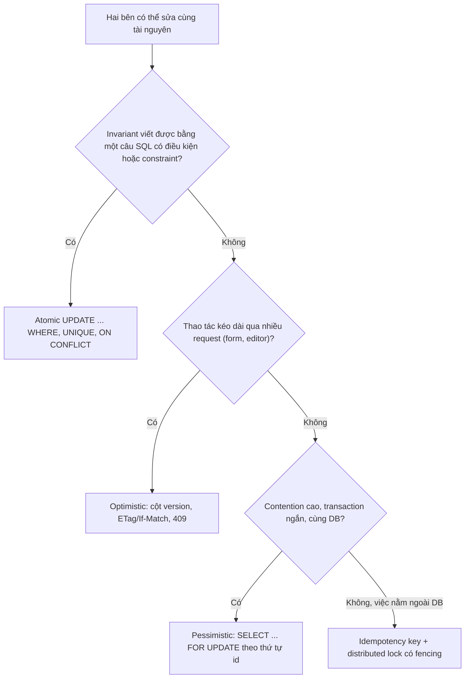

## Bối cảnh & vấn đề

Hai background job chạy mỗi 5 phút trên cùng bảng `orders`. Job "ship" cập nhật các đơn đã đóng gói theo thứ tự `created_at`; job "invoice" cập nhật các đơn đã thanh toán theo thứ tự `id`. Thỉnh thoảng một trong hai job chết với `ERROR: deadlock detected`, và vài đơn bị xử lý thiếu. Không ai thay đổi code gần đây; lỗi chỉ xuất hiện khi hai job trùng giờ và cùng đụng một tập đơn.

Cùng hệ thống, endpoint checkout thỉnh thoảng bán quá số hàng còn lại: sản phẩm còn 1 chiếc, hai khách cùng thanh toán thành công. Người review đề xuất "thêm một mutex quanh hàm `reserve`". Mutex đó chạy đúng ở máy dev (một process) và vô dụng trên production (8 pod).

Cả hai vấn đề thuộc cùng một chủ đề: **phối hợp nhiều bên cùng sửa một tài nguyên**. Làm thiếu phối hợp thì dữ liệu sai (oversell, lost update). Làm phối hợp bằng lock mà thiếu kỷ luật thì các bên **chờ nhau mãi mãi** (deadlock), hoặc bận rộn mà không tiến (livelock), hoặc một bên không bao giờ tới lượt (starvation). Bài này đi từ lý thuyết (điều kiện Coffman) tới công cụ cụ thể trên PostgreSQL, với output chạy thật trên PG 18.

**Interview angle:** câu oversell là câu debug phổ biến nhất của cả track. Interviewer muốn nghe hai fix ở tầng DB và nghe bạn gạt bỏ mutex trong memory.

## Khái niệm

### Deadlock và bốn điều kiện Coffman

**Deadlock** là trạng thái một nhóm bên (thread, transaction, process) **chờ nhau thành vòng tròn**, không bên nào tiến được. Năm 1971, Coffman và cộng sự chỉ ra deadlock chỉ xảy ra khi **đồng thời** có đủ bốn điều kiện:

1. **Mutual exclusion**: tài nguyên không chia sẻ được; tại một thời điểm chỉ một bên giữ (row lock ghi, mutex).
2. **Hold and wait**: một bên đang giữ tài nguyên này và chờ thêm tài nguyên khác.
3. **No preemption**: không ai có quyền giật tài nguyên khỏi bên đang giữ; chỉ bên giữ tự nhả.
4. **Circular wait**: tồn tại vòng chờ A chờ B, B chờ A (hoặc dài hơn: A chờ B, B chờ C, C chờ A).

Giá trị thực tế của danh sách này: bỏ được **một** điều kiện bất kỳ là deadlock **không thể** xảy ra. Ví dụ: transaction T1 khoá row đơn 1 rồi xin row đơn 2, T2 khoá row đơn 2 rồi xin row đơn 1: đủ cả bốn điều kiện.

### Phá từng điều kiện trong code ứng dụng

- **Circular wait** là điều kiện dễ phá nhất: mọi bên xin lock theo **cùng một thứ tự toàn cục** (ví dụ theo `id` tăng dần). Khi ai cũng xin đơn 1 trước đơn 2, bên tới sau chỉ **chờ**, không bao giờ tạo vòng.
- **Hold and wait**: xin **tất cả** lock một lần ở đầu (một câu `SELECT ... WHERE id = ANY($1) ORDER BY id FOR UPDATE`), hoặc giữ transaction ngắn tới mức không cần giữ lock này trong lúc chờ lock khác.
- **No preemption**: dùng **timeout** (`lock_timeout`, `NOWAIT`, `tryLock(timeout)`): chờ quá hạn thì tự bỏ cuộc, nhả những gì đang giữ, thử lại sau. Bộ phát hiện deadlock của DB thực chất là "preemption cưỡng bức": abort một transaction để phá vòng.
- **Mutual exclusion**: tránh lock hẳn, bằng thao tác atomic một câu, optimistic concurrency, hoặc cấu trúc không cần độc quyền (append-only, MVCC cho reader).

**Interview angle:** câu hỏi "điều kiện nào dễ phá nhất?" có đáp án chuẩn là circular wait qua lock ordering, cộng timeout như lưới an toàn.

### Livelock

**Livelock** là khi các bên **không bị chặn**, liên tục hành động, nhưng không bên nào tiến được. Ví dụ backend: hai worker cùng claim một job, phát hiện xung đột, cùng nhả ra và **retry ngay sau đúng 100 ms**, lại xung đột, lại nhả... mãi. Hay hai transaction optimistic cùng đọc version 7, cùng ghi, một bên thắng; bên thua retry ngay và lại đụng bên kia đang retry với cùng nhịp. CPU bận, log đầy, throughput bằng 0.

Cách chữa là **phá sự đồng bộ nhịp**: **exponential backoff có jitter** (thời gian chờ ngẫu nhiên). Trực giác toán học: nếu hai bên chờ một khoảng ngẫu nhiên đều trong `[0, T]`, xác suất chúng chọn gần như cùng thời điểm (trong một cửa sổ nhỏ `w`) xấp xỉ `2w/T`, và qua mỗi lần thử, xác suất va chạm liên tiếp giảm theo cấp số nhân. Còn với chờ cố định, xác suất va chạm lần sau là 1. Backoff lũy thừa (`T` gấp đôi mỗi lần) còn giảm tải cho hệ thống khi xung đột kéo dài.

### Starvation

**Starvation** là khi hệ thống tổng thể vẫn tiến, nhưng **một bên** không bao giờ tới lượt. Ví dụ: hàng đợi ưu tiên luôn có job priority cao, job priority thấp nằm đó hàng ngày; một tenant lớn đẩy 1 triệu job import vào hàng FIFO chung và job của mọi tenant khác chờ hàng giờ; một reader-writer lock ưu tiên reader khiến writer không bao giờ lấy được lock khi reader liên tục tới. Chữa bằng **fairness**: aging (tăng ưu tiên theo thời gian chờ), fair queuing theo tenant, quota, hoặc lock có hàng đợi FIFO. Bài [distributed coordination](/tracks/os-concurrency/learn/distributed-locks-idempotency) thiết kế limiter theo tenant để chống đúng loại này.

### Pessimistic locking

**Pessimistic locking** giả định xung đột sẽ xảy ra nên **khoá trước khi sửa**. Trong Postgres: `SELECT ... FOR UPDATE` (hoặc `FOR NO KEY UPDATE` khi không đổi key) bên trong transaction. Transaction khác muốn khoá hoặc sửa cùng row sẽ **chờ** tới khi bên giữ commit/rollback; `SELECT` thường không bị chặn nhờ MVCC.

Ưu điểm: đơn giản, đúng ngay lần đầu, không cần retry trong trường hợp bình thường. Nhược điểm: giảm throughput trên row nóng (mọi người xếp hàng), có thể deadlock nếu khoá nhiều row không theo thứ tự, và nguy hiểm nhất là **giữ lock qua network call**: gọi payment gateway 3 giây trong lúc giữ `FOR UPDATE` nghĩa là mọi request khác trên row đó chờ 3 giây, và connection DB bị chiếm suốt thời gian đó. Hợp với **contention cao, xung đột đắt, transaction ngắn**.

### Optimistic concurrency control

**Optimistic concurrency control (OCC)** giả định xung đột hiếm nên **không khoá khi đọc**, chỉ **kiểm tra lúc ghi** rằng không ai đã đổi dữ liệu từ lúc mình đọc. Cách phổ biến: cột `version` (số nguyên) tăng mỗi lần ghi:

```sql
UPDATE orders SET status = 'paid', version = version + 1
WHERE id = $1 AND version = $2;   -- $2 là version đã đọc
```

`rowCount = 1`: không ai chen vào, ghi thành công. `rowCount = 0`: ai đó đã đổi, **conflict**; app đọc lại và quyết định (retry tự động nếu thao tác có thể tính lại, hoặc báo user "dữ liệu đã bị người khác sửa"). Trên HTTP, OCC map tự nhiên vào `ETag` + `If-Match`, trả `409 Conflict` hoặc `412 Precondition Failed`.

OCC hợp với **contention thấp** và thao tác **kéo dài qua nhiều request** (user mở form 5 phút rồi mới lưu, không thể giữ transaction mở 5 phút). Dưới contention cao (flash sale, 500 request/giây trên một row), phần lớn request conflict và retry, lãng phí công sức và có thể thành livelock.

### Atomic conditional update

Nhiều khi lựa chọn tốt nhất không phải pessimistic hay optimistic mà là **một câu lệnh atomic** đẩy cả phép kiểm tra lẫn phép tính vào DB:

```sql
UPDATE products SET stock = stock - $1
WHERE id = $2 AND stock >= $1;   -- rowCount = 1: đặt được; 0: hết hàng
```

DB khoá row trong vài mili-giây của câu lệnh, và ở `READ COMMITTED`, transaction thứ hai chờ row lock rồi **đánh giá lại `WHERE`** trên version mới nhất của row (chi tiết cơ chế ở bài [SQL: locking & concurrency](/tracks/sql-postgres/learn/locking-concurrency)). Một round-trip, không deadlock với một row, không cần retry. Thêm `CHECK (stock >= 0)` làm lưới an toàn: nếu có đường code nào đó quên điều kiện, DB từ chối thay vì để số âm.

### Deadlock detection trong PostgreSQL

Postgres không kiểm tra deadlock mỗi khi một transaction phải chờ lock (tốn kém). Một transaction chờ lock quá **`deadlock_timeout`** (mặc định **1 giây**) mới kích hoạt bộ phát hiện, duyệt **wait-for graph** tìm chu trình. Nếu có, **một** transaction trong vòng bị abort với SQLSTATE **`40P01` (`deadlock_detected`)**; docs nói không nên dựa vào việc đoán bên nào bị chọn. Các bên còn lại tiếp tục bình thường.

Hệ quả cho code ứng dụng: deadlock **không thể loại trừ 100%** trong hệ thống thật (đường code mới, migration, thao tác tay), nên mọi transaction có thể dính `40P01` (và `40001` `serialization_failure` ở `REPEATABLE READ`/`SERIALIZABLE`) phải được **retry toàn bộ** transaction với backoff có jitter. Bật `log_lock_waits = on` để log các lần chờ lâu hơn `deadlock_timeout` dù chưa thành deadlock: đó là tín hiệu sớm.

### Chọn giữa DB lock, Redis lock và idempotency

Khi hai bên có thể sửa cùng một tài nguyên, câu hỏi senior không phải "dùng lock gì" mà là "**cần đảm bảo gì**": đúng một hiệu ứng (exactly-once effect) hay chỉ giảm trùng lặp? Thứ tự ưu tiên hợp lý:

1. **Đúng ở nơi dữ liệu sống**: constraint, conditional update, transaction ngắn trong DB. Không có lớp lock thứ hai để hỏng.
2. **Idempotency**: unique key, upsert, bảng dedupe biến "chạy hai lần" thành vô hại. Tốt nhất cho retry, message at-least-once, webhook.
3. **Pessimistic DB lock** khi logic nhiều bước ở app cần độc quyền trong thời gian ngắn.
4. **Redis/distributed lock** khi cần điều phối công việc **nằm ngoài DB** (gọi API bên thứ ba, job dài), và chấp nhận nó là best-effort trừ khi có fencing token (bài [distributed locks & idempotency](/tracks/os-concurrency/learn/distributed-locks-idempotency)).

## Cơ chế hoạt động

### Wait-for graph



Mỗi node là một transaction, mỗi cạnh "X chờ Y" nghĩa là X cần lock mà Y đang giữ. Deadlock tương đương **chu trình** trong đồ thị này. Tx C cũng đang chờ nhưng không nằm trên chu trình, nên nó không phải nạn nhân: khi chu trình bị phá (một trong A/B bị abort và nhả lock), C sẽ tiến lên. Bộ phát hiện chỉ chạy khi có transaction chờ quá 1 giây, nên deadlock luôn tốn ít nhất khoảng 1 giây latency trước khi được giải.

### Hai job khoá theo thứ tự ngược nhau



Đây là đúng kịch bản tái hiện ở phần ví dụ. Không job nào "sai" khi đứng một mình; lỗi nằm ở chỗ hai đường code khoá cùng tập row theo **thứ tự khác nhau** (một theo `created_at`, một theo `id`). Fix gốc: mọi đường code khoá theo cùng một thứ tự, ví dụ `ORDER BY id FOR UPDATE` ở đầu transaction. Fix phụ: batch nhỏ hơn và transaction ngắn hơn (giảm xác suất chồng nhau), không gọi network trong transaction, và retry khi gặp `40P01`.

### Chọn cơ chế phối hợp



Luôn bắt đầu từ nhánh trên cùng: phần lớn bài toán "trừ kho, dùng coupon, tăng counter, tạo nếu chưa có" rơi vào đó và được giải bằng một câu lệnh. Chỉ khi logic cần nhiều bước ở app mới đi xuống các nhánh dưới. Nhánh cuối (việc ngoài DB như gọi payment provider) luôn cần idempotency, vì không lock nào đảm bảo được "đúng một lần" khi có timeout và retry.

## Ví dụ thực tế

### Tái hiện deadlock giữa hai job trên PostgreSQL 18

```bash
docker run -d --rm --name pg -e POSTGRES_PASSWORD=pw -p 55439:5432 postgres:18-alpine
export PGPASSWORD=pw
P() { psql -h localhost -p 55439 -U postgres -X -q "$@"; }
P -c "CREATE TABLE orders(id int PRIMARY KEY, status text);
      INSERT INTO orders SELECT g, 'pending' FROM generate_series(1, 10) g;"

# job A khoá 1 rồi 2, job B khoá 2 rồi 1
( P -c "BEGIN; UPDATE orders SET status='shipped' WHERE id=1; SELECT pg_sleep(0.5);
        UPDATE orders SET status='shipped' WHERE id=2; COMMIT;" 2>&1 | sed 's/^/[job A] /' ) &
( sleep 0.1; P -c "BEGIN; UPDATE orders SET status='invoiced' WHERE id=2; SELECT pg_sleep(0.5);
        UPDATE orders SET status='invoiced' WHERE id=1; COMMIT;" 2>&1 | sed 's/^/[job B] /' ) &
wait
P -c "SELECT id, status FROM orders WHERE id IN (1, 2) ORDER BY id"
```

Output thật (PostgreSQL 18.6, đã lược dòng kết quả của `pg_sleep`):

```text
[job A] ERROR:  deadlock detected
[job A] DETAIL:  Process 75 waits for ShareLock on transaction 755; blocked by process 77.
[job A] Process 77 waits for ShareLock on transaction 754; blocked by process 75.
[job A] HINT:  See server log for query details.
[job A] CONTEXT:  while updating tuple (0,2) in relation "orders"
 id |  status
----+----------
  1 | invoiced
  2 | invoiced
(2 rows)
```

Job A bị chọn làm nạn nhân: toàn bộ transaction của nó (kể cả update đơn 1) bị rollback, và job B hoàn tất. `DETAIL` cho biết hai process chờ nhau trên `ShareLock` của **transaction id** đối phương: đó là cách Postgres biểu diễn "chờ row lock", vì row lock nằm trong tuple header và muốn chờ nó thì phải chờ transaction đang giữ kết thúc. `CONTEXT` chỉ đúng tuple bị tranh chấp. Server log (với `log_lock_waits = on`) còn ghi câu SQL của cả hai bên, thông tin đầu tiên cần thu thập khi điều tra.

### Sửa bằng thứ tự khoá cố định

```bash
( P -c "BEGIN; SELECT id FROM orders WHERE id IN (2,1) ORDER BY id FOR UPDATE; SELECT pg_sleep(0.5);
        UPDATE orders SET status='shipped' WHERE id IN (1,2); COMMIT;" -c "\echo job A committed" ) &
( sleep 0.1; P -c "BEGIN; SELECT id FROM orders WHERE id IN (1,2) ORDER BY id FOR UPDATE;
        UPDATE orders SET status='invoiced' WHERE id IN (1,2); COMMIT;" -c "\echo job B committed" ) &
wait
```

Output thật (lọc chỉ dòng lỗi và dòng commit):

```text
[job B] job B committed
[job A] job A committed
```

Cả hai commit, không lỗi. Job B chờ ở câu `SELECT ... FOR UPDATE` cho tới khi A commit, rồi mới lấy được lock đơn 1 và 2. (Thứ tự hai dòng in ra phản ánh thứ tự pipe flush của shell, không phải thứ tự commit.) Tại sao dùng `SELECT ... ORDER BY id FOR UPDATE` thay vì chỉ `UPDATE ... WHERE id IN (...)`? Thứ tự một câu `UPDATE` khoá các row phụ thuộc vào plan (index scan hay seq scan), **không được đảm bảo**; `SELECT ... ORDER BY ... FOR UPDATE` khoá theo thứ tự row được trả về.

### Oversell: atomic update, CHECK constraint và optimistic version

```sql
CREATE TABLE products (id int PRIMARY KEY, stock int CHECK (stock >= 0));
INSERT INTO products VALUES (101, 1);

UPDATE products SET stock = stock - 1 WHERE id = 101 AND stock >= 1 RETURNING stock;  -- khách 1
UPDATE products SET stock = stock - 1 WHERE id = 101 AND stock >= 1 RETURNING stock;  -- khách 2
UPDATE products SET stock = stock - 1 WHERE id = 101;                                 -- code quên điều kiện
```

Output thật:

```text
 stock
-------
     0
(1 row)

UPDATE 1
 stock
-------
(0 rows)

UPDATE 0
ERROR:  new row for relation "products" violates check constraint "products_stock_check"
DETAIL:  Failing row contains (101, -1).
```

Khách 1 được `UPDATE 1`, khách 2 được `UPDATE 0` (app đọc `rowCount === 0` và trả "hết hàng"). Câu thứ ba mô phỏng một đường code khác quên điều kiện: `CHECK` chặn lại thay vì để stock âm. Đó là hai lớp: điều kiện trong `WHERE` là cơ chế chính, constraint là lưới an toàn. Code TypeScript tương ứng:

```ts
async function reserve(productId: string, qty: number): Promise<void> {
  const r = await pool.query(
    'UPDATE products SET stock = stock - $1 WHERE id = $2 AND stock >= $1',
    [qty, productId],
  );
  if (r.rowCount !== 1) throw new OutOfStockError(productId);
}
```

Optimistic locking với cột `version` trên cùng dữ liệu:

```sql
ALTER TABLE orders ADD COLUMN version int NOT NULL DEFAULT 1;
UPDATE orders SET status = 'paid',      version = version + 1 WHERE id = 3 AND version = 1;  -- người 1
UPDATE orders SET status = 'cancelled', version = version + 1 WHERE id = 3 AND version = 1;  -- người 2, version cũ
```

```text
ALTER TABLE
UPDATE 1
UPDATE 0
```

Người thứ hai nhận `UPDATE 0`: bản ghi đã sang version 2. Với form trên UI, trả `409 Conflict` kèm dữ liệu mới nhất để user so sánh và quyết định, thay vì ghi đè im lặng (lost update).

### Không chờ vô hạn: lock_timeout và NOWAIT

```bash
P -c "BEGIN; SELECT * FROM orders WHERE id=5 FOR UPDATE; SELECT pg_sleep(2); COMMIT;" >/dev/null &
sleep 0.3
P -c "SET lock_timeout = '500ms'; UPDATE orders SET status='x' WHERE id=5;"
P -c "SELECT id FROM orders WHERE id=5 FOR UPDATE NOWAIT;"
```

Output thật:

```text
ERROR:  canceling statement due to lock timeout
CONTEXT:  while updating tuple (0,5) in relation "orders"
ERROR:  could not obtain lock on row in relation "orders"
```

Cả hai trả SQLSTATE `55P03` (`lock_not_available`). `lock_timeout` là cách phá điều kiện "no preemption" ở mức từng câu lệnh: thay vì chờ mãi sau một transaction treo, request thất bại nhanh và có thể retry hoặc trả lỗi rõ ràng. Đặt giá trị ngắn (vài giây) cho request thường; rất ngắn cho migration DDL.

### Retry toàn bộ transaction khi 40P01/40001

```ts
import { Pool, type PoolClient } from 'pg';
const pool = new Pool({ max: 20 });
const RETRYABLE = new Set(['40P01', '40001']);     // deadlock_detected, serialization_failure
const sleep = (ms: number) => new Promise<void>((r) => setTimeout(r, ms));

export async function withTx<T>(fn: (c: PoolClient) => Promise<T>, attempts = 4): Promise<T> {
  for (let i = 1; ; i++) {
    const c = await pool.connect();
    try {
      await c.query('BEGIN');
      await c.query("SET LOCAL lock_timeout = '3s'");
      const out = await fn(c);                     // MỌI lần đọc và ghi nằm trong fn
      await c.query('COMMIT');
      return out;
    } catch (e) {
      await c.query('ROLLBACK').catch(() => {});
      const code = (e as { code?: string }).code;
      if (code && RETRYABLE.has(code) && i < attempts) {
        await sleep(Math.random() * 50 * 2 ** i);  // "full jitter": ngẫu nhiên trong [0, 50·2^i) ms
        continue;
      }
      throw e;
    } finally {
      c.release();
    }
  }
}
```

Đoạn code này không có output riêng; nó là helper dùng lại cho các ví dụ trên. Ba điểm quyết định: retry **cả transaction** (transaction đã rollback, retry riêng câu lỗi là sai); mọi lần **đọc** cũng nằm trong `fn` để lần retry đọc dữ liệu mới; và **full jitter** chọn thời gian chờ ngẫu nhiên trong khoảng tăng lũy thừa, để các transaction vừa đụng nhau không đụng lại cùng nhịp (chống livelock). Side effect ngoài DB (gửi email, gọi payment) không được nằm trong `fn`, vì chúng sẽ lặp lại khi retry; đưa chúng ra sau commit, qua outbox.

### Deadlock không cần database

Deadlock là khái niệm chung, không riêng DB. Hai async mutex trong một process Node, xin theo thứ tự ngược nhau:

```ts
// deadlock.ts
const sleep = (ms: number) => new Promise<void>((r) => setTimeout(r, ms));

class Mutex {
  #locked = false;
  #waiters: (() => void)[] = [];
  readonly name: string;
  constructor(name: string) { this.name = name; }
  // chờ tối đa timeoutMs: phá điều kiện "chờ vô hạn"
  async lock(timeoutMs: number): Promise<() => void> {
    if (this.#locked) {
      await new Promise<void>((resolve, reject) => {
        const w = () => { clearTimeout(t); resolve(); };
        const t = setTimeout(() => {
          this.#waiters.splice(this.#waiters.indexOf(w), 1);
          reject(new Error(`timeout chờ ${this.name}`));
        }, timeoutMs);
        this.#waiters.push(w);
      });
    }
    this.#locked = true;
    return () => { const next = this.#waiters.shift(); if (next) next(); else this.#locked = false; };
  }
}

const accounts = { A: new Mutex('A'), B: new Mutex('B') };
type Id = keyof typeof accounts;

async function transfer(label: string, from: Id, to: Id, ordered: boolean) {
  const [first, second] = ordered ? ([from, to].sort() as Id[]) : [from, to];
  const r1 = await accounts[first].lock(300);
  try {
    await sleep(20);                                  // đọc số dư, gọi DB...
    const r2 = await accounts[second].lock(300);      // giữ first, chờ second: hold-and-wait
    try { await sleep(20); return `${label}: OK`; } finally { r2(); }
  } finally { r1(); }
}

for (const ordered of [false, true]) {
  const out = await Promise.allSettled([transfer('T1 A→B', 'A', 'B', ordered), transfer('T2 B→A', 'B', 'A', ordered)]);
  console.log(`ordered=${ordered}:`, out.map((o) => (o.status === 'fulfilled' ? o.value : (o.reason as Error).message)));
}
```

Output thật (Node 24.21):

```text
ordered=false: [ 'timeout chờ B', 'T2 B→A: OK' ]
ordered=true: [ 'T1 A→B: OK', 'T2 B→A: OK' ]
```

Không có thứ tự: T1 giữ A chờ B, T2 giữ B chờ A. Timeout 300 ms đóng vai "deadlock detector": T1 bỏ cuộc, nhả A, T2 hoàn tất; đúng hành vi của Postgres, chỉ là do ta tự cài. Có thứ tự (sort theo tên): cả hai xin A trước B, T2 chỉ phải chờ, không có vòng, cả hai thành công.

## Trade-offs & lựa chọn thay thế

| Cách | Lock giữ bao lâu | Round-trip | Contention cao | Deadlock | Hợp với |
|---|---|---|---|---|---|
| Atomic conditional UPDATE | Vài ms trong một câu | 1 | Tốt nhất | Không với một row | Trừ kho, coupon, counter, chuyển trạng thái |
| Pessimistic `FOR UPDATE` | Cả transaction | 2+ | Ổn nếu transaction ngắn | Có, nếu không theo thứ tự | Logic nhiều bước ở app, cùng DB |
| Optimistic `version` | Không giữ | 1 khi ghi | Kém (retry storm, livelock) | Không | Form/UI lâu, REST với ETag |
| `SERIALIZABLE` + retry | Không thêm lock (SSI) | Như thường | Kém (nhiều `40001`) | Không kiểu cổ điển | Invariant nhiều row (write skew) |
| Mutex trong memory | Tuỳ code | 0 | Tốt | Có | Chỉ một process; **không** cho dữ liệu dùng chung giữa pod |
| Redis lock | TTL | 1–2 | Tốt | Hiếm (có TTL) | Điều phối việc ngoài DB, best-effort |

Mặc định chọn atomic conditional update khi logic diễn đạt được bằng SQL. Chuyển sang `FOR UPDATE` khi cần đọc nhiều thứ rồi quyết định ở app, và giữ transaction ngắn, khoá theo thứ tự id. Chọn optimistic khi user "cầm" dữ liệu qua nhiều request. Với row cực nóng (một SKU nhận hàng nghìn request/giây), mọi loại lock đều xếp hàng tuần tự; lời giải nằm ở thiết kế: chia stock thành nhiều row bucket, đặt chỗ trong Redis bằng `DECR` rồi ghi DB bất đồng bộ, hoặc xếp request vào hàng đợi.

## Edge cases & failure modes

- **Missing index mở rộng phạm vi lock**: ở Postgres, `UPDATE ... WHERE customer_id = $1` không có index vẫn chỉ khoá row thoả điều kiện, nhưng seq scan làm câu lệnh (và transaction) dài hơn nhiều, tăng thời gian giữ lock và xác suất chồng nhau. Ở MySQL InnoDB (`REPEATABLE READ`) hay SQL Server, quét không có index có thể khoá mọi row/range đã quét, biến tranh chấp một row thành tranh chấp cả bảng (verify theo engine và isolation level). FK không có index ở bảng con làm `DELETE` cha phải quét bảng con.
- **Deadlock qua foreign key**: insert con lấy `FOR KEY SHARE` trên row cha; hai transaction insert con cho cha A và B rồi update cha theo thứ tự ngược nhau sẽ deadlock. Thứ tự khoá phải tính cả row cha.
- **Lock giữ qua network call**: `FOR UPDATE` rồi gọi HTTP 5 giây; upstream chậm lên 30 giây thì mọi request trên row đó chờ 30 giây và pool connection cạn.
- **Retry không idempotent**: retry cả transaction sau `40P01` là đúng, nhưng nếu trong đó có gửi email hay trừ tiền ở provider, side effect bị lặp.
- **Retry không có jitter**: hàng trăm request cùng retry sau đúng 100 ms tạo sóng tải và có thể livelock.
- **Optimistic trên row nóng**: tỷ lệ conflict tăng theo tải, throughput thực giảm trong khi CPU tăng; theo dõi tỷ lệ `rowCount = 0`.
- **Starvation do ưu tiên**: job ưu tiên thấp không bao giờ chạy trong giờ cao điểm; thêm aging hoặc slot dành riêng.
- **Timeout che giấu deadlock**: `lock_timeout` quá ngắn biến deadlock thành lỗi timeout rải rác, khó nhận ra đó là vấn đề thứ tự khoá. Log cả hai loại lỗi với câu SQL.

## Pitfalls

- ❌ Đọc stock rồi ghi `stock = $computed` → ✅ `SET stock = stock - $1 WHERE stock >= $1`, kiểm tra `rowCount`, thêm `CHECK (stock >= 0)`.
- ❌ Mutex trong memory quanh `reserve()` → ✅ nó không có tác dụng giữa các pod; phối hợp phải ở DB.
- ❌ Nghĩ `BEGIN ... COMMIT` tự chống oversell → ✅ ở `READ COMMITTED`, `SELECT` thường không khoá gì; transaction cho atomicity, không cho loại trừ lẫn nhau.
- ❌ Khoá nhiều row theo thứ tự tuỳ ý (thứ tự item trong giỏ, thứ tự `created_at`) → ✅ `SELECT ... WHERE id = ANY($1) ORDER BY id FOR UPDATE` ở mọi đường code.
- ❌ Retry ngay lập tức với khoảng cố định → ✅ exponential backoff + full jitter, giới hạn số lần.
- ❌ Chỉ retry câu lệnh bị `40P01` → ✅ retry cả transaction từ đầu, gồm cả các lần đọc.
- ❌ Dùng optimistic locking cho flash sale → ✅ atomic update, hoặc thiết kế lại (bucket, đặt chỗ trong Redis, hàng đợi).
- ❌ Chọn cơ chế trước khi nói rõ đảm bảo cần có → ✅ hỏi "cần exactly-once effect hay chỉ giảm trùng?", rồi ưu tiên DB constraint và idempotency trước lock.

## Tóm tắt

- Deadlock cần đủ bốn điều kiện Coffman: mutual exclusion, hold and wait, no preemption, circular wait; phá một là hết.
- Trong app: phá circular wait bằng thứ tự khoá cố định (theo id), phá chờ vô hạn bằng `lock_timeout`/`NOWAIT`, tránh lock bằng thao tác atomic.
- Livelock: bận mà không tiến, thường do retry cùng nhịp; chữa bằng exponential backoff có jitter. Starvation: một bên không tới lượt; chữa bằng fairness, aging, quota.
- Pessimistic (`FOR UPDATE`) cho contention cao và transaction ngắn; optimistic (`version`) cho contention thấp và thao tác kéo dài; atomic conditional update thường là tốt nhất.
- Oversell: read-modify-write không atomic; fix bằng `UPDATE ... WHERE stock >= $1` + `rowCount`, hoặc `FOR UPDATE`, cộng `CHECK (stock >= 0)`. Mutex trong memory là red flag.
- Postgres phát hiện deadlock sau `deadlock_timeout` (1 s), abort một bên với `40P01`; code phải retry cả transaction, bật `log_lock_waits`.
- Chọn cơ chế theo đảm bảo cần có: DB constraint/conditional update trước, idempotency cho retry, DB lock cho logic nhiều bước, Redis lock cho việc ngoài DB.
