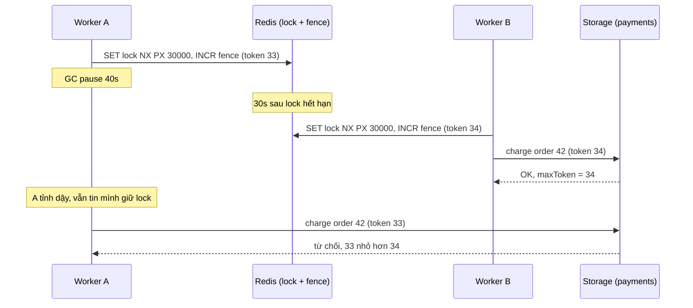
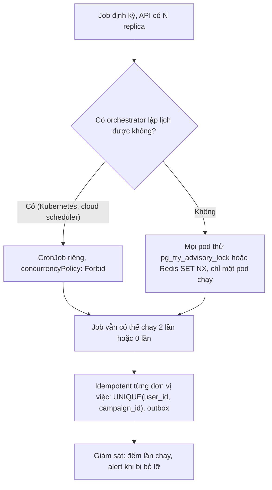
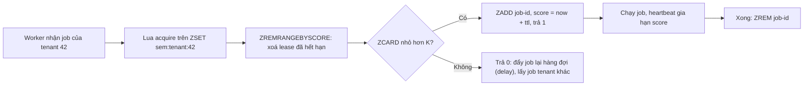

## Bối cảnh & vấn đề

Một service xử lý thanh toán đọc job từ queue và, để chắc chắn không xử lý trùng, lấy một Redis lock cho mỗi đơn: `SET lock:order:42 <token> NX PX 30000`. Nó chạy ổn nhiều tháng. Rồi một hôm, worker A lấy lock đơn 42 và bị một **stop-the-world GC pause 40 giây** (heap gần đầy, máy bị swap). Sau 30 giây, lock hết hạn. Queue giao lại job cho worker B (vì A không ack kịp), B lấy lock thành công và charge thẻ khách. Mười giây sau A tỉnh dậy, **vẫn tin mình đang giữ lock**, và charge thêm một lần nữa. Khách bị trừ tiền hai lần. Lock không hề "hỏng": nó làm đúng những gì một lock dựa trên thời gian có thể làm.

Cùng tuần, một đội khác scale API từ 1 lên 3 pod để chịu tải. Sáng hôm sau, mỗi khách hàng nhận **ba** email báo cáo tuần. Nguyên nhân: cron `node-cron` chạy **bên trong** API, và giờ có ba bản.

Đây là lãnh thổ của **distributed coordination**: phối hợp giữa nhiều process trên nhiều máy, nơi không có memory dùng chung, đồng hồ lệch nhau, mạng chậm bất thường và process có thể dừng bất kỳ lúc nào. Bài [race condition](/tracks/os-concurrency/learn/race-conditions-async) và bài [deadlock & DB locking](/tracks/os-concurrency/learn/deadlock-db-locking) đã cho công cụ trong một process và trong DB. Bài này cho công cụ khi phải vượt ra ngoài, và quan trọng hơn, cho biết **giới hạn** của chúng.

**Interview angle:** câu GC pause 40 giây là bài kiểm tra xem bạn có biết "lock dựa trên TTL không đảm bảo mutual exclusion" và biết fencing token hoặc idempotency là lời giải thật.

## Khái niệm

### Distributed lock và lease

**Distributed lock** là lock mà nhiều process trên nhiều máy cùng tôn trọng, thường được lưu ở một dịch vụ chung (Redis, DB, ZooKeeper, etcd). Khác với mutex trong memory, nó phải xử lý một câu hỏi khó: **holder chết thì sao?** Nếu process giữ lock bị kill, lock không bao giờ được nhả và mọi người chờ mãi.

Lời giải phổ biến là **lease**: lock kèm **thời hạn** (TTL). Holder phải làm xong (hoặc gia hạn) trước khi lease hết; hết hạn thì lock tự nhả, người khác lấy được. Lease giải được "holder chết", nhưng đổi lấy một vấn đề mới: hệ thống **không phân biệt được** holder đã chết hay chỉ đang chậm. GC pause, VM bị migrate, network partition, CPU throttling: holder có thể "biến mất" 40 giây rồi quay lại, không hề biết lease đã hết.

### Redis lock với SET NX PX

Cách làm chuẩn trên một Redis instance:

- **Acquire**: `SET lock:order:42 <random-token> NX PX 30000`. `NX` chỉ set khi key **chưa tồn tại** (atomic check-and-set), `PX 30000` đặt TTL 30 giây trong cùng lệnh. Trả `OK` là lấy được, `nil` là người khác đang giữ. Token ngẫu nhiên (UUID) định danh holder.
- **Release**: xoá key **chỉ khi** giá trị vẫn là token của mình, bằng một script Lua (chạy atomic trên Redis). Không dùng `DEL` thẳng: nếu lease của bạn đã hết và người khác đã lấy lock, `DEL` sẽ xoá lock **của họ**.
- **Gia hạn** (watchdog): tác vụ dài thì định kỳ `PEXPIRE` nếu token còn khớp (cũng bằng Lua), trước khi hết hạn.

Hai lệnh `SETNX` rồi `EXPIRE` riêng lẻ là lỗi cổ điển: process chết giữa hai lệnh thì lock không bao giờ hết hạn.

### Failure modes của lock dựa trên TTL

- **Pause dài hơn TTL**: GC, swap, VM pause, `SIGSTOP`. Holder tỉnh dậy và tiếp tục ghi như thể vẫn giữ lock. Watchdog gia hạn không cứu được: trong lúc pause, chính watchdog cũng bị dừng.
- **Network chậm**: holder kiểm tra "còn giữ lock" rồi gửi lệnh ghi; gói tin nằm trong mạng 20 giây, tới nơi khi lock đã thuộc người khác. Không có "kiểm tra lock ngay trước khi ghi" nào là đủ, vì luôn có khoảng hở giữa kiểm tra và ghi.
- **Redis failover**: replication của Redis là **bất đồng bộ**. Holder lấy lock trên primary, primary chết trước khi replicate key, replica được promote không có key đó, và người thứ hai lấy được lock.
- **Clock**: Redis tính TTL theo đồng hồ của nó; nếu đồng hồ nhảy (chỉnh tay, NTP step), lease có thể hết sớm.

Kết luận quan trọng: lock phân tán dựa trên thời gian là **tối ưu hoá hiệu năng** (giảm công việc trùng lặp), **không phải** cơ chế đảm bảo tính đúng đắn, trừ khi storage đích tham gia kiểm tra.

### Fencing token

**Fencing token** là một **số tăng dần** được cấp mỗi lần có người lấy lock (ví dụ `INCR` trên Redis, hoặc một sequence trong DB). Holder gửi kèm token trong **mọi lệnh ghi** tới storage đích, và storage **từ chối** mọi lệnh có token nhỏ hơn token lớn nhất nó đã thấy. Worker A lấy token 33, bị pause; worker B lấy token 34 và ghi; A tỉnh dậy ghi với token 33: bị từ chối.

Fencing chuyển trách nhiệm đảm bảo từ lock service sang **nơi dữ liệu được ghi**, nơi duy nhất có thể biết chắc thứ tự. Điều kiện là storage đích phải hỗ trợ kiểm tra này: với DB của bạn, một cột `fence_token` và `UPDATE ... WHERE fence_token < $token`; với API bên thứ ba thì thường không có, và lúc đó lời giải là **idempotency**.

### Redlock và tranh luận xung quanh nó

**Redlock** là thuật toán do tác giả Redis đề xuất: lấy lock trên **đa số** N Redis instance độc lập (ví dụ 3 trên 5) trong thời gian ngắn hơn TTL, để chịu được một vài instance chết. Martin Kleppmann phản biện (2016) hai điểm: Redlock **dựa trên giả định thời gian** (độ lệch đồng hồ, độ trễ mạng, pause có giới hạn), những giả định mà hệ thống thật vi phạm; và nó **không cấp fencing token**, nên không chặn được holder "zombie" sau pause. Tác giả Redis phản hồi rằng các giả định đó hợp lý trong thực tế. Góc nhìn thực dụng: Redlock giảm rủi ro failover so với một instance, nhưng **không giải** bài toán GC pause; muốn đúng tuyệt đối vẫn cần fencing hoặc idempotency.

**Interview angle:** "Vì sao Redlock không tự giải được bài toán GC pause?" Vì vấn đề không nằm ở việc lock service có đồng thuận hay không, mà ở chỗ holder không biết lease đã hết; chỉ storage đích (fencing) hoặc thiết kế idempotent chặn được lệnh ghi muộn.

### PostgreSQL advisory lock

Nếu dữ liệu đã nằm trong Postgres, **advisory lock** thường tốt hơn Redis lock: lock trên một số `bigint` do ứng dụng tự đặt nghĩa, gắn với **session hoặc transaction**. Hai điểm mạnh so với Redis: lock gắn với **connection**, nên process chết thì connection đóng và lock tự nhả, không cần TTL đoán mò; và bản transaction-level (`pg_advisory_xact_lock`, `pg_try_advisory_xact_lock`) tự nhả khi commit/rollback, nằm cùng transaction với dữ liệu nó bảo vệ. Hạn chế: transaction mở lâu giữ lock và giữ xmin horizon (ảnh hưởng VACUUM); session lock không dùng được sau PgBouncer ở transaction mode (xem bài [SQL: locking & concurrency](/tracks/sql-postgres/learn/locking-concurrency)); và nó vẫn không chặn được lệnh ghi tới hệ thống **ngoài** Postgres sau khi connection đã mất.

### Idempotency

Một thao tác **idempotent** khi thực hiện nhiều lần cho cùng kết quả như một lần. Thay vì cố đảm bảo "chỉ chạy một lần" (điều không thể trong hệ thống phân tán có timeout và retry), ta làm cho "chạy hai lần" trở nên **vô hại**. Các kỹ thuật:

- **Unique constraint**: `payments(order_id) UNIQUE`; lần ghi thứ hai lỗi `23505` và code coi như "đã làm rồi".
- **Upsert / insert-if-absent**: `INSERT ... ON CONFLICT DO NOTHING`.
- **Bảng dedupe / idempotency key**: client gửi header `Idempotency-Key`, server lưu key cùng response; request lặp lại nhận đúng response cũ.
- **Idempotency key của provider**: payment provider lớn nhận idempotency key và tự dedupe; truyền `order_id` làm key nghĩa là dù bạn gọi hai lần, khách chỉ bị charge một lần.
- **State machine**: chỉ chuyển `pending → paid` nếu trạng thái hiện tại là `pending` (lại là conditional update).

Với message queue at-least-once, webhook, cron, và mọi retry, idempotency là tuyến phòng thủ **chính**; lock chỉ giảm tần suất trùng lặp.

### Cron trên nhiều replica

Scheduler trong process (`node-cron`, `setInterval`) chạy ở **mọi** replica: N pod thì job chạy N lần. Ba hướng sửa, thường kết hợp:

- **Một nơi lập lịch**: Kubernetes **CronJob** tạo một Job mỗi lần tới lịch; hoặc scheduler của cloud; hoặc một worker deployment `replicas: 1` (nhưng khi rolling update, pod cũ và mới có thể chồng nhau vài giây). Kubernetes docs nói rõ CronJob tạo Job "khoảng một lần" mỗi lịch: trong một số trường hợp có thể tạo **hai** hoặc **không** tạo Job nào, nên job phải idempotent. `concurrencyPolicy: Forbid` bỏ qua lần chạy mới nếu lần trước chưa xong; `Replace` huỷ lần cũ; mặc định `Allow` cho chạy chồng.
- **Leader election / lock trước khi chạy**: mọi pod cùng thử `pg_try_advisory_lock(<job-id>)` hoặc Redis `SET NX`; chỉ pod lấy được mới chạy, các pod khác bỏ qua.
- **Idempotent ở từng đơn vị việc**: bảng `email_sends(user_id, campaign_id) UNIQUE`; job chạy hai lần thì lần hai insert trùng và bỏ qua. Đây là lớp bảo vệ **bắt buộc** bất kể chọn hướng nào ở trên.

### Limiter theo tenant (distributed semaphore)

Hệ thống multi-tenant có một hàng đợi job chung và 20 worker pod. Một tenant lớn đẩy 1 triệu job import, chiếm hết worker hàng giờ, job của tenant khác chờ: **starvation**. Cần giới hạn "mỗi tenant tối đa K job đồng thời trên toàn cluster".

Một **distributed semaphore** với lease trên Redis: mỗi tenant một sorted set (ZSET), member là job id, score là thời điểm lease hết hạn. Acquire (bằng Lua, atomic): xoá các lease đã hết hạn, nếu số phần tử còn lại nhỏ hơn K thì thêm job vào và trả 1, ngược lại trả 0. Release: `ZREM`. Worker chết giữa chừng: lease tự hết hạn và slot được thu hồi ở lần acquire sau. Job dài phải gia hạn score định kỳ (heartbeat). Kết hợp với **fair scheduling** (worker lấy job xoay vòng giữa các tenant, hoặc hàng đợi riêng từng tenant với weighted round-robin) và **chia job lớn thành chunk** để xen kẽ được.

## Cơ chế hoạt động

### GC pause làm hai worker cùng "giữ" lock



Không có bước nào mà A "làm sai" theo góc nhìn của chính nó: nó lấy lock hợp lệ, rồi bị dừng, rồi tiếp tục. Không có cơ chế nào báo được cho A rằng thời gian đã trôi. Chỉ storage, nơi nhận lệnh ghi, mới biết lệnh của B (token 34) đã tới trước, và dùng điều đó để chặn A. Nếu storage là payment provider không hỗ trợ fencing, thay token bằng **idempotency key = order id**: provider thấy key đã dùng và trả lại kết quả lần đầu thay vì charge lần hai.

### Chọn cách chạy job định kỳ khi có nhiều replica



Hai nhánh trên đều giảm trùng lặp, nhưng không nhánh nào đảm bảo tuyệt đối: CronJob có thể tạo hai Job (controller restart, lỡ lịch), lock có thể được hai pod giữ trong các failure mode đã nêu. Vì vậy mọi đường đều dẫn về cùng một đích: đơn vị việc nhỏ nhất (một email cho một user trong một chiến dịch) phải idempotent nhờ constraint. Nhánh cuối nhắc một vấn đề ngược lại hay bị quên: job **không chạy** (0 lần) cũng là lỗi, cần alert.

### Lease semaphore theo tenant



Toàn bộ khối "xoá lease hết hạn, đếm, thêm" chạy trong **một** script Lua, nên atomic trên Redis: hai worker không thể cùng thấy "còn 1 slot" và cùng lấy. Khi không lấy được slot, worker **không chờ** (chờ sẽ giữ worker không làm gì) mà trả job về hàng đợi với delay rồi xử lý job của tenant khác, đó là điểm tạo ra fairness. Cái giá: mỗi job thêm một round-trip Redis, và giới hạn có thể lệch nhẹ khi lease hết hạn sớm do worker chậm; với limiter công bằng, sai lệch nhỏ thường chấp nhận được.

## Ví dụ thực tế

### Lệnh Redis cho acquire, release và fencing

Chạy trên `redis:7-alpine` bằng `redis-cli`:

```bash
SET lock:order:42 tokA NX PX 30000
SET lock:order:42 tokB NX PX 30000
PTTL lock:order:42
EVAL "if redis.call('GET', KEYS[1]) == ARGV[1] then return redis.call('DEL', KEYS[1]) end return 0" 1 lock:order:42 tokB
EVAL "if redis.call('GET', KEYS[1]) == ARGV[1] then return redis.call('DEL', KEYS[1]) end return 0" 1 lock:order:42 tokA
INCR fence:order:42
INCR fence:order:42
```

Output thật (dòng thứ hai là kết quả nil; `redis-cli` tương tác in `(nil)`):

```text
OK
(nil)
29918
0
1
1
2
```

Lần `SET NX` thứ hai thất bại vì key đã tồn tại. Release với token sai (`tokB`) trả 0: không xoá lock của người khác. Release với token đúng trả 1. `INCR` cấp fencing token tăng dần: 1, 2, ... Trong code thật, acquire trả về cả token ngẫu nhiên (để release) lẫn fencing token (để gửi kèm lệnh ghi).

### Mô phỏng GC pause, có và không có fencing

```ts
// fencing.ts
const sleep = (ms: number) => new Promise<void>((r) => setTimeout(r, ms));
let t0 = Date.now();
const at = () => `t=${String(Date.now() - t0).padStart(3)}ms`;

// Lock service giả lập Redis: SET NX PX + bộ đếm fencing (INCR)
const lockSvc = {
  holder: null as string | null, expiresAt: 0, fence: 0,
  acquire(owner: string, ttlMs: number): number | null {
    if (this.holder && Date.now() < this.expiresAt) return null;
    this.holder = owner;
    this.expiresAt = Date.now() + ttlMs;
    return ++this.fence;                                  // token tăng dần đơn điệu
  },
};

// Storage đích (DB, payment API): nhớ token lớn nhất đã thấy, từ chối token cũ
function makeStorage(useFencing: boolean) {
  return {
    maxToken: 0, writes: [] as string[],
    write(owner: string, token: number, value: string): string {
      if (useFencing && token < this.maxToken) return `${owner} bị từ chối (token ${token} < ${this.maxToken})`;
      this.maxToken = Math.max(this.maxToken, token);
      this.writes.push(value);
      return `${owner} ghi "${value}" với token ${token}`;
    },
  };
}

async function worker(name: string, storage: ReturnType<typeof makeStorage>, pauseMs: number) {
  const token = lockSvc.acquire(name, 100);               // TTL 100 ms
  if (!token) return console.log(`${at()} ${name}: không lấy được lock`);
  console.log(`${at()} ${name}: lấy lock, token = ${token}`);
  await sleep(pauseMs);                                   // GC pause / network chậm
  console.log(`${at()} ${name}: ${storage.write(name, token, `charge by ${name}`)}`);
}

for (const fencing of [false, true]) {
  Object.assign(lockSvc, { holder: null, expiresAt: 0, fence: 0 });
  t0 = Date.now();
  const storage = makeStorage(fencing);
  console.log(`--- fencing = ${fencing}`);
  await Promise.all([
    worker('A', storage, 250),                            // pause dài hơn TTL
    sleep(150).then(() => worker('B', storage, 20)),      // lock của A đã hết hạn
  ]);
  console.log(`số lần charge: ${storage.writes.length}`);
}
```

Output thật (Node 24.21):

```text
--- fencing = false
t=  2ms A: lấy lock, token = 1
t=153ms B: lấy lock, token = 2
t=175ms B: B ghi "charge by B" với token 2
t=253ms A: A ghi "charge by A" với token 1
số lần charge: 2
--- fencing = true
t=  0ms A: lấy lock, token = 1
t=152ms B: lấy lock, token = 2
t=172ms B: B ghi "charge by B" với token 2
t=251ms A: A bị từ chối (token 1 < 2)
số lần charge: 1
```

Thời gian được thu nhỏ (TTL 100 ms, pause 250 ms) nhưng cấu trúc giống hệt sự cố 40 giây. Không fencing: hai lần charge. Có fencing: storage chặn lệnh ghi muộn. Trong Postgres, "storage nhớ token lớn nhất" là một câu lệnh:

```sql
UPDATE payments SET status = 'charged', fence_token = $2
WHERE order_id = $1 AND fence_token < $2;     -- rowCount = 0: đã có holder mới hơn ghi rồi
```

Với payment provider, lớp phòng thủ tương đương là **idempotency key**: gửi `Idempotency-Key: order-42` và provider trả lại kết quả của lần đầu cho mọi lần gọi sau, cộng constraint `UNIQUE (order_id)` ở bảng `payments` của bạn.

### Chỉ một pod chạy cron với advisory lock

```ts
import { Pool } from 'pg';
const pool = new Pool();
const JOB_WEEKLY_REPORT = 1001;                   // id cố định cho job này

export async function runWeeklyReportOnce(): Promise<void> {
  const c = await pool.connect();
  try {
    await c.query('BEGIN');
    const { rows } = await c.query('SELECT pg_try_advisory_xact_lock($1) AS ok', [JOB_WEEKLY_REPORT]);
    if (!rows[0].ok) { console.log('pod khác đang chạy, bỏ qua'); await c.query('ROLLBACK'); return; }
    await sendWeeklyReports(c);                   // mỗi email: INSERT INTO email_sends ... ON CONFLICT DO NOTHING
    await c.query('COMMIT');                      // lock tự nhả khi COMMIT/ROLLBACK
  } catch (e) {
    await c.query('ROLLBACK').catch(() => {});
    throw e;
  } finally {
    c.release();
  }
}
```

Kiểm tra hành vi bằng hai session psql (PostgreSQL 18.6): session A lấy lock và giữ transaction 1 giây, session B thử trong lúc đó.

```bash
( psql -At -c "BEGIN" -c "SELECT 'pod-a got lock: ' || pg_try_advisory_xact_lock(42)" -c "SELECT pg_sleep(1)" -c "COMMIT" | grep pod ) &
sleep 0.3; psql -At -c "SELECT 'pod-b got lock: ' || pg_try_advisory_xact_lock(42)"; wait
```

Output thật:

```text
pod-a got lock: true
pod-b got lock: false
```

`pg_try_*` trả ngay `false` thay vì chờ, đúng hành vi cần cho cron: pod không lấy được thì bỏ qua lần này. Nếu pod A chết giữa chừng, connection đóng và lock nhả; lần chạy sau (hoặc pod khác) làm lại, và bảng `email_sends` với `UNIQUE (user_id, campaign_id)` đảm bảo không ai nhận hai email. Với job chạy hàng chục phút, transaction mở lâu ảnh hưởng VACUUM; cân nhắc session lock trên connection riêng (không qua PgBouncer transaction mode) hoặc bảng lease.

### Distributed semaphore theo tenant bằng Lua

```lua
-- acquire.lua  KEYS[1] = sem:tenant:<id>, ARGV = limit, now_ms, ttl_ms, job_id
local key, limit, now, ttl, id = KEYS[1], tonumber(ARGV[1]), tonumber(ARGV[2]), tonumber(ARGV[3]), ARGV[4]
redis.call('ZREMRANGEBYSCORE', key, '-inf', now)     -- thu hồi lease đã hết hạn (worker chết)
if redis.call('ZCARD', key) < limit then
  redis.call('ZADD', key, now + ttl, id)
  return 1
end
return 0
```

Chạy với limit = 2, TTL 30 giây, thời gian truyền vào dưới dạng mili-giây:

```text
acquire job-1 at t=0      → 1
acquire job-2 at t=0      → 1
acquire job-3 at t=0      → 0
ZRANGE (member, lease hết hạn) → job-1 1030000 job-2 1030000
job-1 xong: ZREM → 1
acquire job-3 at t=1s   → 1
acquire job-4 at t=40s (job-2 chết, lease hết hạn) → 1
ZRANGE → job-4 1070000
```

Output thật từ `redis-cli EVAL` trên Redis 7. Job thứ ba bị từ chối khi đã đủ 2 slot; job-1 xong thì slot được trả. Ở t = 40 s, job-2 (worker đã chết, không release) và job-3 (không heartbeat) đều quá hạn lease và bị thu hồi, nên job-4 lấy được slot. Dòng cuối cho thấy hệ quả phải thiết kế: job-3 nếu **vẫn đang chạy** mà không gia hạn lease thì đã mất slot, và giới hạn thực tế bị vượt. Worker chạy job dài phải heartbeat (`ZADD key XX <now+ttl> job-id` định kỳ). Một cải tiến nữa: lấy `now` bằng lệnh `TIME` của Redis bên trong script thay vì tin đồng hồ của từng worker.

## Trade-offs & lựa chọn thay thế

| Cơ chế | Đảm bảo | Holder chết | Pause/partition | Chi phí | Hợp với |
|---|---|---|---|---|---|
| DB constraint / conditional update | Đúng tuyệt đối trong DB | Không liên quan | An toàn | Thấp | Mọi invariant nằm trong DB |
| Idempotency key / dedupe | Hiệu ứng đúng một lần | Retry an toàn | An toàn | Bảng/key thêm | Payment, webhook, message at-least-once |
| Redis `SET NX PX` | Best-effort | TTL tự nhả | **Có thể hai holder** | Thấp | Giảm việc trùng, điều phối ngoài DB |
| Redis lock + fencing token | Đúng nếu storage kiểm tra token | TTL | An toàn ở storage | Storage phải hỗ trợ | Ghi vào hệ thống bạn kiểm soát |
| Redlock (đa số N Redis) | Chịu được vài node chết | TTL | Vẫn có thể hai holder | N round-trip | Khi failover là rủi ro chính |
| Postgres advisory lock | Gắn connection/transaction | Connection đóng thì nhả | Như lock DB | Giữ connection | Cron singleton, job theo tenant, dữ liệu ở PG |
| ZooKeeper/etcd lease | Đồng thuận, có revision làm fencing | Session/lease | Revision dùng làm fencing | Vận hành cluster | Leader election hạ tầng |

Chọn theo đảm bảo cần có. Nếu cần "khách chỉ bị charge một lần", câu trả lời là **idempotency ở provider và constraint ở DB**, lock chỉ để đỡ tốn công. Nếu cần "chỉ một pod chạy job này" và dữ liệu đã ở Postgres, advisory lock đơn giản và tự dọn khi process chết. Redis lock hợp với việc điều phối nằm ngoài DB và chấp nhận thỉnh thoảng trùng (ví dụ tránh hai worker cùng render một báo cáo nặng). Chỉ đầu tư Redlock hoặc etcd khi phân tích failure mode cho thấy chúng giải đúng vấn đề của bạn.

## Edge cases & failure modes

- **Release bằng `DEL` thẳng**: lease của A hết, B lấy lock, A xong việc và `DEL`, xoá lock của B; C lấy tiếp, giờ B và C cùng chạy. Luôn release bằng compare-and-delete.
- **Watchdog gia hạn trong process bị pause**: gia hạn chạy trên cùng event loop hoặc process, nên pause dừng cả nó. Gia hạn giảm xác suất, không loại trừ.
- **Lock lấy thành công nhưng response mất**: `SET NX` thành công trên Redis nhưng client timeout trước khi nhận `OK`; client retry thấy `nil` và tưởng người khác giữ. Lock "mồ côi" tới khi hết TTL. Dùng token ngẫu nhiên và kiểm tra `GET` sau timeout.
- **Rolling update với `replicas: 1`**: pod mới Ready trước khi pod cũ dừng, hai scheduler chạy chồng vài giây. `strategy: Recreate` tránh chồng nhưng có khoảng trống.
- **CronJob bỏ lỡ lịch**: controller down hoặc quá `startingDeadlineSeconds`, job không chạy. Cần metric "lần chạy thành công gần nhất" và alert.
- **Limiter rò slot**: job kết thúc bằng exception mà không `ZREM`; slot chỉ được thu khi lease hết hạn, throughput tenant giảm tạm thời. Release trong `finally`, TTL không quá dài.
- **Idempotency key tái sử dụng cho request khác**: client dùng lại key với body khác; server phải lưu hash của request và từ chối (422) nếu khác, không trả response cũ.
- **Fencing không đi hết đường ghi**: một đường code ghi thẳng vào DB mà không kiểm tra token làm vô hiệu toàn bộ cơ chế.

## Pitfalls

- ❌ Tin Redis lock đảm bảo mutual exclusion cho thao tác tiền bạc → ✅ lock là tối ưu hoá; tính đúng đến từ idempotency key và constraint.
- ❌ `SETNX` rồi `EXPIRE` bằng hai lệnh → ✅ `SET key token NX PX ttl` trong một lệnh.
- ❌ `DEL` để release → ✅ Lua compare-and-delete theo token.
- ❌ Chạy `node-cron` trong API rồi scale nhiều pod → ✅ CronJob/scheduler riêng hoặc advisory lock, cộng idempotency từng đơn vị việc.
- ❌ Nghĩ `concurrencyPolicy: Forbid` hay `replicas: 1` là "đúng một lần" → ✅ Kubernetes chỉ đảm bảo "khoảng một lần"; job phải idempotent.
- ❌ Chọn Redlock để giải bài toán GC pause → ✅ Redlock không cấp fencing token; dùng fencing hoặc idempotency.
- ❌ Một hàng đợi FIFO chung cho mọi tenant → ✅ giới hạn concurrency theo tenant, fair scheduling, chia job lớn thành chunk, alert trên thời gian chờ theo tenant.

## Tóm tắt

- Distributed lock cần lease (TTL) để sống sót khi holder chết, nhưng vì thế không phân biệt được holder chết hay chỉ chậm.
- Redis lock: `SET key token NX PX ttl`, release bằng Lua so token, gia hạn bằng watchdog; failure mode: pause dài hơn TTL, mạng chậm, failover mất key.
- Fencing token (số tăng dần) gửi kèm mọi lệnh ghi và được storage kiểm tra là cách duy nhất chặn holder "zombie"; Redlock không cấp fencing token.
- Advisory lock của Postgres gắn với connection/transaction, tự nhả khi process chết; hợp cho cron singleton khi dữ liệu ở PG, cẩn thận với PgBouncer transaction mode.
- Idempotency (unique constraint, upsert, idempotency key, state machine) biến "chạy hai lần" thành vô hại; là tuyến phòng thủ chính cho payment, webhook, cron.
- Cron trong process chạy ở mọi replica; dùng CronJob/scheduler riêng hoặc lock, và luôn idempotent vì CronJob có thể chạy hai lần hoặc không lần nào.
- Limiter theo tenant: ZSET lease trong Lua (xoá hết hạn, đếm, thêm), heartbeat cho job dài, release trong `finally`, kết hợp fair scheduling để chống starvation.
