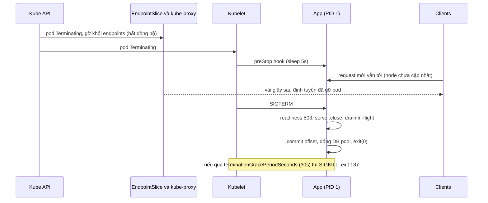
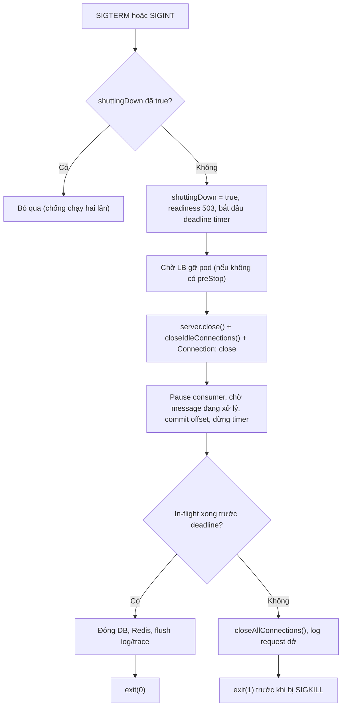
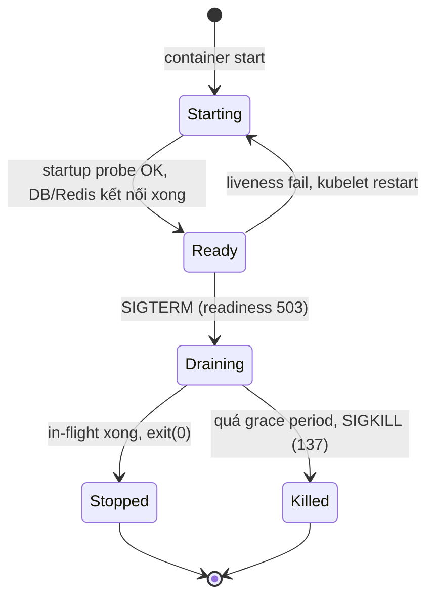

## Bối cảnh & vấn đề

Mỗi lần deploy, API Node trên Kubernetes phát ra một đợt lỗi 502 và vài request bị cắt ngang giữa chừng. Dashboard cho thấy mỗi pod cũ mất đúng **30 giây** để dừng, và exit code là **137**. Dockerfile và code shutdown trông vô hại:

```dockerfile
FROM node:24-alpine
WORKDIR /app
COPY . .
RUN npm ci --omit=dev
CMD ["npm", "start"]
```

```ts
process.on('SIGTERM', () => {
  console.log('bye');
  process.exit(0);
});
```

Ở đây có ít nhất bốn vấn đề chồng lên nhau: process nào thật sự nhận SIGTERM trong container, process đó có xử lý nó không, handler có chờ request đang chạy không, và load balancer có còn gửi request mới tới pod đang dừng không. Deploy là thao tác xảy ra hàng ngày, nên một lỗi shutdown nghĩa là mỗi ngày đều có user nhận lỗi.

Bài này đi từ khái niệm **signal** của Unix, qua cách Node xử lý chúng, tới chi tiết đặc biệt của **PID 1** trong container, rồi trình tự graceful shutdown đúng và vòng đời một pod bị xoá trên Kubernetes. Mọi hành vi quan trọng đều có output chạy thật trên Docker.

**Interview angle:** câu "rolling deploy gây 502" là câu debug tổng hợp: interviewer muốn nghe PID 1, handler exit ngay, readiness, và độ trễ gỡ endpoint, không chỉ "thêm `server.close()`".

## Khái niệm

### Signal

**Signal** là thông báo bất đồng bộ mà kernel gửi tới một process để báo một sự kiện: người dùng bấm Ctrl+C, process khác yêu cầu dừng, process con kết thúc, process truy cập memory sai. Mỗi signal có một **default action**: kết thúc process (`Term`), kết thúc và ghi core dump (`Core`), bỏ qua (`Ign`), dừng tạm (`Stop`), hoặc tiếp tục (`Cont`). Process có thể **đăng ký handler** để thay default action, hoặc bỏ qua signal, trừ hai ngoại lệ: **`SIGKILL`** và **`SIGSTOP`** không thể bắt, chặn hay bỏ qua. Kernel thực hiện chúng trực tiếp.

Signal được gửi bằng syscall `kill(pid, sig)` (lệnh `kill` trong shell, `process.kill()` trong Node), bởi terminal (Ctrl+C gửi `SIGINT`), hoặc bởi kernel (`SIGSEGV` khi truy cập memory sai, `SIGCHLD` khi con kết thúc, `SIGKILL` từ OOM killer).

### Các signal cần thuộc

- **`SIGTERM` (15)**: "hãy kết thúc một cách lịch sự". Là signal mặc định của lệnh `kill`, của `docker stop`, và của Kubernetes khi dừng container. Bắt được, và là nơi bắt đầu graceful shutdown.
- **`SIGINT` (2)**: Ctrl+C trong terminal. Bắt được. Trong dev, bạn thường muốn nó hành xử giống SIGTERM.
- **`SIGKILL` (9)**: kernel giết ngay, không cleanup, không log. Không bắt được. Docker/Kubernetes gửi nó khi hết thời gian chờ; OOM killer cũng dùng nó.
- **`SIGHUP` (1)**: terminal điều khiển bị đóng. Daemon truyền thống (Nginx) dùng nó như lệnh "đọc lại cấu hình".
- **`SIGSTOP`/`SIGCONT`**: tạm dừng/tiếp tục (Ctrl+Z gửi `SIGTSTP`, bản bắt được của stop).
- **`SIGCHLD`**: một process con vừa kết thúc; cha nên `wait()` để reap (xem bài [process & thread](/tracks/os-concurrency/learn/processes-threads)).
- **`SIGUSR1`/`SIGUSR2`**: dành cho ứng dụng tự định nghĩa. Node dùng `SIGUSR1` để bật inspector (debugger), nên đừng dùng nó cho việc khác.

### Exit code 128 + n

Khi một process bị **signal** giết, shell và container runtime báo exit code **128 + số signal**. Vì vậy **137 = 128 + 9** (`SIGKILL`) và **143 = 128 + 15** (`SIGTERM`). Exit code 137 trong container gần như luôn có một trong hai nghĩa: bị **OOM killer** giết (kiểm tra `OOMKilled: true` trong `docker inspect` hoặc `reason: OOMKilled` trong `kubectl describe pod`), hoặc **không dừng kịp** sau SIGTERM nên bị SIGKILL khi hết grace period. 143 nghĩa là process chết vì SIGTERM mà không tự xử lý (default action). Trong Node, callback `'exit'` của `child_process` nhận `code = null` và `signal = 'SIGTERM'` thay cho con số.

### Node xử lý signal thế nào

Trên Linux/macOS, Node có hành vi mặc định cho `SIGINT` và `SIGTERM`: reset chế độ terminal rồi thoát với code 128 + số signal. Khi bạn **đăng ký một listener** (`process.on('SIGTERM', fn)`), hành vi mặc định đó **bị gỡ bỏ**: Node **không tự thoát** nữa. Handler của bạn phải tự quyết định khi nào gọi `process.exit()`, hoặc đóng mọi handle (server, timer, connection) để event loop rỗng và process tự kết thúc.

Điều này vừa là sức mạnh vừa là bẫy. Sức mạnh: bạn có thời gian để drain. Bẫy: handler quên exit (hoặc treo ở một `await` không bao giờ resolve) thì process sống tới khi bị SIGKILL; handler `async` được gọi **lại** nếu signal thứ hai tới (SIGTERM rồi SIGINT) mà không có cờ chống chạy hai lần. Windows không có signal POSIX thật; Node mô phỏng một phần (verify chi tiết theo nền tảng).

### PID 1 trong container

Mỗi container có **PID namespace** riêng, và process đầu tiên trong đó là **PID 1**. Kernel đối xử đặc biệt với PID 1 (process "init" của namespace): signal gửi tới nó từ **bên trong** namespace chỉ được giao **nếu nó đã đăng ký handler** cho signal đó; default action (kết thúc) **không áp dụng**. `SIGKILL` và `SIGSTOP` từ namespace cha (container runtime) vẫn luôn có hiệu lực (theo `pid_namespaces(7)`).

Hệ quả: `docker stop` gửi `SIGTERM` tới PID 1. Nếu PID 1 là `node` **không** đăng ký handler cho SIGTERM, signal bị bỏ qua, và sau 10 giây (Docker) hoặc 30 giây (Kubernetes) runtime gửi `SIGKILL`: exit 137, mọi request đang chạy bị cắt. Kiểm chứng ở phần ví dụ. PID 1 còn có nhiệm vụ **reap** process mồ côi, điều mà app thông thường không làm.

### Shell, npm hay node làm PID 1

Cái gì là PID 1 phụ thuộc vào cách viết `CMD`/`ENTRYPOINT`:

- **Exec form** `CMD ["node", "server.js"]`: `node` là PID 1 trực tiếp. Đúng, miễn là app đăng ký handler SIGTERM (và không spawn process con cần reap).
- **Shell form** `CMD node server.js`: Docker chạy `/bin/sh -c "node server.js"`. Một số shell (như `ash` của Alpine) `exec` luôn lệnh đơn cuối cùng nên `node` vẫn thành PID 1; nhưng với lệnh phức tạp hơn (`node a.js && echo done`, biến môi trường, pipe), `sh` ở lại làm PID 1 và **không forward** SIGTERM cho con.
- **`CMD ["npm", "start"]`**: `npm` là PID 1, spawn script con. Việc npm có forward signal hay không **phụ thuộc phiên bản** (bản cũ từng không forward đáng tin cậy; npm 10.9 trong thí nghiệm bên dưới có forward) (verify). Dù forward, npm vẫn là một lớp thừa: thêm memory, không reap zombie, và che exit code thật.
- **Init nhỏ**: `tini`, `dumb-init`, hoặc `docker run --init` (Docker tự chèn tini). Init làm PID 1, forward mọi signal cho app và reap zombie. Trên Kubernetes không có cờ `--init`: cài `tini` vào image (`ENTRYPOINT ["/sbin/tini", "--"]`), hoặc bật `shareProcessNamespace: true` để pause container làm PID 1.

### Trình tự graceful shutdown

**Graceful shutdown** là dừng process mà không làm hỏng công việc đang dở và không nhận thêm việc mới. Trình tự chuẩn cho một HTTP service:

1. Đặt cờ `shuttingDown` (chống chạy hai lần) và cho **readiness probe trả 503**, để load balancer ngừng gửi request mới.
2. **Chờ vài giây** để thay đổi đó lan tới mọi load balancer và kube-proxy (xem mục Kubernetes bên dưới).
3. **`server.close()`**: ngừng accept connection mới; callback chạy khi **mọi** connection đã đóng. Nó trả về ngay, không chờ.
4. **Đóng keep-alive idle**: `server.closeIdleConnections()` (Node 18.2+), và gửi header `Connection: close` trên các response trong lúc shutdown để client không tái sử dụng socket. Từ Node 19, `server.close()` tự đóng các connection idle **tại thời điểm gọi** (verify), nhưng connection trở nên idle **sau đó** vẫn mở.
5. **Chờ request in-flight xong**, với **deadline**. Quá deadline thì `server.closeAllConnections()` rồi thoát với code khác 0 và log rõ ràng.
6. Dừng nguồn việc khác: pause Kafka consumer, chờ message đang xử lý xong, **commit offset**, rời consumer group sạch; dừng timer/cron; đợi job nền đang chạy.
7. **Đóng tài nguyên** theo thứ tự ngược với lúc mở: DB pool, Redis, tracer/logger flush. Chỉ sau khi không còn ai dùng chúng.
8. `process.exit(0)`.

Toàn bộ phải xong **trước** `terminationGracePeriodSeconds` (mặc định 30 giây), nếu không SIGKILL cắt ngang.

### Vòng đời pod khi bị xoá trên Kubernetes

Khi một pod bị xoá (rolling update, scale down, drain node), hai việc diễn ra **song song và bất đồng bộ**: (a) kubelet trên node chạy **`preStop` hook** (nếu có) rồi gửi **SIGTERM** tới PID 1 của từng container; (b) control plane gỡ pod khỏi **EndpointSlice** của Service, và kube-proxy/ingress controller trên từng node cập nhật quy tắc định tuyến. Không có gì đảm bảo (b) xong trước (a). Trong vài giây, pod đã nhận SIGTERM **vẫn có thể nhận request mới** từ những node chưa cập nhật. Nếu app đóng listener ngay, những request đó nhận connection refused hoặc 502.

Đó là lý do cho `preStop` sleep vài giây (hoặc tự sleep trong handler trước khi `server.close()`): cho định tuyến kịp gỡ pod. Kubernetes bản mới có hành động `sleep` gốc cho `preStop` mà không cần binary `sleep` trong image (verify phiên bản). Grace period tính từ lúc bắt đầu termination, **bao gồm** thời gian preStop.

### Probe: startup, readiness, liveness

- **Readiness**: "có nên gửi traffic cho tôi không?". Trả 200 khi đã sẵn sàng (kết nối DB xong, cache warm nếu cần), trả 503 khi đang shutdown hoặc quá tải tạm thời. Fail readiness chỉ gỡ pod khỏi Service, **không** restart.
- **Liveness**: "tôi có bị treo không thể tự hồi phục không?". Fail thì kubelet **restart** container. Liveness **không** nên kiểm tra dependency (DB chậm không phải lý do restart mọi pod cùng lúc, việc đó biến sự cố DB thành sự cố toàn hệ thống).
- **Startup**: cho app khởi động chậm thời gian riêng; liveness và readiness chỉ bắt đầu sau khi startup probe thành công.

## Cơ chế hoạt động

### Rolling update: điều gì xảy ra với một pod cũ



Hai nhánh đầu chạy song song: control plane gỡ endpoint trong khi kubelet bắt đầu dừng container. Khoảng thời gian giữa chúng là cửa sổ request mới vẫn tới một pod sắp chết. `preStop` sleep lấp đầy cửa sổ đó: container vẫn phục vụ bình thường trong 5 giây trong lúc định tuyến hội tụ, rồi mới nhận SIGTERM. Từ đó app đi qua trình tự graceful shutdown. Toàn bộ, gồm cả preStop, phải nằm trong grace period.

### Trình tự shutdown trong process



Mỗi bước tồn tại vì một failure mode cụ thể: cờ chống signal thứ hai chạy lại handler; readiness và chờ LB chống request mới; `closeIdleConnections` và `Connection: close` chống keep-alive giữ server không bao giờ "close xong"; drain consumer chống xử lý trùng sau rebalance; đóng DB **sau** in-flight chống request đang chạy mất connection; deadline chống treo vô hạn. Thoát với code 1 khi quá hạn giúp phân biệt trong metric giữa shutdown sạch và shutdown bị ép.

### Vòng đời của một service instance



Trạng thái **Draining** là thứ nhiều service không có: chúng nhảy thẳng từ Ready sang Stopped (`process.exit(0)` ngay trong handler). Một instance tốt dành thời gian ở Draining đủ lâu để hoàn thành việc đang làm, nhưng không lâu tới mức rơi vào nhánh Killed.

## Ví dụ thực tế

### Exit code của signal

```bash
node -e 'process.kill(process.pid, "SIGKILL")'; echo "SIGKILL → exit $?"
node -e 'setInterval(()=>{},1000); setTimeout(()=>process.kill(process.pid,"SIGTERM"),100)'; echo "SIGTERM (không handler) → exit $?"
node -e 'process.on("SIGTERM",()=>console.log("handled, but not exiting...")); setTimeout(()=>process.kill(process.pid,"SIGTERM"),100); setTimeout(()=>{console.log("still alive after 1s"); process.exit(0)},1000)'; echo "→ exit $?"
node -e "const p = require('node:child_process').spawn('sleep', ['30']); p.on('exit', (code, signal) => console.log('child exit:', { code, signal })); setTimeout(() => p.kill('SIGTERM'), 100);"
```

Output thật (macOS, Node 24.21):

```text
SIGKILL → exit 137
SIGTERM (không handler) → exit 143
handled, but not exiting...
still alive after 1s
→ exit 0
child exit: { code: null, signal: 'SIGTERM' }
```

Dòng 1–2 xác nhận quy tắc 128 + n. Dòng 3–5 là điểm hay bị hiểu lầm: sau khi đăng ký handler, SIGTERM **không** làm Node thoát; process chỉ kết thúc khi code gọi `exit`. Dòng cuối: với process con, Node báo signal thay vì exit code.

### Node làm PID 1 bỏ qua SIGTERM

```ts
// idle.ts: không đăng ký handler nào
console.log('started pid', process.pid);
setInterval(() => {}, 1000);
```

```bash
docker run -d --name demo -v "$PWD":/app -w /app node:22-alpine node idle.ts
docker stop -t 5 demo          # gửi SIGTERM, chờ 5 s, rồi SIGKILL
docker inspect -f '{{.State.ExitCode}}' demo
# lặp lại với: docker run -d --init ...
```

Output thật (bản gốc chạy file `.mjs` tương đương, Node 22.23):

```text
plain: docker stop took 6s, exit code 137
init: docker stop took 0s, exit code 143
```

Không có `--init`, Node là PID 1 và không có handler, nên kernel không áp dụng default action: SIGTERM bị bỏ qua, Docker chờ hết 5 giây rồi SIGKILL (137). Với `--init`, tini là PID 1, forward SIGTERM cho Node (giờ là process thường), default action kết thúc nó ngay (143). Cùng một app, cùng một lệnh stop, khác nhau 6 giây và một lần SIGKILL.

### npm và shell làm PID 1

Với một app **có** handler SIGTERM (in `got SIGTERM, cleaning up` rồi exit 0), thử ba cách khởi động:

```text
== node graceful-min.mjs: stop took 0s, exit 0
started pid 1
got SIGTERM, cleaning up

== npm start: stop took 0s, exit 0
> start
> node graceful-min.mjs
started pid 20
got SIGTERM, cleaning up

== sh -c 'node graceful-min.mjs && echo done': stop took 6s, exit 137
started pid 7
```

Output thật (Node 22.23, npm 10.9.8, đã lược các dòng `npm notice`). Chạy `node` trực tiếp: handler chạy, thoát sạch. `npm start` (exec form): npm 10.9 **có** forward SIGTERM, app thoát sạch, nhưng app giờ là PID 20 dưới npm, và npm không reap zombie. Shell giữ vai PID 1 (lệnh có `&&` nên `sh` không exec): SIGTERM tới `sh`, không được forward, app không bao giờ biết, SIGKILL sau timeout. Kết luận an toàn nhất cho Dockerfile: `CMD ["node", "dist/server.js"]` (exec form), cộng `tini` nếu app spawn process con.

### Graceful shutdown: bản thiếu và bản đúng

Server có một request chậm 1 giây đang chạy và một client giữ keep-alive (như load balancer hoặc sidecar):

```ts
// shutdown.ts
import http from 'node:http';
import { once } from 'node:events';

const t0 = Date.now();
const log = (m: string) => console.log(`t=${String(Date.now() - t0).padStart(4)}ms ${m}`);
const FIXED = process.argv[2] === 'fixed';
let shuttingDown = false;
const db = { async end() { log('db pool closed'); } };                 // giả lập pg Pool

const server = http.createServer(async (req, res) => {
  if (req.url === '/ready') res.statusCode = shuttingDown ? 503 : 200;
  else await new Promise((r) => setTimeout(r, 1000));                 // request chậm 1 s
  if (FIXED && shuttingDown) res.setHeader('Connection', 'close');    // đừng tái dùng socket này
  res.end();
});
server.keepAliveTimeout = 60_000;                                     // keep-alive dài, như sau LB

async function shutdown(signal: string) {
  if (shuttingDown) return;                                           // SIGTERM rồi SIGINT: chạy 1 lần
  shuttingDown = true;
  log(`${signal} → readiness 503`);
  setTimeout(() => { log('deadline → exit(1)'); process.exit(1); }, 5_000).unref();
  await new Promise((r) => setTimeout(r, 300));                       // chờ LB gỡ pod
  const closed = new Promise((r) => server.close(r));                // ngừng accept, xong khi mọi socket đóng
  server.closeIdleConnections();                                      // đóng keep-alive đang idle
  const force = setTimeout(() => { log('force closeAllConnections()'); server.closeAllConnections(); }, 4_000);
  await closed;
  clearTimeout(force);
  log('http server closed');
  await db.end();                                                     // đóng DB SAU khi request xong
  log('exit(0)');
  process.exit(0);
}
process.on('SIGTERM', shutdown);
process.on('SIGINT', shutdown);

server.listen(0);
await once(server, 'listening');
const { port } = server.address() as { port: number };
const agent = new http.Agent({ keepAlive: true });                   // client giữ socket như LB/sidecar
const get = (path: string) => new Promise<number>((resolve, reject) => {
  http.get({ port, path, agent }, (res) => { res.resume(); res.on('end', () => resolve(res.statusCode!)); }).on('error', reject);
});

log(`GET /ready → ${await get('/ready')} (socket giờ idle trong agent)`);
get('/slow').then((s) => log(`in-flight /slow → ${s}`));
setTimeout(() => process.kill(process.pid, 'SIGTERM'), 200);
setTimeout(() => get('/ready').then((s) => log(`probe khi đang shutdown → ${s}`)), 250);
```

Output thật (Node 24.21):

```text
=== node shutdown.ts
t=  15ms GET /ready → 200 (socket giờ idle trong agent)
t= 217ms SIGTERM → readiness 503
t= 268ms probe khi đang shutdown → 503
t=1018ms in-flight /slow → 200
t=4520ms force closeAllConnections()
t=4522ms http server closed
t=4522ms db pool closed
t=4522ms exit(0)
=== node shutdown.ts fixed
t=  12ms GET /ready → 200 (socket giờ idle trong agent)
t= 213ms SIGTERM → readiness 503
t= 269ms probe khi đang shutdown → 503
t=1015ms http server closed
t=1015ms db pool closed
t=1015ms exit(0)
```

Cả hai bản đã làm đúng nhiều thứ: readiness 503, chờ LB, `server.close()`, `closeIdleConnections()`, deadline, đóng DB sau cùng. Nhưng bản đầu vẫn **treo 3,5 giây**: request `/slow` và probe `/ready` kết thúc **sau** lời gọi `closeIdleConnections()`, socket của chúng trở về trạng thái idle keep-alive và giữ server mở tới khi bị ép đóng ở giây thứ 4,5. Nếu không có bước "force" và deadline, đó chính là "sometimes hangs forever on deploy". Bản đúng thêm header `Connection: close` cho mọi response trong lúc shutdown: server đóng socket ngay sau response, và `server.close()` hoàn tất đúng lúc request cuối xong (1.015 ms). (Ở bản đúng, dòng log `in-flight /slow → 200` của client không kịp in vì client ở cùng process và process đã thoát; response vẫn được gửi đầy đủ trước khi socket đóng.)

So với code trong câu hỏi debug (gọi `server.close()` rồi `await db.end()` ngay), bản đúng sửa năm lỗi: `server.close()` không được chờ nên DB bị đóng khi request còn dùng; keep-alive giữ server không bao giờ đóng xong; không có deadline; không có readiness/chờ LB; handler có thể chạy hai lần.

### Kubernetes manifest

```yaml
spec:
  terminationGracePeriodSeconds: 45          # > preStop + deadline drain của app
  containers:
    - name: api
      image: registry.example.com/api:1.42.0
      command: ["/sbin/tini", "--", "node", "dist/server.js"]
      lifecycle:
        preStop:
          exec: { command: ["sleep", "5"] }  # hoặc action sleep gốc trên bản K8s mới (verify)
      startupProbe:   { httpGet: { path: /ready, port: 3000 }, failureThreshold: 30, periodSeconds: 2 }
      readinessProbe: { httpGet: { path: /ready, port: 3000 }, periodSeconds: 5 }
      livenessProbe:  { httpGet: { path: /live,  port: 3000 }, periodSeconds: 10, failureThreshold: 3 }
```

`/live` chỉ trả 200 nếu event loop còn chạy (không gọi DB); `/ready` kiểm tra đã khởi tạo xong và `shuttingDown` là false. Deadline drain trong app (ví dụ 30 giây) cộng 5 giây preStop phải nhỏ hơn 45 giây. Để kiểm thử đường shutdown trong CI: khởi động app thật, bắn tải liên tục (ví dụ vài chục request/giây có request chậm), gửi SIGTERM, rồi khẳng định không có request lỗi, exit code bằng 0, và thời gian dừng dưới ngưỡng.

## Trade-offs & lựa chọn thay thế

| PID 1 là | Forward signal | Reap zombie | Ghi chú |
|---|---|---|---|
| `node` (exec form) | Không cần (nhận trực tiếp) | Không reap cháu | Phải có handler SIGTERM, nếu không bị bỏ qua |
| `sh -c` (shell form) | Không | Có thể có, tuỳ shell | Lệnh phức tạp giữ `sh` làm PID 1, app không nhận SIGTERM |
| `npm start` | Tuỳ phiên bản (npm 10.9: có) | Không | Thêm lớp, thêm memory, che exit code |
| `tini` / `dumb-init` | Có | Có | Lựa chọn mặc định an toàn, vài trăm KB |
| `docker run --init` | Có (tini) | Có | Chỉ Docker, không có trên Kubernetes |
| `shareProcessNamespace: true` | Pause container là PID 1 | Có | Các container trong pod thấy process của nhau |

Chọn exec form với `node` trực tiếp khi app không spawn process con và bạn chắc chắn có handler SIGTERM. Chọn `tini` khi app spawn process (Chrome, ffmpeg, shell script) hoặc khi muốn một lớp an toàn chuẩn hoá cho mọi image. Tránh `npm start` và shell form trong production. Về thời gian: grace period ngắn làm deploy nhanh nhưng dễ cắt request dài; dài quá làm deploy chậm và giữ tài nguyên. Chọn theo request dài nhất hợp lệ (upload, export) cộng preStop, và chuyển tác vụ thật sự dài sang job queue để shutdown không phải chờ chúng.

## Edge cases & failure modes

- **Pod nhận request sau SIGTERM**: endpoint được gỡ bất đồng bộ. Không có preStop sleep hoặc chờ trong handler, request mới gặp connection refused.
- **Keep-alive giữ server mở**: như output ở trên; `server.close()` không bao giờ gọi callback. Cần `Connection: close`, `closeIdleConnections()` và deadline với `closeAllConnections()`.
- **Handler async chạy hai lần**: SIGTERM rồi SIGINT (hoặc hai SIGTERM từ tini và từ runtime) làm `db.end()` bị gọi hai lần và ném lỗi. Dùng cờ.
- **Đóng DB trước khi request xong**: request in-flight nhận `Cannot use a pool after calling end on the pool` và trả 500 trong chính lúc shutdown.
- **Kafka consumer bị kill giữa chừng**: offset chưa commit, message được xử lý lại sau rebalance. Processing phải idempotent vì SIGKILL luôn có thể xảy ra.
- **Liveness kiểm tra DB**: DB chậm vài giây, mọi pod fail liveness và bị restart cùng lúc, biến sự cố DB thành outage toàn bộ.
- **`unhandledRejection` trong handler shutdown**: crash với exit 1 thay vì exit 0 sạch; bọc handler trong `try/catch` và log.
- **Grace period nhỏ hơn thời gian drain**: app tính deadline 30 giây nhưng pod chỉ có 30 giây tổng gồm cả preStop; luôn bị SIGKILL đúng lúc sắp xong.
- **Timer và interval giữ process sống**: sau khi đóng server, một `setInterval` metrics vẫn giữ event loop; dùng `unref()` cho timer nền hoặc clear trong shutdown.

## Pitfalls

- ❌ `process.exit(0)` ngay trong handler SIGTERM → ✅ readiness 503, chờ LB, `server.close()` có chờ, drain in-flight với deadline, đóng tài nguyên, rồi mới exit.
- ❌ `CMD ["npm", "start"]` hoặc shell form trong Dockerfile production → ✅ `CMD ["node", "dist/server.js"]`, thêm `tini` nếu spawn process con.
- ❌ Tin rằng Node làm PID 1 tự thoát khi nhận SIGTERM → ✅ PID 1 không có default action; phải đăng ký handler hoặc dùng init.
- ❌ Gọi `server.close()` rồi đóng DB ngay dòng sau → ✅ chờ callback của `server.close()` (promisify) trước khi đóng pool.
- ❌ Bỏ qua keep-alive → ✅ `Connection: close` trong lúc shutdown, `closeIdleConnections()`, và `closeAllConnections()` khi quá deadline.
- ❌ Liveness probe gọi DB/Redis → ✅ liveness chỉ kiểm tra process còn phản hồi; dependency thuộc về readiness (và cẩn thận cả ở đó).
- ❌ Dùng `SIGUSR1` cho logic ứng dụng → ✅ Node dành nó cho inspector; dùng `SIGUSR2` hoặc endpoint admin.
- ❌ Đọc exit 137 là "app crash" → ✅ 137 là SIGKILL: kiểm tra `OOMKilled` trước, rồi đến thời gian shutdown so với grace period.

## Tóm tắt

- Signal là thông báo bất đồng bộ từ kernel; SIGTERM (15) và SIGINT (2) bắt được, SIGKILL (9) và SIGSTOP không. Exit code bằng 128 + n: 137 là SIGKILL (OOM hoặc dừng không kịp), 143 là SIGTERM.
- Trong Node, đăng ký handler cho SIGTERM/SIGINT gỡ bỏ hành vi thoát mặc định; handler phải tự exit và chống chạy hai lần.
- PID 1 trong container không có default action cho signal: Node không handler bỏ qua SIGTERM và bị SIGKILL sau timeout. Shell form và npm có thể chắn signal; dùng exec form và `tini`.
- Graceful shutdown: readiness 503, chờ LB, `server.close()` có chờ, đóng keep-alive (`Connection: close`, `closeIdleConnections`), drain in-flight với deadline, drain consumer và commit offset, đóng DB, exit.
- Kubernetes gỡ endpoint song song với gửi SIGTERM, nên cần preStop sleep; grace period (mặc định 30 s) gồm cả preStop.
- Readiness quyết định có nhận traffic, liveness quyết định restart và không kiểm tra dependency, startup cho app khởi động chậm.
- Xử lý phải idempotent vì SIGKILL luôn có thể cắt ngang; kiểm thử đường shutdown trong CI bằng tải thật và SIGTERM.
