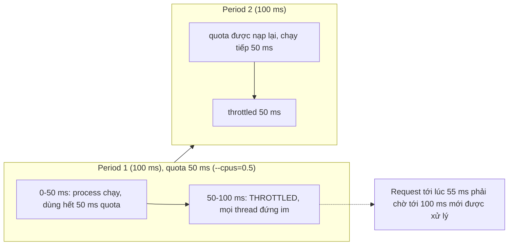
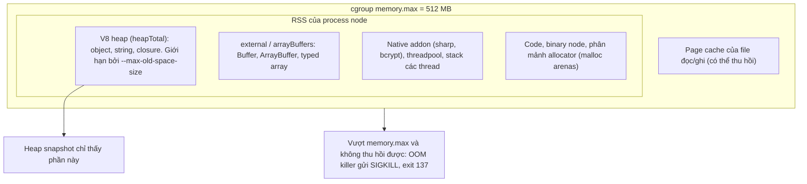
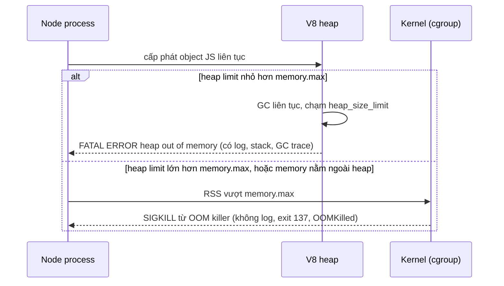

## Bối cảnh & vấn đề

Một service xử lý ảnh chạy trên Kubernetes với `limits: { cpu: 2, memory: 512Mi }`. Vài giờ một lần, pod bị restart với `Last State: Terminated, Reason: OOMKilled, Exit Code: 137`. Không có dòng log lỗi nào; app biến mất giữa chừng. Đội lấy heap snapshot: heap chỉ khoảng 60 MB. "Heap nhỏ thế thì memory đi đâu?"

Cùng service đó có một vấn đề khác: nó tạo worker pool theo `os.cpus().length`. Trên node 64 core, con số đó là 64, nên pod giới hạn 2 CPU chạy 64 worker tranh nhau. Latency p99 dao động kỳ lạ theo chu kỳ 100 ms, dù CPU trung bình chỉ 60%.

Cả hai đến từ cùng một sự thật: **container không phải máy ảo**. Process trong container vẫn chạy trên kernel của host, thấy CPU và RAM của host qua nhiều API, nhưng bị kernel giới hạn bằng **cgroup**. Hiểu cgroup làm gì với CPU và memory, và Node nhìn thấy (hoặc không thấy) giới hạn đó ra sao, là điều kiện để đặt resource đúng và đọc được exit 137. Mọi con số trong bài được đo trên Docker với `node:22-alpine`.

**Interview angle:** "pod OOMKilled nhưng heap snapshot nhỏ" là câu phân biệt người hiểu memory ngoài V8 heap (Buffer, native, allocator) với người chỉ biết heap snapshot.

## Khái niệm

### cgroup và namespace

Container được dựng từ hai cơ chế của kernel Linux. **Namespace** quyết định process **nhìn thấy gì**: PID namespace (process thấy mình là PID 1), network namespace (network stack riêng), mount namespace (filesystem riêng). **cgroup** (control group) quyết định process **được dùng bao nhiêu**: CPU, memory, số PID, I/O. Hệ thống hiện đại dùng **cgroup v2**, giao diện là các file trong `/sys/fs/cgroup/`: `cpu.max`, `memory.max`, `pids.max`, `memory.events`.

Điểm mấu chốt: cgroup **giới hạn** tài nguyên nhưng **không ẩn** chúng. `/proc/cpuinfo`, `/proc/meminfo`, và các syscall mà `os.cpus()`, `os.totalmem()` dựa vào vẫn báo phần cứng của **host** (hoặc VM). Một chương trình tự điều chỉnh theo "máy có bao nhiêu core, bao nhiêu RAM" sẽ tính sai trong container nếu không đọc cgroup.

### CPU limit: CFS quota và throttling

Kubernetes `limits.cpu: 2` được dịch thành **CFS bandwidth control**: file `cpu.max` chứa `200000 100000`, nghĩa là trong mỗi **period** 100 ms, cgroup được dùng tối đa **200 ms thời gian CPU** (cộng trên mọi core). Dùng hết quota trước khi period kết thúc thì **mọi thread** trong cgroup bị **throttle**: không được chạy cho tới period tiếp theo, dù host còn nhiều core rảnh.

Throttling là nguồn gốc của latency khó hiểu. Một process 16 thread trên host 64 core có thể đốt 200 ms quota chỉ trong 12,5 ms thời gian thực (16 thread cùng chạy), rồi **đứng im 87,5 ms**. CPU trung bình theo phút trông vừa phải (60%), nhưng request rơi vào khoảng bị throttle phải chờ tới gần 90 ms thêm. Metric cần xem: `nr_throttled` và `throttled_usec` trong `cpu.stat`, hoặc trên Kubernetes là `container_cpu_cfs_throttled_periods_total` so với `container_cpu_cfs_periods_total` (từ cAdvisor).

**`requests.cpu`** thì khác: nó không giới hạn, mà quyết định **tỷ trọng** khi tranh chấp (`cpu.weight`) và được scheduler dùng để xếp pod lên node. Một pod chỉ có request (không có limit) được dùng CPU rảnh của node mà không bị throttle; đó là lý do nhiều đội bỏ CPU limit cho service nhạy latency (một lựa chọn có tranh luận, xem phần trade-off).

### os.cpus(), availableParallelism() và kích thước pool

`os.cpus()` đọc danh sách CPU của host, nên trong container giới hạn 2 CPU trên host 8 core nó vẫn trả 8. **`os.availableParallelism()`** (có từ Node 18.14 / 19.4) trả số luồng song song mà process nên dùng, dựa trên `uv_available_parallelism()` của libuv: tôn trọng CPU affinity (`sched_getaffinity`) và, ở các bản libuv mới, cả **CPU quota của cgroup** (verify theo phiên bản; thí nghiệm bên dưới với Node 22.23 và 24.21 trả 2 khi `--cpus=2`). Với runtime cũ hơn, đọc `/sys/fs/cgroup/cpu.max` hoặc truyền số core qua biến môi trường từ Downward API của Kubernetes.

Mọi thứ có "kích thước theo số core" đều phải dùng số core **khả dụng**: số worker của `cluster`, kích thước `worker_threads` pool, `UV_THREADPOOL_SIZE` cho việc CPU, `GOMAXPROCS` nếu có sidecar Go. Trên pod limit 2 CPU chạy một process Node, worker pool cho tác vụ CPU nên là 1–2 (main thread cũng cần CPU), không phải 64. Pool lớn hơn quota không làm việc nhanh hơn; nó chỉ làm quota cạn sớm hơn trong mỗi period và tăng throttling.

### Memory limit và OOM killer

`limits.memory: 512Mi` được dịch thành `memory.max = 536870912`. Khi tổng memory mà cgroup tính cho container vượt con số này và kernel không thu hồi được (page cache sạch có thể bị đẩy ra trước), **OOM killer** của cgroup chọn một process trong cgroup và gửi **`SIGKILL`**. Process không có cơ hội chạy handler, không ghi log, không flush gì cả: exit code **137**, và Kubernetes ghi `Reason: OOMKilled`. File `memory.events` đếm số lần `oom_kill`.

Khác biệt quan trọng với lỗi **heap out of memory của V8**: đó là V8 tự phát hiện heap JS chạm giới hạn của **nó** (`heap_size_limit`), in `FATAL ERROR: ... JavaScript heap out of memory` kèm thông tin GC và stack, rồi abort. Có log, có thể chẩn đoán. Mục tiêu khi đặt heap limit là: nếu memory tăng vì heap JS, **V8 phải chạm giới hạn của nó trước** khi container chạm `memory.max`.

### Giải phẫu memory của một process Node

`process.memoryUsage()` trả năm con số, và chỉ một phần trong đó là thứ heap snapshot nhìn thấy:

- **`rss`** (resident set size): toàn bộ memory vật lý process đang chiếm. Gần nhất với thứ cgroup tính (cgroup còn tính cả page cache của file process đọc/ghi, verify cách tính cụ thể).
- **`heapTotal`** / **`heapUsed`**: heap do V8 quản lý (object JS, string, closure). Heap snapshot chỉ cho thấy phần này.
- **`external`**: memory của object C++ gắn với object JS, nằm **ngoài** heap V8; gồm cả `arrayBuffers`.
- **`arrayBuffers`**: memory của `ArrayBuffer`, `SharedArrayBuffer` và mọi **`Buffer`** của Node.

Còn những phần không có tên riêng trong `memoryUsage()` nhưng nằm trong RSS: code đã biên dịch của V8 và binary Node, stack của các thread, buffer của threadpool, memory do **native addon** tự cấp phát (sharp/libvips, bcrypt, driver DB native) mà V8 không biết, và **phân mảnh của allocator**: glibc `malloc` tạo nhiều **arena** cho các thread (tối đa 8 × số core mặc định trên 64-bit (verify)), memory đã free nhưng chưa trả về OS vẫn tính vào RSS. Image Alpine dùng musl thay vì glibc, với hành vi allocator khác.

### Đặt --max-old-space-size

**`--max-old-space-size`** (MiB) đặt giới hạn cho old generation của V8 heap, phần lớn nhất. Không đặt, V8 tự chọn dựa trên memory mà nó thấy. Node các bản gần đây đọc giới hạn cgroup (`process.constrainedMemory()`), và thí nghiệm bên dưới cho thấy heap limit **xấp xỉ một nửa** memory limit của container (512 MB → 259 MB, 1 GB → 524 MB, 2 GB → 1.048 MB), nhưng có **sàn khoảng 259 MB**: với container 256 MB, heap limit vẫn là 259 MB, **lớn hơn cả container** (verify với phiên bản của bạn).

Quy tắc thực hành: đặt tường minh, khoảng **70–80% memory limit nếu process gần như chỉ có heap JS**, thấp hơn nhiều nếu dùng nhiều `Buffer`, native addon, hoặc `worker_threads` (mỗi worker có heap riêng). Tổng `max-old-space-size` cộng young generation, cộng external, cộng overhead phải nằm dưới `memory.max`. Đặt qua `NODE_OPTIONS="--max-old-space-size=384"` trong manifest để đi cùng memory limit.

## Cơ chế hoạt động

### CFS quota trong một period



Với `--cpus=0.5`, mỗi period 100 ms process được 50 ms CPU. Một vòng lặp CPU-bound dùng hết 50 ms đầu, rồi bị dừng 50 ms còn lại. Nếu process có nhiều thread chạy song song, quota cạn còn nhanh hơn (4 thread cạn 50 ms trong 12,5 ms thời gian thực). Đường chấm cho thấy tác động lên latency: request tới giữa lúc bị throttle phải chờ tới đầu period sau, dù host có 63 core đang rảnh. Output `cpu.stat` ở phần ví dụ xác nhận: 20 trên 21 period bị throttle.

### Memory của process Node so với giới hạn của container



Heap snapshot chỉ nhìn vào một ô trong hình. `--max-old-space-size` chỉ giới hạn ô đó. Mọi ô khác có thể tăng tới khi tổng vượt `memory.max`, và khi đó không phải V8 mà là **kernel** ra tay, bằng SIGKILL, không log. Đó là lời giải của câu đố "heap nhỏ mà vẫn OOMKilled": memory nằm ở `external` (Buffer ảnh, file đọc trọn vào memory), ở native addon, hoặc ở phân mảnh allocator.

### Hai cách chết khi memory tăng



Nhánh trên là nhánh bạn muốn: có log, có thông tin để điều tra, và exit không phải 137 nên dễ phân biệt. Nhánh dưới xảy ra trong hai trường hợp: heap limit được đặt (hoặc tự chọn) lớn hơn container, hoặc memory tăng ở ngoài heap nơi V8 không kiểm soát. Thí nghiệm bên dưới tái hiện cả hai nhánh với cùng một container 256 MB.

## Ví dụ thực tế

### Node nhìn thấy gì trong container

```ts
// limits.ts
import os from 'node:os';
import v8 from 'node:v8';
import { readFileSync } from 'node:fs';

const read = (f: string) => { try { return readFileSync(f, 'utf8').trim(); } catch { return 'n/a'; } };
const mb = (n: number) => `${Math.round(n / 1024 / 1024)} MB`;

console.log('os.cpus().length          =', os.cpus().length);
console.log('os.availableParallelism() =', os.availableParallelism());
console.log('cgroup cpu.max            =', read('/sys/fs/cgroup/cpu.max'));
console.log('os.totalmem()             =', mb(os.totalmem()));
console.log('process.constrainedMemory =', mb(process.constrainedMemory()));
console.log('cgroup memory.max         =', read('/sys/fs/cgroup/memory.max'));
console.log('V8 heap_size_limit        =', mb(v8.getHeapStatistics().heap_size_limit));
```

```bash
docker run --rm --cpus=2 --memory=512m -v "$PWD":/app -w /app node:22-alpine node limits.ts
```

Output thật (Docker Desktop, VM 8 CPU / 8 GB, Node 22.23; Node 24.21 cho cùng kết quả):

```text
os.cpus().length          = 8
os.availableParallelism() = 2
cgroup cpu.max            = 200000 100000
os.totalmem()             = 7934 MB
process.constrainedMemory = 512 MB
cgroup memory.max         = 536870912
V8 heap_size_limit        = 259 MB
```

`os.cpus()` và `os.totalmem()` báo phần cứng của VM (8 core, 7,9 GB) dù container chỉ được 2 CPU và 512 MB. `availableParallelism()` và `constrainedMemory()` phản ánh đúng cgroup trên bản Node này. V8 tự chọn heap khoảng một nửa limit. Code chia pool theo `os.cpus().length` sẽ tạo 8 worker cho 2 CPU; code tính cache theo `os.totalmem()` sẽ tưởng có 7,9 GB.

Thử heap limit tự chọn theo các mức memory khác nhau (cùng image):

```text
--memory=256m: 259 MB
--memory=512m: 259 MB
--memory=1g:   524 MB
--memory=2g:   1048 MB
--memory=4g:   2096 MB
```

Container 256 MB có heap limit **259 MB**: V8 có sàn tối thiểu, nên với container nhỏ, heap có thể tăng quá limit của container trước khi GC kịp "hoảng".

### CFS throttling đo được

```bash
docker run --rm --cpus=0.5 node:22-alpine sh -c \
  'node -e "const e=Date.now()+2000; while(Date.now()<e){}"; cat /sys/fs/cgroup/cpu.stat'
```

Output thật:

```text
usage_usec 1056963
user_usec 1019108
system_usec 37855
nice_usec 0
nr_periods 21
nr_throttled 20
throttled_usec 994457
nr_bursts 0
burst_usec 0
```

Vòng lặp chạy 2 giây thời gian thực nhưng chỉ nhận được khoảng 1,06 giây CPU (`usage_usec`), đúng với quota 0,5. 20 trên 21 period bị throttle, tổng gần 1 giây đứng im. Với một API, đây là 1 giây mà request tới đúng lúc bị throttle phải chờ. Trên Kubernetes, alert khi tỷ lệ `throttled_periods / periods` vượt khoảng 25% là điểm bắt đầu hợp lý (ngưỡng tuỳ service).

### Hai cách chết: OOMKilled và heap out of memory

```ts
// oom.ts
const mode = process.argv[2];                 // 'buffer' | 'heap'
const keep: unknown[] = [];
const mb = (n: number) => Math.round(n / 1024 / 1024);
for (let i = 1; ; i++) {
  if (mode === 'buffer') keep.push(Buffer.alloc(16 * 1024 * 1024, 1));             // off-heap
  else keep.push(Array.from({ length: 200_000 }, (_, j) => ({ j, s: 'x' + j })));  // on-heap
  if (i % 4 === 0) {
    const m = process.memoryUsage();
    console.log(`rss=${mb(m.rss)}MB heapUsed=${mb(m.heapUsed)}MB arrayBuffers=${mb(m.arrayBuffers)}MB`);
  }
}
```

```bash
docker run --name oom --memory=256m --memory-swap=256m -v "$PWD":/app -w /app node:22-alpine node oom.ts buffer
docker inspect -f '{{.State.ExitCode}} OOMKilled={{.State.OOMKilled}}' oom
# lặp lại với: node oom.ts heap   và   node --max-old-space-size=150 oom.ts heap
```

Output thật (Node 22.23, container 256 MB):

```text
=== buffer (off-heap)
rss=124MB heapUsed=7MB arrayBuffers=64MB
rss=190MB heapUsed=7MB arrayBuffers=128MB
rss=254MB heapUsed=7MB arrayBuffers=192MB
exit=137 OOMKilled=true
=== heap, heap limit mặc định (259 MB)
rss=125MB heapUsed=64MB arrayBuffers=0MB
rss=179MB heapUsed=115MB arrayBuffers=0MB
rss=239MB heapUsed=175MB arrayBuffers=0MB
exit=137 OOMKilled=true
=== heap, --max-old-space-size=150
rss=128MB heapUsed=62MB arrayBuffers=0MB
rss=183MB heapUsed=117MB arrayBuffers=0MB
FATAL ERROR: Ineffective mark-compacts near heap limit Allocation failed - JavaScript heap out of memory
exit=139 OOMKilled=false
```

Ba kết cục đáng học. **Buffer**: `heapUsed` đứng yên 7 MB trong khi RSS tăng lên 254 MB; heap snapshot sẽ cho thấy một heap nhỏ xíu, và process bị kernel giết im lặng. Đó chính là câu đố của phần mở đầu. **Heap với limit mặc định**: heap limit 259 MB lớn hơn container 256 MB, nên kernel giết trước khi V8 kịp báo lỗi. **Heap với limit 150 MB**: V8 chạm giới hạn của nó trước, in `FATAL ERROR` kèm GC trace và stack (đã lược), và exit không phải 137 (139 trên image này; abort thường cho 134, tuỳ nền tảng (verify)). Chỉ trường hợp thứ ba để lại dấu vết để điều tra.

### Điều tra "RSS tăng nhưng heap phẳng"

```ts
// log mỗi 30 s, vẽ đồ thị các đường theo thời gian
setInterval(() => {
  const m = process.memoryUsage();
  const toMb = (n: number) => Math.round(n / 1048576);
  console.log(JSON.stringify({
    msg: 'memory', rss: toMb(m.rss), heapTotal: toMb(m.heapTotal), heapUsed: toMb(m.heapUsed),
    external: toMb(m.external), arrayBuffers: toMb(m.arrayBuffers),
  }));
}, 30_000).unref();
```

Đoạn này không có output cố định; ý nghĩa nằm ở hình dạng các đường theo thời gian. Đọc như sau:

- `heapUsed` tăng đều không giảm sau GC: leak trong JS (closure giữ object, map cache không giới hạn, listener không gỡ). Dùng heap snapshot so sánh hai thời điểm.
- `arrayBuffers`/`external` tăng: Buffer bị giữ (đọc cả file vào memory, response lớn được buffer, xử lý ảnh song song không giới hạn). Stream thay vì buffer, giới hạn concurrency.
- `rss` tăng mà mọi con số khác phẳng: native addon cấp phát ngoài V8, hoặc phân mảnh allocator. Thử giới hạn `MALLOC_ARENA_MAX=2` (glibc), chạy với jemalloc (`LD_PRELOAD`), đổi image (glibc/musl), giảm số thread (threadpool, worker).

## Trade-offs & lựa chọn thay thế

| Lựa chọn | Ưu | Nhược | Khi nào |
|---|---|---|---|
| CPU request + limit bằng nhau | Dự đoán được, QoS `Guaranteed` (nếu memory cũng vậy) | Throttling dù node rảnh | Workload batch, cần công bằng tuyệt đối |
| CPU request, không limit | Không throttling, tận dụng CPU rảnh | Pod "ồn ào" chiếm CPU của hàng xóm lúc tranh chấp | Service nhạy latency, cluster có giám sát tốt |
| Memory request = limit | Không bị evict vì node thiếu memory, dễ dự đoán | Lãng phí nếu dùng ít | Mặc định an toàn cho memory |
| Heap limit do V8 tự chọn | Không cần cấu hình | Container nhỏ: heap có thể lớn hơn container; không tính Buffer/native | Chỉ khi đã kiểm tra con số thật |
| `--max-old-space-size` tường minh (~70–80% limit) | Heap OOM có log trước khi bị kernel giết | Phải đồng bộ với memory limit | Mặc định nên làm |
| Heap limit thấp hơn nhiều (~50%) | Chừa chỗ cho Buffer, native, worker | GC chạy nhiều hơn | Service xử lý ảnh/file, nhiều worker |

CPU limit là chủ đề có tranh luận: limit làm tài nguyên dự đoán được và ngăn một pod ăn hết node, nhưng gây throttling ngay cả khi node rảnh. Nhiều đội giữ **memory limit luôn luôn** (memory không nén được, thiếu là chết) và cân nhắc bỏ CPU limit cho service nhạy latency, dựa vào request để chia công bằng. Dù chọn gì, kích thước pool bên trong process phải khớp CPU **khả dụng**, và heap limit phải khớp memory limit trừ đi phần ngoài heap.

## Edge cases & failure modes

- **OOMKilled không có log**: không có gì trong log app; bằng chứng duy nhất là exit 137, `OOMKilled`, `memory.events` và dmesg của node. Đừng tìm stack trace.
- **Heap limit sàn lớn hơn container nhỏ**: container 256 MB có heap limit 259 MB theo mặc định; container nhỏ luôn cần đặt `--max-old-space-size` tường minh.
- **Worker threads nhân heap**: mỗi `worker_threads` có heap riêng với giới hạn riêng; 4 worker mỗi cái vài trăm MB vượt container dễ dàng. Đặt `resourceLimits`.
- **Page cache làm memory "trông" đầy**: đọc/ghi nhiều file làm memory usage của cgroup tăng vì page cache; phần này thu hồi được, nhưng metric thô trông đáng sợ. Kubernetes dùng working set (trừ page cache không hoạt động) để quyết định evict (verify định nghĩa metric).
- **Throttling bởi thread nền**: GC song song của V8 và threadpool libuv cũng tiêu quota; process "chỉ có một thread JS" vẫn có thể bị throttle khi GC nặng.
- **Pool theo `os.cpus()`** trên node lớn: 64 worker trong pod 2 CPU, context switch và throttling liên tục, mỗi worker thêm một heap.
- **Cạn PID/FD trong container**: `pids.max` và `ulimit -n` của container khác máy dev; zombie (bài [process & thread](/tracks/os-concurrency/learn/processes-threads)) và leak socket (bài [I/O models](/tracks/os-concurrency/learn/io-models-libuv)) chạm giới hạn này sớm hơn.
- **Swap tắt**: Kubernetes thường tắt swap; không có "đệm" nào giữa hết memory và SIGKILL.

## Pitfalls

- ❌ `os.cpus().length` để tính số worker trong container → ✅ `os.availableParallelism()` (kiểm tra nó phản ánh quota trên phiên bản của bạn), hoặc đọc `cpu.max`/biến môi trường.
- ❌ Dùng `os.totalmem()` để quyết định kích thước cache → ✅ `process.constrainedMemory()` hoặc `memory.max`.
- ❌ Không đặt `--max-old-space-size` và tin V8 tự lo → ✅ đặt tường minh theo memory limit trừ phần ngoài heap, qua `NODE_OPTIONS` trong manifest.
- ❌ Thấy exit 137 và đi tìm exception trong log → ✅ kiểm tra `OOMKilled`, `memory.events`, rồi so RSS với limit theo thời gian.
- ❌ Chỉ dùng heap snapshot khi điều tra memory → ✅ theo dõi `rss`, `heapUsed`, `external`, `arrayBuffers` theo thời gian để biết memory nằm ở đâu.
- ❌ Đọc cả file/ảnh vào `Buffer` và xử lý song song không giới hạn → ✅ stream, và semaphore giới hạn số tác vụ nặng memory đồng thời.
- ❌ Chỉ theo dõi CPU% trung bình → ✅ theo dõi tỷ lệ period bị throttle; CPU trung bình 60% vẫn có thể bị throttle nặng theo từng 100 ms.

## Tóm tắt

- Namespace quyết định container thấy gì, cgroup quyết định dùng bao nhiêu; cgroup giới hạn nhưng không ẩn phần cứng host, nên `os.cpus()` và `os.totalmem()` báo số của host.
- CPU limit là CFS quota (`cpu.max`, period 100 ms); dùng hết quota thì mọi thread bị throttle tới period sau, gây latency dù host rảnh. Theo dõi `nr_throttled`.
- `os.availableParallelism()` phản ánh affinity và (trên bản mới) cgroup quota; mọi pool (cluster, worker, threadpool CPU) phải theo CPU khả dụng.
- Vượt `memory.max`, OOM killer gửi SIGKILL: exit 137, `OOMKilled`, không log. V8 heap OOM thì có `FATAL ERROR` và stack.
- RSS gồm V8 heap, external/arrayBuffers (Buffer), native addon, stack, code và phân mảnh allocator; heap snapshot chỉ thấy heap.
- Node chọn heap limit khoảng một nửa memory limit với sàn khoảng 259 MB; đặt `--max-old-space-size` tường minh (70–80% nếu chủ yếu heap, thấp hơn nếu nhiều Buffer/native/worker).
- Điều tra "RSS tăng, heap phẳng": vẽ `rss`, `heapUsed`, `external`, `arrayBuffers` theo thời gian; nghi Buffer, native addon, allocator (`MALLOC_ARENA_MAX`, jemalloc).
