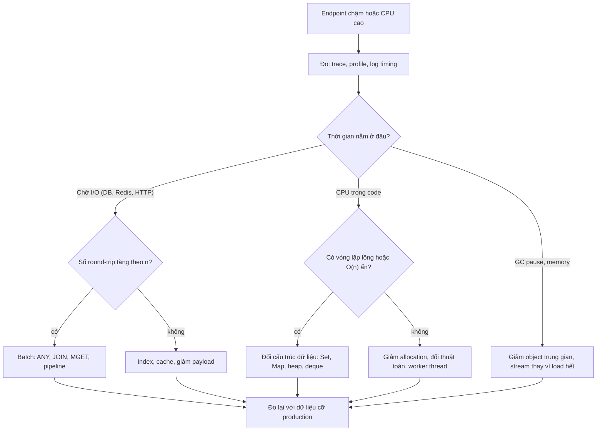
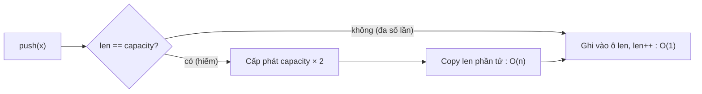

## Bối cảnh & vấn đề

Một endpoint `GET /orders/export` trả về 5.000 đơn hàng kèm tên khách hàng. Ở môi trường dev với 20 đơn, nó chạy 40 ms. Lên production, nó mất 4 giây và làm connection pool của database cạn mỗi khi bộ phận kế toán bấm "Export". Đoạn code trông vô hại:

```ts
async function enrich(orders: Order[]) {
  const out = [];
  for (const o of orders) {
    const customer = (await db.customers.findAll()).find((c) => c.id === o.customerId);
    if (!out.some((x) => x.id === o.id)) out.push({ ...o, customerName: customer?.name });
  }
  return out;
}
```

Nếu chỉ nhìn Big-O của phần CPU, ta thấy `.find` là O(c) và `.some` là O(n), tổng O(n·(c + n)). Nghe đã tệ, nhưng thủ phạm lớn nhất lại không nằm trong ký hiệu đó: `findAll()` nằm **trong vòng lặp**, nên có 5.000 round-trip tới database, mỗi lần kéo toàn bộ bảng khách hàng qua mạng. Một round-trip trong cùng data center tốn khoảng 0,5–2 ms; 5.000 lần là 2,5–10 giây, trong khi toàn bộ phần CPU chỉ vài chục ms.

Câu chuyện này chứa hai bài học mà interviewer senior luôn muốn nghe. Thứ nhất, **Big-O là công cụ so sánh tốc độ tăng**, không phải đồng hồ bấm giờ: nó bỏ qua hằng số, bỏ qua cache CPU và hoàn toàn không biết tới network. Thứ hai, **người dùng Big-O giỏi là người biết đơn vị chi phí nào đang thống trị**: một phép so sánh (nano giây), một lần cấp phát bộ nhớ (chục nano giây), một lần đọc disk (micro tới mili giây), hay một round-trip mạng (mili giây).

Bài này là nền cho cả track: định nghĩa Big-O một cách chính xác, amortized analysis qua `Array.prototype.push`, các O(n) "ẩn" trong API JavaScript (`shift`, `includes`, `splice`), và một quy trình thực dụng để quyết định khi nào tối ưu thuật toán, khi nào tối ưu I/O, khi nào không làm gì cả.

## Khái niệm

### Big-O, Big-Θ, Big-Ω: đo tốc độ tăng, không đo thời gian

**Big-O** mô tả một **cận trên** của tốc độ tăng chi phí khi kích thước input n tiến tới vô cùng. Nói "thuật toán là O(n²)" nghĩa là tồn tại hằng số c và ngưỡng n₀ sao cho với mọi n ≥ n₀, chi phí ≤ c·n². Hai chi tiết quan trọng nằm trong định nghĩa: hằng số c bị **giấu đi**, và định nghĩa chỉ nói về n **đủ lớn**. Vì vậy `100·n` và `n` đều là O(n), còn `n² / 1000` là O(n²) dù với n = 500 nó chỉ bằng 250 phép tính.

**Big-Ω** là cận dưới, **Big-Θ** là cận chặt (vừa trên vừa dưới). Trong phỏng vấn và trong đời thường, người ta nói "O(n log n)" khi thực ra muốn nói Θ(n log n); điều đó chấp nhận được, miễn bạn biết sự khác biệt khi bị hỏi. Ví dụ: "sort bằng so sánh cần Ω(n log n) phép so sánh trong worst case" là một phát biểu về **cận dưới** của cả một lớp thuật toán, không phải về một cài đặt cụ thể.

Ngoài n, hãy luôn gọi tên **các biến thật** của bài toán. Endpoint ở trên không phải O(n²) mà là O(n·c + n²) với n = số đơn, c = số khách hàng, cộng thêm **n round-trip**. Đặt tên biến rõ ràng giúp bạn thấy ngay chi phí nào nhân với chi phí nào.

**Interview angle:** interviewer hay hỏi "O(n) có luôn nhanh hơn O(n log n) không?"; câu trả lời mạnh là "không, Big-O bỏ hằng số và chỉ nói về n lớn; phải đo với dữ liệu thật".

### Các lớp độ phức tạp hay gặp và con số trực giác

Bảng dưới là trực giác cần thuộc: với n = 1 triệu, số bước xấp xỉ bao nhiêu. Nó giúp bạn ước lượng nhanh "chạy được trong 100 ms không" mà không cần benchmark.

| Lớp | Ví dụ | n = 1.000 | n = 1.000.000 |
| --- | --- | --- | --- |
| O(1) | `map.get`, `arr[i]` | 1 | 1 |
| O(log n) | binary search, B-tree lookup | ~10 | ~20 |
| O(n) | duyệt mảng, `includes` | 1.000 | 1.000.000 |
| O(n log n) | sort so sánh | ~10.000 | ~20.000.000 |
| O(n²) | hai vòng lồng nhau | 1.000.000 | 10¹² (không chạy nổi) |
| O(2ⁿ) | thử mọi tập con | vô nghĩa | vô nghĩa |

Một máy chạy JavaScript làm được khoảng 10⁸–10⁹ thao tác đơn giản mỗi giây. Vậy O(n log n) với n = 1 triệu là vài chục ms, còn O(n²) với n = 1 triệu là hàng giờ. Ngược lại, O(n²) với n = 100 chỉ là 10.000 bước, tức vài micro giây: hoàn toàn không đáng tối ưu.

**Interview angle:** biết ước lượng bằng con số ("20 triệu phép so sánh, khoảng 50 ms") là tín hiệu senior rõ hơn là đọc thuộc định nghĩa.

### Hằng số, cache locality và allocation: những thứ Big-O bỏ qua

**Cache locality** là mức độ dữ liệu cần dùng nằm gần nhau trong bộ nhớ. CPU không đọc RAM từng byte mà đọc từng **cache line** 64 byte; nếu phần tử tiếp theo nằm ngay sau phần tử hiện tại (như trong một mảng số liên tục), nó đã sẵn trong cache L1 và đọc gần như miễn phí. Nếu phần tử tiếp theo nằm ở một địa chỉ ngẫu nhiên (như node của linked list được cấp phát rải rác), mỗi lần truy cập có thể là một cache miss tốn ~100 ns. Vì vậy duyệt mảng và duyệt linked list đều O(n), nhưng mảng thường nhanh hơn nhiều lần.

**Allocation và GC** là chi phí thứ hai. Trong V8, tạo object mới rất rẻ nhưng không miễn phí; tạo hàng triệu object nhỏ (ví dụ `{ ...o }` trong vòng lặp, hay `arr.map().filter().map()` tạo ba mảng trung gian) làm garbage collector chạy nhiều hơn và có thể gây pause. Một thuật toán O(n) tạo n object trung gian có thể chậm hơn một thuật toán O(n log n) làm việc tại chỗ ở n vừa phải.

Thứ ba là **hằng số của chính thuật toán**. Insertion sort là O(n²) nhưng cực nhanh với mảng nhỏ gần như đã sắp xếp, đó là lý do TimSort (thuật toán sort của V8) dùng insertion sort cho các đoạn ngắn rồi mới merge.

**Interview angle:** câu hỏi "vì sao array thường nhanh hơn linked list dù cùng O(n)?" kiểm tra bạn có biết tới cache line hay không.

### Amortized O(1): dynamic array và `push`

Mảng JavaScript là **dynamic array**: engine cấp phát một vùng nhớ có **capacity** lớn hơn số phần tử hiện có. Khi `push` và còn chỗ, thao tác là O(1): ghi vào ô kế tiếp. Khi hết chỗ, engine cấp phát vùng mới lớn hơn (tăng theo **cấp số nhân**, thường khoảng 1,5 lần; hệ số cụ thể là chi tiết cài đặt của engine (verify)) và **copy** toàn bộ phần tử sang, tốn O(n) cho lần push đó.

**Amortized analysis** trả lời câu hỏi: tính trung bình trên một **chuỗi** n thao tác, mỗi thao tác tốn bao nhiêu? Với capacity nhân đôi, tổng số lần copy khi push n phần tử là 1 + 2 + 4 + … + n/2 < n. Cộng với n lần ghi, tổng chi phí < 2n, tức trung bình **O(1) mỗi push**. Điểm mấu chốt là hệ số tăng phải **nhân**: nếu mỗi lần chỉ tăng thêm 10 ô, tổng copy là 10 + 20 + … ≈ n²/20, và push trở thành O(n) amortized.

Amortized **khác** average case. Average case là kỳ vọng trên một **phân phối input** (ví dụ quicksort trung bình O(n log n) khi pivot ngẫu nhiên). Amortized là một **đảm bảo** cho mọi chuỗi thao tác, không cần giả định gì về input. Nhưng amortized không hứa gì về **từng** thao tác: đúng lần push thứ 1.048.577, bạn trả một lần copy 1 triệu phần tử, và nếu đó là hot path có SLO latency chặt, nó hiện ra thành một spike p99.

**Interview angle:** interviewer thường hỏi tiếp "vì sao `unshift` không amortized O(1)?"; vì chèn vào đầu buộc dời mọi phần tử, chi phí O(n) xảy ra ở **mọi** lần chứ không phải thỉnh thoảng.

### O(n) ẩn trong API JavaScript

Nhiều method trông như "một thao tác" nhưng thực chất là một vòng lặp:

- `arr.includes(x)`, `arr.indexOf(x)`, `arr.find(...)`, `arr.some(...)`: quét tuyến tính, O(n). Gọi chúng trong một vòng lặp khác là O(n·m) ẩn. Thay bằng `Set`/`Map` dựng một lần.
- `arr.shift()`, `arr.unshift(x)`: xoá/chèn ở đầu buộc dời mọi phần tử còn lại, O(n). V8 có tối ưu cho một số trường hợp (ví dụ "left-trimming" với mảng nhỏ), nhưng đó là tối ưu không được đảm bảo trên mảng lớn (verify).
- `arr.splice(i, 1)`: xoá giữa mảng, O(n − i).
- `[...arr]`, `arr.slice()`, `arr.concat(...)`: copy O(n). Viết `acc = [...acc, x]` trong `reduce` là O(n²).
- `Object.keys(obj).length`: tạo mảng mới O(n) chỉ để đếm; `map.size` là O(1).
- `str += piece` trong vòng lặp: V8 dùng rope nên thường ổn, nhưng `str.split('')`/`JSON.stringify` trên dữ liệu lớn vẫn là O(n) cấp phát.

**Interview angle:** câu "đoạn code này chậm dần khi backlog lớn" gần như luôn là một O(n) ẩn bị gọi trong vòng lặp; đọc được nó trong 30 giây là kỹ năng được chấm điểm.

### Chi phí I/O: đơn vị thống trị trong backend

Trong backend, một phép tính CPU tốn nano giây, còn một round-trip tới Postgres, Redis hay một HTTP API tốn **mili giây**, chênh nhau 10⁵–10⁶ lần. Vì vậy mô hình chi phí hữu ích cho code backend là: **số round-trip × latency mỗi round-trip + lượng dữ liệu truyền + CPU**. Phần CPU thường chỉ đáng quan tâm khi n rất lớn hoặc code nằm trong vòng lặp nóng.

**N+1 query** là mẫu kinh điển: 1 query lấy danh sách, rồi N query lấy dữ liệu liên quan cho từng phần tử. Nó là O(n) round-trip, trong khi lời giải đúng là O(1) round-trip: gom id lại, query một lần bằng `WHERE id = ANY($1)` (hoặc `JOIN`), rồi ghép trong bộ nhớ bằng `Map`. Tương tự với Redis: 200 lệnh `GET` tuần tự trong vòng lặp là 200 round-trip; một lệnh `MGET` hoặc một pipeline là 1 round-trip.

**Interview angle:** follow-up phổ biến là "endpoint gọi Redis 200 lần trong vòng lặp, bạn đổi gì?"; câu trả lời là `MGET`/pipeline và cấu trúc `Map` để ghép kết quả, không phải "dùng thuật toán nhanh hơn".

## Cơ chế hoạt động

Khi đối mặt với một đoạn code chậm, quy trình của một senior không bắt đầu bằng việc viết lại thuật toán. Nó bắt đầu bằng việc xác định **đơn vị chi phí nào đang thống trị**, rồi mới chọn loại tối ưu.



Bước đầu tiên luôn là **đo**. Trong Node.js, distributed tracing (OpenTelemetry) cho bạn thấy một request dành bao nhiêu ms ở mỗi span DB; `node --cpu-prof` hoặc Chrome DevTools cho flame graph CPU; `performance.now()` bọc quanh từng đoạn là cách thô nhưng đủ dùng. Không đo mà đoán thì rất dễ tối ưu nhầm chỗ.

Nhánh **I/O** là nhánh phổ biến nhất trong backend. Câu hỏi then chốt là "số round-trip có tăng theo n không?". Nếu có (N+1, gọi Redis trong vòng lặp), sửa bằng batching là cải thiện lớn nhất có thể: từ n round-trip về 1. Nếu không, vấn đề nằm ở chi phí mỗi query (thiếu index, query trả quá nhiều dữ liệu), thuộc về [track SQL](/tracks/sql-postgres/learn/planner-explain).

Nhánh **CPU** mới là nơi Big-O phát huy. Tìm vòng lặp lồng nhau, đặc biệt là O(n) ẩn (`includes`, `find`, `shift`) bên trong một vòng lặp khác, rồi đổi cấu trúc dữ liệu. Phần lớn "tối ưu thuật toán" trong code backend thực tế chỉ là: dựng một `Map`/`Set` một lần, thay cho quét mảng nhiều lần.

Nhánh **memory/GC** xuất hiện khi dữ liệu lớn: load 10 triệu row vào một mảng rồi `map/filter` tạo thêm vài bản copy. Lời giải là stream (xử lý từng batch), cấu trúc tại chỗ, hoặc đẩy việc tổng hợp xuống database.

Cuối cùng, mọi nhánh quay về **đo lại với dữ liệu cỡ production**. Benchmark với 20 row ở dev không nói gì về 5.000 row ở production, vì chính các term n² bị che khuất ở n nhỏ.

Amortized analysis có thể được hình dung bằng cơ chế tăng capacity của dynamic array:



Hầu hết các lần push đi nhánh trên với chi phí hằng số. Nhánh dưới hiếm dần theo cấp số nhân: sau lần resize lên capacity 2k, phải thêm k phần tử nữa mới resize lần tiếp. Tổng chi phí copy vì thế bị chặn bởi một hằng số nhân n.

## Ví dụ thực tế

### Đếm chi phí thật của `push`: amortized O(1) bằng số liệu

Mô phỏng một dynamic array nhân đôi capacity và đếm số lần copy phần tử:

```ts
class DynArray {
  private buf: number[] = new Array(1);
  private len = 0;
  copies = 0;
  resizes = 0;
  push(x: number) {
    if (this.len === this.buf.length) {
      const next = new Array(this.buf.length * 2);
      for (let i = 0; i < this.len; i++) next[i] = this.buf[i];
      this.copies += this.len;
      this.resizes++;
      this.buf = next;
    }
    this.buf[this.len++] = x;
  }
}
for (const n of [1_000, 1_000_000]) {
  const a = new DynArray();
  for (let i = 0; i < n; i++) a.push(i);
  console.log(`n=${n} resizes=${a.resizes} copies=${a.copies} copies/n=${(a.copies / n).toFixed(2)}`);
}
```

Output thật (chạy bằng `npx tsx`):

```text
n=1000 resizes=10 copies=1023 copies/n=1.02
n=1000000 resizes=20 copies=1048575 copies/n=1.05
```

Với 1 triệu push chỉ có 20 lần resize, và tổng số phần tử bị copy xấp xỉ bằng n (tỉ lệ 1,05). Mỗi push trung bình tốn "một lần ghi + khoảng một lần copy", tức O(1) amortized. Nhưng lần resize cuối copy 524.288 phần tử một lúc: đó là spike latency mà amortized analysis không che được. Nếu biết trước kích thước, `new Array(n)` rồi gán theo index, hoặc `Array.from({ length: n }, ...)`, tránh hoàn toàn các lần resize.

### Queue chậm dần khi backlog 200k: `shift()` là O(n)

Service có một job queue in-memory: `enqueue` là `push`, `dequeue` là `shift`, `remove(id)` là `findIndex` + `splice`. Khi backlog lên 200.000 job, throughput sụp. Benchmark so sánh `shift()` với một queue dùng **head index**:

```ts
class HeadQueue<T> {
  private items: (T | undefined)[] = [];
  private head = 0;
  push(x: T) { this.items.push(x); }
  shift(): T | undefined {
    if (this.head >= this.items.length) return undefined;
    const x = this.items[this.head];
    this.items[this.head++] = undefined; // let GC reclaim
    if (this.head > 1024 && this.head * 2 > this.items.length) {
      this.items = this.items.slice(this.head); // compact occasionally
      this.head = 0;
    }
    return x;
  }
  get size() { return this.items.length - this.head; }
}
function bench(label: string, n: number, make: () => { push(x: number): void; shift(): number | undefined }) {
  const q = make();
  for (let i = 0; i < n; i++) q.push(i);
  const t = performance.now();
  for (let i = 0; i < 50_000; i++) { q.shift(); q.push(i); } // backlog stays at n
  console.log(`${label} backlog=${n}: ${Math.round(performance.now() - t)}ms for 50k dequeue+enqueue`);
}
for (const n of [1_000, 200_000]) {
  bench("array.shift", n, () => [] as number[]);
  bench("head-index ", n, () => new HeadQueue<number>());
}
```

Output thật trên Node 24 (con số tuyệt đối tuỳ máy, tỉ lệ mới là điều quan trọng):

```text
array.shift backlog=1000: 4ms for 50k dequeue+enqueue
head-index  backlog=1000: 1ms for 50k dequeue+enqueue
array.shift backlog=200000: 1685ms for 50k dequeue+enqueue
head-index  backlog=200000: 4ms for 50k dequeue+enqueue
```

Với backlog nhỏ, `shift()` gần như không khác biệt, đó là lý do bug này không bao giờ lộ ra trong test. Với backlog 200k, nó chậm hơn khoảng 400 lần vì mỗi lần dequeue phải dời 200k phần tử. Head index biến dequeue thành O(1): chỉ tăng con trỏ, gán `undefined` để GC thu hồi, và **compact** định kỳ khi nửa đầu mảng đã rỗng (chi phí compact được amortize giống hệt resize của dynamic array).

Còn `remove(id)` thì sao? `findIndex` + `splice` là O(n) + O(n). Cách phổ biến là **lazy deletion**: giữ `Map<id, Job>` và đánh dấu `job.cancelled = true` (O(1)); khi dequeue gặp job đã huỷ thì bỏ qua. Rủi ro là job đã huỷ vẫn chiếm bộ nhớ cho tới khi được dequeue; nếu tỉ lệ huỷ cao, cần đếm số "tombstone" và compact khi nó vượt, ví dụ, 50% kích thước queue. Ở tầng kiến trúc, một queue in-memory mất toàn bộ job khi process restart, nên với job quan trọng hãy dùng Redis (BullMQ), SQS hay Kafka.

### Sửa endpoint enrich: từ 500 round-trip về 1

Mô phỏng một database có latency 2 ms mỗi round-trip, 2.000 khách hàng và 500 đơn (có trùng id đơn):

```ts
async function enrichFast(orders: Order[]) {
  const ids = [...new Set(orders.map((o) => o.customerId))];
  const byId = new Map((await db.findByIds(ids)).map((c) => [c.id, c] as const));
  const seen = new Set<number>();
  const out: (Order & { customerName?: string })[] = [];
  for (const o of orders) {
    if (seen.has(o.id)) continue;
    seen.add(o.id);
    out.push({ ...o, customerName: byId.get(o.customerId)?.name });
  }
  return out;
}
```

Chạy cả bản gốc (`findAll` trong vòng lặp, `.find`, `.some`) và bản sửa:

```text
slow: rows=450 roundTrips=500 time=1154ms
fast: rows=450 roundTrips=1 time=3ms
```

Ba thay đổi, mỗi cái ứng với một loại chi phí: (1) gom id rồi query **một lần** (`findByIds` tương ứng với `SELECT id, name FROM customers WHERE id = ANY($1)` trong Postgres), giảm round-trip từ n về 1 và chỉ kéo đúng những khách hàng cần; (2) dựng `Map` id → customer để tra O(1) thay cho `.find` O(c); (3) dedupe bằng `Set` thay cho `.some` O(n). Kết quả nhanh hơn khoảng 400 lần, và gần như toàn bộ đến từ thay đổi (1). Nếu hai bảng cùng database, một `JOIN` còn gọn hơn nữa. Với dữ liệu multi-tenant, filter `tenant_id` phải nằm **trong query**, không phải lọc sau trong `Map`, vì lọc sau nghĩa là đã kéo dữ liệu của tenant khác về process.

## Trade-offs & lựa chọn thay thế

| Tình huống | Tối ưu thuật toán (CPU) | Tối ưu I/O (batch, cache) | Không làm gì |
| --- | --- | --- | --- |
| n ≤ vài trăm, có network call | Lãng phí công sức | **Nên**: gộp call, song song có giới hạn | Nếu đã đủ nhanh |
| n lớn (10⁵+), thuần CPU, hot path | **Nên**: đổi cấu trúc dữ liệu | Không liên quan | Không |
| Vòng lặp chứa query/Redis | Không giải quyết được | **Bắt buộc**: `ANY`, `JOIN`, `MGET` | Không |
| Code chạy một lần mỗi ngày (cron) | Thường không đáng | Tuỳ | **Thường đúng** |
| Latency p99 nhạy (spike do resize, GC) | Pre-size, giảm allocation | Tuỳ | Không |

Khi nào chọn cái nào. Mặc định, hãy **đo trước**. Nếu thời gian nằm ở chờ I/O, mọi tối ưu CPU đều vô nghĩa; một interviewer đề nghị "tối ưu từ O(n log n) xuống O(n)" với n ≤ 500 và một lời gọi API bên ngoài đang kiểm tra xem bạn có nhận ra điều đó không. Câu trả lời tốt: chỉ ra phần CPU chỉ tốn micro giây, phần network tốn mili giây, đề xuất batch/cache/gọi song song có giới hạn, và vẫn sẵn sàng viết bản O(n) nếu interviewer muốn xem kỹ năng thuật toán, kèm nhận xét về trade-off độ phức tạp code.

Điều gì khiến bạn **đổi ý** và tối ưu thuật toán? Khi n tăng hàng chục lần (dữ liệu tăng theo khách hàng), khi code chạy trên **mọi** request với QPS cao, khi profile cho thấy CPU của event loop bị chặn (Node.js single-threaded, nên 50 ms CPU là 50 ms mọi request khác phải chờ), hoặc khi tối ưu gần như miễn phí (đổi `includes` sang `Set` là một dòng).

Về câu hỏi mở "senior cần sâu thuật toán tới đâu": đủ để **nhận ra** hình dạng bài toán (top-K, interval, graph, sliding window), ước lượng chi phí ở quy mô thật, và chọn đúng công cụ có sẵn. Mặc định dùng thứ đã được kiểm chứng: index DB, Redis sorted set, thư viện như `lru-cache` hay `p-limit`. Tự viết khi cấu trúc nhỏ, dễ test, nằm trên hot path với yêu cầu đặc thù, hoặc dependency quá nặng so với 30 dòng code.

## Edge cases & failure modes

- **Bug chỉ lộ ở n lớn**: O(n²) với n = 20 ở dev là 400 bước; với n = 50.000 ở production là 2,5 tỉ. Test với dữ liệu cỡ production (hoặc ít nhất một test "n = 100k phải xong dưới X ms") bắt được lớp lỗi này.
- **Event loop bị chặn**: trong Node.js, một vòng lặp CPU 2 giây làm **mọi** request khác trên process đó chờ 2 giây, health check fail, và Kubernetes có thể restart pod. Tính toán nặng phải chia nhỏ, đưa xuống `worker_threads`, hoặc đưa ra job nền.
- **Spike latency do amortized**: resize mảng lớn, rehash `Map` lớn, compact queue đều là O(n) hiếm nhưng thật. Với SLO p99 chặt, pre-size hoặc chia nhỏ cấu trúc.
- **Input từ attacker chạm worst case**: hash map có thể suy biến về O(n) khi key bị chọn để va chạm (HashDoS), regex có thể backtrack theo cấp số mũ (ReDoS). Xem [Hash map trong JavaScript](/tracks/dsa/learn/hash-maps-js).
- **Batch quá lớn**: sửa N+1 bằng `WHERE id = ANY($1)` với 1 triệu id tạo một query khổng lồ, tốn bộ nhớ cả hai phía. Chia batch 500–5.000 id, hoặc dùng `JOIN` với bảng tạm.
- **Memory thay vì thời gian**: "load hết vào `Map` cho nhanh" với 50 triệu row có thể làm process OOM. Big-O về **space** cũng quan trọng như về time.
- **Micro-benchmark sai**: JIT của V8 có thể loại bỏ code không dùng kết quả, và lần chạy đầu gồm cả thời gian compile. Warm-up, dùng kết quả, chạy nhiều lần và nhìn phân phối chứ không chỉ một con số.

## Pitfalls

- ❌ Kết luận "O(n) nhanh hơn O(n log n)" mà không đo → ✅ đo với dữ liệu thật, vì hằng số, cache và allocation có thể đảo ngược thứ tự ở n vừa phải.
- ❌ Gọi DB/Redis trong vòng lặp `for ... await` → ✅ gom key rồi `WHERE id = ANY($1)`/`JOIN`/`MGET`/pipeline, vì round-trip là chi phí thống trị.
- ❌ `arr.includes(x)` hoặc `arr.find` bên trong một vòng lặp → ✅ dựng `Set`/`Map` một lần, biến O(n·m) thành O(n + m).
- ❌ Dùng `shift()` làm queue cho backlog lớn → ✅ head index + compact, ring buffer, hoặc queue bền vững (BullMQ/SQS).
- ❌ `acc = [...acc, x]` trong `reduce` → ✅ `acc.push(x)`, vì spread copy cả mảng mỗi lần, tổng O(n²).
- ❌ Nhầm amortized với average → ✅ amortized là đảm bảo trên chuỗi thao tác, không phụ thuộc input, nhưng vẫn có thao tác đơn lẻ đắt.
- ❌ Tối ưu thuật toán cho code chạy một lần mỗi ngày với n = 200 → ✅ ưu tiên theo impact: code đọc được quan trọng hơn Big-O đẹp.

## Tóm tắt

- Big-O là cận trên của **tốc độ tăng** khi n lớn; nó giấu hằng số, cache locality, allocation và hoàn toàn không biết tới I/O.
- Trong backend, đơn vị chi phí thống trị thường là **round-trip mạng** (ms), không phải phép tính CPU (ns); N+1 là O(n) round-trip và luôn là thứ sửa đầu tiên.
- `push` là **amortized O(1)** nhờ capacity tăng theo cấp số nhân; `unshift`/`shift`/`splice`/`includes` là O(n) và trở thành O(n²) khi nằm trong vòng lặp.
- Amortized là đảm bảo trên chuỗi thao tác; average là kỳ vọng trên phân phối input; cả hai đều không loại bỏ spike của một thao tác đơn lẻ.
- Quy trình: đo → xác định I/O, CPU hay memory → batch, đổi cấu trúc dữ liệu, hoặc stream → đo lại với dữ liệu cỡ production.
- Senior tối ưu theo **impact**: biết khi nào Big-O quan trọng (n lớn, hot path, event loop bị chặn) và khi nào không (n nhỏ, bottleneck là network).
