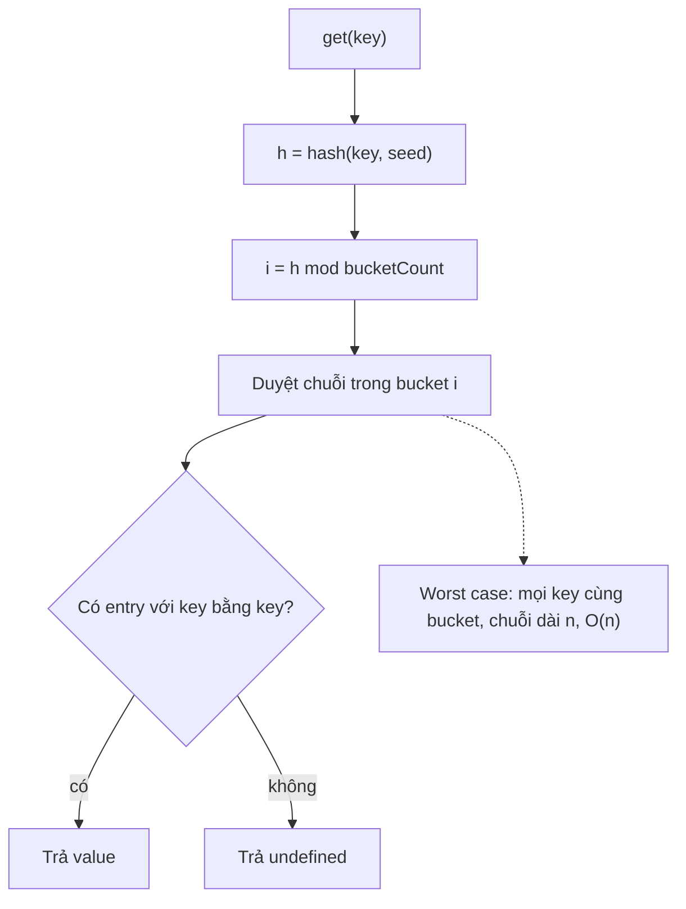
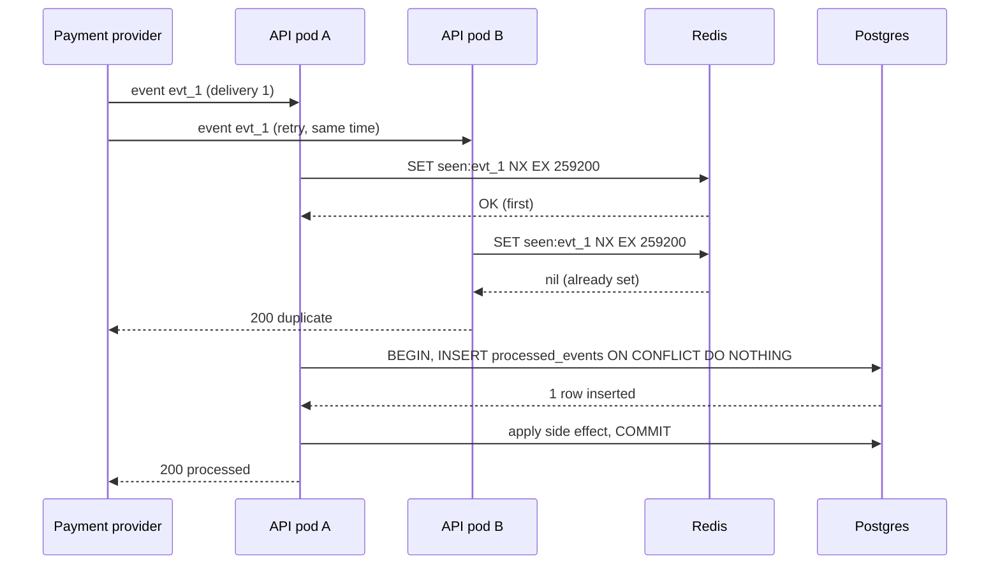

## Bối cảnh & vấn đề

Hash map là cấu trúc dữ liệu được dùng nhiều nhất trong code backend: index theo id, dedupe, đếm tần suất, cache, gom nhóm. Chính vì dùng nhiều nên những hiểu lầm nhỏ về nó gây ra những bug rất khó chịu. Ba câu chuyện thật thường gặp:

Một API trả danh sách sản phẩm theo thứ tự "nổi bật". Backend gom kết quả vào `const byId: Record<string, Product> = {}` rồi trả `Object.values(byId)`. Frontend thấy thứ tự bị xáo: sản phẩm có id số nhỏ luôn nhảy lên đầu. Không ai sắp xếp lại cả; chính **đặc tả của object** quy định key dạng số nguyên được liệt kê trước.

Một endpoint đếm tag do người dùng gửi lên bằng `counts[tag] = (counts[tag] ?? 0) + 1`. Có người gửi tag `constructor` và `__proto__`. Kết quả trả về chứa chuỗi `"function Object() { [native code] }1"`, còn tag `__proto__` biến mất không dấu vết. Trong trường hợp tệ hơn (merge object đệ quy), cùng lỗ hổng đó thành **prototype pollution**.

Một service xử lý webhook thanh toán dùng `if (!(await db.exists(eventId))) { charge(); await db.insert(eventId); }`. Nhà cung cấp retry, ba bản giao cùng một event đến gần như cùng lúc, và khách bị trừ tiền ba lần.

Bài này đi từ cơ chế bên trong của hash table (vì sao trung bình O(1), khi nào suy biến về O(n)), qua lựa chọn `Map`/`Object`/`Set` trong JavaScript, tới hai lớp tấn công "đẩy thuật toán vào worst case" (HashDoS và ReDoS), và cuối cùng là cách dedupe **chính xác** ở quy mô 5.000 event/giây.

## Khái niệm

### Hash table: hash function, bucket và collision

**Hash table** lưu cặp key → value trong một mảng các **bucket**. Để tìm vị trí của key, ta tính **hash function** `h(key)` ra một số nguyên, rồi lấy `h(key) mod số_bucket` làm chỉ số bucket. Nếu hash function rải key đều, mỗi bucket chỉ có trung bình vài phần tử, nên `get`/`set`/`delete` là **O(1) trung bình**.

**Collision** xảy ra khi hai key khác nhau rơi vào cùng bucket. Có hai cách xử lý chính. **Separate chaining**: mỗi bucket là một danh sách, key va chạm được nối vào danh sách. **Open addressing**: nếu bucket đã có người, dò sang bucket kế tiếp theo một quy tắc (linear probing, quadratic probing). Engine V8 dùng open addressing cho dictionary nội bộ, và `Map`/`Set` dùng một cấu trúc dạng "ordered hash table" (verify chi tiết cài đặt).

**Load factor** là tỉ lệ số phần tử trên số bucket. Khi load factor vượt ngưỡng (thường khoảng 0,5–0,75), bảng được **rehash**: cấp phát mảng bucket lớn gấp đôi và chèn lại mọi phần tử. Giống dynamic array, rehash là O(n) nhưng hiếm, nên chi phí được amortize thành O(1) mỗi lần chèn (xem [Big-O thực dụng](/tracks/dsa/learn/big-o-practical)).

**Interview angle:** câu "hash map là O(1) phải không?" chờ đợi câu trả lời "O(1) **trung bình** với hash function tốt; worst case O(n) khi mọi key va chạm".

### `Map`: hash map đúng nghĩa cho dữ liệu động

`Map` là hash map chuẩn của JavaScript từ ES2015. Nó có bốn đặc tính quan trọng. Key có thể là **bất kỳ kiểu nào** (object, function, number) và được so sánh bằng thuật toán SameValueZero, nên `1` và `"1"` là hai key khác nhau, còn `NaN` bằng `NaN`. Nó **giữ thứ tự chèn**: duyệt `map.keys()` luôn theo thứ tự key được thêm lần đầu. `map.size` là O(1). Và nó không dính gì tới prototype: key `"__proto__"` chỉ là một chuỗi như mọi chuỗi khác.

Thứ tự chèn là tính năng mà nhiều người bỏ qua nhưng cực kỳ hữu ích: nó cho phép cài [LRU cache](/tracks/dsa/learn/lru-lfu-caching) chỉ bằng một `Map` (xoá rồi set lại để đưa key về cuối, lấy key đầu tiên để evict). Nhược điểm duy nhất đáng kể: `JSON.stringify(map)` cho ra `{}`; muốn serialize phải dùng `Object.fromEntries(map)` hoặc `[...map]`.

```ts
const m = new Map<unknown, string>([[1, "number"], ["1", "string"]]);
console.log(m.size, m.get(1), m.get("1")); // 2 number string
```

**Interview angle:** trả lời "mặc định dùng `Map` cho mọi hash map có key động" kèm lý do (kiểu key, thứ tự, prototype) là đủ điểm.

### Object: record có shape cố định, và thứ tự key đặc biệt

Plain object chỉ nhận key **string hoặc symbol**; mọi thứ khác bị ép sang chuỗi (`obj[1]` và `obj["1"]` là một). Object phù hợp nhất cho **record có shape cố định** (một DTO `{ id, name, price }`), vì V8 tối ưu mạnh các object cùng "hidden class". Khi dùng object làm hash map với hàng nghìn key động, V8 chuyển nó sang "dictionary mode", chậm hơn và không có lợi thế gì so với `Map`.

Thứ tự key của object được đặc tả (ECMAScript `OrdinaryOwnPropertyKeys`) như sau: trước hết là các key dạng **array index** (chuỗi biểu diễn số nguyên từ 0 tới 2³² − 2) theo thứ tự **số tăng dần**, sau đó là các key chuỗi còn lại theo **thứ tự chèn**, cuối cùng là symbol theo thứ tự chèn. Vì vậy một object keyed theo id số sẽ tự "sắp xếp lại" theo id, bất kể bạn chèn theo thứ tự nào.

**Interview angle:** câu hỏi output "`Object.keys` in gì" kiểm tra đúng quy tắc integer-key-trước; nêu được hệ quả với API trả dữ liệu có thứ tự là điểm cộng.

### `Set` và các phép toán tập hợp

`Set` là hash set: lưu các giá trị duy nhất, `has`/`add`/`delete` O(1) trung bình, giữ thứ tự chèn. Hai use case kinh điển: **dedupe** (`[...new Set(ids)]`) và **membership test** thay cho `arr.includes` trong vòng lặp.

Từ ES2025, `Set.prototype` có các phép toán tập hợp: `union`, `intersection`, `difference`, `symmetricDifference`, `isSubsetOf`, `isSupersetOf`, `isDisjointFrom`. Node.js 22+ hỗ trợ sẵn (verify với runtime của bạn). Trước đó, bạn phải tự viết bằng `filter` + `has`.

```ts
const a = new Set(["read", "write", "delete"]);
const b = new Set(["read", "export"]);
console.log([...a.union(b)], [...a.intersection(b)], [...a.difference(b)]);
// [ 'read', 'write', 'delete', 'export' ] [ 'read' ] [ 'write', 'delete' ]
```

**Interview angle:** "tính quyền chung của hai role" hay "user mất quyền gì sau khi đổi role" là bài toán tập hợp; dùng `Set` thay vì hai vòng lặp lồng nhau.

### Prototype pollution: vì sao key từ user không được làm key của object

Mọi object thường đều kế thừa từ `Object.prototype`. Khi đọc `obj["constructor"]` trên một object không có key đó, JavaScript đi lên prototype và trả về hàm `Object`. Khi gán `obj["__proto__"] = value`, bạn không tạo key mà gọi **setter** thay đổi prototype của object (gán một số nguyên thì bị bỏ qua lặng lẽ). Nếu key đến từ user, cả hai đều là bug; và trong các hàm merge/set đệ quy kiểu `set(obj, "__proto__.isAdmin", true)`, attacker ghi được thuộc tính lên **`Object.prototype`**, làm mọi object trong process có `isAdmin === true`. Đó là **prototype pollution**.

Ba cách phòng: dùng `Map` cho key động; nếu buộc dùng object, tạo bằng `Object.create(null)` (không có prototype); và validate/chặn các key `__proto__`, `constructor`, `prototype` trong mọi hàm merge sâu.

**Interview angle:** interviewer muốn nghe nối "key từ user" với "prototype pollution" và biện pháp cụ thể, không chỉ "object chậm hơn Map".

### Worst case như một vector tấn công: HashDoS và ReDoS

**Algorithmic complexity attack** là khi attacker cố tình gửi input làm thuật toán chạy ở **worst case**. Với hash table, worst case là mọi key rơi vào cùng bucket: mỗi lần chèn phải so sánh với mọi key đã có, n lần chèn thành O(n²). Năm 2011, một nhóm nghiên cứu công bố rằng PHP, Java, Python, Ruby và ASP.NET đều dùng hash function **dự đoán được** cho chuỗi; một POST form vài trăm KB với hàng chục nghìn tên field va chạm có thể giữ một CPU core 100% trong nhiều giây. Đó là **HashDoS**.

Phòng thủ có ba lớp. Một, **hash function có seed ngẫu nhiên** mỗi process (Python từ 3.3 bật hash randomization mặc định và dùng SipHash từ 3.4; V8 cũng khởi tạo hash seed ngẫu nhiên (verify)), nên attacker không tính trước được key nào va chạm. Hai, **giới hạn input**: kích thước body, số field (`qs`/body-parser của Express mặc định giới hạn 1.000 parameter cho urlencoded (verify)). Ba, **cấu trúc chống suy biến**: Java 8 `HashMap` chuyển bucket có từ 8 phần tử trở lên thành cây đỏ-đen, nên worst case của bucket là O(log n) thay vì O(n).

**ReDoS** (Regular expression Denial of Service) là cùng ý tưởng với regex. Engine regex của JavaScript là **backtracking**: khi một nhánh match thất bại, nó quay lui thử cách chia khác. Pattern có **quantifier lồng nhau** như `([a-z0-9]+)*` cho phép chia một chuỗi n ký tự theo 2ⁿ⁻¹ cách; với input gần khớp nhưng thất bại ở cuối, engine thử **tất cả**. Vì regex chạy đồng bộ trên main thread, một request làm treo cả process Node.js.

**Interview angle:** cả hai câu đều kiểm tra một ý: "Big-O worst case không phải lý thuyết suông khi input đến từ internet"; nêu được biện pháp ở nhiều tầng (proxy, framework, code) là câu trả lời senior.

### Dedupe chính xác: hash set so với unique constraint

**Dedupe** là trả lời câu hỏi "đã thấy id này chưa". Trong một process, `Set` là đủ. Nhưng với webhook thanh toán, yêu cầu là **chính xác tuyệt đối** (không bỏ sót event thật, không xử lý hai lần), dữ liệu phải **bền** qua restart, và phải **đúng khi có nhiều pod** nhận cùng event song song. Một `Set` in-memory không đáp ứng cả ba.

Nguồn sự thật phải là database: bảng `processed_events(event_id PRIMARY KEY)` với **unique constraint**, và thao tác "insert nếu chưa có" là **atomic** (`INSERT ... ON CONFLICT DO NOTHING RETURNING event_id`), thực hiện **cùng transaction** với side effect ghi DB. Unique index bên dưới chính là một cấu trúc tìm kiếm (B-tree) được database bảo vệ bằng lock, nên hai transaction không thể cùng chèn một key. Redis `SET key 1 NX EX <ttl>` là lớp chặn nhanh phía trước; Bloom filter chỉ trả lời chắc chắn được câu "**chưa** thấy", nên không bao giờ được dùng một mình để bỏ qua event (xem [Bloom filter & HyperLogLog](/tracks/dsa/learn/probabilistic-sharding)).

**Interview angle:** red flag là "check tồn tại rồi insert" (check-then-act); interviewer chờ bạn nói "để constraint của DB làm phép dedupe atomic".

## Cơ chế hoạt động

Luồng `get(key)` trong một hash table chaining, và chỗ nó suy biến:



Bước 1 tính hash; với seed ngẫu nhiên, cùng một chuỗi cho ra hash khác nhau ở mỗi process, nên attacker không dựng sẵn được tập key va chạm. Bước 2 đưa hash về chỉ số bucket. Bước 3 là nơi chi phí thật nằm: so sánh key với từng entry trong bucket. Khi phân phối đều, bucket có trung bình load factor entry (dưới 1), nên chi phí là hằng số. Khi attacker kiểm soát phân phối, bucket có n entry và mỗi thao tác là O(n).

Luồng dedupe webhook đúng, khi nhiều bản giao đến song song ở nhiều pod:



Redis là bộ lọc nhanh: phần lớn duplicate bị chặn ở đây với chi phí sub-ms. Nhưng Redis không phải nguồn sự thật: key có thể mất khi Redis failover hoặc bị evict, và nếu pod A crash sau khi `SET NX` nhưng trước khi commit, event sẽ bị coi là "đã thấy" dù chưa xử lý. Vì vậy chiến lược an toàn là: nếu xử lý thất bại, xoá key Redis (hoặc chỉ set key **sau** khi commit), và luôn để unique constraint trong Postgres quyết định cuối cùng. Insert vào `processed_events` và side effect nằm trong **cùng transaction**: hoặc cả hai được commit, hoặc không cái nào.

## Ví dụ thực tế

### Thứ tự key: Object so với Map

```ts
const o: Record<string, string> = {};
o["b"] = "x"; o["10"] = "y"; o["a"] = "z"; o["2"] = "w";
console.log(Object.keys(o));

const m = new Map<string, string>([["b", "x"], ["10", "y"], ["a", "z"], ["2", "w"]]);
console.log([...m.keys()]);
```

Output:

```text
[ '2', '10', 'b', 'a' ]
[ 'b', '10', 'a', '2' ]
```

Object liệt kê `'2'` và `'10'` trước (thứ tự số), rồi mới tới `'b'`, `'a'` theo thứ tự chèn. `Map` giữ nguyên thứ tự chèn. Nếu bạn cài LRU trên plain object với key là id số, "key cũ nhất" theo `Object.keys` thực ra là **id nhỏ nhất**, và cache evict sai phần tử. Với API cần giữ thứ tự, trả **mảng**; JSON object không mang ý nghĩa thứ tự đáng tin cho bên nhận.

### Key từ user trên object thường

```ts
const words = ["hello", "__proto__", "constructor", "hello"];
const counts: Record<string, number> = {};
for (const w of words) counts[w] = (counts[w] ?? 0) + 1;
console.log("object:", JSON.stringify(counts), "| constructor =", typeof counts["constructor"]);

const safe = new Map<string, number>();
for (const w of words) safe.set(w, (safe.get(w) ?? 0) + 1);
console.log("map:", [...safe]);

const bare: Record<string, number> = Object.create(null);
for (const w of words) bare[w] = (bare[w] ?? 0) + 1;
console.log("null-proto:", Object.entries(bare));
```

Output:

```text
object: {"hello":2,"constructor":"function Object() { [native code] }1"} | constructor = string
map: [ [ 'hello', 2 ], [ '__proto__', 1 ], [ 'constructor', 1 ] ]
null-proto: [ [ 'hello', 2 ], [ '__proto__', 1 ], [ 'constructor', 1 ] ]
```

Với object thường, `counts["constructor"]` ban đầu không phải `undefined` mà là hàm `Object` kế thừa, nên `?? 0` không kích hoạt và phép `+ 1` nối chuỗi. `counts["__proto__"] = ...` đi vào setter prototype và bị bỏ qua, nên tag đó **mất**. `Map` và `Object.create(null)` đều đếm đúng.

### HashDoS thu nhỏ: hash yếu so với hash có seed

Một hash table chaining 1.024 bucket, hash yếu là "tổng mã ký tự". Ta dựng 4.096 key khác nhau nhưng có **cùng tổng** (mỗi key ghép 12 cặp `"az"` hoặc `"by"`, hai cặp có cùng tổng mã 219):

```ts
const weak = (s: string) => { let h = 0; for (const c of s) h += c.charCodeAt(0); return h; };
const seed = 0x9e3779b1;
const seeded = (s: string) => {
  let h = seed;
  for (let i = 0; i < s.length; i++) { h ^= s.charCodeAt(i); h = Math.imul(h, 16777619); }
  return h >>> 0;
};
const evil = Array.from({ length: 4096 }, (_, i) =>
  [...i.toString(2).padStart(12, "0")].map((b) => (b === "0" ? "az" : "by")).join(""));

class ChainedTable {
  private buckets: string[][];
  probes = 0;
  constructor(size: number, private hash: (s: string) => number) {
    this.buckets = Array.from({ length: size }, () => []);
  }
  insert(key: string) {
    const b = this.buckets[this.hash(key) % this.buckets.length];
    for (const k of b) { this.probes++; if (k === key) return; }
    b.push(key);
  }
}
console.log("same weak hash?", new Set(evil.map(weak)).size === 1, "distinct keys:", new Set(evil).size);
for (const [name, h] of [["weak", weak], ["seeded", seeded]] as const) {
  const t = new ChainedTable(1024, h);
  for (const k of evil) t.insert(k);
  console.log(`${name}: ${evil.length} inserts -> ${t.probes} probes (${(t.probes / evil.length).toFixed(1)} per insert)`);
}
```

Output:

```text
same weak hash? true distinct keys: 4096
weak: 4096 inserts -> 8386560 probes (2047.5 per insert)
seeded: 4096 inserts -> 17780 probes (4.3 per insert)
```

Với hash yếu, mọi key vào một bucket: 4.096 lần chèn tốn 8,4 triệu phép so sánh (đúng n(n−1)/2), tức O(n²). Với hash có seed, trung bình 4,3 phép so sánh mỗi lần chèn (load factor 4 trên 1.024 bucket). Nhân quy mô lên 100.000 field trong một request, bản yếu là 5 tỉ phép so sánh: đủ để treo một CPU core hàng chục giây.

### ReDoS: đo catastrophic backtracking

```ts
const EVIL = /^([a-zA-Z0-9]+)*@example\.com$/;
const SAFE = /^[a-zA-Z0-9]+@example\.com$/;
for (const n of [24, 28, 30, 32, 34, 36]) {
  const input = "a".repeat(n) + "!";
  let t = performance.now(); EVIL.test(input); const evil = performance.now() - t;
  t = performance.now(); SAFE.test(input); const safe = performance.now() - t;
  console.log(`n=${n}: nested ${evil.toFixed(0)}ms, flat ${safe.toFixed(2)}ms`);
}
```

Output thật trên Node 24:

```text
n=24: nested 1ms, flat 0.01ms
n=28: nested 6ms, flat 0.05ms
n=30: nested 21ms, flat 0.00ms
n=32: nested 88ms, flat 0.00ms
n=34: nested 338ms, flat 0.00ms
n=36: nested 1329ms, flat 0.00ms
```

Mỗi hai ký tự thêm vào, thời gian tăng khoảng bốn lần: tăng trưởng mũ. Ở 36 ký tự, một lời gọi `test` chặn event loop 1,3 giây; ở 40 ký tự là khoảng 20 giây. Pattern phẳng `[a-zA-Z0-9]+` diễn đạt **đúng cùng ngôn ngữ** nhưng chỉ có một cách match, nên luôn tuyến tính. Để phát hiện trong production: CPU profile (`node --cpu-prof`) cho thấy thời gian nằm trong frame của regex engine; event loop lag tăng vọt; request timeout hàng loạt trên cùng pod. Để phòng: lint (`eslint-plugin-regexp`, `safe-regex`), giới hạn độ dài input **trước** khi match, hoặc dùng engine linear-time như RE2 (binding `re2`) cho pattern do người dùng cung cấp.

### Dedupe webhook: check-then-insert so với insert-first

```ts
async function handleCheckThenInsert(id: string) {
  if (await db.exists(id)) return "dup";
  charges++;                 // side effect
  await db.insert(id);
  return "done";
}
async function handleInsertFirst(id: string) {
  // INSERT INTO processed_events(event_id) VALUES ($1) ON CONFLICT DO NOTHING RETURNING event_id
  if (!(await db.insertIfAbsent(id))) return "dup";
  charges++;                 // in real code: same DB transaction as the insert
  return "done";
}
// three deliveries of evt_1 arrive together
await Promise.all([h("evt_1"), h("evt_1"), h("evt_1")]);
```

Output:

```text
check-then-insert: results=done,done,done charges=3
insert-first: results=done,dup,dup charges=1
ids in 3-day window: 1.30 billion, ~52 GB at 40 bytes/id
```

Ngay cả trong một process Node.js đơn luồng, check-then-insert cũng hỏng: cả ba handler `await exists()` trước khi bất kỳ ai `insert`, nên cả ba thấy "chưa có". Nhiều pod thì còn tệ hơn. Insert-first biến phép kiểm tra và phép ghi thành **một thao tác atomic** do database bảo đảm. Dòng cuối là phép tính dung lượng: 5.000 event/giây × 3 ngày ≈ 1,3 tỉ id; với khoảng 40 byte mỗi id (UUID + overhead), đó là hàng chục GB. Vì vậy bảng dedupe nên **partition theo ngày** để xoá partition cũ bằng `DROP` (rẻ) thay vì `DELETE` hàng tỉ row, và Redis key phải có TTL.

## Trade-offs & lựa chọn thay thế

| Tiêu chí | `Map` | Plain object | `Object.create(null)` | `Set` |
| --- | --- | --- | --- | --- |
| Kiểu key | Bất kỳ (SameValueZero) | string/symbol (số bị ép) | string/symbol | Bất kỳ (chỉ value) |
| Thứ tự duyệt | Thứ tự chèn | Integer key tăng dần trước, rồi thứ tự chèn | Như object | Thứ tự chèn |
| `size` | O(1) | `Object.keys().length` O(n) | O(n) | O(1) |
| Rủi ro prototype | Không | Có (`__proto__`, `constructor`) | Không | Không |
| JSON | Cần `Object.fromEntries` | Trực tiếp | Trực tiếp | Cần `[...set]` |
| Hợp với | Hash map động, cache, index | Record shape cố định, DTO | Dictionary cần JSON | Dedupe, membership |

Khi nào chọn cái nào. `Map` là mặc định cho mọi tra cứu theo key động, đặc biệt khi key không phải chuỗi, khi cần thứ tự chèn, hoặc khi key đến từ bên ngoài. Plain object dành cho dữ liệu có shape biết trước (payload, config, DTO), nơi V8 tối ưu hidden class và JSON là tự nhiên. `Object.create(null)` là lựa chọn trung gian khi bạn cần một dictionary serialize thẳng ra JSON mà vẫn an toàn với key lạ. `Set` cho mọi câu hỏi "có hay không" và dedupe.

Với dedupe **phân tán**, bảng so sánh khác: `Set` in-memory (nhanh, mất khi restart, không chia sẻ giữa pod), Redis `SET NX EX` (nhanh, chia sẻ, có thể mất key khi failover/evict), unique constraint trong DB (chậm hơn nhưng **bền và atomic**, là nguồn sự thật), Bloom filter (rất ít memory, có false positive, chỉ dùng để trả lời nhanh "chắc chắn chưa thấy"). Hệ thống thật thường xếp chúng thành tầng: Redis phía trước, DB quyết định.

## Edge cases & failure modes

- **`get` trả `undefined` nhưng key tồn tại**: value lưu là `undefined`. Dùng `map.has(key)` khi `undefined` là giá trị hợp lệ, hoặc tránh lưu `undefined`.
- **Object làm key của `Map`**: so sánh theo **tham chiếu**. `map.set({ id: 1 }, v)` rồi `map.get({ id: 1 })` trả `undefined`. Dùng key nguyên thuỷ (id, chuỗi ghép `${tenant}:${id}`).
- **Memory leak qua `Map` dài hạn**: cache không giới hạn giữ object mãi. Dùng LRU có giới hạn, hoặc `WeakMap` khi key là object và bạn muốn GC tự dọn.
- **Mutation khi duyệt**: xoá key đang duyệt trong `for...of map` là an toàn theo đặc tả; thêm key mới trong lúc duyệt sẽ khiến key đó cũng được duyệt, dễ thành vòng lặp dài.
- **HashDoS qua JSON**: `JSON.parse` dựng object với key do attacker chọn. Giới hạn kích thước body ở reverse proxy (nginx `client_max_body_size`) và framework (`express.json({ limit: "100kb" })`), và giới hạn số field khi có thể.
- **ReDoS trong validator**: regex email/URL copy trên mạng thường có quantifier lồng. Chạy pattern qua lint, giới hạn độ dài input (email ≤ 254 ký tự) trước khi match.
- **Redis mất key dedupe**: sau failover hoặc khi `maxmemory` evict, duplicate lọt qua lớp Redis. Nếu DB constraint vẫn đứng sau, hệ thống vẫn đúng; nếu không, bạn xử lý trùng.
- **Side effect ngoài DB không có idempotency key**: unique constraint không bảo vệ được một HTTP call ra ngoài. Cần outbox pattern hoặc ghi trạng thái "đang gọi" rồi đối soát, vì exactly-once qua ranh giới hệ thống là không có.

## Pitfalls

- ❌ `const cache: Record<string, V> = {}` cho key động → ✅ `new Map<K, V>()`, vì key không bị ép kiểu, giữ thứ tự chèn và không dính prototype.
- ❌ Dựa vào thứ tự `Object.keys` của object keyed theo id số → ✅ trả mảng hoặc dùng `Map`, vì integer key luôn được liệt kê trước theo thứ tự số.
- ❌ Merge sâu object từ request (`merge(target, req.body)`) mà không chặn `__proto__`/`constructor` → ✅ validate schema (zod), dùng `Map`/`Object.create(null)`, hoặc thư viện đã vá prototype pollution.
- ❌ Regex có quantifier lồng `(x+)*`, `(a|aa)+` trên input người dùng → ✅ viết lại phẳng, giới hạn độ dài, lint, hoặc dùng RE2.
- ❌ Không giới hạn body/field count vì "hash map là O(1)" → ✅ giới hạn ở proxy và framework, vì worst case là O(n²) khi attacker chọn key.
- ❌ `if (!exists) { process(); insert(); }` để dedupe → ✅ `INSERT ... ON CONFLICT DO NOTHING RETURNING` trong cùng transaction với side effect.
- ❌ Dùng Bloom filter để bỏ qua event "có thể đã thấy" → ✅ Bloom chỉ để khẳng định "chắc chắn chưa thấy"; nguồn sự thật là unique constraint.

## Tóm tắt

- Hash table: hash → bucket → so sánh trong bucket; O(1) **trung bình** nhờ phân phối đều và rehash amortized, O(n) worst case khi mọi key va chạm.
- `Map` là mặc định cho key động: kiểu key bất kỳ, giữ thứ tự chèn, `size` O(1), không có rủi ro prototype. Object dành cho record shape cố định.
- Object liệt kê **integer key trước theo thứ tự số**, sau đó string key theo thứ tự chèn; đừng dựa vào nó để giữ thứ tự dữ liệu.
- Key từ user trên object thường gây bug (`constructor`) hoặc prototype pollution (`__proto__`); dùng `Map`, `Object.create(null)` và validate.
- HashDoS và ReDoS là tấn công đẩy thuật toán vào worst case; phòng bằng hash có seed, giới hạn input, cấu trúc chống suy biến, regex không lồng quantifier.
- Dedupe chính xác phân tán: unique constraint + `INSERT ... ON CONFLICT` cùng transaction với side effect; Redis `SET NX EX` là lớp nhanh, Bloom filter chỉ là tối ưu phụ.
