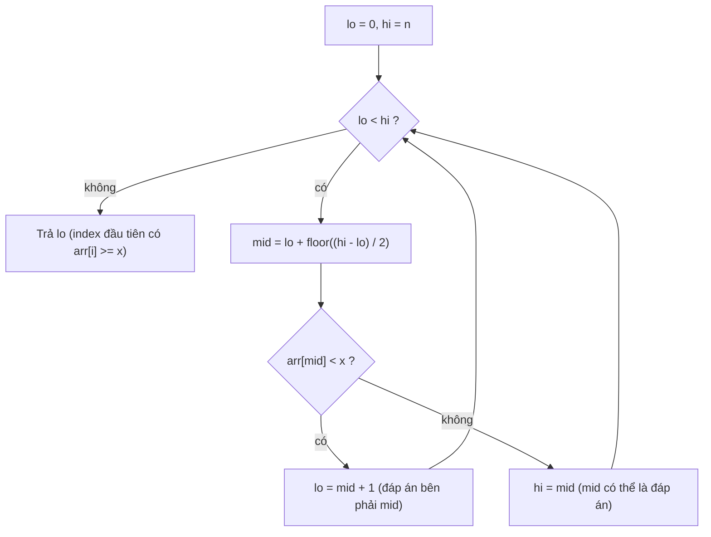
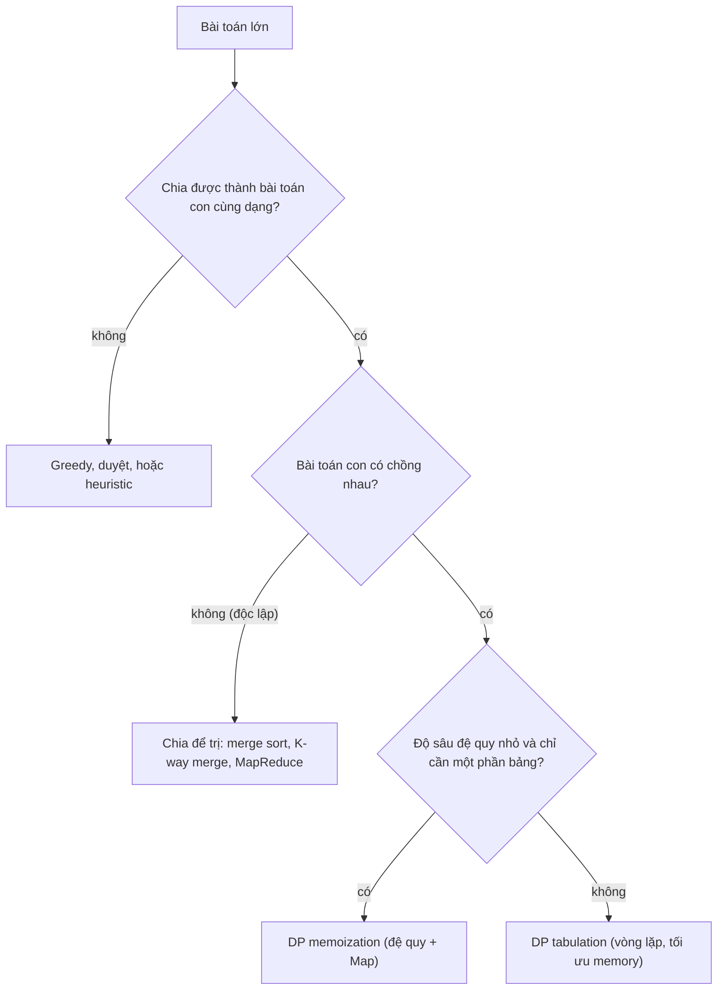

## Bối cảnh & vấn đề

Một bảng xếp hạng doanh số hiển thị `[1, 10, 100, 9]` triệu đồng theo thứ tự "tăng dần". Một màn hình lịch ca làm việc cho phép xếp hai ca `9:00–12:00` và `11:00–14:00` cho cùng một nhân viên. Một pricing engine cho ra tổng tiền giỏ hàng khác nhau giữa hai pod với **cùng** một giỏ. Ba bug này không liên quan tới nhau về nghiệp vụ, nhưng cùng một gốc: code dựa vào **thứ tự** mà không hiểu thứ tự đó được tạo ra thế nào.

Thứ tự là tài nguyên mạnh nhất trong thuật toán. Dữ liệu đã sắp xếp cho phép tìm kiếm O(log n) thay vì O(n), gộp các khoảng chồng lấn trong một lượt, phân trang bằng keyset, và phát hiện xung đột bằng cách chỉ so với "hàng xóm". Nhưng để có thứ tự, bạn phải sort đúng: comparator đúng, hiểu stability, và biết khi nào sort chuỗi cần quy tắc ngôn ngữ.

Bài này đi qua bốn công cụ xoay quanh thứ tự và cách chia nhỏ bài toán: **sort** trong JavaScript, **binary search** (trên mảng và trên "không gian đáp án"), **interval** (gộp và kiểm tra xung đột), và hai chiến lược giải bài toán lớn bằng bài toán nhỏ: **chia để trị** (divide & conquer) và **quy hoạch động** (dynamic programming). Phần cuối áp dụng tất cả vào một pricing engine phải cho kết quả **deterministic**.

## Khái niệm

### Sort mặc định so sánh chuỗi

`Array.prototype.sort()` không truyền comparator sẽ chuyển mọi phần tử sang **chuỗi** rồi so sánh theo thứ tự code unit UTF-16. Vì `"10" < "9"` (ký tự `'1'` nhỏ hơn `'9'`), `[10, 9, 1, 100].sort()` cho `[1, 10, 100, 9]`. Đây không phải bug của engine mà là hành vi được đặc tả, có từ khi JavaScript còn chủ yếu sort chuỗi.

**Comparator** là hàm `(a, b) => number`: âm nếu `a` đứng trước, dương nếu `b` đứng trước, `0` nếu tương đương. Với số, `(a, b) => a - b`. Comparator phải **nhất quán**: nếu `a < b` và `b < c` thì `a < c`, và `cmp(a, b)` phải ngược dấu với `cmp(b, a)`. Viết `(a, b) => a > b` trả về boolean, bị ép thành `1` hoặc `0`, không bao giờ âm; thuật toán sort nhận được thông tin sai và kết quả phụ thuộc vào thuật toán cụ thể: đôi khi "có vẻ đúng" với mảng nhỏ, sai với mảng khác.

Hai chi tiết nữa: `sort` **mutate** mảng gốc (và trả về chính mảng đó), nên sort một mảng nhận từ props hay từ cache dùng chung là bug. ES2023 thêm `toSorted()` trả mảng mới. Chuỗi có dấu (tiếng Việt, tiếng Đức) cần `localeCompare` hoặc `Intl.Collator`, vì thứ tự code unit đặt `"Ân"` sau `"Dung"`.

**Interview angle:** câu hỏi `[10, 9, 1, 100].sort()` là gotcha kinh điển; điểm cộng là giải thích **vì sao** `(a, b) => a > b` hỏng chứ không chỉ nói "phải trừ".

### Stability và TimSort

Một thuật toán sort là **stable** nếu các phần tử bằng nhau giữ nguyên thứ tự tương đối ban đầu. Từ ES2019, đặc tả yêu cầu `Array.prototype.sort` phải stable; V8 đáp ứng bằng cách chuyển sang **TimSort** từ V8 7.0 (Chrome 70). TimSort là hybrid của merge sort và insertion sort: nó tìm các đoạn đã sắp xếp sẵn ("run") trong dữ liệu thật, sort các đoạn ngắn bằng insertion sort, rồi merge. Worst case O(n log n), và gần O(n) với dữ liệu gần như đã sắp xếp, rất phổ biến ngoài đời (log theo thời gian, danh sách đã sort rồi thêm vài phần tử).

Stability có ứng dụng trực tiếp: **sort nhiều khoá** bằng cách sort lần lượt từ khoá **phụ** đến khoá **chính**. Muốn danh sách theo `status`, cùng status thì theo `name`: sort theo `name` trước, rồi sort theo `status`. Cách thứ hai là comparator kết hợp: `(a, b) => a.status.localeCompare(b.status) || a.name.localeCompare(b.name)`.

**Interview angle:** biết "stable từ ES2019, V8 dùng TimSort" và dùng stability để sort đa khoá là dấu hiệu bạn đọc spec, không chỉ đọc StackOverflow.

### Binary search: điều kiện là tính đơn điệu

**Binary search** tìm trong một không gian có thứ tự bằng cách mỗi bước loại bỏ một nửa, nên chỉ cần O(log n) bước: 1 triệu phần tử chỉ cần khoảng 20 bước. Điều kiện thật sự không phải "mảng đã sort" mà là một **predicate đơn điệu**: tồn tại một điểm chia sao cho predicate sai với mọi phần tử bên trái và đúng với mọi phần tử bên phải (false … false true … true). Mảng sort chỉ là một trường hợp: predicate `arr[i] >= x` đơn điệu trên mảng tăng dần.

Nhờ góc nhìn đó, binary search áp dụng được ở nhiều nơi không có mảng nào. **`git bisect`**: predicate "commit này có bug" đơn điệu theo lịch sử (giả sử bug xuất hiện từ một commit và không biến mất), nên 1.000 commit chỉ cần khoảng 10 lần build/test. **Tìm cấu hình tối ưu**: "batch size X có hoàn thành dưới timeout không" đúng với X nhỏ và sai với X lớn, nên tìm batch size lớn nhất bằng binary search thay vì thử tuần tự. **Database**: B-tree index là binary search nhiều nhánh trên disk, và keyset pagination `WHERE (created_at, id) < ($1, $2)` là tìm vị trí bắt đầu trong thứ tự của index (xem [B+tree & pagination](/tracks/dsa/learn/ordered-structures-pagination)).

**Interview angle:** "hãy cho hai ví dụ binary search ngoài mảng" chờ `git bisect` và "binary search trên đáp án"; và luôn có follow-up viết lower bound không off-by-one.

### Lower bound và bất biến vòng lặp

**Lower bound** trả về chỉ số đầu tiên `i` có `arr[i] >= x` (hoặc `arr.length` nếu không có). Nó hữu ích hơn "tìm đúng x" vì trả lời được cả "chèn x vào đâu để mảng vẫn sort", "phần tử nhỏ nhất ≥ x", và đếm số phần tử trong một khoảng (`lowerBound(hi) − lowerBound(lo)`).

Cách viết không sai là giữ một **bất biến** rõ ràng: đáp án luôn nằm trong `[lo, hi)`. Nếu `arr[mid] < x` thì đáp án ở bên phải `mid`, gán `lo = mid + 1`; ngược lại `mid` có thể là đáp án, gán `hi = mid`. Vòng lặp dừng khi `lo === hi`. Hai lỗi kinh điển: dùng `hi = mid - 1` với khoảng nửa mở (bỏ sót đáp án), và khi tìm "giá trị lớn nhất thoả" mà tính `mid` làm tròn xuống rồi gán `lo = mid` (vòng lặp vô hạn khi `hi = lo + 1`).

**Interview angle:** interviewer chấm việc bạn nói ra bất biến trước khi viết code; đó là cách phân biệt người "thuộc" với người "hiểu".

### Interval: half-open, gộp và phát hiện chồng lấn

**Interval** là một khoảng `[start, end)`. Nên dùng **half-open** (bao gồm start, không bao gồm end) cho thời gian: ca `[9, 12)` và `[12, 15)` nối tiếp nhau mà **không** chồng, độ dài là `end − start`, và chia một ngày thành các khoảng liên tiếp không có khe hở hay trùng lặp. Với khoảng đóng `[9, 12]` và `[12, 15]`, điểm 12 thuộc cả hai, gây nhập nhằng.

Hai khoảng half-open `[a, b)` và `[c, d)` **chồng nhau** khi và chỉ khi `a < d && c < b`. Công thức này phủ mọi trường hợp (lồng nhau, chồng một phần, trùng khít) và dễ nhớ hơn liệt kê bốn case. **Gộp** danh sách interval: sort theo `start` (O(n log n)), rồi quét một lượt, nếu khoảng tiếp theo bắt đầu trước khi khoảng hiện tại kết thúc thì kéo dài `end`, ngược lại mở khoảng mới. Sau khi sort, chỉ cần so với khoảng **cuối** trong kết quả vì mọi khoảng trước đó đã kết thúc sớm hơn.

**Kiểm tra xung đột** của một ca mới với danh sách ca đã sort và không chồng nhau: binary search vị trí chèn theo `start`, rồi chỉ so với khoảng ngay trước và ngay sau, O(log n). Trong database, PostgreSQL có **range type** (`tstzrange`) và **exclusion constraint** `EXCLUDE USING gist (employee_id WITH =, shift WITH &&)` để chính DB từ chối hai ca chồng nhau, kể cả khi hai request ghi đồng thời (cần extension `btree_gist` cho cột `=` thường).

**Interview angle:** follow-up "hai manager cùng lúc xếp ca chồng nhau" kiểm tra bạn có biết check trong app là race condition, và lời giải đúng là constraint của DB hoặc lock.

### Chia để trị (divide & conquer)

**Chia để trị** giải một bài toán bằng ba bước: **chia** thành các bài toán con **độc lập** cùng dạng, **trị** từng bài toán con (thường đệ quy), rồi **kết hợp** kết quả. Merge sort là ví dụ chuẩn: chia mảng làm đôi, sort mỗi nửa, rồi merge hai nửa đã sort trong O(n). Vì có log n tầng chia và mỗi tầng tốn O(n) để merge, tổng là O(n log n). Binary search cũng là chia để trị, chỉ là mỗi bước bỏ hẳn một nửa.

Từ khoá là **độc lập**: hai nửa của merge sort không chia sẻ bài toán con nào, nên không có gì để cache. Đó là khác biệt cốt lõi với quy hoạch động. Trong hệ thống, chia để trị xuất hiện dưới dạng MapReduce (chia dữ liệu, xử lý song song, gộp), K-way merge các shard (xem [Heap & top-K](/tracks/dsa/learn/heaps-top-k)), và scatter-gather query trên nhiều partition.

**Interview angle:** "merge sort có cần memoization không?" là câu kiểm tra bạn có phân biệt được subproblem độc lập với subproblem chồng nhau.

### Quy hoạch động: memoization và tabulation

**Quy hoạch động** (DP) áp dụng khi bài toán có hai tính chất. **Optimal substructure**: lời giải tối ưu của bài toán lớn được xây từ lời giải tối ưu của bài toán con. **Overlapping subproblems**: cùng một bài toán con xuất hiện nhiều lần. Khi đó, thay vì giải lại, ta lưu kết quả mỗi bài toán con và dùng lại, biến thời gian mũ thành đa thức.

Có hai cách cài. **Memoization** (top-down): viết đệ quy tự nhiên, thêm một `Map` cache kết quả theo tham số. Ưu điểm: dễ viết từ công thức, chỉ tính những bài toán con thật sự cần. Nhược điểm: đệ quy sâu có thể tràn stack, và overhead của lời gọi hàm + `Map`. **Tabulation** (bottom-up): xác định thứ tự bài toán con từ nhỏ tới lớn, điền vào một bảng bằng vòng lặp. Ưu điểm: không đệ quy, dễ tối ưu memory (nhiều bài chỉ cần hàng trước đó). Nhược điểm: phải tính mọi ô kể cả ô không cần, và phải nghĩ ra thứ tự điền.

Ví dụ mang màu backend: **edit distance** (Levenshtein) giữa tên sản phẩm người dùng gõ và tên trong catalog, dùng cho fuzzy match "iphnoe" → "iphone"; tìm **tổ hợp gói rẻ nhất** để mua ít nhất N đơn vị (biến thể knapsack); chia các job vào batch sao cho tổng chi phí nhỏ nhất.

**Interview angle:** interviewer muốn nghe hai tính chất (optimal substructure, overlapping subproblems) và trade-off stack/memory giữa hai cách cài, không chỉ định nghĩa.

## Cơ chế hoạt động

Binary search với bất biến `[lo, hi)` cho lower bound:



Mỗi vòng, khoảng `[lo, hi)` co lại ít nhất một phần tử và khoảng một nửa, nên sau tối đa ⌈log₂(n+1)⌉ vòng thì `lo === hi`. Tính `mid = lo + floor((hi − lo) / 2)` thay vì `(lo + hi) / 2` là thói quen từ ngôn ngữ có số nguyên cố định (tránh tràn); trong JS với mảng nhỏ hơn 2⁵³ thì không tràn, nhưng thói quen này vẫn đúng. Khi `arr[mid] < x`, mọi phần tử từ `lo` tới `mid` đều `< x` nên bị loại. Khi `arr[mid] >= x`, `mid` là ứng viên, ta giữ nó bằng `hi = mid`.

Quyết định chọn chiến lược cho một bài toán "lớn":



Nhánh quan trọng nhất là câu hỏi "bài toán con có chồng nhau không". Với merge sort, nửa trái và nửa phải không bao giờ gặp lại nhau, nên cache vô ích. Với edit distance, ô `(i, j)` được dùng bởi ba ô `(i+1, j)`, `(i, j+1)`, `(i+1, j+1)`, nên không cache thì số lời gọi tăng theo cấp số mũ. Khi đã là DP, chọn memoization nếu độ sâu đệ quy nhỏ (vài nghìn) và chỉ một phần không gian trạng thái được chạm tới; chọn tabulation khi n lớn (tránh tràn stack) hoặc cần tối ưu memory.

## Ví dụ thực tế

### Sort: comparator, mutate, stability và tiếng Việt

```ts
console.log([10, 9, 1, 100].sort());
console.log([10, 9, 1, 100].sort((a, b) => a - b));
const orig = [3, 1, 2];
const sorted = orig.toSorted((a, b) => a - b);
console.log(orig, sorted);

const xs = [5, 1, 4, 2, 3, 9, 7, 8, 6, 0, 11, 10];
// @ts-expect-error boolean comparator on purpose
console.log(xs.toSorted((a, b) => a > b));

const rows = [
  { name: "Chi", status: "pending" }, { name: "An", status: "paid" },
  { name: "Binh", status: "pending" }, { name: "Dung", status: "paid" },
];
const byStatusThenName = rows
  .toSorted((a, b) => a.name.localeCompare(b.name))      // secondary key first
  .toSorted((a, b) => a.status.localeCompare(b.status)); // primary key last (stable)
console.log(byStatusThenName.map((r) => `${r.status}:${r.name}`).join(" "));

const vi = ["Đức", "Dung", "Anh", "Ân", "Bình"];
console.log(vi.toSorted(), vi.toSorted(new Intl.Collator("vi").compare));
```

Output trên Node 24:

```text
[ 1, 10, 100, 9 ]
[ 1, 9, 10, 100 ]
[ 3, 1, 2 ] [ 1, 2, 3 ]
[
   5,  1, 4, 2, 3,
   9,  7, 8, 6, 0,
  11, 10
]
paid:An paid:Dung pending:Binh pending:Chi
[ 'Anh', 'Bình', 'Dung', 'Ân', 'Đức' ] [ 'Anh', 'Ân', 'Bình', 'Dung', 'Đức' ]
```

Comparator boolean trả về mảng **không đổi**: vì nó không bao giờ trả số âm, TimSort không nhận được tín hiệu "a phải đứng trước b" nào. Sort đa khoá hoạt động nhờ stability: sau lần sort thứ hai theo `status`, các phần tử cùng `paid` giữ thứ tự `An, Dung` từ lần sort theo tên. Dòng cuối cho thấy sort mặc định đặt `Ân` và `Đức` ở cuối (code unit của ký tự có dấu lớn hơn chữ Latin cơ bản), còn `Intl.Collator("vi")` sắp đúng theo từ điển tiếng Việt. Khi sort nhiều chuỗi, tạo collator **một lần** và dùng `collator.compare`, nhanh hơn gọi `localeCompare` với locale mỗi lần.

### Lower bound và binary search trên đáp án

```ts
function lowerBound(arr: number[], x: number): number {
  let lo = 0, hi = arr.length;          // answer is always in [lo, hi)
  while (lo < hi) {
    const mid = lo + ((hi - lo) >> 1);
    if (arr[mid] < x) lo = mid + 1;
    else hi = mid;
  }
  return lo;
}
const a = [10, 20, 20, 20, 30];
console.log(lowerBound(a, 20), lowerBound(a, 25), lowerBound(a, 5), lowerBound(a, 99));

let calls = 0;
function runBatch(size: number): boolean { // monotonic: ok ... ok, fail ... fail
  calls++;
  const ms = 50 + size * 0.37;             // cost model measured in staging
  return ms <= 2_000;
}
function largestOk(lo: number, hi: number, ok: (n: number) => boolean): number {
  while (lo < hi) {
    const mid = lo + Math.ceil((hi - lo) / 2); // round up so the loop always progresses
    if (ok(mid)) lo = mid; else hi = mid - 1;
  }
  return lo;
}
console.log("largest batch:", largestOk(1, 100_000, runBatch), "after", calls, "trials");
```

Output:

```text
1 4 0 5
largest batch: 5270 after 17 trials
```

`lowerBound(a, 20)` trả 1, vị trí **đầu tiên** của 20 dù có ba bản; `lowerBound(a, 25)` trả 4, chỗ chèn 25; `99` trả 5 (bằng `length`, nghĩa là không có phần tử nào ≥ 99). Binary search trên đáp án tìm batch size lớn nhất trong khoảng 1–100.000 chỉ sau 17 lần thử, trong khi thử tuần tự cần 5.270 lần. Trong đời thật mỗi "lần thử" có thể là một job chạy vài phút trên staging, nên chênh lệch là vài giờ so với vài ngày. Lưu ý `Math.ceil` khi tìm "lớn nhất thoả": nếu làm tròn xuống, khi `hi = lo + 1` và `ok(lo)` đúng, `mid = lo`, gán `lo = mid` không đổi gì, và vòng lặp chạy mãi.

### Merge sort: chia để trị trong 10 dòng

```ts
function mergeSort(xs: number[]): number[] {
  if (xs.length <= 1) return xs;
  const mid = xs.length >> 1;
  const left = mergeSort(xs.slice(0, mid));   // divide + conquer
  const right = mergeSort(xs.slice(mid));
  const out: number[] = [];                   // combine in O(n)
  let i = 0, j = 0;
  while (i < left.length && j < right.length) out.push(left[i] <= right[j] ? left[i++] : right[j++]);
  return out.concat(left.slice(i), right.slice(j));
}
console.log(mergeSort([38, 27, 43, 3, 9, 82, 10]));
```

```text
[
   3,  9, 10, 27,
  38, 43, 82
]
```

Dấu `<=` (không phải `<`) trong bước merge là thứ làm merge sort **stable**: khi hai phần tử bằng nhau, phần tử từ nửa trái (vốn đứng trước) được lấy trước. Độ sâu đệ quy chỉ là log₂ n (20 tầng cho 1 triệu phần tử), nên không có rủi ro tràn stack như DP đệ quy theo n.

### Gộp ca làm việc và kiểm tra xung đột

```ts
type Interval = [start: number, end: number]; // half-open [start, end)
function merge(xs: Interval[]): Interval[] {
  const s = xs.toSorted((a, b) => a[0] - b[0]);
  const out: Interval[] = [];
  for (const [st, en] of s) {
    const last = out.at(-1);
    if (last && st <= last[1]) last[1] = Math.max(last[1], en);
    else out.push([st, en]);
  }
  return out;
}
console.log(JSON.stringify(merge([[9, 12], [11, 14], [15, 17]])));
console.log(JSON.stringify(merge([[9, 12], [12, 15]])));

function conflicts(sorted: Interval[], [s, e]: Interval): boolean {
  let lo = 0, hi = sorted.length;
  while (lo < hi) { const mid = (lo + hi) >> 1; if (sorted[mid][0] < s) lo = mid + 1; else hi = mid; }
  const prev = sorted[lo - 1], next = sorted[lo];
  const overlaps = (a: Interval) => a[0] < e && s < a[1];
  return (!!prev && overlaps(prev)) || (!!next && overlaps(next));
}
const shifts: Interval[] = [[9, 14], [15, 17]];
console.log(conflicts(shifts, [14, 15]), conflicts(shifts, [13, 16]), conflicts(shifts, [17, 20]));
```

Output:

```text
[[9,14],[15,17]]
[[9,15]]
false true false
```

`[9, 12)` và `[11, 14)` chồng nhau nên gộp thành `[9, 14)`. Hàm merge dùng `st <= last[1]`, nên hai khoảng **chạm nhau** `[9, 12)` và `[12, 15)` cũng được gộp; đó là quyết định có chủ đích cho bài toán "tổng thời gian bận". Với bài toán "có xung đột không", ta dùng `a < d && c < b` nghiêm ngặt: ca `[14, 15)` chen vào khe giữa hai ca hiện có là hợp lệ, `[13, 16)` đè lên cả hai ca, `[17, 20)` bắt đầu đúng lúc ca cuối kết thúc nên không xung đột. Mọi thời điểm nên lưu ở **UTC**; một ca qua nửa đêm hay qua ngày đổi giờ DST sẽ phá vỡ mọi logic dựa trên giờ địa phương.

Code trên chỉ đúng trong một process. Khi hai manager ghi đồng thời, cả hai đọc danh sách ca cũ, cả hai thấy "không xung đột", và cả hai ghi. Cách chặn đúng trong PostgreSQL:

```sql
CREATE EXTENSION IF NOT EXISTS btree_gist;
ALTER TABLE shifts ADD CONSTRAINT no_overlap
  EXCLUDE USING gist (employee_id WITH =, during WITH &&);
-- during is tstzrange, half-open '[)' by default
INSERT INTO shifts (employee_id, during) VALUES (7, '[2026-10-01 09:00Z, 2026-10-01 12:00Z)');
INSERT INTO shifts (employee_id, during) VALUES (7, '[2026-10-01 11:00Z, 2026-10-01 14:00Z)');
-- ERROR:  conflicting key value violates exclusion constraint "no_overlap"
```

Với database không có exclusion constraint (SQL Server, MySQL), phải kiểm tra và ghi trong cùng transaction với lock phù hợp (ví dụ lock row của nhân viên bằng `SELECT ... FOR UPDATE` hoặc isolation `SERIALIZABLE`).

### DP: edit distance và gói hàng rẻ nhất

```ts
function editDistance(a: string, b: string): number {
  const dp = Array.from({ length: a.length + 1 }, (_, i) =>
    Array.from({ length: b.length + 1 }, (_, j) => (i === 0 ? j : j === 0 ? i : 0)));
  for (let i = 1; i <= a.length; i++)
    for (let j = 1; j <= b.length; j++)
      dp[i][j] = a[i - 1] === b[j - 1]
        ? dp[i - 1][j - 1]
        : 1 + Math.min(dp[i - 1][j], dp[i][j - 1], dp[i - 1][j - 1]); // delete, insert, replace
  return dp[a.length][b.length];
}
function editDistanceLowMem(a: string, b: string): number {
  if (b.length > a.length) [a, b] = [b, a];      // the shorter string becomes the row
  let prev = Array.from({ length: b.length + 1 }, (_, j) => j);
  for (let i = 1; i <= a.length; i++) {
    const cur = [i];
    for (let j = 1; j <= b.length; j++)
      cur[j] = a[i - 1] === b[j - 1] ? prev[j - 1] : 1 + Math.min(prev[j], cur[j - 1], prev[j - 1]);
    prev = cur;
  }
  return prev[b.length];
}
for (const [x, y] of [["iphone", "iphnoe"], ["kitten", "sitting"], ["samsung", "samsnug galaxy"]])
  console.log(x, "->", y, editDistance(x, y), editDistanceLowMem(x, y));

const packs = [{ units: 1, price: 30_000 }, { units: 3, price: 80_000 }, { units: 5, price: 120_000 }]; // VND
let memoCalls = 0;
function cheapestMemo(n: number, memo = new Map<number, number>()): number {
  memoCalls++;
  if (n <= 0) return 0;
  if (memo.has(n)) return memo.get(n)!;
  let best = Infinity;
  for (const p of packs) best = Math.min(best, p.price + cheapestMemo(n - p.units, memo));
  memo.set(n, best);
  return best;
}
function cheapestTab(n: number): number {
  const dp = new Array<number>(n + 1).fill(Infinity);
  dp[0] = 0;
  for (let i = 1; i <= n; i++)
    for (const p of packs) dp[i] = Math.min(dp[i], p.price + dp[Math.max(0, i - p.units)]);
  return dp[n];
}
console.log("memo:", cheapestMemo(7), "calls:", memoCalls, "| tab:", cheapestTab(7));
try { cheapestMemo(200_000); } catch (e) { console.log("memo n=200000:", (e as Error).constructor.name, (e as Error).message); }
console.log("tab n=200000:", cheapestTab(200_000));
```

Output:

```text
iphone -> iphnoe 2 2
kitten -> sitting 3 3
samsung -> samsnug galaxy 8 8
memo: 180000 calls: 22 | tab: 180000
memo n=200000: RangeError Maximum call stack size exceeded
tab n=200000: 4800000000
```

Edit distance "iphone" → "iphnoe" là 2 (hai lần thay ký tự; Levenshtein chuẩn không có phép hoán vị, biến thể Damerau thì có). Bản hai hàng cho cùng kết quả với O(min(n, m)) memory thay vì O(n·m): khi so sánh một chuỗi 20 ký tự với 2 triệu tên sản phẩm, bạn không muốn cấp phát 2 triệu bảng. Bài gói hàng: mua ít nhất 7 đơn vị rẻ nhất là 5 + 1 + 1 = 180.000 đ, memoization chỉ cần 22 lời gọi. Nhưng với n = 200.000, đệ quy sâu 200.000 tầng và tràn stack; bản tabulation chạy vòng lặp phẳng và cho kết quả ngay.

### Pricing engine deterministic

Yêu cầu: áp nhiều promotion (mua 2 tặng 1, giảm theo category, giảm theo bậc số lượng), có thể cộng dồn hoặc loại trừ, và **mọi pod** cho cùng một kết quả với cùng một giỏ. Đầu tiên là tiền:

```ts
console.log(0.1 + 0.2, Math.round(1.005 * 100) / 100);
const price = 1999n;                                                            // cents
const pct = (m: bigint, basisPoints: bigint) => (m * basisPoints + 5_000n) / 10_000n; // round half up
console.log(price * 3n, pct(price * 3n, 1_500n));                               // 15% of 59.97
```

```text
0.30000000000000004 1
5997n 900n
```

`number` là IEEE 754 double: `0.1 + 0.2` không bằng `0.3`, và `1.005` thực ra được lưu là `1.00499999…` nên làm tròn ra `1` thay vì `1.01`. Vì vậy tiền luôn lưu bằng **số nguyên đơn vị nhỏ nhất** (cents, hoặc đồng với VND) hoặc kiểu decimal, với **một quy tắc làm tròn cố định** được ghi rõ (half-up, half-even) và áp ở một chỗ duy nhất.

Tiếp theo là rule và thứ tự:

```ts
type Line = { sku: string; category: string; unitCents: number; qty: number };
type Rule = {
  id: string; priority: number; stackable: boolean;
  applies: (l: Line) => boolean;
  discount: (l: Line, current: number) => number; // cents off this line
};
const rules: Rule[] = [
  { id: "BUY2GET1-SOCKS", priority: 10, stackable: true, applies: (l) => l.sku === "socks", discount: (l) => Math.floor(l.qty / 3) * l.unitCents },
  { id: "CAT-SHOES-10PCT", priority: 20, stackable: true, applies: (l) => l.category === "shoes", discount: (_l, cur) => Math.round(cur * 0.1) },
  { id: "TIER-5PLUS-5PCT", priority: 20, stackable: false, applies: (l) => l.qty >= 5, discount: (_l, cur) => Math.round(cur * 0.05) },
];
const ordered = rules.toSorted((a, b) => a.priority - b.priority || a.id.localeCompare(b.id)); // total order
function priceCart(lines: Line[]) {
  return lines.map((l) => {
    let cur = l.unitCents * l.qty;
    const applied: string[] = [];
    for (const r of ordered) {
      if (!r.applies(l)) continue;
      if (!r.stackable && applied.length) continue;
      const d = r.discount(l, cur);
      cur -= d;
      applied.push(`${r.id}:-${d}`);
    }
    return { sku: l.sku, totalCents: cur, applied };
  });
}
console.log(JSON.stringify(priceCart([
  { sku: "socks", category: "apparel", unitCents: 500, qty: 6 },
  { sku: "runner", category: "shoes", unitCents: 8_999, qty: 1 },
])));
```

```text
[{"sku":"socks","totalCents":2000,"applied":["BUY2GET1-SOCKS:-1000"]},{"sku":"runner","totalCents":8099,"applied":["CAT-SHOES-10PCT:-900"]}]
```

Ba quyết định làm engine deterministic. Một, rule được sắp theo **tổng thứ tự** (priority rồi id): nếu chỉ sort theo priority, hai rule cùng priority 20 có thứ tự phụ thuộc thứ tự load từ DB, có thể khác giữa các pod. Hai, mọi phép tính trên số nguyên cents với làm tròn tường minh. Ba, kết quả trả kèm **breakdown** (`applied`) để giải thích cho khách hàng và để audit. Tất cả đều dùng lại các ý trong bài: stable sort với tie-breaker, và tiền là số nguyên.

Ở quy mô lớn hơn, index rule theo thuộc tính chúng kiểm tra (`Map<sku, Rule[]>`, `Map<category, Rule[]>`) để mỗi dòng chỉ duyệt các rule liên quan thay vì toàn bộ hàng nghìn rule. Còn bài toán "chọn **tập** promotion loại trừ nhau cho tổng giảm lớn nhất" là bài tổ hợp: với giỏ nhỏ có thể dùng DP/knapsack hoặc thử mọi tổ hợp của vài rule loại trừ; với giỏ lớn cần heuristic và một giới hạn được ghi rõ trong tài liệu nghiệp vụ. Kiểm thử bằng **property-based test**: tổng không bao giờ âm, đảo thứ tự dòng trong giỏ không đổi kết quả, thêm một sản phẩm không làm tổng giảm.

## Trade-offs & lựa chọn thay thế

| Bài toán | Cách đơn giản | Cách tốt hơn | Chọn khi |
| --- | --- | --- | --- |
| Tìm trong dữ liệu tĩnh | Quét O(n) | Sort một lần + binary search O(log n) | Nhiều lần tìm trên cùng dữ liệu |
| Tìm theo key chính xác | Binary search O(log n) | `Map` O(1) | Không cần thứ tự hay range |
| Sort đa khoá | Sort nhiều lần (dựa vào stability) | Comparator kết hợp `a || b` | Comparator gọn, một lượt |
| Xung đột interval | Quét mọi ca O(n) | Sort + binary search O(log n) | Danh sách lớn, check thường xuyên |
| Chống chồng lấn khi ghi đồng thời | Check trong app | Exclusion constraint / lock | Luôn, khi có nhiều writer |
| Bài toán con độc lập | Đệ quy thuần | Chia để trị, song song hoá | Merge sort, MapReduce |
| Bài toán con chồng nhau, n nhỏ | Đệ quy mũ | DP memoization | Dễ viết, chỉ chạm một phần trạng thái |
| Bài toán con chồng nhau, n lớn | Memoization (tràn stack) | DP tabulation, giữ 1–2 hàng | n ≥ vài nghìn, cần memory thấp |

Khi nào chọn cái nào. Nếu chỉ tìm theo key chính xác, `Map` thắng binary search; binary search thắng khi cần **thứ tự**: range query, "phần tử gần nhất", lower bound. Với interval, logic trong app đủ cho hiển thị và gợi ý, nhưng **tính đúng khi ghi** phải do database đảm bảo. Với DP, bắt đầu bằng memoization để có lời giải đúng nhanh, rồi chuyển sang tabulation khi n lớn hoặc cần tối ưu memory; trong production, cân nhắc luôn xem có thư viện hoặc tính năng DB làm sẵn (ví dụ `levenshtein()` trong extension `fuzzystrmatch`, hoặc trigram similarity của `pg_trgm`) trước khi tự viết.

## Edge cases & failure modes

- **Sort mảng có `undefined` hoặc hỗn hợp kiểu**: `sort` luôn đẩy `undefined` xuống cuối mà không gọi comparator; mảng lẫn số và chuỗi với comparator `a - b` cho `NaN` và thứ tự không xác định. Chuẩn hoá dữ liệu trước khi sort.
- **Comparator không nhất quán**: comparator dùng `Math.random()` để "shuffle", hoặc so sánh theo thời gian hiện tại, cho kết quả phụ thuộc engine. Shuffle đúng dùng Fisher–Yates.
- **Sort mutate dữ liệu dùng chung**: sort mảng từ cache in-memory hoặc React state làm thay đổi dữ liệu của người khác. Dùng `toSorted()` hoặc copy.
- **Binary search trên dữ liệu không đơn điệu**: `git bisect` trên bug chập chờn (flaky) cho kết quả sai; binary search tìm "batch size lớn nhất" khi chi phí nhiễu (lúc nhanh lúc chậm) có thể dừng sai chỗ. Lặp mỗi phép thử vài lần hoặc thêm biên an toàn.
- **Off-by-one và vòng lặp vô hạn**: `hi = mid - 1` với khoảng nửa mở, hoặc `lo = mid` với `mid` làm tròn xuống. Viết bất biến ra comment, và test với mảng rỗng, một phần tử, mọi phần tử bằng nhau, x nhỏ hơn/lớn hơn mọi phần tử.
- **Interval qua nửa đêm, DST, timezone**: ca `22:00–06:00` lưu bằng giờ trong ngày có `end < start`. Lưu timestamp UTC đầy đủ, không lưu "giờ trong ngày".
- **DP tràn stack hoặc tràn memory**: memoization với n = 10⁵ tràn stack; bảng n·m với hai chuỗi 100k ký tự là 10¹⁰ ô. Giới hạn kích thước input hoặc dùng thuật toán chuyên dụng.
- **Làm tròn tiền ở nhiều chỗ**: làm tròn từng dòng rồi cộng khác với cộng rồi làm tròn; hai service làm khác nhau sẽ lệch vài đồng và fail đối soát. Chốt một quy tắc và một chỗ.

## Pitfalls

- ❌ `numbers.sort()` → ✅ `numbers.sort((a, b) => a - b)`, vì mặc định so sánh chuỗi.
- ❌ `(a, b) => a > b` → ✅ trả số âm/0/dương, vì boolean không bao giờ âm và phá hợp đồng của comparator.
- ❌ `props.items.sort(...)` → ✅ `props.items.toSorted(...)`, vì `sort` mutate mảng gốc.
- ❌ Sort tên tiếng Việt bằng thứ tự mặc định → ✅ `new Intl.Collator("vi").compare`, tạo collator một lần.
- ❌ Interval khoảng đóng `[start, end]` cho lịch → ✅ half-open `[start, end)` và công thức `a < d && c < b`.
- ❌ Check xung đột ca trong app rồi insert → ✅ exclusion constraint (PostgreSQL) hoặc lock/serializable transaction, vì check-then-insert có race.
- ❌ Memoization đệ quy cho n = 200.000 → ✅ tabulation bằng vòng lặp, giữ 1–2 hàng nếu được.
- ❌ Tiền là `number` đơn vị đồng/đô với phần thập phân → ✅ số nguyên đơn vị nhỏ nhất hoặc decimal, quy tắc làm tròn cố định, tổng thứ tự cho rule.

## Tóm tắt

- `sort()` mặc định so sánh **chuỗi**; luôn truyền comparator số âm/0/dương, dùng `toSorted()` khi không muốn mutate, `Intl.Collator` cho chuỗi có dấu.
- `Array.prototype.sort` **stable** từ ES2019 (V8 dùng TimSort); stability cho phép sort đa khoá bằng cách sort từ khoá phụ tới khoá chính.
- Binary search cần một **predicate đơn điệu**, không nhất thiết là mảng: `git bisect`, tìm cấu hình lớn nhất, B-tree, keyset pagination. Viết theo bất biến `[lo, hi)`.
- Interval: dùng half-open, chồng nhau khi `a < d && c < b`, gộp bằng sort theo start + một lượt quét, kiểm tra xung đột bằng binary search; ghi đồng thời cần constraint của DB.
- Chia để trị: bài toán con **độc lập**, kết hợp kết quả (merge sort O(n log n), K-way merge, MapReduce).
- DP: optimal substructure + overlapping subproblems; memoization dễ viết nhưng tràn stack khi sâu, tabulation lặp phẳng và tối ưu memory được.
- Pricing engine deterministic = tổng thứ tự cho rule (priority + id), tiền là số nguyên với một quy tắc làm tròn, và breakdown để audit.
