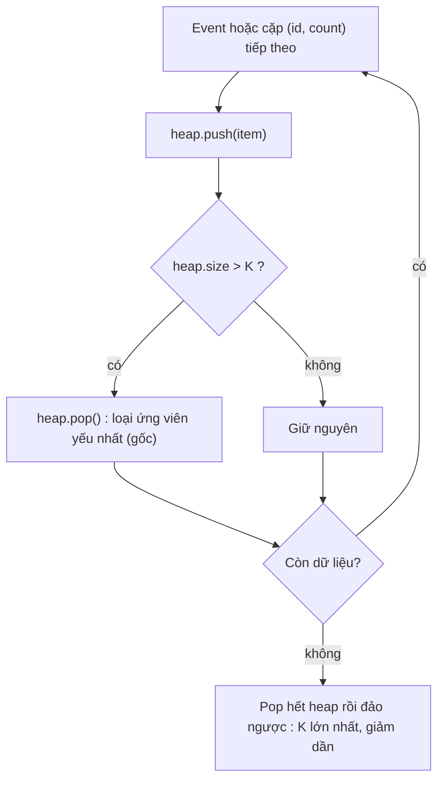
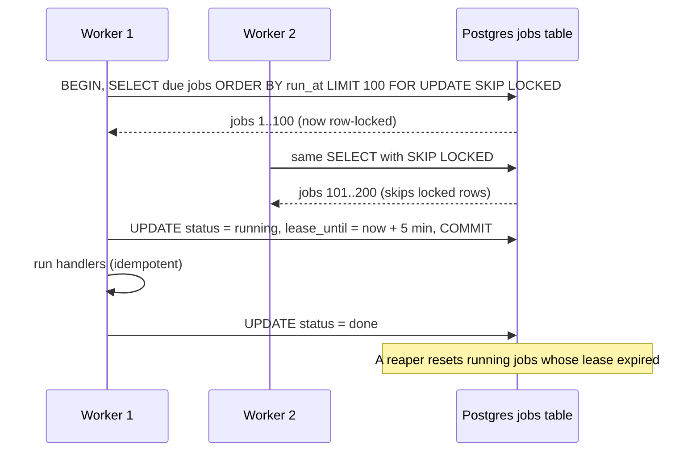

## Bối cảnh & vấn đề

Ba yêu cầu nghe rất khác nhau, đến từ ba team khác nhau trong cùng một công ty thương mại điện tử:

- Team growth muốn "top 10 sản phẩm được xem nhiều nhất" từ 50 triệu view event mỗi ngày.
- Team search có 8 shard Elasticsearch, mỗi shard trả kết quả đã sort theo điểm; cần ghép thành **một** trang 20 kết quả sort toàn cục.
- Team CRM cần gửi "nhắc giỏ hàng sau 3 ngày" cho hàng triệu người dùng, không được gửi trùng, không được quên khi deploy.

Cả ba đều là cùng một câu hỏi: **"phần tử nhỏ nhất (hoặc lớn nhất) tiếp theo là gì?"**, hỏi lặp đi lặp lại trên một tập đang thay đổi. Sort toàn bộ mỗi lần là O(n log n) cho mỗi câu hỏi, lãng phí vì ta chỉ cần phần tử đầu. Cấu trúc sinh ra cho đúng câu hỏi này là **binary heap** (priority queue): lấy phần tử nhỏ nhất O(1), thêm/bớt O(log n).

Bài này đi từ cơ chế của heap (vì sao một cây lại nằm gọn trong một mảng), sang ba ứng dụng: top-K trên stream (kèm bản xấp xỉ khi không đủ memory), K-way merge kết quả nhiều shard (và vì sao deep pagination là cái bẫy), rồi scheduler cho delayed job, nơi một heap in-memory là mô hình đúng nhưng không đủ cho production. Phần phụ là **reservoir sampling**: lấy mẫu ngẫu nhiên đều trên stream không biết độ dài.

## Khái niệm

### Binary heap: cây hoàn chỉnh nằm trong một mảng

**Binary heap** là một cây nhị phân **hoàn chỉnh** (mọi tầng đầy, trừ tầng cuối được điền từ trái sang) thoả **heap property**: với min-heap, mỗi node nhỏ hơn hoặc bằng các con của nó. Hệ quả: phần tử nhỏ nhất luôn ở gốc. Lưu ý heap **không** sắp xếp hoàn toàn; hai anh em không có quan hệ thứ tự gì, và phần tử lớn thứ hai có thể ở bất cứ đâu trong tầng 1.

Vì cây hoàn chỉnh, nó nằm gọn trong một **mảng** không có khoảng trống: node ở chỉ số `i` có con trái `2i + 1`, con phải `2i + 2`, cha `⌊(i − 1) / 2⌋`. Không cần con trỏ, không cần object node, dữ liệu liên tục trong bộ nhớ (cache-friendly). Ví dụ mảng `[1, 3, 2, 7, 4]` là min-heap: gốc 1, con của 1 là 3 và 2, con của 3 là 7 và 4.

Ba thao tác: **peek** đọc `a[0]`, O(1). **push** thêm vào cuối mảng rồi **sift up**: đổi chỗ với cha chừng nào còn nhỏ hơn cha, tối đa log₂ n bước. **pop** lấy gốc, đưa phần tử cuối lên gốc, rồi **sift down**: đổi chỗ với con nhỏ hơn chừng nào còn lớn hơn con. Dựng heap từ một mảng có sẵn (heapify) là O(n), không phải O(n log n), vì phần lớn node ở tầng dưới chỉ cần sift down vài bước.

**Interview angle:** interviewer hay hỏi "vì sao không dùng mảng đã sort làm priority queue?"; mảng sort cho pop O(1) nhưng insert O(n) vì phải dời phần tử, còn heap cân bằng cả hai ở O(log n).

### Priority queue trong JavaScript và ngoài process

JavaScript không có heap built-in (khác Java `PriorityQueue`, Python `heapq`). Bạn tự viết khoảng 40 dòng hoặc dùng thư viện. Trong hệ thống phân tán, vai trò priority queue thường do **Redis sorted set** đảm nhận: score là độ ưu tiên (hoặc thời điểm chạy), `ZADD` O(log n), `ZPOPMIN` lấy phần tử nhỏ nhất O(log n), và nó được chia sẻ giữa nhiều pod (xem [B+tree, skip list & pagination](/tracks/dsa/learn/ordered-structures-pagination)).

**Interview angle:** nói được "trong process thì heap, giữa nhiều process thì Redis sorted set hoặc bảng DB có index" cho thấy bạn nghĩ tới production chứ không chỉ bài tập.

### Top-K bằng min-heap kích thước K

**Top-K** là tìm K phần tử lớn nhất trong n phần tử. Mẹo có vẻ ngược: dùng **min**-heap kích thước K. Heap giữ K ứng viên tốt nhất đã thấy; gốc là ứng viên **yếu nhất** trong số đó. Với mỗi phần tử mới, push vào heap; nếu heap vượt K phần tử, pop gốc (loại phần tử nhỏ nhất). Cuối cùng heap chứa đúng K phần tử lớn nhất.

Chi phí: O(n log K) thời gian, O(K) memory. Khi K = 10 và n = 50.000 sản phẩm, log K ≈ 3,3 so với log n ≈ 15,6 của sort. Quan trọng hơn thời gian là **memory O(K)**: thuật toán chạy được trên **stream** (dữ liệu chảy qua, không cần giữ hết). Muốn K phần tử **nhỏ** nhất thì ngược lại: max-heap kích thước K. Phương án khác là **quickselect**: O(n) trung bình nhưng cần toàn bộ dữ liệu trong memory và O(n²) worst case.

Với bài 50 triệu view event, top-K là bước **thứ hai**. Bước đầu là đếm: `Map<productId, count>`, O(n) thời gian, O(d) memory với d là số sản phẩm khác nhau. Sau đó mới chạy top-K trên d cặp (id, count).

**Interview angle:** câu trả lời mạnh luôn tách "đếm" và "chọn top", nêu O(n + d log K), rồi hỏi lại yêu cầu: realtime hay theo ngày, chấp nhận sai số không.

### Heavy hitters khi không đủ memory: Count-Min Sketch

Khi số key khác nhau quá lớn (hàng trăm triệu URL, IP, search query), chính `Map` đếm đã không vừa memory. Lúc đó dùng cấu trúc **xấp xỉ**. **Count-Min Sketch** là một ma trận d hàng × w cột số đếm, với d hash function độc lập. Tăng key: với mỗi hàng i, tăng ô `[i][hᵢ(key) mod w]`. Ước lượng: lấy **min** của d ô tương ứng. Va chạm chỉ làm số đếm **cao hơn** thật, không bao giờ thấp hơn, nên lấy min cho ước lượng tốt nhất. Memory cố định (ví dụ 4 × 2.048 ô ≈ 32 KB) bất kể số key.

Để lấy top-K, kết hợp sketch với một min-heap kích thước K: mỗi event, cập nhật sketch, ước lượng count của key, nếu lớn hơn gốc heap thì cập nhật heap. Các thuật toán heavy hitters khác như **Misra–Gries** hay **Space-Saving** giữ K bộ đếm và đảm bảo không bỏ sót key nào có tần suất vượt n/K. Trong hệ thống thật, bạn thường không tự viết: Redis có `TOPK.*` và `CMS.*` trong các module probabilistic (verify theo phiên bản Redis), và các stream processor/warehouse có hàm approximate top-K.

**Interview angle:** biết rằng Count-Min chỉ **đếm dư** (overestimate) và vì sao lấy min là chi tiết interviewer dùng để phân biệt người hiểu với người đọc tên.

### K-way merge và bẫy deep pagination

**K-way merge** ghép k danh sách đã sort thành một danh sách sort. Đưa phần tử đầu của mỗi danh sách vào min-heap (k phần tử). Lặp: pop phần tử nhỏ nhất ra output, push phần tử **kế tiếp** của cùng danh sách đó vào heap. Mỗi phần tử ra vào heap một lần, nên tổng chi phí O(N log k) với N là tổng số phần tử lấy ra. Đây cũng là bước merge trong external sort (sort file lớn hơn RAM) và trong compaction của LSM tree.

Search engine phân tán làm đúng việc này: mỗi shard trả top-`size` của nó, node điều phối merge. **Bẫy** nằm ở phân trang: muốn trang p (mỗi trang 20), node điều phối không biết shard nào chứa các phần tử ở vị trí 20·p tới 20·p + 19, nên phải lấy **top 20·(p+1) từ mỗi shard** rồi merge và bỏ phần đầu. Trang 500 với 8 shard nghĩa là 8 × 10.020 phần tử được đọc, sort, gửi qua mạng để trả về 20. Đó là lý do Elasticsearch giới hạn `from + size` bằng `index.max_result_window` (mặc định 10.000).

Lời giải là **cursor**: thay vì "bỏ qua N phần tử", nói "cho tôi các phần tử **sau** phần tử cuối cùng tôi đã thấy". Elasticsearch có `search_after` với giá trị sort của hit cuối; database có keyset pagination. Điều kiện bắt buộc: sort key phải có **tie-breaker unique** (thường là id), vì nếu hai document cùng score, "sau score 92" là mơ hồ và bạn sẽ mất hoặc lặp item giữa các trang.

**Interview angle:** câu hỏi merge 8 shard luôn có follow-up "trang 500 thì sao"; nói được "mỗi shard phải trả top (p+1)·size" rồi đề xuất `search_after` + tie-breaker là đủ điểm.

### Reservoir sampling

**Reservoir sampling** chọn k mẫu **ngẫu nhiên đều** từ một stream mà ta không biết trước độ dài, dùng O(k) memory và một lượt duyệt. Thuật toán R: giữ k phần tử đầu trong "reservoir". Với phần tử thứ i (đếm từ 0, i ≥ k), chọn ngẫu nhiên j trong [0, i]; nếu j < k thì thay `reservoir[j]` bằng phần tử mới. Phần tử thứ i được giữ với xác suất k/(i+1), và có thể chứng minh bằng quy nạp rằng sau n phần tử, **mọi** phần tử đều ở trong reservoir với xác suất đúng bằng k/n.

Use case backend: lấy mẫu log hoặc trace để debug mà không lưu hết; lấy mẫu request production để replay trong load test; kiểm tra chất lượng dữ liệu trên file import hàng chục GB mà không đọc hết vào memory. Lấy "k dòng đầu" thay cho reservoir là sai lầm phổ biến: file thường được sort theo thời gian, id hay tenant, nên k dòng đầu chỉ đại diện cho một phần rất hẹp.

**Interview angle:** interviewer có thể hỏi "làm sao lấy mẫu trên 10 shard"; mỗi shard giữ reservoir riêng cùng số phần tử đã thấy, rồi gộp có trọng số theo số phần tử của từng shard.

### Scheduler: priority queue theo thời điểm chạy

Một **delayed job scheduler** là priority queue với key là `runAt`: worker luôn hỏi "job có `runAt` nhỏ nhất là gì, đã tới giờ chưa". Heap in-memory là mô hình đúng, nhưng với 10 triệu job "gửi nhắc sau 3 ngày" nó thiếu ba thứ: **bền** (restart là mất hết), **chia sẻ** (10 worker pod không cùng nhìn một heap), và **đảm bảo thực thi** (worker crash giữa chừng thì job đi đâu).

Ba lựa chọn persisted phổ biến. **Bảng database** với index `(run_at) WHERE status = 'pending'`; worker claim bằng `SELECT ... ORDER BY run_at LIMIT 100 FOR UPDATE SKIP LOCKED`, để nhiều worker lấy các lô khác nhau mà không chặn nhau. **Redis sorted set** với score = `runAt`; worker lấy các job đã tới hạn và xoá chúng một cách atomic bằng Lua script. **Dịch vụ managed**: SQS delay queue chỉ trì hoãn tối đa 15 phút, nên không hợp cho "3 ngày"; EventBridge Scheduler tạo được lịch một lần (one-time schedule) cho thời điểm bất kỳ (verify quota số schedule).

**At-least-once** là đảm bảo thực tế: job có thể chạy **hơn một lần** (worker xử lý xong nhưng crash trước khi đánh dấu done, lease hết hạn và worker khác lấy lại), nhưng không bị mất. Vì vậy handler phải **idempotent**. Ở quy mô rất lớn với yêu cầu độ chính xác thời gian cao, **timing wheel** (vòng các bucket theo khoảng thời gian, như Kafka dùng cho delayed operations nội bộ) cho insert/cancel O(1) thay vì O(log n).

**Interview angle:** interviewer chờ ba từ khoá: lưu bền với index theo `run_at`, claim không đụng nhau (`SKIP LOCKED` hoặc atomic pop), và handler idempotent vì at-least-once.

## Cơ chế hoạt động

Luồng top-K trên stream bằng min-heap kích thước K:



Mỗi phần tử tốn tối đa một push và một pop, mỗi thao tác O(log K) vì heap không bao giờ vượt K + 1 phần tử. Gốc của min-heap là "ngưỡng vào cửa": phần tử mới nhỏ hơn gốc sẽ bị pop ra ngay. Một tối ưu nhỏ: so sánh với `heap.peek()` trước, nếu nhỏ hơn thì bỏ qua luôn, không cần push rồi pop.

Luồng claim job trong scheduler dùng bảng Postgres:



Worker 1 lấy 100 job tới hạn và lock chúng. Worker 2 chạy cùng câu query, nhưng `SKIP LOCKED` khiến nó bỏ qua các row đang bị lock thay vì chờ, nên nhận 100 job tiếp theo. Worker 1 đánh dấu `running` kèm `lease_until` rồi commit ngay, để không giữ transaction mở trong lúc chạy handler (xem [connection pooling](/tracks/sql-postgres/learn/connection-pooling)). Nếu worker 1 crash, một reaper định kỳ đưa các job `running` có lease hết hạn về `pending`, và chúng được chạy lại: đó là nguồn gốc của "at-least-once".

## Ví dụ thực tế

### Một MinHeap đủ dùng

```ts
export class MinHeap<T> {
  private a: T[] = [];
  constructor(private less: (x: T, y: T) => number) {}
  get size() { return this.a.length; }
  peek(): T | undefined { return this.a[0]; }
  push(x: T) {
    const a = this.a;
    a.push(x);
    let i = a.length - 1;
    while (i > 0) {                          // sift up
      const p = (i - 1) >> 1;
      if (this.less(a[i], a[p]) >= 0) break;
      [a[i], a[p]] = [a[p], a[i]];
      i = p;
    }
  }
  pop(): T | undefined {
    const a = this.a;
    if (a.length === 0) return undefined;
    const top = a[0];
    const last = a.pop()!;
    if (a.length > 0) {
      a[0] = last;
      let i = 0;
      for (;;) {                             // sift down
        const l = 2 * i + 1, r = l + 1;
        let m = i;
        if (l < a.length && this.less(a[l], a[m]) < 0) m = l;
        if (r < a.length && this.less(a[r], a[m]) < 0) m = r;
        if (m === i) break;
        [a[i], a[m]] = [a[m], a[i]];
        i = m;
      }
    }
    return top;
  }
}
```

Comparator theo quy ước của `sort` (âm nghĩa là `x` ưu tiên hơn), nên cùng một class làm được min-heap, max-heap (`(x, y) => y - x`), hay heap theo nhiều khoá.

### Top 10 sản phẩm từ 2 triệu view event

Dữ liệu mô phỏng có độ lệch kiểu Zipf (vài sản phẩm rất hot, đuôi dài), với PRNG có seed để output tái lập được:

```ts
const N = 2_000_000, P = 50_000;
function* events() { for (let i = 0; i < N; i++) yield { productId: `p${Math.floor(P * rand() ** 3)}` }; }

const counts = new Map<string, number>();
for (const e of events()) counts.set(e.productId, (counts.get(e.productId) ?? 0) + 1);

const heap = new MinHeap<[string, number]>((a, b) => a[1] - b[1]);
for (const entry of counts) {
  heap.push(entry);
  if (heap.size > 10) heap.pop();           // drop the smallest of the 11
}
const top: [string, number][] = [];
while (heap.size) top.push(heap.pop()!);
top.reverse();

const bySort = [...counts].sort((a, b) => b[1] - a[1]).slice(0, 10);
// tCount, tHeap, tSort: performance.now() deltas around each block
console.log(`distinct=${counts.size} count=${tCount.toFixed(0)}ms heap=${tHeap.toFixed(1)}ms sort=${tSort.toFixed(1)}ms`);
console.log(top.slice(0, 5).map(([p, c]) => `${p}:${c}`).join(" "));
console.log("same as sort:", JSON.stringify(top) === JSON.stringify(bySort));
```

Output thật:

```text
distinct=50000 count=334ms heap=7.0ms sort=18.0ms
p0:54388 p1:14093 p2:9973 p3:7944 p4:6765
same as sort: true
```

Hai con số đáng chú ý. Thứ nhất, bước **đếm** (334 ms) chiếm gần hết thời gian; chọn top-K bằng heap (7 ms) hay bằng sort (18 ms) đều nhỏ so với nó. Tối ưu thật nằm ở chỗ đếm (đẩy xuống nơi dữ liệu nằm, pre-aggregate theo giờ). Thứ hai, heap nhanh hơn sort khoảng 2,5 lần ở d = 50.000 và cách biệt tăng khi d lớn, nhưng lợi thế lớn nhất của heap là **memory O(K)**: nếu counts đến từ một stream (ví dụ từng partition), bạn không cần giữ và sort toàn bộ.

Trong hệ thống thật với yêu cầu realtime, cách phổ biến là Redis sorted set: mỗi view `ZINCRBY views:2026-09-29 1 p123`, lấy top bằng `ZREVRANGE views:2026-09-29 0 9 WITHSCORES`. Nếu top-10 phải theo **tenant và theo giờ**, key trở thành `views:{tenant}:{yyyyMMddHH}` với TTL, và top theo ngày được tính bằng `ZUNIONSTORE` 24 key giờ.

### Merge 8 shard thành một trang và tạo cursor

```ts
type Hit = { id: string; score: number };
function kWayMerge(lists: Hit[][], limit: number): Hit[] {
  const cmp = (a: Hit, b: Hit) => b.score - a.score || a.id.localeCompare(b.id); // score desc, id asc
  const heap = new MinHeap<{ hit: Hit; list: number; idx: number }>((x, y) => cmp(x.hit, y.hit));
  lists.forEach((l, i) => l.length && heap.push({ hit: l[0], list: i, idx: 0 }));
  const out: Hit[] = [];
  while (heap.size && out.length < limit) {
    const { hit, list, idx } = heap.pop()!;
    out.push(hit);
    if (idx + 1 < lists[list].length) heap.push({ hit: lists[list][idx + 1], list, idx: idx + 1 });
  }
  return out;
}
const page = kWayMerge(shards, 6); // shards: 8 lists, each sorted by (score desc, id asc)
console.log(page.map((h) => `${h.id}(${h.score})`).join(" "));
const last = page.at(-1)!;
console.log("next cursor (search_after):", JSON.stringify([last.score, last.id]));
```

Output:

```text
s0-d0(100) s6-d4(100) s1-d0(97) s7-d4(97) s2-d0(94) s0-d1(92)
next cursor (search_after): [92,"s0-d1"]
```

Có hai cặp trùng score (100 và 97); tie-breaker theo id khiến thứ tự **xác định**, và cursor `[92, "s0-d1"]` định nghĩa chính xác "sau điểm này". Trang tiếp theo gửi cursor đó cho **mỗi** shard (`search_after: [92, "s0-d1"]`), mỗi shard chỉ trả phần tử sau cursor, và chi phí mỗi trang luôn là O(k · size) bất kể trang sâu tới đâu. Nếu thiếu tie-breaker, document có cùng score 92 nằm ở shard khác có thể bị bỏ qua hoặc xuất hiện hai lần. Để kết quả nhất quán giữa các trang khi index đang được ghi, Elasticsearch khuyến nghị dùng `search_after` kết hợp point in time (PIT) (verify chi tiết theo phiên bản).

### Reservoir sampling: kiểm chứng tính đều

```ts
function reservoir<T>(stream: Iterable<T>, k: number, rand = Math.random): T[] {
  const r: T[] = [];
  let i = 0;
  for (const x of stream) {
    if (i < k) r.push(x);
    else {
      const j = Math.floor(rand() * (i + 1)); // j in [0, i]
      if (j < k) r[j] = x;                    // keep x with probability k / (i + 1)
    }
    i++;
  }
  return r;
}
// sample 3 of 10 items, 100k times: each item should appear ~30% of the time
const hits = new Array(10).fill(0);
for (let t = 0; t < 100_000; t++)
  for (const x of reservoir(Array.from({ length: 10 }, (_, i) => i), 3, rand)) hits[x]++;
console.log(hits.map((h) => (h / 1000).toFixed(1) + "%").join(" "));

// a 1M-row export sorted by created_at: 100k rows per year from 2016 to 2025
function* rows() { for (let i = 0; i < 1_000_000; i++) yield { id: i, year: 2016 + Math.floor(i / 100_000) }; }
const firstK = [...rows()].slice(0, 1000);
const sample = reservoir(rows(), 1000, rand);
const years = (xs: { year: number }[]) => [...new Set(xs.map((x) => x.year))].sort().join(",");
console.log("first 1000 years:", years(firstK));
console.log("reservoir years:", years(sample));
```

Output:

```text
30.0% 30.0% 29.9% 30.0% 30.0% 29.9% 29.9% 29.9% 30.2% 30.1%
first 1000 years: 2016
reservoir years: 2016,2017,2018,2019,2020,2021,2022,2023,2024,2025
```

Mọi phần tử xuất hiện khoảng 30% số lần (3/10), đúng như lý thuyết. Ví dụ thứ hai cho thấy vì sao "lấy 1.000 dòng đầu" là mẫu lệch: file export sort theo thời gian, nên 1.000 dòng đầu chỉ chứa dữ liệu năm 2016, còn reservoir phủ đủ 10 năm. Một kiểm tra chất lượng dữ liệu chạy trên 1.000 dòng đầu sẽ bỏ sót mọi lỗi xuất hiện sau khi schema thay đổi năm 2020.

### Scheduler với cancel O(1) bằng lazy deletion

Xoá một phần tử bất kỳ khỏi heap cần biết vị trí của nó (O(n) để tìm, hoặc duy trì thêm map id → index). Cách đơn giản hơn là **lazy deletion**: đánh dấu job là đã huỷ, và bỏ qua khi pop tới nó.

```ts
type Job = { id: string; runAt: number; payload: string; cancelled?: boolean };
class Scheduler {
  private heap = new MinHeap<Job>((a, b) => a.runAt - b.runAt || a.id.localeCompare(b.id));
  private byId = new Map<string, Job>();
  private tombstones = 0;
  schedule(job: Job) { this.heap.push(job); this.byId.set(job.id, job); }
  cancel(id: string) {
    const j = this.byId.get(id);
    if (!j || j.cancelled) return false;
    j.cancelled = true; this.byId.delete(id); this.tombstones++;
    return true;
  }
  due(now: number): Job[] {
    const out: Job[] = [];
    while (this.heap.size && this.heap.peek()!.runAt <= now) {
      const j = this.heap.pop()!;
      if (j.cancelled) { this.tombstones--; continue; } // skip lazily deleted
      this.byId.delete(j.id);
      out.push(j);
    }
    return out;
  }
  stats() { return { heap: this.heap.size, live: this.byId.size, tombstones: this.tombstones }; }
}
const s = new Scheduler();
s.schedule({ id: "remind-1", runAt: 300, payload: "cart reminder" });
s.schedule({ id: "remind-2", runAt: 100, payload: "trial ends" });
s.schedule({ id: "remind-3", runAt: 200, payload: "invoice" });
s.cancel("remind-3");
console.log(s.stats());
console.log(s.due(250).map((j) => j.id), s.stats());
console.log(s.due(1_000).map((j) => j.id), s.stats());
```

Output:

```text
{ heap: 3, live: 2, tombstones: 1 }
[ 'remind-2' ] { heap: 1, live: 1, tombstones: 0 }
[ 'remind-1' ] { heap: 0, live: 0, tombstones: 0 }
```

Sau khi huỷ, heap vẫn chứa 3 phần tử nhưng chỉ 2 còn sống. Khi `due(250)` pop tới `remind-3` (runAt 200), nó bị bỏ qua. Rủi ro của lazy deletion là tombstone chiếm memory: nếu người dùng huỷ phần lớn job hẹn xa (runAt sau 3 tháng), chúng nằm trong heap suốt 3 tháng. Giới hạn bằng cách **rebuild** heap (heapify O(n) từ các job còn sống) khi `tombstones > heap.size / 2`, giống compaction.

Phiên bản production cho 10 triệu job với Postgres:

```sql
CREATE TABLE jobs (
  id          bigserial PRIMARY KEY,
  run_at      timestamptz NOT NULL,
  status      text NOT NULL DEFAULT 'pending',   -- pending | running | done | cancelled
  lease_until timestamptz,
  attempts    int NOT NULL DEFAULT 0,
  payload     jsonb NOT NULL
);
CREATE INDEX jobs_due ON jobs (run_at) WHERE status = 'pending';

-- claim a batch (each worker, in a short transaction)
UPDATE jobs SET status = 'running', lease_until = now() + interval '5 minutes', attempts = attempts + 1
WHERE id IN (
  SELECT id FROM jobs
  WHERE status = 'pending' AND run_at <= now()
  ORDER BY run_at
  LIMIT 100
  FOR UPDATE SKIP LOCKED
)
RETURNING id, payload;

-- cancel or reschedule is a single indexed UPDATE by primary key
UPDATE jobs SET status = 'cancelled' WHERE id = $1 AND status = 'pending';
```

Partial index chỉ chứa job `pending`, nên nó nhỏ và co lại khi job hoàn thành. Cancel là một `UPDATE` theo primary key, O(log n). Metric quan trọng nhất là **scheduler lag**: `now() − min(run_at)` của các job `pending` đã tới hạn; nếu lag tăng, worker không theo kịp. Với Redis sorted set, cancel là `ZREM` theo member (O(log n)); với EventBridge Scheduler, cancel là xoá schedule theo tên.

## Trade-offs & lựa chọn thay thế

| Bài toán | Cách A | Cách B | Chọn khi |
| --- | --- | --- | --- |
| Top-K trong memory | Sort toàn bộ O(d log d) | Min-heap size K O(d log K), memory O(K) | K ≪ d, hoặc dữ liệu là stream |
| Top-K, key quá nhiều | `Map` đếm chính xác | Count-Min Sketch / Space-Saving + heap | Chấp nhận sai số, memory cố định |
| Top-K realtime nhiều pod | Heap trong từng pod (sai) | Redis sorted set `ZINCRBY` | Cần một view toàn cục |
| Merge k danh sách sort | Nối rồi sort O(N log N) | K-way merge bằng heap O(N log k) | k nhỏ, danh sách dài hoặc stream |
| Phân trang kết quả phân tán | `from/offset` | `search_after`/keyset + tie-breaker | Trang sâu, dữ liệu thay đổi |
| Lấy mẫu | k dòng đầu (lệch) | Reservoir sampling | Stream không biết độ dài |
| Delayed job | Heap in-memory | DB + `SKIP LOCKED`, Redis ZSET, EventBridge Scheduler | Cần bền, nhiều worker, at-least-once |

Khi nào chọn cái nào cho scheduler. **Bảng DB** là lựa chọn mặc định khi job gắn với dữ liệu nghiệp vụ trong cùng database: tạo job trong cùng transaction với thay đổi dữ liệu (không có job "mồ côi"), truy vấn và báo cáo dễ, nhưng throughput claim bị giới hạn bởi DB (vài nghìn job/giây là thoải mái, vài trăm nghìn thì không). **Redis sorted set** cho throughput cao và độ trễ thấp, nhưng độ bền phụ thuộc cấu hình persistence (AOF), và cần Lua để claim atomic. **Managed** (EventBridge Scheduler, hoặc thư viện như BullMQ trên Redis) bớt công vận hành, nhưng phải kiểm tra quota, giá và độ chính xác thời gian. Timing wheel chỉ đáng khi bạn đang xây chính hạ tầng scheduling.

## Edge cases & failure modes

- **Comparator trả `NaN`**: count là `undefined` với một phần tử làm `a[1] - b[1]` thành `NaN`, mọi so sánh đều false và heap mất tính chất mà không báo lỗi. Validate dữ liệu trước khi push.
- **Thay đổi priority của phần tử đã trong heap**: sửa `job.runAt` trực tiếp phá heap property. Phải xoá rồi thêm lại (hoặc lazy: đánh dấu bản cũ là huỷ, push bản mới).
- **Tie trong top-K**: nhiều sản phẩm cùng count ở vị trí thứ 10; kết quả phụ thuộc thứ tự duyệt. Thêm tie-breaker (id) nếu kết quả phải ổn định giữa các lần chạy.
- **Deep pagination qua API công khai**: crawler gọi `?page=5000` và mỗi request làm 8 shard đọc 100.000 document. Giới hạn trang tối đa, bắt buộc cursor cho trang sâu.
- **Cursor trỏ vào item đã bị xoá**: với keyset/`search_after`, cursor là **giá trị** sort chứ không phải vị trí, nên item bị xoá không làm lệch trang. Đây là ưu điểm so với offset.
- **Thundering herd ở scheduler**: 1 triệu job cùng `run_at = 09:00:00` (chiến dịch marketing) đổ vào worker cùng lúc và dồn tải xuống dịch vụ gửi email. Rải `run_at` bằng jitter, giới hạn concurrency của worker.
- **Clock skew giữa worker**: mỗi worker dùng `Date.now()` của mình để quyết định "tới hạn" thì lệch vài giây. Dùng `now()` của database trong câu query claim để có một nguồn thời gian.
- **Job chạy lâu hơn lease**: worker vẫn đang chạy thì reaper trả job về `pending`, worker khác chạy lại song song. Gia hạn lease định kỳ (heartbeat) và làm handler idempotent.
- **Reservoir với `Math.random` kém**: PRNG mặc định đủ cho sampling, nhưng không đủ cho bảo mật; và muốn tái lập kết quả (debug) thì cần PRNG có seed như trong ví dụ.

## Pitfalls

- ❌ Dùng **max**-heap chứa mọi phần tử để lấy top-K → ✅ **min**-heap kích thước K, memory O(K) và chạy trên stream.
- ❌ Sort toàn bộ 50 triệu event rồi `slice(0, 10)` → ✅ đếm bằng `Map` (hoặc pre-aggregate) rồi heap K trên các key khác nhau.
- ❌ `from`/`OFFSET` cho trang sâu trên dữ liệu phân tán → ✅ `search_after`/keyset với tie-breaker unique.
- ❌ Sort chỉ theo score không có tie-breaker → ✅ `(score desc, id asc)`, để thứ tự và cursor xác định.
- ❌ Lấy k dòng đầu file làm mẫu → ✅ reservoir sampling, vì file thường được sort theo thời gian hoặc tenant.
- ❌ Scheduler bằng `setTimeout` hoặc heap in-memory cho job hẹn 3 ngày → ✅ lưu bền (DB/Redis/managed), claim atomic, handler idempotent.
- ❌ Dùng SQS `DelaySeconds` cho độ trễ nhiều ngày → ✅ SQS chỉ trì hoãn tối đa 15 phút; dùng EventBridge Scheduler hoặc bảng DB.
- ❌ Giữ transaction mở suốt thời gian chạy handler sau khi claim → ✅ commit trạng thái `running` + lease ngay, chạy handler ngoài transaction.

## Tóm tắt

- Binary heap là cây hoàn chỉnh nằm trong mảng (con `2i+1`, `2i+2`): peek O(1), push/pop O(log n), heapify O(n); không sắp xếp hoàn toàn.
- Top-K lớn nhất = **min**-heap kích thước K: O(n log K) thời gian, O(K) memory, chạy trên stream; tách bước đếm (`Map`) và bước chọn.
- Khi key quá nhiều để đếm chính xác: Count-Min Sketch (chỉ đếm dư, lấy min) hoặc Space-Saving/Misra–Gries, kết hợp heap.
- K-way merge bằng heap O(N log k) là nền của search phân tán và external sort; phân trang sâu buộc mỗi shard trả top (p+1)·size, nên dùng `search_after`/keyset + tie-breaker.
- Reservoir sampling chọn k mẫu đều trên stream với O(k) memory; "k dòng đầu" là mẫu lệch.
- Scheduler production: priority queue **bền** theo `run_at` (DB + `FOR UPDATE SKIP LOCKED`, Redis ZSET, EventBridge Scheduler), lease + reaper, at-least-once nên handler phải idempotent, theo dõi scheduler lag.
