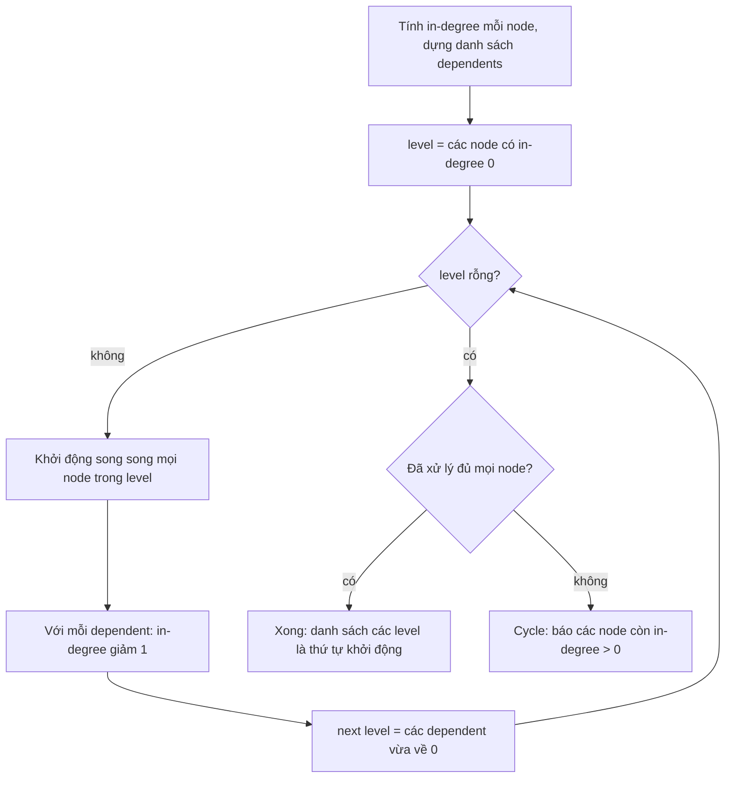
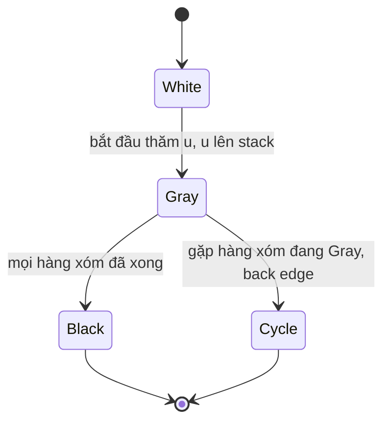

## Bối cảnh & vấn đề

Một hệ thống thương mại điện tử import cây danh mục từ nhà cung cấp. Hàm `collectIds` đệ quy hoạt động hoàn hảo trong test với cây 5 tầng. Lên production, file import có một chuỗi danh mục sâu 120.000 tầng (dữ liệu lỗi từ công cụ export), và một danh mục trỏ ngược về tổ tiên của nó. Service crash với `RangeError: Maximum call stack size exceeded`, rồi sau khi ai đó "sửa" bằng vòng lặp mà quên kiểm tra đã thăm, nó treo 100% CPU mãi mãi.

Cùng tuần đó, team platform cần khởi động 30 microservice theo đúng thứ tự phụ thuộc, team bảo mật cần tính "user này có quyền `invoice:read` không" khi role kế thừa role, và team search nhận ticket "autocomplete trên 2 triệu tên sản phẩm chậm". Tất cả là bài toán trên **graph** hoặc **cây**: danh mục cha–con, dependency giữa service, kế thừa role, và cây ký tự của trie.

Bài này dạy cách nhìn ra graph trong yêu cầu nghiệp vụ, hai cách duyệt cơ bản (BFS và DFS) và khi nào dùng cái nào, topological sort để sắp xếp theo phụ thuộc, vì sao đệ quy sâu làm crash Node.js, cách precompute transitive closure cho RBAC, và trie cùng các lựa chọn thay thế cho autocomplete.

## Khái niệm

### Graph: node, edge và cách biểu diễn

**Graph** gồm các **node** (đỉnh) và **edge** (cạnh) nối chúng. Edge có thể **có hướng** (A phụ thuộc B không có nghĩa B phụ thuộc A) hoặc vô hướng (quan hệ bạn bè), có thể có **trọng số** (khoảng cách, chi phí) hoặc không. **Cây** là graph liên thông không có cycle; **DAG** (directed acyclic graph) là graph có hướng không có cycle, và mọi bài toán "thứ tự phụ thuộc" đều đòi hỏi DAG.

Cách biểu diễn phổ biến nhất trong code là **adjacency list**: `Map<node, node[]>`, mỗi node trỏ tới danh sách hàng xóm. Nó tốn O(V + E) memory (V node, E edge) và duyệt hàng xóm nhanh. **Adjacency matrix** (ma trận V × V) chỉ hợp với graph nhỏ và dày. Trong database, graph thường là một bảng edge: `categories(id, parent_id)` hay `role_inherits(role, parent_role)`.

Ví dụ: `{ api: ["db", "cache"], worker: ["db"] }` là adjacency list của graph dependency, với edge `api → db` đọc là "api phụ thuộc db".

**Interview angle:** bước đầu tiên interviewer chấm là bạn có **gọi tên** được node và edge trong yêu cầu nghiệp vụ không ("role là node, kế thừa là edge có hướng").

### BFS: duyệt theo lớp, đường ngắn nhất không trọng số

**BFS** (breadth-first search) dùng một **queue**: bắt đầu từ node nguồn, thăm mọi hàng xóm (lớp 1), rồi mọi hàng xóm của lớp 1 (lớp 2), cứ thế. Vì duyệt theo lớp, lần đầu tiên BFS chạm tới một node là qua **đường ít cạnh nhất**. Đó là lý do BFS giải bài "đường ngắn nhất trên graph không trọng số": chuỗi danh mục cha ngắn nhất, "bạn của bạn" trong 3 bước, số hop ít nhất giữa hai service.

Để truy lại đường đi, lưu `prev[node] = node trước đó` khi thăm lần đầu. Với graph có trọng số (khoảng cách thật, chi phí), BFS không còn đúng; cần Dijkstra (một BFS dùng heap thay cho queue). Trong JavaScript, dùng mảng + chỉ số đọc thay cho `shift()`, vì `shift()` là O(n) (xem [Big-O thực dụng](/tracks/dsa/learn/big-o-practical)).

**Interview angle:** câu "BFS hay DFS để tìm chuỗi cha ngắn nhất?" có đáp án BFS kèm lý do "duyệt theo lớp nên lần chạm đầu là ít cạnh nhất".

### DFS: đi sâu trước, phát hiện cycle bằng ba màu

**DFS** (depth-first search) dùng một **stack** (tường minh hoặc chính call stack khi viết đệ quy): đi theo một nhánh tới tận cùng rồi mới quay lui. DFS tự nhiên cho các bài toán về **cấu trúc**: liệt kê cây con, phát hiện cycle, topological sort, tìm thành phần liên thông.

Phát hiện cycle trên graph có hướng dùng **ba màu**: white (chưa thăm), gray (đang thăm, còn nằm trên stack hiện tại), black (đã thăm xong cả cây con). Nếu từ node đang xét ta gặp một node **gray**, đó là **back edge**: ta đã quay về một tổ tiên trên chính đường đang đi, nên có cycle. Gặp node black thì không sao: đó là một nhánh khác đã xử lý xong. Chỉ dùng một tập `visited` (hai màu) là không đủ để phân biệt "cycle" với "hai đường cùng tới một node" trong DAG.

Cả BFS và DFS đều O(V + E), và cả hai **bắt buộc** có `visited` trên graph có thể có cycle, nếu không sẽ lặp vô hạn.

**Interview angle:** giải thích được vì sao cần màu gray (phân biệt back edge với cross edge) là điểm phân biệt người đã tự cài với người chỉ nhớ tên.

### Topological sort: thứ tự tuyến tính của một DAG

**Topological sort** sắp các node của DAG thành một dãy sao cho mọi edge `u → v` (v phụ thuộc u, hoặc u phải chạy trước v) đều có u đứng trước v. Ứng dụng: thứ tự khởi động service, thứ tự build package trong monorepo, thứ tự chạy migration, thứ tự tính các field phụ thuộc nhau trong form hay spreadsheet.

**Kahn's algorithm**: đếm **in-degree** (số phụ thuộc chưa thoả) của mỗi node; đưa mọi node in-degree 0 vào queue; lấy từng node ra, thêm vào kết quả, và giảm in-degree của những node phụ thuộc vào nó; node nào về 0 thì vào queue. Nếu kết quả có ít node hơn tổng số node, những node còn lại nằm trong (hoặc phụ thuộc vào) một **cycle**. Chi phí O(V + E). Cách thay thế là DFS: xuất node theo thứ tự **hoàn thành** (post-order) rồi đảo ngược, và gặp node gray là có cycle.

Kahn có một biến thể rất hữu ích: xử lý theo **lớp**. Mọi node in-degree 0 ở cùng một thời điểm không phụ thuộc nhau, nên có thể khởi động **song song**. Số lớp chính là độ dài chuỗi phụ thuộc dài nhất (critical path).

**Interview angle:** follow-up "khởi động song song các service độc lập" chờ câu trả lời "Kahn theo lớp, mỗi lớp chạy song song, lớp sau đợi lớp trước".

### Đệ quy sâu, call stack và vì sao không dựa vào tail call

Mỗi lời gọi hàm tạo một **stack frame** chứa tham số, biến cục bộ và địa chỉ trả về. V8 giới hạn kích thước call stack (khoảng 1 MB mặc định trên 64-bit, chỉnh bằng `--stack-size` (verify)), nên độ sâu đệ quy tối đa phụ thuộc kích thước frame: vài nghìn tới vài chục nghìn tầng. Vượt quá, V8 ném `RangeError: Maximum call stack size exceeded`. Cây danh mục 120.000 tầng, linked list dài, hay graph có cycle (đệ quy vô hạn) đều chạm giới hạn này.

ES2015 đặc tả **proper tail calls** (lời gọi ở vị trí cuối không tạo frame mới), nhưng thực tế chỉ JavaScriptCore (Safari) cài đặt; V8 và Node.js không hỗ trợ (verify). Vì vậy không bao giờ dựa vào tail call để tránh tràn stack trong Node. Cách chắc chắn là chuyển đệ quy thành vòng lặp với **stack tường minh** (một mảng), nằm trên heap nên chỉ bị giới hạn bởi memory.

**Interview angle:** câu hỏi "chạy test pass, production crash" gần như luôn là độ sâu hoặc cycle; câu trả lời đủ gồm stack tường minh + `visited` + giới hạn độ sâu và báo lỗi dữ liệu.

### Transitive closure cho RBAC có kế thừa

**RBAC** (role-based access control) với kế thừa: role `admin` kế thừa `editor` và `billing`, cả hai kế thừa `viewer`. Quyền thực tế của một role là **hợp** quyền của mọi role **reachable** từ nó trong graph kế thừa. Tập các node reachable từ mỗi node gọi là **transitive closure**.

Tính quyền bằng BFS mỗi lần check là O(V + E) của graph role, chạy trên **mọi request**. Nhưng graph role thay đổi rất hiếm (vài lần một tuần), còn check chạy hàng nghìn lần mỗi giây. Vậy nên **precompute**: khi role thay đổi, tính lại `role → Set<permission>` phẳng cho mọi role, lưu vào cache kèm một **version**; mỗi check chỉ là tra `Set`, O(1). Đây là mẫu "đổi thời gian ghi lấy thời gian đọc" xuất hiện ở khắp nơi: materialized view, denormalization, search index.

**Interview angle:** interviewer muốn nghe "tách đường ghi hiếm và đường đọc nóng", cộng với cách invalidate khi role đổi (version trong cache key, broadcast), không chỉ "BFS với visited".

### Trie: cây theo ký tự cho tra cứu prefix

**Trie** (prefix tree) là cây mà mỗi cạnh là một ký tự; đường đi từ gốc tới một node đánh vần một prefix. Tìm mọi từ bắt đầu bằng "iph" là đi 3 bước từ gốc (O(L) với L là độ dài prefix, **không phụ thuộc** số từ trong từ điển), rồi liệt kê cây con. **Radix tree** (compressed trie) gộp các chuỗi node chỉ có một con thành một cạnh mang cả chuỗi, tiết kiệm memory; router HTTP như `find-my-way` (dùng trong Fastify) dùng radix tree để khớp path.

Để xếp hạng gợi ý theo độ phổ biến mà không phải duyệt cả cây con mỗi lần gõ, mỗi node lưu sẵn **top-k** từ tốt nhất trong cây con của nó. Truy vấn chỉ còn O(L); cái giá là mỗi lần thêm hoặc cập nhật điểm phải cập nhật top-k trên cả đường đi (O(L · k)), và memory tăng.

Trie hợp khi tập từ **vừa memory** và cần latency cực thấp trong process (vài chục nghìn tag, category, command, city). Với 2 triệu tên sản phẩm, typo tolerance, đa ngôn ngữ và ranking phức tạp, search engine là lựa chọn đúng hơn.

**Interview angle:** "trie hay `LIKE 'abc%'`?" chờ câu trả lời có điều kiện: DB đủ cho đa số (với index đúng), trie cho tập nhỏ cần latency cực thấp, search engine cho quy mô lớn/fuzzy.

## Cơ chế hoạt động

Kahn's algorithm theo lớp, áp dụng cho thứ tự khởi động service:



In-degree của một service là số dependency nó còn chờ. Level đầu gồm các service không phụ thuộc ai (database, cache, queue); chúng có thể khởi động cùng lúc. Khi một service lên, mọi service phụ thuộc vào nó bớt đi một thứ phải chờ. Service nào hết chờ thì vào level kế tiếp. Nếu vòng lặp dừng mà còn service chưa xử lý, chúng không bao giờ đạt in-degree 0: có cycle, và danh sách node còn lại là manh mối để debug (dù nó bao gồm cả các node chỉ **phụ thuộc vào** cycle chứ không nằm trong cycle; muốn chỉ đúng chu trình thì chạy DFS ba màu trên phần còn lại).

DFS ba màu khi gặp cycle:



Một node chuyển từ White sang Gray khi DFS bắt đầu thăm nó, và sang Black khi mọi hàng xóm đã được thăm xong. Trong lúc node còn Gray, nó nằm trên đường đi hiện tại từ gốc DFS. Nếu từ một node con cháu ta gặp lại node Gray đó, ta vừa đi một vòng: đó là cycle, và đoạn stack từ node Gray tới node hiện tại chính là chu trình để in ra.

## Ví dụ thực tế

### Crash vì đệ quy sâu, và bản vòng lặp an toàn

```ts
type Node = { id: string; children: Node[] };
function collectIds(n: Node, acc: string[] = []): string[] {
  acc.push(n.id);
  for (const c of n.children) collectIds(c, acc);
  return acc;
}
function chain(depth: number): Node {        // worst case: a 1-child chain
  const root: Node = { id: "c0", children: [] };
  let cur = root;
  for (let i = 1; i < depth; i++) { const n: Node = { id: `c${i}`, children: [] }; cur.children.push(n); cur = n; }
  return root;
}
for (const d of [1_000, 10_000, 120_000]) {
  try { console.log(`recursive depth=${d}: ${collectIds(chain(d)).length} ids`); }
  catch (e) { console.log(`recursive depth=${d}: ${(e as Error).name}: ${(e as Error).message}`); }
}

function collectIdsIter(root: Node, maxDepth = 1_000_000): string[] {
  const out: string[] = [];
  const visited = new Set<Node>();
  const stack: [Node, number][] = [[root, 0]];
  while (stack.length) {
    const [n, depth] = stack.pop()!;
    if (visited.has(n)) throw new Error(`cycle detected at ${n.id}`);
    if (depth > maxDepth) throw new Error(`tree deeper than ${maxDepth}`);
    visited.add(n);
    out.push(n.id);
    for (let i = n.children.length - 1; i >= 0; i--) stack.push([n.children[i], depth + 1]); // keep pre-order
  }
  return out;
}
const deep = chain(120_000);
console.log(`iterative depth=120000: ${collectIdsIter(deep).length} ids`);
let n = deep; for (let i = 0; i < 50; i++) n = n.children[0];
n.children.push(deep.children[0]);             // corrupt data: point back to an ancestor
try { collectIdsIter(deep); } catch (e) { console.log("iterative with cycle:", (e as Error).message); }
```

Output thật trên Node 24:

```text
recursive depth=1000: 1000 ids
recursive depth=10000: RangeError: Maximum call stack size exceeded
recursive depth=120000: RangeError: Maximum call stack size exceeded
iterative depth=120000: 120000 ids
iterative with cycle: cycle detected at c1
```

Dùng chính binary search trên đáp án (xem [bài sort & binary search](/tracks/dsa/learn/sorting-search-dp)) để đo, hàm đệ quy này chịu được khoảng 4.500 tầng trên máy thử; con số thay đổi theo kích thước frame, phiên bản Node và cờ `--stack-size`, nên không có "độ sâu an toàn" nào để dựa vào. Bản vòng lặp dùng mảng làm stack nên xử lý 120.000 tầng dễ dàng, và `visited` biến cycle từ "treo vĩnh viễn" thành lỗi dữ liệu rõ ràng. Lưu ý: với **cây** thật, gặp lại một node đã thăm nghĩa là dữ liệu hỏng (cycle hoặc một node có hai cha); với **DAG** thì đó là bình thường và chỉ nên bỏ qua.

Để chặn ngay từ lúc ghi: khi đặt `parent_id` của danh mục X thành P, kiểm tra X không phải tổ tiên của P. Trong PostgreSQL:

```sql
-- is :x an ancestor of :p ? if yes, the update would create a cycle
WITH RECURSIVE up AS (
  SELECT id, parent_id FROM categories WHERE id = :p
  UNION ALL
  SELECT c.id, c.parent_id FROM categories c JOIN up ON c.id = up.parent_id
) CYCLE id SET is_cycle USING path          -- PostgreSQL 14+: stops if existing data already loops
SELECT EXISTS (SELECT 1 FROM up WHERE id = :x) AS would_create_cycle;
```

Recursive CTE không có guard sẽ lặp mãi trên dữ liệu đã có cycle (với `UNION ALL`). Mệnh đề `CYCLE` (PostgreSQL 14+) theo dõi đường đi và dừng khi gặp lại một id; trên phiên bản cũ hơn, tự mang theo một mảng `path` và thêm điều kiện `NOT id = ANY(path)`, hoặc giới hạn độ sâu. Việc kiểm tra và update phải nằm trong cùng transaction với lock phù hợp, nếu không hai update đồng thời vẫn có thể tạo cycle.

### BFS cho chuỗi cha ngắn nhất, DFS cho cycle

```ts
const parents: Record<string, string[]> = {     // child -> parents (a category may have several)
  "iphone-15": ["smartphones", "apple"],
  smartphones: ["phones"], apple: ["brands"],
  phones: ["electronics"], electronics: ["root"], brands: ["root"],
};
function shortestChain(from: string, to: string): string[] | null {
  const prev = new Map<string, string | null>([[from, null]]);
  const queue = [from];
  for (let i = 0; i < queue.length; i++) {         // index instead of shift(): O(1) dequeue
    const cur = queue[i];
    if (cur === to) {
      const path: string[] = [];
      for (let x: string | null = cur; x !== null; x = prev.get(x)!) path.push(x);
      return path.reverse();
    }
    for (const p of parents[cur] ?? []) if (!prev.has(p)) { prev.set(p, cur); queue.push(p); }
  }
  return null;
}
console.log(shortestChain("iphone-15", "root")?.join(" -> "));

function findCycle(g: Record<string, string[]>): string[] | null {
  const color = new Map<string, "gray" | "black">();
  const stack: string[] = [];
  function dfs(u: string): string[] | null {
    color.set(u, "gray"); stack.push(u);
    for (const v of g[u] ?? []) {
      if (color.get(v) === "gray") return [...stack.slice(stack.indexOf(v)), v];
      if (!color.has(v)) { const c = dfs(v); if (c) return c; }
    }
    color.set(u, "black"); stack.pop();
    return null;
  }
  for (const u of Object.keys(g)) if (!color.has(u)) { const c = dfs(u); if (c) return c; }
  return null;
}
console.log(findCycle(parents));
console.log(findCycle({ ...parents, electronics: ["root", "smartphones"] })?.join(" -> "));
```

Output:

```text
iphone-15 -> apple -> brands -> root
null
smartphones -> phones -> electronics -> smartphones
```

BFS tìm được đường 3 cạnh qua `apple → brands` thay vì đường 4 cạnh qua `smartphones → phones → electronics`. DFS ba màu trả `null` trên dữ liệu sạch, và khi `electronics` bị cấu hình sai thành con của `smartphones`, nó in ra đúng chu trình để người vận hành sửa. (DFS đệ quy ở đây ổn vì graph danh mục chỉ sâu vài chục tầng; với dữ liệu không tin cậy, dùng stack tường minh như ví dụ trước.)

### Thứ tự khởi động service, song song theo lớp

```ts
function topoLevels(deps: Record<string, string[]>): string[][] {
  const indeg = new Map<string, number>();
  const dependents = new Map<string, string[]>();
  for (const [n, ds] of Object.entries(deps)) {
    indeg.set(n, indeg.get(n) ?? 0);
    for (const d of ds) {
      indeg.set(n, indeg.get(n)! + 1);
      indeg.set(d, indeg.get(d) ?? 0);
      (dependents.get(d) ?? dependents.set(d, []).get(d)!).push(n);
    }
  }
  let level = [...indeg].filter(([, v]) => v === 0).map(([k]) => k).sort();
  const levels: string[][] = [];
  let seen = 0;
  while (level.length) {
    levels.push(level);
    seen += level.length;
    const next: string[] = [];
    for (const n of level)
      for (const m of dependents.get(n) ?? []) {
        indeg.set(m, indeg.get(m)! - 1);
        if (indeg.get(m) === 0) next.push(m);
      }
    level = next.sort();
  }
  if (seen !== indeg.size) {
    const stuck = [...indeg].filter(([, v]) => v > 0).map(([k]) => k);
    throw new Error(`cycle among: ${stuck.join(", ")}`);
  }
  return levels;
}
const services = { api: ["db", "cache", "auth"], worker: ["db", "queue"], auth: ["db"], cache: [], db: [], queue: [], gateway: ["api"] };
console.log(topoLevels(services));
try { topoLevels({ ...services, db: ["gateway"] }); } catch (e) { console.log((e as Error).message); }
```

Output:

```text
[
  [ 'cache', 'db', 'queue' ],
  [ 'auth', 'worker' ],
  [ 'api' ],
  [ 'gateway' ]
]
cycle among: api, db, auth, worker, gateway
```

Bốn lớp nghĩa là thời gian khởi động tối thiểu bằng bốn "nhịp", thay vì bảy nếu khởi động tuần tự. Mỗi lớp được sort để kết quả xác định (quan trọng khi log hoặc so sánh giữa các lần chạy). Khi `db` bị cấu hình phụ thuộc `gateway`, danh sách "stuck" gồm cả chu trình `db → gateway → api → db` lẫn `auth`, `worker` (chỉ phụ thuộc vào `db`). Trong thực tế, "khởi động" một lớp nên là `await Promise.all(level.map(start))` kèm health check, và lớp sau chỉ bắt đầu khi lớp trước healthy.

### RBAC: precompute transitive closure

```ts
const inherits: Record<string, string[]> = {
  viewer: [], editor: ["viewer"], billing: ["viewer"], admin: ["editor", "billing"],
  auditor: ["viewer", "auditor-lite"], "auditor-lite": ["auditor"], // misconfigured cycle
};
const grants: Record<string, string[]> = {
  viewer: ["product:read"], editor: ["product:write"], billing: ["invoice:read"], admin: ["user:manage"],
  auditor: ["log:read"], "auditor-lite": [],
};
function closure(role: string): Set<string> {
  const perms = new Set<string>();
  const seen = new Set<string>([role]);
  const queue = [role];
  for (let i = 0; i < queue.length; i++) {
    for (const p of grants[queue[i]] ?? []) perms.add(p);
    for (const parent of inherits[queue[i]] ?? []) if (!seen.has(parent)) { seen.add(parent); queue.push(parent); }
  }
  return perms;
}
const version = 17; // bump on every role change, part of the cache key
const effective = new Map(Object.keys(inherits).map((r) => [r, closure(r)] as const));
console.log(`v${version}`, Object.fromEntries([...effective].map(([r, s]) => [r, [...s].sort()])));
const can = (roles: string[], perm: string) => roles.some((r) => effective.get(r)?.has(perm));
console.log(can(["admin"], "product:read"), can(["billing"], "product:write"), can(["auditor"], "log:read"));
```

Output:

```text
v17 {
  viewer: [ 'product:read' ],
  editor: [ 'product:read', 'product:write' ],
  billing: [ 'invoice:read', 'product:read' ],
  admin: [ 'invoice:read', 'product:read', 'product:write', 'user:manage' ],
  auditor: [ 'log:read', 'product:read' ],
  'auditor-lite': [ 'log:read', 'product:read' ]
}
true false true
```

`admin` nhận đủ quyền từ cả hai nhánh. Cặp `auditor ↔ auditor-lite` cấu hình sai tạo cycle, nhưng `seen` ngăn lặp vô hạn; một hệ thống thật nên **từ chối** lưu cấu hình tạo cycle (kiểm tra bằng DFS ba màu khi ghi) thay vì chỉ chịu đựng nó. Chi phí: precompute là O(R · (R + E)) cho R role, chạy khi role đổi; check là O(số role của user) lần tra `Set`. Với 1 triệu user, ta **không** precompute theo user (quá nhiều) mà theo role, vì số role nhỏ.

Để một thay đổi role có hiệu lực trên mọi pod trong 5 giây: lưu closure kèm `version` trong Redis, publish sự kiện "roles changed v18" qua Redis pub/sub hoặc event bus, mỗi pod nạp lại khi nhận sự kiện, và thêm một TTL ngắn (vài giây) làm lưới an toàn nếu mất message. Nếu access token JWT nhúng toàn bộ permission, thay đổi chỉ có hiệu lực khi token hết hạn; vì vậy nên nhúng role (hoặc không nhúng gì) và tra permission phía server.

### Trie autocomplete có xếp hạng

```ts
class TrieNode {
  children = new Map<string, TrieNode>();
  top: [word: string, score: number][] = []; // best k completions below this node
}
class Autocomplete {
  private root = new TrieNode();
  constructor(private k = 3) {}
  private remember(node: TrieNode, word: string, score: number) {
    node.top = [...node.top.filter(([w]) => w !== word), [word, score] as [string, number]]
      .sort((a, b) => b[1] - a[1] || a[0].localeCompare(b[0]))
      .slice(0, this.k);
  }
  add(word: string, score: number) {        // O(L * k log k)
    let node = this.root;
    this.remember(node, word, score);
    for (const ch of word.toLowerCase()) {
      let next = node.children.get(ch);
      if (!next) { next = new TrieNode(); node.children.set(ch, next); }
      node = next;
      this.remember(node, word, score);
    }
  }
  suggest(prefix: string): string[] {         // O(L), independent of vocabulary size
    let node = this.root;
    for (const ch of prefix.toLowerCase()) {
      const next = node.children.get(ch);
      if (!next) return [];
      node = next;
    }
    return node.top.map(([w]) => w);
  }
}
const ac = new Autocomplete(3);
for (const [w, s] of [["iPhone 15", 980], ["iPhone 15 Pro", 1200], ["iPad Air", 400], ["iPhone 14", 300], ["iMac", 150], ["Instax Mini", 90]] as const) ac.add(w, s);
console.log(ac.suggest("i"), ac.suggest("iph"), ac.suggest("ipa"), ac.suggest("x"));
```

Output:

```text
[ 'iPhone 15 Pro', 'iPhone 15', 'iPad Air' ] [ 'iPhone 15 Pro', 'iPhone 15', 'iPhone 14' ] [ 'iPad Air' ] []
```

Mỗi truy vấn chỉ đi L bước và đọc danh sách top-k đã tính sẵn. Trie này chỉ khớp **prefix** của cả chuỗi: gõ "pro" không ra "iPhone 15 Pro". Muốn khớp từng từ, chèn mọi hậu tố theo từ ("iphone 15 pro", "15 pro", "pro") vào trie, cái giá là memory tăng.

### Autocomplete trên 2 triệu tên sản phẩm: từ rẻ tới mạnh

`ILIKE '%term%'` có wildcard ở đầu nên B-tree không giúp được gì: Postgres phải quét cả 2 triệu row mỗi lần gõ phím. Các lựa chọn theo thứ tự chi phí:

```sql
-- 1) prefix only: B-tree works if the opclass matches the collation (or collation is C)
CREATE INDEX products_name_prefix ON products (lower(name) text_pattern_ops);
SELECT id, name FROM products WHERE lower(name) LIKE lower($1) || '%' ORDER BY popularity DESC LIMIT 10;

-- 2) substring and fuzzy: trigram GIN index makes ILIKE '%x%' and similarity() indexable
CREATE EXTENSION IF NOT EXISTS pg_trgm;
CREATE INDEX products_name_trgm ON products USING gin (name gin_trgm_ops);
SELECT id, name FROM products WHERE name ILIKE '%' || $1 || '%' ORDER BY similarity(name, $1) DESC LIMIT 10;
```

(1) đủ cho "gõ từ đầu tên". (2) xử lý chuỗi con và lỗi chính tả nhẹ, vẫn nằm trong Postgres, không thêm hạ tầng; trigram cần ít nhất 3 ký tự để hiệu quả. (3) **Search engine** (Elasticsearch/OpenSearch): edge n-gram analyzer cho search-as-you-type, hoặc completion suggester (cấu trúc FST trong memory, rất nhanh cho prefix), cộng với ranking theo độ phổ biến, typo tolerance, synonym, tiếng Việt có dấu/không dấu. Cái giá là một hệ thống thứ hai và bài toán đồng bộ dữ liệu từ DB sang index (CDC/outbox). (4) **Trie in-process** cho tập nhỏ nóng (category, brand, thành phố), và cache kết quả của các prefix phổ biến. Ở client, luôn debounce và huỷ request cũ (xem [debounce, throttle & promise pool](/tracks/dsa/learn/async-rate-control)).

## Trade-offs & lựa chọn thay thế

| Bài toán | Lựa chọn | Chi phí | Chọn khi |
| --- | --- | --- | --- |
| Đường ngắn nhất không trọng số | BFS | O(V + E) | Số hop, chuỗi cha ngắn nhất |
| Đường ngắn nhất có trọng số | Dijkstra (heap) | O((V + E) log V) | Chi phí/khoảng cách thật |
| Phát hiện cycle có hướng | DFS ba màu | O(V + E) | Cần in ra chu trình |
| Thứ tự phụ thuộc | Kahn (theo lớp) | O(V + E) | Cần song song hoá, báo cycle |
| Duyệt cây sâu | Stack tường minh | O(V), heap memory | Dữ liệu không tin cậy, độ sâu lớn |
| Quyền với kế thừa | BFS mỗi request | O(V + E) mỗi check | Graph nhỏ, check hiếm |
| Quyền với kế thừa | Precompute closure + version | O(1) mỗi check | Check nóng, role đổi hiếm |
| Autocomplete prefix, tập nhỏ | Trie in-process | O(L) | Vài chục nghìn từ, latency µs |
| Autocomplete prefix, trong DB | B-tree `text_pattern_ops` | O(log n) | Chỉ prefix |
| Chuỗi con/fuzzy trong DB | `pg_trgm` GIN | Index lớn, ghi chậm hơn | Không muốn thêm hạ tầng |
| Quy mô lớn, ranking, đa ngôn ngữ | Elasticsearch | Thêm hệ thống + đồng bộ | Search là tính năng cốt lõi |

Khi nào chọn cái nào. Với graph, câu hỏi đầu tiên là "graph nằm ở đâu": nếu dữ liệu ở Postgres và graph nhỏ, recursive CTE có guard là đủ và tránh kéo dữ liệu về app; nếu graph được truy vấn nóng, kéo về memory và precompute. Với autocomplete, bắt đầu từ Postgres (prefix B-tree, rồi `pg_trgm`), chỉ chuyển sang search engine khi có yêu cầu thật về ranking, typo, ngôn ngữ, hoặc tải vượt khả năng của DB chính.

## Edge cases & failure modes

- **Cycle trong dữ liệu "cây"**: import lỗi, admin kéo thả sai. Mọi duyệt phải có `visited`, và đường ghi phải chặn cycle trước khi commit.
- **Node có nhiều cha**: dữ liệu tưởng là cây nhưng là DAG; duyệt không có `visited` sẽ thăm một cây con nhiều lần, có thể bùng nổ theo cấp số mũ với "diamond" lồng nhau.
- **Độ sâu lớn**: đệ quy tràn stack ở vài nghìn tầng. Stack tường minh, cộng giới hạn độ sâu hợp lý và báo lỗi dữ liệu.
- **Graph rất lớn không vừa memory**: duyệt toàn bộ graph mạng xã hội trong một process là không thể; cần graph database, xử lý theo batch, hoặc giới hạn số hop.
- **Topo sort không xác định**: nhiều thứ tự hợp lệ; nếu không sort trong mỗi lớp, thứ tự thay đổi giữa các lần chạy, làm log và test khó so sánh.
- **Dependency động hoặc tuỳ chọn**: service "phụ thuộc mềm" (có thì tốt) không nên nằm trong graph khởi động, nếu không một service phụ bị lỗi chặn toàn bộ hệ thống.
- **Cache quyền stale**: mất message invalidation, pod giữ quyền cũ. Luôn có TTL làm lưới an toàn và version trong key để so sánh.
- **Trie ngốn memory**: mỗi node là một object với một `Map`; 2 triệu chuỗi dài 30 ký tự có thể thành hàng chục triệu node và hàng GB heap. Dùng radix tree, giới hạn tập từ, hoặc chuyển sang search engine.
- **Unicode trong trie**: duyệt chuỗi bằng `for...of` đi theo code point, nhưng "é" có thể là một hoặc hai code point (NFC và NFD). Chuẩn hoá bằng `str.normalize("NFC")` và quyết định có bỏ dấu hay không trước khi chèn.

## Pitfalls

- ❌ DFS/BFS không có `visited` → ✅ luôn có `visited`, vì một cycle trong dữ liệu biến duyệt thành vòng lặp vô hạn.
- ❌ Đệ quy trên dữ liệu người dùng hoặc dữ liệu import → ✅ stack tường minh + giới hạn độ sâu, vì call stack chỉ chịu vài nghìn tầng.
- ❌ Dựa vào tail call optimization → ✅ V8/Node không cài đặt; viết vòng lặp.
- ❌ Dùng `queue.shift()` trong BFS trên graph lớn → ✅ chỉ số đọc tăng dần hoặc deque, vì `shift()` là O(n).
- ❌ Chỉ dùng một tập `visited` để phát hiện cycle trên graph có hướng → ✅ ba màu, để phân biệt back edge với hai đường cùng tới một node.
- ❌ Tính quyền bằng BFS trên mỗi request → ✅ precompute transitive closure khi role đổi, lưu kèm version, invalidate bằng broadcast + TTL.
- ❌ Recursive CTE không có guard trên bảng cha–con → ✅ mệnh đề `CYCLE` (PG14+) hoặc mảng `path` + giới hạn độ sâu.
- ❌ `ILIKE '%term%'` trên 2 triệu row rồi thêm B-tree index và ngạc nhiên vì không nhanh hơn → ✅ `pg_trgm` GIN cho chuỗi con, hoặc search engine.

## Tóm tắt

- Nhận diện graph trong yêu cầu: gọi tên node và edge (danh mục cha–con, dependency, kế thừa role); biểu diễn bằng adjacency list `Map<node, node[]>`.
- BFS (queue) cho đường ngắn nhất không trọng số; DFS (stack) cho cấu trúc, cycle (ba màu) và topo sort; cả hai O(V + E) và bắt buộc có `visited`.
- Kahn's algorithm: in-degree + queue, output thiếu node nghĩa là có cycle; xử lý theo lớp để khởi động song song.
- Đệ quy sâu tràn call stack ở vài nghìn tầng và V8 không có tail call; dùng stack tường minh, `visited`, giới hạn độ sâu, và chặn cycle ngay khi ghi.
- RBAC có kế thừa: precompute transitive closure theo role khi graph đổi, check O(1), invalidate bằng version + broadcast + TTL.
- Trie cho prefix O(L) trên tập nhỏ trong memory; với 2 triệu sản phẩm: prefix B-tree → `pg_trgm` GIN → search engine, cộng debounce/huỷ request ở client.
