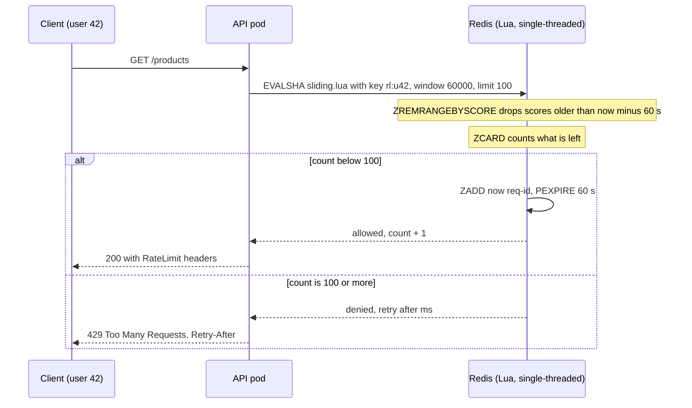
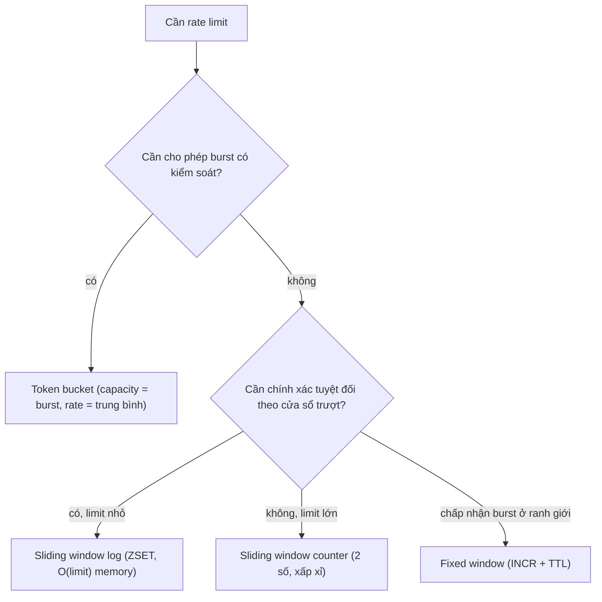

## Bối cảnh & vấn đề

Một public API giới hạn "100 request mỗi phút mỗi API key". Phiên bản đầu tiên dùng `INCR rl:{key}:{minute}` trong Redis, đơn giản và rẻ. Vài tuần sau, một khách hàng lớn phàn nàn rằng họ bị trả `429` dù "chưa gửi tới 100 request", trong khi một khách hàng khác bắn 200 request trong 1 giây quanh mốc đổi phút mà không bị chặn cái nào. Cả hai phàn nàn đều đúng, và cả hai đều bắt nguồn từ cùng một quyết định: **cửa sổ cố định** không phải cửa sổ trượt.

Cùng lúc, team dữ liệu có một job tính "doanh thu lớn nhất trong 1.000 đơn liên tiếp" trên dãy 100.000 đơn, chạy mất cả phút vì mỗi cửa sổ được cộng lại từ đầu. Và team SRE muốn p95 latency trong 5 phút gần nhất mà không lưu mọi sample.

Cả ba là bài toán **cửa sổ trượt** (sliding window): duy trì một đại lượng (tổng, số lượng, max, phân phối) trên một cửa sổ dịch chuyển dọc theo dữ liệu hoặc thời gian, **cập nhật tăng dần** thay vì tính lại. Bài này đi từ kỹ thuật cơ bản (cộng phần tử vào, trừ phần tử ra), qua monotonic deque cho max trong cửa sổ, tới bốn thuật toán rate limit với trade-off của từng cái, và cuối cùng là cài đặt phân tán đúng trên nhiều pod bằng Redis sorted set và Lua script.

## Khái niệm

### Sliding window: cộng vào, trừ ra

**Sliding window** duy trì kết quả của một cửa sổ k phần tử liên tiếp khi cửa sổ trượt từng bước. Cách ngây thơ tính lại tổng của mỗi cửa sổ từ đầu: n − k + 1 cửa sổ × k phép cộng = O(n·k). Nhận xét then chốt: hai cửa sổ liền nhau chỉ khác nhau **hai** phần tử; phần tử `xs[i]` đi vào, phần tử `xs[i − k]` đi ra. Vậy `sum += xs[i] − xs[i − k]` là O(1) mỗi bước, tổng O(n).

Điều kiện để áp dụng: đại lượng phải **cập nhật được tăng dần**, nghĩa là biết cách "thêm một phần tử" và "bỏ một phần tử". Tổng, số lượng, trung bình thì dễ. Max/min thì không trừ ra được (bỏ phần tử max đi thì max mới là gì?), cần cấu trúc phụ là monotonic deque. Phân vị (p95) còn khó hơn, cần histogram hoặc sketch.

**Interview angle:** interviewer muốn nghe câu "mỗi phần tử vào một lần và ra một lần, nên tổng O(n)", không chỉ đoạn code.

### Cửa sổ theo thời gian và two pointers

Cửa sổ có thể tính theo **số phần tử** (1.000 đơn gần nhất) hoặc theo **thời gian** (request trong 60 giây gần nhất). Với cửa sổ thời gian, giữ một deque timestamp: mỗi request mới push timestamp vào cuối, rồi pop khỏi đầu mọi timestamp cũ hơn `now − 60s`; số phần tử còn lại chính là số request trong cửa sổ. Mỗi timestamp vào và ra đúng một lần, nên chi phí amortized O(1).

**Two pointers** là dạng tổng quát: hai chỉ số `left` và `right` cùng tiến về một hướng, `right` mở rộng cửa sổ, `left` thu hẹp khi điều kiện bị vi phạm. Bài "chuỗi con dài nhất có tổng ≤ S" hay "khoảng thời gian dài nhất có không quá 3 lỗi" giải bằng two pointers trong O(n), vì mỗi con trỏ chỉ đi tới, không bao giờ lùi.

**Interview angle:** đếm "request trong 60 giây gần nhất" bằng deque là nền cho thuật toán sliding log; nói được memory O(số request trong cửa sổ) là điểm quan trọng.

### Monotonic deque: max trong cửa sổ O(n)

**Monotonic deque** giữ các chỉ số của phần tử trong cửa sổ theo thứ tự giá trị **giảm dần**. Khi phần tử mới đến, pop khỏi cuối mọi phần tử nhỏ hơn hoặc bằng nó: chúng không bao giờ có thể là max nữa, vì phần tử mới lớn hơn **và** sống lâu hơn chúng trong cửa sổ. Khi phần tử ở đầu deque trượt ra khỏi cửa sổ, pop nó khỏi đầu. Phần tử ở đầu deque luôn là max của cửa sổ hiện tại.

Mỗi chỉ số được push một lần và pop tối đa một lần, nên tổng O(n) thay vì O(n·k) của cách quét lại mỗi cửa sổ, hay O(n log k) nếu dùng heap. Ứng dụng: latency lớn nhất trong 1 phút trượt, giá cao nhất trong N phiên, "peak concurrent users" trong cửa sổ.

**Interview angle:** câu hỏi "vì sao được phép bỏ phần tử nhỏ hơn ở cuối" là chỗ phân biệt người hiểu và người thuộc; đáp án là "nó vừa nhỏ hơn vừa hết hạn sớm hơn phần tử mới".

### Rate limiter: fixed window counter

**Rate limiter** giới hạn số request của một chủ thể (user, API key, IP, tenant) trong một khoảng thời gian. **Fixed window counter** chia thời gian thành các khung cố định (phút 10:00, 10:01, …) và đếm trong mỗi khung: `INCR rl:{key}:{yyyyMMddHHmm}` với TTL. Một lệnh Redis, một số nguyên mỗi key, cực rẻ.

Nhược điểm là **burst ở ranh giới**: 100 request lúc 10:00:59.9 thuộc khung 10:00, 100 request lúc 10:01:00.1 thuộc khung 10:01; cả 200 đều được phép trong 0,2 giây, gấp đôi giới hạn. Ngược lại, người dùng đã "tiêu hết" quota ở đầu phút bị chặn suốt phần còn lại dù cửa sổ 60 giây gần nhất của họ đang giảm dần.

**Interview angle:** interviewer luôn hỏi "fixed window sai ở đâu"; ví dụ bằng số cụ thể (200 request trong 0,2 giây với limit 100/phút) là câu trả lời rõ nhất.

### Sliding window log và sliding window counter

**Sliding window log** lưu **timestamp của mọi request** trong cửa sổ (chính là deque ở trên). Mỗi request: xoá timestamp cũ hơn `now − window`, đếm, nếu còn quota thì thêm timestamp mới. Nó **chính xác tuyệt đối**, nhưng memory là O(limit) mỗi chủ thể: limit 10.000/giờ nghĩa là lưu tới 10.000 timestamp cho mỗi user. Trong Redis, log là một **sorted set** với score là timestamp.

**Sliding window counter** là phép xấp xỉ rẻ: chỉ giữ số đếm của khung **hiện tại** và khung **trước**, rồi ước lượng số request trong cửa sổ trượt bằng `prev × (1 − elapsed) + cur`, với `elapsed` là tỉ lệ thời gian đã trôi qua trong khung hiện tại. Giả định là request trong khung trước phân bố đều. Hai số nguyên mỗi chủ thể, sai số nhỏ trong thực tế; đây là thuật toán mà nhiều CDN và API gateway dùng (verify theo nhà cung cấp).

**Interview angle:** khi được hỏi thiết kế 100 request/60 giây trượt, nêu cả sliding log (chính xác, O(limit) memory) và sliding counter (xấp xỉ, O(1) memory) rồi chọn theo limit là cách trả lời senior.

### Token bucket

**Token bucket** hình dung một cái xô chứa tối đa `capacity` token, được nạp đều `rate` token mỗi giây. Mỗi request lấy một token (hoặc `cost` token cho request đắt); hết token thì bị từ chối. Hai tham số tách biệt hai ý: `rate` là **tốc độ trung bình** dài hạn, `capacity` là **burst** tối đa được phép. Ví dụ `capacity = 10, rate = 5/s`: client im lặng một lúc có thể bắn ngay 10 request, sau đó chỉ được 5 request mỗi giây.

Điểm cài đặt quan trọng: **nạp lazy**. Không cần timer nạp token; mỗi khi có request, tính số token tích luỹ từ lần cuối: `tokens = min(capacity, tokens + elapsed × rate)`. State chỉ là hai số (tokens, last), và thời gian "chờ tới khi có token" tính được chính xác để trả header `Retry-After`. **Leaky bucket** là thuật toán họ hàng: request vào một hàng đợi và được xử lý ra với tốc độ cố định, làm **mượt** traffic thay vì cho phép burst.

**Interview angle:** câu "token bucket khác fixed window thế nào" chờ ý "tách tốc độ trung bình khỏi burst, không có hiệu ứng ranh giới, state O(1)".

### Redis sorted set: skip list + hash table

**Sorted set** (ZSET) của Redis lưu các member duy nhất, mỗi member có một **score** số thực, sắp theo score. Bên trong, khi set lớn, nó dùng hai cấu trúc song song: một **skip list** sắp theo score (range theo score hay theo hạng là O(log n + m)) và một **hash table** member → score (tra score, kiểm tra tồn tại O(1)). Khi set nhỏ (mặc định ≤ 128 phần tử và mỗi phần tử ≤ 64 byte), Redis dùng encoding **listpack** gọn trong một khối bộ nhớ liên tục, rồi tự chuyển sang skip list khi vượt ngưỡng (cấu hình `zset-max-listpack-entries`, `zset-max-listpack-value`).

**Skip list** là một linked list có nhiều tầng "làn cao tốc": mỗi node được thăng lên tầng trên với xác suất cố định (Redis dùng 1/4), nên tầng trên thưa dần và tìm kiếm nhảy qua nhiều node một lúc, O(log n) kỳ vọng. So với cây cân bằng (red-black, AVL), skip list đơn giản hơn nhiều để cài đặt, range scan tự nhiên (đi dọc tầng dưới cùng), và tác giả Redis chọn nó vì dễ hiểu, dễ debug và dễ mở rộng với rank (verify lý do theo tài liệu gốc). Chi tiết về các cấu trúc có thứ tự nằm ở [B+tree, skip list & pagination](/tracks/dsa/learn/ordered-structures-pagination).

Vì sao ZSET làm nhiều thứ trở nên rẻ: **leaderboard** (`ZINCRBY` O(log n), `ZREVRANGE 0 9` lấy top 10, `ZREVRANK` hạng của user O(log n)); **delayed job** (score = thời điểm chạy, lấy job tới hạn bằng `ZRANGE ... BYSCORE -inf now`); **sliding window log** (score = timestamp, `ZREMRANGEBYSCORE` xoá cũ, `ZCARD` đếm).

**Interview angle:** nói được "skip list cho thứ tự + hash cho tra cứu, listpack khi nhỏ" là đủ; follow-up "vì sao skip list thay vì cây" chờ ý đơn giản khi cài đặt và range scan tự nhiên.

### Atomic trong môi trường phân tán

Khi có 10 pod API, rate limiter phải dùng **state chung** (Redis), và thao tác "đọc số đếm, kiểm tra, ghi" phải **atomic**. Nếu làm bằng ba lệnh riêng từ app (`ZREMRANGEBYSCORE`, `ZCARD`, rồi `ZADD`), hai pod có thể cùng đọc `ZCARD = 99`, cùng thấy còn quota, cùng `ZADD`, và user vượt giới hạn. Đây là race condition check-then-act kinh điển.

Redis thực thi **Lua script** (`EVAL`/`EVALSHA`, hoặc Redis Functions) một cách atomic: trong lúc script chạy, không lệnh nào khác được xen vào (Redis xử lý lệnh trên một luồng chính). Nên toàn bộ logic "xoá cũ, đếm, thêm nếu còn quota" nằm trong một script là đúng trên mọi số pod. `MULTI/EXEC` không đủ, vì trong transaction bạn không đọc được kết quả `ZCARD` để quyết định có `ZADD` hay không. Trong Redis Cluster, mọi key mà một script chạm tới phải nằm cùng hash slot; dùng **hash tag** `rl:{user42}` để đảm bảo điều đó.

**Interview angle:** câu hỏi "vì sao phải là Lua" chờ hai ý: atomic giữa đọc và ghi, và `MULTI` không cho rẽ nhánh theo giá trị đọc được.

## Cơ chế hoạt động

Sliding window log trong Redis, gọi từ nhiều pod:



Mỗi request gọi một script duy nhất. Trong script, Redis lấy thời gian của **chính nó** (`TIME`) để mọi pod dùng một đồng hồ, xoá các entry có score cũ hơn `now − window`, đếm phần còn lại, và chỉ thêm entry mới khi còn quota. Vì script atomic, không có khoảng hở nào giữa "đếm" và "thêm" để pod khác chen vào. `PEXPIRE` bằng độ dài cửa sổ đảm bảo key của user không hoạt động tự biến mất. Khi bị từ chối, script tính được thời gian chờ chính xác: entry cũ nhất sẽ hết hạn sau `oldest + window − now` ms.

Quyết định chọn thuật toán:



Câu hỏi đầu tiên là nghiệp vụ có muốn cho phép burst không: API cho phép client "dồn" request sau một lúc im lặng (đồng bộ dữ liệu, mobile app vừa mở lại) hợp với token bucket. Nếu muốn một giới hạn cứng theo cửa sổ, chọn giữa sliding log (chính xác, tốn memory theo limit) và sliding counter (rẻ, xấp xỉ). Fixed window chỉ nên dùng khi hiệu ứng ranh giới chấp nhận được, ví dụ quota theo ngày cho mục đích billing.

## Ví dụ thực tế

### Từ O(n·k) xuống O(n), đếm theo thời gian, và max trong cửa sổ

```ts
function maxSumNaive(xs: number[], k: number) {
  let best = -Infinity, ops = 0;
  for (let i = 0; i + k <= xs.length; i++) {
    let s = 0;
    for (let j = i; j < i + k; j++) { s += xs[j]; ops++; }
    best = Math.max(best, s);
  }
  return { best, ops };
}
function maxSumK(xs: number[], k: number) {
  let sum = 0, ops = 0;
  for (let i = 0; i < k; i++) { sum += xs[i]; ops++; }
  let best = sum;
  for (let i = k; i < xs.length; i++) { sum += xs[i] - xs[i - k]; ops++; best = Math.max(best, sum); }
  return { best, ops };
}
const orders = Array.from({ length: 100_000 }, (_, i) => ((i * 7919) % 1000) + 1);
console.log(maxSumNaive(orders, 1_000), maxSumK(orders, 1_000));

class WindowCounter {                           // requests in the last windowMs
  private ts: number[] = []; private head = 0;
  constructor(private windowMs: number) {}
  hit(now: number) { this.ts.push(now); return this.count(now); }
  count(now: number) {
    while (this.head < this.ts.length && this.ts[this.head] <= now - this.windowMs) this.head++;
    if (this.head > 1024 && this.head * 2 > this.ts.length) { this.ts = this.ts.slice(this.head); this.head = 0; }
    return this.ts.length - this.head;
  }
}
const w = new WindowCounter(60_000);
console.log([0, 10_000, 30_000, 59_999, 60_000, 90_001].map((t) => `${t / 1000}s:${w.hit(t)}`).join(" "));

function windowMax(xs: number[], k: number): number[] {
  const dq: number[] = []; let head = 0; const out: number[] = [];
  for (let i = 0; i < xs.length; i++) {
    while (dq.length > head && xs[dq[dq.length - 1]] <= xs[i]) dq.pop(); // smaller ones can never be max again
    dq.push(i);
    if (dq[head] <= i - k) head++;                                         // front fell out of the window
    if (i >= k - 1) out.push(xs[dq[head]]);
  }
  return out;
}
console.log(windowMax([120, 80, 300, 90, 95, 40, 500, 60], 3)); // latency ms per request
```

Output:

```text
{ best: 500500, ops: 99001000 } { best: 500500, ops: 100000 }
0s:1 10s:2 30s:3 59.999s:4 60s:4 90.001s:3
[ 300, 300, 300, 95, 500, 500 ]
```

Cùng kết quả, nhưng 99 triệu phép cộng so với 100 nghìn: gấp gần 1.000 lần, đúng bằng k. Ở counter thời gian, tại `60s` request lúc `0s` vừa ra khỏi cửa sổ (cửa sổ là `(now − 60s, now]`), nên số đếm vẫn là 4 dù vừa thêm một request; tại `90.001s`, hai request `10s` và `30s` đã hết hạn. Monotonic deque cho max của mỗi cửa sổ 3 phần tử: cửa sổ `[90, 95, 40]` có max 95 vì 300 đã trượt ra.

Follow-up "p95 latency trong 5 phút trượt mà không lưu mọi sample": chia 5 phút thành 30 khung 10 giây, mỗi khung giữ một **histogram** bucket cố định (ví dụ bucket theo luỹ thừa 1,1 của ms, kiểu HDR histogram) hoặc một sketch (t-digest, DDSketch). Cửa sổ trượt là một ring buffer 30 khung; khi một khung hết hạn, bỏ nó; p95 tính bằng cách **gộp** 30 histogram (histogram gộp được bằng cộng từng bucket, còn p95 thì không cộng được). Đây cũng là cách Prometheus histogram và `histogram_quantile` hoạt động.

### Bốn thuật toán trên cùng một burst ở ranh giới

```ts
class TokenBucket {
  private tokens: number; private last: number;
  constructor(private capacity: number, private refillPerSec: number, now: number) { this.tokens = capacity; this.last = now; }
  tryRemove(now: number, cost = 1): { ok: boolean; retryAfterMs: number } {
    this.tokens = Math.min(this.capacity, this.tokens + ((now - this.last) / 1000) * this.refillPerSec); // lazy refill
    this.last = now;
    if (this.tokens >= cost) { this.tokens -= cost; return { ok: true, retryAfterMs: 0 }; }
    return { ok: false, retryAfterMs: Math.ceil(((cost - this.tokens) / this.refillPerSec) * 1000) };
  }
}
class FixedWindow {
  private window = -1; private n = 0;
  constructor(private limit: number, private windowMs: number) {}
  try(now: number) {
    const w = Math.floor(now / this.windowMs);
    if (w !== this.window) { this.window = w; this.n = 0; }
    return ++this.n <= this.limit;
  }
}
class SlidingWindowCounter {
  private cur = -1; private curN = 0; private prevN = 0;
  constructor(private limit: number, private windowMs: number) {}
  try(now: number) {
    const w = Math.floor(now / this.windowMs);
    if (w !== this.cur) { this.prevN = w === this.cur + 1 ? this.curN : 0; this.curN = 0; this.cur = w; }
    const elapsed = (now % this.windowMs) / this.windowMs;  // fraction of the current window elapsed
    const estimate = this.prevN * (1 - elapsed) + this.curN;
    if (estimate >= this.limit) return false;
    this.curN++; return true;
  }
}
// 100 requests at t=59.9s and 100 at t=60.1s, limit 100 per minute
const burst = [...Array(100).fill(59_900), ...Array(100).fill(60_100)];
const fw = new FixedWindow(100, 60_000), sw = new SlidingWindowCounter(100, 60_000);
console.log("fixed window allowed:", burst.filter((t) => fw.try(t)).length,
  "| sliding counter allowed:", burst.filter((t) => sw.try(t)).length);

const tb = new TokenBucket(10, 5, 0);             // capacity 10, refill 5 tokens/s
const r1 = Array.from({ length: 12 }, () => tb.tryRemove(0));
console.log("t=0 burst of 12:", r1.filter((r) => r.ok).length, "allowed, retryAfterMs =", r1.at(-1)!.retryAfterMs);
console.log("t=1s:", Array.from({ length: 6 }, () => tb.tryRemove(1_000).ok).join(","));
```

Output:

```text
fixed window allowed: 200 | sliding counter allowed: 101
t=0 burst of 12: 10 allowed, retryAfterMs = 200
t=1s: true,true,true,true,true,false
```

Fixed window cho qua cả 200 request trong 0,2 giây. Sliding window counter cho qua 101: tại 60,1 giây, khung mới mới trôi 0,17%, nên ước lượng là 100 × 0,998 + 0 ≈ 99,8, còn chỗ cho đúng một request; sai số một request so với sliding log chính xác, đổi lại chỉ lưu hai số. Token bucket cho burst 10 request ngay lập tức, request thứ 11 và 12 bị từ chối với `Retry-After` 200 ms (thời gian nạp một token ở tốc độ 5/s); sau 1 giây, bucket đã nạp lại đúng 5 token.

Các limiter nhận `now` làm tham số thay vì gọi `Date.now()` bên trong: đó là cách làm chúng **test được** một cách xác định. Trong production, dùng đồng hồ monotonic (`performance.now()`) cho limiter in-process, vì `Date.now()` nhảy khi đồng hồ hệ thống được chỉnh.

### Sliding log phân tán bằng Redis Lua

```lua
-- KEYS[1] = rl:{user}   ARGV: window_ms, limit, request_id
local t = redis.call('TIME')                                  -- one clock: the Redis server's
local now = tonumber(t[1]) * 1000 + math.floor(tonumber(t[2]) / 1000)
local window, limit = tonumber(ARGV[1]), tonumber(ARGV[2])
redis.call('ZREMRANGEBYSCORE', KEYS[1], '-inf', now - window) -- drop entries outside the window
local n = redis.call('ZCARD', KEYS[1])
if n >= limit then
  local oldest = redis.call('ZRANGE', KEYS[1], 0, 0, 'WITHSCORES')
  return {0, n, tonumber(oldest[2]) + window - now}           -- denied, count, retry-after ms
end
redis.call('ZADD', KEYS[1], now, ARGV[3])                     -- member must be unique
redis.call('PEXPIRE', KEYS[1], window)
return {1, n + 1, 0}
```

Chạy thật trên Redis 8 với limit 3 cho dễ quan sát:

```bash
for i in 1 2 3 4; do redis-cli --eval sliding.lua 'rl:{u42}' , 60000 3 "req-$i"; done
redis-cli OBJECT ENCODING 'rl:{u42}'
redis-cli CONFIG GET zset-max-listpack-entries
```

```text
1 1 0
1 2 0
1 3 0
0 3 59866
listpack
zset-max-listpack-entries 128
```

Ba request đầu được phép, request thứ tư bị từ chối và phải chờ khoảng 59,9 giây (tới khi `req-1` ra khỏi cửa sổ). `OBJECT ENCODING` cho thấy set nhỏ đang dùng listpack; khi vượt 128 phần tử, Redis tự chuyển sang skip list + hash table. Với limit 100 mỗi user, mỗi user tốn tới 100 entry: 1 triệu user hoạt động là 100 triệu entry, vài GB RAM. Đó là lúc chuyển sang sliding counter.

Member phải **unique** (request id, hoặc `now` ghép với một số ngẫu nhiên): nếu dùng timestamp làm member, hai request cùng mili giây ghi đè nhau (`ZADD` với member đã có chỉ cập nhật score), và user được thêm một request "miễn phí".

Token bucket phân tán cũng là một script, state là hash hai trường:

```lua
-- KEYS[1] = tb:{apiKey}   ARGV: capacity, refill_per_sec, cost
local cap, rate, cost = tonumber(ARGV[1]), tonumber(ARGV[2]), tonumber(ARGV[3])
local t = redis.call('TIME')
local now = tonumber(t[1]) + tonumber(t[2]) / 1e6
local s = redis.call('HMGET', KEYS[1], 'tokens', 'ts')
local tokens = tonumber(s[1]) or cap
local ts = tonumber(s[2]) or now
tokens = math.min(cap, tokens + (now - ts) * rate)   -- lazy refill
local ok = 0
if tokens >= cost then tokens = tokens - cost; ok = 1 end
redis.call('HSET', KEYS[1], 'tokens', tostring(tokens), 'ts', tostring(now))
redis.call('EXPIRE', KEYS[1], math.ceil(cap / rate) * 2)
return {ok, math.floor(tokens)}
```

Sáu lần gọi liên tiếp với capacity 5, rate 1/s cho `1 4`, `1 3`, `1 2`, `1 1`, `1 0`, rồi `0 0`: năm request đầu dùng hết burst, request thứ sáu bị chặn. Giá trị trả về từ Lua sang Redis bị cắt về integer, nên script trả `math.floor(tokens)` và lưu `tostring(tokens)` để không mất phần thập phân của token đang nạp dở.

Phía app, trả `429 Too Many Requests` kèm `Retry-After` (giây), và nên thêm các header mô tả quota. Bản nháp IETF chuẩn hoá `RateLimit-Policy` và `RateLimit` (verify tên và định dạng theo phiên bản bản nháp); nhiều API vẫn dùng kiểu cũ `X-RateLimit-Limit`, `X-RateLimit-Remaining`, `X-RateLimit-Reset`.

## Trade-offs & lựa chọn thay thế

| Thuật toán | State mỗi chủ thể | Chính xác | Burst | Hợp với |
| --- | --- | --- | --- | --- |
| Fixed window (`INCR` + TTL) | 1 số | Sai ở ranh giới (tới 2× limit) | Không kiểm soát | Quota theo ngày, billing, nơi cần rẻ nhất |
| Sliding window log (ZSET) | O(limit) timestamp | Chính xác | Không | Limit nhỏ, cần công bằng tuyệt đối (login, OTP) |
| Sliding window counter | 2 số | Xấp xỉ (giả định phân bố đều) | Không | Limit lớn, API công khai |
| Token bucket | 2 số (tokens, ts) | Chính xác theo mô hình | Có, tới capacity | API cho phép burst, cost theo request |
| Leaky bucket (queue) | Hàng đợi | Chính xác | Làm mượt, không burst | Bảo vệ downstream cần tốc độ đều |

Khi nào chọn cái nào. Mặc định cho API công khai là **token bucket** (Stripe mô tả dùng token bucket cho request rate limiter của họ) hoặc sliding window counter: rẻ, không có hiệu ứng ranh giới đáng kể. Endpoint nhạy cảm với limit nhỏ (đăng nhập 5 lần/15 phút, gửi OTP) dùng sliding log vì chính xác và memory nhỏ khi limit nhỏ. Fixed window hợp với quota dài (ngày, tháng) nơi hiệu ứng ranh giới vô nghĩa.

Ngoài thuật toán còn câu hỏi **đặt ở đâu**. Rate limit ở API gateway hoặc edge (nginx `limit_req` là leaky bucket, AWS API Gateway dùng token bucket (verify)) chặn sớm, rẻ, nhưng chỉ biết IP/API key. Rate limit trong app biết user, tenant, gói dịch vụ, và cost của từng thao tác. Hệ thống thật thường có cả hai: giới hạn thô ở edge chống flood, giới hạn tinh trong app theo nghiệp vụ. Throttle ở client (debounce nút bấm) chỉ là lịch sự; nó không bảo vệ được backend vì client không đáng tin.

## Edge cases & failure modes

- **Redis down**: fail-open (cho qua hết) hay fail-closed (chặn hết)? Với endpoint đăng nhập hoặc gửi OTP, fail-closed hoặc chuyển sang limiter in-process dự phòng, vì fail-open mở cửa cho brute force. Với danh sách sản phẩm, fail-open để không biến sự cố Redis thành sự cố toàn trang. Đặt timeout ngắn (vài chục ms) cho lời gọi limiter.
- **Clock skew giữa pod**: mỗi pod truyền `Date.now()` của mình vào script thì cửa sổ lệch vài trăm ms giữa các pod. Dùng `TIME` của Redis trong script, hoặc chấp nhận và ghi rõ sai số.
- **Member trùng trong ZSET**: timestamp làm member thì request cùng ms ghi đè nhau; dùng request id.
- **Hot key**: một API key lớn dồn mọi request vào một key Redis, một shard. Chia key theo `{key}:{shardN}` với limit chia đều, hoặc limiter cục bộ trong pod cho phần lớn và đồng bộ định kỳ.
- **Limiter in-memory trên nhiều pod**: mỗi pod một state, 10 pod nghĩa là limit thực tế gấp 10 và thay đổi theo autoscaling. Chỉ dùng in-memory khi giới hạn là "mỗi instance" có chủ đích.
- **Retry storm**: client bị 429 retry ngay lập tức, tải tăng thêm. Luôn trả `Retry-After`, và client dùng exponential backoff có jitter.
- **Memory của sliding log**: limit 10.000/giờ × 1 triệu user là 10 tỉ entry. Tính trước, và chọn sliding counter khi limit lớn.
- **Key không có TTL**: user không quay lại để lại key vĩnh viễn; luôn `PEXPIRE`/`EXPIRE` trong cùng script.
- **Tính đúng trong Redis Cluster**: script chạm nhiều key phải cùng slot; dùng hash tag `{...}`.

## Pitfalls

- ❌ Tính lại tổng mỗi cửa sổ từ đầu → ✅ cộng phần tử vào, trừ phần tử ra, O(n) thay vì O(n·k).
- ❌ Dùng heap hoặc quét lại để lấy max mỗi cửa sổ → ✅ monotonic deque, O(n) tổng.
- ❌ Fixed window cho API cần giới hạn chặt → ✅ token bucket hoặc sliding counter, vì fixed window cho qua tới 2× limit ở ranh giới.
- ❌ `ZCARD` rồi `ZADD` bằng hai lệnh từ app → ✅ gói trong một Lua script, vì check-then-act giữa nhiều pod là race condition.
- ❌ Dùng timestamp làm member của sorted set → ✅ request id unique, vì member trùng bị ghi đè.
- ❌ Mỗi pod tự truyền `Date.now()` → ✅ `redis.call('TIME')` trong script để có một đồng hồ.
- ❌ Chỉ throttle ở client → ✅ rate limit ở server (edge + app), vì client không đáng tin.
- ❌ Trả 429 không có `Retry-After` → ✅ trả thời gian chờ chính xác để client backoff đúng thay vì retry dồn dập.

## Tóm tắt

- Sliding window biến O(n·k) thành O(n) bằng cách cập nhật tăng dần: cộng phần tử vào, trừ phần tử ra; cửa sổ thời gian dùng deque timestamp.
- Max/min trong cửa sổ dùng monotonic deque O(n); phân vị trượt dùng ring buffer các histogram/sketch gộp được.
- Fixed window rẻ nhưng cho burst tới 2× ở ranh giới; sliding log chính xác nhưng O(limit) memory; sliding counter xấp xỉ với 2 số; token bucket tách tốc độ trung bình (`rate`) khỏi burst (`capacity`) và nạp lazy.
- Redis sorted set = skip list (thứ tự, range O(log n + m)) + hash table (member → score), listpack khi nhỏ; nền cho leaderboard, delayed job, sliding log.
- Limiter phân tán phải atomic: một Lua script cho "xoá cũ, đếm, thêm", dùng `TIME` của Redis, member unique, TTL, hash tag trong cluster.
- Quyết định vận hành: fail-open hay fail-closed theo endpoint, trả 429 + `Retry-After`, đặt limit ở cả edge lẫn app.
