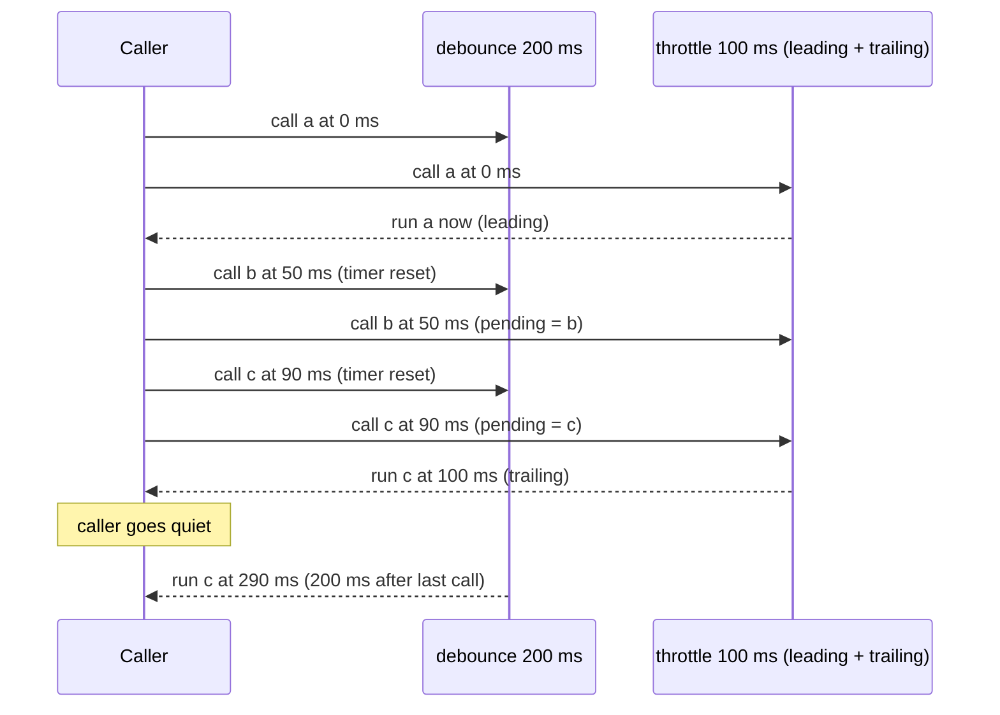
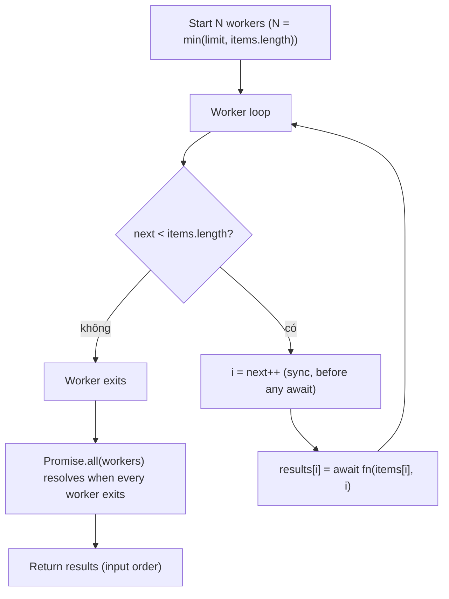

## Bối cảnh & vấn đề

Ô tìm kiếm sản phẩm gọi API mỗi lần người dùng gõ một ký tự. Gõ "iphone 15 pro" là 13 request, mỗi request một query `pg_trgm` trên 2 triệu row. Tệ hơn, request "ip" (chậm, vì kết quả nhiều) về **sau** request "iphone" (nhanh), nên màn hình hiển thị kết quả của "ip" dù ô tìm kiếm ghi "iphone". Ở backend, một job import gửi event "product updated" cho mỗi field thay đổi, 40 event trong 2 giây cho cùng một sản phẩm, mỗi event kích hoạt một lần reindex Elasticsearch. Một script migration khác gọi `Promise.all(ids.map(callPartnerApi))` với 50.000 id, và đối tác chặn API key vì vượt rate limit trong 3 giây.

Ba sự cố, một chủ đề: **kiểm soát nhịp độ** của các tác vụ bất đồng bộ. Debounce gộp một loạt lời gọi dồn dập thành một. Throttle giới hạn tần suất tối đa. Promise pool giới hạn số tác vụ đang chạy **đồng thời**. Cả ba đều là primitive mà interviewer senior thích yêu cầu viết tay, vì code ngắn nhưng đầy bẫy: `this`, closure, timer, thứ tự kết quả, lỗi, huỷ.

Bài này định nghĩa chính xác từng primitive, chỉ ra những chỗ bản tự viết thường sai, xử lý race giữa response cũ và mới, và xây promise pool từ bản cơ bản tới bản có xử lý lỗi, abort và streaming cho input 10 triệu phần tử.

## Khái niệm

### Debounce: chạy sau khi ngừng gọi

**Debounce** trì hoãn việc thực thi cho tới khi hàm **ngừng được gọi** trong X ms. Mỗi lời gọi mới **reset** đồng hồ. Nếu người dùng gõ liên tục mỗi 50 ms với debounce 300 ms, hàm không chạy lần nào cho tới khi họ dừng gõ đủ 300 ms, rồi chạy **một lần** với đối số của lời gọi cuối.

Use case UI: ô tìm kiếm gọi API khi người dùng ngừng gõ; validate form khi ngừng nhập; lưu nháp tự động. Use case backend: gộp nhiều event "product updated" liên tiếp của cùng một sản phẩm thành một lần reindex (debounce theo key, mỗi product id một timer); gộp nhiều thay đổi cấu hình thành một lần reload.

Hai biến thể quan trọng. **Leading edge**: chạy ngay ở lời gọi **đầu tiên** của loạt, rồi bỏ qua các lời gọi tiếp theo cho tới khi im lặng đủ X ms (hữu ích cho nút "Submit" chống double-click). **maxWait**: giới hạn thời gian trì hoãn tối đa; nếu người dùng gõ liên tục 10 giây, debounce thuần không bao giờ chạy, còn `maxWait: 1000` buộc chạy ít nhất mỗi giây. Lodash `_.debounce` hỗ trợ cả `leading`, `trailing`, `maxWait`.

**Interview angle:** định nghĩa bằng một câu ("chạy sau khi ngừng gọi X ms, mỗi lần gọi reset timer") kèm một use case UI và một use case backend là câu trả lời interviewer chờ.

### Throttle: chạy tối đa một lần mỗi X ms

**Throttle** đảm bảo hàm chạy **tối đa một lần** trong mỗi khoảng X ms, bất kể được gọi bao nhiêu lần. Khác debounce, throttle vẫn chạy **đều đặn** trong lúc lời gọi còn dồn dập: scroll liên tục 5 giây với throttle 100 ms cho khoảng 50 lần thực thi, còn debounce cho 1 lần (khi dừng scroll).

Use case UI: xử lý `scroll`/`resize`/`mousemove` (cập nhật vị trí, lazy load); gửi vị trí con trỏ trong app cộng tác. Use case backend: gửi progress update cho client (không cần 10.000 update/giây, 2 update/giây là đủ); log sampling khi một lỗi lặp lại dồn dập. Trong browser, throttle theo frame bằng `requestAnimationFrame` thường tốt hơn một con số ms cố định cho các cập nhật hình ảnh.

**Leading** nghĩa là lời gọi đầu tiên chạy ngay (phản hồi tức thì). **Trailing** nghĩa là nếu có lời gọi rơi vào giữa khoảng chờ, lời gọi **cuối cùng** trong đó sẽ được chạy khi khoảng chờ kết thúc. Thiếu trailing, giá trị cuối cùng có thể bị mất: người dùng resize cửa sổ rồi dừng, nhưng layout được tính theo kích thước của 80 ms trước; progress dừng ở "90%" và không bao giờ báo "100%".

**Interview angle:** câu "khi nào trailing quan trọng" chờ ví dụ cụ thể về giá trị cuối bị mất (progress 100%, vị trí scroll cuối).

### Những chỗ debounce/throttle tự viết thường sai

Lỗi thứ nhất là **mất `this` và đối số**. Viết `setTimeout(() => fn(), ms)` bỏ mất đối số; dùng arrow function làm hàm trả về khiến `this` không được chuyển tiếp khi debounce một method. Bản đúng dùng `function (this, ...args)` và `fn.apply(this, args)`.

Lỗi thứ hai là **không có `cancel`/`flush`**. Component unmount trong khi timer còn chờ, timer chạy và gọi `setState` trên component đã chết (hoặc gọi API không còn cần). Trang sắp đóng mà lần lưu nháp cuối còn nằm trong timer: cần `flush()` để chạy ngay. Lỗi thứ ba là dùng `Date.now()` để đo khoảng thời gian: đồng hồ hệ thống có thể bị chỉnh (NTP), nên `performance.now()` (monotonic) an toàn hơn.

Lỗi phổ biến nhất trong React là **tạo debounce mới mỗi lần render**: `onChange={debounce(handle, 300)}` tạo một hàm debounce mới (với timer riêng) ở mỗi render, nên mỗi ký tự có timer riêng và không có gì được gộp. Hàm debounce phải được tạo **một lần** cho vòng đời component (`useRef`/`useMemo`), luôn gọi phiên bản mới nhất của callback, và bị `cancel` khi unmount.

**Interview angle:** nêu lỗi "debounce mới mỗi render" và cách sửa bằng `useRef` + cleanup là điểm cộng lớn cho vị trí full-stack.

### Race giữa response cũ và mới

Debounce giảm số request nhưng **không** giải quyết thứ tự response. Nếu người dùng gõ "ip", dừng 300 ms (request 1 đi), rồi gõ tiếp thành "iphone" (request 2 đi), request 1 có thể về sau request 2 vì nó trả nhiều kết quả hơn, hoặc vì đi qua một replica chậm hơn. Code `setResults(await fetch(...))` sẽ ghi đè kết quả đúng bằng kết quả cũ.

Hai cách sửa. **Huỷ request cũ** bằng `AbortController`: trước khi gửi request mới, `abort()` request trước; `fetch` bị huỷ sẽ reject với `AbortError`, và bạn bỏ qua lỗi đó. Cách này còn tiết kiệm băng thông và tải server (server có thể dừng sớm nếu nó lắng nghe việc client đóng kết nối). **Bỏ qua response cũ**: gắn số thứ tự tăng dần cho mỗi request, chỉ áp dụng response nếu nó thuộc request mới nhất. Các thư viện data fetching (TanStack Query, SWR) làm việc này sẵn bằng cách key theo query.

**Interview angle:** follow-up "ip rồi iphone, response ip về sau" là câu kiểm tra bạn có tách được "số lượng request" (debounce) và "thứ tự response" (abort/sequence) hay không.

### Promise pool: giới hạn số tác vụ đồng thời

`Promise.all(items.map(fn))` khởi động **tất cả** tác vụ cùng lúc. Với 50.000 item, đó là 50.000 HTTP request đồng thời: vượt rate limit của đối tác, cạn socket, cạn connection pool của database, hoặc OOM vì 50.000 response nằm trong memory. **Promise pool** (concurrency limiter) chỉ cho tối đa N tác vụ **đang chạy** tại một thời điểm; khi một tác vụ xong, tác vụ kế tiếp bắt đầu.

Cách cài gọn nhất là mô hình **N worker kéo từ một con trỏ chung**: tạo N async function, mỗi cái lặp "lấy chỉ số tiếp theo, chạy, ghi kết quả" cho tới khi hết item. Vì JavaScript chạy code đồng bộ trên một luồng, `const i = next++` (trước `await`) là atomic, không có data race; hai worker không bao giờ lấy cùng một chỉ số. Kết quả được ghi theo **chỉ số** (`results[i] = ...`), không `push`, nên thứ tự output khớp thứ tự input dù tác vụ hoàn thành lộn xộn.

Chọn N theo **tài nguyên đích**, không theo cảm tính: rate limit của API (100 request/giây với latency 200 ms thì N ≈ 20), kích thước connection pool của database (không vượt `pool.max`), hay số CPU nếu tác vụ là CPU-bound chạy ở worker thread. Thư viện phổ biến: `p-limit`, `p-map`.

**Interview angle:** interviewer chấm ba điểm: claim chỉ số trước `await`, ghi theo index để giữ thứ tự, và chọn N theo downstream.

### Lỗi, huỷ và streaming trong promise pool

Bản cơ bản dùng `Promise.all` cho các worker nên **fail-fast**: một tác vụ reject làm promise tổng reject ngay, nhưng các worker khác **vẫn chạy tiếp** (Promise không tự huỷ), và kết quả của chúng bị bỏ. Có hai hướng khác. **Gom mọi kết quả** kiểu `allSettled`: mỗi slot lưu `{ status, value | reason }`, để caller quyết định retry những cái lỗi. **Dừng sớm thật sự**: dùng `AbortSignal`, khi lỗi hoặc khi caller huỷ thì worker ngừng lấy tác vụ mới, và tác vụ đang chạy nhận signal để huỷ I/O.

Với input không vừa memory (10 triệu row từ database cursor), không thể tạo mảng `results` 10 triệu phần tử. Chuyển pool thành **async generator**: nhận một `AsyncIterable` làm nguồn, giữ tối đa N promise đang chạy, `yield` kết quả ngay khi một promise xong (theo thứ tự hoàn thành), và chỉ kéo item tiếp theo từ nguồn khi có slot trống. Memory là O(N) bất kể kích thước input, và tốc độ đọc nguồn tự động bị điều tiết theo tốc độ xử lý (backpressure).

**Interview angle:** follow-up "10 triệu row không vừa memory" chờ async iterator với backpressure, không phải "chia mảng thành chunk rồi `Promise.all` từng chunk" (cách chunk để worker rảnh chờ tác vụ chậm nhất của chunk).

## Cơ chế hoạt động

So sánh debounce và throttle trên cùng một chuỗi lời gọi:



Debounce không chạy gì trong suốt loạt lời gọi; mỗi lời gọi đẩy mốc thực thi ra xa thêm. Chỉ khi caller im lặng 200 ms kể từ lời gọi cuối (lúc 90 ms), nó chạy một lần với đối số `c`. Throttle chạy `a` ngay (leading), ghi nhớ lời gọi mới nhất rơi vào khoảng chờ (`b` rồi bị `c` thay thế), và chạy `c` khi khoảng 100 ms kết thúc (trailing). Nếu lời gọi còn tiếp tục, throttle tiếp tục chạy mỗi 100 ms; debounce thì không bao giờ chạy cho tới khi dừng.

Promise pool với N = 3 worker:



Mỗi worker là một vòng lặp async. Bước "lấy chỉ số" là đồng bộ, nên không worker nào xen vào giữa đọc và tăng `next`. Worker `await` tác vụ của nó; trong lúc chờ, event loop chạy các worker khác. Khi một tác vụ xong, worker đó quay lại lấy chỉ số tiếp theo ngay, nên luôn có tối đa N tác vụ đang chạy và không có worker nào rảnh khi còn việc (khác với chia chunk). Khi `next` vượt độ dài mảng, worker thoát; `Promise.all` của các worker resolve khi worker cuối cùng thoát.

## Ví dụ thực tế

### Debounce có cancel/flush và throttle leading + trailing

```ts
function debounce<A extends unknown[]>(fn: (...args: A) => void, ms: number) {
  let t: ReturnType<typeof setTimeout> | undefined;
  let lastArgs: A | undefined;
  let lastThis: unknown;
  const debounced = function (this: unknown, ...args: A) {
    lastArgs = args; lastThis = this;
    clearTimeout(t);
    t = setTimeout(() => { t = undefined; const a = lastArgs!; lastArgs = undefined; fn.apply(lastThis, a); }, ms);
  };
  debounced.cancel = () => { clearTimeout(t); t = undefined; lastArgs = undefined; };
  debounced.flush = () => {
    if (t !== undefined) { clearTimeout(t); t = undefined; const a = lastArgs!; lastArgs = undefined; fn.apply(lastThis, a); }
  };
  return debounced;
}
function throttle<A extends unknown[]>(fn: (...a: A) => void, ms: number, now = () => performance.now()) {
  let last = -Infinity;
  let pending: A | null = null;
  let timer: ReturnType<typeof setTimeout> | undefined;
  return (...args: A) => {
    const remaining = ms - (now() - last);
    if (remaining <= 0) {            // leading edge
      last = now();
      fn(...args);
    } else {
      pending = args;                // remember only the latest call
      timer ??= setTimeout(() => {   // trailing edge
        last = now(); timer = undefined;
        if (pending) fn(...pending);
        pending = null;
      }, remaining);
    }
  };
}
const sleep = (ms: number) => new Promise((r) => setTimeout(r, ms));
let t0 = performance.now();
const log = (label: string) => (...a: unknown[]) =>
  console.log(`${label} @${Math.round((performance.now() - t0) / 10) * 10}ms`, ...a);

const search = debounce(log("debounced search"), 200);  // user types 50 ms apart, then pauses
for (const q of ["i", "ip", "iph", "ipho"]) { search(q); await sleep(50); }
await sleep(300);

t0 = performance.now();
const progress = throttle(log("throttled progress"), 100); // progress events every 30 ms
for (let p = 0; p <= 100; p += 10) { progress(`${p}%`); await sleep(30); }
await sleep(150);
```

Output thật (thời gian làm tròn 10 ms):

```text
debounced search @350ms ipho
throttled progress @0ms 0%
throttled progress @100ms 30%
throttled progress @200ms 60%
throttled progress @300ms 90%
throttled progress @400ms 100%
```

Bốn lần gõ tạo đúng một lần tìm kiếm, với từ cuối "ipho", lúc 350 ms (lời gọi cuối lúc 150 ms cộng 200 ms). Throttle gửi 5 update thay vì 11, và nhờ trailing, "100%" được gửi dù nó rơi vào giữa khoảng chờ. Bỏ trailing, người dùng sẽ thấy thanh tiến trình dừng ở 90%.

Trong React, tạo debounce một lần và dọn dẹp khi unmount:

```tsx
function SearchBox({ onSearch }: { onSearch: (q: string) => void }) {
  const onSearchRef = useRef(onSearch);
  useEffect(() => { onSearchRef.current = onSearch; }, [onSearch]);    // always call the latest callback
  const debounced = useMemo(() => debounce((q: string) => onSearchRef.current(q), 300), []);
  useEffect(() => () => debounced.cancel(), [debounced]);               // no setState after unmount
  return <input onChange={(e) => debounced(e.target.value)} />;
}
```

`useMemo` với dependency rỗng giữ cùng một hàm debounce (và cùng timer) suốt vòng đời component. Ref giải quyết vấn đề thứ hai: nếu debounce đóng gói trực tiếp `onSearch` của render đầu, nó sẽ gọi một callback cũ với state cũ (stale closure).

### Chặn response cũ và debounce trả promise

```ts
const sleep = (ms: number, signal?: AbortSignal) => new Promise<void>((res, rej) => {
  const id = setTimeout(res, ms);
  signal?.addEventListener("abort", () => { clearTimeout(id); rej(new DOMException("aborted", "AbortError")); });
});
async function fakeSearchApi(q: string, signal?: AbortSignal) {
  await sleep(q === "ip" ? 300 : 50, signal);   // "ip" matches a lot, so it is slow
  return `results for "${q}"`;
}

let shown = "";
async function naive(q: string) { shown = await fakeSearchApi(q); }
await Promise.all([naive("ip"), (async () => { await sleep(100); await naive("iphone"); })()]);
console.log("naive shows:", shown);

let controller: AbortController | undefined;
async function latestOnly(q: string) {
  controller?.abort();                          // cancel the previous in-flight request
  controller = new AbortController();
  try { shown = await fakeSearchApi(q, controller.signal); }
  catch (e) { if ((e as Error).name !== "AbortError") throw e; }
}
await Promise.all([latestOnly("ip"), (async () => { await sleep(100); await latestOnly("iphone"); })()]);
console.log("abort shows:", shown);

function debounceAsync<A extends unknown[], R>(fn: (...a: A) => Promise<R>, ms: number) {
  let t: ReturnType<typeof setTimeout> | undefined;
  let waiters: { resolve: (r: R) => void; reject: (e: unknown) => void }[] = [];
  return (...args: A): Promise<R> => new Promise<R>((resolve, reject) => {
    waiters.push({ resolve, reject });
    clearTimeout(t);
    t = setTimeout(async () => {
      const batch = waiters; waiters = [];
      try { const r = await fn(...args); batch.forEach((w) => w.resolve(r)); }
      catch (e) { batch.forEach((w) => w.reject(e)); }
    }, ms);
  });
}
let calls = 0;
const lookup = debounceAsync(async (q: string) => { calls++; return `results for "${q}"`; }, 50);
const rs = await Promise.all(["i", "ip", "iph"].map((q) => lookup(q)));
console.log(rs, "api calls:", calls);
```

Output:

```text
naive shows: results for "ip"
abort shows: results for "iphone"
[ 'results for "iph"', 'results for "iph"', 'results for "iph"' ] api calls: 1
```

Bản ngây thơ hiển thị kết quả của "ip" dù người dùng đã gõ "iphone": response chậm về sau và ghi đè. Bản dùng `AbortController` huỷ request "ip" khi "iphone" bắt đầu, nên chỉ kết quả mới nhất được áp dụng. `debounceAsync` là follow-up hay gặp: mọi caller trong một loạt nhận promise resolve với **kết quả của lời gọi cuối**, và chỉ có một lời gọi API. Điểm tinh tế là mảng `waiters` phải được "chụp" và reset **trước** khi `await fn`, để lời gọi đến trong lúc `fn` đang chạy thuộc về loạt tiếp theo.

### Promise pool: thứ tự, lỗi và streaming

```ts
async function pool<T, R>(items: T[], limit: number, fn: (x: T, i: number) => Promise<R>): Promise<R[]> {
  const results = new Array<R>(items.length);
  let next = 0;
  async function worker() {
    while (next < items.length) {
      const i = next++;                 // claim the index before awaiting
      results[i] = await fn(items[i], i);
    }
  }
  await Promise.all(Array.from({ length: Math.min(limit, items.length) }, worker));
  return results;
}
let inFlight = 0, peak = 0;
const durations = [120, 30, 80, 10, 60, 40, 20, 90];
const t0 = performance.now();
const out = await pool(durations, 3, async (ms, i) => {
  inFlight++; peak = Math.max(peak, inFlight);
  await sleep(ms);
  inFlight--;
  return `task${i}(${ms}ms)`;
});
console.log(out.join(" "));
console.log(`peak in flight=${peak}, wall=${Math.round((performance.now() - t0) / 10) * 10}ms (sequential would be ${durations.reduce((a, b) => a + b)}ms)`);
```

```text
task0(120ms) task1(30ms) task2(80ms) task3(10ms) task4(60ms) task5(40ms) task6(20ms) task7(90ms)
peak in flight=3, wall=210ms (sequential would be 450ms)
```

Kết quả đúng thứ tự input dù task3 (10 ms) xong trước task0 (120 ms). Không bao giờ quá 3 tác vụ chạy cùng lúc. Tổng thời gian 210 ms so với 450 ms tuần tự; với N lớn hơn thì nhanh hơn nữa, cho tới khi chạm giới hạn của downstream.

Bản gom lỗi kiểu `allSettled`, có `AbortSignal` để dừng lấy tác vụ mới:

```ts
type Settled<R> = { status: "fulfilled"; value: R } | { status: "rejected"; reason: unknown };
async function poolSettled<T, R>(items: T[], limit: number,
    fn: (x: T, i: number, s: AbortSignal) => Promise<R>, signal?: AbortSignal): Promise<Settled<R>[]> {
  const results = new Array<Settled<R>>(items.length);
  const ctrl = new AbortController();
  signal?.addEventListener("abort", () => ctrl.abort(signal.reason));
  let next = 0;
  async function worker() {
    while (next < items.length && !ctrl.signal.aborted) {
      const i = next++;
      try { results[i] = { status: "fulfilled", value: await fn(items[i], i, ctrl.signal) }; }
      catch (reason) { results[i] = { status: "rejected", reason }; }
    }
  }
  await Promise.all(Array.from({ length: Math.min(limit, items.length) }, worker));
  return results;
}
const settled = await poolSettled([1, 2, 3, 4, 5], 2, async (x) => {
  await sleep(10); if (x === 3) throw new Error("boom"); return x * 10;
});
console.log(settled.map((r) => (r.status === "fulfilled" ? r.value : `ERR:${(r.reason as Error).message}`)).join(" "));
```

```text
10 20 ERR:boom 40 50
```

Tác vụ 3 lỗi nhưng không kéo theo cả lô; caller nhận danh sách đầy đủ và có thể retry riêng phần lỗi (với backoff). `fn` nhận `signal` để truyền tiếp vào `fetch(url, { signal })`, nên khi caller huỷ, cả tác vụ đang chạy cũng dừng.

Bản streaming cho input không vừa memory:

```ts
async function* mapConcurrent<T, R>(source: AsyncIterable<T> | Iterable<T>, limit: number,
    fn: (x: T) => Promise<R>): AsyncGenerator<R> {
  const it = (Symbol.asyncIterator in source
    ? source[Symbol.asyncIterator]()
    : (source as Iterable<T>)[Symbol.iterator]()) as AsyncIterator<T> | Iterator<T>;
  const running = new Map<number, Promise<{ id: number; value: R }>>();
  let id = 0, done = false;
  const fill = async () => {
    while (!done && running.size < limit) {
      const n = await it.next();
      if (n.done) { done = true; break; }
      const myId = id++;
      running.set(myId, fn(n.value).then((value) => ({ id: myId, value })));
    }
  };
  await fill();
  while (running.size) {
    const { id: finished, value } = await Promise.race(running.values());
    running.delete(finished);
    yield value;                  // consumer pulls, so the source is read only as fast as we process
    await fill();
  }
}
async function* rows() { for (let i = 1; i <= 6; i++) yield i; } // imagine a DB cursor over 10 million rows
const order: number[] = [];
for await (const r of mapConcurrent(rows(), 2, async (i) => { await sleep(i % 2 ? 40 : 10); return i; })) order.push(r);
console.log("completion order:", order.join(","));
```

```text
completion order: 2,1,3,4,6,5
```

Kết quả ra theo thứ tự **hoàn thành** (2 xong trước 1), memory tối đa 2 tác vụ, và nguồn chỉ được đọc khi có slot trống. Với database cursor hoặc stream đọc file, đây là backpressure tự nhiên: nếu consumer (ví dụ ghi vào một hệ thống khác) chậm, generator không kéo thêm row. Bản production cần thêm xử lý lỗi (một promise reject làm `Promise.race` reject) và đóng iterator nguồn khi consumer `break`.

## Trade-offs & lựa chọn thay thế

| Primitive | Hành vi | Hợp với | Không hợp với |
| --- | --- | --- | --- |
| Debounce (trailing) | Chạy một lần sau khi ngừng gọi X ms | Search box, autosave, gộp event theo key | Cập nhật liên tục cần phản hồi đều (scroll) |
| Debounce leading | Chạy ngay lần đầu, bỏ qua loạt sau | Chống double-submit | Cần giá trị cuối |
| Debounce + maxWait | Như trên, nhưng chạy ít nhất mỗi maxWait | Gõ liên tục lâu, vẫn cần cập nhật định kỳ | Khi một lần duy nhất là đủ |
| Throttle leading + trailing | Tối đa một lần mỗi X ms, giữ giá trị cuối | Scroll, resize, progress, log sampling | Gộp thành đúng một lần |
| `requestAnimationFrame` | Tối đa một lần mỗi frame | Cập nhật hình ảnh trong browser | Backend |
| `Promise.all` | Mọi tác vụ đồng thời, fail-fast | Vài chục tác vụ độc lập | Hàng nghìn tác vụ, downstream có giới hạn |
| Promise pool | Tối đa N đồng thời, giữ thứ tự | Gọi API/DB hàng loạt | Input không vừa memory |
| Async iterator pool | Tối đa N, streaming, backpressure | Hàng triệu item từ cursor/stream | Cần kết quả đúng thứ tự input (phải thêm buffer) |
| Chunk + `Promise.all` | N đồng thời theo lô | Đơn giản, API batch | Tác vụ có thời gian lệch nhau (worker rảnh chờ) |

Khi nào chọn cái nào. Câu hỏi phân biệt debounce và throttle: bạn muốn **một** lần thực thi khi mọi thứ lắng xuống (debounce), hay **đều đặn** trong lúc sự kiện còn diễn ra (throttle)? Với concurrency, `Promise.all` chỉ an toàn khi số tác vụ nhỏ và biết trước; ngay khi số tác vụ phụ thuộc vào dữ liệu (số id, số dòng trong file), dùng pool với N theo downstream. Và luôn nhớ: throttle ở **client** chỉ là tối ưu trải nghiệm, bảo vệ backend phải là rate limit ở **server** (xem [sliding window & rate limiter](/tracks/dsa/learn/sliding-window-rate-limiting)).

## Edge cases & failure modes

- **Debounce không bao giờ chạy**: sự kiện đến liên tục (sensor, websocket stream) nên timer luôn bị reset. Thêm `maxWait`.
- **Mất lần gọi cuối khi đóng trang/tắt process**: timer còn chờ khi `beforeunload` hoặc `SIGTERM`. Gọi `flush()` trong handler tắt (graceful shutdown ở backend).
- **Debounce theo key bị rò memory**: gộp event theo product id bằng `Map<id, timer>` mà không xoá entry sau khi chạy, map lớn mãi. Xoá khi timer bắn.
- **Debounce trong serverless/nhiều pod**: timer chỉ sống trong một process; Lambda có thể bị đóng băng trước khi timer bắn, và event cùng key đến hai pod không được gộp. Dùng queue có delay/dedupe (ví dụ message group + dedupe ID) hoặc Redis key có TTL.
- **Đồng hồ nhảy**: `Date.now()` lùi khi NTP chỉnh, throttle chặn lâu bất thường. Dùng `performance.now()`.
- **Pool với `fn` ném lỗi đồng bộ**: `fn` không phải async và ném trước khi trả promise; worker vẫn bắt được vì lời gọi nằm trong `await` của một async function, nhưng nếu gọi `fn` bên ngoài `try` ở phiên bản khác thì một lỗi đồng bộ giết cả pool.
- **Pool fail-fast để lại tác vụ chạy ngầm**: `Promise.all` reject nhưng các worker vẫn tiếp tục gọi API. Thêm kiểm tra `signal.aborted` trong vòng lặp worker.
- **N quá lớn so với connection pool**: pool 50 tác vụ mà `pg.Pool` `max: 10` nghĩa là 40 tác vụ chờ connection, timeout hàng loạt. N ≤ kích thước pool của downstream.
- **Retry không có backoff trong pool**: tác vụ lỗi vì 429 được retry ngay, làm rate limit tệ hơn. Exponential backoff có jitter, tôn trọng `Retry-After`.

## Pitfalls

- ❌ `onChange={debounce(handle, 300)}` trong React → ✅ tạo một lần bằng `useMemo`/`useRef`, gọi callback mới nhất qua ref, `cancel` khi unmount.
- ❌ `setTimeout(() => fn(), ms)` trong debounce → ✅ `fn.apply(this, args)` với đối số của lời gọi cuối, để không mất `this` và args.
- ❌ Nghĩ debounce giải quyết response cũ ghi đè response mới → ✅ `AbortController` hoặc số thứ tự request, vì debounce chỉ giảm số request.
- ❌ Throttle không có trailing cho progress/resize → ✅ leading + trailing, để giá trị cuối (100%, kích thước cuối) không bị mất.
- ❌ `Promise.all(ids.map(callApi))` với số id không giới hạn → ✅ promise pool với N theo rate limit và connection pool của downstream.
- ❌ `results.push(await fn(x))` trong pool → ✅ `results[i] = ...` theo chỉ số đã claim, để giữ thứ tự input.
- ❌ Chia chunk rồi `Promise.all` từng chunk → ✅ worker kéo từ con trỏ chung, để không có worker rảnh chờ tác vụ chậm nhất của chunk.
- ❌ Chỉ throttle ở client để bảo vệ API → ✅ rate limit ở server, vì client có thể bị sửa hoặc gọi trực tiếp.

## Tóm tắt

- Debounce: chạy **một lần sau khi ngừng gọi** X ms (mỗi lời gọi reset timer); biến thể leading và `maxWait`; cần `cancel`/`flush`.
- Throttle: chạy **tối đa một lần mỗi X ms**; leading cho phản hồi tức thì, trailing để không mất giá trị cuối.
- Bản tự viết hay sai ở `this`/args, thiếu cancel, `Date.now()` thay vì `performance.now()`, và trong React là tạo debounce mới mỗi render.
- Debounce không sửa race giữa response cũ và mới; dùng `AbortController` hoặc số thứ tự request.
- Promise pool: N worker kéo từ con trỏ chung, claim chỉ số trước `await`, ghi theo index để giữ thứ tự, N chọn theo downstream.
- Xử lý lỗi theo nhu cầu (fail-fast, `allSettled`, abort), và với input khổng lồ dùng async generator giữ tối đa N tác vụ, có backpressure.
