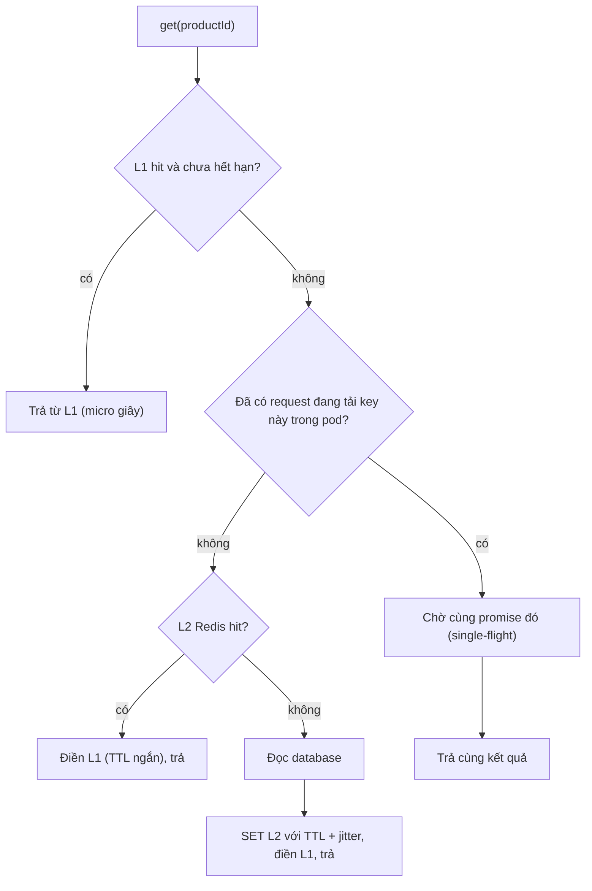
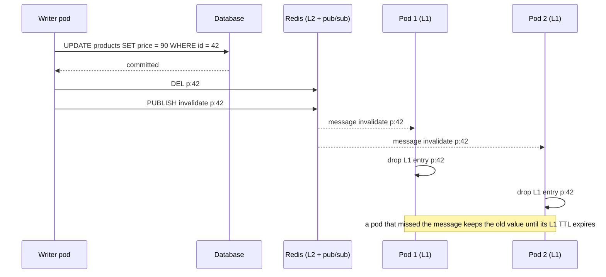

## Bối cảnh & vấn đề

Service catalog có 30 pod, mỗi pod giữ một LRU cache in-process 10.000 sản phẩm. Dashboard báo hit rate 95% trên một pod, vậy mà database vẫn bị dồn tải theo ba kiểu rất đều đặn: ngay sau mỗi lần deploy, đúng đầu mỗi giờ, và mỗi đêm lúc 2 giờ sáng. Team thử tăng kích thước cache lên gấp đôi, không khá hơn.

Mỗi kiểu dồn tải có một nguyên nhân riêng. Sau deploy, 30 pod mới đều khởi động với cache **rỗng** (cold start) và cùng hỏi database. Đầu giờ, hàng nghìn key được set cùng lúc với cùng TTL 1 giờ, nên **hết hạn cùng lúc**, và mỗi key hết hạn bị hàng trăm request cùng lúc đi tính lại (cache stampede). Lúc 2 giờ sáng, một job export duyệt toàn bộ catalog qua chính cache đó, đẩy mọi sản phẩm hot ra ngoài (scan pollution), vì LRU chỉ nhìn "dùng gần đây nhất" chứ không nhìn "dùng thường xuyên nhất".

Bài này đi từ cách cài LRU O(1) (và vì sao trong JavaScript một `Map` là đủ), qua TTL, giới hạn theo bytes, LFU và W-TinyLFU, cách Redis xấp xỉ LRU/LFU, rồi tới ba failure mode ở trên và thiết kế một cache hai tầng (L1 in-process + L2 Redis) cho nhiều pod với invalidation và chống stampede. Chủ đề caching ở tầng hệ thống được đào sâu hơn trong [track Caching](/tracks/caching).

## Khái niệm

### Cache và eviction policy

**Cache** là một bản sao nhanh của dữ liệu mà nguồn gốc chậm hơn (database, API). Vì bộ nhớ có hạn, khi cache đầy phải chọn phần tử nào bị bỏ ra: đó là **eviction policy**. Mục tiêu của policy là tối đa **hit rate** (tỉ lệ request được phục vụ từ cache), với giả định rằng quá khứ dự đoán được tương lai.

Hai tín hiệu chính từ quá khứ là **recency** (phần tử được dùng gần đây có khả năng được dùng lại sớm) và **frequency** (phần tử được dùng nhiều có khả năng được dùng tiếp). LRU chỉ dùng recency, LFU chỉ dùng frequency, còn các policy hiện đại như W-TinyLFU kết hợp cả hai. Không có policy nào tốt nhất cho mọi workload; hit rate phụ thuộc vào **phân phối truy cập** thật.

**Interview angle:** mở đầu bằng "policy nào phụ thuộc vào workload, đây là hai tín hiệu recency và frequency" cho thấy bạn không học thuộc một đáp án.

### LRU và cài đặt O(1)

**LRU** (least recently used) bỏ ra phần tử **lâu nhất chưa được dùng**. Cài đặt kinh điển gồm hai cấu trúc: một **hash map** key → node để tìm O(1), và một **doubly linked list** sắp theo thứ tự dùng. Mỗi lần `get` hoặc `set`, node được tháo ra khỏi vị trí hiện tại và gắn vào đầu danh sách (O(1) vì có con trỏ `prev` và `next`). Khi đầy, bỏ node ở cuối danh sách (O(1)). Hash map đơn thuần không đủ vì không có thứ tự; linked list đơn thuần không đủ vì tìm key là O(n).

Trong JavaScript, **`Map` giữ thứ tự chèn**, và `delete`, `set`, lấy key đầu tiên (`map.keys().next()`) đều O(1). Vậy `delete(key)` rồi `set(key, value)` đưa key về cuối (mới nhất), và key đầu tiên luôn là key cũ nhất. Một `Map` đóng vai cả hash map lẫn danh sách thứ tự. Plain object **không** làm được điều này: key dạng số nguyên luôn được liệt kê trước theo thứ tự số (xem [Hash map trong JavaScript](/tracks/dsa/learn/hash-maps-js)), nên "key đầu tiên" không phải key cũ nhất.

Một chi tiết nhỏ nhưng hay bị hỏi: `get` phải dùng `map.has(key)` rồi mới `get`, vì nếu value hợp lệ có thể là `undefined` (hoặc `0`, `""`), kiểm tra `if (!v)` sẽ coi nhầm hit thành miss.

**Interview angle:** câu hỏi yêu cầu viết LRU là câu chấm điểm nhiều nhất của track; nêu cả bản cổ điển (hash map + DLL) lẫn lý do `Map` đủ trong JS là câu trả lời trọn vẹn.

### TTL và giới hạn theo bytes

Production cache cần thêm hai thứ. **TTL** (time to live): mỗi entry có thời điểm hết hạn, để dữ liệu cũ không sống mãi dù không bị evict. Cách rẻ nhất là **lazy expiration**: lưu `expiresAt` cùng value, khi `get` thấy đã hết hạn thì xoá và trả miss. Không cần quét toàn bộ map. Nhược điểm là entry hết hạn nhưng không ai đọc vẫn chiếm memory; bù lại bằng một **sweeper** định kỳ quét một phần, hoặc một min-heap theo `expiresAt` (xem [Heap](/tracks/dsa/learn/heaps-top-k)) để xoá đúng những entry hết hạn.

**Giới hạn theo bytes** thay vì số entry: 10.000 entry có thể là 10 MB hoặc 2 GB tuỳ kích thước value. Trong Node.js, heap có giới hạn, và một cache không giới hạn bytes là nguồn OOM kinh điển. Mỗi entry lưu kèm kích thước ước lượng (độ dài JSON, hoặc `Buffer.byteLength`), và evict theo LRU cho tới khi tổng bytes dưới ngưỡng. Thư viện `lru-cache` hỗ trợ sẵn `max`, `maxSize` + `sizeCalculation`, `ttl`.

**Interview angle:** follow-up "thêm TTL mà không quét cả map" chờ lazy expiration + sweeper hoặc heap theo `expiresAt`.

### LFU và vấn đề aging

**LFU** (least frequently used) bỏ ra phần tử có **số lần truy cập ít nhất**. Nó chống được scan pollution: một job duyệt catalog chạm mỗi sản phẩm lạnh đúng một lần, nên chúng có frequency 1 và bị evict trước các sản phẩm hot có frequency hàng nghìn.

Cài LFU O(1): `Map<key, {value, freq}>`, cộng `Map<freq, Set<key>>` (mỗi tần suất một tập key, `Set` giữ thứ tự chèn để phá hoà theo LRU), cộng biến `minFreq`. Truy cập một key: chuyển nó từ tập `freq` sang tập `freq + 1`; nếu tập cũ rỗng và bằng `minFreq` thì tăng `minFreq`. Evict: lấy key đầu tiên của tập `minFreq`. Thêm key mới: freq = 1, `minFreq = 1`.

Nhược điểm lớn của LFU thuần là **không quên**: một sản phẩm cực hot trong đợt flash sale tuần trước có frequency 100.000 và sẽ ở trong cache mãi dù không ai xem nữa, trong khi sản phẩm mới hot hôm nay phải "tích luỹ" từ 1. LFU thực dụng cần **aging/decay**: định kỳ chia đôi mọi bộ đếm, hoặc giảm bộ đếm theo thời gian không truy cập. Redis LFU làm đúng điều này (xem bên dưới).

**Interview angle:** interviewer hỏi "LRU hay LFU cho catalog có long tail và flash sale hằng ngày"; câu trả lời tốt chỉ ra điểm yếu của cả hai (LRU dễ bị scan, LFU không quên) và đề xuất W-TinyLFU hoặc LFU có decay.

### W-TinyLFU: admission thay vì chỉ eviction

LRU và LFU đều trả lời "bỏ ai ra". **TinyLFU** thêm một câu hỏi thứ hai: **có nên cho phần tử mới vào không** (admission). Khi cache đầy và một phần tử mới đến, so sánh tần suất ước lượng của nó với tần suất của ứng viên bị evict; chỉ nhận phần tử mới nếu nó "đáng" hơn. Tần suất được ước lượng bằng một **Count-Min Sketch** nhỏ (vài byte mỗi entry, xem [Heap & top-K](/tracks/dsa/learn/heaps-top-k)) có aging định kỳ (chia đôi mọi bộ đếm sau mỗi W lần truy cập), nên nó nhớ cả những key **không** nằm trong cache.

**W-TinyLFU** (dùng trong thư viện Caffeine của Java) gồm một **window LRU** nhỏ (khoảng 1% dung lượng) cho phần tử mới để chúng có cơ hội tích luỹ tần suất (chống lại burst ngắn), và một **main cache** SLRU (segmented LRU: phần probation và phần protected) phía sau, với TinyLFU làm cổng giữa hai phần. Kết quả trên nhiều trace thực tế là hit rate gần với policy tối ưu lý thuyết, với overhead memory nhỏ (verify số liệu theo benchmark của Caffeine).

**Interview angle:** không ai yêu cầu bạn cài W-TinyLFU trong 45 phút; interviewer muốn nghe bạn biết nó tồn tại, nó giải quyết cái gì (scan + burst + aging), và dùng thư viện thay vì tự viết.

### Eviction xấp xỉ của Redis

Redis khi chạm `maxmemory` evict theo `maxmemory-policy` (`allkeys-lru`, `allkeys-lfu`, `volatile-ttl`, …; mặc định là `noeviction`, trả lỗi khi ghi). Nhưng Redis **không** duy trì một danh sách LRU chính xác cho hàng triệu key, vì điều đó tốn thêm hai con trỏ mỗi key và thêm công việc mỗi lần truy cập. Thay vào đó, mỗi key lưu một timestamp truy cập 24 bit, và khi cần evict, Redis **lấy mẫu** ngẫu nhiên `maxmemory-samples` key (mặc định 5) rồi bỏ key "tệ nhất" trong mẫu, có kết hợp một pool ứng viên để cải thiện chất lượng.

Với LFU, Redis dùng một bộ đếm **logarit** 8 bit (kiểu Morris counter): bộ đếm tăng với xác suất giảm dần khi nó lớn lên (điều chỉnh bằng `lfu-log-factor`, mặc định 10), nên 8 bit biểu diễn được tới hàng triệu lần truy cập; và bộ đếm **giảm dần** theo thời gian không truy cập (`lfu-decay-time`, mặc định 1 phút) để giải quyết vấn đề aging. Xấp xỉ được chấp nhận vì mục tiêu là hit rate tổng thể, không phải chọn đúng tuyệt đối từng victim; tăng `maxmemory-samples` lên 10 cho kết quả gần LRU thật với chút CPU (verify theo tài liệu eviction).

**Interview angle:** câu "LRU của Redis là xấp xỉ nghĩa là gì" chờ ý lấy mẫu + trade-off memory/CPU, và cho LFU là bộ đếm logarit có decay.

### Cold start, stampede và scan pollution

**Cold start**: cache in-process rỗng khi process khởi động. Với 30 pod deploy cùng lúc (rolling nhanh), database nhận lượng miss của 30 cache rỗng cùng lúc. Thêm pod cũng làm hit rate tổng **giảm**: mỗi pod phải tự làm nóng cache riêng. Giảm nhẹ: L2 dùng chung (Redis) để pod mới làm nóng từ L2 thay vì database, warm-up top key khi khởi động, deploy từ từ.

**Cache stampede** (thundering herd): một key hot hết hạn, và mọi request đang đến trong khoảng thời gian tính lại (ví dụ 200 ms) đều miss và đều đi hỏi database. Với 2.000 request/giây cho key đó, là 400 query giống hệt nhau. Ba biện pháp bổ sung nhau: **single-flight** (chỉ một request tính lại mỗi key, các request khác chờ cùng promise đó), **TTL có jitter** (TTL ngẫu nhiên ±10% để các key không hết hạn cùng lúc), và **stale-while-revalidate** (hết "hạn mềm" thì vẫn trả bản cũ ngay, đồng thời refresh ở nền; chỉ hết "hạn cứng" mới chặn).

**Scan pollution**: truy cập một lần duy nhất (job export, crawler, báo cáo) đẩy hot key ra khỏi LRU. Biện pháp: policy có frequency (LFU có decay, W-TinyLFU), hoặc cho job batch **bỏ qua cache** (đọc thẳng database/replica).

**Interview angle:** scenario "hit rate 95% nhưng DB vẫn bị dồn" có ba phần trả lời (deploy, đầu giờ, scan), mỗi phần một cơ chế và một biện pháp; trả lời đủ cả ba là điểm tối đa.

### Cache hai tầng: L1 in-process + L2 Redis

**L1** là cache trong memory của mỗi pod: nhanh nhất (không có network, micro giây), nhưng nhỏ, riêng từng pod, và mất khi restart. **L2** là Redis dùng chung: chậm hơn (một round-trip, dưới 1 ms trong cùng AZ), lớn hơn, chia sẻ giữa mọi pod, sống qua deploy. Kết hợp: đọc L1 → L2 → database, và điền ngược lên các tầng trên.

Vấn đề khó nhất là **invalidation**. Khi giá sản phẩm đổi, L2 có thể xoá được bằng một lệnh, nhưng 30 bản copy trong L1 của 30 pod thì sao? Cách phổ biến: sau khi ghi database, **xoá** key ở L2 (xoá thay vì cập nhật, để tránh race hai writer ghi đè giá trị cũ), rồi **broadcast** thông điệp invalidation (Redis pub/sub, hoặc event bus) để mọi pod xoá bản L1. Pub/sub của Redis là **at-most-once**: pod đang mất kết nối sẽ lỡ message. Vì vậy L1 luôn có **TTL ngắn** (vài giây) làm lưới an toàn, và cam kết với product team là "dữ liệu có thể cũ tối đa bằng TTL của L1 trong trường hợp xấu nhất". Redis cũng có tính năng client-side caching với tracking (server tự gửi invalidation cho key client đã đọc), nếu client library hỗ trợ (verify).

**Interview angle:** câu trả lời senior cho "bạn cam kết consistency gì" là một câu nói bằng lời thường: "sau khi ghi, mọi pod thấy giá mới trong vòng vài trăm ms trong điều kiện bình thường, và tối đa N giây nếu mất message".

## Cơ chế hoạt động

Luồng đọc của cache hai tầng có single-flight:



Phần lớn request dừng ở L1. Khi L1 miss, single-flight đảm bảo trong một pod chỉ có một request đi xuống dưới cho mỗi key; các request khác cùng key chờ chung promise. L2 phục vụ các miss của L1 (cold start, TTL L1 hết hạn) mà không chạm database. Chỉ khi cả hai tầng đều miss mới đọc database, và giá trị được ghi vào L2 với TTL có jitter để các key không hết hạn đồng loạt. Với 30 pod, trong trường hợp xấu nhất vẫn có tối đa 30 request cùng key xuống database (một mỗi pod); muốn chặn ở mức toàn cụm thì thêm một lock ngắn trong Redis (`SET lock:key NX PX 3000`) hoặc early refresh.

Luồng ghi và invalidation:



Thứ tự quan trọng: ghi database **trước**, rồi mới xoá cache. Nếu xoá cache trước, một request đọc chen vào giữa sẽ đọc giá cũ từ database và ghi lại vào cache, và cache sai cho tới khi hết TTL. Xoá (thay vì ghi giá mới vào cache) tránh race khi hai writer cập nhật gần như cùng lúc: request đọc tiếp theo luôn nạp giá trị mới nhất từ database. Pub/sub đưa invalidation tới mọi pod trong vài ms; pod nào lỡ message sẽ tự đúng lại khi TTL L1 hết.

## Ví dụ thực tế

### LRU bằng Map, có TTL và giới hạn bytes

```ts
class LRU<K, V> {
  private map = new Map<K, V>();
  constructor(private max: number) {}
  get(key: K): V | undefined {
    if (!this.map.has(key)) return undefined;
    const v = this.map.get(key)!;
    this.map.delete(key);          // move to the "newest" end
    this.map.set(key, v);
    return v;
  }
  set(key: K, value: V) {
    if (this.map.has(key)) this.map.delete(key);
    else if (this.map.size >= this.max) this.map.delete(this.map.keys().next().value!); // evict oldest
    this.map.set(key, value);
  }
  keys() { return [...this.map.keys()]; }
}
const c = new LRU<string, number>(3);
c.set("a", 1); c.set("b", 2); c.set("c", 3);
c.get("a");                 // a becomes newest
c.set("d", 4);              // evicts b (oldest)
console.log(c.keys(), c.get("b"));

class TtlLru<V> {
  private map = new Map<string, { v: V; exp: number; bytes: number }>();
  private bytes = 0;
  hits = 0; misses = 0;
  constructor(private maxBytes: number, private ttlMs: number, private now = () => Date.now()) {}
  get(key: string): V | undefined {
    const e = this.map.get(key);
    if (!e || e.exp <= this.now()) { if (e) this.drop(key, e); this.misses++; return undefined; } // lazy expiry
    this.map.delete(key); this.map.set(key, e); this.hits++;
    return e.v;
  }
  set(key: string, v: V, bytes: number) {
    const old = this.map.get(key); if (old) this.drop(key, old);
    this.map.set(key, { v, exp: this.now() + this.ttlMs, bytes }); this.bytes += bytes;
    for (const [k, e] of this.map) { if (this.bytes <= this.maxBytes) break; this.drop(k, e); } // oldest first
  }
  private drop(k: string, e: { bytes: number }) { this.map.delete(k); this.bytes -= e.bytes; }
  stats() { return { entries: this.map.size, bytes: this.bytes, hitRate: this.hits / Math.max(1, this.hits + this.misses) }; }
}
let clock = 0;
const t = new TtlLru<string>(1_000, 5_000, () => clock);
t.set("p1", "x", 400); t.set("p2", "y", 400); t.set("p3", "z", 400); // 1200 bytes > 1000, so p1 goes
console.log(t.get("p1"), t.get("p2"), t.stats());
clock = 6_000;
console.log(t.get("p2"), t.stats());
```

Output:

```text
[ 'c', 'a', 'd' ] undefined
undefined y { entries: 2, bytes: 800, hitRate: 0.5 }
undefined { entries: 1, bytes: 400, hitRate: 0.3333333333333333 }
```

`get("a")` đưa `a` về cuối, nên khi thêm `d`, `b` (cũ nhất) bị evict. Ở bản có bytes, thêm `p3` làm tổng vượt 1.000 byte, `p1` bị bỏ. Sau khi đồng hồ tiến 6 giây (vượt TTL 5 giây), `get("p2")` phát hiện hết hạn, xoá, và trả miss; entry của `p3` vẫn nằm đó (hết hạn nhưng chưa ai đọc) cho tới khi một sweeper dọn hoặc nó bị evict. Đồng hồ được inject (`now`) để test xác định, cùng kỹ thuật với limiter ở bài trước.

### LRU so với LFU dưới scan pollution

Workload mô phỏng: 90% lượt đọc rơi vào 500 sản phẩm hot, 10% rải trên 50.000 sản phẩm đuôi dài; cứ mỗi 2.000 lượt đọc, một job export duyệt 2.000 sản phẩm lạnh qua cache. Cache chứa 1.000 entry. Chỉ đo hit rate trên traffic người dùng.

```ts
// LFU in O(1): key -> {value, freq}, freq -> insertion-ordered Set of keys, plus minFreq
class LFU<K, V> {
  private vals = new Map<K, { v: V; f: number }>();
  private byFreq = new Map<number, Set<K>>();
  private minFreq = 0;
  constructor(private max: number) {}
  private touch(key: K, e: { v: V; f: number }) {
    const s = this.byFreq.get(e.f)!; s.delete(key);
    if (s.size === 0) { this.byFreq.delete(e.f); if (this.minFreq === e.f) this.minFreq++; }
    e.f++;
    (this.byFreq.get(e.f) ?? this.byFreq.set(e.f, new Set()).get(e.f)!).add(key);
  }
  get(key: K) { const e = this.vals.get(key); if (!e) return undefined; this.touch(key, e); return e.v; }
  set(key: K, v: V) {
    const e = this.vals.get(key);
    if (e) { e.v = v; this.touch(key, e); return; }
    if (this.vals.size >= this.max) {
      const s = this.byFreq.get(this.minFreq)!;
      const victim = s.values().next().value!;     // least frequent, oldest among ties
      s.delete(victim); if (s.size === 0) this.byFreq.delete(this.minFreq);
      this.vals.delete(victim);
    }
    this.vals.set(key, { v, f: 1 });
    (this.byFreq.get(1) ?? this.byFreq.set(1, new Set()).get(1)!).add(key);
    this.minFreq = 1;
  }
}
function run(cache: { get(k: number): unknown; set(k: number, v: number): void }) {
  const rand = mulberry32(1);                      // seeded PRNG for a reproducible trace
  let hits = 0, reads = 0;
  for (let i = 0; i < 200_000; i++) {
    if (i % 2_000 === 0)                           // catalog export scans 2,000 cold products
      for (let s = 0; s < 2_000; s++) { const k = 100_000 + ((i / 2_000) * 2_000 + s); if (cache.get(k) === undefined) cache.set(k, k); }
    const k = rand() < 0.9 ? Math.floor(rand() * 500) : 1_000 + Math.floor(rand() * 50_000);
    reads++;
    if (cache.get(k) !== undefined) hits++; else cache.set(k, k);
  }
  return ((hits / reads) * 100).toFixed(1) + "%";
}
console.log("hit rate on user traffic, capacity 1000 -> LRU:", run(new LRU(1_000)), "LFU:", run(new LFU(1_000)));
```

```text
hit rate on user traffic, capacity 1000 -> LRU: 65.8% LFU: 89.8%
```

Mỗi lần export chạy, 2.000 sản phẩm lạnh lấp đầy LRU và đẩy toàn bộ 500 sản phẩm hot ra; người dùng phải làm nóng lại từ đầu. LFU giữ được hot set vì sản phẩm lạnh chỉ có frequency 1 và bị evict lẫn nhau. Chênh lệch 24 điểm phần trăm hit rate nghĩa là số miss xuống database giảm từ khoảng 34% còn 10%, hơn ba lần. Nhưng LFU trong ví dụ này không có aging: nếu tập hot thay đổi (flash sale mới), nó sẽ phản ứng chậm. Cách sửa rẻ nhất cho trường hợp này thậm chí không cần đổi policy: cho job export đọc thẳng từ read replica, không đi qua cache.

### Single-flight và TTL có jitter

```ts
const sleep = (ms: number) => new Promise((r) => setTimeout(r, ms));
let dbCalls = 0;
async function loadProduct(id: string) { dbCalls++; await sleep(50); return { id, name: `Product ${id}` }; }

const cache = new Map<string, { v: unknown; exp: number }>();
async function getNaive(id: string) {
  const e = cache.get(id);
  if (e && e.exp > Date.now()) return e.v;
  const v = await loadProduct(id);
  cache.set(id, { v, exp: Date.now() + 60_000 });
  return v;
}
const jitteredTtl = (base: number, spread = 0.1) => Math.round(base * (1 - spread + Math.random() * 2 * spread));
const inflight = new Map<string, Promise<unknown>>();
async function getSingleFlight(id: string) {
  const e = cache.get(id);
  if (e && e.exp > Date.now()) return e.v;
  let p = inflight.get(id);
  if (!p) {
    p = loadProduct(id)
      .then((v) => { cache.set(id, { v, exp: Date.now() + jitteredTtl(60_000) }); return v; })
      .finally(() => inflight.delete(id));          // always clear, also on error
    inflight.set(id, p);
  }
  return p;
}
await Promise.all(Array.from({ length: 100 }, () => getNaive("p1")));
console.log("naive db calls:", dbCalls);
cache.clear(); dbCalls = 0;
await Promise.all(Array.from({ length: 100 }, () => getSingleFlight("p1")));
console.log("single-flight db calls:", dbCalls);
const ttls = Array.from({ length: 5 }, () => jitteredTtl(3_600_000) / 1000);
console.log("jittered TTLs (s) all within 3240..3960:", ttls.every((s) => s >= 3240 && s <= 3960));
```

```text
naive db calls: 100
single-flight db calls: 1
jittered TTLs (s) all within 3240..3960: true
```

100 request đồng thời cho cùng một key đang miss tạo 100 query với bản ngây thơ, và 1 query với single-flight. `finally` xoá promise khỏi `inflight` cả khi lỗi, để một lần database lỗi không "kẹt" key đó mãi mãi (và không cache lỗi). TTL 1 giờ với jitter ±10% rải thời điểm hết hạn ra 12 phút, thay vì hàng nghìn key cùng hết hạn đúng một giây.

### Cache hai tầng với invalidation broadcast

```ts
import { EventEmitter } from "node:events";
const bus = new EventEmitter();                           // stands in for Redis pub/sub
const l2 = new Map<string, { v: string; exp: number }>(); // stands in for Redis
let db = { "p:42": "price=100" } as Record<string, string>;
let dbReads = 0, l2Reads = 0;
class Pod {
  l1 = new Map<string, { v: string; exp: number }>();
  constructor(public name: string, private l1TtlMs = 5_000) {
    bus.on("invalidate", (key: string) => this.l1.delete(key));
  }
  get(key: string, now: number): string {
    const a = this.l1.get(key);
    if (a && a.exp > now) return `${a.v} (L1)`;
    l2Reads++;
    const b = l2.get(key);
    if (b && b.exp > now) { this.l1.set(key, { v: b.v, exp: now + this.l1TtlMs }); return `${b.v} (L2)`; }
    dbReads++;
    const v = db[key];
    l2.set(key, { v, exp: now + 300_000 });
    this.l1.set(key, { v, exp: now + this.l1TtlMs });
    return `${v} (DB)`;
  }
}
function write(key: string, v: string) {
  db[key] = v;                   // 1) write the source of truth
  l2.delete(key);                // 2) delete (not update) the shared entry
  bus.emit("invalidate", key);   // 3) broadcast so every pod drops its L1 copy
}
const pods = [new Pod("A"), new Pod("B"), new Pod("C")];
console.log(pods.map((p) => `${p.name}:${p.get("p:42", 0)}`).join(" | "));
console.log(pods.map((p) => `${p.name}:${p.get("p:42", 100)}`).join(" | "));
write("p:42", "price=90");
console.log(pods.map((p) => `${p.name}:${p.get("p:42", 200)}`).join(" | "));
console.log({ dbReads, l2Reads });
```

```text
A:price=100 (DB) | B:price=100 (L2) | C:price=100 (L2)
A:price=100 (L1) | B:price=100 (L1) | C:price=100 (L1)
A:price=90 (DB) | B:price=90 (L2) | C:price=90 (L2)
{ dbReads: 2, l2Reads: 6 }
```

Pod A là pod đầu tiên đọc, nên đi xuống database và điền L2; pod B và C được phục vụ từ L2 mà không chạm database (đây là cách L2 giảm hại của cold start). Lần đọc thứ hai đều trúng L1. Sau khi ghi, broadcast làm cả ba pod xoá L1, và giá mới được đọc ngay. Trong cả kịch bản, database chỉ bị đọc 2 lần cho 9 lượt đọc.

Thiết kế đầy đủ cho 30 pod, gom lại:

- **L1**: LRU (hoặc W-TinyLFU qua thư viện) giới hạn theo bytes, TTL 5–30 giây, single-flight theo key.
- **L2**: Redis, key có tenant và version schema (`p:{tenant}:{id}:v3`), TTL vài phút tới vài giờ có jitter, `allkeys-lfu` nếu Redis chỉ làm cache.
- **Invalidation**: ghi DB → `DEL` L2 → `PUBLISH` invalidation; hoặc phát từ CDC/outbox để không phụ thuộc vào việc writer nhớ gọi. L1 TTL ngắn là lưới an toàn.
- **Stampede**: single-flight trong pod; stale-while-revalidate cho key hot; lock ngắn hoặc early refresh ở L2 nếu cần chặn toàn cụm.
- **Resilience**: timeout ngắn và circuit breaker cho Redis; khi Redis chậm, đọc thẳng DB **có giới hạn** (promise pool) thay vì dồn toàn bộ traffic xuống.
- **Metric**: hit rate từng tầng, latency, số bytes L1, số lần evict, tỉ lệ stale served.
- **Cam kết consistency**: "giá mới hiển thị trên mọi pod trong vòng khoảng một giây sau khi lưu; trong trường hợp mất message, chậm nhất sau N giây (TTL của L1)".

## Trade-offs & lựa chọn thay thế

| Policy | Tín hiệu | Điểm mạnh | Điểm yếu | Hợp với |
| --- | --- | --- | --- | --- |
| LRU | Recency | Đơn giản, O(1), phản ứng nhanh khi hot set đổi | Scan pollution | Truy cập có tính cục bộ theo thời gian |
| LFU thuần | Frequency | Chống scan | Không quên, key mới khó vào | Hot set ổn định lâu dài |
| LFU có decay (Redis) | Frequency + thời gian | Chống scan, có quên | Tham số decay cần chỉnh | Cache dùng chung đa mục đích |
| W-TinyLFU | Recency + frequency + admission | Hit rate cao trên nhiều workload | Phức tạp, dùng thư viện | Cache in-process quan trọng |
| TTL thuần | Thời gian | Giới hạn độ cũ | Không kiểm soát memory | Kết hợp với mọi policy trên |

| Tầng | Latency | Chia sẻ | Sống qua deploy | Invalidation |
| --- | --- | --- | --- | --- |
| L1 in-process | Micro giây | Không | Không | Broadcast + TTL ngắn |
| L2 Redis | Dưới 1 ms (cùng AZ) | Có | Có | `DEL` sau khi ghi |
| CDN/HTTP cache | Tuỳ | Toàn cầu | Có | Purge API, cache key có version |

Khi nào chọn cái nào. Một service ít pod, dữ liệu ít đổi: chỉ L2 Redis là đủ, tránh bài toán invalidation L1. Key cực hot đọc hàng nghìn lần mỗi giây mỗi pod: thêm L1 với TTL ngắn, vì mỗi round-trip Redis nhân với QPS là chi phí thật (CPU, network, cả hot key trên một shard Redis). Với policy, `lru-cache` (LRU) là mặc định hợp lý trong Node.js; khi đo được scan pollution hoặc long tail làm hit rate thấp, cân nhắc policy có frequency, hoặc sửa từ gốc bằng cách cho batch job bỏ qua cache.

## Edge cases & failure modes

- **Cache giá trị null/lỗi**: sản phẩm không tồn tại bị hỏi liên tục (cache penetration). Cache "không tồn tại" với TTL ngắn, hoặc chặn bằng Bloom filter (xem [Bloom filter & HyperLogLog](/tracks/dsa/learn/probabilistic-sharding)). Nhưng **không** cache lỗi tạm thời của database.
- **Invalidation trước khi commit**: xoá cache rồi transaction rollback, hoặc xoá cache trước khi commit và request khác đọc giá cũ từ DB rồi ghi lại cache. Xoá **sau** commit (hoặc từ CDC).
- **Mất message pub/sub**: pod bị ngắt kết nối Redis trong lúc publish. TTL L1 ngắn, và khi pod kết nối lại, xoá toàn bộ L1 cho an toàn.
- **Hot key trên một shard Redis**: một sản phẩm flash sale nhận 100.000 lượt đọc/giây vào một shard. L1 in-process chính là lời giải, hoặc nhân bản key (`p:42:#1..#8`) và đọc ngẫu nhiên.
- **Big key**: một value 5 MB (danh sách toàn bộ biến thể) làm Redis chậm cho mọi client khi đọc/ghi và làm L1 vượt bytes. Chia nhỏ hoặc nén, giới hạn kích thước value.
- **OOM do cache không giới hạn**: `Map` làm cache không có `max` hay `maxSize`. Luôn giới hạn theo bytes, theo dõi heap.
- **Single-flight giữ lỗi**: promise lỗi không được xoá khỏi `inflight`, mọi request sau nhận lỗi cũ. Luôn `finally(() => inflight.delete(key))`.
- **Stale-while-revalidate che giấu sự cố**: DB chết nhưng cache vẫn trả bản cũ hàng giờ. Đặt "hạn cứng" và alert khi tỉ lệ stale tăng.
- **Dữ liệu theo tenant hoặc user trong cache chung**: quên tenant trong key là rò dữ liệu chéo tenant. Key luôn chứa mọi chiều phân quyền.

## Pitfalls

- ❌ LRU trên plain object với key là id số → ✅ `Map`, vì object liệt kê integer key theo thứ tự số, "key đầu tiên" không phải key cũ nhất.
- ❌ `if (!cache.get(k))` để kiểm tra miss → ✅ `cache.has(k)`, vì value hợp lệ có thể là `0`, `""`, `undefined`.
- ❌ Giới hạn cache theo số entry → ✅ theo bytes (`maxSize` + `sizeCalculation`), vì kích thước value chênh nhau hàng nghìn lần.
- ❌ Cùng TTL cố định cho mọi key set cùng lúc → ✅ TTL có jitter, để tránh hết hạn đồng loạt.
- ❌ Không có single-flight trên key hot → ✅ gộp request cùng key vào một promise, xoá trong `finally`.
- ❌ Cập nhật giá mới vào cache khi ghi → ✅ ghi DB, commit, rồi `DEL` cache; để lần đọc sau nạp giá trị mới nhất, tránh race hai writer.
- ❌ Chỉ dựa vào pub/sub để invalidate L1 → ✅ pub/sub cộng TTL L1 ngắn, vì pub/sub là at-most-once.
- ❌ Để job batch duyệt toàn bộ catalog qua cache → ✅ đọc thẳng DB/replica, hoặc dùng policy có frequency.

## Tóm tắt

- Eviction dựa trên recency (LRU), frequency (LFU) hoặc cả hai kèm admission (W-TinyLFU); policy tốt nhất phụ thuộc workload.
- LRU O(1) cổ điển = hash map + doubly linked list; trong JS, `Map` giữ thứ tự chèn nên `delete` + `set` và "key đầu tiên" là đủ.
- Production cần TTL (lazy expiry + sweeper hoặc heap), giới hạn theo bytes, metric hit rate.
- LFU chống scan nhưng không quên; cần decay. Redis xấp xỉ LRU bằng lấy mẫu (`maxmemory-samples` 5) và LFU bằng bộ đếm logarit có decay.
- Ba failure mode của "hit rate cao mà DB vẫn bị dồn": cold start sau deploy, stampede khi TTL đồng loạt hết hạn, scan pollution; biện pháp: L2 chung + warm-up, single-flight + jitter + stale-while-revalidate, policy có frequency hoặc bỏ qua cache cho batch.
- Cache hai tầng: L1 nhỏ TTL ngắn + L2 Redis; ghi DB → `DEL` L2 → broadcast xoá L1; cam kết consistency bằng lời: "cũ tối đa bằng TTL L1 khi mất message".
