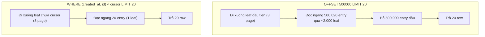
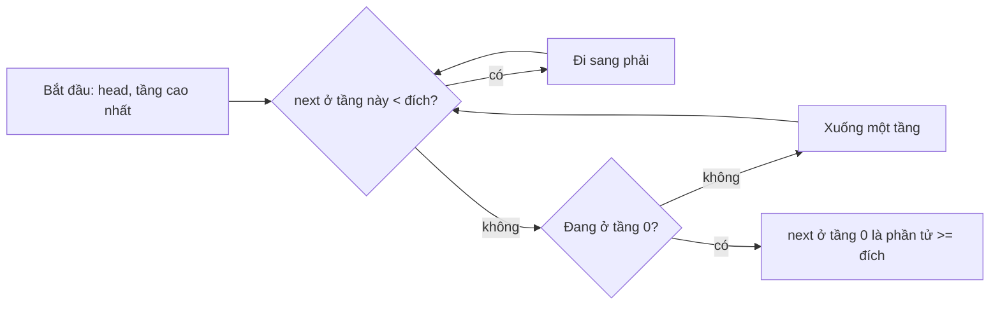

## Bối cảnh & vấn đề

Trang quản trị đơn hàng có phân trang "Trang 1, 2, 3, …, 50.000". Trang đầu mở trong 5 ms. Nhân viên chăm sóc khách hàng thường nhảy tới trang cuối để xem đơn cũ nhất, và trang đó mất vài giây. Log database đầy các câu `OFFSET 999980 LIMIT 20`. Cùng lúc, một mobile app dùng infinite scroll phàn nàn rằng đôi khi một đơn hàng xuất hiện **hai lần** trong feed, còn đơn khác thì biến mất.

Ở một team khác, bảng `events` dùng khoá chính UUIDv4. Throughput insert giảm dần theo thời gian, index to hơn dự kiến, và cache hit ratio của database giảm. Đổi sang UUIDv7 (có thành phần thời gian ở đầu), index nhỏ đi gần 25% và insert nhanh hơn, dù cả hai đều là 16 byte.

Hai câu chuyện có chung một gốc: cấu trúc **có thứ tự** nằm dưới database. B+tree là thứ giúp `WHERE id = ?` nhanh và `ORDER BY created_at` không cần sort; nó cũng là thứ khiến OFFSET sâu tốn kém và key ngẫu nhiên gây page split. Bài này giải thích vì sao database chọn B+tree (thay vì hash table hay cây nhị phân), vì sao Redis chọn skip list cho sorted set, và hệ quả thực tế: thiết kế khoá chính, và vì sao keyset pagination là O(log n + limit) còn offset là O(offset + limit). Chi tiết B-tree của riêng PostgreSQL nằm ở [bài B-tree index](/tracks/sql-postgres/learn/btree-indexes).

## Khái niệm

### Vì sao disk thay đổi mọi thứ: page và số lần I/O

Database lưu dữ liệu theo **page** (khối) cố định: 8 KB với PostgreSQL, 8 KB với SQL Server, 16 KB với MySQL InnoDB. Đọc một byte hay cả page đều tốn **một lần I/O**, và một lần I/O ngẫu nhiên (kể cả trên SSD, và nhất là khi page không nằm trong buffer cache) đắt hơn hàng nghìn phép so sánh trong CPU. Vì vậy thước đo đúng của một cấu trúc index không phải số phép so sánh mà là **số page phải đọc**.

Cây nhị phân tìm kiếm (BST) cân bằng có chiều cao khoảng log₂ n: 20 tầng cho 1 triệu phần tử, 27 tầng cho 100 triệu. Nếu mỗi node là một page, mỗi lần tìm là 20–27 lần đọc page ngẫu nhiên. Mỗi node của BST chỉ chứa một key, nên 8 KB page gần như bỏ trống; cấu trúc lãng phí đúng thứ đắt nhất.

**Interview angle:** câu trả lời mạnh bắt đầu bằng "thước đo là số page đọc", từ đó mọi lựa chọn thiết kế của B+tree trở nên hiển nhiên.

### B+tree: cây nhiều nhánh, leaf nối nhau

**B+tree** là cây cân bằng mà mỗi node là **một page** chứa **hàng trăm key**. Node trong (internal) chỉ chứa key phân tách và con trỏ xuống con; **leaf** chứa key thật cùng con trỏ tới row (hoặc chính row, với clustered index). Với **fan-out** (số con mỗi node) khoảng 300, chiều cao là log₃₀₀ n: 3 tầng cho 1 triệu row, 4 tầng cho 100 triệu. Root và các tầng trên nhỏ, luôn nằm trong buffer cache, nên một lần tìm thực tế chỉ tốn 1–2 lần đọc page thật.

Đặc điểm thứ hai: các leaf được **sắp xếp và nối với nhau** thành danh sách liên kết. Tìm leaf đầu tiên thoả điều kiện (O(log n)), rồi đi ngang qua các leaf kế tiếp để lấy m kết quả: **range scan** O(log n + m). Nhờ đó B+tree phục vụ được `BETWEEN`, `>`, `<`, `ORDER BY ... LIMIT` (đọc theo thứ tự, không cần sort), prefix của composite index, `LIKE 'abc%'` (với opclass phù hợp), `min`/`max`.

**Interview angle:** hai ý bắt buộc: fan-out lớn nên cây thấp (ít I/O), và leaf có thứ tự + nối nhau nên range scan và `ORDER BY` rẻ.

### Vì sao không dùng hash index hay BST

**Hash index** cho tra cứu bằng O(1) kỳ vọng, nhưng chỉ hỗ trợ **phép bằng**. Nó không trả lời được `created_at > $1`, `ORDER BY`, prefix, hay range, vì hash phá huỷ thứ tự. PostgreSQL có hash index (WAL-logged và crash-safe từ bản 10), nhưng lợi thế so với B-tree cho phép bằng thường nhỏ, còn B-tree làm được mọi thứ hash làm và nhiều hơn. Hash table cũng khó tăng kích thước dần trên disk (rehash toàn bộ là không thể với bảng 100 GB).

**BST** (red-black, AVL) tối ưu cho bộ nhớ trong, nơi truy cập một node là rẻ. Trên disk, chiều cao 20–27 tầng với node chỉ chứa một key là quá nhiều I/O. **LSM tree** (RocksDB, Cassandra) là một hướng khác: tối ưu cho ghi (ghi tuần tự vào memtable rồi flush thành file sort sẵn), đổi lại đọc phải kiểm tra nhiều file (dùng Bloom filter mỗi file để bỏ qua, xem [Bloom filter & HyperLogLog](/tracks/dsa/learn/probabilistic-sharding)).

**Interview angle:** so sánh bằng một bảng ngắn (hash: chỉ `=`; BST: quá cao trên disk; B+tree: thấp, có thứ tự) là cách trình bày rõ nhất.

### Page split và vì sao UUIDv4 làm chậm insert

Khi một leaf đầy và cần chèn thêm key vào giữa, B+tree **split** page: cấp một page mới, chuyển khoảng một nửa số key sang, cập nhật con trỏ ở node cha (và có thể split lan lên trên). Split tốn I/O, ghi thêm WAL, và để lại hai page chỉ đầy một nửa.

Với key **tăng dần** (bigserial, timestamp, UUIDv7), mọi insert rơi vào leaf **ngoài cùng bên phải**. PostgreSQL có tối ưu cho trường hợp này: khi split page ngoài cùng bên phải, page cũ được giữ đầy (theo fillfactor, mặc định 90% cho leaf) thay vì chia đôi. Các page vừa được ghi luôn nóng trong buffer cache, và index gần như được đóng gói chặt. Với key **ngẫu nhiên** (UUIDv4), mỗi insert rơi vào một leaf bất kỳ trong toàn bộ index: page đó phải được đọc từ disk nếu không có trong cache, và split xảy ra rải rác khắp nơi để lại page đầy trung bình khoảng 69–70% (giá trị lý thuyết ln 2 cho chèn ngẫu nhiên). Index to hơn, working set lớn hơn buffer cache, và mỗi insert có thể là một lần đọc disk ngẫu nhiên.

Ở database dùng **clustered index** (SQL Server, MySQL InnoDB), hậu quả còn nặng hơn vì leaf của khoá chính chứa **cả row**: key ngẫu nhiên nghĩa là chính table bị phân mảnh. SQL Server có `NEWSEQUENTIALID()` và các chỉ số fragmentation để theo dõi. **UUIDv7** (RFC 9562) đặt 48 bit timestamp mili giây ở đầu, rồi mới tới phần ngẫu nhiên: vẫn unique toàn cục, sinh được ở client, nhưng gần như tăng dần nên có hành vi insert giống bigserial. PostgreSQL 18 có hàm `uuidv7()` built-in (verify theo phiên bản bạn chạy).

**Interview angle:** follow-up "vì sao UUIDv4 làm clustered index của SQL Server tệ hơn UUIDv7" chờ ý "chèn ngẫu nhiên vào giữa leaf → page split + phân mảnh + working set lớn, và leaf clustered chứa cả row".

### Skip list: cấu trúc có thứ tự xác suất trong bộ nhớ

**Skip list** là một linked list sắp xếp có thêm nhiều tầng "làn nhanh". Tầng dưới cùng chứa mọi phần tử. Mỗi phần tử được thăng lên tầng trên với xác suất p (Redis dùng p = 1/4), nên tầng 1 có khoảng n/4 phần tử, tầng 2 có n/16, v.v. Tìm kiếm bắt đầu ở tầng cao nhất: đi sang phải chừng nào phần tử kế tiếp còn nhỏ hơn đích, rồi xuống một tầng. Số bước kỳ vọng là O(log n), và range scan là đi dọc tầng dưới cùng.

Redis sorted set dùng skip list (sắp theo score, cộng thông tin "span" để tính rank O(log n)) kết hợp **hash table** member → score để tra score O(1); set nhỏ dùng encoding listpack gọn (xem [sliding window & rate limiter](/tracks/dsa/learn/sliding-window-rate-limiting)). Vì sao skip list thay vì cây cân bằng? Cài đặt đơn giản hơn nhiều (không có xoay cây), insert/delete chỉ sửa con trỏ cục bộ, range scan tự nhiên, và dễ bổ sung rank. Trong bộ nhớ, nơi con trỏ rẻ, nhược điểm "nhiều con trỏ hơn" không đáng kể; trên disk thì B+tree vẫn thắng.

**Interview angle:** "vì sao nhiều team chọn skip list thay vì cây cân bằng" chờ: đơn giản, không cần rebalance, range và rank dễ, hiệu năng kỳ vọng tương đương.

### Offset pagination: O(offset + limit)

**Offset pagination** là `ORDER BY created_at DESC, id DESC OFFSET 100000 LIMIT 20`. Database không có cách nào "nhảy" tới row thứ 100.000 trong B+tree, vì node không lưu số phần tử trong cây con (B+tree của PostgreSQL không có "order statistics"). Nó phải đọc và **bỏ đi** 100.000 row đầu, rồi trả 20 row tiếp theo. Chi phí mỗi trang là O(offset + limit), và trang càng sâu càng chậm tuyến tính. Với dữ liệu phân tán (nhiều shard), mỗi shard còn phải trả offset + limit row để node điều phối merge (xem [K-way merge](/tracks/dsa/learn/heaps-top-k)).

Offset còn sai về **tính đúng**. Giữa hai lần gọi, nếu có row mới được chèn vào đầu (feed mới nhất trước), mọi row dịch xuống một vị trí, và row cuối của trang 1 xuất hiện lại ở đầu trang 2 (trùng). Nếu có row bị xoá, một row bị bỏ qua (mất). Offset định vị theo **vị trí**, mà vị trí thay đổi khi dữ liệu thay đổi.

**Interview angle:** nêu cả hai vấn đề: hiệu năng O(offset) và tính đúng (trùng/mất khi dữ liệu đổi), kèm cơ chế (đọc rồi bỏ; định vị theo vị trí).

### Keyset (cursor) pagination: O(log n + limit)

**Keyset pagination** định vị theo **giá trị**: "cho tôi 20 row đứng sau row cuối cùng tôi đã thấy". Với sort `(created_at DESC, id DESC)`, trang tiếp theo là `WHERE (created_at, id) < ($lastCreatedAt, $lastId) ORDER BY created_at DESC, id DESC LIMIT 20`. Với index `(created_at DESC, id DESC)`, database tìm vị trí bắt đầu bằng một lần đi xuống B+tree (O(log n)) rồi đọc ngang 20 entry: O(log n + limit), **bất kể trang sâu tới đâu**.

Ba điều kiện để đúng. **Sort key phải có tie-breaker unique** (thường là id): nếu chỉ sort theo `created_at` và nhiều row cùng timestamp, "sau timestamp X" sẽ bỏ sót các row còn lại cùng X. **Index khớp đúng thứ tự sort** (cả chiều DESC/ASC). **Row value comparison** `(a, b) < (x, y)`: PostgreSQL hỗ trợ và dùng được index; SQL Server không hỗ trợ cú pháp này, phải viết `a < x OR (a = x AND b < y)` (và kiểm tra plan có seek không).

Cursor gửi cho client nên **opaque** (encode base64 JSON các giá trị sort), không để client tự ghép, và nên được ký (HMAC) hoặc kiểm tra lại quyền: một cursor chứa `tenant_id` không bao giờ được tin mà không đối chiếu với tenant của người gọi. Nhược điểm của keyset: không nhảy tới "trang 57" tuỳ ý, và không biết tổng số trang nếu không đếm riêng.

**Interview angle:** interviewer chấm tie-breaker unique, index khớp sort, cursor opaque gắn tenant, và cách viết thay thế cho SQL Server.

## Cơ chế hoạt động

So sánh đường đi trong B+tree của hai loại pagination:



Cả hai bắt đầu bằng việc đi từ root xuống leaf (3 tầng với 1 triệu row). Offset bắt đầu từ leaf **đầu tiên** của thứ tự sort và phải đếm qua 500.000 entry (cộng với việc đọc heap để lấy các cột không có trong index), rồi vứt chúng đi. Keyset dùng giá trị cursor làm khoá tìm kiếm, nên nó đáp thẳng xuống đúng leaf chứa vị trí bắt đầu và chỉ đọc 20 entry. Khác biệt không phải hằng số: offset tăng tuyến tính theo độ sâu trang, keyset gần như không đổi.

Tìm kiếm trong skip list:



Ở tầng cao, mỗi bước sang phải nhảy qua trung bình 4 phần tử của tầng dưới (với p = 1/4); khi không thể đi tiếp mà không vượt đích, ta xuống tầng và lặp lại. Tổng số bước kỳ vọng tỉ lệ với log n. Vị trí dừng ở tầng 0 cũng là điểm bắt đầu của một range scan: đi tiếp dọc tầng 0 để lấy m phần tử kế tiếp, giống hệt leaf nối nhau của B+tree.

## Ví dụ thực tế

### Chiều cao cây: BST so với B+tree

```bash
awk 'BEGIN{ for (n=1e6; n<=1e8; n*=100) printf "n=%d BST height~%d, B+tree(fanout 300) height~%d\n", n, log(n)/log(2)+1, int(log(n)/log(300))+1 }'
```

```text
n=1000000 BST height~20, B+tree(fanout 300) height~3
n=100000000 BST height~27, B+tree(fanout 300) height~4
```

Kiểm chứng trên PostgreSQL 17 với bảng 1 triệu đơn hàng và index `(created_at DESC, id DESC)`:

```sql
SELECT pg_relation_size('orders_created_id') / 8192 AS index_pages;
SELECT level AS root_level FROM bt_metap('orders_created_id');  -- extension pageinspect
```

```text
 index_pages
-------------
        3848

 root_level
------------
          2
```

Index 1 triệu entry chỉ chiếm 3.848 page (khoảng 30 MB), và root ở level 2 nghĩa là cây có 3 tầng (level 0 là leaf). Mọi lần tìm kiếm đọc đúng 3 page index.

### Offset so với keyset trên PostgreSQL

Cùng một trang (20 đơn sau vị trí 500.000), viết hai cách:

```sql
EXPLAIN (ANALYZE, BUFFERS, COSTS OFF, TIMING OFF)
SELECT id, created_at, total FROM orders
ORDER BY created_at DESC, id DESC OFFSET 500000 LIMIT 20;

EXPLAIN (ANALYZE, BUFFERS, COSTS OFF, TIMING OFF)
SELECT id, created_at, total FROM orders
WHERE (created_at, id) < ('2026-02-27 20:53:30+00', 500001)   -- last row of the previous page
ORDER BY created_at DESC, id DESC LIMIT 20;
```

Output thật:

```text
 Limit (actual rows=20 loops=1)
   Buffers: shared hit=5104
   ->  Index Scan using orders_created_id on orders (actual rows=500020 loops=1)
         Buffers: shared hit=5104
 Execution Time: 97.486 ms

 Limit (actual rows=20 loops=1)
   Buffers: shared hit=4
   ->  Index Scan using orders_created_id on orders (actual rows=20 loops=1)
         Index Cond: (ROW(created_at, id) < ROW('2026-02-27 20:53:30+00'::timestamp with time zone, 500001))
         Buffers: shared hit=4
 Execution Time: 0.056 ms
```

Một câu kiểm tra xác nhận hai query trả về đúng cùng 20 id (`same_page = t`). Offset đọc 500.020 row qua 5.104 page để trả 20; keyset đọc 20 row qua 4 page (3 page index từ root xuống leaf, cộng page heap). Chênh lệch khoảng 1.700 lần về thời gian, và đây là khi mọi thứ đã nằm trong cache (`shared hit`); nếu các page phải đọc từ disk, offset còn tệ hơn nhiều. Dòng `Index Cond` cho thấy row comparison được đẩy vào index như một điều kiện tìm kiếm, không phải filter sau khi đọc.

### Offset trùng dữ liệu khi có insert, keyset thì không

```ts
let feed = [10, 9, 8, 7, 6, 5, 4, 3, 2, 1];          // ids, newest first
const pageOffset = (page: number) => feed.slice(page * 3, page * 3 + 3);
const p1 = pageOffset(0);
feed = [11, ...feed];                                   // a new item arrives before the user clicks "next"
const p2 = pageOffset(1);
console.log("offset:", p1, p2, "duplicate:", p2.filter((x) => p1.includes(x)));

feed = [10, 9, 8, 7, 6, 5, 4, 3, 2, 1];
const pageAfter = (cursor: number | null) => feed.filter((id) => cursor === null || id < cursor).slice(0, 3);
const k1 = pageAfter(null);
feed = [11, ...feed];
const k2 = pageAfter(k1.at(-1)!);
console.log("keyset:", k1, k2, "duplicate:", k2.filter((x) => k1.includes(x)));

const encode = (c: object) => Buffer.from(JSON.stringify(c)).toString("base64url");
const decode = (s: string) => JSON.parse(Buffer.from(s, "base64url").toString());
const cur = encode({ t: "2026-02-27T20:53:30Z", id: 500001, tenant: 42 });
console.log(cur, decode(cur));
```

Output:

```text
offset: [ 10, 9, 8 ] [ 8, 7, 6 ] duplicate: [ 8 ]
keyset: [ 10, 9, 8 ] [ 7, 6, 5 ] duplicate: []
eyJ0IjoiMjAyNi0wMi0yN1QyMDo1MzozMFoiLCJpZCI6NTAwMDAxLCJ0ZW5hbnQiOjQyfQ { t: '2026-02-27T20:53:30Z', id: 500001, tenant: 42 }
```

Item 11 đến giữa hai lần tải, đẩy mọi thứ xuống một vị trí; trang 2 theo offset lặp lại item 8. Keyset hỏi "id nhỏ hơn 8", nên không bị ảnh hưởng bởi item mới. Cursor được encode base64url để client coi nó là chuỗi mờ; server phải kiểm tra `tenant` trong cursor khớp với tenant của người gọi (hoặc không đưa tenant vào cursor mà lấy từ auth), và nên ký HMAC nếu không muốn client sửa được.

Khi product owner đòi "nhảy tới trang 57": các lựa chọn gồm giới hạn độ sâu (Google cũng chỉ cho xem vài chục trang), thay "nhảy trang" bằng bộ lọc (theo ngày, trạng thái) để thu hẹp tập kết quả, tính trước một bảng "mốc trang" (giá trị sort key mỗi 1.000 row, cập nhật định kỳ) để nhảy gần đúng bằng keyset, hoặc **deferred join** (offset trên index-only scan chỉ lấy id, rồi join lấy các cột còn lại) để giảm chi phí offset mà không loại bỏ nó.

### UUIDv4 so với UUIDv7 trên PostgreSQL

```sql
CREATE TABLE t_v4 (id uuid PRIMARY KEY);
CREATE TABLE t_v7 (id uuid PRIMARY KEY);
INSERT INTO t_v4 SELECT gen_random_uuid() FROM generate_series(1, 1000000);
-- UUIDv7-like: 48-bit increasing millisecond prefix + random tail (PostgreSQL 18 has uuidv7() built in)
INSERT INTO t_v7 SELECT (lpad(to_hex(1760000000000 + g), 12, '0') || substr(md5(g::text), 1, 20))::uuid
FROM generate_series(1, 1000000) g;
SELECT 'v4' AS kind, pg_size_pretty(pg_relation_size('t_v4_pkey')) AS index_size,
       round(avg_leaf_density::numeric, 1) AS leaf_density_pct, leaf_pages FROM pgstatindex('t_v4_pkey')
UNION ALL
SELECT 'v7', pg_size_pretty(pg_relation_size('t_v7_pkey')), round(avg_leaf_density::numeric, 1), leaf_pages
FROM pgstatindex('t_v7_pkey');
```

Output thật (thời gian insert trên máy thử: 3,5 s cho v4, 2,9 s cho v7):

```text
 kind | index_size | leaf_density_pct | leaf_pages
------+------------+------------------+------------
 v4   | 39 MB      |             70.4 |       4904
 v7   | 30 MB      |             90.0 |       3832
```

Đúng như lý thuyết: chèn ngẫu nhiên để lại leaf đầy trung bình 70,4% (gần ln 2 ≈ 69,3%), còn chèn tăng dần giữ leaf ở đúng fillfactor 90%. Index v4 to hơn 30% cho cùng dữ liệu. Ở 1 triệu row mọi thứ vẫn nằm trong RAM nên chênh lệch thời gian còn nhỏ; khi index lớn hơn buffer cache, mỗi insert UUIDv4 có thể cần đọc một leaf ngẫu nhiên từ disk, còn UUIDv7 luôn ghi vào vài page ngoài cùng bên phải đang nóng. Đánh đổi của UUIDv7: timestamp trong id lộ thời điểm tạo record, và mọi insert đồng thời tranh nhau cùng một leaf ngoài cùng bên phải (thường không phải vấn đề ở mức vài nghìn insert/giây).

### Skip list: đo số bước tìm kiếm

```ts
const MAX_LEVEL = 32, P = 0.25;           // Redis uses p = 1/4 and up to 32 levels (verify)
type SNode = { score: number; next: (SNode | null)[] };
class SkipList {
  head: SNode = { score: -Infinity, next: new Array(MAX_LEVEL).fill(null) };
  level = 1;
  private randomLevel() { let l = 1; while (rand() < P && l < MAX_LEVEL) l++; return l; }
  insert(score: number) {
    const update: SNode[] = new Array(MAX_LEVEL);
    let x = this.head;
    for (let i = this.level - 1; i >= 0; i--) {
      while (x.next[i] && x.next[i]!.score < score) x = x.next[i]!;
      update[i] = x;                                  // last node before `score` on level i
    }
    const lvl = this.randomLevel();
    if (lvl > this.level) { for (let i = this.level; i < lvl; i++) update[i] = this.head; this.level = lvl; }
    const node: SNode = { score, next: new Array(lvl).fill(null) };
    for (let i = 0; i < lvl; i++) { node.next[i] = update[i].next[i]; update[i].next[i] = node; }
  }
  search(score: number): { found: boolean; hops: number } {
    let x = this.head, hops = 0;
    for (let i = this.level - 1; i >= 0; i--)
      while (x.next[i] && x.next[i]!.score < score) { x = x.next[i]!; hops++; } // right, then down
    return { found: x.next[0]?.score === score, hops };
  }
}
for (const n of [1_000, 1_000_000]) {
  const sl = new SkipList();
  for (let i = 0; i < n; i++) sl.insert(Math.floor(rand() * 1e12));   // rand: seeded PRNG
  const probe = Array.from({ length: 1_000 }, () => Math.floor(rand() * 1e12));
  const avg = probe.reduce((s, k) => s + sl.search(k).hops, 0) / probe.length;
  console.log(`n=${n}: levels=${sl.level}, avg hops per search=${avg.toFixed(1)} (a linked list needs ~${n / 2})`);
}
```

```text
n=1000: levels=6, avg hops per search=10.8 (a linked list needs ~500)
n=1000000: levels=10, avg hops per search=29.6 (a linked list needs ~500000)
```

Tăng n lên 1.000 lần, số bước chỉ tăng gần 3 lần: đúng dáng O(log n). Insert chỉ sửa con trỏ của các node đứng trước vị trí chèn ở mỗi tầng; không có xoay cây, không có rebalance lan rộng. Đó là lý do skip list dễ cài đúng hơn red-black tree, và vì sao Redis dùng nó cho `ZADD`, `ZRANGE ... BYSCORE`, `ZRANK`.

## Trade-offs & lựa chọn thay thế

| Cấu trúc | Tra theo key | Range / ORDER BY | Ghi | Nơi dùng |
| --- | --- | --- | --- | --- |
| Hash index | O(1) kỳ vọng, chỉ `=` | Không | Rẻ | Postgres hash index (hiếm), hash table trong memory |
| BST cân bằng | O(log₂ n) node | Có | Rebalance | Cấu trúc in-memory (TreeMap) |
| B+tree | O(log_fanout n) page | Có, leaf nối nhau | Page split | Index của hầu hết RDBMS |
| LSM tree | Nhiều file + Bloom | Có (merge) | Rất rẻ (tuần tự) | RocksDB, Cassandra, ghi nặng |
| Skip list | O(log n) kỳ vọng | Có | Sửa con trỏ cục bộ | Redis sorted set, in-memory |

| Pagination | Chi phí mỗi trang | Nhảy trang tuỳ ý | Đúng khi dữ liệu đổi | Yêu cầu |
| --- | --- | --- | --- | --- |
| Offset | O(offset + limit) | Có | Không (trùng/mất) | Chỉ `ORDER BY` |
| Keyset / cursor | O(log n + limit) | Không | Có | Sort key + tie-breaker unique, index khớp |
| `search_after` (Elasticsearch) | Như keyset, mỗi shard | Không | Có (kèm PIT) | Sort có tie-breaker |
| Deferred join | Offset trên index-only scan | Có | Không | Index covering cột sort |

Khi nào chọn cái nào. Offset chấp nhận được khi tập kết quả nhỏ và giới hạn độ sâu (trang quản trị lọc theo ngày, tối đa vài chục trang), hoặc khi "nhảy tới trang N" là yêu cầu thật của nghiệp vụ. Mọi feed, infinite scroll, API công khai và export nên dùng keyset. Với khoá chính, bigint tự tăng là rẻ nhất cho B+tree; khi cần id sinh phía client hoặc unique toàn cục giữa nhiều hệ thống, UUIDv7 giữ được phần lớn lợi ích của key tăng dần; UUIDv4 chỉ nên dùng khi tính không đoán được là yêu cầu (và khi đó, cân nhắc giữ bigint làm khoá chính nội bộ, UUIDv4 làm id công khai có unique index riêng).

## Edge cases & failure modes

- **Keyset không có tie-breaker**: nhiều row cùng `created_at` (batch import cùng giây); trang sau bỏ sót các row còn lại cùng timestamp. Luôn thêm id vào sort key và cursor.
- **Index không khớp chiều sort**: sort `created_at DESC, id ASC` với index `(created_at DESC, id DESC)` không dùng được index cho keyset. Index phải khớp đúng chiều, hoặc đảo ngược hoàn toàn.
- **Sort theo cột nullable**: `NULL` đứng đầu hoặc cuối tuỳ `NULLS FIRST/LAST`, và `(a, b) < (x, y)` với NULL cho kết quả NULL (row bị loại). Tránh sort key nullable, hoặc dùng `COALESCE` nhất quán cả index lẫn query.
- **Cursor giả mạo**: client sửa cursor để đọc dữ liệu tenant khác nếu server tin tenant trong cursor. Ký cursor hoặc lấy tenant từ auth.
- **Row comparison trên SQL Server**: cú pháp `(a, b) < (x, y)` không có; viết `OR` và kiểm tra execution plan có seek, không phải scan.
- **COUNT(*) cho tổng số trang**: đếm chính xác trên bảng lớn tốn một lần quét. Dùng ước lượng (`reltuples`, `EXPLAIN`), hoặc không hiển thị tổng.
- **Hot right-most page**: key tăng dần tập trung mọi insert vào một leaf; ở throughput rất cao (hàng chục nghìn insert/giây trên SQL Server) gây tranh chấp latch. Hash partition hoặc key có prefix phân tán là cách giảm (verify ngưỡng theo hệ quản trị).
- **Deep pagination qua API**: crawler gọi `?page=100000`. Giới hạn trang tối đa với offset, hoặc chỉ cho phép cursor.
- **Timestamp trong UUIDv7 bị lộ**: id công khai tiết lộ thời điểm tạo (ví dụ ngày đăng ký của user). Nếu đó là thông tin nhạy cảm, dùng id công khai khác.

## Pitfalls

- ❌ "B+tree nhanh vì O(log n)" → ✅ "fan-out hàng trăm nên chỉ 3–4 tầng page; leaf có thứ tự và nối nhau nên range/ORDER BY rẻ".
- ❌ Hash index để phục vụ `ORDER BY` hoặc range → ✅ B-tree; hash chỉ hỗ trợ phép bằng.
- ❌ UUIDv4 làm khoá chính clustered cho bảng ghi nhiều → ✅ bigint tự tăng hoặc UUIDv7, vì key ngẫu nhiên gây page split và phân mảnh.
- ❌ `OFFSET 100000` cho infinite scroll → ✅ keyset `WHERE (created_at, id) < (...)` với index khớp.
- ❌ Keyset chỉ theo `created_at` → ✅ `(created_at, id)`, tie-breaker unique.
- ❌ Cursor là `?after_id=123&tenant=42` do client tự ghép → ✅ cursor opaque, ký, tenant lấy từ auth.
- ❌ `COUNT(*)` chính xác mỗi lần tải trang → ✅ ước lượng hoặc bỏ tổng số trang.
- ❌ Nghĩ skip list chậm hơn cây vì "xác suất" → ✅ O(log n) kỳ vọng với hằng số tốt, đơn giản hơn cây cân bằng, và range/rank tự nhiên.

## Tóm tắt

- Trên disk, thước đo là **số page đọc**; B+tree có fan-out hàng trăm nên chỉ 3–4 tầng cho hàng trăm triệu row, và leaf sắp xếp + nối nhau cho range scan O(log n + m).
- Hash index chỉ hỗ trợ `=`, BST quá cao trên disk; LSM tree tối ưu ghi, dùng Bloom filter để đọc.
- Key tăng dần (bigint, UUIDv7) chèn vào leaf ngoài cùng bên phải, leaf đầy ~90%; key ngẫu nhiên (UUIDv4) split khắp nơi, leaf đầy ~70%, index to hơn, working set lớn hơn.
- Redis sorted set = skip list (thứ tự, rank, range O(log n + m)) + hash table; skip list chọn vì đơn giản, không rebalance.
- Offset: O(offset + limit) và trùng/mất item khi dữ liệu đổi. Keyset: O(log n + limit) mọi trang, cần tie-breaker unique, index khớp chiều sort, cursor opaque gắn tenant.
- Đo bằng `EXPLAIN (ANALYZE, BUFFERS)`: offset trang 500.000 đọc 5.104 page, keyset đọc 4 page.
