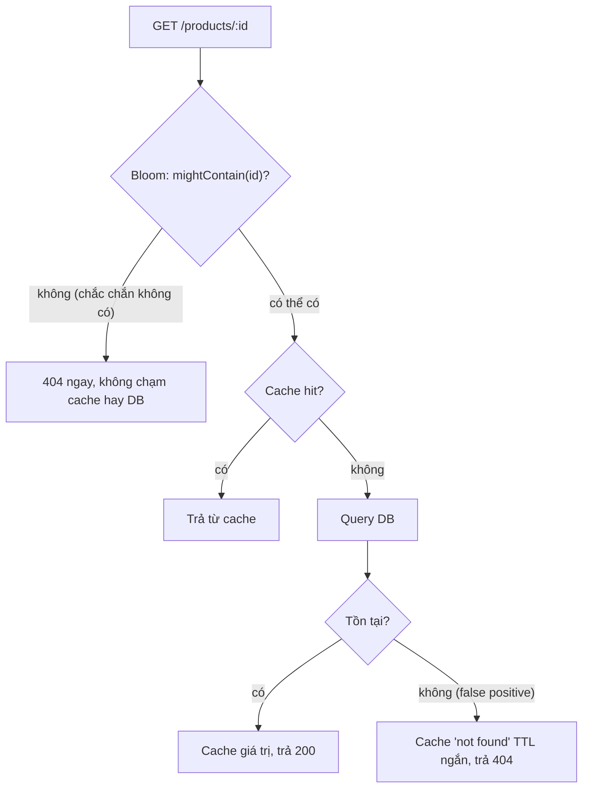
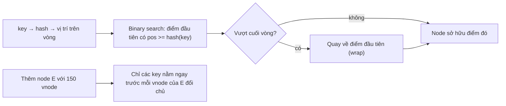

## Bối cảnh & vấn đề

Ba vấn đề ở ba quy mô khác nhau, cùng một hướng giải:

- Một attacker gọi `GET /products/{id}` với hàng triệu id ngẫu nhiên không tồn tại. Cache không có (vì sản phẩm không tồn tại), nên mọi request rơi thẳng xuống database: **cache penetration**. Lưu toàn bộ 50 triệu id hợp lệ trong một `Set` để chặn trước thì tốn vài GB RAM mỗi pod.
- Dashboard "unique visitors theo ngày" chạy `COUNT(DISTINCT user_id)` trên bảng 3 tỷ event và timeout. Product muốn thêm "unique visitors theo tuần", và một kỹ sư đề xuất cộng 7 số của từng ngày.
- Cụm cache 4 node dùng `hash(key) % 4` để chọn node. Thêm node thứ 5 để chịu tải Black Friday, và hit rate rơi từ 95% xuống gần 20% trong vài phút, database quá tải đúng lúc cần nó nhất.

Hướng giải chung: chấp nhận một sai số **được kiểm soát** (hoặc một phần nhỏ dữ liệu phải di chuyển) để đổi lấy memory hoặc khả năng mở rộng tốt hơn nhiều bậc. **Bloom filter** trả lời "có thể có / chắc chắn không" với vài bit mỗi phần tử. **HyperLogLog** đếm số phần tử khác nhau với khoảng 12 KB bất kể là một nghìn hay một tỷ. **Consistent hashing** chia key cho các node sao cho thêm hoặc bớt node chỉ phải chuyển khoảng 1/N key. Bài này giải thích cơ chế của từng cấu trúc, cách tính kích thước, chỗ chúng **không** được dùng, và áp dụng tất cả vào bài toán dedupe webhook 5.000 event/giây.

## Khái niệm

### Cấu trúc xác suất: đổi độ chính xác lấy memory

**Cấu trúc dữ liệu xác suất** (probabilistic data structure) trả lời câu hỏi với một sai số có giới hạn toán học, đổi lại memory nhỏ hơn cấu trúc chính xác nhiều bậc, thường cố định và không phụ thuộc số phần tử. Chúng hợp với câu hỏi mà đáp án xấp xỉ vẫn hữu ích (analytics, lọc sơ bộ, ước lượng) và không hợp với câu hỏi mà một lần sai là sự cố (thanh toán, quyền truy cập, billing).

Điều quan trọng là biết sai số đi **theo chiều nào**. Bloom filter chỉ sai theo một chiều: có thể nói "có" khi thực ra không có (false positive), nhưng không bao giờ nói "không" khi thực ra có (false negative). HyperLogLog sai hai chiều quanh giá trị thật với độ lệch chuẩn đã biết. Count-Min Sketch (xem [Heap & top-K](/tracks/dsa/learn/heaps-top-k)) chỉ đếm dư. Thiết kế đúng là đặt cấu trúc sao cho chiều sai đó vô hại.

**Interview angle:** câu mở đầu tốt nhất cho mọi câu hỏi về Bloom/HLL là "sai số theo chiều nào, và trong use case này chiều đó có an toàn không".

### Bloom filter: k hash function trên một mảng bit

**Bloom filter** là một mảng m bit (ban đầu toàn 0) và k hash function. `add(x)`: tính k vị trí `h₁(x) … hₖ(x)` và bật cả k bit. `mightContain(x)`: kiểm tra k bit đó; nếu có **bất kỳ** bit nào là 0, x **chắc chắn** chưa từng được thêm (vì nếu đã thêm, bit đó phải là 1). Nếu cả k bit là 1, x **có thể** đã được thêm, hoặc các bit đó bị bật bởi những phần tử khác: false positive.

Tỉ lệ false positive phụ thuộc vào m (số bit), n (số phần tử đã thêm) và k. Công thức kích thước tối ưu: m = −n · ln(p) / (ln 2)², k = (m / n) · ln 2. Với p = 1%, cần khoảng 9,6 bit mỗi phần tử và k = 7; 10 triệu phần tử cần khoảng 96 triệu bit, tức **12 MB** (11,4 MiB), trong khi một `Set` 10 triệu chuỗi trong V8 tốn hàng trăm MB. Mỗi lần giảm p đi 10 lần tốn thêm khoảng 4,8 bit mỗi phần tử.

Bloom filter cơ bản **không xoá được**: tắt một bit có thể làm mất phần tử khác dùng chung bit đó, tạo ra false negative. **Counting Bloom filter** thay mỗi bit bằng một bộ đếm nhỏ để hỗ trợ xoá (tốn gấp 3–4 lần memory); **Cuckoo filter** hỗ trợ xoá với memory tương đương và thường tốt hơn khi p nhỏ. Bloom filter cũng không mở rộng được khi đầy: thêm vượt capacity làm p tăng vọt. Redis Bloom (`BF.RESERVE` với `EXPANSION`) giải quyết bằng cách xếp chồng các filter con (scalable Bloom filter).

**Interview angle:** follow-up "tính kích thước cho 10 triệu item ở 1%" chờ con số bậc độ lớn (khoảng 10 bit mỗi item, khoảng 12 MB, k ≈ 7), không cần nhớ công thức chính xác.

### Bloom filter trong backend: cache penetration và LSM tree

**Cache penetration** là khi request cho key **không tồn tại** xuyên qua cache (không có gì để cache) và đập vào database. Đặt một Bloom filter chứa mọi id hợp lệ trước cache: nếu filter nói "chắc chắn không có", trả 404 ngay, không chạm cache hay database. Với p = 1%, chỉ 1% request id rác lọt xuống, và chúng bị chặn tiếp bằng cách cache kết quả "không tồn tại" với TTL ngắn. Cái giá: filter phải được cập nhật khi thêm sản phẩm (xoá thì không cần: id đã xoá chỉ là thêm một false positive), và được dựng lại định kỳ.

Trong storage engine, **LSM tree** (RocksDB, Cassandra, LevelDB) lưu dữ liệu trong nhiều file sort sẵn (SSTable). Đọc một key có thể phải kiểm tra nhiều file; mỗi file có một Bloom filter, và file nào filter nói "không có" thì bỏ qua mà không đọc disk. Đây là use case gốc của Bloom filter: tránh I/O đắt cho những câu trả lời "không".

**Interview angle:** interviewer muốn nghe Bloom filter đặt **trước** cache/DB để chặn key không tồn tại, và vì sao false positive ở đây vô hại (chỉ là một lần tra cứu thừa).

### HyperLogLog: đếm distinct bằng số số 0 đứng đầu

**HyperLogLog** (HLL) ước lượng **cardinality** (số phần tử khác nhau) của một tập. Trực giác: hash mỗi phần tử thành một chuỗi bit ngẫu nhiên đều. Xác suất một hash bắt đầu bằng ít nhất r số 0 là 1/2ʳ. Nếu trong các hash đã thấy, dài nhất là 20 số 0 đứng đầu, thì nhiều khả năng đã có khoảng 2²⁰ ≈ 1 triệu phần tử khác nhau. Phần tử trùng cho cùng hash, nên không làm thay đổi gì: đó là lý do HLL đếm **distinct**.

Một phép đo đơn lẻ như vậy rất nhiễu, nên HLL chia hash thành m **register** (dùng vài bit đầu để chọn register, phần còn lại để đếm số 0), mỗi register giữ số 0 đứng đầu lớn nhất đã thấy, rồi kết hợp bằng trung bình điều hoà có hiệu chỉnh. Độ lệch chuẩn là khoảng 1,04 / √m. Redis dùng m = 16.384 register × 6 bit ≈ **12 KB** mỗi key, cho sai số chuẩn **0,81%**, và dùng biểu diễn sparse (nhỏ hơn nhiều) khi tập còn ít phần tử. `PFADD` thêm, `PFCOUNT` ước lượng.

Tính chất quý nhất: HLL **merge được**. Hợp của hai tập có sketch bằng max từng register của hai sketch (`PFMERGE`). Vì vậy unique theo tuần là **hợp** 7 sketch ngày, không phải tổng 7 con số: một người dùng truy cập cả 7 ngày bị đếm 7 lần nếu cộng số, nhưng chỉ 1 lần nếu merge sketch. Giao (intersection) thì không chính xác được bằng HLL (chỉ ước lượng qua inclusion-exclusion, sai số lớn).

**Interview angle:** câu hỏi "vì sao không cộng unique theo ngày thành unique theo tuần" là câu kiểm tra hiểu biết thật; trả lời bằng ví dụ người dùng quay lại nhiều ngày, rồi `PFMERGE`.

### Pre-aggregation và câu hỏi nghiệp vụ

Trước khi đưa HLL vào, hãy hỏi hai câu. Một: **có cần chính xác tuyệt đối không**? Unique visitors cho dashboard marketing chấp nhận sai 1%; số người dùng tính tiền theo seat thì không. Hai: **có cần tính lại từ dữ liệu thô mỗi lần xem không**? `COUNT(DISTINCT)` trên 3 tỷ row mỗi lần mở dashboard là O(n) memory và CPU cho một con số chỉ thay đổi một lần mỗi ngày.

**Pre-aggregation** giải quyết câu hai: tính một lần, lưu kết quả. Bảng rollup `daily_uniques(day, count)` cập nhật incremental bởi một job, hoặc materialized view refresh định kỳ. Nhưng rollup số đếm lại vướng đúng vấn đề merge: có `count` theo ngày không suy ra được `count` theo tuần. Kết hợp cả hai: lưu **sketch HLL** theo ngày (trong Redis, trong Postgres với extension `hll`, hoặc trong warehouse với `HLL_COUNT.INIT`/`MERGE` của BigQuery, `APPROX_COUNT_DISTINCT` của nhiều engine), rồi merge theo bất kỳ khoảng nào. Nếu cần chính xác, rollup theo ngày một bảng `(day, user_id)` distinct và đếm hợp trên bảng nhỏ hơn đó.

**Interview angle:** câu trả lời senior bắt đầu bằng câu hỏi ngược lại business ("chính xác hay xu hướng?"), rồi mới chọn giữa rollup chính xác và sketch xấp xỉ.

### Consistent hashing: chỉ di chuyển khoảng 1/N key

Chia key cho N node bằng `hash(key) % N` đơn giản và đều, nhưng khi N đổi thành N + 1, **gần như mọi key** đổi node: một key chỉ giữ nguyên node nếu `hash % N == hash % (N+1)`, xác suất khoảng 1/(N+1). Với cache, đó là cache miss hàng loạt; với storage, đó là di chuyển gần hết dữ liệu.

**Consistent hashing** đặt cả node và key lên một **vòng** giá trị hash (ví dụ 0 tới 2³² − 1). Mỗi key thuộc về node **đầu tiên theo chiều kim đồng hồ** từ vị trí của nó. Thêm một node chỉ "cướp" các key nằm giữa nó và node đứng trước nó trên vòng; mọi key khác giữ nguyên. Trung bình chỉ khoảng 1/(N+1) key phải di chuyển, đúng lượng tối thiểu để cân bằng lại. Tìm node cho một key là binary search trên danh sách vị trí đã sort (xem [bài binary search](/tracks/dsa/learn/sorting-search-dp)).

Với một điểm mỗi node, khoảng cách giữa các điểm rất lệch (có node nhận 30% key, có node nhận 10%), và khi một node rời đi, **toàn bộ** tải của nó đổ sang đúng một node kế tiếp. **Virtual node** giải quyết cả hai: mỗi node vật lý đặt 100–200 điểm trên vòng, nên tải được trung bình hoá, và khi node rời đi, các cung của nó chia cho nhiều node khác. Virtual node cũng cho phép node mạnh hơn nhận nhiều điểm hơn (trọng số).

**Interview angle:** trả lời đủ gồm vấn đề của `% N` (gần như mọi key đổi node), cơ chế vòng (~1/N key di chuyển), và virtual node (cân bằng tải, chia tải khi node rời).

### Hash slot của Redis Cluster và hot key

Redis Cluster dùng một biến thể: **16.384 hash slot** cố định, slot = CRC16(key) mod 16384, và mỗi node sở hữu một tập slot. Thêm node nghĩa là **di chuyển một số slot** (cùng các key trong đó) sang node mới; key không bao giờ đổi slot. Nếu key chứa `{...}` không rỗng, chỉ phần trong ngoặc được hash: `rl:{user42}:minute` và `rl:{user42}:hour` cùng slot, nên có thể dùng chung trong một Lua script hay `MULTI`. Cassandra dùng vòng token với vnodes; DynamoDB và nhiều hệ thống khác phân vùng theo hash của partition key, ý tưởng gốc từ bài báo Dynamo.

Consistent hashing phân tán **key**, không phân tán **tải của một key**. Một **hot key** (sản phẩm flash sale, tài khoản người nổi tiếng) vẫn rơi vào đúng một node dù có bao nhiêu node. Biện pháp: cache L1 in-process cho key hot (xem [LRU & cache hai tầng](/tracks/dsa/learn/lru-lfu-caching)), nhân bản key thành `key#1 … key#8` và đọc ngẫu nhiên một bản (ghi thì phải cập nhật cả 8), hoặc tách key lớn thành nhiều key nhỏ.

**Interview angle:** follow-up "hot key thì sao" là để kiểm tra bạn biết giới hạn của consistent hashing; nói "nó chia key chứ không chia tải một key" rồi đưa ra L1 cache hoặc nhân bản key.

## Cơ chế hoạt động

Luồng đọc sản phẩm với Bloom filter chống cache penetration:



Bloom filter đứng đầu tiên. Vì nó không có false negative, câu trả lời "không" luôn đúng và request được trả 404 mà không tốn một round-trip nào. Câu trả lời "có thể có" đi tiếp vào luồng cache bình thường. Khoảng 1% id rác lọt qua do false positive; chúng rơi vào nhánh "không tồn tại" và được cache như một kết quả âm với TTL ngắn, để lần lặp lại không chạm database nữa. Khi sản phẩm mới được tạo, id phải được thêm vào filter **trước** khi nó có thể được truy vấn, nếu không filter sẽ trả "chắc chắn không có" cho một sản phẩm thật.

Consistent hashing khi thêm node:



Tìm chủ của một key là binary search trên mảng vị trí đã sort, O(log(N·V)) với V vnode mỗi node. Khi thêm node E, 150 điểm mới xuất hiện rải rác trên vòng; mỗi điểm lấy đi một cung nhỏ từ node đứng sau nó theo chiều kim đồng hồ. Tổng các cung đó xấp xỉ 1/5 vòng, và chúng đến từ **mọi** node cũ một cách tương đối đều, nên không node nào bị mất nhiều hơn phần của mình.

## Ví dụ thực tế

### Bloom filter: kích thước, false positive, và khi đầy quá tải

```ts
import { createHash } from "node:crypto";
class BloomFilter {                                   // double hashing: h_i(x) = h1(x) + i * h2(x)
  private bits: Uint8Array;
  constructor(public m: number, public k: number) { this.bits = new Uint8Array(Math.ceil(m / 8)); }
  static forCapacity(n: number, p: number) {
    const m = Math.ceil((-n * Math.log(p)) / Math.LN2 ** 2);
    const k = Math.max(1, Math.round((m / n) * Math.LN2));
    return new BloomFilter(m, k);
  }
  private positions(key: string): number[] {
    const d = createHash("sha256").update(key).digest();
    const h1 = d.readUInt32BE(0), h2 = (d.readUInt32BE(4) | 1) >>> 0; // odd, unsigned
    return Array.from({ length: this.k }, (_, i) => (h1 + i * h2) % this.m);
  }
  add(key: string) { for (const p of this.positions(key)) this.bits[p >> 3] |= 1 << (p & 7); }
  mightContain(key: string) { return this.positions(key).every((p) => (this.bits[p >> 3] & (1 << (p & 7))) !== 0); }
  get bytes() { return this.bits.length; }
}
const big = BloomFilter.forCapacity(10_000_000, 0.01);
console.log(`10M items @1%: m=${big.m} bits (${(big.bytes / 1024 / 1024).toFixed(1)} MB), k=${big.k}`);

const n = 100_000;
const bf = BloomFilter.forCapacity(n, 0.01);
for (let i = 0; i < n; i++) bf.add(`product:${i}`);
let fn = 0; for (let i = 0; i < n; i++) if (!bf.mightContain(`product:${i}`)) fn++;
let fp = 0; const probes = 200_000; for (let i = 0; i < probes; i++) if (bf.mightContain(`product:${n + i}`)) fp++;
console.log(`n=${n}: ${bf.bytes} bytes, false negatives=${fn}, false positive rate=${((fp / probes) * 100).toFixed(2)}%`);
for (let i = n; i < 3 * n; i++) bf.add(`product:${i}`);  // overfill to 3x the planned capacity
fp = 0; for (let i = 0; i < probes; i++) if (bf.mightContain(`product:${10 * n + i}`)) fp++;
console.log(`after 3x overfill: false positive rate=${((fp / probes) * 100).toFixed(2)}%`);
```

Output thật:

```text
10M items @1%: m=95850584 bits (11.4 MB), k=7
n=100000: 119814 bytes, false negatives=0, false positive rate=0.99%
after 3x overfill: false positive rate=43.55%
```

Kích thước khớp công thức: 10 triệu phần tử ở 1% cần khoảng 96 triệu bit và 7 hash. Filter 100 nghìn phần tử chỉ tốn 117 KB, không có false negative nào, và false positive đo được là 0,99%, đúng mục tiêu. Nhưng thêm gấp ba số phần tử đã thiết kế, tỉ lệ false positive nhảy lên 43,55%: filter gần như vô dụng. Luôn thiết kế capacity có dư, theo dõi số phần tử đã thêm, và dựng lại (hoặc dùng filter có expansion) trước khi đầy.

Một chi tiết suýt thành bug khi viết ví dụ này: `d.readUInt32BE(4) | 1` trả về số **có dấu** 32 bit trong JavaScript (toán tử bitwise làm việc trên int32), nên có thể âm, làm `% m` âm và truy cập `bits[-5]` (trả `undefined`, bit coi như 0). Kết quả là hàng chục nghìn false negative, phá vỡ đúng đảm bảo duy nhất của Bloom filter. `>>> 0` chuyển về số không dấu. Test "không có false negative" trên dữ liệu thật là test bắt buộc cho mọi cài đặt Bloom filter.

Với Redis 8 (Bloom filter có sẵn trong bản Redis Open Source 8 (verify theo bản phân phối bạn dùng)):

```bash
redis-cli BF.RESERVE bf:products 0.01 1000000
redis-cli BF.MADD bf:products p:1 p:2 p:3
redis-cli BF.EXISTS bf:products p:2
redis-cli BF.EXISTS bf:products p:999999
redis-cli BF.INFO bf:products
```

```text
OK
1 1 1
1
0
Capacity                 1000000
Size                     1378568
Number of filters        1
Number of items inserted 3
Expansion rate           2
```

Filter 1 triệu phần tử ở 1% chiếm khoảng 1,3 MB, và vì nằm trong Redis nên mọi pod dùng chung một filter. `Expansion rate 2` nghĩa là khi đầy, Redis thêm một filter con gấp đôi thay vì để tỉ lệ false positive tăng vọt.

### HyperLogLog: unique theo ngày và theo tuần

Mô phỏng 7 ngày, mỗi ngày 300.000 người dùng, với người dùng chồng lấn giữa các ngày liền kề (ngày d gồm user từ `(d−1)·100.000` tới `(d−1)·100.000 + 299.999`). Tổng unique thật của cả tuần là 900.000; tổng các con số theo ngày là 2,1 triệu.

```bash
# PFADD u<id> into uv:2026-09-21 ... uv:2026-09-27 (loaded by a Lua script in batches)
for d in 21 22 23 24 25 26 27; do redis-cli PFCOUNT uv:2026-09-$d; done
redis-cli PFMERGE uv:week uv:2026-09-21 uv:2026-09-22 uv:2026-09-23 uv:2026-09-24 uv:2026-09-25 uv:2026-09-26 uv:2026-09-27
redis-cli PFCOUNT uv:week
redis-cli MEMORY USAGE uv:week
redis-cli PFCOUNT uv:2026-09-21 uv:2026-09-22
```

Output thật trên Redis 8:

```text
297723 301882 301011 304062 303805 303938 298104
OK
904174
14362
400729
```

Mỗi con số theo ngày lệch dưới 1,4% so với 300.000 thật. Cộng 7 con số được khoảng 2,11 triệu, sai hơn gấp đôi, vì mỗi người dùng xuất hiện trong 3 ngày liền nhau bị đếm 3 lần. `PFMERGE` rồi `PFCOUNT` cho 904.174, lệch 0,46% so với 900.000 thật. Mỗi sketch tốn khoảng 14 KB (12 KB register cộng overhead), dù chứa 300 nghìn hay 300 triệu user. `PFCOUNT` với nhiều key trả về cardinality của **hợp** mà không cần lưu key merge: hai ngày đầu có 400.000 user thật, ước lượng 400.729.

So với `COUNT(DISTINCT user_id)` trên 3 tỷ row: lưu 365 sketch/năm tốn khoảng 5 MB, trả lời "unique trong khoảng bất kỳ" bằng một lệnh merge dưới 1 ms. Cái giá là sai số khoảng 1% và không trả lời được "những user nào" (HLL không lưu phần tử).

### `% N` so với consistent hashing, và hash slot

```ts
import { createHash } from "node:crypto";
const h32 = (s: string) => createHash("md5").update(s).digest().readUInt32BE(0);

class HashRing {
  private points: { pos: number; node: string }[] = [];
  constructor(nodes: string[], private vnodes: number) { nodes.forEach((n) => this.add(n)); }
  add(node: string) {
    for (let v = 0; v < this.vnodes; v++) this.points.push({ pos: h32(`${node}#${v}`), node });
    this.points.sort((a, b) => a.pos - b.pos);
  }
  get(key: string): string {                       // first point clockwise from hash(key)
    const x = h32(key);
    let lo = 0, hi = this.points.length;
    while (lo < hi) { const mid = (lo + hi) >> 1; if (this.points[mid].pos < x) lo = mid + 1; else hi = mid; }
    return this.points[lo % this.points.length].node; // wrap around the ring
  }
}
const keys = Array.from({ length: 100_000 }, (_, i) => `product:${i}`);
const nodes = ["cache-a", "cache-b", "cache-c", "cache-d"];
const moved = (before: string[], after: string[]) =>
  ((before.filter((n, i) => n !== after[i]).length / before.length) * 100).toFixed(1) + "%";

const modBefore = keys.map((k) => nodes[h32(k) % 4]);
const modAfter = keys.map((k) => [...nodes, "cache-e"][h32(k) % 5]);
console.log("hash % N, 4 -> 5 nodes, keys moved:", moved(modBefore, modAfter));
for (const v of [1, 150]) {
  const ring = new HashRing(nodes, v);
  const before = keys.map((k) => ring.get(k));
  const load = nodes.map((n) => before.filter((x) => x === n).length);
  ring.add("cache-e");
  const after = keys.map((k) => ring.get(k));
  console.log(`ring vnodes=${v}: load per node=${load.join("/")}, keys moved after adding a 5th node: ${moved(before, after)}`);
}

function crc16(buf: Buffer): number {             // CRC16-CCITT (XMODEM), as used by Redis Cluster
  let crc = 0;
  for (const b of buf) {
    crc ^= b << 8;
    for (let i = 0; i < 8; i++) crc = crc & 0x8000 ? ((crc << 1) ^ 0x1021) & 0xffff : (crc << 1) & 0xffff;
  }
  return crc;
}
function keySlot(key: string): number {
  const s = key.indexOf("{"), e = key.indexOf("}", s + 1);
  const tag = s >= 0 && e > s + 1 ? key.slice(s + 1, e) : key;  // only a non-empty {...} counts
  return crc16(Buffer.from(tag)) % 16384;
}
console.log(keySlot("somekey"), keySlot("foo{hash_tag}"), keySlot("rl:{user42}:minute"), keySlot("rl:{user42}:hour"));
```

Output:

```text
hash % N, 4 -> 5 nodes, keys moved: 80.0%
ring vnodes=1: load per node=31795/22446/11909/33850, keys moved after adding a 5th node: 21.2%
ring vnodes=150: load per node=22850/24877/24181/28092, keys moved after adding a 5th node: 22.3%
11058 2515 14710 14710
```

Với `% N`, thêm một node làm 80% key đổi chỗ, đúng như dự đoán 1 − 1/5; với cache, đó là 80% miss ngay lập tức. Vòng hash chỉ chuyển khoảng 21–22% key, gần mức tối thiểu 20%. Với một điểm mỗi node, tải lệch gần 3 lần (11.909 so với 33.850 key); với 150 vnode, tải nằm trong khoảng ±12% quanh 25.000. Dòng cuối kiểm chứng hàm slot với hai ví dụ trong tài liệu Redis Cluster (`somekey` → 11058, `foo{hash_tag}` → 2515), và cho thấy hai key rate limit của cùng user rơi vào cùng slot nhờ hash tag.

### Dedupe webhook 5.000 event/giây: đặt từng cấu trúc vào đúng chỗ

Yêu cầu: nhà cung cấp thanh toán retry tới 3 ngày, 5.000 event/giây, không được xử lý một event hai lần, không được bỏ sót event thật. Tổng số id trong cửa sổ 3 ngày: 5.000 × 259.200 ≈ 1,3 tỷ.

- **Nguồn sự thật**: bảng `processed_events(event_id PRIMARY KEY, received_at)` partition theo ngày; `INSERT ... ON CONFLICT DO NOTHING RETURNING` trong **cùng transaction** với side effect (chi tiết cơ chế ở [Hash map & dedupe](/tracks/dsa/learn/hash-maps-js)). Xoá dữ liệu cũ bằng `DROP` partition quá 3 ngày, rẻ hơn nhiều so với `DELETE` hàng tỷ row.
- **Lớp nhanh**: Redis `SET evt:<id> 1 NX EX 259200`. Phần lớn retry bị chặn ở đây dưới 1 ms. 1,3 tỷ key với khoảng 60–80 byte mỗi key là gần 100 GB RAM: quá đắt để giữ đủ 3 ngày. Thực tế giữ TTL ngắn hơn (vài giờ, nơi phần lớn retry xảy ra) và để DB bắt phần còn lại.
- **Bloom filter**: chỉ để trả lời nhanh "**chắc chắn chưa thấy**" (event mới, trường hợp phổ biến nhất) mà không cần hỏi Redis. Bloom **không bao giờ** được dùng để bỏ qua event: một false positive nghĩa là coi một thanh toán thật là trùng và bỏ nó. 1,3 tỷ id ở 0,1% cần khoảng 14 bit mỗi id, khoảng 2,3 GB: vẫn lớn, nên chỉ đáng khi lớp Redis/DB thật sự là nút cổ chai. Chiều sai của Bloom (false positive) phải dẫn tới "kiểm tra kỹ hơn", không dẫn tới "bỏ qua".
- Nếu side effect là một API bên ngoài không có idempotency key, unique constraint không bảo vệ được nó; cần outbox (ghi ý định vào DB trong transaction, một worker gọi API và đánh dấu) và đối soát định kỳ.

## Trade-offs & lựa chọn thay thế

| Bài toán | Chính xác | Xấp xỉ | Memory xấp xỉ | Chọn xấp xỉ khi |
| --- | --- | --- | --- | --- |
| Membership | `Set`/Redis set/unique index | Bloom filter (false positive) | ~10 bit/phần tử ở 1% | Lọc sơ bộ, chiều sai vô hại |
| Membership có xoá | Như trên | Counting Bloom, Cuckoo filter | Gấp 1–4 lần Bloom | Cần xoá phần tử |
| Distinct count | `COUNT(DISTINCT)`, `Set` | HyperLogLog (~0,81% ở Redis) | ~12 KB mỗi sketch | Analytics, cần merge theo khoảng |
| Tần suất / heavy hitters | `Map` đếm | Count-Min Sketch, Top-K | Cố định | Quá nhiều key |
| Chia key cho node | `hash % N` | Consistent hashing / hash slot | Vòng hoặc bảng slot | Số node thay đổi |

Khi nào chọn cái nào. Câu hỏi đầu tiên luôn là: sai một lần thì hậu quả là gì? Nếu hậu quả là "một lần tra cứu thừa" (Bloom trước cache) hay "dashboard lệch 1%" (HLL cho analytics), dùng cấu trúc xác suất. Nếu hậu quả là mất tiền, sai quyền hay sai hoá đơn, dùng cấu trúc chính xác, và cấu trúc xác suất chỉ được đứng ở vị trí tối ưu hoá mà chiều sai của nó dẫn tới kiểm tra thêm. Với phân vùng, `hash % N` chỉ ổn khi N cố định (ví dụ số partition Kafka được chọn một lần); mọi cụm co giãn nên dùng consistent hashing hoặc hash slot, và thường là thông qua client/hệ thống có sẵn (Redis Cluster, Cassandra) thay vì tự viết. Các lựa chọn khác đáng biết tên: rendezvous hashing (highest random weight) và jump consistent hash, cả hai không cần lưu vòng.

## Edge cases & failure modes

- **Bloom filter quá tải**: thêm vượt capacity làm false positive tăng vọt (1% lên 43% khi gấp ba). Theo dõi số phần tử, dựng lại hoặc dùng filter có expansion.
- **Bloom filter lệch với dữ liệu**: sản phẩm mới tạo chưa được thêm vào filter, request hợp lệ bị 404. Thêm vào filter trong cùng luồng tạo sản phẩm (hoặc qua CDC), và có cơ chế dựng lại toàn bộ định kỳ.
- **Hash có dấu hoặc hash yếu**: phép bitwise trong JS cho số âm; hash không đều làm false positive cao hơn lý thuyết. Test false negative = 0 và đo false positive trên dữ liệu thật.
- **Cộng số HLL**: cộng unique theo ngày cho unique theo tuần là sai; merge sketch. Giao hai tập bằng HLL có sai số lớn, không dùng cho quyết định quan trọng.
- **HLL cho số nhỏ**: với vài chục phần tử, sai số tương đối có thể thấy rõ trên dashboard; Redis dùng biểu diễn sparse nên cardinality nhỏ khá chính xác, nhưng hiển thị kèm chú thích "xấp xỉ" (verify độ chính xác theo phiên bản).
- **Rebalancing khi thêm node**: dù consistent hashing chỉ chuyển ~1/N key, đó vẫn là 20% cache miss cùng lúc nếu thêm node thứ 5; thêm node vào giờ thấp điểm, warm-up trước, hoặc thêm từng node.
- **Hot key**: consistent hashing không chia tải của một key. L1 cache, nhân bản key, hoặc tách key.
- **Script/transaction chạm nhiều slot**: trong Redis Cluster, lệnh nhiều key khác slot bị từ chối (`CROSSSLOT`). Dùng hash tag, nhưng đừng lạm dụng: hash tag chung cho mọi key của một tenant lớn tạo ra một slot khổng lồ.
- **Thay đổi hàm hash hoặc số vnode**: đổi thuật toán là tương đương với việc chuyển gần như mọi key. Coi đó như một migration.

## Pitfalls

- ❌ Dùng Bloom filter để quyết định "đã xử lý rồi, bỏ qua" → ✅ Bloom chỉ khẳng định "chắc chắn chưa thấy"; kết quả "có thể có" phải đi kiểm tra ở nguồn chính xác.
- ❌ Bloom filter không có kế hoạch capacity → ✅ tính m, k từ n và p mục tiêu, có dư, theo dõi số phần tử, dùng expansion.
- ❌ Xoá khỏi Bloom filter cơ bản bằng cách tắt bit → ✅ Counting Bloom hoặc Cuckoo filter, hoặc dựng lại định kỳ.
- ❌ Unique theo tuần = tổng unique theo ngày → ✅ `PFMERGE` các sketch ngày (hoặc đếm hợp trên rollup chính xác).
- ❌ `COUNT(DISTINCT)` trên bảng thô mỗi lần mở dashboard → ✅ pre-aggregate theo ngày (số chính xác hoặc sketch HLL).
- ❌ `hash(key) % N` cho cụm cache co giãn → ✅ consistent hashing với virtual node, hoặc hash slot (Redis Cluster).
- ❌ Nghĩ consistent hashing giải quyết hot key → ✅ L1 cache, nhân bản key, tách key lớn.
- ❌ Dùng cấu trúc xác suất cho billing hoặc quyền truy cập → ✅ cấu trúc chính xác; xác suất chỉ cho lọc sơ bộ và analytics.

## Tóm tắt

- Cấu trúc xác suất đổi độ chính xác có giới hạn lấy memory nhỏ và cố định; luôn hỏi "sai theo chiều nào, chiều đó có vô hại không".
- Bloom filter: m bit, k hash; không có false negative, có false positive; ~10 bit/phần tử và k ≈ 7 cho 1% (10 triệu phần tử ≈ 12 MB); không xoá được, không nên vượt capacity.
- Dùng Bloom trước cache/DB để chặn key không tồn tại (cache penetration) và trong LSM tree để bỏ qua file; không bao giờ dùng nó để bỏ qua dữ liệu thật.
- HyperLogLog: đếm distinct bằng số 0 đứng đầu trên nhiều register; Redis ~12 KB, sai số chuẩn 0,81%; **merge được** (`PFMERGE`), nên unique theo tuần là hợp các sketch ngày, không phải tổng.
- Hỏi business "chính xác hay xu hướng" và pre-aggregate trước khi chọn sketch.
- `hash % N` chuyển gần như mọi key khi N đổi; consistent hashing chỉ chuyển ~1/N, virtual node cân bằng tải; Redis Cluster dùng 16.384 slot với hash tag `{...}`; không cấu trúc nào chia được tải của một hot key.
