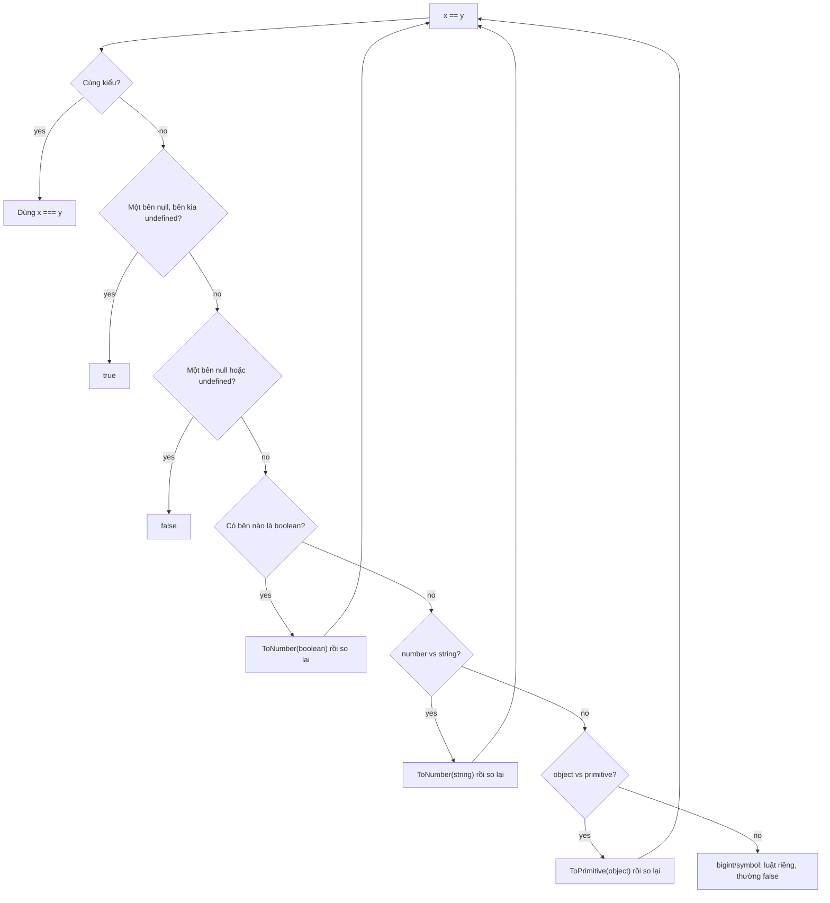

## Bối cảnh & vấn đề

Một API cấu hình trả về `{ "pageSize": 0, "label": "", "enabled": false }`. Code frontend viết `const size = cfg.pageSize || 20`. Người vận hành cố ý đặt `pageSize = 0` để tắt phân trang, nhưng UI vẫn hiện 20 dòng. Cờ `enabled: false` bị `cfg.enabled || true` biến thành `true`, nên một tính năng đang tắt lại bật lên ở production. Không có exception nào, không có log nào. Dữ liệu chỉ lặng lẽ sai.

Những bug như vậy đến từ một đặc điểm cốt lõi của JavaScript: ngôn ngữ **ép kiểu ngầm** (implicit coercion) ở rất nhiều chỗ, từ toán tử `+`, `==`, `||` cho tới câu lệnh `if`. Ép kiểu giúp code ngắn và "dễ tính" với dữ liệu lộn xộn từ form HTML, nhưng cũng có nghĩa là một giá trị có thể bị hiểu thành thứ khác mà bạn không hề viết ra. Senior engineer không cần thuộc lòng mọi ô trong bảng `==`, nhưng cần biết **luật đằng sau**, biết chỗ nào nguy hiểm, và có quy ước (lint, validate ở biên) để team không phải nhớ.

Bài này đi từ hệ thống kiểu, qua các thuật toán ép kiểu trong spec, tới những câu hỏi phỏng vấn kinh điển như `['1', '7', '11'].map(parseInt)` và cách chuẩn hoá payload từ nhà cung cấp bên ngoài. Phần số học dấu phẩy động, `BigInt`, JSON và `Date` nằm ở bài [Number, BigInt, JSON & Date](/tracks/javascript/learn/numbers-json-dates).

**Interview angle:** interviewer ít khi hỏi "`==` là gì". Họ đưa một đoạn code dùng `||` cho default hoặc so sánh `==` với `null`, rồi hỏi bạn thấy bug ở đâu và bạn sẽ đặt rule gì cho cả team.

## Khái niệm

### Primitive và object

JavaScript có đúng **bảy kiểu primitive**: `undefined`, `null`, `boolean`, `number`, `bigint`, `string`, `symbol`. Mọi thứ còn lại (mảng, function, `Date`, `Map`, object literal) đều là **object**. Primitive là **bất biến** (immutable) và được so sánh **theo giá trị**: hai chuỗi `'abc'` luôn bằng nhau. Object được so sánh **theo reference**: `{} === {}` là `false` vì đó là hai vùng nhớ khác nhau, dù nội dung giống hệt.

Khi bạn gọi method trên primitive, ví dụ `'abc'.toUpperCase()`, engine tạm "bọc" chuỗi vào một wrapper object `String` để tra method trên `String.prototype`, rồi bỏ wrapper đi. Đó là lý do primitive "có method" dù không phải object. Đừng tự tạo wrapper bằng `new String('a')`: `typeof new String('a')` là `'object'` và `new Boolean(false)` là **truthy**.

**Interview angle:** câu "vì sao `{} === {}` là false" kiểm tra bạn có phân biệt value và reference không, nền tảng của mọi câu hỏi về shallow copy và React re-render.

### typeof và những ngoại lệ lịch sử

Toán tử `typeof` trả về chuỗi mô tả kiểu, với hai ngoại lệ phải nhớ. `typeof null` là `'object'`, một bug từ phiên bản JavaScript đầu tiên (giá trị `null` có type tag giống object) và không thể sửa vì sẽ phá web. `typeof function(){}` là `'function'`, dù function thực chất là object có thể gọi được (có internal method `[[Call]]`). Mảng cho ra `'object'`, nên dùng `Array.isArray` để kiểm tra mảng; `NaN` cho ra `'number'` vì nó là một giá trị đặc biệt của kiểu number.

```js
typeof null;          // 'object'  (bug lịch sử)
typeof [];            // 'object'  → dùng Array.isArray
typeof NaN;           // 'number'
typeof 1n;            // 'bigint'
```

### Truthy và falsy

Mọi chỗ cần một boolean (`if`, `while`, `!`, `&&`, `||`, toán tử ba ngôi) đều chạy thuật toán **ToBoolean**. Danh sách **falsy** ngắn và cố định: `false`, `0`, `-0`, `0n`, `NaN`, `''`, `null`, `undefined` (cộng `document.all` trong browser vì lý do tương thích). Mọi thứ khác là **truthy**, kể cả `'0'`, `'false'`, `[]` và `{}`.

Điểm cần nhớ: mảng rỗng và object rỗng là truthy, nên `if (items)` không kiểm tra "có phần tử không". Chuỗi `'false'` từ query string hay biến môi trường cũng truthy, nên `if (process.env.FEATURE_X)` bật tính năng khi biến là `'false'`.

### Ép kiểu ngầm: ToPrimitive, ToNumber, ToString

Spec định nghĩa vài **abstract operation** mà mọi toán tử dựa vào. **ToNumber** chuyển `''` thành `0`, `' 42 '` thành `42` (bỏ khoảng trắng hai đầu), `'12px'` thành `NaN`, `null` thành `0`, `undefined` thành `NaN`, `true` thành `1`. **ToString** chuyển `[1, 2]` thành `'1,2'`, `{}` thành `'[object Object]'`.

Với object, trước hết phải chạy **ToPrimitive** kèm một **hint** (`'number'`, `'string'` hoặc `'default'`). Nếu object có `Symbol.toPrimitive` thì gọi nó. Nếu không, với hint `'string'` engine thử `toString()` rồi `valueOf()`; với hint `'number'` hoặc `'default'` thì thử `valueOf()` trước. `Date` là ngoại lệ: hint `'default'` được xử lý như `'string'`, nên `date + 1` ra chuỗi nhưng `date - 1` ra số. Toán tử `+` đặc biệt: nếu **một** bên sau ToPrimitive là string thì nó nối chuỗi, ngược lại cộng số. Các toán tử `-`, `*`, `/` luôn ép về số.

```js
[] + [];        // ''              (cả hai thành '')
[] + {};        // '[object Object]'
1 + '2';        // '12'            (+ nối chuỗi)
'3' * '4';      // 12              (* luôn ép số)
```

**Interview angle:** giải thích được "vì sao `[] + {}` ra `'[object Object]'`" bằng ToPrimitive cho thấy bạn hiểu luật, không chỉ thuộc kết quả.

### `==` (loose equality) và `===` (strict equality)

**`===`** so sánh không ép kiểu: khác kiểu là `false`, cùng kiểu thì so giá trị (object so reference). Hai ngoại lệ: `NaN === NaN` là `false` và `0 === -0` là `true`. **`==`** chạy thuật toán **IsLooselyEqual**: cùng kiểu thì dùng `===`; `null` và `undefined` chỉ bằng nhau và bằng chính chúng; number so với string thì string được ToNumber; boolean thì **luôn** bị ToNumber trước; object so với primitive thì object bị ToPrimitive.

Luật "boolean luôn bị ép thành số" là nguồn gốc của hầu hết kết quả kỳ quặc. `[] == false` là `true` vì `false` thành `0`, `[]` thành `''` rồi thành `0`. `'0' == false` là `true`, trong khi `'0'` lại truthy trong `if`. `null == 0` là `false` vì `null` chỉ bằng `undefined`, nhưng `null >= 0` là `true` vì toán tử quan hệ dùng ToNumber (null → 0). Ngoại lệ hợp lý duy nhất để dùng `==` là `x == null`, bắt cả `null` lẫn `undefined` trong một phép so sánh, và ESLint `eqeqeq` có option `{ null: 'ignore' }` cho đúng trường hợp này.

Còn một thuật toán thứ ba: **SameValue**, lộ ra qua `Object.is`. Nó giống `===` nhưng coi `NaN` bằng `NaN` và phân biệt `0` với `-0`. `Map`, `Set` và `Array.prototype.includes` dùng biến thể **SameValueZero** (như SameValue nhưng `0` bằng `-0`), vì vậy `[NaN].includes(NaN)` là `true` còn `[NaN].indexOf(NaN)` là `-1`.

### `||`, `&&` và `??`

`a || b` trả về `a` nếu `a` truthy, ngược lại trả về `b`. Nó không trả về boolean mà trả về **một trong hai toán hạng**. Đây là lý do `||` từng là cách viết default phổ biến, và cũng là lý do nó sai với các giá trị hợp lệ nhưng falsy: `0`, `''`, `false`, `NaN`.

**`??`** (nullish coalescing, ES2020) chỉ fallback khi vế trái là `null` hoặc `undefined`. Đó mới là ngữ nghĩa "chưa có giá trị" mà một default cần. Tương tự, `??=` chỉ gán khi biến đang nullish, và `?.` (optional chaining) dừng lại và trả `undefined` khi gặp `null`/`undefined` thay vì throw `TypeError`. Spec **cấm** trộn `??` với `||` hoặc `&&` mà không có ngoặc: `a || b ?? c` là `SyntaxError`, vì thứ tự ưu tiên giữa chúng dễ gây hiểu lầm nên TC39 bắt bạn nói rõ ý định.

```ts
const cfg = { retries: 0, label: '' };
cfg.retries || 3;   // 3   (bug: 0 là giá trị hợp lệ)
cfg.retries ?? 3;   // 0
```

**Interview angle:** câu follow-up hay gặp là "trộn `??` với `||` không ngoặc thì sao?" Trả lời đúng: parser báo `SyntaxError`, không phải một thứ tự ưu tiên nào đó.

### parseInt, Number và unary plus

Có ba cách phổ biến để chuyển chuỗi thành số, và chúng khác nhau. **`Number(s)`** và **`+s`** chạy ToNumber trên cả chuỗi: `'12px'` thành `NaN`, `''` thành `0` (một gotcha hay gặp với input form rỗng). **`parseInt(s, radix)`** đọc từ trái sang, dừng ở ký tự đầu tiên không hợp lệ: `parseInt('12px', 10)` là `12`. `parseInt` luôn trả về số nguyên và nhận tham số thứ hai là **radix** (cơ số 2 tới 36). Radix `0` hoặc `undefined` được hiểu là 10 (hoặc 16 nếu chuỗi bắt đầu bằng `0x`); radix `1` hay lớn hơn 36 là không hợp lệ và trả về `NaN`.

Đây là chìa khoá cho câu đố `['1', '7', '11'].map(parseInt)`. `Array.prototype.map` gọi callback với **ba** đối số `(value, index, array)`, nên thực tế chạy `parseInt('1', 0)` → `1`, `parseInt('7', 1)` → `NaN`, `parseInt('11', 2)` → `3` (vì `11` hệ nhị phân là 3). Kết quả `[1, NaN, 3]`.

### Validate ở biên (boundary validation)

TypeScript chỉ kiểm tra kiểu **lúc compile**. Khi `JSON.parse` một payload từ provider, kết quả là `any`, và mọi khai báo `as Product` chỉ là lời hứa, không phải kiểm tra. **Validate ở biên** nghĩa là ở đúng điểm dữ liệu đi vào hệ thống (HTTP body, message queue, file CSV, response từ API bên ngoài), bạn kiểm tra runtime bằng schema (zod, valibot, JSON Schema/ajv) rồi mới cho dữ liệu vào phần còn lại của code. Bên trong ranh giới, code có thể tin kiểu.

Ở biên, các câu hỏi về coercion trở nên cụ thể: `null`, thiếu field và `''` có nghĩa khác nhau không? Giá `"1.250.000"` có dấu phân cách theo locale thì parse thế nào? Chuỗi `"false"` có được coi là boolean không? Tên sản phẩm tiếng Việt có dấu từ hai nguồn có cùng dạng **Unicode normalization** không (dạng dựng sẵn NFC so với dạng tổ hợp NFD)? Mỗi câu hỏi cần một quyết định tường minh, không để coercion quyết định thay.

## Cơ chế hoạt động

Sơ đồ dưới tóm tắt thuật toán IsLooselyEqual trong spec. Đọc từ trên xuống, dừng ở nhánh đầu tiên khớp:



Điểm quan trọng nhất của sơ đồ là **vòng lặp**: sau mỗi bước ép kiểu, thuật toán chạy lại từ đầu với giá trị mới. Vì thế `[] == false` đi qua ba bước: boolean → `0`, rồi object → `''` (ToPrimitive của mảng rỗng), rồi string vs number → `0`, và cuối cùng `0 === 0`. Mỗi bước riêng lẻ đều "hợp lý", nhưng chuỗi bước tạo ra kết quả trái trực giác. Nhánh `null/undefined` nằm **trước** nhánh boolean và number, nên `null == 0` là `false` và `null == false` cũng là `false`: `null` không bao giờ bị ép thành số trong `==`.

Toán tử quan hệ (`<`, `>=`) đi đường khác: chúng gọi ToPrimitive với hint number rồi ToNumeric cả hai bên, không có nhánh đặc biệt cho `null`. Vì vậy `null >= 0` được tính là "không phải `0 < 0`", tức `true`. Hai thuật toán khác nhau cho hai họ toán tử là lý do không có một "bảng so sánh" nhất quán nào trong JavaScript.

Còn `||` và `??` thì đơn giản hơn nhiều: `||` chạy ToBoolean trên vế trái rồi trả về một trong hai toán hạng, còn `??` chỉ kiểm tra `=== null || === undefined`. Cả hai đều **short-circuit**: vế phải không được evaluate nếu không cần, nên `cfg.timeout ?? loadDefaultTimeout()` chỉ gọi hàm khi thiếu giá trị.

## Ví dụ thực tế

### Bảng kết quả coercion chạy thật

Chạy bằng `node l01.mjs` (Node 24):

```js
console.log(typeof null, typeof undefined, typeof 1n, typeof Symbol(), typeof function(){}, typeof [], typeof NaN);
console.log([] == false, null == 0, null >= 0, null == undefined, '' == 0, '0' == false, NaN == NaN);
console.log([] + [], [] + {}, 1 + '2', '3' * '4', true + 1, [1,2] + [3]);
console.log(['1', '7', '11'].map(parseInt));
console.log(Number('12px'), parseInt('12px', 10), +'12px', Number(''), Number(' 42 '), Number(null), Number(undefined));
console.log(Object.is(NaN, NaN), Object.is(0, -0), 0 === -0, Number.isNaN('abc'), isNaN('abc'));
const cfg = { retries: 0, label: '', enabled: false };
console.log(cfg.retries || 3, cfg.retries ?? 3, cfg.label || 'n/a', cfg.label ?? 'n/a', cfg.enabled || true, cfg.enabled ?? true);
const money = { valueOf() { return 42; }, toString() { return 'money'; } };
console.log(money + 1, `${money}`, money * 2, String(money));
const d = new Date(0); console.log(typeof (d + 1), typeof (d - 1));
try { eval('null || undefined ?? 1'); } catch (e) { console.log(e.constructor.name, e.message); }
console.log((null || undefined) ?? 1);
console.log(Boolean([]), Boolean({}), Boolean('0'), Boolean(0n), Boolean(NaN));
```

```text
object undefined bigint symbol function object number
true false true true true true false
 [object Object] 12 12 2 1,23
[ 1, NaN, 3 ]
NaN 12 NaN 0 42 0 NaN
true false true false true
3 0 n/a  true false
43 money 84 money
string number
SyntaxError Unexpected token '??'
1
true true true false false
```

Vài dòng đáng đọc kỹ. Dòng 3 bắt đầu bằng khoảng trắng vì `[] + []` là chuỗi rỗng. Dòng 6 cho thấy `isNaN('abc')` (bản global, có ép kiểu) là `true` còn `Number.isNaN('abc')` là `false`: bản global hỏi "ép thành số thì có ra NaN không", còn `Number.isNaN` hỏi "đây có đúng là giá trị NaN không". Dòng 8 cho thấy cùng một object cho ra `43` với `+` (hint default → `valueOf`) nhưng `'money'` trong template literal (hint string → `toString`). Dòng 9 là ngoại lệ của `Date`.

### Chuẩn hoá payload từ provider bên ngoài

Tình huống: một service làm giàu dữ liệu sản phẩm nhận payload từ nhiều nhà cung cấp. Một provider gửi tên ở dạng NFD (ký tự gốc + dấu tổ hợp), giá là chuỗi có dấu chấm phân cách hàng nghìn, `stock` là `0`, và `active` là chuỗi `"false"`:

```js
const raw = JSON.parse('{"name":"Cà phê sữa","price":"1.250.000","stock":0,"discount":null,"active":"false"}');
const known = 'Cà phê sữa';
console.log(raw.name === known, raw.name.length, known.length, raw.name.normalize('NFC') === known);
function toInt(v) {
  if (typeof v === 'number') return Number.isSafeInteger(v) ? v : null;
  if (typeof v !== 'string') return null;
  const digits = v.replace(/[.\s]/g, '');
  return /^\d+$/.test(digits) ? Number(digits) : null;
}
const product = {
  name: raw.name.normalize('NFC').trim(),
  priceVnd: toInt(raw.price),
  stock: raw.stock ?? 0,
  discount: raw.discount ?? 0,
  active: raw.active === true || raw.active === 'true',
};
console.log(product);
console.log('naive:', { stock: raw.stock || 100, active: Boolean(raw.active) });
```

```text
false 13 10 true
{
  name: 'Cà phê sữa',
  priceVnd: 1250000,
  stock: 0,
  discount: 0,
  active: false
}
naive: { stock: 100, active: true }
```

Dòng đầu cho thấy hai chuỗi **nhìn giống hệt nhau** nhưng `===` trả `false`, độ dài 13 so với 10. Nếu dedupe sản phẩm theo tên mà không `normalize('NFC')`, bạn sẽ có bản ghi trùng. Dòng cuối là phiên bản "ngây thơ": `stock || 100` biến hàng hết kho thành còn 100, và `Boolean('false')` bật sản phẩm đã tắt. Trong code thật, phần `toInt` và các quy tắc trên nên nằm trong một schema (zod `z.preprocess` hoặc `z.coerce` có kiểm soát) để mọi provider đi qua cùng một cửa.

**Interview angle:** với câu hỏi CV về normalize dữ liệu, kể được một ví dụ cụ thể kiểu "tên có dấu NFD làm dedupe hỏng" hay "`stock: 0` bị `||` thay" thuyết phục hơn nhiều so với "tôi dùng zod".

### Rule lint cho cả team

Thay vì yêu cầu mọi người nhớ bảng `==`, đặt rule trong config ESLint dùng chung:

```js
// eslint.config.mjs (trích)
export default [
  {
    rules: {
      eqeqeq: ['error', 'always', { null: 'ignore' }],   // cho phép x == null
      'no-implicit-coercion': ['error', { allow: ['!!'] }],
      radix: 'error',                                    // bắt parseInt thiếu radix
      '@typescript-eslint/prefer-nullish-coalescing': 'error',
      '@typescript-eslint/strict-boolean-expressions': 'warn',
    },
  },
];
```

`prefer-nullish-coalescing` của typescript-eslint cần type information và sẽ gợi ý đổi `||` thành `??` khi vế trái có kiểu nullable. `strict-boolean-expressions` ép bạn viết `if (items.length > 0)` thay vì `if (items.length)`, hơi ồn nhưng bắt được `if (count)` khi `count` có thể là `0`. Cách rollout (warn trước, đo, rồi ratchet sang error) được bàn trong bài [modules](/tracks/javascript/learn/modules-esm-cjs) phần conventions.

## Trade-offs & lựa chọn thay thế

| Lựa chọn | Ưu | Nhược | Dùng khi |
|---|---|---|---|
| `===` mọi nơi | Dễ đoán, không ép kiểu | Phải viết `x === null \|\| x === undefined` | Mặc định cho mọi so sánh |
| `x == null` | Gọn, bắt cả null và undefined | Người đọc phải biết đây là idiom có chủ ý | Kiểm tra "chưa có giá trị" |
| `a \|\| b` | Fallback cho mọi falsy | Nuốt `0`, `''`, `false` hợp lệ | Khi thực sự muốn thay cả chuỗi rỗng (vd tên hiển thị) |
| `a ?? b` | Chỉ fallback null/undefined | Không thay `''` hay `NaN` | Default cho config, API response |
| `Number(s)` / `+s` | Nghiêm ngặt: `'12px'` → NaN | `''` → 0, khoảng trắng → 0 | Parse số từ JSON/string đã sạch |
| `parseInt(s, 10)` | Chấp nhận hậu tố (`'12px'`) | Quá dễ dãi: `'12abc'` → 12, bỏ phần thập phân | Đọc CSS value, chuỗi có đơn vị |
| Schema validation (zod) | Một chỗ, lỗi rõ, kiểu TS suy ra | Thêm dependency, chi phí runtime nhỏ | Mọi dữ liệu đi vào từ bên ngoài |
| Tự viết type guard | Không dependency | Dễ sót case, khó bảo trì | Payload nhỏ, ít field |

Chọn thế nào: trong code nghiệp vụ, mặc định `===` và `??`, chỉ dùng `==` cho idiom `== null` và chỉ dùng `||` khi bạn chủ động muốn thay cả chuỗi rỗng (ví dụ `user.displayName || user.email`). Khi parse số, `Number` an toàn hơn `parseInt` vì nó từ chối rác, nhưng phải kiểm tra riêng chuỗi rỗng. Ở biên hệ thống, đừng rải logic coercion khắp nơi: gom vào schema, để phần còn lại của code làm việc với kiểu đã chắc chắn.

## Edge cases & failure modes

- **Input form rỗng thành 0**: `Number('')` và `Number('   ')` là `0`. Một ô "số lượng" bị bỏ trống thành đơn hàng số lượng 0 thay vì lỗi validate. Kiểm tra `s.trim() === ''` trước.
- **Biến môi trường luôn là string**: `process.env.MAX_CONN` là `'10'`, và `'10' + 5` là `'105'`. Còn `process.env.DEBUG = 'false'` thì truthy. Parse env một lần khi khởi động bằng schema, không đọc `process.env` rải rác.
- **`NaN` lan truyền im lặng**: mọi phép toán với `NaN` ra `NaN`, và `NaN > 0` lẫn `NaN <= 0` đều `false`. Một điều kiện `if (price <= 0) reject()` sẽ cho `NaN` đi qua. Dùng `Number.isFinite` khi validate.
- **`-0`**: `Math.round(-0.4)` là `-0`, `JSON.stringify(-0)` là `'0'`, nhưng `Object.is(x, 0)` là `false` và `1 / -0` là `-Infinity`. Hiếm khi gây bug, nhưng hay xuất hiện trong câu đố.
- **Object với `valueOf` tuỳ biến**: một class `Money` định nghĩa `valueOf` sẽ bị so sánh `==` và `<` theo số một cách âm thầm; `Symbol.toPrimitive` cho bạn kiểm soát rõ hơn hoặc throw để cấm ép kiểu.
- **Unicode**: `'é'.length` có thể là 1 hoặc 2 tuỳ dạng normalize; emoji chiếm 2 code unit UTF-16 nên `'👍'.length` là 2 và `slice` có thể cắt đôi ký tự. Dùng `Intl.Segmenter` hoặc `[...str]` khi đếm ký tự hiển thị.
- **So sánh chuỗi số**: `'10' < '9'` là `true` vì so sánh theo từ điển khi cả hai đều là string. `['10', '9', '1'].sort()` cũng sắp theo chuỗi.

## Pitfalls

- ❌ `const limit = query.limit || 20` → ✅ `const limit = query.limit ?? 20` (và validate kiểu), vì `limit=0` có thể là giá trị có chủ ý.
- ❌ `if (process.env.FEATURE_X)` → ✅ `if (process.env.FEATURE_X === 'true')` hoặc parse env bằng schema; chuỗi `'false'` là truthy.
- ❌ `arr.map(parseInt)` hoặc `arr.map(Number.parseFloat)` "point-free" → ✅ `arr.map((s) => Number.parseInt(s, 10))` hoặc `arr.map(Number)`; callback của `map` nhận thêm `index` và `array`.
- ❌ `if (x == 0)` để kiểm tra "rỗng" → ✅ viết điều kiện tường minh; `'' == 0`, `[] == 0` và `'0' == 0` đều `true`.
- ❌ `value !== NaN` → ✅ `Number.isNaN(value)`; `NaN` không bằng chính nó.
- ❌ Tin `JSON.parse(body) as Order` → ✅ parse bằng schema ở biên; `as` không kiểm tra gì lúc runtime.
- ❌ Dedupe theo tên có dấu mà không normalize → ✅ `name.normalize('NFC').trim()` (có thể thêm `toLocaleLowerCase('vi')`) trước khi so khớp.
- ❌ Viết `a || b ?? c` → ✅ thêm ngoặc; parser từ chối và buộc bạn chọn thứ tự.

## Tóm tắt

- Bảy primitive (bất biến, so theo giá trị) và object (so theo reference). `typeof null === 'object'` là bug lịch sử; dùng `Array.isArray` cho mảng.
- Falsy chỉ gồm `false, 0, -0, 0n, NaN, '', null, undefined`. `[]`, `{}`, `'0'`, `'false'` đều truthy.
- Ép kiểu dựa trên ToPrimitive (hint quyết định `valueOf` hay `toString` chạy trước), ToNumber và ToString. `+` nối chuỗi nếu một bên là string; `-`, `*`, `/` luôn ép số.
- `==` chạy IsLooselyEqual: boolean luôn bị ép thành số, `null` chỉ bằng `undefined`. Mặc định dùng `===`; `x == null` là ngoại lệ chấp nhận được. `Object.is` phân biệt `-0` và coi `NaN` bằng `NaN`.
- `??` chỉ fallback với `null`/`undefined`, đúng cho default; `||` nuốt `0`, `''`, `false`. Trộn `??` với `||` không ngoặc là SyntaxError.
- `['1','7','11'].map(parseInt)` là `[1, NaN, 3]` vì `index` bị truyền làm radix. `Number('')` là `0`, `parseInt('12px', 10)` là `12`.
- Validate và chuẩn hoá ở biên (schema, `normalize('NFC')`, parse số theo locale) và enforce bằng lint (`eqeqeq`, `radix`, `prefer-nullish-coalescing`) thay vì dựa vào trí nhớ.
