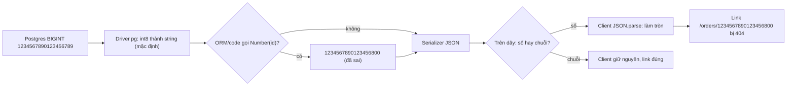

## Bối cảnh & vấn đề

Ba ticket từ cùng một hệ thống thương mại điện tử, trong cùng một tuần. Ticket 1: tổng giỏ hàng hiển thị `299.97000000000003`. Ticket 2: trong trang admin, bấm "mở đơn hàng" với một số đơn thì ra 404, và ID hiển thị trên UI không khớp với database. Ticket 3: khách ở Mỹ thấy ngày giao hàng sớm hơn một ngày so với khách ở Việt Nam, dù API trả về cùng một chuỗi `"2026-03-08"`.

Cả ba đều không có exception. Chúng đến từ ba quyết định thiết kế cũ của JavaScript: mọi `number` là số thực dấu phẩy động 64-bit, `JSON.parse` chuyển mọi số thành `number`, và `Date` là một timestamp UTC được đọc theo timezone của máy. Bài này giải thích từng cơ chế, cách biểu diễn đúng tiền, ID và ngày lịch, và vì sao `JSON.parse(JSON.stringify(obj))` không phải cách deep clone. Phần coercion nói chung nằm ở bài [kiểu dữ liệu & coercion](/tracks/javascript/learn/types-coercion).

**Interview angle:** đây là nhóm câu hỏi "production bug" rất hay gặp ở vị trí full-stack: interviewer muốn nghe bạn lần theo lỗi qua cả chuỗi DB → driver → API → client, không chỉ nói "float không chính xác".

## Khái niệm

### Number là IEEE 754 double

Kiểu `number` của JavaScript là **IEEE 754 binary64** (double precision): 1 bit dấu, 11 bit exponent, 52 bit mantissa. Không có kiểu integer riêng; `1` và `1.0` là cùng một giá trị. Máy lưu số ở **hệ nhị phân**, và giống như `1/3` không viết được chính xác ở hệ thập phân, `0.1` không viết được chính xác ở hệ nhị phân. Máy lưu số gần nhất biểu diễn được, sai lệch khoảng `5.5e-18`. Cộng hai số đã lệch, kết quả lệch thêm và làm tròn ra `0.30000000000000004`.

Đây không phải bug của JavaScript. Python, Java (`double`), C# (`double`) cho kết quả y hệt. Điểm khác là JavaScript **không có kiểu decimal có sẵn**, nên lập trình viên dễ dùng `number` cho tiền. `toFixed` cũng không cứu được: `(1.005).toFixed(2)` là `"1.00"` vì `1.005` thực ra được lưu là `1.00499999999999989...`.

### Safe integer và 2^53

Với 52 bit mantissa (cộng 1 bit ẩn), double biểu diễn **chính xác** mọi số nguyên trong khoảng `±(2^53 - 1)`, tức `Number.MAX_SAFE_INTEGER = 9007199254740991`. Vượt quá, khoảng cách giữa hai số liền kề lớn hơn 1: `2^53` và `2^53 + 1` là **cùng một** double. `Number.isSafeInteger(n)` kiểm tra một số có nằm trong vùng an toàn không.

Vấn đề xuất hiện khi ID là `BIGINT` 64-bit trong database: Snowflake ID, ID sinh theo sequence lớn, hay ID từ hệ thống khác. Một ID như `1234567890123456789` vượt `2^53` khoảng 137 lần. Khi đi qua `JSON.parse`, nó bị làm tròn thành `1234567890123456800`, một ID khác hoàn toàn, **không có lỗi nào được báo**.

### BigInt

**`BigInt`** (ES2020) là kiểu primitive cho số nguyên độ lớn tuỳ ý, viết bằng hậu tố `n` (`10n`) hoặc `BigInt('123')`. Nó giải quyết được độ chính xác, nhưng không phải thay thế drop-in cho `number`. Không trộn được với `number` trong phép toán (`1n + 1` là `TypeError`), phép chia làm tròn về 0 (`7n / 2n` là `3n`), `Math.*` không nhận BigInt, và quan trọng nhất: `JSON.stringify` **ném lỗi** với BigInt vì JSON không định nghĩa cách serialize nó. Nhiều thư viện (validation, ORM, chart) cũng không hỗ trợ.

Vì vậy quy tắc thực tế cho ID lớn là: trong API contract, ID là **string**. Server đọc từ DB dạng string (driver `pg` mặc định trả `int8` và `numeric` dạng string chính vì lý do này), và client không bao giờ làm toán trên ID.

### Biểu diễn tiền: minor units và decimal

Có hai cách đúng để biểu diễn tiền. **Minor units**: lưu số nguyên theo đơn vị nhỏ nhất (cents cho USD, đồng cho VND vốn không có phần lẻ), ví dụ `$19.99` là `1999`. Cộng trừ số nguyên trong vùng an toàn là chính xác tuyệt đối. **Decimal**: ở DB dùng `NUMERIC`/`DECIMAL`, trong JS dùng thư viện decimal (decimal.js, big.js, dinero.js) khi cần nhân chia theo tỉ lệ như thuế, chiết khấu phần trăm, quy đổi tiền tệ.

Dù chọn cách nào, cần một **quy tắc làm tròn** rõ ràng (half-up, half-even/banker's rounding) và làm tròn **ở một chỗ duy nhất**, thường là khi tính xong một dòng hoá đơn. Khi chia một tổng cho nhiều phần (phân bổ khuyến mãi, chia hoá đơn), phải phân bổ phần dư sao cho tổng các phần **bằng đúng** tổng gốc. Hiển thị thì dùng `Intl.NumberFormat` với `style: 'currency'`, không tự ghép chuỗi.

### JSON: một định dạng dữ liệu, không phải object JavaScript

JSON chỉ có sáu loại giá trị: object, array, string, number, `true`/`false`, `null`. Mọi thứ khác của JavaScript phải bị chuyển đổi hoặc mất khi `JSON.stringify`: `Date` gọi `toJSON()` thành chuỗi ISO, `undefined`/function/Symbol bị bỏ khỏi object (thành `null` trong mảng), `Map`/`Set` thành `{}`, `NaN`/`Infinity` thành `null`, BigInt ném `TypeError`, và cấu trúc vòng (circular) ném `TypeError: Converting circular structure to JSON`. Chiều ngược lại, `JSON.parse` không biết field nào "vốn là" Date hay BigInt.

`JSON.parse` nhận tham số thứ hai là **reviver** để biến đổi từng giá trị. Ở các runtime mới, reviver nhận thêm đối số thứ ba `context` với `context.source` là **chuỗi gốc** của giá trị primitive (proposal "JSON.parse source text access", có trong V8 và Node 22+ (verify)). Nhờ đó bạn đọc được ID lớn chính xác trước khi nó bị làm tròn.

### Deep clone: structuredClone

**Shallow copy** (spread, `Object.assign`) chỉ tạo mới tầng đầu (xem bài [prototype & object](/tracks/javascript/learn/prototypes-objects)). **Deep copy** tạo mới mọi tầng. Cách cũ `JSON.parse(JSON.stringify(obj))` là deep copy "qua JSON", nên mang theo mọi hạn chế của JSON ở trên: Date thành chuỗi, Map/Set thành object rỗng, NaN thành null, undefined biến mất, BigInt và circular ném lỗi.

**`structuredClone(value)`** dùng thuật toán **structured clone** của HTML (cũng là thuật toán `postMessage` dùng để gửi dữ liệu sang worker). Nó hỗ trợ Date, Map, Set, RegExp, ArrayBuffer/typed array, BigInt, Error, và cả cấu trúc vòng. Nó **không** clone function (ném `DataCloneError`), DOM node, và **không giữ prototype**: instance của class thành plain object, mất method. Có sẵn trong browser hiện đại và Node 17+.

### Date: một timestamp UTC, đọc theo timezone local

Một đối tượng `Date` chỉ chứa **một con số**: số millisecond kể từ `1970-01-01T00:00:00Z`. Nó không lưu timezone. Các method `getHours()`, `getDate()` diễn giải con số đó theo **timezone của máy đang chạy**; các method `getUTC*()` diễn giải theo UTC.

Quy tắc parse chuỗi trong spec là nguồn gốc của rất nhiều bug: chuỗi **date-only** ISO (`"2026-03-08"`) được parse là **UTC midnight**, còn chuỗi **date-time không có offset** (`"2026-03-08T00:00"`) được parse là **giờ local**. Chênh nhau chỉ một chữ `T00:00` mà kết quả lệch tới 14 tiếng tuỳ timezone. Ngày "lịch" như ngày sinh, ngày giao hàng, hạn thanh toán không phải là một thời điểm; nó là một khái niệm khác mà `Date` không biểu diễn được. **Temporal** (proposal TC39 giai đoạn 3) có `Temporal.PlainDate` cho đúng khái niệm này, nhưng chưa có sẵn trong Node 24 và mới ship ở một số browser (verify).

**Interview angle:** câu "lưu giờ mở cửa cửa hàng cho tenant ở nhiều timezone, có DST" kiểm tra bạn phân biệt được *instant* (lưu UTC), *wall-clock time* (lưu giờ local + IANA timezone như `America/New_York`) và *calendar date*.

## Cơ chế hoạt động

Lấy ticket 2 làm ví dụ, sơ đồ theo một ID `BIGINT` qua toàn bộ pipeline và đánh dấu chỗ nó bị làm tròn:



Có hai chỗ ID có thể hỏng. Chỗ thứ nhất ở server: driver trả string an toàn, nhưng một dòng `Number(row.id)` hoặc một ORM cấu hình parse `int8` thành number sẽ làm tròn ngay tại server, và cache (Redis lưu JSON) sẽ lưu luôn giá trị sai. Chỗ thứ hai ở client: nếu API gửi ID dạng số trên dây (`{"id":1234567890123456789}`), `JSON.parse` của browser làm tròn khi đọc. Lỗi chỉ xảy ra với ID vượt `2^53`, nên test với dữ liệu nhỏ luôn pass, và sự cố chỉ xuất hiện khi sequence đủ lớn hoặc khi chuyển sang ID kiểu Snowflake.

Fix đúng là sửa **hợp đồng API**: ID là string từ DB tới client, kiểm tra từng chặng (driver, ORM, serializer, cache, client). Nếu không đổi được API vì client cũ, dùng reviver với `context.source` hoặc thư viện `json-bigint` ở client như biện pháp tạm.

Với `Date`, cơ chế lệch ngày như sau: `new Date('2026-03-08')` là `2026-03-08T00:00:00Z`. Ở `America/New_York` (UTC-5 vào tháng 3 trước khi DST bắt đầu), thời điểm đó là 19:00 ngày 7 giờ local, nên `getDate()` trả `7`. Ở `Asia/Ho_Chi_Minh` (UTC+7), đó là 07:00 ngày 8, nên đúng. Bug chỉ xuất hiện với timezone âm, nên team ở Việt Nam không thấy khi test.

## Ví dụ thực tế

### Float, safe integer, BigInt và JSON

```js
console.log(0.1 + 0.2, 0.1 + 0.2 === 0.3, Math.abs(0.1 + 0.2 - 0.3) < Number.EPSILON);
console.log((1.005).toFixed(2), (1.005).toPrecision(20));
console.log(Number.MAX_SAFE_INTEGER, 2 ** 53 === 2 ** 53 + 1, Number.isSafeInteger(9007199254740993));
const body = '{"id":1234567890123456789,"total":125000}';
console.log(JSON.parse(body).id);
const withSource = JSON.parse(body, (k, v, ctx) => (k === 'id' ? BigInt(ctx.source) : v));
console.log(withSource.id, typeof withSource.id);
try { JSON.stringify({ id: 10n }); } catch (e) { console.log(e.constructor.name + ':', e.message); }
BigInt.prototype.toJSON = function () { return this.toString(); };
console.log(JSON.stringify({ id: 1234567890123456789n }));
delete BigInt.prototype.toJSON;
try { 1n + 1; } catch (e) { console.log(e.constructor.name + ':', e.message); }
console.log(7n / 2n, 2n ** 64n);
console.log(new Intl.NumberFormat('vi-VN', { style: 'currency', currency: 'VND' }).format(125000));
console.log(new Intl.NumberFormat('en-US', { style: 'currency', currency: 'USD' }).format(1234.5));
function allocate(total, parts) {
  const base = Math.floor(total / parts), rem = total - base * parts;
  return Array.from({ length: parts }, (_, i) => base + (i < rem ? 1 : 0));
}
const a = allocate(100000, 3); console.log(a, a.reduce((s, x) => s + x, 0));
console.log(19.99 * 100, Math.round(19.99 * 100));
```

Output trên Node 24:

```text
0.30000000000000004 false true
1.00 1.0049999999999998934
9007199254740991 true false
1234567890123456800
1234567890123456789n bigint
TypeError: Do not know how to serialize a BigInt
{"id":"1234567890123456789"}
TypeError: Cannot mix BigInt and other types, use explicit conversions
3n 18446744073709551616n
125.000 ₫
$1,234.50
[ 33334, 33333, 33333 ] 100000
1998.9999999999998 1999
```

Đọc từng dòng: dòng 2 lộ ra giá trị thật của `1.005`. Dòng 4 là ticket 2: ID bị làm tròn im lặng. Dòng 5 dùng `context.source` để lấy lại chuỗi gốc. Dòng 7 là mẹo `BigInt.prototype.toJSON` để serialize thành chuỗi; tiện nhưng là monkey-patch toàn cục, nên làm ở serializer riêng thì an toàn hơn. Dòng 12 là lời giải cho bài "chia 100.000 VND cho 3 món": phần dư 1 đồng được cộng vào món đầu, tổng vẫn đúng 100.000. Dòng cuối là lý do phải `Math.round` khi đổi số thập phân sang minor units: `19.99 * 100` không ra `1999`.

### Lệch ngày theo timezone

Chạy cùng file với hai giá trị biến môi trường `TZ`:

```js
const s = '2026-03-08';
const d1 = new Date(s), d2 = new Date(s + 'T00:00');
console.log(process.env.TZ, d1.toISOString(), `${d1.getMonth() + 1}/${d1.getDate()}`, '| local:', d2.toISOString());
console.log('utc read:', `${d1.getUTCMonth() + 1}/${d1.getUTCDate()}`,
  new Intl.DateTimeFormat('en-US', { timeZone: 'UTC', month: 'numeric', day: 'numeric' }).format(d1));
const [y, m, d] = s.split('-').map(Number);
console.log('manual:', `${m}/${d}`);
console.log(typeof globalThis.Temporal);
```

```text
$ TZ=America/New_York node l02b.mjs
America/New_York 2026-03-08T00:00:00.000Z 3/7 | local: 2026-03-08T05:00:00.000Z
utc read: 3/8 3/8
manual: 3/8
undefined
$ TZ=Asia/Ho_Chi_Minh node l02b.mjs
Asia/Ho_Chi_Minh 2026-03-08T00:00:00.000Z 3/8 | local: 2026-03-07T17:00:00.000Z
utc read: 3/8 3/8
manual: 3/8
undefined
```

Ở New York, `getDate()` ra `7`: đó chính là ticket 3. Chuỗi có `T00:00` thì ngược lại: được hiểu là nửa đêm **local**, nên ISO string khác nhau giữa hai máy. Ba cách đọc đúng (`getUTC*`, `Intl.DateTimeFormat` với `timeZone: 'UTC'`, hoặc tách chuỗi thủ công) đều cho `3/8` ở mọi timezone. Dòng cuối xác nhận `Temporal` chưa có trong Node 24. Mẹo kiểm thử: chạy test suite với `TZ=America/New_York` trong CI để bắt loại bug này sớm.

### JSON clone so với structuredClone

```js
const order = { at: new Date('2026-01-01T00:00:00Z'), tags: new Set(['vip']), meta: new Map([['src', 'web']]), n: NaN, u: undefined, big: 10n };
order.self = order;

const { self, big, ...plain } = order;
console.log(JSON.parse(JSON.stringify(plain)));
try { JSON.stringify(order); } catch (e) { console.log(e.constructor.name + ':', e.message); }
const cyc = { ...plain }; cyc.self = cyc;
try { JSON.stringify(cyc); } catch (e) { console.log(e.constructor.name + ':', e.message.split('\n')[0]); }

const c = structuredClone(order);
console.log(c.at instanceof Date, c.tags, c.meta, c.self === c, c.big, Number.isNaN(c.n), 'u' in c);
try { structuredClone({ run() {} }); } catch (e) { console.log(e.name + ':', e.message); }
class Money { constructor(v) { this.v = v; } fmt() { return `${this.v} VND`; } }
const m = structuredClone(new Money(5)); console.log(m instanceof Money, m);
```

```text
{ at: '2026-01-01T00:00:00.000Z', tags: {}, meta: {}, n: null }
TypeError: Do not know how to serialize a BigInt
TypeError: Converting circular structure to JSON
true Set(1) { 'vip' } Map(1) { 'src' => 'web' } true 10n true true
DataCloneError: run() {} could not be cloned.
false { v: 5 }
```

Bản JSON mất gần như mọi thứ: Date thành chuỗi, Set/Map thành `{}`, NaN thành `null`, `u` biến mất. `structuredClone` giữ nguyên Date, Set, Map, BigInt, NaN, `undefined` và cả vòng tự tham chiếu (`c.self === c`). Hai dòng cuối là giới hạn của nó: function ném `DataCloneError`, và instance `Money` thành plain object không còn method `fmt`.

## Trade-offs & lựa chọn thay thế

| Vấn đề | Cách | Ưu | Nhược |
|---|---|---|---|
| Tiền | `number` float | Đơn giản | Sai số cộng dồn, `toFixed` làm tròn sai |
| Tiền | Minor units (integer) | Chính xác, nhanh, JSON thân thiện | Phải nhớ đơn vị; chia/nhân tỉ lệ vẫn cần quy tắc làm tròn |
| Tiền | Decimal library + `NUMERIC` | Chính xác với tỉ lệ, thuế | Chậm hơn, cần serialize dạng string |
| ID 64-bit | string trong API | An toàn mọi client, không cần thư viện | Không so sánh số trực tiếp (hiếm khi cần) |
| ID 64-bit | `BigInt` | Toán chính xác | Không JSON, không trộn với number, thư viện ít hỗ trợ |
| ID 64-bit | `json-bigint` / reviver `context.source` | Không đổi API | Mọi client phải biết; dễ sót một chỗ |
| Deep copy | `JSON.parse(JSON.stringify())` | Chạy mọi nơi | Mất Date/Map/Set/undefined, lỗi BigInt/circular |
| Deep copy | `structuredClone` | Đúng cho hầu hết kiểu dữ liệu | Không function, mất prototype |
| Deep copy | Không copy: immutable update, Immer | Rẻ, structural sharing | Cần kỷ luật hoặc thư viện |
| Ngày lịch | String `YYYY-MM-DD` | Không bao giờ lệch timezone | Tự viết so sánh/cộng ngày |
| Ngày lịch | `Date` + đọc UTC | API quen thuộc | Dễ quên một chỗ `getDate()` |
| Ngày lịch | `Temporal.PlainDate` / polyfill | Đúng khái niệm | Hỗ trợ runtime còn hạn chế (verify) |

Chọn thế nào: tiền dùng minor units cho luồng thanh toán đơn giản, chuyển sang decimal khi có tỉ lệ phức tạp; không bao giờ dùng float. ID lớn luôn là string trong contract, đó là quyết định rẻ nhất nếu làm từ đầu và đắt nhất nếu sửa sau. Deep clone thì trước hết hỏi "có cần clone không": trong React/Redux, immutable update theo đường thay đổi (hoặc Immer) gần như luôn tốt hơn clone cả cây. Khi cần clone thật, `structuredClone` là mặc định.

## Edge cases & failure modes

- **Cache giữ giá trị đã hỏng**: một service Node đọc ID bằng `Number()` rồi ghi vào Redis; sửa code xong, cache vẫn trả ID sai tới khi hết TTL. Khi sửa loại bug này, phải xoá hoặc version lại key cache.
- **Tổng không khớp sau làm tròn từng dòng**: làm tròn thuế từng dòng rồi cộng, so với cộng rồi làm tròn, có thể lệch 1 đồng. Chọn một quy ước, ghi vào tài liệu, và dùng nó ở cả frontend lẫn backend.
- **DST**: "cộng 24 giờ" không phải lúc nào cũng là "ngày mai" vào ngày đổi giờ. Lịch hẹn định kỳ (9:00 mỗi sáng thứ Hai theo giờ New York) phải lưu giờ local + IANA timezone, không lưu UTC offset cố định.
- **Parse chuỗi không chuẩn**: `new Date('03/08/2026')` hay `new Date('2026-3-8')` là implementation-defined, có thể khác nhau giữa engine. Chỉ tin định dạng ISO 8601 đầy đủ.
- **`structuredClone` trên object lớn**: nó copy toàn bộ, tốn CPU và bộ nhớ tương đương kích thước object. Clone state 50 MB trong một handler có thể chặn event loop (xem [event loop](/tracks/javascript/learn/event-loop)).
- **JSON payload rất lớn**: `JSON.parse` 50 MB là thao tác đồng bộ, chặn thread hàng trăm millisecond tới vài giây, và tạo ra nhiều object làm tăng áp lực GC. Dùng streaming parser hoặc NDJSON.
- **`Number.EPSILON` không phải epsilon vạn năng**: nó là khoảng cách quanh `1`, quá nhỏ cho số lớn. So sánh float nên dùng sai số tương đối hoặc chuyển sang integer.

## Pitfalls

- ❌ `price: 19.99` (float) trong DB và code → ✅ `price_minor: 1999` (integer) hoặc `NUMERIC(12,2)` + decimal library; float cho tiền là lỗi thiết kế, không phải lỗi hiển thị.
- ❌ `(x).toFixed(2)` để làm tròn tiền → ✅ làm tròn trên integer minor units với quy tắc rõ ràng; `toFixed` chỉ để format và vẫn lệch với `1.005`.
- ❌ API trả `{ "id": 1234567890123456789 }` → ✅ `{ "id": "1234567890123456789" }`; mọi client JSON chuẩn đều làm tròn số lớn.
- ❌ Gắn `BigInt.prototype.toJSON` trong một file tiện ích bất kỳ → ✅ serialize rõ ràng ở một lớp (DTO mapper) để không đổi hành vi toàn cục một cách bất ngờ.
- ❌ `new Date('2026-03-08').getDate()` cho ngày lịch → ✅ giữ string, hoặc đọc bằng `getUTCDate()` / `Intl.DateTimeFormat({ timeZone: 'UTC' })`.
- ❌ `JSON.parse(JSON.stringify(state))` để "copy cho chắc" → ✅ `structuredClone` khi thật cần deep copy, còn lại dùng immutable update.
- ❌ Chỉ test ở timezone của team → ✅ chạy test với `TZ=America/New_York` và `TZ=UTC` trong CI.

## Tóm tắt

- `number` là IEEE 754 double: `0.1 + 0.2` lệch, `(1.005).toFixed(2)` là `"1.00"`. Số nguyên chỉ chính xác tới `2^53 - 1`.
- Tiền: minor units (integer) hoặc `NUMERIC` + decimal library, một quy tắc làm tròn, làm tròn ở một chỗ, phân bổ phần dư để tổng khớp. Hiển thị bằng `Intl.NumberFormat`.
- ID `BIGINT`: là string trong API. `JSON.parse` làm tròn im lặng; kiểm tra cả chuỗi driver → ORM → serializer → cache → client.
- `BigInt` chính xác nhưng không trộn với `number`, không JSON-serialize được, thư viện ít hỗ trợ.
- JSON mất Date/Map/Set/undefined/NaN và ném lỗi với BigInt/circular. `structuredClone` giữ các kiểu đó và cấu trúc vòng, nhưng không clone function và mất prototype.
- `Date` là một timestamp UTC. Chuỗi date-only được parse là UTC, date-time không offset là local. Ngày lịch nên giữ dạng string hoặc `Temporal.PlainDate`.
- Chạy test ở nhiều timezone; lưu instant bằng UTC, lịch định kỳ bằng giờ local + IANA timezone.
