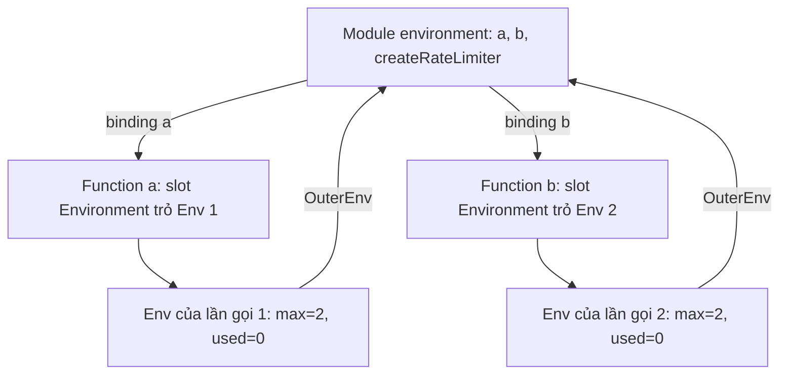

## Bối cảnh & vấn đề

Một component React hiển thị số giây đã trôi qua. Code nhìn hoàn toàn hợp lý: `setInterval(() => setSec(sec + 1), 1000)` trong một `useEffect` với dependency `[]`. Nhưng màn hình dừng ở `1s` mãi mãi. Ở một service Node, một middleware tạo callback log cho mỗi request, và heap tăng đều dù callback chỉ dùng mỗi `requestId`. Ở bài test đầu vào của một công ty, ứng viên được hỏi vòng `for (var i...)` với `setTimeout` in ra gì, và phần lớn trả lời `0 1 2`.

Cả ba tình huống xoay quanh một cơ chế: **closure**, tức là một function mang theo môi trường biến nơi nó được tạo ra. Closure là thứ làm cho callback, module pattern, React hooks, memoize, debounce hoạt động được. Nó cũng là nguồn gốc của stale data và memory leak khi bạn không hình dung được function đang "nhìn thấy" biến nào, ở phiên bản nào. Bài này xây dựng mô hình đó từ gốc: scope, environment record, hoisting và TDZ, rồi tới closure và các bug thực tế. `this` là một cơ chế **khác** (quyết định lúc gọi, không theo scope) và được tách sang bài [this & functions](/tracks/javascript/learn/this-functions).

**Interview angle:** câu "closure là gì" chỉ là cửa vào. Interviewer thật sự muốn nghe "closure giữ **reference** tới biến, không phải bản copy", và thấy bạn áp dụng điều đó để giải thích một bug.

## Khái niệm

### Lexical scope và scope chain

**Scope** là vùng code mà một tên biến có hiệu lực. JavaScript dùng **lexical scope** (còn gọi là static scope): scope được quyết định bởi **vị trí viết code**, không phải bởi nơi function được gọi. Một function viết bên trong function khác nhìn thấy biến của function ngoài, bất kể sau này nó được truyền đi đâu và gọi từ đâu.

Khi tra một tên, engine tìm ở scope hiện tại, không thấy thì đi ra scope bao ngoài, rồi ra nữa cho tới module scope và global scope. Chuỗi đó gọi là **scope chain**. Không tìm thấy ở đâu cả thì ném `ReferenceError: x is not defined` (ở strict mode; sloppy mode khi **gán** vào biến chưa khai báo sẽ vô tình tạo biến global). Có bốn loại scope thường gặp: global, module (mỗi file ESM có scope riêng), function, và block (`{ }` của `if`, `for`, hoặc một khối trơn) cho `let`/`const`/`class`.

### Environment record

Spec mô tả scope bằng **environment record**: một bảng ánh xạ tên → giá trị (binding), kèm con trỏ `[[OuterEnv]]` tới record bao ngoài. Mỗi lần một function được **gọi**, engine tạo một environment record mới cho lần gọi đó. Mỗi function object, khi được **tạo ra**, lưu lại con trỏ tới environment record đang hoạt động lúc đó, trong một slot nội bộ gọi là `[[Environment]]`.

Hai điểm này là toàn bộ bí mật của closure. Gọi `counter()` hai lần cho ra hai record riêng, nên hai bộ đếm không dính nhau. Function con giữ con trỏ tới record, không phải một bản chụp giá trị, nên nó thấy mọi thay đổi xảy ra sau đó và thay đổi của nó cũng được người khác thấy.

### Hoisting: var, function, let/const/class

**Hoisting** là tên gọi cho việc engine tạo binding cho mọi khai báo trong scope **trước khi** chạy dòng code đầu tiên của scope đó. Khác biệt nằm ở việc binding được **khởi tạo** thế nào:

- **`var`**: binding được tạo ở **function scope** (không phải block) và khởi tạo ngay bằng `undefined`. Đọc trước dòng khai báo ra `undefined`, không lỗi.
- **Function declaration** (`function f() {}`): binding được tạo và gán **luôn cả function**. Gọi trước dòng khai báo vẫn chạy.
- **`let`, `const`, `class`**: binding được tạo ở **block scope** nhưng **chưa khởi tạo**. Mọi truy cập trước dòng khai báo ném `ReferenceError: Cannot access 'x' before initialization`.
- **Function expression** gán vào biến (`const f = () => {}`) theo luật của biến chứa nó: với `const` là TDZ, với `var` là `undefined` (gọi `f()` sẽ ném `TypeError: f is not a function`).

### Temporal Dead Zone (TDZ)

Khoảng thời gian từ đầu block tới dòng khai báo `let`/`const` gọi là **Temporal Dead Zone**. "Temporal" vì nó tính theo **thời gian thực thi**, không theo vị trí: một function khai báo phía trên nhưng được gọi sau dòng `let x` thì đọc `x` bình thường.

TDZ phá vỡ một "luật" mà nhiều người tin: `typeof` luôn an toàn. `typeof bienChuaKhaiBao` trả `'undefined'`, nhưng `typeof x` khi `x` đang ở TDZ thì **ném lỗi**. TC39 thiết kế như vậy có chủ ý. Với `const`, nếu cho đọc trước khởi tạo và trả `undefined`, một hằng số sẽ có **hai giá trị** trong đời nó, phá vỡ ý nghĩa của `const`. Ném lỗi sớm cũng biến một bug âm thầm kiểu `var` (dùng biến trước khi gán, nhận `undefined`, rồi lỗi ở chỗ khác) thành một lỗi rõ ràng ngay tại chỗ.

**Interview angle:** "vì sao TDZ ném lỗi thay vì trả `undefined`?" Hai ý là đủ: giữ ngữ nghĩa của `const`, và biến lỗi thứ tự khởi tạo thành lỗi fail-fast.

### Closure

**Closure** là sự kết hợp của một function và environment record nơi nó được tạo (qua `[[Environment]]`). Mọi function trong JavaScript về mặt kỹ thuật đều là closure, nhưng thuật ngữ thường dùng khi function **sống lâu hơn** scope tạo ra nó: được return ra ngoài, được đăng ký làm callback, được lưu vào object.

Closure giữ **reference tới binding**, không phải bản copy giá trị. Hai closure tạo ra trong cùng một lần gọi dùng chung một record, nên thay đổi của closure này hiện ra ở closure kia. Đây là nền tảng của **module pattern** (biến private chỉ closure truy cập được), **factory** (`createLogger(prefix)`), **memoize** (cache nằm trong closure), **debounce/throttle** (timer id nằm trong closure), và **React hooks** (mỗi lần render là một lần gọi function component, tạo ra một bộ closure mới nhìn thấy state của **lần render đó**).

```ts
function createRateLimiter(max: number) {
  let used = 0;                   // private: chỉ closure truy cập được
  return () => (used < max ? (++used, true) : false);
}
const allow = createRateLimiter(2);
allow(); allow(); allow();        // true, true, false
```

### let trong vòng lặp for

Với `for (let i = 0; ...)`, spec quy định một thao tác đặc biệt, **CreatePerIterationEnvironment**: trước mỗi vòng lặp, engine tạo một environment record **mới** và copy giá trị hiện tại của `i` sang. Mỗi callback tạo trong vòng lặp đóng gói record của vòng đó, nên nhìn thấy `0`, `1`, `2`. Với `var`, chỉ có **một** binding `i` ở function scope; ba callback cùng trỏ vào nó, và khi chúng chạy (sau khi vòng lặp kết thúc, vì `setTimeout` là macrotask) thì `i` đã là `3`.

Trước khi có `let`, cách sửa là tạo scope mới cho mỗi vòng bằng **IIFE** (Immediately Invoked Function Expression): `((j) => setTimeout(() => console.log(j)))(i)`, mỗi lần gọi IIFE là một record mới chứa `j`. Hoặc dùng tham số thứ ba trở đi của `setTimeout`, vốn được truyền vào callback khi nó chạy: `setTimeout(fn, 0, i)` chụp giá trị của `i` tại thời điểm gọi.

### Stale closure

**Stale closure** là closure đang giữ một binding của một **lần gọi cũ**, trong khi giá trị "hiện tại" đã nằm ở record của lần gọi mới hơn. Với biến thường thì điều này hiếm, vì biến bị thay đổi tại chỗ. Với React thì rất thường gặp: state không bị thay đổi tại chỗ, mà mỗi lần render tạo ra một hằng số `sec` mới trong một record mới. Một callback tạo ở render đầu tiên (ví dụ callback của `setInterval` trong effect có deps `[]`) sẽ nhìn thấy `sec = 0` mãi mãi.

Có ba hướng sửa, và hiểu vì sao mỗi hướng đúng quan trọng hơn thuộc lòng. **Functional update** `setSec((s) => s + 1)`: callback không đọc `sec` từ closure nữa, React đưa giá trị mới nhất vào. **Thêm vào deps** `[sec]`: effect chạy lại mỗi khi `sec` đổi, tạo closure mới (đúng nhưng tạo lại interval mỗi giây). **`useRef`** hoặc **`useEffectEvent`**: giữ giá trị mới nhất trong một object có identity ổn định, closure cũ đọc qua object đó.

### Closure và referential identity: useMemo, useCallback

Vì mỗi lần render tạo closure mới, mọi arrow function và object literal viết trong thân component là **một object mới** ở mỗi render. `React.memo` so sánh props bằng `Object.is` (so reference), nên truyền `onSelect={() => select(id)}` hay `style={{ color: 'red' }}` xuống một component đã memo sẽ phá memo: props "khác" ở mọi render dù nội dung giống hệt. `useCallback(fn, deps)` và `useMemo(() => value, deps)` trả lại **cùng một reference** chừng nào deps không đổi, và chính chúng cũng là closure: một `useCallback` với deps thiếu sẽ trả về một closure cũ, tức là stale closure có chủ ý.

Memoization không miễn phí. Mỗi `useMemo` tốn chi phí so sánh deps và giữ giá trị cũ trong bộ nhớ; cho component rẻ, so sánh props có thể tốn hơn render lại. Quy trình đúng là **đo trước** bằng React Profiler (component nào render lại, bao nhiêu millisecond, vì sao), xác định nguyên nhân (ví dụ list 500 dòng render lại mỗi phím gõ vì callback prop mới), rồi mới memo đúng chỗ, hoặc sửa gốc bằng cách tách state xuống thấp hơn hay virtualize list. React Compiler tự chèn memoization ở build time, giảm nhu cầu viết tay, nhưng bạn vẫn cần hiểu identity để đọc được vì sao một component render lại.

**Interview angle:** với câu hỏi CV về tối ưu memoization, câu trả lời mạnh có số đo trước/sau và có cả trường hợp memo làm tệ hơn (deps sai gây stale data, memo cho component rẻ).

## Cơ chế hoạt động

Sơ đồ dưới là trạng thái bộ nhớ sau khi chạy `const a = createRateLimiter(2); const b = createRateLimiter(2);` ở module scope:



Diễn giải: mỗi lần gọi `createRateLimiter` tạo một environment record riêng (Env 1, Env 2) chứa `max` và `used`. Arrow function được return ra lưu con trỏ tới record của đúng lần gọi đó. Khi `a()` chạy, engine tạo thêm một record nhỏ cho lần gọi `a` (không có biến nào), tra `used` không thấy, đi theo `OuterEnv` tới Env 1 và tìm thấy. `++used` sửa Env 1, nên lần gọi `a()` sau thấy `used = 1`. `b` hoàn toàn không đụng tới Env 1.

Sơ đồ cũng cho thấy vì sao closure có thể giữ bộ nhớ: chừng nào `a` còn được tham chiếu từ module scope, Env 1 còn sống, và mọi thứ Env 1 trỏ tới cũng sống. Về lý thuyết, spec nói function giữ **cả record**. Trên thực tế, V8 tối ưu: khi compile, nó phân tích biến nào được function con dùng, chỉ đưa những biến đó vào một **context** trên heap, còn biến không ai dùng nằm trên stack và chết khi hàm return. Nhưng mọi closure tạo ra trong **cùng một lần gọi** dùng **chung một context**. Nếu một closure dùng biến lớn `big`, thì mọi closure anh em, kể cả closure không đụng tới `big`, đều giữ `big` sống. Ví dụ ở phần sau đo được điều này.

Với vòng lặp `for (let ...)`, quá trình là: tạo record cho phần khởi tạo, rồi trước mỗi vòng, CreatePerIterationEnvironment tạo record mới và copy `i` vào, chạy thân vòng lặp (callback đóng gói record này), chạy phần tăng `i++` **trên record mới**. Vì vậy mỗi callback có một `i` riêng.

## Ví dụ thực tế

### Vòng lặp var/let, hoisting và TDZ

```js
const out = { var: [], let: [], iife: [], arg: [] };
for (var i = 0; i < 3; i++) setTimeout(() => out.var.push(i), 0);
for (let j = 0; j < 3; j++) setTimeout(() => out.let.push(j), 0);
for (var k = 0; k < 3; k++) ((n) => setTimeout(() => out.iife.push(n), 0))(k);
for (var m = 0; m < 3; m++) setTimeout((n) => out.arg.push(n), 0, m);
setTimeout(() => console.log(out), 5);

console.log(typeof notDeclared, hoisted(), typeof expr);
function hoisted() { return 'function declaration: body is hoisted'; }
var expr = function () {};
try { console.log(typeof b); } catch (e) { console.log(e.constructor.name + ':', e.message); }
let b = 2;
try { fnExpr(); } catch (e) { console.log(e.constructor.name + ':', e.message); }
const fnExpr = () => 1;
```

```text
undefined function declaration: body is hoisted undefined
ReferenceError: Cannot access 'b' before initialization
ReferenceError: Cannot access 'fnExpr' before initialization
{
  var: [ 3, 3, 3 ],
  let: [ 0, 1, 2 ],
  iife: [ 0, 1, 2 ],
  arg: [ 0, 1, 2 ]
}
```

Ba dòng log đồng bộ in trước, object `out` in sau cùng vì mọi `setTimeout` chạy sau code đồng bộ. `typeof notDeclared` an toàn, `typeof expr` là `'undefined'` vì `var` đã hoisted, còn `typeof b` ném lỗi TDZ. Câu đố gốc `console.log(typeof a, typeof b); var a = 1; let b = 2;` vì vậy **không in gì cả**, chỉ ném `ReferenceError` ở dòng 1. Ba cách sửa vòng `var` (IIFE, tham số của `setTimeout`, đổi sang `let`) cho kết quả giống nhau.

### Closure riêng, closure chung, memoize và stale closure

```js
function createRateLimiter(max) {
  let used = 0;
  return () => (used < max ? (++used, true) : false);
}
const allowA = createRateLimiter(2), allowB = createRateLimiter(2);
console.log(allowA(), allowA(), allowA(), '|', allowB());

function makeCounters() {
  let count = 0;
  return { inc: () => ++count, get: () => count };
}
const c = makeCounters(); c.inc(); c.inc(); console.log('shared env:', c.get());

function memoize(fn) {
  const cache = new Map();
  return (n) => { if (!cache.has(n)) cache.set(n, fn(n)); return cache.get(n); };
}
let calls = 0;
const slowSquare = memoize((n) => { calls++; return n * n; });
slowSquare(9); slowSquare(9); slowSquare(4);
console.log('memo calls:', calls);

// mini "React": each render is a new closure over that render's state
let state = 0; const renders = [];
function render() { const sec = state; renders.push(sec); return { tickStale: () => { state = sec + 1; }, tickFn: () => { state = state + 1; } }; }
const first = render();
for (let t = 0; t < 3; t++) { first.tickStale(); render(); }
console.log('stale closure state:', state);
state = 0; const first2 = render();
for (let t = 0; t < 3; t++) { first2.tickFn(); render(); }
console.log('functional update state:', state);
```

```text
true true false | true
shared env: 2
memo calls: 2
stale closure state: 1
functional update state: 3
```

`allowB` không bị ảnh hưởng bởi `allowA` vì mỗi lần gọi factory là một record riêng. `inc` và `get` dùng chung một record nên `get` thấy thay đổi của `inc`. Phần cuối mô phỏng đúng bug của component `Elapsed`: `first.tickStale` là callback của render đầu tiên, luôn tính `sec + 1` với `sec = 0` của render đó, nên gọi ba lần vẫn ra `1`. `tickFn` đọc giá trị mới nhất (tương đương `setSec((s) => s + 1)`) nên ra `3`.

Bản React gốc và hai cách sửa:

```tsx
function Elapsed() {
  const [sec, setSec] = useState(0);
  useEffect(() => {
    const id = setInterval(() => setSec((s) => s + 1), 1000); // fix 1: functional update
    return () => clearInterval(id);
  }, []);
  return <span>{sec}s</span>;
}

// fix 2: cần đọc giá trị mới nhất trong callback mà không re-subscribe
function Ticker({ onTick }: { onTick: (n: number) => void }) {
  const [sec, setSec] = useState(0);
  const onTickRef = useRef(onTick);
  useEffect(() => { onTickRef.current = onTick; });               // luôn giữ bản mới nhất
  useEffect(() => {
    const id = setInterval(() => setSec((s) => { onTickRef.current(s + 1); return s + 1; }), 1000);
    return () => clearInterval(id);
  }, []);
  return <span>{sec}s</span>;
}
```

Lưu ý trong fix 2: gọi `onTickRef.current` bên trong updater là một side effect trong updater, điều React khuyên tránh (updater nên pure và có thể bị gọi hai lần trong Strict Mode). Cách sạch hơn là tách: interval chỉ `setSec`, và một effect khác theo dõi `sec` để gọi `onTick`. Với React 19.2+, `useEffectEvent` là API chính thức cho "handler đọc giá trị mới nhất mà không làm effect chạy lại" (verify phiên bản). Rule `react-hooks/exhaustive-deps` của ESLint bắt được bug gốc vì nó thấy `sec` được dùng mà không có trong deps.

**Interview angle:** câu hỏi CV về custom hooks thường đào vào đây: kể một bug stale closure hoặc deps thiếu/thừa bạn gặp thật, cách phát hiện (lint, log request trùng, React DevTools), và cách test hook bằng `renderHook`.

### Closure anh em giữ bộ nhớ

```js
function handler() {
  const big = new Array(1e6).fill('x'); // ~8 MB
  const id = 42;
  const log = () => big.length;        // uses big
  return () => id;                      // does NOT use big, but shares the context with log
}
globalThis.gc?.();
const before = process.memoryUsage().heapUsed;
const keep = Array.from({ length: 20 }, handler);
globalThis.gc?.();
console.log('retained MB ~', Math.round((process.memoryUsage().heapUsed - before) / 1e6));
```

```text
$ node --expose-gc l03d.js
retained MB ~ 160
# xoá dòng `const log = ...` rồi chạy lại
retained MB ~ -0
```

Function được return chỉ dùng `id`, và `log` thậm chí không được return. Nhưng vì `log` dùng `big`, V8 đưa `big` vào context chung của lần gọi `handler`, và closure `() => id` giữ context đó. 20 lần gọi giữ 20 mảng, khoảng 160 MB. Xoá `log`, không closure nào dùng `big`, V8 để nó trên stack và heap không tăng. Đây là hành vi của V8 hiện tại, không phải yêu cầu của spec (verify với engine khác). Chi tiết về phát hiện leak kiểu này ở bài [memory & GC](/tracks/javascript/learn/memory-gc-v8).

## Trade-offs & lựa chọn thay thế

| Cách giữ state private | Ưu | Nhược | Dùng khi |
|---|---|---|---|
| Closure / factory function | Private thật sự, không lo `this`, dễ compose | Mỗi instance một bản function (tốn memory khi tạo hàng triệu instance), khó inspect khi debug | Module nhỏ, middleware, hook, rate limiter |
| `class` với `#private` field | Private thật sự (ES2022), method dùng chung trên prototype, tooling tốt | `this` binding khi truyền method làm callback | Domain object có nhiều method, số lượng instance lớn |
| Convention `_private` | Đơn giản | Không private gì cả | Code cũ, không nên cho code mới |
| Module scope (biến top-level) | Singleton tự nhiên, đơn giản | State toàn process, khó test, leak nếu là cache không giới hạn | Config, connection pool dùng chung |

| Sửa stale closure | Ưu | Nhược |
|---|---|---|
| Functional update `setX(x => ...)` | Không cần deps, đúng cả khi batch | Chỉ áp dụng khi callback cần **ghi** state từ giá trị cũ |
| Thêm vào deps | Đơn giản, lint hài lòng | Effect/subscription bị tạo lại, có thể gây spam request |
| `useRef` giữ giá trị mới nhất | Identity ổn định, không re-subscribe | Dễ đọc sai thời điểm, bỏ qua reactivity |
| `useEffectEvent` | Ngữ nghĩa rõ ràng cho "event đọc giá trị mới nhất" | Cần React đủ mới (verify), chỉ gọi từ effect |

Chọn thế nào: closure là mặc định tốt cho đơn vị nhỏ có ít instance; khi có nhiều method và nhiều instance, `class` với `#field` tiết kiệm bộ nhớ hơn vì method nằm trên prototype. Với stale closure trong React, ưu tiên functional update; nếu callback cần **đọc** props/state mới nhất để làm side effect, dùng `useEffectEvent` hoặc `useRef`, không nhồi mọi thứ vào deps rồi tắt lint.

## Edge cases & failure modes

- **Closure trong listener sống lâu**: một listener `window.addEventListener('resize', () => chart.resize())` không được gỡ khi component unmount giữ `chart` và cả DOM cũ sống mãi. Mỗi lần mount lại thêm một listener nữa.
- **Closure trong timer**: `setInterval` không `clearInterval` giữ closure và mọi thứ nó tham chiếu, kể cả khi màn hình đã chuyển.
- **Cache trong closure không giới hạn**: `memoize` ở trên giữ mọi input đã thấy. Với input là request ID hay timestamp, đó là leak theo thời gian. Memoize cần giới hạn kích thước (LRU) hoặc key có miền hữu hạn.
- **TDZ qua circular import**: module A import B, B đọc một `const` của A trong lúc A chưa chạy tới dòng khai báo, ném `ReferenceError` (xem [modules](/tracks/javascript/learn/modules-esm-cjs)).
- **`switch` dùng chung một block**: `case 1: let x = 1; break; case 2: x = 2;` gây lỗi TDZ hoặc redeclare, vì mọi `case` nằm trong cùng một block. Bọc mỗi case trong `{ }`.
- **Debounce với closure cũ**: `const debounced = debounce(() => save(form), 500)` tạo trong render đầu tiên sẽ luôn lưu `form` cũ. Tạo lại debounce khi deps đổi (và huỷ bản cũ) hoặc đọc qua ref.
- **`eval` và `with`** phá vỡ phân tích scope tĩnh, buộc engine giữ cả record, và bị cấm (`with`) hoặc bị giới hạn trong strict mode.

## Pitfalls

- ❌ Nói "closure copy giá trị biến bên ngoài" → ✅ closure giữ **reference tới binding**; thay đổi sau đó đều được nhìn thấy, và hai closure cùng lần gọi dùng chung binding.
- ❌ Dùng `var` trong code mới → ✅ `const` mặc định, `let` khi cần gán lại; `var` bỏ qua block scope và tạo bug vòng lặp.
- ❌ `useEffect(() => { setInterval(() => setX(x + 1)) }, [])` → ✅ `setX((v) => v + 1)`; hoặc thêm deps đúng và cleanup.
- ❌ Tắt `react-hooks/exhaustive-deps` bằng comment để "hết cảnh báo" → ✅ tách effect, dùng functional update, `useRef` hoặc `useEffectEvent`; cảnh báo đó thường là bug thật.
- ❌ Tin `typeof x` không bao giờ ném lỗi → ✅ `typeof` trên biến đang ở TDZ ném `ReferenceError`.
- ❌ Tạo closure giữ object lớn cho callback sống lâu → ✅ chỉ lấy ra field cần dùng trước khi tạo closure (`const { id } = req;`), và gỡ listener/timer khi xong.
- ❌ Chỉ đưa ví dụ counter khi được hỏi use case của closure → ✅ nêu use case production: rate limiter, factory logger có prefix, memoize có giới hạn, debounce, hook, middleware có config.

## Tóm tắt

- Scope là lexical: quyết định bởi vị trí viết code. Tra biến đi theo scope chain từ trong ra ngoài.
- Mỗi lần gọi function tạo một environment record mới; mỗi function lưu con trỏ `[[Environment]]` tới record nơi nó được tạo. Closure = function + record đó, giữ **reference**, không copy.
- `var`: function scope, hoisted và khởi tạo `undefined`. Function declaration: hoisted cả body. `let`/`const`/`class`: block scope, hoisted nhưng ở TDZ tới dòng khai báo, kể cả `typeof` cũng ném lỗi.
- `for (let ...)` tạo record mới mỗi vòng lặp nên callback thấy `0 1 2`; `var` chỉ có một binding nên thấy `3 3 3`. Sửa không dùng `let`: IIFE hoặc tham số của `setTimeout`.
- Stale closure trong React: callback giữ state của render cũ. Sửa bằng functional update, deps đúng, `useRef` hoặc `useEffectEvent`; lint `exhaustive-deps` bắt được.
- V8 chỉ đưa biến được dùng vào context, nhưng closure anh em dùng chung context, nên một closure dùng biến lớn giữ nó sống cho cả nhóm.
- Closure gắn vào listener, timer, cache không giới hạn là nguồn memory leak kinh điển; luôn có đường cleanup.
