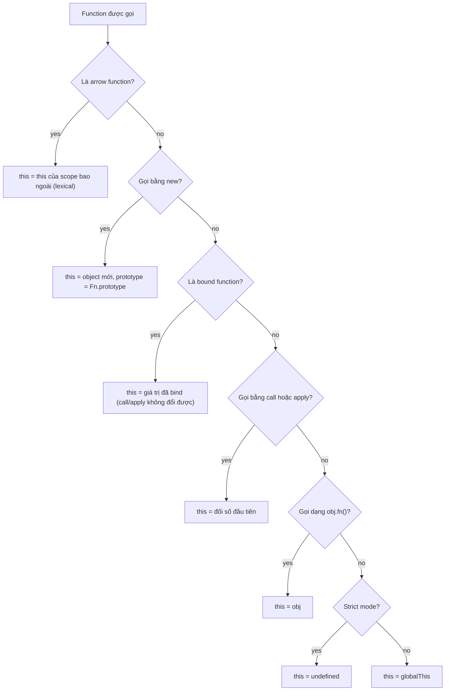

## Bối cảnh & vấn đề

Một class `Counter` có method `inc() { this.count++ }`. Một đồng nghiệp truyền nó vào timer: `setTimeout(c.inc, 1000)`. Trên browser, code ném `TypeError: Cannot read properties of undefined`. Trên Node, code **không** ném lỗi gì, nhưng `c.count` không bao giờ tăng. Cùng một dòng code, hai runtime, hai triệu chứng khác nhau, và không triệu chứng nào nói "bạn làm mất `this`".

`this` là một trong những cơ chế gây nhầm lẫn nhất của JavaScript vì nó **không** hoạt động như scope. Biến được tra theo nơi code được **viết** (lexical, xem bài [scope & closure](/tracks/javascript/learn/scope-closures)), còn `this` của một regular function được quyết định theo cách function được **gọi**. Arrow function lại theo một luật khác hẳn. Bài này đưa ra bốn luật binding theo thứ tự ưu tiên, giải thích vì sao arrow function tồn tại, khi nào nó là lựa chọn sai, và kết thúc bằng một cách gọi function đặc biệt khác: tagged template literal, nền tảng của các thư viện build SQL an toàn.

**Interview angle:** câu hỏi mở đầu thường là "bốn luật của `this`", và câu follow-up gần như luôn là "truyền `obj.method` làm callback thì sao?" hoặc "vì sao React class component cần `bind` trong constructor?".

## Khái niệm

### this là một tham số ẩn, được gán lúc gọi

Cách dễ hiểu nhất: mỗi regular function có một **tham số ẩn** tên `this`. Tham số đó không được khai báo trong danh sách tham số, và giá trị của nó do **cú pháp gọi** quyết định. `obj.fn(1)` về bản chất là `fn.call(obj, 1)`: phần đứng trước dấu chấm được truyền làm `this`. Khi bạn tách function ra khỏi object (`const f = obj.fn`), bạn chỉ lấy function, không lấy "phần đứng trước dấu chấm". Gọi `f()` sau đó không còn gì để truyền làm `this`.

Trong spec, khi gọi một function, engine chạy **OrdinaryCallBindThis**: nếu function là arrow thì bỏ qua, không bind gì. Nếu function ở strict mode, `this` là đúng giá trị được truyền (có thể là `undefined`). Nếu ở sloppy mode, `undefined`/`null` được thay bằng `globalThis`, và primitive được bọc thành object.

### Bốn luật binding theo thứ tự ưu tiên

1. **`new` binding**: `new Fn()` tạo một object mới có prototype là `Fn.prototype`, gọi `Fn` với `this` là object đó, và trả object đó (trừ khi `Fn` return một object khác). Đây là luật mạnh nhất: nó thắng cả `bind`.
2. **Explicit binding**: `fn.call(obj, ...args)`, `fn.apply(obj, argsArray)` gọi ngay với `this = obj`. `fn.bind(obj)` trả về một **bound function** mới mà `this` bị khoá vĩnh viễn là `obj`; gọi `call` hay `apply` trên bound function không đổi được `this` nữa.
3. **Implicit binding**: `obj.fn()` hoặc `obj['fn']()`, `this` là object đứng ngay trước dấu chấm cuối cùng. `a.b.c.fn()` thì `this` là `a.b.c`.
4. **Default binding**: gọi trơn `fn()`. Strict mode (mặc định trong ES module và class body): `this` là `undefined`. Sloppy mode (script thường): `this` là `globalThis` (`window` trong browser, `globalThis` trong Node CommonJS).

Arrow function **không** tham gia bốn luật này. Nó không có `this` riêng, nên tên `this` trong arrow được tra như một biến bình thường: theo **lexical scope**, lấy `this` của function thường (hoặc module/global) bao ngoài gần nhất.

**Interview angle:** red flag kinh điển là câu "`this` trỏ tới chính function đó". Không có luật nào như vậy.

### Mất this khi truyền method làm callback

Khi truyền `c.inc` vào `setTimeout`, `addEventListener`, `array.map` hay `Promise.then`, bạn truyền **function object**, không truyền `c`. Hàm nhận callback sẽ gọi nó theo cách của riêng nó, và `this` phụ thuộc vào cách đó:

- **Browser `setTimeout`**: gọi callback với `this` là `window` (với regular function ở sloppy mode). Method của class là strict, nhưng giá trị truyền vào vẫn là `window`, nên `this.count++` tạo thuộc tính `count` trên `window` (verify: hành vi theo HTML spec, `this` là `WindowProxy`). Nếu callback được gọi với `undefined`, method strict sẽ ném `TypeError`.
- **Node `setTimeout`**: gọi callback với `this` là object **`Timeout`** do Node tạo ra. `this.count++` biến `Timeout.count` từ `undefined` thành `NaN`, không lỗi, không log, chỉ sai.
- **`addEventListener`** với regular function: `this` là element đang xử lý event (`event.currentTarget`).
- **`array.map(fn)`** và các API tương tự: `this` là `undefined` trừ khi bạn truyền `thisArg`.

Class body luôn chạy ở **strict mode**, nên gọi trơn một method đã tách ra (`const { inc } = c; inc()`) cho `this = undefined` và ném `TypeError: Cannot read properties of undefined (reading 'count')`.

### Ba cách giữ this

**Wrapper arrow**: `setTimeout(() => c.inc(), 0)`. Arrow gọi lại `c.inc()` bằng implicit binding, rõ ràng và không tốn gì thêm cho mỗi instance. **`bind`**: `setTimeout(c.inc.bind(c), 0)`. Tạo một function mới mỗi lần gọi `bind`; nếu cần gỡ listener sau này, phải giữ lại đúng reference đã bind. **Arrow class field**: khai báo `inc = () => { this.count++ }` trong class. Field được khởi tạo trong constructor, arrow đóng gói `this` của instance, nên `c.inc` có thể truyền đi tự do.

Arrow class field có giá phải trả. Nó nằm **trên instance**, không nằm trên prototype: một triệu instance là một triệu function object. Subclass không gọi được `super.inc()` vì không có `inc` trên prototype cha. Và trong test, `jest.spyOn(Counter.prototype, 'inc')` không bắt được gì vì prototype không có method đó; phải spy trên từng instance.

### Arrow function khác regular function ở đâu

Arrow function (ES2015) không chỉ là cú pháp ngắn. Nó thiếu một loạt thứ mà regular function có: không có `this`, `arguments`, `super`, `new.target` riêng (tất cả đều lấy từ scope bao ngoài); không có thuộc tính `prototype`; không gọi được với `new` (`TypeError: ... is not a constructor`); `call`/`apply`/`bind` không đổi được `this` (tham số đầu bị bỏ qua).

Lý do thiết kế: trước ES2015, callback bên trong method phải viết `var self = this` hoặc `.bind(this)` để truy cập instance. Arrow giải quyết đúng trường hợp đó. Vì vậy arrow là lựa chọn **đúng** cho callback trong method, promise chain, handler React trong function component. Nó là lựa chọn **sai** cho method trên object literal cần `this` của object (`{ name: 'a', hi: () => this.name }` trả `undefined`), handler DOM cần `this === element`, function cần `arguments`, function dùng làm constructor, và method trên prototype khi bạn muốn chia sẻ và override được.

### Tagged template literal

**Template literal** (`` `Hello ${name}` ``) nối chuỗi với giá trị nội suy. Khi đặt một function ngay trước template (`` sql`...` ``), bạn có một **tagged template**: engine không nối chuỗi, mà gọi function đó với hai loại đối số tách biệt. Đối số đầu là mảng **các phần chuỗi tĩnh** (`strings`), có thêm thuộc tính `strings.raw` chứa bản chưa xử lý escape. Các đối số sau là **giá trị nội suy**, theo đúng thứ tự.

Chính sự tách biệt này làm tagged template hữu ích cho bảo mật. Thư viện SQL nhận `strings` (do lập trình viên viết, tin được) và `values` (có thể đến từ user) riêng rẽ, nên nó thay mỗi giá trị bằng placeholder `$1`, `$2` và gửi giá trị qua kênh parameter của database. Database không bao giờ parse giá trị như SQL, nên SQL injection bị chặn ở tầng giao thức. Thêm một đặc điểm: mảng `strings` là **cùng một object đông cứng** (frozen) cho mỗi call site, nên thư viện có thể dùng nó làm key để cache prepared statement.

Giới hạn quan trọng: parameter chỉ thay được **giá trị**, không thay được **identifier** (tên bảng, tên cột) hay từ khoá (`ASC`/`DESC`). `` sql`ORDER BY ${sortColumn}` `` sẽ thành `ORDER BY $1`, và Postgres sắp xếp theo một **hằng số**, tức là không sắp xếp gì cả. Không injection, nhưng cũng không đúng. Identifier động cần whitelist hoặc helper escape identifier riêng của thư viện.

**Interview angle:** câu follow-up "đồng nghiệp viết `` sql`ORDER BY ${sortColumn}` `` với input của user" kiểm tra bạn có biết parameter chỉ áp dụng cho giá trị, và cách sửa là whitelist.

## Cơ chế hoạt động

Sơ đồ quyết định giá trị `this` cho một lần gọi, theo đúng thứ tự ưu tiên:



Hai chi tiết đáng chú ý. Nút "bound function" nằm **sau** `new`: `new BoundFn()` bỏ qua giá trị đã bind và tạo object mới, vì spec định nghĩa `[[Construct]]` của bound function gọi thẳng `[[Construct]]` của function gốc. Và nút "arrow" nằm **trên cùng**: không có cách nào đổi `this` của arrow, kể cả `new` (arrow không có `[[Construct]]`) hay `call`.

Với callback, luồng thực tế là: bạn truyền function object cho một API; API lưu lại; tới lúc cần, API gọi nó bằng **một trong các nhánh trên**. Kết quả phụ thuộc vào API: Node timers dùng `call(timeoutObject)`, `EventTarget` dùng `call(currentTarget)`, `Array.prototype.map` dùng `call(thisArg)` với `thisArg` mặc định `undefined`. Bạn không kiểm soát được nhánh nào, nên cách an toàn là truyền một function không phụ thuộc vào `this` (wrapper arrow, bound function, arrow field).

## Ví dụ thực tế

### Bốn luật và thứ tự ưu tiên

Chạy dưới dạng ES module (strict mode):

```js
function who() { return this?.name ?? String(this); }
const alice = { name: 'alice', who };
const bob = { name: 'bob' };
console.log('default :', who());
console.log('implicit:', alice.who());
console.log('explicit:', alice.who.call(bob));
const bound = who.bind(bob);
console.log('bind wins over implicit:', ({ name: 'x', bound }).bound(), '| call on bound:', bound.call(alice));
function Person(name) { this.name = name; }
const BoundPerson = Person.bind({ name: 'ignored' });
console.log('new wins over bind:', new BoundPerson('carol').name);
const arrowObj = { name: 'obj', arrow: () => String(this), regular() { return [1].map(() => this.name)[0]; } };
console.log('arrow at module top:', arrowObj.arrow(), '| arrow inside method:', arrowObj.regular());
console.log('arrow ignores call:', arrowObj.arrow.call(bob));
```

```text
default : undefined
implicit: alice
explicit: bob
bind wins over implicit: bob | call on bound: bob
new wins over bind: carol
arrow at module top: undefined | arrow inside method: obj
arrow ignores call: undefined
```

`arrowObj.arrow` được viết ở module top-level, nơi `this` là `undefined` trong ESM, nên nó trả `'undefined'` dù được gọi qua `arrowObj`. Arrow bên trong `regular()` lấy `this` của `regular`, tức `arrowObj`. Nếu chạy cùng code dưới dạng CommonJS, `this` ở top-level là `module.exports` (`{}`), một khác biệt nhỏ nhưng hay gây bối rối.

### Class method làm callback trong Node

```js
class Counter {
  count = 0;
  inc() { this.count++; }
  incArrow = () => { this.count++; };
}
const c = new Counter();
const { inc } = c;
try { inc(); } catch (e) { console.log(e.constructor.name + ':', e.message); }
setTimeout(c.inc, 0);
setTimeout(c.incArrow, 0);
setTimeout(() => c.inc(), 0);
setTimeout(function () { console.log('this in timer cb:', this.constructor.name, '| stray count on Timeout:', this.count); c.inc.call(this); console.log('after:', this.count, '| c.count =', c.count); }, 1);
console.log('arrow has prototype?', 'prototype' in (() => {}), '| regular:', 'prototype' in function () {});
try { new (() => {})(); } catch (e) { console.log(e.constructor.name + ':', e.message); }
console.log('incArrow on prototype?', 'incArrow' in Counter.prototype, '| inc on prototype?', 'inc' in Counter.prototype);
```

```text
TypeError: Cannot read properties of undefined (reading 'count')
arrow has prototype? false | regular: true
TypeError: (intermediate value) is not a constructor
incArrow on prototype? false | inc on prototype? true
this in timer cb: Timeout | stray count on Timeout: undefined
after: NaN | c.count = 2
```

Dòng đầu: method tách ra, gọi trơn, class strict nên `this` là `undefined`. Ba dòng tiếp theo chạy đồng bộ. Sau đó các timer chạy: `c.inc` truyền trực tiếp đã tăng `count` trên **object `Timeout` của chính nó**, không phải `c`. Timer cuối cho thấy cơ chế: `this` trong callback là một `Timeout`, và gọi `inc` với `this` đó biến `count` thành `NaN`. `c.count` là `2`, đến từ `incArrow` và wrapper `() => c.inc()`. Lần gọi `setTimeout(c.inc, 0)` biến mất không dấu vết, đúng như bug trong ticket.

Bug tương tự trong React class component: `onClick={this.handleClick}` truyền function trần, React gọi nó không có `this`, nên phải `this.handleClick = this.handleClick.bind(this)` trong constructor hoặc khai báo `handleClick = () => {...}`. Function component với hooks không có vấn đề này vì không dùng `this`.

### Tagged template build SQL an toàn

```js
function sql(strings, ...values) {
  const text = strings.reduce((acc, s, i) => acc + s + (i < values.length ? `$${i + 1}` : ''), '');
  return { text, values };
}
const tenantId = 't_1', orderId = "42'; DROP TABLE orders; --";
console.log(sql`SELECT * FROM orders WHERE tenant_id = ${tenantId} AND id = ${orderId}`);

const seen = new Set();
function tag(strings) { seen.add(strings); return strings; }
for (let i = 0; i < 3; i++) tag`same call site ${i}`;
tag`other call site`;
const s = tag`a${1}b`;
console.log('distinct strings objects:', seen.size, '| frozen:', Object.isFrozen(s), '| raw:', tag`line\n${0}`.raw[0]);
console.log(String.raw`C:\new\table`, '|', `C:\new\table`.length);

const SORTABLE = new Set(['created_at', 'total']);
function orderBy(col, dir) {
  if (!SORTABLE.has(col)) throw new Error(`invalid sort column: ${col}`);
  return { raw: `ORDER BY "${col}" ${dir === 'desc' ? 'DESC' : 'ASC'}` };
}
console.log(sql`SELECT * FROM orders ORDER BY ${'total; DROP TABLE x'}`);
console.log(orderBy('total', 'desc'));
try { orderBy('total; DROP TABLE x'); } catch (e) { console.log(e.message); }
```

```text
{
  text: 'SELECT * FROM orders WHERE tenant_id = $1 AND id = $2',
  values: [ 't_1', "42'; DROP TABLE orders; --" ]
}
distinct strings objects: 3 | frozen: true | raw: line\n
C:\new\table | 10
{
  text: 'SELECT * FROM orders ORDER BY $1',
  values: [ 'total; DROP TABLE x' ]
}
{ raw: 'ORDER BY "total" DESC' }
invalid sort column: total; DROP TABLE x
```

Chuỗi injection nằm nguyên trong `values`, không bao giờ chạm vào `text`. Vòng lặp gọi `tag` ba lần ở **cùng một call site** chỉ tạo ra **một** object `strings` (tổng cộng 3 object cho 3 call site khác nhau), và object đó bị freeze: đó là cơ sở để cache prepared statement. `String.raw` giữ nguyên backslash (bản thường có `\n` và `\t` bị hiểu là ký tự điều khiển, còn 10 ký tự). Ví dụ `ORDER BY $1` cho thấy vì sao identifier cần whitelist: câu SQL hợp lệ nhưng vô nghĩa. Các thư viện thật như `postgres` (porsager) hay `slonik` có helper riêng cho identifier; điều cần nhớ là gọi `sql(...)` như function thường với chuỗi đã nối sẵn sẽ mất toàn bộ bảo vệ.

## Trade-offs & lựa chọn thay thế

| Cách giữ `this` cho callback | Ưu | Nhược | Dùng khi |
|---|---|---|---|
| Wrapper `() => obj.m()` | Rõ ràng, không đổi class, method vẫn trên prototype | Tạo closure mới mỗi lần viết; gỡ listener cần giữ reference | Truyền callback một lần, timer, promise |
| `obj.m.bind(obj)` | Không cần sửa class | Function mới mỗi lần bind; `removeEventListener` phải dùng đúng bản đã bind | Code cũ, API cần reference ổn định (bind một lần trong constructor) |
| Arrow class field `m = () => {}` | Truyền `obj.m` tự do, reference ổn định | Mỗi instance một function; không `super.m()`; không spy qua prototype | UI component ít instance, handler |
| Không dùng `this` (closure/factory, function component) | Không có vấn đề binding | Không có kế thừa kiểu class | Code mới theo phong cách functional |

| Regular vs arrow | Regular function | Arrow function |
|---|---|---|
| `this` | Theo cách gọi | Lexical |
| `arguments`, `new.target`, `super` | Có | Lấy từ scope ngoài |
| Dùng với `new` | Được | `TypeError` |
| `prototype` | Có | Không |
| Phù hợp | Method trên prototype, constructor, handler DOM cần element | Callback trong method, promise chain, closure ngắn |

Chọn thế nào: trong code mới, cách an toàn nhất là không phụ thuộc vào `this` ở những chỗ function bị truyền đi. Khi dùng class, giữ method trên prototype và bọc bằng arrow ở chỗ truyền callback; chỉ dùng arrow class field khi cần một reference ổn định cho subscribe/unsubscribe và số instance nhỏ. Tránh `bind` rải rác trong render vì mỗi lần tạo function mới.

## Edge cases & failure modes

- **`removeEventListener` không gỡ được**: `el.addEventListener('click', this.onClick.bind(this))` rồi `el.removeEventListener('click', this.onClick.bind(this))` là hai function khác nhau, listener cũ vẫn còn. Lưu reference đã bind, hoặc dùng `{ signal }` của `AbortController`.
- **Destructure method từ thư viện**: `const { query } = pool; await query('...')` có thể ném lỗi hoặc hành xử sai nếu `query` dùng `this` bên trong. Một số API được thiết kế để tách ra được (đã bind sẵn), số khác thì không; đọc docs hoặc gọi qua object.
- **Promise chain**: `promise.then(this.handle)` mất `this`; viết `.then((v) => this.handle(v))`.
- **Arrow trong object literal**: `const api = { base: '/v1', url: (p) => this.base + p }` trả `'undefined/users'` vì `this` là của module, không phải `api`.
- **Sloppy script cũ**: gọi trơn một function làm `this = window`, và `this.name = ...` ghi đè biến global `name`. Strict mode biến bug này thành `TypeError` sớm.
- **Getter/setter và Proxy**: trong getter, `this` là object được truy cập (hoặc receiver của Proxy/Reflect), có thể khác object định nghĩa getter khi kế thừa.
- **Tagged template với giá trị là mảng**: một số thư viện mở rộng mảng thành danh sách `$1, $2, $3` cho `IN (...)`, số khác thì truyền cả mảng làm một parameter (`= ANY($1)`). Đọc docs trước khi dùng.

## Pitfalls

- ❌ `setTimeout(obj.method, 100)` → ✅ `setTimeout(() => obj.method(), 100)`; method bị tách khỏi object sẽ nhận `this` do API quyết định (object `Timeout` trong Node).
- ❌ Khai báo method trên object literal bằng arrow → ✅ dùng method shorthand `hi() { return this.name }` khi cần `this` của object.
- ❌ Chuyển mọi method class thành arrow field "cho chắc" → ✅ chỉ dùng cho handler cần reference ổn định; phần còn lại để trên prototype để chia sẻ bộ nhớ, override và spy được.
- ❌ `bind` trong `render()` hay trong JSX mỗi lần render → ✅ bind một lần trong constructor, hoặc dùng function component.
- ❌ Nói "`this` là function chứa nó" hoặc "`this` là nơi function được khai báo" → ✅ với regular function, `this` do **cách gọi** quyết định; chỉ arrow mới lexical.
- ❌ Nội suy tên cột từ input vào `` sql`...` `` → ✅ whitelist cột hợp lệ và dùng helper identifier của thư viện.
- ❌ Build SQL bằng template literal thường rồi truyền chuỗi vào `query()` → ✅ dùng tagged template của thư viện hoặc `query(text, values)` với placeholder.

## Tóm tắt

- `this` của regular function là tham số ẩn được gán **lúc gọi**. Thứ tự ưu tiên: `new` > bound function / `call` / `apply` > `obj.fn()` > default (`undefined` ở strict, `globalThis` ở sloppy).
- Arrow function không có `this`, `arguments`, `super`, `new.target`, `prototype` riêng; không dùng được với `new`; `call/apply/bind` không đổi được `this`.
- Truyền `obj.method` làm callback là truyền function trần. Node timer gọi với `this = Timeout`, browser timer với `window`, `map` với `undefined`. Class body luôn strict.
- Sửa bằng wrapper arrow, `bind` (giữ reference để gỡ), hoặc arrow class field (tốn memory mỗi instance, không `super`, không spy qua prototype).
- Arrow đúng cho callback trong method và promise chain; sai cho method của object literal, handler cần `this === element`, constructor.
- Tagged template tách `strings` (tĩnh, frozen, cùng object cho mỗi call site) khỏi `values`, cho phép thư viện dùng placeholder và chống SQL injection. Identifier và keyword không parameter hoá được: phải whitelist.
