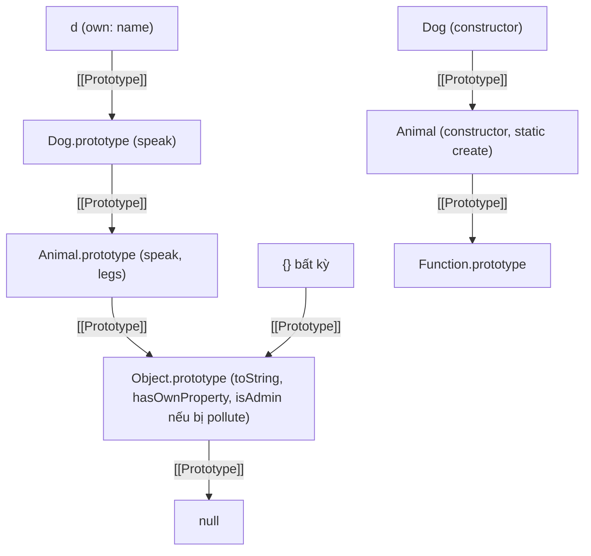

## Bối cảnh & vấn đề

Một endpoint `PATCH /tenants/:id/settings` nhận JSON và deep-merge vào object cấu hình hiện tại bằng một helper tự viết 12 dòng. Một ngày, pentest gửi body `{"__proto__": {"isAdmin": true}}`. Từ lúc đó, **mọi object** trong process Node, kể cả `{}` mới tạo, đều có `isAdmin === true`. Đoạn check `if (user.isAdmin)` ở middleware phân quyền cho mọi người đi qua, cho tới khi pod restart.

Một team khác gặp bug nhẹ nhàng hơn nhưng phổ biến hơn nhiều: reducer Redux copy state bằng `{ ...state }` rồi sửa `next.items[0].qty = 5`. State cũ bị sửa theo, component không render lại, và time-travel debugging hiện dữ liệu sai.

Hai bug có chung một gốc: object trong JavaScript liên kết với nhau bằng **reference**, cả theo chiều ngang (object chứa object) lẫn theo chiều dọc (object kế thừa từ prototype). Bài này giải thích **prototype chain** (cơ chế kế thừa thật sự của JavaScript), `class` biên dịch thành gì, sự khác nhau giữa shallow và deep copy, và vì sao merge dữ liệu không tin cậy vào object có thể đầu độc cả process. Phần `structuredClone` và giới hạn của JSON clone có ở bài [Number, JSON & Date](/tracks/javascript/learn/numbers-json-dates).

**Interview angle:** câu "class trong JS thực chất là gì" kiểm tra hiểu biết nền; câu debug merge function kiểm tra bạn có liên hệ kiến thức ngôn ngữ với bảo mật không.

## Khái niệm

### [[Prototype]] và property lookup

Mỗi object có một slot nội bộ **`[[Prototype]]`** trỏ tới một object khác, hoặc `null`. Khi bạn **đọc** `obj.x`, engine tìm `x` trong **own properties** của `obj`; không thấy thì tìm trong `[[Prototype]]` của nó, rồi prototype của prototype, cho tới khi gặp `null`. Chuỗi này gọi là **prototype chain**. Không tìm thấy ở đâu thì kết quả là `undefined`.

Đọc thì đi theo chuỗi, nhưng **ghi** thì không: `obj.x = 1` tạo (hoặc sửa) own property `x` trên chính `obj`, che khuất (**shadowing**) property cùng tên ở prototype, không đụng tới prototype. Ngoại lệ là khi prototype có setter cho `x`, hoặc có `x` là non-writable. Chính sự bất đối xứng đọc/ghi này làm prototype hữu ích: hàng triệu instance chia sẻ **một** bản method trên prototype, và mỗi instance có data riêng.

Truy cập `[[Prototype]]` bằng `Object.getPrototypeOf(obj)` / `Object.setPrototypeOf(obj, proto)`, hoặc accessor cũ `obj.__proto__` (một getter/setter định nghĩa trên `Object.prototype`, giữ lại vì tương thích web). `Object.create(proto)` tạo object mới với prototype cho trước; `Object.create(null)` tạo object **không có prototype**, không kế thừa `toString`, `hasOwnProperty` hay `__proto__`, rất hợp để làm dictionary.

### Constructor function và .prototype

Trước ES2015, "class" được viết bằng **constructor function**. Mỗi regular function có một thuộc tính thường tên `prototype` (khác với `[[Prototype]]` của chính function đó). Khi gọi `new Fn()`, engine tạo object mới có `[[Prototype]] = Fn.prototype`, gọi `Fn` với `this` là object đó, rồi trả nó về (xem luật `new` ở bài [this & functions](/tracks/javascript/learn/this-functions)). Method được gắn lên `Fn.prototype` để mọi instance dùng chung.

Hai cái tên gây nhầm lẫn: `Fn.prototype` là object sẽ làm prototype **cho instance**; còn `Object.getPrototypeOf(Fn)` là prototype **của chính function** (thường là `Function.prototype`). `instanceof` kiểm tra `Fn.prototype` có nằm trên prototype chain của object không, không kiểm tra "object được tạo bởi `Fn`".

### class là gì dưới lớp đường

`class A { constructor(x) { this.x = x } m() {} static s() {} }` về cơ bản tạo ra: một constructor function `A`, method `m` gắn lên `A.prototype`, và `s` gắn trực tiếp lên `A`. `class B extends A` nối **hai** chuỗi prototype: `B.prototype.[[Prototype]] = A.prototype` (để instance của B kế thừa method của A) **và** `B.[[Prototype]] = A` (để B kế thừa static method của A, ví dụ `B.create()`).

Nhưng `class` không chỉ là syntax sugar thuần tuý. Có những khác biệt thật: class body luôn ở **strict mode**; gọi class không có `new` ném `TypeError`; method định nghĩa trong class là **non-enumerable** (không hiện trong `for...in` hay `Object.keys` của prototype); class declaration có **TDZ** như `let`; subclass phải gọi `super()` trước khi dùng `this`, vì trong class kế thừa, object được tạo bởi constructor **cha** (điều cho phép subclass built-in như `Array`, `Error`, `Map` hoạt động đúng). Ngoài ra còn có `#private` field (private thật sự, kiểm tra bởi engine), `static` block và class field, những thứ constructor function không có tương đương trực tiếp.

**Interview angle:** trả lời "class chỉ là syntax sugar" là nửa đúng. Câu trả lời senior nêu cả phần desugar lẫn những khác biệt hành vi (strict, bắt buộc `new`, non-enumerable, TDZ, `super()` và subclass built-in).

### Thay đổi prototype lúc runtime

`Object.setPrototypeOf(obj, other)` đổi prototype của một object đã tồn tại. Spec cho phép, nhưng MDN cảnh báo rằng nó **rất chậm** trên mọi engine hiện đại. Lý do: engine tối ưu property access dựa trên giả định về hình dạng object và chuỗi prototype (hidden class và inline cache, xem bài [memory & V8](/tracks/javascript/learn/memory-gc-v8)). Đổi prototype phá vỡ các giả định đó, không chỉ cho object bị đổi mà có thể cho mọi code đã được tối ưu với chuỗi cũ. Nếu cần object với prototype cụ thể, tạo bằng `Object.create(proto)` ngay từ đầu. Sửa `Array.prototype` hay `Object.prototype` (monkey-patching built-in) còn tệ hơn: ảnh hưởng mọi code trong process, kể cả thư viện.

### Shallow copy và deep copy

**Shallow copy** tạo một object mới ở tầng đầu, nhưng các giá trị là object bên trong vẫn là **cùng reference**. Spread (`{...obj}`, `[...arr]`), `Object.assign`, `Array.prototype.slice`, `Array.from` đều là shallow. **Deep copy** tạo mới mọi tầng, không còn chia sẻ gì với bản gốc: `structuredClone` là cách chuẩn hiện nay.

Trong React và Redux, bạn thường không muốn cả hai. **Immutable update** (còn gọi là copy theo đường thay đổi, path copying) chỉ tạo mới các object nằm trên **đường** từ gốc tới chỗ bị sửa, còn mọi nhánh khác được **chia sẻ** với state cũ (**structural sharing**). Cách này rẻ (không copy cả cây) và đúng với cách React/Redux phát hiện thay đổi bằng so sánh reference: nhánh đổi có reference mới, nhánh không đổi giữ reference cũ nên component con không render lại. Immer cho phép viết code "mutate" trên một **draft** (một Proxy ghi lại thay đổi), rồi tự tạo bản immutable với structural sharing.

### const và Object.freeze

`const` chỉ chặn **gán lại binding**: `const cfg = {}; cfg.x = 1` hợp lệ, `cfg = {}` thì không. Nó không nói gì về tính bất biến của object. `Object.freeze(obj)` làm object không thêm, xoá, sửa được property, nhưng chỉ ở **một tầng**: object con vẫn sửa được. Trong strict mode, ghi vào object đã freeze ném `TypeError`; trong sloppy mode, lệnh ghi bị **bỏ qua im lặng**. Muốn freeze sâu phải đệ quy tự viết, và thường không đáng: TypeScript `readonly`/`Readonly<T>` cho phần lớn lợi ích ở compile time mà không tốn runtime.

### Prototype pollution

**Prototype pollution** là lỗ hổng khi code ghi property theo key do attacker kiểm soát, và key đó dẫn tới một prototype dùng chung. Ba con đường kinh điển: key `__proto__` (accessor trỏ tới `Object.prototype`), `constructor.prototype` (`obj.constructor` là `Object`, và `Object.prototype` là thứ bị ghi), và `prototype` trên function.

Điểm mấu chốt nằm ở `JSON.parse`. Trong **object literal**, `{ __proto__: x }` là cú pháp đặc biệt đặt prototype, không tạo property. Nhưng `JSON.parse('{"__proto__": ...}')` tạo một **own property** thật có tên `"__proto__"`. Khi một hàm merge đệ quy đọc `src['__proto__']` (own property, là object attacker gửi) rồi đọc `target['__proto__']` (không có own property, nên rơi vào accessor, trả về `Object.prototype`), nó merge dữ liệu của attacker vào `Object.prototype`. Từ đó, mọi object kế thừa property mới.

Hậu quả thực tế: bypass kiểm tra quyền (`if (user.isAdmin)`), đổi giá trị mặc định của option (`options.shell` trong `child_process`), và trong những trường hợp xấu là remote code execution qua "gadget" trong thư viện (template engine đọc một option từ prototype rồi đưa vào code sinh ra).

**Interview angle:** câu follow-up "vì sao validate schema tốt hơn vá hàm merge" chờ câu trả lời: allowlist field chặn mọi key lạ (không chỉ ba key đã biết), và bảo vệ cả những code merge khác trong thư viện mà bạn không kiểm soát.

## Cơ chế hoạt động

Sơ đồ property lookup cho `d.speak()` với `class Dog extends Animal`, và vì sao pollution ảnh hưởng mọi object:



Đọc `d.speak`: không có trên `d`, tìm thấy trên `Dog.prototype`, dừng. `super.speak()` bên trong method đó tra từ `Animal.prototype` (qua slot `[[HomeObject]]` của method), không phải từ `d`. Đọc `d.legs`: đi qua `Dog.prototype`, tìm thấy trên `Animal.prototype`. Đọc `d.isAdmin`: đi hết chuỗi tới `Object.prototype`. Nếu `Object.prototype` bị gắn `isAdmin`, mọi object, kể cả `{}` không liên quan gì tới `Dog`, đều tìm thấy nó ở cuối chuỗi. Đó là lý do một lần pollute ảnh hưởng toàn process.

Nhánh dưới của sơ đồ là chuỗi thứ hai mà `extends` tạo ra: constructor `Dog` có prototype là constructor `Animal`, nên `Dog.create('rex')` tìm thấy static method `create` trên `Animal`. Bên trong `create`, `new this(n)` dùng `this = Dog` (implicit binding), nên tạo ra một `Dog`.

Hàm merge dính pollution theo trình tự: `for...in` duyệt `src`, gặp key `"__proto__"` (own property do JSON.parse tạo). Giá trị là object, nên gọi đệ quy `merge(target['__proto__'], src['__proto__'])`. `target['__proto__']` là `Object.prototype` (accessor), nên vòng đệ quy tiếp theo ghi `isAdmin = true` thẳng lên `Object.prototype`.

## Ví dụ thực tế

### class, desugar và prototype chain

```js
class Animal { constructor(name) { this.name = name; } speak() { return `${this.name} makes a sound`; } static create(n) { return new this(n); } }
class Dog extends Animal { speak() { return `${super.speak()} (woof)`; } }
const d = Dog.create('rex');
console.log(d.speak(), '|', d instanceof Animal, Object.getPrototypeOf(d) === Dog.prototype);
console.log('instance chain:', Object.getPrototypeOf(Dog.prototype) === Animal.prototype, '| static chain:', Object.getPrototypeOf(Dog) === Animal);
console.log('own keys of d:', Object.keys(d), '| hasOwn speak:', Object.hasOwn(d, 'speak'));
try { Animal('x'); } catch (e) { console.log(e.constructor.name + ':', e.message); }
console.log('method enumerable?', Object.getOwnPropertyDescriptor(Animal.prototype, 'speak').enumerable);

function OldAnimal(name) { this.name = name; }
OldAnimal.prototype.speak = function () { return `${this.name} makes a sound`; };
function OldDog(name) { OldAnimal.call(this, name); }
Object.setPrototypeOf(OldDog.prototype, OldAnimal.prototype);
Object.setPrototypeOf(OldDog, OldAnimal);
OldDog.prototype.speak = function () { return OldAnimal.prototype.speak.call(this) + ' (woof)'; };
const od = new OldDog('rex');
console.log('desugared:', od.speak(), od instanceof OldAnimal, '| enumerable:', Object.keys(OldAnimal.prototype));
for (const k in od) console.log('for...in sees:', k);

Animal.prototype.legs = 4;
console.log('shadowing:', d.legs, (d.legs = 3, d.legs), Animal.prototype.legs, new Dog('b').legs);
const bare = Object.create(null);
console.log('null-proto:', 'toString' in bare, Object.getPrototypeOf(bare));
```

```text
rex makes a sound (woof) | true true
instance chain: true | static chain: true
own keys of d: [ 'name' ] | hasOwn speak: false
TypeError: Class constructor Animal cannot be invoked without 'new'
method enumerable? false
desugared: rex makes a sound (woof) true | enumerable: [ 'speak' ]
for...in sees: name
for...in sees: speak
shadowing: 4 3 4 4
null-proto: false null
```

Phần desugar tái tạo đúng hành vi (cả hai chuỗi prototype), nhưng lộ ra một khác biệt: method gắn bằng phép gán là **enumerable**, nên `for...in` trên instance duyệt cả `speak` kế thừa. Đây là lý do `for...in` nguy hiểm với object có prototype tuỳ biến và vì sao nên dùng `Object.keys`/`Object.entries` (chỉ own, enumerable). Dòng shadowing cho thấy gán `d.legs = 3` tạo own property trên `d`, prototype vẫn là `4`, instance khác không bị ảnh hưởng. `Object.setPrototypeOf` dùng ở đây là lúc thiết lập một lần khi định nghĩa, không phải trên hot path.

### Shallow copy, path copy và freeze

```js
const cart = { id: 'c1', items: [{ sku: 'A', qty: 1 }] };
const next = { ...cart };
next.items[0].qty = 5;
console.log('spread is shallow:', cart.items[0].qty, next.items === cart.items);
const cart2 = { id: 'c1', items: [{ sku: 'A', qty: 1 }, { sku: 'B', qty: 2 }] };
const upd = { ...cart2, items: cart2.items.map((it, i) => (i === 0 ? { ...it, qty: 5 } : it)) };
console.log('path copy:', cart2.items[0].qty, upd.items[0].qty, '| untouched shared:', upd.items[1] === cart2.items[1]);
const frozen = Object.freeze({ limits: { max: 10 } });
frozen.limits.max = 99;
console.log('freeze is shallow:', frozen.limits.max);
try { 'use strict'; frozen.limits = {}; } catch (e) { console.log(e.constructor.name + ':', e.message); }
const sorted = [3, 1, 2]; const s2 = sorted.toSorted(); console.log('toSorted:', sorted, s2);
```

```text
spread is shallow: 5 true
path copy: 1 5 | untouched shared: true
freeze is shallow: 99
TypeError: Cannot assign to read only property 'limits' of object '#<Object>'
toSorted: [ 3, 1, 2 ] [ 1, 2, 3 ]
```

Dòng đầu là đúng câu hỏi phỏng vấn: bản gốc in `5` vì `next.items` và `cart.items` là cùng một mảng. Path copy tạo mới `upd`, mảng `items` và phần tử 0, còn phần tử 1 được chia sẻ nguyên vẹn với state cũ (`untouched shared: true`), đúng cái React cần. `Object.freeze` chặn gán `limits` (file `.mjs` là strict nên ném lỗi), nhưng không chặn sửa `limits.max`. Các method mảng ES2023 `toSorted`, `toReversed`, `toSpliced`, `with` trả mảng mới thay vì mutate như `sort`, `reverse`, `splice`.

Với Immer, cùng update đó viết thành:

```ts
import { produce } from 'immer';
const upd = produce(cart2, (draft) => { draft.items[0].qty = 5; });
// cart2 không đổi; upd.items[1] === cart2.items[1]
```

### Prototype pollution và cách vá

```js
function merge(target, src) {
  for (const key in src) {
    if (typeof src[key] === 'object' && src[key] !== null) {
      target[key] ??= {};
      merge(target[key], src[key]);
    } else {
      target[key] = src[key];
    }
  }
  return target;
}
const payload = JSON.parse('{"theme":"dark","__proto__":{"isAdmin":true}}');
console.log('own keys after JSON.parse:', Object.keys(payload));
console.log('literal __proto__ is different:', Object.keys({ __proto__: { x: 1 } }));
const settings = {};
merge(settings, payload);
const user = { name: 'guest' };
console.log('polluted:', user.isAdmin, ({}).isAdmin, Object.prototype.isAdmin);
delete Object.prototype.isAdmin;

const BLOCKED = new Set(['__proto__', 'constructor', 'prototype']);
function safeMerge(target, src) {
  for (const key of Object.keys(src)) {
    if (BLOCKED.has(key)) continue;
    const v = src[key];
    if (v !== null && typeof v === 'object' && !Array.isArray(v)) {
      const t = Object.hasOwn(target, key) && typeof target[key] === 'object' ? target[key] : {};
      target[key] = safeMerge(t, v);
    } else target[key] = v;
  }
  return target;
}
safeMerge({}, payload);
safeMerge({}, JSON.parse('{"constructor":{"prototype":{"isAdmin":true}}}'));
console.log('after safeMerge:', ({}).isAdmin);
```

```text
own keys after JSON.parse: [ 'theme', '__proto__' ]
literal __proto__ is different: []
polluted: true true true
after safeMerge: undefined
$ node --disable-proto=delete -e "console.log(({}).__proto__)"
undefined
```

Hai dòng đầu chứng minh điểm mấu chốt: `JSON.parse` tạo own property `__proto__`, còn object literal thì không. Sau `merge`, một object `user` hoàn toàn không liên quan cũng có `isAdmin: true`. `safeMerge` áp dụng ba lớp: chỉ duyệt own key (`Object.keys` thay vì `for...in`), chặn ba key nguy hiểm, và chỉ đi vào object con khi `target` có **own** property đó (không rơi vào accessor của prototype). Flag `--disable-proto=delete` của Node xoá hẳn accessor `__proto__` khỏi `Object.prototype`, chặn con đường phổ biến nhất ở mức runtime (`--disable-proto=throw` thì ném lỗi khi truy cập).

Nhưng fix tốt nhất nằm ở tầng trên: validate body bằng schema với danh sách field cho phép (zod `z.object({...}).strict()`), rồi mới merge. Schema loại mọi key lạ, không phụ thuộc vào việc bạn đã nghĩ ra hết các key nguy hiểm chưa. Với dữ liệu có key động (map từ user), dùng `Map` hoặc `Object.create(null)`.

## Trade-offs & lựa chọn thay thế

| Cách cập nhật dữ liệu lồng nhau | Ưu | Nhược | Dùng khi |
|---|---|---|---|
| Mutate trực tiếp | Nhanh, ít code | Phá so sánh reference, bug state chia sẻ | Object cục bộ không ai khác giữ |
| Spread lồng tay (path copy) | Không dependency, structural sharing | Dài dòng khi lồng sâu, dễ quên một tầng | Update nông 1–2 tầng |
| Immer `produce` | Viết như mutate, structural sharing, auto-freeze khi dev | Dependency, chi phí Proxy nhỏ | Redux Toolkit (có sẵn), state lồng sâu |
| `structuredClone` rồi mutate | Đơn giản, độc lập hoàn toàn | Copy cả cây (chậm, tốn memory), mất structural sharing | Snapshot, gửi sang worker, test fixture |
| Persistent data structure (Immutable.js) | Tối ưu cho cấu trúc rất lớn | API riêng, chuyển đổi qua lại tốn kém | Hiếm, dữ liệu cực lớn thay đổi liên tục |

| Kế thừa và tái sử dụng | Ưu | Nhược |
|---|---|---|
| `class extends` | Quen thuộc, tooling tốt, subclass built-in | Kế thừa sâu cứng nhắc, liên kết chặt |
| Composition (object chứa dependency) | Linh hoạt, dễ test, dễ thay thế | Nhiều code "chuyển tiếp" hơn |
| `Object.create(proto)` | Kiểm soát trực tiếp prototype | Ít người đọc quen |
| Mixin (gán method vào prototype) | Chia sẻ hành vi ngang | Xung đột tên, khó truy vết |

Chọn thế nào: trong state UI, mặc định là immutable update; dùng Immer khi state lồng sâu hơn hai tầng (Redux Toolkit đã dùng sẵn). Chỉ deep clone khi thật sự cần một bản độc lập. Về kế thừa, giữ chuỗi `extends` nông (một hai tầng), ưu tiên composition cho logic nghiệp vụ, và không bao giờ sửa prototype của built-in.

## Edge cases & failure modes

- **`instanceof` qua realm và bản trùng thư viện**: object tạo trong iframe, `vm` context hay worker có `Array.prototype` khác, nên `arr instanceof Array` là `false`; dùng `Array.isArray`. Hai bản của cùng thư viện trong `node_modules` tạo hai class khác nhau, `instanceof` cũng sai (xem [modules](/tracks/javascript/learn/modules-esm-cjs) phần dual package hazard).
- **`hasOwnProperty` bị che hoặc không tồn tại**: object tạo bằng `Object.create(null)` không có `hasOwnProperty`, và payload `{"hasOwnProperty": 1}` làm `obj.hasOwnProperty(k)` ném lỗi. Dùng `Object.hasOwn(obj, k)` (ES2022).
- **Getter trên prototype bị spread làm mất**: spread chỉ copy own enumerable property và **gọi getter** để lấy giá trị, nên instance class copy bằng spread mất prototype, mất method, và getter bị "đông cứng" thành giá trị.
- **Pollution qua query string**: parser như `qs` hỗ trợ cú pháp lồng `?a[__proto__][x]=1`; các bản mới đã chặn, nhưng bản cũ từng có CVE. Cập nhật dependency và bật `npm audit` trong CI.
- **Freeze trong sloppy mode**: ghi vào object đã freeze bị bỏ qua im lặng, bug khó thấy. Luôn chạy code ở strict mode (ESM, class, hoặc `'use strict'`).
- **Tốc độ khi đổi shape**: thêm property vào object theo thứ tự khác nhau, `delete`, hay `setPrototypeOf` trên hot path có thể làm code chậm đi nhiều lần (xem [memory & V8](/tracks/javascript/learn/memory-gc-v8)).
- **Circular reference khi deep copy tự viết**: hàm đệ quy không theo dõi object đã thăm sẽ tràn stack. `structuredClone` xử lý được.

## Pitfalls

- ❌ `const next = { ...state }; next.items[0].qty = 5` → ✅ copy theo đường thay đổi hoặc Immer; spread chỉ là shallow copy.
- ❌ Tin `const` hoặc `Object.freeze` làm object bất biến → ✅ cả hai chỉ tác động một tầng; dùng `readonly` của TypeScript cho compile time, immutable update cho runtime.
- ❌ Deep-merge body request vào object cấu hình bằng `for...in` → ✅ validate bằng schema allowlist trước, chỉ merge own key, chặn `__proto__`/`constructor`/`prototype`, dùng `Map` hoặc `Object.create(null)` cho key động.
- ❌ `obj.hasOwnProperty(key)` → ✅ `Object.hasOwn(obj, key)`; an toàn với null-prototype object và payload che khuất method.
- ❌ `for (const i in array)` → ✅ `for...of`, `forEach` hoặc `entries()`; `for...in` duyệt key dạng string, kể cả property kế thừa enumerable.
- ❌ `Object.setPrototypeOf` hay gắn method vào `Array.prototype` lúc runtime → ✅ `Object.create` khi tạo object, hàm tiện ích thuần tuý thay vì monkey-patch.
- ❌ Nói "class chỉ là syntax sugar, không khác gì" → ✅ nêu desugar và các khác biệt: strict mode, bắt buộc `new`, method non-enumerable, TDZ, `super()` tạo `this`, `#private`.

## Tóm tắt

- Mỗi object có `[[Prototype]]`. Đọc property đi theo prototype chain tới `null`; ghi thì tạo own property và che khuất prototype.
- `class` tạo constructor function, method trên `.prototype`, static trên constructor; `extends` nối cả chuỗi instance lẫn chuỗi static. Khác biệt thật: strict, bắt buộc `new`, method non-enumerable, TDZ, `super()` trước `this`.
- `Object.setPrototypeOf` và sửa prototype built-in lúc runtime phá tối ưu của engine và ảnh hưởng toàn process.
- Spread, `Object.assign` là shallow copy. React/Redux cần immutable update theo đường thay đổi với structural sharing (Immer làm tự động). Deep copy dùng `structuredClone`.
- `const` chặn gán lại binding; `Object.freeze` chỉ freeze một tầng và bỏ qua im lặng ở sloppy mode.
- `JSON.parse` tạo own property `__proto__`. Merge đệ quy không kiểm soát sẽ ghi lên `Object.prototype` và ảnh hưởng mọi object: prototype pollution. Phòng bằng schema allowlist, own-key only, chặn key nguy hiểm, `Map`/`Object.create(null)`, `--disable-proto`.
