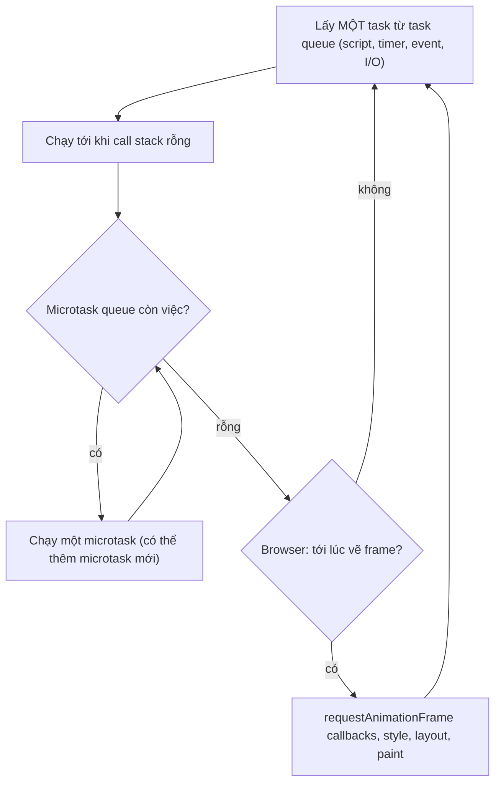

## Bối cảnh & vấn đề

Một job trong API Node xử lý 1 triệu bản ghi bằng vòng `for ... of` với `await transform(item)` bên trong. Team tin rằng vì "mọi thứ đều async", server vẫn phục vụ request khác trong lúc job chạy. Thực tế: trong 20 giây, health check timeout, load balancer đánh dấu pod là unhealthy, và mọi request khác đứng chờ. Ở frontend, một dashboard parse một file JSON 50 MB, và cả tab đơ 2 giây, nút bấm không phản hồi, spinner cũng đứng hình.

Cả hai sự cố đến từ việc hiểu sai **event loop**, cơ chế cho phép một ngôn ngữ **single-threaded** xử lý hàng nghìn kết nối đồng thời. JavaScript chỉ chạy **một** đoạn code tại một thời điểm trên một thread. Mọi thứ "bất đồng bộ" (timer, I/O, promise) thực chất là callback được **xếp hàng** và chờ tới lượt. Hiểu thứ tự các hàng đợi giúp bạn dự đoán output của các câu đố phỏng vấn, và quan trọng hơn, giúp bạn biết khi nào code của mình đang chặn toàn bộ process.

Bài này trình bày mô hình chung (theo HTML Standard, áp dụng cho browser và gần đúng cho Node), những điểm khác biệt quan trọng của Node, các giới hạn của timer, và cách xử lý việc nặng CPU. Các phase chi tiết của libuv thuộc track [Node.js Internals](/tracks/nodejs). Promise và `async/await` được đào sâu ở bài [promises & async/await](/tracks/javascript/learn/promises-async-await).

**Interview angle:** câu đố thứ tự output là cửa vào phổ biến nhất. Câu hỏi thật phía sau là "code async có thể chặn server không?", và câu trả lời đúng là **có**.

## Khái niệm

### Call stack và run-to-completion

**Call stack** là ngăn xếp các lời gọi function đang thực thi. Gọi hàm thì đẩy một frame lên, return thì lấy ra. JavaScript theo nguyên tắc **run-to-completion**: một khi một đoạn code (một **task**) bắt đầu chạy, nó chạy tới khi call stack rỗng, không có gì chen ngang được. Không có chuyện một callback timer chạy xen vào giữa vòng `for` của bạn.

Nguyên tắc này là lý do bạn không cần lock cho biến trong JavaScript thông thường: hai đoạn code không bao giờ chạy song song trên cùng dữ liệu. Nó cũng là lý do một vòng lặp dài chặn **mọi thứ**: trong lúc stack chưa rỗng, event loop không thể lấy việc tiếp theo, browser không thể vẽ lại màn hình, Node không thể nhận request mới.

### Task (macrotask) queue

**Task** (hay gọi thông dụng là **macrotask**) là một đơn vị công việc mà event loop lấy ra để chạy: script ban đầu, callback của `setTimeout`/`setInterval`, event từ người dùng (click, keypress), message từ `postMessage` hay worker, callback I/O trong Node, `setImmediate` trong Node. HTML Standard cho phép có **nhiều task queue** (ví dụ một hàng cho input người dùng, một hàng cho timer) và browser được tự chọn ưu tiên giữa chúng, nhưng trong **cùng một** queue thì thứ tự FIFO được đảm bảo.

Điểm quan trọng: mỗi vòng của event loop chỉ lấy **một** task.

### Microtask queue

**Microtask** là hàng đợi ưu tiên cao hơn, gồm callback của promise (`.then`, `.catch`, `.finally`), phần tiếp theo sau `await`, `queueMicrotask(fn)`, và `MutationObserver` trong browser. Sau khi một task kết thúc và call stack rỗng, event loop chạy **checkpoint microtask**: chạy **toàn bộ** microtask queue cho tới khi rỗng, **kể cả microtask mới được thêm vào trong lúc đang chạy**. Chỉ khi hàng này rỗng hẳn, event loop mới đi tiếp (render hoặc lấy task kế).

Thiết kế này có lý do: promise cần chạy callback "càng sớm càng tốt nhưng không đồng bộ", để trạng thái nhất quán trước khi bất kỳ event nào khác xảy ra. Hệ quả phụ là một chuỗi microtask vô tận (microtask này tạo microtask khác) sẽ **bỏ đói** (starve) mọi task và việc render.

### await là "phần còn lại của function được đẩy vào microtask"

Một `async function` chạy **đồng bộ** từ đầu cho tới `await` đầu tiên. Tại `await x`, engine bọc `x` thành promise (nếu chưa phải), đăng ký phần còn lại của function làm callback, rồi **return** ngay cho caller. Khi promise đó settle, phần còn lại được xếp vào microtask queue. `await null` hay `await` một promise đã resolve vẫn luôn nhường qua ít nhất một microtask, không bao giờ tiếp tục đồng bộ.

Vì vậy `await` **không** nhường cho timer, I/O hay render: nó chỉ nhường cho các microtask khác. Đây là chìa khoá của sự cố "vòng lặp toàn async vẫn chặn server".

### Rendering trong browser

Browser có thêm một bước **update the rendering** trong event loop: tính style, layout, paint, chạy callback `requestAnimationFrame` (rAF). Bước này xảy ra **giữa các task**, sau checkpoint microtask, và browser chỉ làm khi cần (thường tối đa một lần mỗi frame, khoảng 16,7 ms với màn hình 60 Hz). Một task chạy 200 ms nghĩa là khoảng 12 frame bị bỏ, người dùng thấy giật hoặc đơ. Metric **INP** (Interaction to Next Paint) của Core Web Vitals đo đúng độ trễ này.

### Node.js: nextTick, phases và setImmediate

Node dùng libuv, event loop chia thành các **phase**: timers → pending callbacks → poll (I/O) → check (`setImmediate`) → close callbacks. Hai điểm cần nhớ cho track này. Thứ nhất, từ Node 11, microtask (và nextTick queue) được drain **sau mỗi callback**, không phải chỉ giữa các phase, nên hành vi khớp với browser. Thứ hai, **`process.nextTick`** không phải microtask của V8: đó là một hàng đợi riêng của Node, được drain **trước** promise microtasks mỗi khi Node xử lý các hàng này. Đệ quy `nextTick` còn bỏ đói event loop tệ hơn promise.

Một chi tiết tinh tế: trong file **ESM** entry, code top-level chạy bên trong quá trình evaluate module bất đồng bộ, nên promise microtasks được drain **trước** nextTick queue; trong **CommonJS** thì nextTick chạy trước. Node docs minh hoạ đúng khác biệt này, ví dụ bên dưới đo được cả hai.

### Timer: delay tối thiểu, không phải đảm bảo

`setTimeout(fn, ms)` nghĩa là "xếp `fn` vào task queue **không sớm hơn** `ms` millisecond", không phải "chạy sau đúng `ms`". Nếu call stack bận hoặc có nhiều task phía trước, timer trễ hơn. Có thêm ba giới hạn: delay được lưu dạng **signed 32-bit**, tối đa `2^31 - 1` ms (khoảng 24,8 ngày); vượt quá thì browser coi như 0 và Node cảnh báo `TimeoutOverflowWarning` rồi đặt delay **1 ms**, tức callback chạy **gần như ngay lập tức**. Browser **clamp** timer lồng nhau: từ tầng lồng thứ 5 trở đi, delay tối thiểu 4 ms. Và tab ở nền bị throttle mạnh (tối thiểu 1 giây, có thể lâu hơn với tab ẩn lâu (verify theo browser)).

**Interview angle:** câu "`setTimeout` 30 ngày" không hỏi về số 2^31, nó hỏi về thiết kế: timer in-memory mất khi restart, nhân bản khi có nhiều pod. Trạng thái hết hạn phải nằm trong database.

## Cơ chế hoạt động

Một vòng event loop theo mô hình HTML Standard:



Diễn giải: vòng lặp lấy **một** task, chạy nó tới khi stack rỗng. Sau đó nó chạy microtask **cho tới khi hàng rỗng**: mũi tên quay về `M` cho thấy microtask mới sinh ra trong lúc drain cũng được chạy ngay trong cùng checkpoint. Chỉ khi microtask queue rỗng, browser mới có cơ hội vẽ, rồi quay lại lấy task tiếp theo. Node bỏ bước render nhưng thêm nextTick queue (drain trước promise) và chia task theo phase.

Áp dụng sơ đồ cho câu đố kinh điển:

```js
console.log('1');
setTimeout(() => console.log('2'), 0);
Promise.resolve().then(() => console.log('3'));
queueMicrotask(() => console.log('4'));
(async () => { console.log('5'); await null; console.log('6'); })();
console.log('7');
```

Task hiện tại là script: in `1`; đăng ký timer (task queue: [t2]); đăng ký p3 (microtask: [p3]); đăng ký q4 (microtask: [p3, q4]); gọi async function: in `5` đồng bộ, gặp `await null`, xếp phần còn lại (microtask: [p3, q4, a6]); in `7`. Stack rỗng → drain microtask: `3`, `4`, `6`. Microtask rỗng → lấy task tiếp: `2`. Kết quả `1 5 7 3 4 6 2`.

Câu đố thứ hai thêm microtask và timer được tạo **bên trong** microtask. Sync in `s`; microtask queue ban đầu [p1, p3]. Chạy p1: in `p1`, thêm t2 vào **cuối** timer queue (sau t1), thêm p2 vào **cuối** microtask queue ([p3, p2]). Tiếp tục drain: `p3`, rồi `p2` (microtask phải rỗng trước khi sang task). Sau đó timer theo thứ tự đăng ký: `t1`, `t2`. Kết quả `s p1 p3 p2 t1 t2`. Nếu p1 cứ tạo microtask mới mãi mãi, `t1` sẽ **không bao giờ** chạy.

## Ví dụ thực tế

### Kiểm chứng câu đố và nextTick (ESM so với CommonJS)

```js
const out = [];
const log = (x) => out.push(x);
log('1');
if (process.argv[2] === 'tick') process.nextTick(() => log('8'));
setTimeout(() => { log('2'); console.log(out.join(' ')); }, 0);
Promise.resolve().then(() => log('3'));
queueMicrotask(() => log('4'));
(async () => { log('5'); await null; log('6'); })();
log('7');
```

```text
$ node l06a.mjs
1 5 7 3 4 6 2
$ node l06a.mjs tick
1 5 7 3 4 6 8 2
$ cp l06a.mjs l06a.cjs && node l06a.cjs tick
1 5 7 8 3 4 6 2
```

Không có `nextTick`, output khớp với phân tích. Với `nextTick`: trong **CommonJS**, `8` chạy ngay sau code đồng bộ, trước mọi promise, đúng với câu "nextTick ưu tiên hơn promise". Trong **ESM**, `8` chạy **sau** các promise microtask, vì bản thân module ESM được evaluate như một phần của promise job, nên V8 drain microtask queue trước khi Node quay lại nextTick queue. Trả lời câu follow-up "thêm `process.nextTick` thì sao" một cách đầy đủ là: "trong CJS nó chạy trước `3`; trong ESM entry nó chạy sau `6`" (hành vi Node 24, verify với version bạn dùng).

Câu đố microtask lồng nhau, chạy thật:

```js
const out = [];
setTimeout(() => out.push('t1'), 0);
Promise.resolve().then(() => {
  out.push('p1');
  setTimeout(() => { out.push('t2'); console.log(out.join(' ')); }, 0);
  Promise.resolve().then(() => out.push('p2'));
});
Promise.resolve().then(() => out.push('p3'));
out.push('s');
```

```text
s p1 p3 p2 t1 t2
```

### Promise bỏ đói timer, và cách nhường đúng

Mô phỏng job xử lý 2 triệu item. `transform` là việc CPU đồng bộ bọc trong `async function`. Một `setTimeout` 10 ms đại diện cho "mọi việc khác" (request mới, health check):

```js
import { setImmediate as yieldToLoop } from 'node:timers/promises';

const items = Array.from({ length: 2_000_000 }, (_, i) => i);
const transform = async (i) => { let x = 0; for (let k = 0; k < 100; k++) x += Math.sqrt(i + k); return x; };

async function run(label, yieldEvery) {
  const t0 = performance.now();
  let timerFiredAt;
  setTimeout(() => { timerFiredAt = performance.now() - t0; }, 10);
  let n = 0;
  for (const it of items) {
    await transform(it);
    if (yieldEvery && ++n % yieldEvery === 0) await yieldToLoop();
  }
  const total = performance.now() - t0;
  await new Promise((r) => setTimeout(r, 20));
  console.log(`${label.padEnd(18)} total=${total.toFixed(0)}ms  setTimeout(10ms) fired at ${timerFiredAt.toFixed(0)}ms`);
}
await run('await only', 0);
await run('yield every 10000', 10_000);
```

```text
await only         total=328ms  setTimeout(10ms) fired at 328ms
yield every 10000  total=330ms  setTimeout(10ms) fired at 10ms
```

Với `await` thuần, timer 10 ms phải chờ tới **328 ms**, đúng bằng thời gian cả vòng lặp: 2 triệu lần `await` chỉ là 2 triệu microtask, event loop không bao giờ tới được task queue. Khi nhường bằng `setImmediate` mỗi 10.000 item, timer chạy đúng hạn ở 10 ms, và tổng thời gian gần như không đổi. `setImmediate` tạo một **task** ở check phase, nên event loop phải đi qua poll phase (I/O) và timers trước khi quay lại vòng lặp. Trong browser, tương đương là `await scheduler.yield()` (nơi hỗ trợ (verify)) hoặc `await new Promise((r) => setTimeout(r, 0))`, và nên nhường theo **thời gian** (ví dụ mỗi 5–10 ms) thay vì theo số item. Để đo trong production, dùng `perf_hooks.monitorEventLoopDelay()` và alert trên p99 event-loop lag.

### Timer 30 ngày

```js
const t0 = performance.now();
setTimeout(() => console.log(`"30-day" timer fired after ${(performance.now() - t0).toFixed(1)} ms`), 30 * 24 * 3600 * 1000);
console.log('max delay:', 2 ** 31 - 1, 'ms =', ((2 ** 31 - 1) / 86400000).toFixed(1), 'days');
```

```text
max delay: 2147483647 ms = 24.9 days
(node:37891) TimeoutOverflowWarning: 2592000000 does not fit into a 32-bit signed integer.
Timeout duration was set to 1.
(Use `node --trace-warnings ...` to show where the warning was created)
"30-day" timer fired after 2.0 ms
```

Callback "hết hạn trial" chạy sau 2 ms: mọi trial hết hạn ngay khi được tạo. Nhưng dù delay hợp lệ, thiết kế vẫn sai. Timer sống trong bộ nhớ process: deploy hay crash là mất; chạy 5 pod là 5 timer. Thiết kế đúng: lưu `trial_expires_at` trong DB, kiểm tra **lazy** khi user truy cập (`if (now > expiresAt) treatAsExpired()`), và dùng scheduler bền vững (cron quét theo index trên `expires_at`, hoặc delayed job trong queue như BullMQ, SQS delay, EventBridge Scheduler) cho side effect như gửi email. Job phải idempotent vì scheduler có thể chạy lặp.

### Việc nặng CPU: async không giúp, worker thì có

```js
import { Worker, isMainThread, parentPort, workerData } from 'node:worker_threads';
const fib = (n) => (n < 2 ? n : fib(n - 1) + fib(n - 2));
if (isMainThread) {
  const t0 = performance.now();
  let ticks = 0; const iv = setInterval(() => ticks++, 10);
  const ms = () => (performance.now() - t0).toFixed(0);
  await (async () => fib(36))();
  console.log(`inline async fib: done at ${ms()}ms, interval ticks so far: ${ticks}`);
  ticks = 0; const t1 = performance.now();
  const result = await new Promise((res, rej) => {
    const w = new Worker(new URL(import.meta.url), { workerData: 36 });
    w.once('message', res); w.once('error', rej);
  });
  console.log(`worker fib=${result}: took ${(performance.now() - t1).toFixed(0)}ms, interval ticks meanwhile: ${ticks}`);
  clearInterval(iv);
} else {
  parentPort.postMessage(fib(workerData));
}
```

```text
inline async fib: done at 153ms, interval ticks so far: 0
worker fib=14930352: took 171ms, interval ticks meanwhile: 16
```

Bọc `fib(36)` trong `async` không thay đổi gì: 153 ms trên main thread, interval 10 ms không tick lần nào. Chuyển sang worker, main thread rảnh: interval tick 16 lần trong 171 ms. Worker tốn thêm chi phí khởi động và copy dữ liệu qua `postMessage` (dùng transfer `ArrayBuffer` để tránh copy), nên trong production dùng pool (piscina) thay vì tạo worker mỗi request.

Với ví dụ JSON 50 MB, thứ tự cân nhắc là: **đo trước** (Performance tab, `node --cpu-prof`: thời gian là parse hay là GC?); **tránh việc đó** nếu được (phân trang, NDJSON, để DB tổng hợp); **stream** (parser streaming xử lý từng phần, không giữ cả cây object); **chia nhỏ** và nhường (browser: `scheduler.yield()`); **chuyển thread** (Web Worker / `worker_threads`); hoặc **đẩy ra job queue** nếu client không cần kết quả ngay.

## Trade-offs & lựa chọn thay thế

| Cách lên lịch | Loại | Chạy khi nào | Nhường cho I/O / render? | Dùng khi |
|---|---|---|---|---|
| `queueMicrotask`, `Promise.then`, `await` | Microtask | Ngay sau task hiện tại, trước mọi task khác | Không | Giữ trạng thái nhất quán, batch cập nhật trong cùng tick |
| `process.nextTick` (Node) | Hàng riêng | Trước promise microtask (CJS) | Không, còn tệ hơn | Emit event sau khi constructor return (API cũ); hạn chế dùng |
| `setTimeout(fn, 0)` | Task | Vòng sau, delay tối thiểu (browser clamp 4 ms khi lồng sâu) | Có | Nhường trong browser, hoãn việc |
| `setImmediate` (Node) | Task (check phase) | Sau poll phase của vòng hiện tại | Có | Nhường trong vòng lặp dài ở Node |
| `requestAnimationFrame` | Trước paint | Mỗi frame | Gắn với render | Animation, đo layout |
| `scheduler.yield()` / `postTask` | Task có ưu tiên | Tuỳ priority | Có | Chia nhỏ việc dài trong browser (nơi hỗ trợ) |
| Worker (Web Worker, `worker_threads`) | Thread khác | Song song thật | Main thread rảnh hoàn toàn | CPU-bound nặng: parse, nén, crypto, xử lý ảnh |
| Job queue / scheduler bền vững | Process khác | Theo lịch, sống qua restart | N/A | Việc có thời hạn dài, cần retry, nhiều instance |

Chọn thế nào: microtask cho việc cần xảy ra "ngay sau khi code hiện tại xong"; task (`setImmediate`, `setTimeout`, `scheduler.yield`) khi cần **nhường** để I/O và render chạy; worker khi việc CPU dài hơn khoảng 50 ms và không chia nhỏ được; job queue khi công việc phải sống qua deploy hoặc chạy theo lịch. `async` một mình không bao giờ biến việc CPU thành song song.

## Edge cases & failure modes

- **Microtask vô tận**: `function loop() { Promise.resolve().then(loop) }` treo tab hoặc process 100% CPU, timer và I/O không bao giờ chạy, nhưng không có stack overflow (mỗi microtask chạy trên stack rỗng). Khó phát hiện vì không có lỗi, chỉ có "đứng im".
- **Đệ quy `process.nextTick`**: bỏ đói cả promise lẫn I/O. Node docs khuyến nghị ưu tiên `queueMicrotask` cho code mới.
- **`setTimeout` vs `setImmediate` ở main module Node**: thứ tự giữa `setTimeout(fn, 0)` và `setImmediate` ở top-level **không xác định** (phụ thuộc hiệu năng process), nhưng bên trong một I/O callback thì `setImmediate` luôn chạy trước.
- **Timer trễ do GC**: một lần full GC dài chặn thread, mọi timer bị trễ theo. Metric event-loop lag tăng mà profile không thấy code của bạn: kiểm tra GC.
- **Tab nền và thiết bị di động**: `setInterval` 1 giây có thể thành 1 phút ở tab ẩn lâu hoặc khi máy tiết kiệm pin. Đồng hồ đếm ngược phải tính theo `Date.now()` hoặc `performance.now()`, không đếm số lần tick.
- **`await` trong vòng lặp tạo tuần tự ngoài ý muốn**: ngược với starvation, `for ... await fetch()` chạy từng request một, chậm N lần. Xem bài [promises](/tracks/javascript/learn/promises-async-await) về giới hạn concurrency.
- **Promise đã resolve vẫn async**: `Promise.resolve(1).then(f)` không bao giờ gọi `f` đồng bộ. Code giả định callback chạy ngay (ví dụ đọc biến được gán trong `.then` ở dòng tiếp theo) sẽ đọc giá trị cũ.

## Pitfalls

- ❌ "`setTimeout(fn, 0)` chạy ngay lập tức" → ✅ nó xếp một task, chạy sau code đồng bộ **và** sau toàn bộ microtask hiện có.
- ❌ "Mọi thứ trong async function đều bất đồng bộ" → ✅ phần trước `await` đầu tiên chạy đồng bộ; phần sau mỗi `await` là microtask.
- ❌ Bọc việc CPU nặng trong `async`/`Promise` để "không chặn" → ✅ chia nhỏ và nhường bằng task, hoặc chuyển sang worker; promise không tạo thread.
- ❌ Vòng lặp triệu item chỉ có `await` → ✅ nhường bằng `setImmediate` (Node) hoặc `scheduler.yield()`/`setTimeout` (browser) theo thời gian, và đo event-loop lag.
- ❌ `setTimeout` cho hạn dùng nhiều ngày hoặc việc phải xảy ra chắc chắn → ✅ lưu thời điểm hết hạn trong DB, kiểm tra lazy, và dùng scheduler/queue bền vững cho side effect.
- ❌ Đếm số lần `setInterval` tick để đo thời gian → ✅ tính theo `performance.now()`/`Date.now()`; interval bị trễ và bị throttle.
- ❌ Thuộc lòng "nextTick luôn trước promise" → ✅ đúng trong CommonJS; trong ESM entry, promise microtask của top-level chạy trước (Node docs có ví dụ).

## Tóm tắt

- JavaScript chạy một task tới khi call stack rỗng (run-to-completion). Không có gì chen ngang được, nên vòng lặp dài chặn mọi thứ.
- Mỗi vòng: một task (macrotask) → drain **toàn bộ** microtask (kể cả microtask mới sinh) → browser có thể render → task tiếp theo.
- Microtask: promise callback, phần sau `await`, `queueMicrotask`. Task: script, timer, event, I/O, `setImmediate`.
- `await` chỉ nhường cho microtask khác, không nhường cho timer, I/O hay render. Vòng lặp chỉ toàn `await` vẫn bỏ đói server/UI; nhường thật bằng `setImmediate`/`setTimeout`/`scheduler.yield()`.
- Node: nextTick là hàng riêng, chạy trước promise trong CJS (trong ESM entry thì ngược lại); từ Node 11 microtask drain sau mỗi callback.
- `setTimeout` là delay tối thiểu, tối đa `2^31 - 1` ms (~24,8 ngày); vượt quá thì Node đặt 1 ms. Hạn dùng dài hạn phải nằm trong DB + scheduler bền vững.
- Việc nặng CPU: đo, tránh, stream, chia nhỏ, hoặc worker. `async` không làm code CPU-bound chạy song song.
