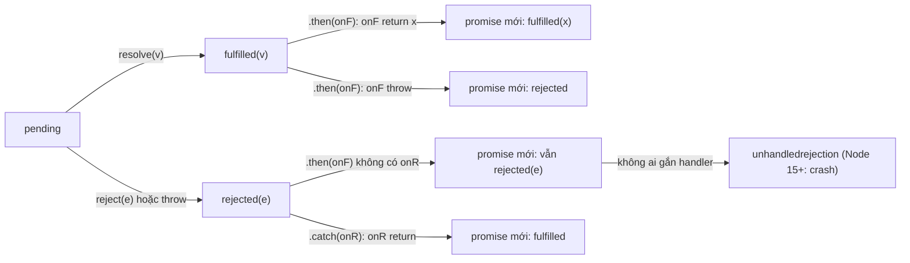

## Bối cảnh & vấn đề

Một hàm `saveAll(orders)` được viết để lưu mọi đơn hàng song song và báo lỗi. Code review thấy có `try/catch`, có `await`, có `logger.error`, nhìn rất cẩn thận. Nhưng hàm luôn trả về `[]`, caller báo "đã lưu xong" trong khi việc lưu vẫn đang chạy, và khi team bỏ `try/catch` đi để "lỗi nổi lên", process Node crash vì unhandled rejection. Thủ phạm là một chữ: `orders.forEach(async (o) => ...)`.

Một incident khác: một job gọi `Promise.all(users.map(sendEmail))` với 50.000 user. Nó mở 50.000 kết nối cùng lúc, nhà cung cấp email trả 429, pool kết nối DB cạn, và job fail-fast ở lỗi đầu tiên trong khi 49.000 request khác vẫn tiếp tục chạy ngầm.

Promise và `async/await` làm code bất đồng bộ **trông** giống code đồng bộ, và chính sự giống nhau đó che đi những khác biệt quan trọng: lỗi đi theo đường nào, cái gì được chờ và cái gì không, bao nhiêu việc đang chạy cùng lúc. Bài này xây dựng mô hình promise từ state machine, qua chaining và combinator, tới các pattern production: xử lý hàng loạt có giới hạn concurrency và chuẩn hoá code async cho cả team. Thứ tự chạy của microtask ở bài [event loop](/tracks/javascript/learn/event-loop); unhandled rejection, cancellation và error class ở bài [error handling & cancellation](/tracks/javascript/learn/errors-cancellation).

**Interview angle:** interviewer đưa một đoạn code async "trông ổn" và hỏi lỗi đi đâu. Câu trả lời mạnh chỉ ra được promise nào không được ai chờ (floating), và đề xuất cả fix lẫn rule lint.

## Khái niệm

### Promise là một state machine

**Promise** là object đại diện cho kết quả **tương lai** của một thao tác bất đồng bộ. Nó có ba trạng thái: **pending** (chưa xong), **fulfilled** (thành công, có `value`), **rejected** (thất bại, có `reason`). Fulfilled và rejected gọi chung là **settled**. Chuyển trạng thái chỉ xảy ra **một lần**: gọi `resolve` hay `reject` lần thứ hai bị bỏ qua, `throw` sau khi đã resolve cũng bị bỏ qua.

Một điều hay bị hiểu nhầm: promise **không "chạy"** gì cả. Công việc (gửi HTTP request, query DB) bắt đầu ngay khi bạn gọi hàm tạo ra promise, ví dụ `fetch(url)`. Promise chỉ là cái hộp nhận kết quả. Vì vậy `Promise.all` không "chạy song song" các promise: chúng đã chạy từ lúc được tạo, `Promise.all` chỉ **chờ** chúng. Và cũng vì vậy, không có cách nào "huỷ" một promise; muốn dừng công việc phải huỷ ở nguồn (`AbortController`).

`resolve(x)` với `x` là một promise hoặc **thenable** (object bất kỳ có method `then`) không fulfill ngay với `x`, mà **theo** trạng thái của `x`. Đó là cách promise từ các thư viện khác nhau tương thích với nhau.

### then trả về promise mới: chaining và error propagation

`p.then(onFulfilled, onRejected)` luôn trả về một **promise mới** `p2`. Trạng thái của `p2` do callback quyết định: callback return giá trị `v` thì `p2` fulfill với `v`; return một promise thì `p2` theo promise đó; **throw** thì `p2` reject. Nếu `p` reject và `then` không có `onRejected`, lỗi được **chuyển tiếp nguyên vẹn** sang `p2`. `.catch(f)` chỉ là `.then(undefined, f)`, và nếu `f` return bình thường, chuỗi **hồi phục** thành fulfilled.

Nhờ vậy, lỗi "trôi" xuống handler gần nhất, giống exception trôi lên qua call stack. Điều kiện là chuỗi không bị đứt: quên `return` một promise bên trong `.then` nghĩa là promise đó trôi nổi (**floating promise**), chuỗi bên ngoài không chờ nó và lỗi của nó không tới được `.catch` phía dưới.

### async/await

**`async function`** luôn trả về promise: `return v` thành fulfill với `v`, `throw e` thành reject với `e`, kể cả khi throw xảy ra trước `await` đầu tiên. **`await p`** tạm dừng function tới khi `p` settle: fulfill thì biểu thức có giá trị, reject thì `await` **throw** ngay tại chỗ, nên `try/catch` bắt được như lỗi đồng bộ.

Đó là điểm mấu chốt: `try/catch` chỉ bắt được lỗi của promise được **`await` bên trong `try`**. Promise được tạo ra nhưng không `await` (hoặc được `await` ở chỗ khác) thì lỗi của nó không đi qua `try` này. Về hiệu năng, từ khoảng V8 7.2 (Node 12), `await` trên native promise bỏ được các promise trung gian và microtick thừa nên rẻ hơn nhiều so với trước, và V8 có **zero-cost async stack traces** cho chuỗi `await` (verify chi tiết theo phiên bản).

### Bốn combinator

- **`Promise.all(iterable)`**: fulfill với mảng kết quả (đúng thứ tự input, không theo thứ tự hoàn thành) khi **tất cả** fulfill; reject ngay khi **một** cái reject (**fail-fast**), với lý do của cái reject đầu tiên. Dùng cho dữ liệu bắt buộc: `const [user, config] = await Promise.all([...])`.
- **`Promise.allSettled`** (ES2020): **không bao giờ reject**; chờ tất cả settle, trả mảng `{ status: 'fulfilled', value }` hoặc `{ status: 'rejected', reason }`. Dùng cho batch mà bạn muốn biết từng kết quả: gửi notification, lưu nhiều bản ghi độc lập.
- **`Promise.race`**: settle theo cái **đầu tiên settle**, kể cả reject. Dùng làm timeout wrapper (dù `AbortSignal.timeout` tốt hơn vì huỷ được công việc).
- **`Promise.any`** (ES2021): fulfill theo cái **fulfill đầu tiên**, bỏ qua các reject; chỉ reject khi **tất cả** reject, với `AggregateError` chứa mảng `errors`. Dùng cho nhiều nguồn thay thế nhau: mirror, CDN, replica.

Với cả bốn, những promise "thua" **vẫn tiếp tục chạy**. `Promise.all` reject sớm không huỷ các request khác; chúng vẫn tốn kết nối, vẫn ghi DB, và kết quả bị bỏ đi. Muốn huỷ, truyền một `AbortSignal` chung và abort khi có lỗi.

**Interview angle:** câu follow-up "request đầu fail, các request khác có bị huỷ không?" là để kiểm tra bạn biết promise không huỷ được và biết dùng `AbortController`.

### Tuần tự, song song không giới hạn, song song có giới hạn

Ba kiểu chạy một danh sách công việc bất đồng bộ. **Tuần tự** (`for ... of` + `await`): mỗi việc chờ việc trước, tổng thời gian là tổng thời gian từng việc; đúng khi bước sau phụ thuộc bước trước hoặc khi cần thứ tự nghiêm ngặt. **Song song không giới hạn** (`Promise.all(items.map(fn))`): mọi việc bắt đầu cùng lúc; nhanh với vài chục việc, nguy hiểm với hàng nghìn (cạn connection pool, bị rate limit, hết file descriptor, tốn bộ nhớ giữ mọi promise). **Song song có giới hạn** (promise pool): tối đa N việc cùng lúc, việc mới bắt đầu khi một việc xong. Đây là mặc định đúng cho batch lớn gọi DB hay API.

Promise pool có thể tự viết trong 15 dòng (ví dụ bên dưới) hoặc dùng `p-limit`, `p-map`. Chọn N theo tài nguyên chật nhất: nếu pool DB có 10 kết nối và service còn phục vụ request khác, batch job không nên chiếm hết 10.

### Chuyển callback API sang promise

Code Node cũ dùng **error-first callback**: `fn(args, (err, result) => ...)`. `util.promisify(fn)` bọc nó thành hàm trả promise; nhiều module core đã có bản promise sẵn (`node:fs/promises`, `node:timers/promises`, `node:stream/promises`). Với EventEmitter, `events.once(emitter, 'event')` trả promise cho lần emit tiếp theo. Chuẩn hoá về một phong cách (async/await) là bước đầu để lỗi đi theo một đường duy nhất.

## Cơ chế hoạt động

Vòng đời của một promise và cách lỗi đi qua chuỗi `.then/.catch`:



Diễn giải: mỗi mũi tên từ `F` hoặc `R` là một lần gọi `.then`/`.catch`, luôn sinh ra **promise mới**. Lỗi đi theo nhánh `R → N2` qua mọi `.then` không có handler lỗi, cho tới khi gặp `.catch`. Nếu cả chuỗi không có `.catch` nào, promise cuối cùng bị reject mà không có handler, và runtime phát `unhandledrejection`. Node 15+ mặc định crash process ở đây (chi tiết ở bài [error handling](/tracks/javascript/learn/errors-cancellation)).

Bug `forEach(async)` giải thích bằng sơ đồ này: `Array.prototype.forEach` gọi callback và **bỏ qua giá trị trả về**. Mỗi callback async trả về một promise, nhưng không ai giữ nó, nên `saveAll` không chờ gì, return ngay `results` (lúc đó còn rỗng). Các promise vẫn chạy, `results.push` xảy ra **sau** khi caller đã nhận `[]`. Nếu bỏ `try/catch` bên trong, promise của callback reject mà không có handler: mỗi đơn lỗi là một unhandled rejection.

Với `return promise` bên trong `try`: `return` đưa promise ra ngoài làm kết quả của async function, và `try` **kết thúc ngay** (cùng với `finally`, nếu có). Khi promise reject sau đó, không còn `try` nào bao quanh. `return await promise` thì chờ ngay trong `try`, nên reject được throw tại chỗ và `catch` bắt được, còn `finally` chỉ chạy sau khi công việc xong.

## Ví dụ thực tế

### Hành vi thật của bốn combinator

```js
const t0 = Date.now();
const task = (name, ms, fail = false) => new Promise((res, rej) => setTimeout(() => {
  console.log(`  [${String(Date.now() - t0).padStart(3)}ms] ${name} settled`);
  fail ? rej(new Error(name)) : res(name);
}, ms));
const show = async (label, p) => { try { console.log(label, '→ fulfilled:', JSON.stringify(await p, (k, v) => (v instanceof Error ? `Error(${v.message})` : v))); } catch (e) { console.log(label, '→ rejected:', e instanceof AggregateError ? `AggregateError [${e.errors.map((x) => x.message)}]` : e.message); } };

await show('all        ', Promise.all([task('a', 30), task('b', 10, true), task('c', 50)]));
await new Promise((r) => setTimeout(r, 60));
await show('allSettled ', Promise.allSettled([task('a', 10), task('b', 20, true)]));
await show('race       ', Promise.race([task('slow-ok', 30), task('fast-fail', 10, true)]));
await new Promise((r) => setTimeout(r, 30));
await show('any        ', Promise.any([task('fast-fail', 10, true), task('slow-ok', 30)]));
await show('any (all ✗)', Promise.any([task('x', 5, true), task('y', 10, true)]));
```

```text
  [ 11ms] b settled
all         → rejected: b
  [ 31ms] a settled
  [ 50ms] c settled
  [ 85ms] a settled
  [ 95ms] b settled
allSettled  → fulfilled: [{"status":"fulfilled","value":"a"},{"status":"rejected","reason":"Error(b)"}]
  [106ms] fast-fail settled
race        → rejected: fast-fail
  [126ms] slow-ok settled
  [148ms] fast-fail settled
  [167ms] slow-ok settled
any         → fulfilled: "slow-ok"
  [173ms] x settled
  [178ms] y settled
any (all ✗) → rejected: AggregateError [x,y]
```

Dòng quan trọng nhất là ba dòng đầu: `Promise.all` reject ở 11 ms, nhưng `a` và `c` **vẫn settle** ở 31 ms và 50 ms. Nếu đó là HTTP request, chúng vẫn tốn băng thông và phía server vẫn xử lý. Tương tự với `race`: `slow-ok` vẫn chạy xong ở 126 ms sau khi race đã có kết quả.

### Sửa saveAll: allSettled và promise pool tự viết

```js
const db = {
  inFlight: 0, peak: 0,
  async save(o) {
    this.inFlight++; this.peak = Math.max(this.peak, this.inFlight);
    await new Promise((r) => setTimeout(r, 5));
    this.inFlight--;
    if (o.id % 4 === 0) throw new Error(`order ${o.id} rejected`);
    return { id: o.id, ok: true };
  },
};
const orders = Array.from({ length: 8 }, (_, i) => ({ id: i + 1 }));

async function saveAllBuggy(orders) {
  const results = [];
  orders.forEach(async (o) => { try { results.push(await db.save(o)); } catch (e) { /* logger.error(e) */ } });
  return results;
}
console.log('buggy forEach returns:', await saveAllBuggy(orders));

async function saveAll(orders) {
  const settled = await Promise.allSettled(orders.map((o) => db.save(o)));
  const ok = [], failed = [];
  settled.forEach((r, i) => (r.status === 'fulfilled' ? ok.push(r.value.id) : failed.push({ id: orders[i].id, reason: r.reason.message })));
  return { ok, failed };
}
await new Promise((r) => setTimeout(r, 20));
db.peak = 0;
console.log('allSettled:', await saveAll(orders), 'peak concurrency:', db.peak);

async function mapLimit(items, limit, fn) {
  const results = new Array(items.length);
  let next = 0;
  async function worker() {
    while (next < items.length) {
      const i = next++;
      try { results[i] = { status: 'fulfilled', value: await fn(items[i], i) }; }
      catch (reason) { results[i] = { status: 'rejected', reason }; }
    }
  }
  await Promise.all(Array.from({ length: Math.min(limit, items.length) }, worker));
  return results;
}
const many = Array.from({ length: 10_000 }, (_, i) => ({ id: i + 1 }));
db.peak = 0;
const t0 = performance.now();
const res = await mapLimit(many, 20, (o) => db.save(o));
console.log('mapLimit 10k @20: failed =', res.filter((r) => r.status === 'rejected').length, 'peak =', db.peak, 'time ~', Math.round((performance.now() - t0) / 100) / 10, 's');
```

```text
buggy forEach returns: []
allSettled: {
  ok: [ 1, 2, 3, 5, 6, 7 ],
  failed: [
    { id: 4, reason: 'order 4 rejected' },
    { id: 8, reason: 'order 8 rejected' }
  ]
} peak concurrency: 8
mapLimit 10k @20: failed = 2500 peak = 20 time ~ 2.8 s
```

Bản buggy trả `[]` đúng như ticket. `allSettled` cho biết chính xác đơn nào thành công, đơn nào lỗi và vì sao, nhưng với 8 đơn thì 8 việc chạy cùng lúc (`peak concurrency: 8`); với 10.000 đơn thì sẽ là 10.000. `mapLimit` giữ đỉnh ở đúng 20. Cách nó hoạt động: tạo 20 "worker" async dùng chung biến `next`; mỗi worker lấy index tiếp theo, chờ xong, rồi lấy tiếp. Không có race condition trên `next++` vì JavaScript chạy từng đoạn tới khi gặp `await` (run-to-completion). Thời gian khoảng `10.000 / 20 × 5 ms ≈ 2,5 s` cộng overhead timer.

Chuyển sang tuần tự `for ... of` + `await` cũng "sửa" được bug, nhưng mất 10.000 × 5 ms = 50 giây: đó là red flag mà interviewer chờ bạn tự nhắc tới.

### return vs return await, finally và promisify

```js
async function f() { try { return Promise.reject(new Error('x')); } catch { return 'caught'; } }
async function g() { try { return await Promise.reject(new Error('x')); } catch { return 'caught'; } }
console.log('f():', await f().catch((e) => `rejected: ${e.message}`));
console.log('g():', await g());

const log = [];
const pool = { release: () => log.push('released') };
const query = () => new Promise((r) => setTimeout(() => { log.push('query done'); r('rows'); }, 10));
async function noAwait() { try { return query(); } finally { pool.release(); } }
async function withAwait() { try { return await query(); } finally { pool.release(); } }
await noAwait(); console.log('no await  :', log.join(' → ')); log.length = 0;
await withAwait(); console.log('with await:', log.join(' → '));

import { promisify } from 'node:util';
function legacyRead(key, cb) { setTimeout(() => (key ? cb(null, `value:${key}`) : cb(new Error('missing key'))), 1); }
const read = promisify(legacyRead);
console.log(await read('a'), '|', await read('').catch((e) => e.message));

const thenable = { then(resolve) { resolve(42); } };
console.log('await thenable:', await thenable);
const p = new Promise((res) => { res('first'); res('second'); throw new Error('ignored'); });
console.log('settles once:', await p);
```

```text
f(): rejected: x
g(): caught
no await  : released → query done
with await: query done → released
value:a | missing key
await thenable: 42
settles once: first
```

`f()` reject vì `catch` không bao giờ thấy lỗi; `g()` bắt được. Ví dụ `finally` là bug production thật: không có `await`, connection được **trả về pool trước khi query xong**. Request khác lấy connection đó và chạy query chồng lên, hoặc transaction bị commit/rollback nhầm. Rule `@typescript-eslint/return-await` với option `in-try-catch` bắt buộc `return await` bên trong `try/catch/finally` và bỏ nó ở ngoài. Ba dòng cuối minh hoạ: `promisify` chuyển error-first callback thành promise, `await` chấp nhận mọi thenable, và promise chỉ settle một lần.

### Chuẩn hoá async trong codebase lớn, và review code do AI sinh ra

Khi một codebase trộn callback, `.then` và `async/await` với cách xử lý lỗi không nhất quán, rewrite toàn bộ là rủi ro cao. Một lộ trình thực tế:

1. **Quy ước trước** (một ADR ngắn): `async/await` là mặc định; chỉ throw instance của `Error` (có `code`, `cause`); không nuốt lỗi (`catch {}` rỗng phải có comment lý do); mọi promise phải được `await`, return, hoặc gắn handler có chủ đích (`void promise.catch(log)`).
2. **Tooling enforce**: `@typescript-eslint/no-floating-promises`, `no-misused-promises` (bắt `forEach(async)`, truyền async function vào chỗ chờ void callback như `onClick` hay `setInterval`), `await-thenable`, `return-await`. Bật ở mức **warn**, đo số vi phạm, rồi chuyển **error** cho file mới hoặc file bị sửa (ratchet).
3. **Chuyển đổi dần**: `promisify` cho callback API, codemod cho pattern lặp lại, boy-scout rule ("sửa file nào, chuẩn hoá file đó"), ưu tiên module có nhiều incident nhất.
4. **Đo tiến bộ**: đếm unhandled rejection và lỗi theo module trong log/APM, để chứng minh với team rằng thay đổi có tác dụng.

Cùng checklist đó dùng để review code do AI sinh ra, vốn hay mắc đúng những lỗi này: `forEach(async)`, `Promise.all` không giới hạn trên dữ liệu lớn, `try/catch` nuốt lỗi, thiếu timeout/cancellation, check-then-act race, `||` thay cho `??`, mutate state, hoặc gọi API không tồn tại hay đã deprecated ở version runtime đang dùng. Quy tắc: yêu cầu test đi kèm, chạy lint strict trên diff, và không merge code mà người review không giải thích được.

## Trade-offs & lựa chọn thay thế

| Lựa chọn | Ưu | Nhược | Dùng khi |
|---|---|---|---|
| `await` tuần tự | Dễ đọc, stack trace rõ, tải thấp | Chậm N lần nếu các bước độc lập | Bước sau phụ thuộc bước trước; cần thứ tự |
| `Promise.all` | Song song, fail-fast, kết quả đúng thứ tự | Không giới hạn concurrency, không huỷ phần còn lại | Vài việc độc lập bắt buộc cùng thành công |
| `Promise.allSettled` | Biết từng kết quả, không reject | Phải tự tách thành công/thất bại | Batch nhỏ, mỗi phần độc lập |
| Promise pool (`mapLimit`, `p-limit`, `p-map`) | Song song có giới hạn, bảo vệ tài nguyên | Thêm code hoặc dependency | Hàng trăm tới hàng triệu việc gọi DB/API |
| `Promise.race` | Lấy kết quả đầu tiên | Không huỷ phần thua; reject cũng thắng | Timeout đơn giản (ưu tiên `AbortSignal.timeout`) |
| `Promise.any` | Bỏ qua lỗi, lấy thành công đầu tiên | Cần `AggregateError` handling | Nhiều mirror/replica tương đương |
| Callback / EventEmitter | Nhiều sự kiện theo thời gian | Lỗi không propagate, dễ leak listener | Stream, socket, event bus |
| Async iterator (`for await`) | Lazy, backpressure tự nhiên | Tuần tự mặc định | Phân trang, stream lớn (xem [iterators](/tracks/javascript/learn/iterators-generators)) |

Chọn thế nào: bắt đầu từ câu hỏi "các việc có độc lập không, và có bao nhiêu việc?". Phụ thuộc nhau thì tuần tự. Độc lập và ít (dưới vài chục), dùng `Promise.all` nếu tất cả phải thành công, `allSettled` nếu từng phần độc lập. Độc lập và nhiều, luôn giới hạn concurrency, và chọn giới hạn theo tài nguyên hẹp nhất (connection pool, rate limit của đối tác). Nếu dữ liệu lớn tới mức không nên giữ hết trong bộ nhớ, chuyển sang stream hoặc async iterator.

## Edge cases & failure modes

- **Fail-fast không huỷ**: `Promise.all` reject, nhưng các ghi DB khác vẫn chạy xong. Nếu code retry cả batch, bản ghi có thể bị ghi hai lần. Ghi phải idempotent, hoặc truyền `AbortSignal` và kiểm tra nó trước mỗi bước.
- **Unhandled rejection "tạm thời"**: tạo promise trước, gắn `.catch` sau một `await` khác. Nếu promise reject trong khoảng đó, Node có thể báo unhandled (và crash) dù sau đó handler được gắn. Gắn handler ngay, hoặc dùng `Promise.all` cho các promise chạy song song.
- **Promise không bao giờ settle**: một promise quên gọi `resolve` trong nhánh lỗi làm `await` treo vĩnh viễn, request timeout ở phía client mà server không log gì. Mọi thao tác I/O cần timeout.
- **`Promise.all` với mảng rỗng**: fulfill ngay với `[]`; `Promise.any([])` reject ngay với `AggregateError`; `Promise.race([])` pending mãi mãi.
- **Thứ tự kết quả**: `Promise.all` giữ thứ tự input, không theo thứ tự hoàn thành. Code giả định "phần tử cuối là cái xong sau cùng" sai.
- **Pool concurrency và retry**: retry bên trong worker của pool giữ slot trong lúc chờ backoff, làm giảm throughput; cân nhắc đưa việc thất bại vào hàng retry riêng.
- **`async` trong constructor hoặc getter**: constructor không thể `await`; gọi hàm async trong constructor tạo floating promise. Dùng factory `static async create()`.

## Pitfalls

- ❌ `items.forEach(async (x) => { await save(x) })` → ✅ `await Promise.all(items.map((x) => save(x)))` hoặc pool có giới hạn; `forEach` bỏ qua promise trả về.
- ❌ `items.map(async ...)` rồi quên `await Promise.all(...)` → ✅ luôn gom mảng promise bằng một combinator; lint `no-floating-promises` bắt được.
- ❌ `Promise.all` trên 50.000 phần tử → ✅ giới hạn concurrency theo tài nguyên hẹp nhất (connection pool, rate limit).
- ❌ `return promise` bên trong `try/catch` hoặc `try/finally` → ✅ `return await promise`; nếu không, `catch` không bắt được và `finally` chạy trước khi công việc xong.
- ❌ Sửa bug song song bằng `for ... of` tuần tự mà không nói gì → ✅ nêu rõ chi phí latency và chọn pool nếu các việc độc lập.
- ❌ `catch (e) {}` rỗng để "không crash" → ✅ xử lý có chủ đích: log kèm ngữ cảnh, chuyển thành lỗi nghiệp vụ, hoặc để nó propagate.
- ❌ Nghĩ `Promise.race` với timeout sẽ dừng request → ✅ nó chỉ ngừng **chờ**; dùng `AbortSignal.timeout` để thật sự huỷ.
- ❌ Viết lại toàn bộ codebase async trong một PR → ✅ quy ước, lint ratchet, codemod và boy-scout rule, đo tiến bộ bằng số lỗi thật.

## Tóm tắt

- Promise là state machine pending → fulfilled/rejected, settle đúng một lần. Promise không chạy công việc và không huỷ được; công việc bắt đầu khi hàm tạo promise được gọi.
- Mỗi `.then/.catch` trả promise mới. Lỗi trôi xuống handler gần nhất; `.catch` return bình thường thì chuỗi hồi phục. Quên `return` hoặc `await` tạo floating promise.
- `async` luôn trả promise; `await` throw khi reject, nên `try/catch` chỉ bắt lỗi của promise được await bên trong `try`.
- `all` fail-fast · `allSettled` không bao giờ reject · `race` theo cái settle đầu tiên · `any` theo cái fulfill đầu tiên, `AggregateError` nếu tất cả fail. Không combinator nào huỷ phần còn lại.
- `forEach(async)` không chờ gì. Dùng `Promise.all`/`allSettled`, và giới hạn concurrency (pool tự viết hoặc `p-limit`) cho batch lớn.
- `return await` bên trong `try/catch/finally` là bắt buộc để bắt lỗi và để `finally` chạy sau khi công việc xong.
- Chuẩn hoá code async bằng quy ước + lint (`no-floating-promises`, `no-misused-promises`, `return-await`) + chuyển đổi dần, không big-bang; dùng cùng checklist để review code do AI sinh ra.
