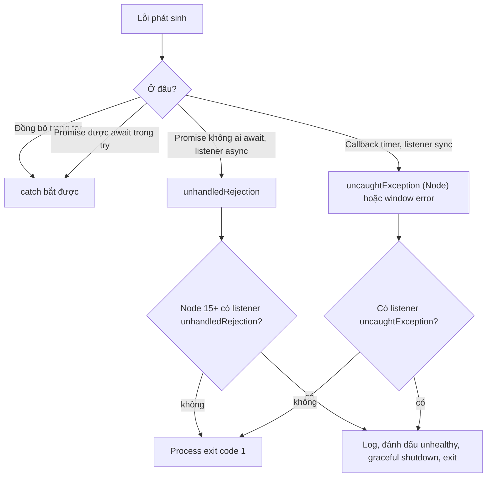
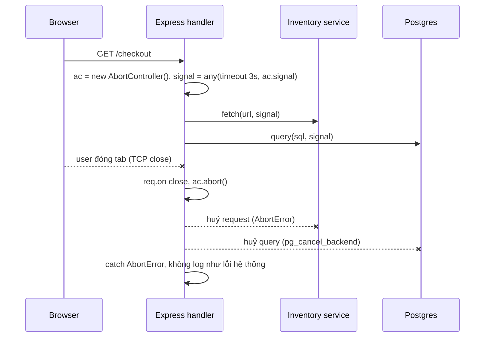

## Bối cảnh & vấn đề

Một service Node crash vài lần mỗi ngày với log `Error: out of stock` và một stack trace chỉ có hai dòng, không có handler HTTP nào trong đó. Code có `try/catch` bao quanh chỗ phát event, và reviewer đã xác nhận "lỗi được xử lý". Ở một service khác, không có gì crash, nhưng khi user đóng tab giữa chừng, server vẫn gọi ba service phía sau, chờ 8 giây, rồi ghi kết quả vào một connection đã đóng. Dưới tải, 30% công suất bị tiêu vào những request không ai chờ nữa.

Hai sự cố có chung một nguyên nhân: **lỗi và việc huỷ không tự đi theo code bất đồng bộ**. `try/catch` chỉ nhìn thấy những gì chạy đồng bộ hoặc được `await` trong phạm vi của nó. Một khi công việc được đẩy sang callback, listener hay promise không ai chờ, lỗi của nó đi đường khác, và tín hiệu "thôi, không cần nữa" cũng không tự lan tới đó. Bài này vẽ bản đồ những đường đi ấy, cách runtime phản ứng khi lỗi không ai bắt, cách thiết kế error class cho backend TypeScript, và cách propagate cancellation bằng `AbortSignal`. Nền tảng về promise ở bài [promises & async/await](/tracks/javascript/learn/promises-async-await).

**Interview angle:** interviewer thích đưa đoạn code có `try/catch` "bao hết" rồi hỏi lỗi nào thoát ra. Họ muốn nghe bạn phân loại theo cơ chế (đồng bộ, macrotask, floating promise, await), không đoán từng dòng.

## Khái niệm

### try/catch bao phủ những gì

Một khối `try` bắt được lỗi **throw trong lúc call stack của nó còn hoạt động**, cộng với lỗi của promise được **`await` bên trong nó** (vì `await` biến reject thành throw tại chỗ). Bốn trường hợp kinh điển:

1. **Throw đồng bộ** trong `try` (ví dụ `JSON.parse('{bad')`): bắt được.
2. **Throw trong callback của `setTimeout`** đăng ký bên trong `try`: **thoát**. Callback chạy ở một task sau, khi stack của `try` đã kết thúc từ lâu. Trong Node, nó thành `uncaughtException`; trong browser, thành event `error` trên `window`.
3. **Promise không được `await`** (gọi `doAsyncThing()` mà bỏ qua kết quả): **thoát**. Promise reject sau đó, không có handler, thành `unhandledRejection`.
4. **`await` một promise reject** trong `try`: bắt được.

Nguyên tắc tổng quát: `try/catch` chỉ bao phủ code chạy **đồng bộ** hoặc được **await** trong cùng async function. Lỗi trong timer callback, event listener, stream callback hay promise trôi nổi phải được xử lý **tại chỗ** (try/catch bên trong callback) hoặc được nối về một promise mà caller chờ.

### Unhandled rejection trong browser và Node

Khi một promise bị reject mà tới cuối microtask checkpoint vẫn không có handler, runtime phát tín hiệu **unhandled rejection**. Trong **browser**, đó là event `unhandledrejection` trên `window`: console in lỗi đỏ, trang vẫn chạy bình thường. Bạn có thể lắng nghe để gửi về hệ thống error tracking. Nếu sau đó handler được gắn muộn, browser phát thêm `rejectionhandled`.

Trong **Node**, hành vi do flag `--unhandled-rejections` quyết định. Từ **Node 15**, mặc định là `throw`: rejection được ném lại như một uncaught exception, nếu không có listener `unhandledRejection` thì **process thoát với exit code 1**. Trước Node 15, mặc định chỉ in cảnh báo, và rất nhiều service đã chạy nhiều năm với lỗi bị nuốt mà không ai biết. Nâng cấp Node lên 15+ vì vậy có thể làm lộ ra hàng loạt crash "mới".

### uncaughtException và vì sao "log rồi chạy tiếp" nguy hiểm

`process.on('uncaughtException', handler)` và `process.on('unhandledRejection', handler)` cho phép chặn việc crash. Node docs nói rõ: `uncaughtException` là cơ chế xử lý ngoại lệ **thô**, chỉ nên dùng để **dọn dẹp đồng bộ rồi thoát**. Lý do: khi một exception thoát ra khỏi mọi handler, bạn không biết nó xảy ra ở giữa thao tác nào. Một transaction có thể đang mở, một lock có thể chưa được nhả, một biến đếm có thể đã tăng mà công việc tương ứng chưa làm. Process tiếp tục chạy ở **trạng thái không xác định**, và bug tiếp theo sẽ khó giải thích hơn nhiều.

Cách làm đúng ở production: handler chỉ **log đầy đủ** (kèm context), đánh dấu process là unhealthy, ngừng nhận request mới, cố gắng hoàn thành request đang chạy trong một khoảng ngắn (graceful shutdown), rồi thoát. Orchestrator (Kubernetes, ECS, PM2) sẽ khởi động lại một process sạch. Crash là tín hiệu, không phải kẻ thù.

### EventEmitter và listener async

`emitter.emit(event, ...args)` gọi các listener **đồng bộ**, theo thứ tự đăng ký, và **bỏ qua giá trị trả về**. Nếu listener là `async function`, nó trả về một promise mà `emit` vứt đi. Lỗi bên trong listener trở thành promise reject không ai chờ, tức unhandled rejection, và vì nó xảy ra sau khi `emit` đã return, `try/catch` quanh `emit` không thấy gì. Stack trace thường chỉ có phần bên trong listener, không có "ai đã emit", nên rất khó lần ngược.

Node cung cấp `captureRejections` (option của constructor, hoặc `EventEmitter.captureRejections = true` toàn cục): khi bật, rejection của listener async được chuyển thành event `'error'` trên chính emitter (hoặc gọi method `Symbol.for('nodejs.rejection')` nếu có). Nhưng câu hỏi thiết kế lớn hơn là: công việc quan trọng như **giữ hàng tồn kho** có nên chạy qua event in-process không? Event in-process không bền (mất khi crash), không retry, không có backpressure, không thấy được trong monitoring. Việc quan trọng nên đi qua queue bền vững hoặc outbox pattern.

### Error class: name, code, cause

Trong một backend TypeScript, lỗi là một phần của **hợp đồng**: client cần một `code` ổn định để xử lý, log cần đủ ngữ cảnh để debug, và HTTP layer cần map lỗi thành status. Mẫu phổ biến là một lớp `AppError extends Error` với `code` (chuỗi ổn định như `ORDER_NOT_FOUND`), `status` (HTTP) và **`cause`**. `cause` (ES2022) là tham số thứ hai của `Error`: `new Error(msg, { cause: originalError })`. Nó giữ lỗi gốc khi bạn **wrap** lỗi thấp tầng thành lỗi nghiệp vụ, nên log in được cả chuỗi nguyên nhân mà không mất stack gốc.

Vài chi tiết: đặt `this.name = new.target.name` để subclass tự có `name` đúng (quan trọng cho log và cho check theo tên). Subclass `Error` với `class` giữ đúng prototype và có `stack`. Không bao giờ `throw` string hay object literal: không có stack, và `catch (e)` phía trên không biết mình đang cầm gì. Trong TypeScript, `catch (e)` có kiểu `unknown` (với `useUnknownInCatchVariables`, bật sẵn trong `strict`), nên phải thu hẹp kiểu trước khi dùng.

### Khi instanceof nói dối

`e instanceof AppError` kiểm tra `AppError.prototype` có nằm trong prototype chain của `e` không (xem bài [prototype](/tracks/javascript/learn/prototypes-objects)). Nó sai trong hai tình huống thực tế. **Hai bản của cùng thư viện**: monorepo có hai version của package định nghĩa lỗi, hoặc dual package ESM/CJS (xem bài [modules](/tracks/javascript/learn/modules-esm-cjs)), sinh ra hai class `AppError` khác nhau. **Realm khác**: lỗi tạo trong iframe, `vm` context, hay nhận qua worker (structured clone) có prototype `Error` của realm khác, nên `e instanceof Error` cũng `false`. Giải pháp bền vững là kiểm tra theo **dữ liệu** (`e.code`, `e.name`) bằng type guard, và dùng `Error.isError(e)` (proposal mới, đã có trong Node 24 (verify)) khi cần biết "có phải Error thật không".

### Cancellation: AbortController và AbortSignal

**`AbortController`** là cơ chế huỷ chuẩn của nền tảng web, và Node đã áp dụng rộng rãi. Controller có một `signal` (**`AbortSignal`**) để truyền cho các API, và method `abort(reason)`. API nhận signal (`fetch`, `fs.readFile`, `timers/promises`, `events.once`, `stream.pipeline`, driver DB hỗ trợ) sẽ dừng công việc và reject với lỗi có `name === 'AbortError'` (hoặc `reason` bạn truyền).

Ba helper tĩnh làm việc hằng ngày gọn hơn. `AbortSignal.timeout(ms)` tạo signal tự abort sau `ms`, và lỗi có `name === 'TimeoutError'` (phân biệt được với user huỷ). `AbortSignal.any([s1, s2])` gộp nhiều nguồn huỷ: timeout, request cha bị huỷ, component unmount. `AbortSignal.abort()` tạo signal đã abort sẵn. `AbortSignal.any` có trong browser hiện đại và Node 20+ (verify). Điểm quan trọng nhất: **huỷ ở client không huỷ công việc ở server** trừ khi server lắng nghe (`req.on('close')`, hoặc signal của framework) và truyền tiếp signal xuống các lời gọi phía sau.

## Cơ chế hoạt động

Sơ đồ đường đi của một lỗi, tuỳ theo nó phát sinh ở đâu:



Diễn giải: chỉ có hai nhánh trên cùng dẫn tới `catch`. Mọi nhánh khác kết thúc ở cấp process. Listener `unhandledRejection`/`uncaughtException` là **lưới an toàn cuối cùng**, không phải cơ chế xử lý lỗi: nhánh "có listener" vẫn nên kết thúc bằng thoát process. Mục tiêu thiết kế là kéo càng nhiều lỗi càng tốt về hai nhánh trên cùng, bằng cách `await` mọi promise và `try/catch` bên trong mọi callback.



Cancellation đi theo chiều ngược lại, từ ngoài vào trong. Khi client ngắt kết nối, server nhận event `close` trên request. Handler gọi `controller.abort()`. Signal đó, gộp với timeout bằng `AbortSignal.any`, đã được truyền vào mọi `fetch` tới service phía sau và vào query DB. Mỗi API nhận signal dừng công việc và reject với `AbortError`. Handler bắt lỗi đó, nhận ra đây là huỷ có chủ đích (không phải lỗi hệ thống), và không log nó như error. Nếu một chặng nào đó không nhận signal, chuỗi huỷ đứt ở đó và công việc phía dưới vẫn chạy.

## Ví dụ thực tế

### Node 15+ crash vì unhandled rejection

```js
Promise.resolve().then(() => { throw new Error('boom in then'); });
setTimeout(() => console.log('never printed'), 10);
```

```text
$ node l08a.mjs; echo "exit code: $?"
file:///.../l08a.mjs:1
Promise.resolve().then(() => { throw new Error('boom in then'); });
                                     ^

Error: boom in then
    at file:///.../l08a.mjs:1:38

Node.js v24.21.0
exit code: 1
```

Timer 10 ms không bao giờ chạy: process thoát ngay khi rejection không được xử lý. Cùng code trong browser chỉ in một dòng đỏ trong console.

### Bốn trường hợp try/catch, chạy riêng từng cái

```js
const cases = {
  1: () => JSON.parse('{bad'),
  2: () => setTimeout(() => { throw new Error('t'); }, 0),
  3: () => { Promise.reject(new Error('floating')); },
  4: async () => { await Promise.reject(new Error('a')); },
};
process.on('uncaughtException', (e) => console.log('  -> escaped as uncaughtException:', e.message));
process.on('unhandledRejection', (e) => console.log('  -> escaped as unhandledRejection:', e.message));
for (const [n, body] of Object.entries(cases)) {
  try { await body(); console.log(`(${n}) try finished without error`); }
  catch (e) { console.log(`(${n}) caught:`, e.message); }
  await new Promise((r) => setTimeout(r, 5));
}
```

```text
(1) caught: Expected property name or '}' in JSON at position 1 (line 1 column 2)
(2) try finished without error
  -> escaped as uncaughtException: t
(3) try finished without error
  -> escaped as unhandledRejection: floating
(4) caught: a
```

Trường hợp (2) và (3) cho thấy điều nguy hiểm nhất: `try` **kết thúc thành công**, code phía sau tin rằng mọi việc ổn, rồi lỗi nổ ra ở nơi khác. Trong đoạn code gốc của câu hỏi, (1) throw trước nên các dòng sau không chạy; ví dụ này tách từng dòng để thấy cơ chế riêng. Lint `@typescript-eslint/no-floating-promises` bắt được (3). Với (2), bọc logic trong callback bằng `try/catch` riêng, hoặc dùng `timers/promises` (`await setTimeout(ms)`) để công việc quay lại chuỗi await.

### EventEmitter, captureRejections và error class

```js
import { EventEmitter } from 'node:events';
import vm from 'node:vm';

process.on('unhandledRejection', (e) => console.log('unhandledRejection:', e.message));
const inventory = { reserve: async (o) => { await null; throw new Error(`out of stock: ${o.sku}`); } };

const bus = new EventEmitter();
bus.on('order.created', async (order) => { await inventory.reserve(order); });
try { bus.emit('order.created', { sku: 'A1' }); console.log('emit returned normally'); }
catch (e) { console.log('never runs', e); }
await new Promise((r) => setTimeout(r, 5));

const safeBus = new EventEmitter({ captureRejections: true });
safeBus.on('order.created', async (order) => { await inventory.reserve(order); });
safeBus.on('error', (e) => console.log("captureRejections -> 'error' event:", e.message));
safeBus.emit('order.created', { sku: 'B2' });
await new Promise((r) => setTimeout(r, 5));

class AppError extends Error {
  constructor(code, message, options = {}) {
    super(message, { cause: options.cause });
    this.name = new.target.name;
    this.code = code;
    this.status = options.status ?? 500;
  }
}
class NotFound extends AppError { constructor(what, options) { super('NOT_FOUND', `${what} not found`, { ...options, status: 404 }); } }

async function loadOrder(id) {
  try { throw new Error('connection reset by peer'); }
  catch (e) { throw new AppError('ORDER_LOAD_FAILED', `Cannot load order ${id}`, { cause: e }); }
}
try { await loadOrder(7); } catch (e) {
  console.log(e.name, e.code, e.status, '| cause:', e.cause.message, '| instanceof AppError:', e instanceof AppError);
}
const nf = new NotFound('Order');
console.log(nf.name, nf.status, nf instanceof AppError, nf instanceof NotFound, Object.prototype.toString.call(nf));

const foreign = vm.runInNewContext('new Error("from another realm")');
console.log('other realm instanceof Error:', foreign instanceof Error, '| Error.isError?', typeof Error.isError === 'function' ? Error.isError(foreign) : 'n/a');
try { throw 'just a string'; } catch (e) { console.log('thrown string has stack?', e?.stack ?? 'no stack'); }
```

```text
emit returned normally
unhandledRejection: out of stock: A1
captureRejections -> 'error' event: out of stock: B2
AppError ORDER_LOAD_FAILED 500 | cause: connection reset by peer | instanceof AppError: true
NotFound 404 true true [object Error]
other realm instanceof Error: false | Error.isError? true
thrown string has stack? no stack
```

`emit` return bình thường, rồi lỗi xuất hiện dưới dạng unhandled rejection: đúng triệu chứng của service bị crash. Với `captureRejections`, cùng lỗi đi vào handler `'error'` có kiểm soát. `AppError` giữ `cause` gốc, `name` tự đúng cho subclass nhờ `new.target`. Lỗi từ `vm` context khác không phải `instanceof Error` dù là Error thật: lý do để kiểm tra theo `code`/`name` ở ranh giới. Throw string mất stack hoàn toàn.

Ở tầng HTTP, một error middleware duy nhất map lỗi thành response, tách phần **an toàn cho client** (`code`, message nghiệp vụ, `requestId`) khỏi phần **chỉ để log** (stack, `cause`, SQL, thông tin nội bộ):

```ts
app.use((err: unknown, req: Request, res: Response, _next: NextFunction) => {
  const e = isAppError(err) ? err : new AppError('INTERNAL', 'Unexpected error', { cause: err });
  logger.error({ err: e, cause: e.cause, requestId: req.id }, e.message);   // đầy đủ, nội bộ
  res.status(e.status).json({ code: e.code, message: e.status < 500 ? e.message : 'Internal error', requestId: req.id });
});
```

### Timeout, huỷ theo request cha, retry có jitter

Một server local với endpoint chậm (500 ms) và endpoint lỗi 503 hai lần rồi mới thành công:

```js
import http from 'node:http';
let hits = 0, flakyHits = 0, serverSawClose = 0;
const server = http.createServer((req, res) => {
  hits++;
  req.on('close', () => { if (!res.writableEnded) serverSawClose++; });
  if (req.url === '/slow') return setTimeout(() => res.end('{"ok":true}'), 500);
  if (req.url === '/flaky') return ++flakyHits % 3 ? (res.writeHead(503, { 'retry-after': '0' }), res.end()) : res.end('{"ok":"third time"}');
  res.end('{"ok":true}');
});
await new Promise((r) => server.listen(0, r));
const base = `http://127.0.0.1:${server.address().port}`;

class HttpError extends Error {
  constructor(status, url, options) { super(`HTTP ${status} for ${url}`, options); this.name = 'HttpError'; this.status = status; }
}
async function getJson(url, { parent, timeoutMs = 3000 } = {}) {
  const signal = AbortSignal.any([AbortSignal.timeout(timeoutMs), ...(parent ? [parent] : [])]);
  const res = await fetch(url, { signal });
  if (!res.ok) throw new HttpError(res.status, url, { cause: { retryAfter: res.headers.get('retry-after') } });
  return res.json();
}
const sleep = (ms, signal) => new Promise((r, j) => { const t = setTimeout(r, ms); signal?.addEventListener('abort', () => { clearTimeout(t); j(signal.reason); }, { once: true }); });
async function withRetry(fn, { retries = 3, baseMs = 50, signal } = {}) {
  for (let attempt = 0; ; attempt++) {
    try { return await fn(); }
    catch (e) {
      const retryable = e.name === 'TimeoutError' || (e instanceof HttpError && (e.status >= 500 || e.status === 429));
      if (!retryable || attempt >= retries || signal?.aborted) throw e;
      const delay = Math.random() * baseMs * 2 ** attempt; // full jitter
      console.log(`  retry #${attempt + 1} after ${e.message} (sleep ${delay.toFixed(0)}ms)`);
      await sleep(delay, signal);
    }
  }
}

try { await getJson(`${base}/slow`, { timeoutMs: 100 }); } catch (e) { console.log('timeout ->', e.name, '|', e.message); }
const ac = new AbortController();
setTimeout(() => ac.abort(), 50);
try { await getJson(`${base}/slow`, { parent: ac.signal }); } catch (e) { console.log('parent abort ->', e.name); }
console.log('flaky ->', await withRetry(() => getJson(`${base}/flaky`)));
await new Promise((r) => setTimeout(r, 600));
console.log('server saw client disconnect on', serverSawClose, 'requests');
server.close();
```

```text
timeout -> TimeoutError | The operation was aborted due to timeout
parent abort -> AbortError
  retry #1 after HTTP 503 for http://127.0.0.1:63734/flaky (sleep 31ms)
  retry #2 after HTTP 503 for http://127.0.0.1:63734/flaky (sleep 15ms)
flaky -> { ok: 'third time' }
server saw client disconnect on 2 requests
```

`TimeoutError` và `AbortError` có `name` khác nhau, nên code retry phân biệt được "hết giờ" (có thể thử lại) với "người gọi đã huỷ" (không bao giờ thử lại). Retry dùng **full jitter** (delay ngẫu nhiên từ 0 tới `base × 2^attempt`), cách AWS Builders' Library khuyến nghị để tránh mọi client cùng retry một lúc. Dòng cuối là bài học quan trọng: server **thấy** client ngắt kết nối ở cả hai request, nhưng vẫn chạy `setTimeout` tới hết 500 ms vì handler không làm gì với event `close`. Muốn huỷ thật, handler phải tạo `AbortController`, gọi `abort()` trong `req.on('close')`, và truyền signal xuống mọi lời gọi phía sau.

### Thiết kế httpClient dùng chung

Từ ví dụ trên, một wrapper `httpClient` cho codebase Node/TypeScript nên có:

- **Timeout mặc định bắt buộc** (`AbortSignal.timeout`) và nhận `signal` cha để propagate cancel.
- **Retry có điều kiện**: chỉ cho request idempotent (GET, PUT, DELETE) hoặc có idempotency key; exponential backoff + jitter; tôn trọng `Retry-After`; giới hạn số lần và có **retry budget** (ví dụ retry không vượt 10% tổng request) để không khuếch đại sự cố.
- **Error typing**: phân biệt network error, timeout, HTTP 4xx, 5xx, parse error bằng class hoặc `code`, giữ `cause`.
- **Kết nối dùng lại**: một undici `Agent`/dispatcher dùng chung với keep-alive, giới hạn số kết nối mỗi origin.
- **Observability**: propagate trace header, metric latency/status theo upstream, không log body hay header nhạy cảm.

Và cố ý để **ngoài** wrapper: business logic, cache (lớp riêng), circuit breaker (có thể là lớp riêng bọc quanh), mapping DTO. Wrapper nhỏ thì dễ test: test retry và timeout một cách deterministic bằng fake timer (hoặc inject `sleep`) và một server giả trả lỗi theo kịch bản như ví dụ trên.

## Trade-offs & lựa chọn thay thế

| Chiến lược với lỗi không bắt được | Ưu | Nhược | Dùng khi |
|---|---|---|---|
| Để mặc định (Node 15+ crash) | Lỗi không bị giấu, process sạch sau restart | Mất request đang chạy nếu không có graceful shutdown | Mặc định hợp lý |
| Listener log + graceful shutdown + exit | Có log đầy đủ, request đang chạy được hoàn tất | Cần viết shutdown đúng | Production service |
| Listener log rồi chạy tiếp | Không downtime ngắn hạn | Trạng thái không xác định, bug tiếp theo khó giải thích | Không nên |
| `--unhandled-rejections=warn` | Không crash khi nâng cấp Node | Giấu lỗi, nợ kỹ thuật | Tạm thời trong lúc sửa dần |

| Cơ chế truyền lỗi | Ưu | Nhược |
|---|---|---|
| Throw `Error` subclass | Tự nhiên với try/catch, có stack | `instanceof` lỗi giữa realm/bản trùng |
| Kiểm tra theo `code`/`name` | Bền qua realm, serialize được | Cần type guard, không có kiểm tra kiểu của compiler |
| Result type (`{ ok, error }`) | Lỗi hiện trong kiểu trả về, buộc xử lý | Dài dòng, không tự nhiên với code JS hiện có |

Chọn thế nào: throw `Error` subclass có `code` và `cause` là mặc định tốt cho backend; kiểm tra theo `code` ở ranh giới (giữa package, qua worker, khi nhận từ service khác). Result type hợp cho domain logic nơi lỗi là kết quả nghiệp vụ bình thường (validation, "hết hàng"), không phải ngoại lệ. Với lỗi không bắt được, luôn log đầy đủ rồi thoát có kiểm soát.

## Edge cases & failure modes

- **Handler gắn muộn**: tạo promise, `await` một việc khác, rồi mới `await` promise đầu. Nếu nó reject trong lúc chờ, Node báo unhandled và có thể crash. Dùng `Promise.all` cho các việc song song.
- **`finally` che lỗi**: `return` hoặc `throw` bên trong `finally` ghi đè lỗi gốc. Không đặt `return` trong `finally`.
- **Listener `'error'` bị thiếu**: EventEmitter (kể cả stream) emit `'error'` mà không có listener sẽ **throw**, thường crash process. Mọi stream phải có xử lý lỗi, hoặc dùng `stream.pipeline`.
- **AbortSignal listener leak**: gắn `signal.addEventListener('abort', ...)` trên một signal sống lâu (ví dụ signal của cả process) ở mỗi request mà không gỡ sẽ tích luỹ listener; Node cảnh báo `MaxListenersExceededWarning`. Dùng `{ once: true }` và gỡ khi xong.
- **Retry không idempotent**: retry `POST /payments` khi timeout có thể trừ tiền hai lần vì request đầu có thể đã thành công ở server. Cần idempotency key.
- **Timeout ở nhiều tầng không khớp**: client timeout 3 giây nhưng server gọi downstream với timeout 10 giây; server làm việc thừa 7 giây cho mỗi request đã bị bỏ. Truyền deadline xuống (timeout còn lại), không đặt số cố định mỗi tầng.
- **Lỗi serialize qua worker/JSON**: `JSON.stringify(error)` ra `{}` vì `message` và `stack` là non-enumerable. Serialize tường minh (`{ name, message, code, stack }`) khi gửi lỗi qua mạng hay log dạng JSON.

## Pitfalls

- ❌ `try { emitter.emit('x') } catch {}` với listener async → ✅ try/catch **bên trong** listener, hoặc `captureRejections: true`, hoặc chuyển việc quan trọng sang queue bền vững.
- ❌ `process.on('uncaughtException', log)` rồi để process chạy tiếp → ✅ log, ngừng nhận request, graceful shutdown, exit để orchestrator khởi động lại.
- ❌ `throw 'not found'` hoặc `throw { code: 404 }` → ✅ throw instance `Error` (subclass) có `code`, `status`, `cause`.
- ❌ Wrap lỗi mà bỏ lỗi gốc (`throw new Error('failed')`) → ✅ `new AppError('X', 'failed', { cause: e })` để log giữ cả chuỗi nguyên nhân.
- ❌ Dựa vào `instanceof` để nhận diện lỗi từ package khác hoặc worker → ✅ type guard theo `code`/`name`.
- ❌ Dùng `Promise.race` với timer để làm timeout cho `fetch` → ✅ `AbortSignal.timeout(ms)` để request thật sự bị huỷ, và phân biệt `TimeoutError` với `AbortError`.
- ❌ Chỉ huỷ ở client → ✅ server nghe `req.on('close')`, tạo signal và truyền xuống mọi lời gọi phía sau.
- ❌ Retry mọi lỗi, không jitter, không giới hạn → ✅ chỉ retry lỗi tạm thời trên request idempotent, backoff + jitter, tôn trọng `Retry-After`, có budget.

## Tóm tắt

- `try/catch` chỉ bắt lỗi đồng bộ và lỗi của promise được `await` bên trong `try`. Lỗi trong timer callback thoát thành `uncaughtException`, promise không ai chờ thoát thành `unhandledRejection`.
- Browser: `unhandledrejection` chỉ log. Node 15+: mặc định crash với exit code 1. Listener process-level chỉ để log + graceful shutdown + exit, không để chạy tiếp.
- `emit` gọi listener đồng bộ và bỏ qua promise trả về; listener async lỗi thành unhandled rejection. Dùng try/catch trong listener, `captureRejections`, hoặc queue bền vững cho việc quan trọng.
- Error class: subclass `Error`, `name = new.target.name`, `code` ổn định, `status`, `cause` giữ lỗi gốc; một error middleware map ra HTTP, tách phần cho client và phần chỉ để log.
- `instanceof` sai với hai bản thư viện và realm khác; kiểm tra theo `code`/`name` ở ranh giới.
- `AbortController`/`AbortSignal` là cơ chế huỷ chuẩn; `AbortSignal.timeout` cho `TimeoutError`, `AbortSignal.any` gộp nguồn huỷ. Huỷ client không huỷ server nếu server không nghe và truyền signal xuống.
- httpClient dùng chung: timeout bắt buộc, retry có điều kiện với jitter và budget, error typing, kết nối dùng chung, observability; để cache và business logic ra ngoài.
