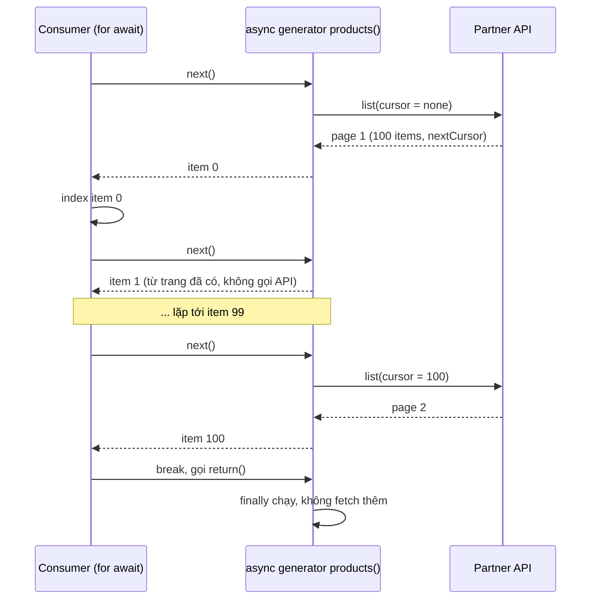

## Bối cảnh & vấn đề

Một service đồng bộ sản phẩm từ API của đối tác sang search index. Phiên bản đầu tiên gọi API lặp đi lặp lại, gom tất cả vào một mảng `allProducts`, rồi mới index. Với 5.000 sản phẩm thì ổn. Một năm sau, đối tác có 2 triệu sản phẩm: process giữ 2 triệu object trong bộ nhớ, bị OOM kill ở phút thứ 40, và mọi thứ phải chạy lại từ đầu. Ở một service khác, endpoint import CSV đọc cả file bằng `readFile`, `split('\n')`, rồi insert từng dòng. File 24 MB làm RSS nhảy lên gần 400 MB, và trong lúc parse, mọi request khác của service đứng chờ.

Cả hai đều mắc cùng một lỗi mô hình: **gom hết rồi mới xử lý**. Cách đúng là xử lý **từng phần khi nó tới**, chỉ lấy phần tiếp theo khi phần trước đã xong. JavaScript có sẵn một bộ công cụ cho mô hình này: **iteration protocol**, **generator**, **async iterator** và `for await...of`, và Node stream được xây dựng để khớp với chúng. Bài này đi từ protocol cơ bản tới các pattern production: phân trang lazy, prefetch có giới hạn, xử lý file lớn với backpressure. Phần giới hạn concurrency bằng promise pool ở bài [promises & async/await](/tracks/javascript/learn/promises-async-await); phần event loop bị chặn bởi việc CPU ở bài [event loop](/tracks/javascript/learn/event-loop).

**Interview angle:** câu hỏi "vì sao async generator tốt hơn gom mảng" chờ ba từ khoá: **lazy**, **bộ nhớ O(một trang)**, và **backpressure**. Câu hỏi CV về tối ưu xử lý CSV chờ bạn nói được bạn đo bằng gì và đổi gì trong code.

## Khái niệm

### Iteration protocol: iterable và iterator

JavaScript định nghĩa hai giao thức bằng quy ước, không bằng class. Một object là **iterable** nếu nó có method `[Symbol.iterator]()` trả về một **iterator**. Một **iterator** là object có method `next()` trả về `{ value, done }`. Mọi cú pháp tiêu thụ dữ liệu tuần tự đều dựa trên hai giao thức này: `for...of`, spread `[...x]`, destructuring `const [a, b] = x`, `Array.from`, `Promise.all`, `new Map(entries)`.

Array, String, Map, Set, `arguments`, NodeList đều là iterable có sẵn. Điểm khác biệt quan trọng với mảng: iterator là **lazy**. Nó không tính trước mọi giá trị; nó chỉ tính giá trị tiếp theo khi ai đó gọi `next()`. Vì vậy một iterator có thể biểu diễn một chuỗi **vô hạn** (mọi số tự nhiên) hoặc một chuỗi mà mỗi phần tử tốn kém (mỗi phần tử là một dòng đọc từ đĩa).

Iterator còn có thể có method tuỳ chọn **`return()`**: được gọi khi consumer dừng sớm (`break`, `return`, throw bên trong `for...of`). Đó là cơ hội để iterator dọn dẹp tài nguyên (đóng file, huỷ request).

### Generator: function tạm dừng được

Viết iterator bằng tay (quản lý state, trả `{ value, done }`) dài dòng và dễ sai. **Generator function** (`function*`) giải quyết việc này: gọi nó không chạy thân hàm, mà trả về một **generator object** vừa là iterator vừa là iterable. Mỗi lần `next()`, thân hàm chạy tới `yield` tiếp theo, **tạm dừng** tại đó và trả giá trị ra. Toàn bộ biến local được giữ nguyên giữa các lần tạm dừng.

`yield* iterable` uỷ quyền cho một iterable khác, lần lượt yield từng phần tử của nó. Khi consumer `break`, engine gọi `return()` trên generator, tương đương "chèn một lệnh `return`" tại chỗ `yield` đang dừng, nên khối **`finally`** trong generator chạy. Đây là cơ chế cleanup tự nhiên: mở tài nguyên trước vòng lặp, đóng trong `finally`, và nó đóng dù consumer đi hết hay dừng giữa chừng.

```js
function* naturals() { let n = 0; while (true) yield n++; }
const it = naturals();
it.next(); // { value: 0, done: false }
it.next(); // { value: 1, done: false }
```

### Iterator helpers

ES2025 thêm **iterator helpers**: các method `map`, `filter`, `take`, `drop`, `flatMap`, `reduce`, `toArray`, `forEach`, `some`, `every`, `find` trên `Iterator.prototype`. Khác với method của mảng, chúng **lazy**: `naturals().filter(odd).map(x10).take(3)` chỉ tính đúng đủ phần tử cần, không tạo mảng trung gian. Chúng có trong V8 từ Chrome 122 / Node 22 (verify). Với async iterator, helper tương ứng vẫn đang là proposal, nên trong code async bạn vẫn tự viết generator trung gian.

### Async iterator và for await...of

**Async iterator** giống iterator nhưng `next()` trả về **promise** của `{ value, done }`; object có `[Symbol.asyncIterator]()` là **async iterable**. **Async generator** (`async function*`) cho phép dùng cả `await` lẫn `yield` trong cùng một hàm. `for await (const x of source)` gọi `next()`, chờ promise, chạy thân vòng lặp, rồi mới gọi `next()` tiếp theo.

Chính thứ tự "chạy xong thân vòng lặp rồi mới xin phần tiếp theo" tạo ra **backpressure tự nhiên**: nếu consumer chậm (index vào search chậm), producer (gọi API trang tiếp) tự động chậm theo, vì không ai gọi `next()`. Bộ nhớ luôn chỉ giữ khoảng một trang. So với mảng: gom hết rồi xử lý tốn bộ nhớ O(tổng số phần tử) và consumer không bắt đầu được cho tới khi producer xong.

Nhược điểm đi kèm: `for await` là **tuần tự**. Trong khi consumer xử lý trang hiện tại, không có request nào lấy trang tiếp theo. Muốn chồng I/O lên xử lý, bạn tự thêm **prefetch có giới hạn** (lấy trước đúng một trang), không phải "lấy hết song song".

### Node stream là async iterable

Mọi `Readable` stream trong Node (file, HTTP request body, socket, response của `fetch` qua `Readable.fromWeb`) đều là **async iterable**: `for await (const chunk of stream)` đọc từng chunk và **tự động áp backpressure**, vì stream chỉ đọc thêm khi buffer nội bộ còn chỗ, và buffer chỉ được rút khi vòng lặp đi tiếp. `readline.createInterface({ input })` biến stream byte thành async iterable của **từng dòng**. `stream.pipeline(source, ...transforms, destination)` nối các stream, truyền lỗi và **huỷ toàn bộ chuỗi** khi một mắt xích lỗi; bản `node:stream/promises` trả promise và chấp nhận cả async generator làm transform.

**Backpressure** là tên gọi cho việc "consumer báo producer chậm lại". Không có nó, producer nhanh (đọc đĩa hàng trăm MB/s) đẩy dữ liệu vào consumer chậm (insert DB vài nghìn dòng/s), và phần chênh lệch nằm trong bộ nhớ cho tới khi OOM.

**Interview angle:** câu follow-up "prefetch trang tiếp theo mà không tốn bộ nhớ vô hạn" chờ câu trả lời "buffer có giới hạn": giữ tối đa một (hoặc N) promise trang đang bay.

## Cơ chế hoạt động

Tương tác giữa consumer `for await`, async generator và API phân trang:



Diễn giải: generator chỉ gọi API khi consumer xin phần tử mà trang hiện tại đã hết. Giữa hai lần gọi API, `next()` trả phần tử ngay từ trang đã tải (vẫn qua một microtask vì là async iterator). Khi consumer `break` ở item 249, engine gọi `return()` trên generator; generator đang dừng ở `yield`, nên `finally` chạy và không có request nào cho trang 4. Tổng cộng chỉ 3 request cho 250 phần tử, bộ nhớ chỉ giữ một trang 100 phần tử.

Với CSV, luồng tương tự nhưng ở tầng byte: `fs.createReadStream` đọc từng chunk 64 KB, `readline` cắt thành dòng, vòng `for await` parse dòng và gom batch 1.000 dòng rồi insert. Khi insert chậm, vòng lặp không gọi `next()`, `readline` không rút buffer, stream tạm dừng đọc đĩa. Bộ nhớ bị chặn trên bởi kích thước buffer và batch, không phụ thuộc kích thước file.

## Ví dụ thực tế

### Protocol, generator, cleanup và iterator helpers

```js
const range = { from: 1, to: 3, [Symbol.iterator]() { let c = this.from, t = this.to; return { next: () => (c <= t ? { value: c++, done: false } : { value: undefined, done: true }) }; } };
console.log('spread custom iterable:', [...range]);

function* ids() {
  try { let i = 0; while (true) { console.log('  produce', i); yield i++; } }
  finally { console.log('  generator finally (cleanup)'); }
}
for (const id of ids()) { if (id === 2) break; }

const it = ids();
console.log(it.next(), it.next());
console.log('return():', it.return('stop'), it.next());

function* take(n, iter) { for (const x of iter) { if (n-- <= 0) return; yield x; } }
function* naturals() { let n = 0; while (true) yield n++; }
console.log('lazy take from infinite:', [...take(5, naturals())]);
console.log('iterator helpers:', typeof Iterator !== 'undefined' && Iterator.prototype.map ? naturals().filter((n) => n % 2).map((n) => n * 10).take(3).toArray() : 'n/a');
```

```text
spread custom iterable: [ 1, 2, 3 ]
  produce 0
  produce 1
  produce 2
  generator finally (cleanup)
  produce 0
  produce 1
{ value: 0, done: false } { value: 1, done: false }
  generator finally (cleanup)
return(): { value: 'stop', done: true } { value: undefined, done: true }
lazy take from infinite: [ 0, 1, 2, 3, 4 ]
iterator helpers: [ 10, 30, 50 ]
```

Generator vô hạn chỉ sản xuất đúng 3 giá trị trước khi `break`, rồi `finally` chạy. Gọi `return()` thủ công cũng kích hoạt `finally`, và generator đã kết thúc thì `next()` luôn trả `done: true`. `take` và iterator helpers lấy 5 (hoặc 3) phần tử từ một chuỗi vô hạn mà không treo.

### Async generator cho API phân trang, và prefetch một trang

```js
const TOTAL = 1000;
let pagesFetched = 0;
const api = {
  async list({ cursor = 0, limit = 100, signal } = {}) {
    signal?.throwIfAborted();
    pagesFetched++;
    await new Promise((r) => setTimeout(r, 20)); // network latency
    const items = Array.from({ length: Math.min(limit, TOTAL - cursor) }, (_, i) => ({ id: cursor + i }));
    const next = cursor + items.length;
    return { items, nextCursor: next < TOTAL ? next : undefined };
  },
};

async function* products(client, signal) {
  let cursor;
  try {
    do {
      const page = await client.list({ cursor, limit: 100, signal });
      yield* page.items;
      cursor = page.nextCursor;
    } while (cursor !== undefined);
  } finally { console.log(`  products() finally: fetched ${pagesFetched} page(s)`); }
}

let seen = 0;
for await (const p of products(api)) { seen++; if (p.id === 249) break; }
console.log('stopped after', seen, 'items');

async function* prefetch(client) {
  let cursor, pending = client.list({ cursor, limit: 100 });
  while (pending) {
    const page = await pending;
    pending = page.nextCursor !== undefined ? client.list({ cursor: page.nextCursor, limit: 100 }) : null; // at most 1 page ahead
    yield page.items;
  }
}
const slowConsumer = () => new Promise((r) => setTimeout(r, 20));
for (const [label, gen] of [['sequential', async function* () { let c; do { const pg = await api.list({ cursor: c }); yield pg.items; c = pg.nextCursor; } while (c !== undefined); }], ['prefetch 1 page', () => prefetch(api)]]) {
  const t0 = performance.now();
  for await (const batch of gen()) await slowConsumer(batch);
  console.log(`${label.padEnd(16)} ${Math.round(performance.now() - t0)} ms`);
}
```

```text
  products() finally: fetched 3 page(s)
stopped after 250 items
sequential       421 ms
prefetch 1 page  231 ms
```

Dừng ở item 249 chỉ tốn 3 request. Phần prefetch: với 10 trang, mỗi trang mất 20 ms để tải và 20 ms để xử lý, bản tuần tự tốn khoảng `10 × (20 + 20) = 400 ms`, còn bản prefetch chồng việc tải trang `n+1` lên việc xử lý trang `n`, giảm gần một nửa. Bộ nhớ vẫn bị chặn: tại mọi thời điểm chỉ có trang đang xử lý và **một** promise trang tiếp theo. Tham số `signal` cho phép huỷ cả chuỗi khi job bị dừng (xem [cancellation](/tracks/javascript/learn/errors-cancellation)).

### CSV một triệu dòng: readFile so với stream

File `tx.csv` 24 MB, một triệu giao dịch, cứ 997 dòng có một dòng lỗi (`amount = "oops"`):

```js
import fs from 'node:fs';
import readline from 'node:readline';

const mode = process.argv[2];
const insertBatch = async (rows) => { await new Promise((r) => setImmediate(r)); return rows.length; }; // fake bulk INSERT
let ticks = 0; const sample = setInterval(() => ticks++, 10); // did the event loop stay responsive?
const t0 = performance.now();
let ok = 0; const bad = [];

if (mode === 'readFile') {
  const lines = fs.readFileSync('tx.csv', 'utf8').split('\n').slice(1).filter(Boolean);
  const rows = lines.map((l, i) => { const [id, account, amount] = l.split(','); return { line: i + 2, id: +id, account, amount: Number(amount) }; });
  for (const r of rows) Number.isFinite(r.amount) ? ok++ : bad.push(r.line);
} else {
  const rl = readline.createInterface({ input: fs.createReadStream('tx.csv'), crlfDelay: Infinity });
  let lineNo = 0, batch = [];
  for await (const line of rl) {
    if (++lineNo === 1 || !line) continue;
    const [id, account, amount] = line.split(',');
    const n = Number(amount);
    if (!Number.isFinite(n)) { bad.push(lineNo); continue; }
    batch.push({ id: +id, account, amountMinor: Math.round(n * 100) });
    if (batch.length === 1000) { ok += await insertBatch(batch); batch = []; }
  }
  if (batch.length) ok += await insertBatch(batch);
}
clearInterval(sample);
console.log(`${mode.padEnd(8)} ok=${ok} bad=${bad.length} (first bad line ${bad[0]}) time=${Math.round(performance.now() - t0)}ms maxRSS=${Math.round(process.resourceUsage().maxRSS / 1024)}MB  10ms-ticks=${ticks}`);
```

```text
$ node l09c.mjs readFile
readFile ok=998997 bad=1003 (first bad line 998) time=378ms maxRSS=383MB  10ms-ticks=0
$ node l09c.mjs stream
stream   ok=998997 bad=1003 (first bad line 998) time=405ms maxRSS=83MB  10ms-ticks=40
```

Tổng thời gian gần như bằng nhau, nhưng hai chỉ số khác biệt lớn. **Bộ nhớ**: bản `readFile` cần 383 MB cho file 24 MB (chuỗi gốc, mảng một triệu chuỗi con, mảng một triệu object), bản stream 83 MB và không tăng theo kích thước file. **Độ phản hồi**: interval 10 ms không tick lần nào trong bản `readFile`, nghĩa là suốt gần 400 ms service không phục vụ được request nào; bản stream tick 40 lần vì mỗi batch insert nhường event loop. Với file 2 triệu dòng của production, bản `readFile` sẽ cần gần 800 MB và chặn gần một giây.

Trong code thật, bạn thay `split(',')` bằng một CSV parser streaming (xử lý đúng dấu ngoặc kép, dấu phẩy trong giá trị) nối qua `pipeline`, và thay `insertBatch` bằng bulk insert hoặc `COPY`. Cách xử lý dòng lỗi là một quyết định nghiệp vụ cần nói rõ khi phỏng vấn: **abort** cả file (giao dịch tài chính cần all-or-nothing, dùng staging table rồi swap), **skip và báo cáo** (ghi lại số dòng và lý do, trả về cho người upload), hoặc **commit từng phần** có checkpoint để resume. Nếu client không cần kết quả ngay, nhận file, lưu vào object storage, trả `202 Accepted` với job id, và xử lý trong worker hoặc job queue.

**Interview angle:** câu chuyện tối ưu CSV mạnh gồm: triệu chứng có số (thời gian, RSS, event-loop lag, API khác chậm theo), nguyên nhân (đọc cả file, parse đồng bộ, insert từng dòng, `Promise.all` không giới hạn), thay đổi (stream + batch + giới hạn concurrency hoặc job queue), và cách kiểm chứng (benchmark trước/sau với file lớn nhất thực tế).

## Trade-offs & lựa chọn thay thế

| Cách duyệt dữ liệu | Bộ nhớ | Backpressure | Song song | Dùng khi |
|---|---|---|---|---|
| Gom mảng rồi xử lý | O(tổng) | Không | Tuỳ ý sau khi gom | Dữ liệu nhỏ, cần sort/group toàn bộ |
| Generator đồng bộ | O(1) | Có (pull) | Không | Chuỗi lazy, vô hạn, pipeline tính toán |
| Async generator + `for await` | O(một trang) | Có, tự nhiên | Không (tuần tự) | Phân trang API, đọc file theo dòng |
| Async generator + prefetch N | O(N trang) | Có, có giới hạn | Chồng I/O với xử lý | Consumer và producer cùng chậm |
| Stream + `pipeline` | O(highWaterMark) | Có, native | Transform nối tiếp | File, HTTP body, nén, CSV/NDJSON lớn |
| Promise pool trên danh sách có sẵn | O(tổng) cho danh sách | Giới hạn concurrency | N việc cùng lúc | Danh sách đã biết, mỗi việc độc lập |
| Job queue (BullMQ, SQS) | Ngoài process | Qua queue | Nhiều worker | Việc dài, cần retry, không chặn request |

Chọn thế nào: nếu dữ liệu có thể lớn hơn bộ nhớ hoặc không biết trước kích thước, đừng gom mảng. Với nguồn phân trang, async generator là mặc định, thêm prefetch một trang khi cả hai phía đều có độ trễ. Với byte (file, network), dùng stream và `pipeline` để có backpressure và lan truyền lỗi đúng. Khi mỗi phần tử cần một lời gọi I/O độc lập, kết hợp async iterator với promise pool (lấy từng batch, xử lý batch với concurrency giới hạn). Khi công việc dài hơn thời gian một request nên chờ, chuyển sang job queue.

## Edge cases & failure modes

- **Quên `break` cleanup với iterator tự viết**: iterator viết tay không có `return()` sẽ không dọn dẹp khi consumer dừng sớm (file handle mở, request tiếp tục). Generator tự có `return()`; iterator tay phải tự cài.
- **Lỗi trong consumer**: throw trong thân `for await` gọi `return()` trên iterator (cleanup chạy), rồi lỗi propagate. Nhưng một stream nguồn không đi qua `pipeline` có thể không bị destroy đúng; dùng `pipeline` hoặc `stream.finished`.
- **Generator dùng lại**: generator object chỉ duyệt được **một lần**; spread lần hai ra mảng rỗng. Muốn duyệt lại, gọi lại generator function.
- **Cursor không ổn định**: phân trang bằng `offset` trên dữ liệu đang thay đổi bỏ sót hoặc trùng phần tử; dùng cursor dựa trên khoá sắp xếp ổn định (keyset pagination).
- **Dòng CSV bị cắt ngang chunk và ký tự UTF-8 nhiều byte**: tự `split` trên chunk thô cắt đôi dòng hoặc ký tự tiếng Việt; `readline` và parser CSV xử lý đúng ranh giới. CRLF từ file Windows cần `crlfDelay: Infinity`.
- **Batch cuối và dòng lỗi**: quên flush batch cuối làm mất vài trăm dòng cuối file; lưu `bad` vô hạn trong bộ nhớ khi file toàn lỗi; giới hạn số lỗi ghi nhận và abort khi vượt ngưỡng.
- **Prefetch không giới hạn**: "tải trước tất cả trang" trong một vòng lặp không `await` đưa bạn quay về bài toán gom mảng, cộng thêm rủi ro bị rate limit.
- **`for await` trên mảng promise**: `for await (const x of [p1, p2])` chờ lần lượt theo thứ tự mảng, và nếu `p2` reject trước khi tới lượt, đó có thể là unhandled rejection. Dùng `Promise.all`/`allSettled` cho mảng promise.

## Pitfalls

- ❌ Gom mọi trang API vào một mảng rồi mới xử lý → ✅ async generator yield từng trang/phần tử; consumer xử lý khi dữ liệu tới.
- ❌ `fs.readFile` + `split('\n')` cho file tải lên → ✅ `createReadStream` + `readline` hoặc CSV parser streaming qua `pipeline`, batch insert.
- ❌ Insert từng dòng (một round-trip mỗi dòng) → ✅ bulk insert theo batch 500–5.000 dòng hoặc `COPY`.
- ❌ `Promise.all(rows.map(insert))` cho cả file → ✅ batch tuần tự hoặc pool có giới hạn theo connection pool.
- ❌ Tin rằng `for await` tự chạy song song → ✅ nó tuần tự; thêm prefetch có giới hạn nếu cần chồng I/O.
- ❌ Mở tài nguyên trong generator mà không có `finally` → ✅ `try/finally` quanh vòng `yield` để cleanup khi consumer `break`.
- ❌ Fail cả file 2 triệu dòng vì một dòng lỗi mà không có quyết định rõ → ✅ chọn và ghi rõ chính sách: abort với staging table, skip và báo cáo, hoặc commit có checkpoint.

## Tóm tắt

- Iterable có `[Symbol.iterator]()`, iterator có `next()` trả `{ value, done }` và tuỳ chọn `return()` để cleanup. `for...of`, spread, destructuring đều dựa trên protocol này.
- Generator (`function*`) là hàm tạm dừng được tại `yield`, giữ nguyên biến local; `break` gọi `return()` và chạy `finally`. Iterator helpers ES2025 (`map`, `filter`, `take`) là lazy.
- Async generator + `for await` cho bộ nhớ O(một trang) và backpressure tự nhiên: producer chỉ chạy khi consumer xin phần tiếp theo. Mặc định tuần tự; prefetch có giới hạn để chồng I/O.
- Node `Readable` là async iterable; `readline` cho từng dòng; `pipeline` nối stream, truyền lỗi và huỷ cả chuỗi.
- CSV lớn: stream + parse từng dòng + batch insert giữ RSS thấp và event loop phản hồi; `readFile` + `split` tốn bộ nhớ gấp nhiều lần file và chặn thread.
- Quyết định rõ chính sách dòng lỗi (abort, skip và báo cáo, checkpoint), và chuyển sang job queue khi việc dài hơn một request.
