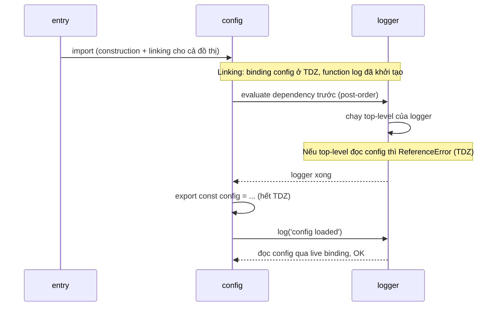

## Bối cảnh & vấn đề

Một monorepo Node viết bằng CommonJS chạy ổn nhiều năm. Rồi một dependency quan trọng ra bản major mới chỉ hỗ trợ ESM, và `require('the-lib')` bắt đầu ném `ERR_REQUIRE_ESM` trên máy của một nửa team (những người dùng Node cũ hơn), trong khi nửa còn lại chạy bình thường. Cùng tuần đó, một refactor làm `config.ts` và `logger.ts` import lẫn nhau: trong bản build CJS, `config` bí ẩn trở thành `undefined`; trong bản ESM, một thay đổi nhỏ khác làm process chết với `ReferenceError: Cannot access 'config' before initialization`. Ở frontend, sau mỗi lần deploy, một số user đang mở app gặp màn hình trắng với `ChunkLoadError: Loading chunk 42 failed`.

Tất cả đều là chuyện của **module system**: cách một file JavaScript tìm, tải, liên kết và chạy các file khác. JavaScript có hai hệ thống module tồn tại song song: **CommonJS** (CJS, của Node từ 2009) và **ES Modules** (ESM, chuẩn ngôn ngữ từ ES2015). Chúng khác nhau không chỉ ở cú pháp `require` với `import`, mà ở **thời điểm** mọi thứ diễn ra và **thứ gì** được chia sẻ giữa các module. Bài này giải thích hai mô hình đó, rồi áp dụng vào circular import, migration CJS sang ESM, dual package hazard, code splitting, và conventions cho một monorepo lớn.

**Interview angle:** câu "CJS với ESM khác nhau thế nào" có câu trả lời sách vở (cú pháp, sync/async). Câu trả lời senior nói về live binding, circular dependency, interop `require(esm)`, và chuyện thực tế như Jest hay dual package hazard.

## Khái niệm

### CommonJS: require là một lời gọi hàm lúc runtime

Trong CJS, mỗi file được Node bọc trong một **function wrapper** `(function (exports, require, module, __filename, __dirname) { ... })`. Đó là lý do `require`, `module`, `__dirname` "có sẵn": chúng là tham số của hàm bọc. `require(path)` là một lời gọi hàm **đồng bộ** bình thường: resolve đường dẫn, nếu module đã có trong cache (`require.cache`) thì trả về ngay, nếu chưa thì tạo object `module`, **đặt vào cache trước**, chạy file, rồi trả `module.exports`.

Vì `require` là hàm, bạn có thể gọi nó ở bất kỳ đâu (trong `if`, trong function, với đường dẫn tính toán lúc runtime). Cái giá là không công cụ nào biết chắc một file phụ thuộc vào gì mà không chạy nó, nên bundler khó **tree-shake** (loại bỏ code không dùng). Và thứ bạn nhận về là **giá trị** của `module.exports` tại thời điểm `require` trả về: destructure `const { count } = require('./x')` copy giá trị `count` lúc đó.

### ESM: phân tích tĩnh, ba giai đoạn

ESM được thiết kế để phân tích **tĩnh**: `import`/`export` chỉ được viết ở top-level, với specifier là chuỗi hằng. Nhờ vậy, engine (hoặc bundler) biết toàn bộ đồ thị phụ thuộc **trước khi chạy dòng code nào**. Việc nạp một module ESM đi qua ba giai đoạn:

1. **Construction** (parse + load): tìm file, tải về (qua mạng trong browser), parse để tìm các `import`, đệ quy cho tới khi có toàn bộ đồ thị. Giai đoạn này có thể bất đồng bộ, nên ESM hỗ trợ được **top-level `await`**.
2. **Linking** (instantiate): tạo **module environment record** cho từng module, cấp chỗ cho mọi binding được export, và nối mỗi `import` tới **đúng binding** bên module xuất. Chưa có code nào chạy; binding `let`/`const`/`class` còn ở TDZ, còn function declaration đã được khởi tạo.
3. **Evaluation**: chạy code top-level của từng module theo thứ tự **depth-first, post-order** (module lá chạy trước), mỗi module chạy **đúng một lần**.

`import.meta.url`, `import.meta.dirname` và `import.meta.filename` (Node 20.11+ (verify)) thay cho `__filename`/`__dirname`, vốn không tồn tại trong ESM.

### Live binding so với copy

Vì linking nối `import` tới **binding** chứ không copy giá trị, một import ESM là **live binding**: khi module xuất thay đổi biến `export let count`, mọi module import đều thấy giá trị mới. Phía import là **read-only**: `count = 5` ném `TypeError: Assignment to constant variable`. Chỉ module sở hữu binding mới được đổi nó, thường qua một function export (`inc()`).

Trong CJS, `module.exports = { count, inc }` tạo một object mới chứa **giá trị** của `count` tại lúc tạo. Hàm `inc` thay đổi biến local `count`, không đụng tới property `count` của object đã export, và destructure ở phía `require` còn copy thêm một lần nữa. Kết quả: ESM in `1`, CJS in `0`. Khi TypeScript hay Babel biên dịch ESM sang CJS, chúng thường giả lập live binding bằng cách truy cập qua object (`counter_1.count`) hoặc getter, nên hành vi có thể khác với khi bạn viết CJS tay.

### Circular dependency

**Circular dependency** là khi A import B và B (trực tiếp hoặc gián tiếp) import A. Cả hai hệ thống đều cho phép, nhưng triệu chứng khác nhau vì mô hình khác nhau.

Trong **CJS**, khi A đang chạy và gọi `require('./B')`, B bắt đầu chạy. B gọi `require('./A')`: A đã nằm trong cache (được đặt vào cache trước khi chạy), nên B nhận `module.exports` **chưa hoàn tất** của A, thường là `{}`. Nếu B destructure ngay (`const { config } = require('./A')`), `config` là `undefined` **vĩnh viễn**, và lỗi chỉ nổ ra sau đó ở chỗ dùng: `TypeError: Cannot read properties of undefined`. Node in thêm cảnh báo `Accessing non-existent property 'config' of module exports inside circular dependency`, dấu hiệu rất đáng giá khi debug.

Trong **ESM**, linking đã nối binding từ trước, nên B không nhận "bản chụp chưa hoàn tất": B nhận live binding. Nếu B chỉ đọc `config` **bên trong function** được gọi sau khi A đã chạy tới dòng `export const config`, mọi thứ hoạt động. Nhưng nếu B đọc `config` **ở top-level** (một side effect lúc load), hoặc A gọi hàm của B **trước** dòng khai báo `config`, binding vẫn ở TDZ, và engine ném `ReferenceError: Cannot access 'config' before initialization`. ESM fail **sớm và rõ ràng**, CJS fail **muộn và lệch chỗ**.

Đó cũng là lý do circular import thường "chạy được" cho tới ngày ai đó thêm một side effect top-level: mọi truy cập nằm trong function được gọi muộn thì an toàn; một truy cập lúc load là đủ để lộ ra thứ tự evaluate.

**Interview angle:** giải thích bằng thứ tự evaluate (module nào chạy trước, dòng nào đã chạy) thuyết phục hơn nhiều so với "circular import là xấu". Sau đó nêu cách phát hiện (`madge --circular`, `import/no-cycle`) và cách sửa (tách module thứ ba, đảo hướng phụ thuộc, lazy access).

### Interop: import CJS từ ESM, require ESM từ CJS

**ESM import CJS** luôn được: `import pkg from './x.cjs'` cho default là `module.exports`; Node còn cố phát hiện named export bằng phân tích tĩnh (cjs-module-lexer), nên `import { a } from './x.cjs'` thường chạy nhưng không đảm bảo.

**CJS require ESM** trước đây không được (`ERR_REQUIRE_ESM`), vì ESM có thể có top-level await mà `require` đồng bộ không chờ được. Cách duy nhất là `await import()` (trả promise, nên buộc code gọi phải async). Node mới đã hỗ trợ **`require(esm)` đồng bộ** với điều kiện đồ thị ESM **không có top-level await**; có TLA thì ném `ERR_REQUIRE_ASYNC_MODULE`. Tính năng này được bật mặc định từ Node 22.12 và 20.19 (verify), và trên Node 24 không còn cảnh báo experimental. Kết quả của `require(esm)` là **namespace object** (có `default` và các named export), không phải default export trực tiếp.

### Dual package hazard

Một thư viện phát hành cả bản CJS và bản ESM (qua trường `exports` với điều kiện `require`/`import` trong `package.json`) có thể bị nạp **hai lần** trong cùng một process: một phần code `require` nó (nhận bản CJS), phần khác `import` nó (nhận bản ESM). Hai bản là hai module khác nhau, với hai bộ state và hai bộ class. Hệ quả: singleton không còn là singleton (hai registry, hai cache), và `err instanceof LibError` sai khi `err` được tạo bởi bản kia. Hiện tượng tương tự xảy ra khi monorepo có hai version của cùng package trong `node_modules`.

Cách phòng: thư viện chỉ ship một bản (ESM-only, và dựa vào `require(esm)` cho consumer CJS), hoặc bản ESM chỉ là wrapper mỏng re-export từ bản CJS để state nằm ở một chỗ; consumer kiểm tra lỗi theo `code`/`name` thay vì `instanceof` (xem [error handling](/tracks/javascript/learn/errors-cancellation)).

### Dynamic import và code splitting

`import(specifier)` là biểu thức trả về **promise** của module namespace, dùng được ở mọi nơi (kể cả trong CJS). Bundler (webpack, Vite/Rollup, Turbopack) coi mỗi `import()` là một điểm tách: module đó và phụ thuộc riêng của nó được đưa vào một **chunk** riêng, tải khi cần. `React.lazy(() => import('./Chart'))` dựa trên đúng cơ chế này. Tên chunk chứa **content hash** (`Chart.3f9a1c.js`) để có thể cache lâu dài.

Chính content hash gây ra lỗi sau deploy: user đang mở bản cũ của app có trong bộ nhớ một manifest trỏ tới `Chart.3f9a1c.js`. Deploy mới thay bằng `Chart.8b27de.js` và xoá file cũ khỏi CDN/server. Khi user điều hướng tới trang có chart, `import()` tải file cũ, nhận 404, và promise reject với `ChunkLoadError` (webpack) hoặc `Failed to fetch dynamically imported module` (Vite).

## Cơ chế hoạt động

Thứ tự evaluate của đoạn circular `config` ↔ `logger` khi entry là `import './config'`:



Diễn giải: ESM evaluate dependency trước module phụ thuộc vào nó, nên `logger` chạy toàn bộ top-level **trước khi** `config` chạy dòng nào. Trong lúc đó, binding `config` đã tồn tại (do linking) nhưng ở TDZ. Nếu `logger` chỉ khai báo function, không có gì đọc `config`, mọi thứ ổn: khi `config` gọi `log(...)` ở dòng 3, `config` đã được khởi tạo ở dòng 2, và `log` đọc nó qua live binding. Nếu `logger` có một dòng top-level như `const prefix = config.level`, dòng đó chạy khi `config` còn ở TDZ và ném `ReferenceError`. Nếu `config` gọi `log()` **trước** dòng `export const config`, kết quả cũng vậy.

CJS đi theo thứ tự "gọi hàm": `config` bắt đầu chạy, dòng 1 `require('./logger')` chạy `logger` ngay. `logger` gọi `require('./config')` và nhận `module.exports` hiện tại của `config`, tức `{}` rỗng. `const { config } = {}` gán `undefined`. `logger` chạy xong, `config` tiếp tục, tạo object `config`, gọi `log(...)`, và `log` đọc biến `config` của nó, vẫn là `undefined`.

## Ví dụ thực tế

### Live binding và copy

```js
// counter.mjs
export let count = 0;
export function inc() { count++; }

// counter.cjs
let count = 0;
module.exports = { count, inc: () => { count++; } };

// main.mjs
import { count, inc } from './counter.mjs';
import * as ns from './counter.mjs';
inc(); console.log('ESM live binding:', count, ns.count);
try { count = 5; } catch (e) { console.log(e.constructor.name + ':', e.message); }
import { createRequire } from 'node:module';
const require = createRequire(import.meta.url);
const cjs = require('./counter.cjs');
const { count: copied, inc: incCjs } = cjs;
incCjs(); console.log('CJS copy:', copied, cjs.count);
console.log('import.meta.dirname ends with:', import.meta.dirname.split('/').pop(), '| typeof __dirname:', typeof __dirname);
```

```text
ESM live binding: 1 1
TypeError: Assignment to constant variable.
CJS copy: 0 0
import.meta.dirname ends with: mod | typeof __dirname: undefined
```

Cả `count` được destructure lẫn `cjs.count` trên object gốc đều là `0` trong CJS: property được gán một lần lúc tạo object. Muốn CJS "live", export một getter (`get count() { return count }`) hoặc một function `getCount()`.

### Circular import: CJS, ESM an toàn, ESM với side effect top-level

CJS với đúng code của câu hỏi (logger bọc `try/catch` để in lỗi):

```js
// config.cjs
const { log } = require('./logger.cjs');
const config = { level: process.env.LOG_LEVEL ?? 'info' };
log('config loaded');
module.exports = { config };

// logger.cjs
const { config } = require('./config.cjs');
function log(msg) { try { if (config.level !== 'silent') console.log('[log]', msg); } catch (e) { console.log('CJS:', e.constructor.name + ':', e.message); } }
module.exports = { log };
```

```text
$ node -e "require('./config.cjs')"
CJS: TypeError: Cannot read properties of undefined (reading 'level')
(node:41152) Warning: Accessing non-existent property 'config' of module exports inside circular dependency
```

Bản ESM với đúng thứ tự dòng đó (`export const config` ở dòng 2, `log(...)` ở dòng 3) **chạy bình thường** và in `[log] config loaded`, vì `config` đã khỏi TDZ khi `log` được gọi. Hai biến thể dưới đây mới ném lỗi:

```js
// logger2.mjs: side effect top-level đọc config
import { config } from './config2.mjs';
const prefix = `[${config.level}]`;
export function log(msg) { console.log(prefix, msg); }

// config3.mjs: gọi log TRƯỚC dòng khai báo
import { log } from './logger3.mjs';
log('config loading');
export const config = { level: 'info' };
```

```text
$ node -e "import('./config2.mjs')"   # entry config2 → logger2 evaluate trước
ESM: ReferenceError: Cannot access 'config' before initialization
$ node -e "import('./config3.mjs')"
ESM: ReferenceError: Cannot access 'config' before initialization
```

Cách sửa, theo thứ tự ưu tiên: tách phần dùng chung ra module thứ ba không import gì (`config-values.ts` chỉ đọc env); **đảo hướng phụ thuộc** (logger nhận `level` qua tham số hoặc factory `createLogger(config)`, không tự import config); nếu tạm thời chưa tách được, chỉ truy cập binding bên trong function (lazy). Phát hiện sớm bằng `madge --circular src/` trong CI hoặc rule `import/no-cycle`.

### require(esm), top-level await và dual package hazard

```js
// esm-only.mjs
export default function slugify(s) { return s.toLowerCase().replace(/\s+/g, '-'); }
export const version = '2.0.0';
// esm-tla.mjs
export const cfg = await Promise.resolve({ region: 'ap-southeast-1' });

// app.cjs
const mod = require('./esm-only.mjs');
console.log('require(esm):', Object.keys(mod), mod.default('Hello World'));
try { require('./esm-tla.mjs'); } catch (e) { console.log(e.code); }
import('./esm-tla.mjs').then((m) => console.log('dynamic import() works with TLA:', m.cfg.region));

// hazard.cjs (hai bản của cùng một class lỗi)
const { DomainError: A } = require('lib-a');
const { DomainError: B } = require('lib-b');
const err = new A('boom');
console.log('instanceof other copy:', err instanceof B, '| check by code:', err.code === 'DOMAIN');
```

```text
$ node app.cjs
require(esm): [ '__esModule', 'default', 'version' ] hello-world
ERR_REQUIRE_ASYNC_MODULE
dynamic import() works with TLA: ap-southeast-1
$ node hazard.cjs
instanceof other copy: false | check by code: true
```

Trên Node 24, `require` một module ESM trả về namespace (chú ý phải gọi `.default`), còn module có top-level await thì phải dùng `import()`. Ví dụ hazard mô phỏng hai bản của cùng một class: `instanceof` sai, kiểm tra theo `code` vẫn đúng.

### Kế hoạch migrate monorepo CJS sang ESM

Khi một dependency quan trọng chuyển sang ESM-only:

1. **Ngắn hạn**: kiểm tra version Node đang chạy ở mọi môi trường (dev, CI, production, Lambda). Nếu tất cả đều hỗ trợ `require(esm)` và thư viện không có top-level await, có thể `require` trực tiếp. Nếu không, bọc trong `await import()` ở một adapter duy nhất.
2. **Dài hạn**: chuyển sang `"type": "module"` theo **từng package lá trước** (package không bị package nội bộ nào khác phụ thuộc), đi dần lên gốc. Cập nhật `tsconfig` (`"module": "nodenext"`, `"moduleResolution": "nodenext"`), thêm đuôi `.js` vào import tương đối (ESM của Node không tự đoán đuôi file), thay `__dirname` bằng `import.meta.dirname`, thay `require` động bằng `import()`, và import JSON bằng import attributes (`import data from './x.json' with { type: 'json' }`).
3. **Test runner** là điểm vướng lớn nhất: Jest chạy CJS và hỗ trợ ESM còn experimental (verify), mocking module ESM khó hơn vì live binding không cho phép gán đè. Cân nhắc Vitest hoặc `node:test`.
4. **Rủi ro cần kiểm soát**: dual package hazard trong giai đoạn chuyển tiếp, singleton bị nhân đôi, khác biệt `this` ở top-level (`undefined` trong ESM). Mỗi PR migrate chỉ đổi module system, không trộn thay đổi hành vi, có CI chạy cả build lẫn test.
5. **Thư viện nội bộ** dùng chung cho service CJS và ESM: ưu tiên ship ESM-only khi mọi consumer đã lên Node hỗ trợ `require(esm)`; nếu chưa, ship dual với trường `exports` rõ ràng và đảm bảo state không nằm trong cả hai bản.

### Chunk load failed sau deploy

```js
let attempts = 0;
async function importWithRetry(load, { retries = 2, baseMs = 100 } = {}) {
  for (let i = 0; ; i++) {
    try { return await load(); }
    catch (e) {
      if (i >= retries) throw e;
      console.log(`  import failed (${e.code ?? e.name}), retry ${i + 1}`);
      await new Promise((r) => setTimeout(r, baseMs * 2 ** i));
    }
  }
}
const flaky = () => (++attempts < 2 ? import('./chunk-abc123.mjs') : import('./esm-only.mjs'));
const m = await importWithRetry(flaky);
console.log('loaded after', attempts, 'attempts:', m.default('Chart Widget'));
try { await importWithRetry(() => import('./chunk-deleted.mjs'), { retries: 1, baseMs: 10 }); }
catch (e) { console.log('gave up:', e.code, '→ show "new version available, reload" once'); }
```

```text
  import failed (ERR_MODULE_NOT_FOUND), retry 1
loaded after 2 attempts: chart-widget
  import failed (ERR_MODULE_NOT_FOUND), retry 1
gave up: ERR_MODULE_NOT_FOUND → show "new version available, reload" once
```

Retry có backoff cứu được lỗi mạng tạm thời, nhưng **không** cứu được chunk đã bị xoá: 404 sẽ lặp lại mãi. Chiến lược đầy đủ cho SPA: giữ asset của vài bản deploy trước trên CDN (xoá theo tuổi, không xoá ngay khi deploy); bắt lỗi trong error boundary quanh `React.lazy` và **reload trang một lần** (đặt cờ trong `sessionStorage` để không reload vòng lặp) hoặc hiện thông báo "có phiên bản mới". Về chia chunk: theo route và theo tính năng nặng (chart, editor, PDF), đo bundle size và thời gian tải thật (RUM, Core Web Vitals) trước và sau; quá nhiều chunk nhỏ tạo waterfall request, nên prefetch chunk của route có khả năng được mở tiếp theo.

### Conventions cho monorepo 40 kỹ sư

Module và async là nơi rule lint trả giá trị cao nhất vì chúng bắt bug thật:

```js
// eslint.config.mjs (trích)
export default [
  {
    rules: {
      'import/no-cycle': ['error', { maxDepth: 5 }],
      '@typescript-eslint/no-floating-promises': 'error',
      '@typescript-eslint/no-misused-promises': 'error',
      '@typescript-eslint/await-thenable': 'error',
      eqeqeq: ['error', 'always', { null: 'ignore' }],
      'no-restricted-syntax': ['error', { selector: 'ForInStatement', message: 'Use for...of or Object.keys()' }],
      '@typescript-eslint/no-explicit-any': 'warn',
    },
  },
];
```

Rollout quan trọng ngang với nội dung rule. Bật rule mới ở mức **warn**, đo số vi phạm hiện có, chạy autofix/codemod cho phần sửa được máy móc, rồi chuyển sang **error** cho code mới hoặc file bị sửa (ratchet: số vi phạm chỉ được giảm). Giải thích mỗi rule bằng một incident thật ("rule này sẽ bắt được sự cố crash tháng trước"), và định kỳ xem lại để bỏ rule chỉ gây phiền mà không bắt bug. Khi có người phản đối "rule làm team chậm", trả lời bằng dữ liệu: số lỗi rule bắt được trong CI, số incident liên quan trước và sau, thời gian review giảm.

## Trade-offs & lựa chọn thay thế

| Tiêu chí | CommonJS | ES Modules |
|---|---|---|
| Cú pháp | `require` / `module.exports` | `import` / `export` |
| Khi nào load | Runtime, đồng bộ, gọi ở đâu cũng được | Phân tích tĩnh, construction có thể async |
| Binding | Copy giá trị của `module.exports` | Live binding, read-only phía import |
| Circular | Nhận exports chưa hoàn tất (`{}`), lỗi muộn | TDZ, `ReferenceError` sớm nếu đọc trước khởi tạo |
| Top-level `await` | Không | Có |
| Tree-shaking | Khó | Tốt |
| `__dirname`, `require` | Có | `import.meta.dirname`, `createRequire` |
| Browser native | Không | Có |
| Tooling cũ (Jest) | Tốt | Đang cải thiện |

| Cách phát hành thư viện | Ưu | Nhược |
|---|---|---|
| CJS-only | Chạy mọi nơi (ESM import được CJS) | Không tree-shake, tụt hậu |
| ESM-only | Một bản, không dual hazard, tree-shake | Consumer CJS cần Node có `require(esm)` hoặc `import()` |
| Dual (CJS + ESM qua `exports`) | Tương thích rộng | Dual package hazard, build phức tạp |

Chọn thế nào: code mới dùng ESM. Service CJS hiện có không cần migrate gấp; `require(esm)` đã giảm áp lực, nhưng hãy lên kế hoạch migrate theo package lá khi tooling (test runner) sẵn sàng. Thư viện nội bộ nên hướng tới ESM-only khi toàn bộ consumer đã lên Node đủ mới; trong giai đoạn chuyển tiếp, giữ state ở một chỗ duy nhất.

## Edge cases & failure modes

- **`ERR_REQUIRE_ESM` chỉ trên một số máy**: khác version Node giữa dev, CI và production. Ghim version bằng `.nvmrc`/`engines` và kiểm tra trong CI.
- **Import tương đối thiếu đuôi**: `import './utils'` chạy được qua bundler nhưng ném `ERR_MODULE_NOT_FOUND` trong Node ESM thuần. TypeScript với `moduleResolution: nodenext` bắt lỗi này.
- **Singleton bị nhân đôi**: hai đường dẫn khác nhau tới cùng file (symlink trong monorepo, hoa/thường trên macOS, bản CJS và ESM) là hai module, hai instance. Triệu chứng: "đã cấu hình rồi mà không có tác dụng".
- **Top-level await chặn cả đồ thị**: một module ESM `await` kết nối DB ở top-level làm mọi module import nó (trực tiếp hoặc gián tiếp) chờ, và `require` nó từ CJS thì ném `ERR_REQUIRE_ASYNC_MODULE`.
- **Mock ESM trong test**: không gán đè được export (read-only), phải dùng loader hook hoặc API mock riêng của test runner; thiết kế dependency injection giúp tránh vấn đề.
- **Dynamic import với biến**: `import(\`./locales/${lang}.js\`)` làm bundler đưa **mọi** file khớp pattern vào chunk; với input không kiểm soát còn là rủi ro bảo mật ở server. Whitelist giá trị.
- **Chunk bị cache sai**: `index.html` bị CDN cache lâu trỏ tới chunk mới chưa có, hoặc ngược lại. HTML phải `no-cache`, asset có hash thì cache dài hạn.

## Pitfalls

- ❌ Destructure từ `require` rồi mong giá trị cập nhật → ✅ đọc qua object hoặc getter, hoặc dùng ESM live binding.
- ❌ Để circular import tồn tại vì "vẫn chạy" → ✅ phát hiện bằng `madge`/`import/no-cycle`, tách module chung hoặc đảo hướng phụ thuộc; một side effect top-level là đủ để nó vỡ.
- ❌ Top-level side effect trong module dùng chung (kết nối DB, đọc config của module khác) → ✅ export factory/hàm khởi tạo và gọi tường minh từ entry.
- ❌ Migrate cả monorepo sang ESM trong một PR → ✅ theo package lá, mỗi PR chỉ đổi module system, CI kiểm tra build và test.
- ❌ Tin `instanceof` giữa các package → ✅ kiểm tra theo `code`/`name`, và kiểm tra `npm ls <pkg>` để tìm bản trùng.
- ❌ Xoá asset cũ ngay khi deploy SPA → ✅ giữ vài bản trước trên CDN, bắt `ChunkLoadError` và reload một lần có cờ chống lặp.
- ❌ Bật hàng loạt rule lint mới ở mức error cho toàn repo → ✅ warn, đo, autofix, rồi ratchet sang error; giải thích bằng incident thật.

## Tóm tắt

- CJS: `require` là hàm đồng bộ lúc runtime, module được cache trước khi chạy, export là giá trị của `module.exports` (copy khi destructure).
- ESM: construction → linking → evaluation. Import là live binding read-only; hỗ trợ top-level await và tree-shaking; dùng `import.meta.dirname` thay `__dirname`.
- Circular: CJS nhận exports chưa hoàn tất và lỗi muộn (`undefined`); ESM dùng live binding, chỉ ném `ReferenceError` (TDZ) khi đọc binding trước dòng khởi tạo, ví dụ từ side effect top-level. Sửa bằng module thứ ba, đảo phụ thuộc, lazy access.
- `require(esm)` đồng bộ có trên Node mới nếu không có top-level await (`ERR_REQUIRE_ASYNC_MODULE` nếu có); trả về namespace object.
- Dual package hazard: hai bản cùng thư viện, hai state, `instanceof` sai. Ship một bản hoặc giữ state ở một chỗ; kiểm tra lỗi theo `code`.
- `import()` tạo chunk có hash; sau deploy chunk cũ bị xoá gây `ChunkLoadError`. Giữ asset cũ, reload một lần có cờ, đo hiệu quả bằng dữ liệu thật.
- Migration: package lá trước, `nodenext`, đuôi file, test runner hỗ trợ ESM; conventions monorepo enforce bằng lint với rollout warn → đo → ratchet.
