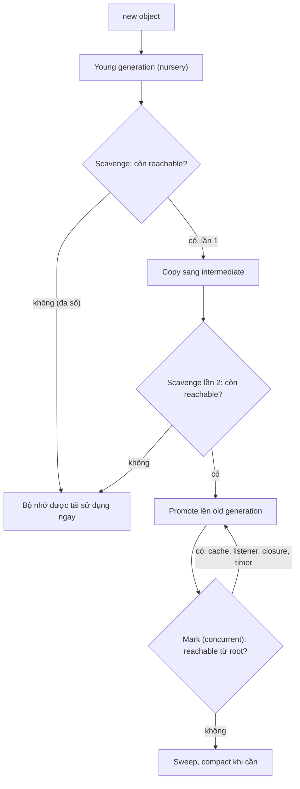
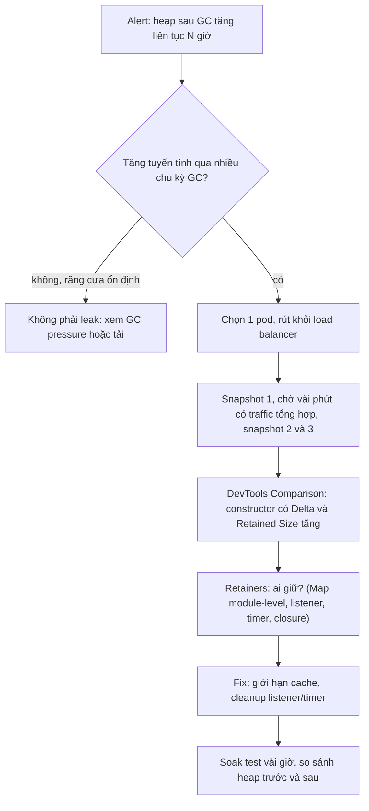

## Bối cảnh & vấn đề

Một service Node chạy ổn sau mỗi lần deploy, rồi heap tăng khoảng 50 MB mỗi giờ. Sau 20 tiếng, container chạm giới hạn 1 GB, kernel OOM kill process, Kubernetes khởi động lại, và chu kỳ lặp lại. Đề xuất đầu tiên trong incident channel là "tăng `--max-old-space-size` lên 2 GB". Ở frontend, một dashboard tài chính mở cả ngày trên màn hình của bộ phận vận hành tăng từ 150 MB lên 1,5 GB, tab giật dần rồi crash vào buổi chiều.

JavaScript có **garbage collector** (GC), nên nhiều người tin rằng memory leak "không xảy ra" hoặc "GC sẽ dọn". Thực tế GC chỉ thu hồi những gì **không còn ai tham chiếu tới**. Một `Map` module-level không giới hạn, một listener quên gỡ, một closure giữ object lớn: tất cả đều là tham chiếu hợp lệ, và GC làm đúng việc của nó khi giữ chúng lại. Leak trong JavaScript là **lỗi logic về vòng đời**, không phải lỗi của GC.

Bài này giải thích GC của V8 hoạt động thế nào ở mức đủ để lý luận về hiệu năng, những nguồn giữ object phổ biến, khi nào `WeakMap`/`WeakRef` giúp được và khi nào không, quy trình tìm leak bằng heap snapshot, và một chủ đề liên quan tới tốc độ: hidden class và inline cache. Closure giữ bộ nhớ thế nào ở bài [scope & closure](/tracks/javascript/learn/scope-closures).

**Interview angle:** hai red flag kinh điển là "GC của V8 rồi sẽ dọn" và "tăng `--max-old-space-size`". Interviewer chờ bạn nói về **reachability**, cách **chứng minh** leak bằng heap snapshot, và cách phát hiện trên cả fleet trước khi OOM.

## Khái niệm

### Reachability: GC giữ lại cái gì

GC hiện đại không đếm tham chiếu; nó dùng **reachability** (khả năng tiếp cận). Có một tập **root**: biến global, stack của các function đang chạy, module đã load (module cache), handle do runtime giữ (timer đang chờ, listener đã đăng ký với socket/DOM, promise đang được một thao tác I/O giữ). Mọi object mà từ root đi theo các tham chiếu tới được đều **sống**; phần còn lại là rác, bị thu hồi. Vì vậy hai object tham chiếu vòng lẫn nhau nhưng không ai từ root tới được vẫn bị thu gom bình thường.

Hệ quả thực tế: để một object được GC, bạn phải cắt **mọi** đường từ root tới nó. Một `Map` ở module scope là root (qua module cache) và giữ strong reference tới mọi key và value. Một `setInterval` chưa `clearInterval` giữ callback, callback giữ closure, closure giữ mọi thứ nó tham chiếu. Một promise đang pending tự nó không phải root: nếu không ai giữ promise và không thao tác I/O nào giữ các hàm `resolve`/`reject` của nó, nó bị thu gom như mọi object khác.

### V8 heap: young generation và old generation

V8 chia heap theo **giả thuyết thế hệ** (generational hypothesis): phần lớn object chết rất trẻ (object tạm trong một request, mảng trung gian của `map`/`filter`). **Young generation** (vài MB tới vài chục MB, gồm các semi-space) chứa object mới. Nó được thu gom bằng **Scavenger**: copy các object còn sống sang vùng khác rồi coi toàn bộ vùng cũ là trống. Chi phí tỉ lệ với số object **sống**, không phải số object đã cấp phát, nên rất rẻ khi đa số đã chết. Object sống sót qua hai lần scavenge được **promote** lên old generation.

**Old generation** chứa object sống lâu (cache, connection, module state) và lớn hơn nhiều (mặc định từ vài trăm MB tới vài GB tuỳ version Node và bộ nhớ hệ thống (verify)). Nó được thu gom bằng **Mark-Sweep-Compact**: đánh dấu mọi object reachable từ root, quét để giải phóng phần không được đánh dấu, và thỉnh thoảng nén (compact) để giảm phân mảnh. Dự án **Orinoco** của V8 làm phần lớn việc này **incremental** (chia nhỏ xen kẽ với JavaScript), **concurrent** (marking chạy trên thread phụ trong khi JavaScript vẫn chạy) và **parallel** (nhiều thread cùng làm phần phải dừng JavaScript). Nhờ vậy pause thường chỉ vài millisecond, nhưng khi heap lớn và đầy object sống, full GC vẫn có thể gây pause dài hàng trăm millisecond.

### GC pressure và pause spike

**GC pressure** là khi code tạo ra nhiều rác tới mức GC phải chạy liên tục. Ví dụ: chuỗi `map().filter().map()` nhiều tầng trên mảng lớn trên hot path (mỗi tầng một mảng trung gian), nối chuỗi lớn trong vòng lặp, `JSON.parse`/`JSON.stringify` payload lớn mỗi request, spread object trong vòng lặp. Triệu chứng: CPU cao mà profile cho thấy thời gian nằm trong `GC`; p99 latency có spike đều đặn. Đo bằng `node --trace-gc`, `PerformanceObserver` với entry type `'gc'`, hoặc metric GC của APM.

Một dạng khó hơn: **cache không giới hạn** đẩy nhiều object lên old space. Old space càng đầy object sống, mỗi lần Mark-Compact càng phải duyệt nhiều, pause càng dài. Đó là lý do tăng `--max-old-space-size` có thể làm latency **tệ hơn**: heap lớn hơn nghĩa là GC chạy thưa hơn nhưng mỗi lần lâu hơn, leak vẫn tăng chỉ là chậm chết hơn, và nếu giới hạn heap vượt memory limit của container thì kernel OOM kill process (không có heap snapshot, không có log từ V8) thay vì V8 báo lỗi.

### Map, WeakMap, WeakRef và FinalizationRegistry

**`Map`** giữ strong reference tới key và value: entry sống chừng nào `Map` còn sống và chưa `delete`. **`WeakMap`** giữ key **yếu**: key phải là object (hoặc symbol không đăng ký), và khi key không còn được tham chiếu ở đâu khác, entry tự biến mất cùng với value. Vì nội dung có thể biến mất bất kỳ lúc nào theo GC, `WeakMap` **không** iterate được và không có `size`. Công dụng chuẩn: gắn **metadata** vào object có vòng đời riêng mà bạn không sở hữu (DOM node, request object, instance của thư viện), không cần nhớ dọn.

`WeakMap` **không** phải cache tổng quát, vì hai lý do. Key phải là object, nên không dùng được với key là `userId` string. Và cache cần eviction theo **kích thước và thời gian** (để giới hạn bộ nhớ và độ cũ của dữ liệu), không theo thời điểm GC tình cờ chạy. Cache đúng nghĩa là LRU có `max` + TTL (`lru-cache`), hoặc cache ngoài process (Redis).

**`WeakRef`** giữ tham chiếu yếu tới một object; `ref.deref()` trả object nếu nó còn sống, hoặc `undefined` nếu đã bị thu gom. **`FinalizationRegistry`** cho phép đăng ký callback chạy **sau khi** object bị thu gom. Cả hai đều phụ thuộc vào thời điểm GC, vốn **không xác định**: có thể rất muộn, có thể không bao giờ (process thoát trước). MDN khuyên tránh dùng khi có thể; chỉ dùng cho tối ưu (cache object lớn có thể tạo lại), không bao giờ cho logic đúng/sai, và mọi code gọi `deref()` phải xử lý `undefined`.

### Các nguồn leak kinh điển

Ở **Node**: cache module-level không giới hạn (hoặc có key không bao giờ lặp lại, như chứa request ID), listener đăng ký trên emitter sống lâu ở mỗi request, `setInterval` không clear, closure của callback sống lâu giữ request/response, mảng "log tạm" hay "queue" chỉ push không bao giờ shift, promise chain treo được giữ trong một `Map` pending không có timeout.

Ở **SPA**: `addEventListener` trên `window`/`document` không gỡ khi unmount, `setInterval` không clear, subscription (WebSocket, Socket.IO, store) không unsubscribe, **detached DOM node** (node đã bị gỡ khỏi document nhưng vẫn được JavaScript tham chiếu, kéo theo cả cây con), thư viện chart/map không `destroy()`, và dữ liệu realtime append vô hạn vào state. Một listener Socket.IO đăng ký ở mỗi lần mount mà không `off` vừa leak bộ nhớ vừa xử lý mỗi event nhiều lần, gây dữ liệu trùng hoặc số dư nhấp nháy.

### Hidden class (shape) và inline cache

Tốc độ truy cập property cũng liên quan tới cách V8 biểu diễn object. Thay vì lưu mỗi object như một hash map, V8 gán cho object một **hidden class** (V8 gọi là **map**, các engine khác gọi là **shape**) mô tả tập property và **thứ tự** chúng được thêm vào, cùng vị trí (offset) của từng property. Các object được tạo cùng cách (cùng constructor, cùng thứ tự gán) dùng chung một hidden class, và giá trị property nằm ở offset cố định.

Mỗi chỗ truy cập property trong code (ví dụ `arr[i].x` trong một function) có một **inline cache** (IC) ghi nhớ hidden class đã thấy và offset tương ứng. Lần sau gặp cùng hidden class, engine lấy thẳng giá trị ở offset đó, không cần tra cứu. IC thấy một shape là **monomorphic** (nhanh nhất), vài shape (tới 4 trong V8) là **polymorphic** (chậm hơn một chút), nhiều hơn là **megamorphic** (rơi về tra cứu chung, chậm hơn nhiều). Các pattern làm hại: thêm property sau constructor theo thứ tự khác nhau, `delete obj.prop` (có thể chuyển object sang **dictionary mode**, tức hash map chậm), trộn kiểu trong cùng field (số nguyên nhỏ, số thực, object), dùng object literal làm hash map với key động.

**Interview angle:** câu trả lời senior luôn kèm điều kiện: chỉ quan trọng trên hot path **đã được profile**. Cách xác nhận: CPU profile cho thấy hàm nóng, `--trace-deopt` cho thấy deoptimization lặp lại.

## Cơ chế hoạt động

Vòng đời một object trong V8 heap:



Diễn giải: object mới luôn vào young generation. Scavenge chỉ copy object còn sống, nên object tạm của một request thường chết ở đây với chi phí gần như bằng không. Object sống qua hai lần scavenge được coi là "sống lâu" và lên old generation, nơi chỉ Mark-Sweep-Compact mới thu hồi được, và mỗi lần tốn hơn nhiều. Vòng lặp `O → M → O` là nơi leak thể hiện: object bị cache, listener, closure hay timer giữ luôn được đánh dấu là reachable, old space phình dần, mỗi lần mark càng lâu. Khi heap chạm giới hạn, V8 thử full GC liên tục (CPU tăng vọt, latency tăng) trước khi báo `FATAL ERROR: Reached heap limit Allocation failed - JavaScript heap out of memory`.

Với leak trong ticket (`Map` với key chứa `x-request-id`): mỗi request tạo một key mới, `cache.has(key)` không bao giờ đúng, nên mỗi request thêm một entry. `Map` nằm ở module scope, reachable từ root, nên mọi `User` trong nó bị promote lên old space và không bao giờ được thu hồi. Heap tăng tuyến tính theo số request: đúng dấu hiệu "50 MB mỗi giờ".

## Ví dụ thực tế

### Leak do cache key và fix bằng LRU có TTL

```js
const db = { users: { find: async (id) => ({ id, name: `user-${id}`, profile: 'x'.repeat(2_000) }) } };
const mb = () => (process.memoryUsage().heapUsed / 1e6).toFixed(0) + 'MB';

const leaky = new Map();
async function getUserLeaky(req) {
  const key = `${req.requestId}:${req.userId}`;           // new key every request
  if (!leaky.has(key)) leaky.set(key, await db.users.find(req.userId));
  return leaky.get(key);
}

class LruTtl {
  #map = new Map();
  constructor(max, ttlMs) { this.max = max; this.ttlMs = ttlMs; }
  get(k) {
    const e = this.#map.get(k);
    if (!e) return undefined;
    if (Date.now() > e.exp) { this.#map.delete(k); return undefined; }
    this.#map.delete(k); this.#map.set(k, e);               // move to most-recent
    return e.v;
  }
  set(k, v) {
    this.#map.delete(k); this.#map.set(k, { v, exp: Date.now() + this.ttlMs });
    if (this.#map.size > this.max) this.#map.delete(this.#map.keys().next().value); // evict oldest
  }
  get size() { return this.#map.size; }
}
const lru = new LruTtl(1_000, 60_000);
let hits = 0;
async function getUser(req) {
  const key = `tenant-1:${req.userId}`;
  const cached = lru.get(key);
  if (cached) { hits++; return cached; }
  const u = await db.users.find(req.userId); lru.set(key, u); return u;
}

for (const [label, fn, size] of [['leaky Map', getUserLeaky, () => leaky.size], ['LRU+TTL  ', getUser, () => lru.size]]) {
  leaky.clear(); globalThis.gc(); const before = mb();
  for (let i = 0; i < 100_000; i++) await fn({ requestId: crypto.randomUUID(), userId: i % 800 });
  globalThis.gc();
  console.log(`${label}: heap ${before} -> ${mb()}, entries=${size()}${label.startsWith('LRU') ? `, hits=${hits}` : ''}`);
}
```

```text
$ node --expose-gc l11a.mjs
leaky Map: heap 4MB -> 110MB, entries=100000
LRU+TTL  : heap 4MB -> 5MB, entries=800, hits=99200
```

Cùng 100.000 request cho 800 user khác nhau: bản leaky có 100.000 entry, 0 lần hit, heap 110 MB **sau khi đã ép GC** (đó là bộ nhớ thật sự bị giữ, không phải rác chưa dọn). Bản LRU giữ 800 entry, hit 99.200 lần, heap gần như không đổi. `Map` giữ thứ tự chèn, nên "xoá rồi chèn lại" đưa entry lên cuối và `keys().next()` là entry cũ nhất: một LRU 20 dòng đủ dùng cho ví dụ, còn production nên dùng `lru-cache` (có `maxSize` theo byte, TTL, stale-while-revalidate) hoặc Redis khi cần chia sẻ giữa các pod. Key phải chứa tenant để không lộ dữ liệu giữa tenant.

### WeakMap, WeakRef và FinalizationRegistry

```js
const tick = () => new Promise((r) => setTimeout(r, 0));
const registry = new FinalizationRegistry((label) => console.log('  finalized:', label));

const meta = new WeakMap();
const strong = new Map();
let reqA = { id: 'A', body: new Array(1e5).fill(0) };
let reqB = { id: 'B', body: new Array(1e5).fill(0) };
meta.set(reqA, { startedAt: Date.now() });
strong.set(reqB, { startedAt: Date.now() });
registry.register(reqA, 'reqA (WeakMap key)');
registry.register(reqB, 'reqB (Map key)');
let ref = new WeakRef({ id: 'C', payload: new Array(1e5).fill(0) });
registry.register(ref.deref(), 'C (only WeakRef)');

reqA = null; reqB = null;               // drop our own references
await tick(); globalThis.gc(); await tick();
console.log('Map still holds B:', strong.size, '| WeakRef deref:', ref.deref());
try { new WeakMap().set('user:42', 1); } catch (e) { console.log(e.constructor.name + ':', e.message); }
console.log('WeakMap has size/keys?', 'size' in meta, typeof meta.keys);
```

```text
$ node --expose-gc l11b.mjs
  finalized: C (only WeakRef)
  finalized: reqA (WeakMap key)
Map still holds B: 1 | WeakRef deref: undefined
TypeError: Invalid value used as weak map key
WeakMap has size/keys? false undefined
```

Sau khi bỏ tham chiếu của chính mình và ép GC: `reqA` (chỉ còn là key của `WeakMap`) bị thu gom, `reqB` (key của `Map`) vẫn sống, object chỉ được `WeakRef` giữ cũng bị thu gom và `deref()` trả `undefined`. String không làm key `WeakMap` được. Trong code thật không có `gc()` thủ công, nên thời điểm các dòng "finalized" xuất hiện là không đoán được: đó là lý do không đặt logic nghiệp vụ lên chúng. (Ví dụ `tick()` trước `gc()` để V8 giải phóng "keep-alive" của `WeakRef` vừa tạo trong cùng task, theo đúng spec.)

### Đọc log GC

```text
$ node --trace-gc l11c.mjs
[41973:0xc1280c000]  13 ms: Scavenge 4.5 (6.3) -> 4.2 (7.3) MB, pooled: 0 MB, 0.33 / 0.00 ms  (average mu = 1.000, current mu = 1.000) allocation failure;
[41973:0xc1280c000]  20 ms: Scavenge 10.2 (15.6) -> 7.6 (16.5) MB, pooled: 0 MB, 0.58 / 0.00 ms  ...
[42034:0xb0a80c000]  42 ms: Mark-Compact 15.8 (46.6) -> 3.5 (38.1) MB, pooled: 7 MB, 0.75 / 0.00 ms  (+ 0.2 ms in 16 steps since start of marking, biggest step 0.1 ms ...) finalize incremental marking via task; GC in old space requested
```

Mỗi dòng: loại GC, heap đã dùng trước → sau (trong ngoặc là heap đã cấp), thời gian pause. Scavenge dưới 1 ms mỗi lần. Dòng Mark-Compact cho thấy incremental marking: 16 bước nhỏ trước khi hoàn tất, pause chính chỉ 0,75 ms. Khi leak, bạn sẽ thấy Mark-Compact ngày càng dày, "sau" ngày càng gần "trước" (thu hồi được rất ít), và thời gian pause tăng.

### Chứng minh leak trong production và phát hiện trên cả fleet

Quy trình với một service đang leak:



1. **Xác nhận xu hướng**: metric `heapUsed`, `rss`, `external` theo pod (từ `process.memoryUsage()` hoặc APM). Leak là đường tăng tuyến tính kéo dài qua nhiều chu kỳ GC, không phải răng cưa dao động.
2. **Chụp heap snapshot an toàn**: chọn **một** pod, rút khỏi load balancer (hoặc đánh dấu not-ready), rồi chụp. Chụp snapshot dừng event loop trong vài giây tới vài chục giây và tốn thêm bộ nhớ xấp xỉ kích thước heap, nên pod gần giới hạn có thể bị OOM kill ngay khi chụp. Kích hoạt bằng `v8.writeHeapSnapshot()` qua một endpoint admin được bảo vệ, hoặc khởi động với `--heapsnapshot-signal=SIGUSR2` rồi `kill -USR2 <pid>`. Flag `--heapsnapshot-near-heap-limit=1` tự chụp khi heap gần chạm giới hạn.
3. **So sánh 2–3 snapshot** cách nhau vài phút trong Chrome DevTools (tab Memory, load file `.heapsnapshot`), chế độ **Comparison**: lọc theo constructor có `# Delta` và **Retained Size** tăng. Với ticket này, `Map` retained size tăng đều, mở **Retainers** thấy nó được giữ bởi biến `cache` trong module `user-service`.
4. **Fix và kiểm chứng** bằng soak test (load test dài vài giờ) trước khi deploy.

Để bắt leak trước khi OOM trên cả fleet: alert trên **xu hướng** (ví dụ heap sau GC tăng liên tục N giờ, hoặc đạo hàm dương vượt ngưỡng) chứ không chỉ ngưỡng tuyệt đối; theo dõi thêm GC pause và event-loop lag; đặt `--max-old-space-size` nhỏ hơn memory limit của container một khoảng (để V8 báo lỗi và chụp được snapshot thay vì bị kernel kill); chạy soak test trong CI/staging; review mọi cache mới phải có giới hạn. Restart định kỳ có thể là băng cá nhân tạm thời, không phải fix.

### Listener Socket.IO, cleanup bằng signal và dedupe theo sequence

```js
import { EventEmitter } from 'node:events';
const socket = new EventEmitter();                   // stands in for a Socket.IO client
function mountBuggy() { socket.on('balance', (b) => { /* setState(b) */ }); }
for (let i = 0; i < 11; i++) mountBuggy();           // re-mount on every route change
console.log('buggy listeners:', socket.listenerCount('balance'));

const bus = new EventTarget();
function mount() {
  const ac = new AbortController();
  bus.addEventListener('balance', () => {}, { signal: ac.signal });
  bus.addEventListener('order', () => {}, { signal: ac.signal });
  return () => ac.abort();                           // one call removes every listener
}
for (let i = 0; i < 11; i++) { const unmount = mount(); unmount(); }   // mount, then route change
console.log('EventTarget + signal: 11 mount/unmount cycles, no warning');

let lastSeq = 0; const applied = [];
function onBalance(evt) { if (evt.seq <= lastSeq) return; lastSeq = evt.seq; applied.push(evt.value); }
[{ seq: 1, value: 100 }, { seq: 3, value: 80 }, { seq: 2, value: 90 }, { seq: 3, value: 80 }].forEach(onBalance);
console.log('applied (drop stale/duplicate):', applied, 'lastSeq =', lastSeq);
```

```text
buggy listeners: 11
EventTarget + signal: 11 mount/unmount cycles, no warning
applied (drop stale/duplicate): [ 100, 80 ] lastSeq = 3
(node:42148) MaxListenersExceededWarning: Possible EventEmitter memory leak detected. 11 balance listeners added to [EventEmitter]. MaxListeners is 10. Use emitter.setMaxListeners() to increase limit
```

Mỗi lần mount không gỡ listener thêm một bản: 11 listener, mỗi event `balance` được xử lý 11 lần, và Node cảnh báo `MaxListenersExceededWarning`, một tín hiệu leak nên được đưa vào alert thay vì tắt đi bằng `setMaxListeners(0)`. Với `addEventListener(type, fn, { signal })`, một lần `abort()` gỡ mọi listener của component; trong React, gọi nó ở cleanup của `useEffect`. Với Socket.IO client, `socket.off(event, handler)` phải dùng **đúng reference** handler đã đăng ký. Phần cuối xử lý thứ tự: event cũ hơn hoặc trùng (theo sequence number hoặc `updatedAt`) bị bỏ qua, nên số dư không nhảy ngược từ 80 về 90. Khi reconnect, client phải **resync** (lấy snapshot hoặc gửi `lastSeq` để server gửi bù) vì event trong lúc mất kết nối đã bị lỡ.

### SPA 150 MB lên 1,5 GB

Quy trình trong Chrome DevTools: lặp lại một thao tác nghi ngờ N lần (mở/đóng modal, chuyển route qua lại), chụp heap snapshot trước và sau, dùng **Comparison** và lọc `Detached` để tìm DOM node đã gỡ khỏi trang nhưng còn bị giữ; **Allocation instrumentation on timeline** cho thấy vùng cấp phát không được thu hồi. Retainers của detached node thường dẫn tới một listener trên `window`, một closure trong timer, hoặc cache module-level giữ component cũ. Fix: cleanup trong `useEffect` return (clearInterval, abort signal cho listener và fetch, unsubscribe store/socket, `chart.destroy()`), giới hạn cache, và với dữ liệu realtime thì giữ cửa sổ có giới hạn (ví dụ 500 giao dịch gần nhất) và virtualize list thay vì append vô hạn vào state.

### Hidden class và inline cache

```js
function P(x, y) { this.x = x; this.y = y; }
const a = new P(1, 2), b = new P(3, 4);
const c = {}; c.y = 1; c.x = 2;              // same props, different order
const d = new P(5, 6); delete d.y;           // delete changes shape
console.log('a~b same shape:', %HaveSameMap(a, b), '| a~c:', %HaveSameMap(a, c), '| d dictionary mode:', !%HasFastProperties(d));

function sumX(arr) { let s = 0; for (let i = 0; i < arr.length; i++) s += arr[i].x; return s; }
const N = 1_000_000;
const mono = Array.from({ length: N }, (_, i) => ({ x: i, y: i }));
const mega = Array.from({ length: N }, (_, i) => {
  const o = {}; const k = i % 8;                 // 8 different shapes
  if (k > 0) o['p' + k] = 0;
  if (k > 3) o.q = 0;
  if (k % 2) o.r = 0;
  o.x = i; return o;
});
for (const [label, arr] of [['monomorphic', mono], ['megamorphic', mega]]) {
  sumX(arr.slice(0, 1000));
  const t0 = performance.now();
  for (let r = 0; r < 20; r++) sumX(arr);
  console.log(label.padEnd(12), (performance.now() - t0).toFixed(0), 'ms');
}
```

```text
$ node --allow-natives-syntax l11d.js
a~b same shape: true | a~c: false | d dictionary mode: true
monomorphic  24 ms
megamorphic  105 ms
```

`a` và `b` dùng chung hidden class; `c` có cùng hai property nhưng thêm theo thứ tự khác nên khác hidden class; `delete` đẩy `d` sang dictionary mode. Cùng hàm `sumX`, cùng số phần tử, nhưng khi dòng `arr[i].x` gặp 8 shape khác nhau, IC thành megamorphic và chậm hơn khoảng 4 lần. Các hàm `%HaveSameMap` chỉ có với flag `--allow-natives-syntax`, dùng để học, không dùng trong code thật. Con số cụ thể phụ thuộc version V8 (verify), nhưng xu hướng thì ổn định. Để xác nhận trong một regression thật: CPU profile (`--cpu-prof`) tìm hàm nóng, `--trace-deopt` tìm deoptimization lặp lại, rồi sửa bằng cách khởi tạo đủ field trong constructor theo thứ tự cố định, dùng `Map` cho key động, gán `undefined` thay vì `delete`.

## Trade-offs & lựa chọn thay thế

| Cấu trúc | Giữ key | Iterate / size | Key được phép | Dùng khi |
|---|---|---|---|---|
| `Map` | Strong | Có | Mọi giá trị | Dữ liệu bạn sở hữu, có vòng đời rõ ràng |
| `Map` + LRU/TTL (`lru-cache`) | Strong, có eviction | Có | Mọi giá trị | Cache trong process |
| `WeakMap` | Yếu | Không | Object, symbol không đăng ký | Metadata gắn vào object của người khác |
| `WeakRef` | Yếu, `deref()` có thể `undefined` | N/A | Object | Cache object lớn tạo lại được (tối ưu) |
| `FinalizationRegistry` | N/A | N/A | Object | Log/giải phóng tài nguyên phụ, không cho logic chính |
| Redis / cache ngoài | Ngoài heap | Có | String | Chia sẻ giữa pod, dung lượng lớn, TTL |

| Phản ứng với heap tăng | Ưu | Nhược |
|---|---|---|
| Tăng `--max-old-space-size` | Nhanh | Leak vẫn còn, GC pause dài hơn, rủi ro bị kernel OOM kill không có dấu vết |
| Restart định kỳ | Giảm triệu chứng ngay | Che giấu nguyên nhân, mất request nếu không graceful |
| Heap snapshot + fix | Giải quyết gốc | Cần quy trình chụp an toàn và thời gian phân tích |
| Chuyển cache ra Redis | Heap nhỏ, chia sẻ được | Thêm network hop, cần xử lý Redis lỗi |

Chọn thế nào: dữ liệu bạn sở hữu dùng `Map` với vòng đời rõ ràng; cache luôn có giới hạn kích thước và TTL; `WeakMap` chỉ cho metadata gắn vào object có vòng đời riêng; `WeakRef` gần như không bao giờ cần trong code ứng dụng. Khi heap tăng, tăng giới hạn chỉ là biện pháp tạm để mua thời gian chụp snapshot và tìm nguyên nhân.

## Edge cases & failure modes

- **Kernel OOM kill thay vì V8 OOM**: nếu giới hạn heap V8 cộng với bộ nhớ ngoài heap (Buffer, native addon, stack của thread) vượt memory limit của container, kernel giết process với `SIGKILL` (exit code 137), không có stack trace hay snapshot. Đặt heap limit khoảng 70–80% memory limit.
- **`external` và `arrayBuffers` tăng mà heap không tăng**: Buffer lớn (đọc file, response body) nằm ngoài V8 heap; heap snapshot không thấy rõ. Theo dõi `process.memoryUsage().external`.
- **Snapshot làm sập pod**: chụp snapshot cần bộ nhớ gần bằng heap và chặn event loop; pod đang phục vụ traffic sẽ timeout health check. Luôn rút pod khỏi LB trước.
- **Leak chỉ xuất hiện dưới tải thật**: key cache có miền giá trị lớn (user ID của hàng triệu user) trông giống leak nhưng thực ra là cache không giới hạn; môi trường test với 10 user không bao giờ thấy. Soak test với phân bố dữ liệu giống production.
- **Closure anh em giữ biến lớn**: một callback nhỏ giữ sống object lớn vì closure khác trong cùng function dùng nó (xem [scope & closure](/tracks/javascript/learn/scope-closures)).
- **Sampling heap profiler vs snapshot**: `--heap-prof` hoặc sampling profiler rẻ hơn nhiều, chạy được lâu hơn, cho biết **ai cấp phát**; snapshot cho biết **ai đang giữ**. Leak cần câu hỏi thứ hai.
- **Detached DOM trong test**: framework test (jsdom) có thể giữ document giữa các test, làm test suite chậm dần và tốn bộ nhớ; cleanup sau mỗi test.

## Pitfalls

- ❌ "GC sẽ dọn nó thôi" → ✅ GC chỉ thu hồi object unreachable; cache, listener, timer, closure giữ tham chiếu hợp lệ.
- ❌ Tăng `--max-old-space-size` như một fix → ✅ tìm nguyên nhân bằng heap snapshot; heap lớn hơn nghĩa là GC pause dài hơn và leak vẫn tăng.
- ❌ Cache module-level `new Map()` không giới hạn, hoặc key chứa request ID/timestamp → ✅ LRU có `max` + TTL, key theo thực thể (tenant + user), hoặc Redis.
- ❌ Dùng `WeakMap` làm cache cho key string → ✅ `WeakMap` chỉ nhận object và không có eviction theo kích thước/thời gian.
- ❌ Logic nghiệp vụ dựa vào `FinalizationRegistry` hay `WeakRef.deref()` luôn trả object → ✅ coi đó là tối ưu không đảm bảo; luôn xử lý `undefined`.
- ❌ Đăng ký `socket.on(...)` mỗi lần mount mà không `off` → ✅ gỡ đúng reference ở cleanup, hoặc dùng `{ signal }` và `abort()`; resync khi reconnect, dedupe theo sequence.
- ❌ `delete obj.prop` và thêm property theo thứ tự tuỳ ý trên hot path → ✅ khởi tạo đủ field trong constructor, gán `undefined`, dùng `Map` cho key động; chỉ tối ưu sau khi đã profile.

## Tóm tắt

- GC dựa trên reachability từ root (global, stack, module cache, timer, listener). Leak là object bị giữ ngoài ý muốn, không phải lỗi GC.
- V8 heap: young generation thu gom bằng Scavenger (rẻ, chi phí theo object sống); object sống sót lên old generation, thu gom bằng Mark-Sweep-Compact incremental/concurrent/parallel (Orinoco).
- GC pressure đến từ object tạm trên hot path và cache lớn; tăng `--max-old-space-size` có thể làm pause dài hơn và dẫn tới kernel OOM kill.
- `Map` giữ strong; `WeakMap` giữ key yếu, key là object, không iterate: dùng cho metadata, không làm cache. `WeakRef`/`FinalizationRegistry` không xác định thời điểm, chỉ để tối ưu.
- Tìm leak: xu hướng metric → rút một pod khỏi LB → 2–3 heap snapshot → Comparison + Retainers → fix → soak test. Alert trên xu hướng, không chỉ ngưỡng.
- SPA: listener, interval, subscription, detached DOM, chart không destroy, state append vô hạn. Cleanup bằng `useEffect` return và `{ signal }`; Socket.IO cần `off` đúng reference, resync khi reconnect, dedupe theo sequence.
- Hidden class và inline cache: object cùng shape được truy cập nhanh; nhiều shape (megamorphic), `delete`, thứ tự property tuỳ ý làm hot path chậm. Chỉ tối ưu khi profile chỉ ra.
