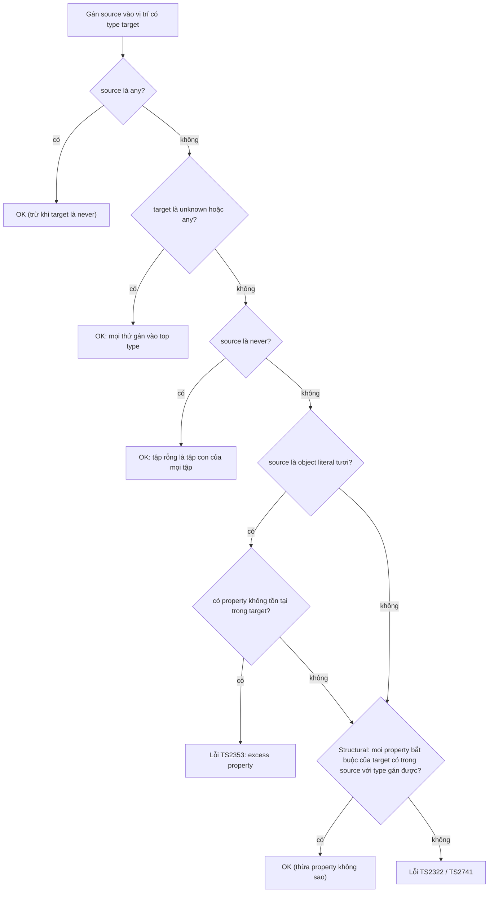
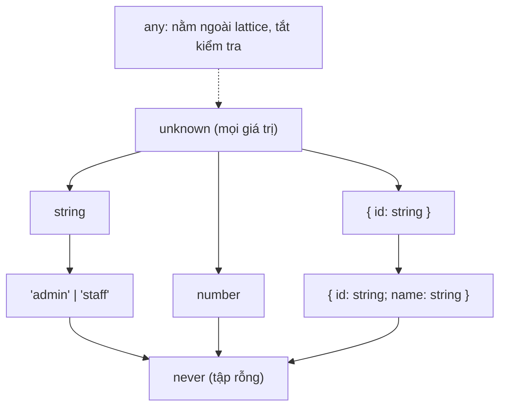

## Bối cảnh & vấn đề

Một service Node nhận webhook từ nhà cung cấp thanh toán. Dev viết `const event: PaymentEvent = JSON.parse(body)`, code compile sạch dưới `strict`, review cũng pass. Hai tuần sau, provider đổi `amount` từ number sang object `{ value, currency }`. Service không báo lỗi ở chỗ parse; nó crash ở một hàm tính phí cách đó bốn tầng gọi, với `TypeError: Cannot read properties of undefined`. Lỗi không nằm ở TypeScript "không hoạt động", mà ở chỗ dev hiểu sai TypeScript **là gì**: `JSON.parse` trả về `any`, và `any` lặng lẽ tắt mọi kiểm tra.

Một case khác: hàm `updateProfile(dto: UpdateProfileDto)` nhận `req.body` qua một biến trung gian, rồi spread vào câu `UPDATE`. Client gửi thêm `"isAdmin": true`. TypeScript không phàn nàn, vì theo luật của nó, một object có **thêm** property vẫn là `UpdateProfileDto` hợp lệ. Đó là **structural typing**, và nó là lý do `Object.keys(dto)` trả `string[]` chứ không phải `keyof UpdateProfileDto`.

Bài này đặt nền móng cho cả track: TypeScript kiểm tra gì và **không** kiểm tra gì, cách nghĩ về type như **tập hợp giá trị**, quy tắc gán giữa `any`, `unknown`, `never`, và những hệ quả thực tế của structural typing. Các bài sau (narrowing, generics, soundness, runtime validation) đều dựa trên mô hình này.

**Interview angle:** câu hỏi mở đầu kiểu "any khác unknown thế nào" là cửa để interviewer đo xem bạn có mô hình tư duy đúng (type = tập hợp, assignability = tập con) hay chỉ thuộc định nghĩa.

## Khái niệm

### TypeScript là type checker, không phải runtime

TypeScript là JavaScript cộng thêm **chú thích type** và một **type checker** chạy lúc build. Khi code được chuyển sang JavaScript (bởi `tsc`, esbuild, swc hay Node type stripping), toàn bộ type bị **xoá** (type erasure). Runtime không biết `User` là gì; nó chỉ thấy object. Hệ quả: type chỉ nói về code **bạn viết**, không nói gì về dữ liệu **đi vào** từ bên ngoài (HTTP body, JSON, message queue, env). Chi tiết pipeline và cách validate ở boundary nằm ở bài [runtime validation](/tracks/typescript/learn/runtime-validation-contracts).

Vì vậy mọi câu "TypeScript đảm bảo X" nên được đọc là "TypeScript đảm bảo X **nếu** các giả định type ở boundary là đúng". Khi giả định đó sai (một `any`, một `as`), lỗi xuất hiện ở runtime, thường xa nơi gây ra nó.

### Type là một tập hợp giá trị

Mô hình tư duy hữu ích nhất: **mỗi type là một tập các giá trị có thể có**. `string` là tập mọi chuỗi. `"admin"` (literal type) là tập chỉ có một phần tử. `"admin" | "staff"` (union) là hợp của hai tập. `{ id: string }` là tập **mọi object có property `id` kiểu string**, bất kể có thêm property khác hay không.

Với mô hình này, **assignability** (gán được) có nghĩa rất đơn giản: `A` gán được cho `B` khi tập `A` là **tập con** của tập `B`. `"admin"` gán được cho `string` vì tập một phần tử nằm trong tập mọi chuỗi. `{ id: string; name: string }` gán được cho `{ id: string }` vì mọi object có cả `id` và `name` thì chắc chắn có `id`. Union mở rộng tập (`A | B` lớn hơn `A`), intersection thu hẹp (`A & B` là giao, nhỏ hơn `A`).

### unknown: top type an toàn

`unknown` là **top type**, tập chứa **mọi** giá trị. Vì mọi tập đều là tập con của nó, **mọi thứ gán vào `unknown` được**. Ngược lại, bạn không thể dùng một giá trị `unknown` như string hay object (gọi method, đọc property, gán sang `string`) vì compiler không biết nó thuộc tập con nào. Muốn dùng, bạn phải **narrow** trước: `typeof u === "string"`, `instanceof`, hoặc parse bằng schema.

`unknown` là type đúng cho mọi thứ bạn chưa kiểm tra: kết quả `JSON.parse`, `catch (e)` (mặc định dưới `strict` nhờ `useUnknownInCatchVariables`), payload từ provider. Nó ép bạn viết code kiểm tra ngay tại chỗ nhận dữ liệu.

### any: tắt type checker

`any` **không** phải một tập hợp; nó là lối thoát khỏi hệ thống type. Một giá trị `any` gán được **đi** mọi type (trừ `never`) và nhận **vào** mọi type, và mọi thao tác trên nó (`a.foo.bar.baz()`) đều compile. Tệ hơn, `any` **lây**: `const x = a.price * 2` có type `number`, nhưng `const y = a.items` lại là `any`, và `y` trôi tiếp vào code khác mà không ai biết.

`any` xuất hiện ngầm ở nhiều chỗ: `JSON.parse`, `res.json()` của `fetch` (trả `Promise<any>`), thư viện không có type, `catch (e)` khi tắt `useUnknownInCatchVariables`. Đây là nguồn unsoundness số một trong code production (xem bài [soundness](/tracks/typescript/learn/soundness-variance)).

### never: bottom type, tập rỗng

`never` là **tập rỗng**: không giá trị nào thuộc về nó. Tập rỗng là tập con của mọi tập, nên `never` **gán đi** mọi type được. Không gì gán **vào** `never` được, kể cả `any` (điểm hay bị nhầm). `never` xuất hiện khi: một function không bao giờ return (`throw`, vòng lặp vô tận); narrowing đã loại hết khả năng (nhánh `default` của một `switch` đầy đủ); hoặc intersection mâu thuẫn (`string & number`). Trong union, `never` biến mất: `string | never` là `string`, giống như hợp với tập rỗng.

Ứng dụng quan trọng nhất là **exhaustive check**: gán biến đã narrow vào `never` ở nhánh cuối, để thêm một variant mới mà quên xử lý thành lỗi compile. Bài [narrowing](/tracks/typescript/learn/narrowing-discriminated-unions) đi sâu vào pattern này.

### Structural typing

TypeScript là **structural** (so sánh theo shape), không **nominal** (so sánh theo tên khai báo) như Java hay C#. Hai type tương thích khi cấu trúc tương thích, bất kể tên. `type UserId = string` và `type OrderId = string` là **cùng một type**; đặt tên chỉ là alias. Hai class khác tên nhưng cùng shape thay thế được cho nhau.

Thiết kế này có lý do: JavaScript là ngôn ngữ của object literal và duck typing. Code JS thật truyền object ẩn danh khắp nơi (`fetch(url, { method: "POST" })`), không ai `implements` gì cả. Nominal typing sẽ bắt bạn khai báo mọi thứ. Cái giá là bạn không phân biệt được hai ID cùng kiểu `string` (giải pháp: **branded type**, bài [domain modeling](/tracks/typescript/learn/branded-types-domain-modeling)), và một object luôn có thể mang **nhiều property hơn** type của nó mô tả.

Ngoại lệ: class có `private`/`protected` member (hoặc `#private` field) trở nên gần như nominal. Hai class cùng khai báo `private secret` không gán được cho nhau, vì compiler yêu cầu private member đến từ **cùng một khai báo**.

### Excess property check: heuristic cho object literal "tươi"

Nếu structural typing cho phép thừa property, vì sao `const p: Point = { x: 1, y: 2, z: 3 }` lại lỗi? Vì TypeScript có thêm một **heuristic** riêng: **excess property checking** chỉ áp dụng cho **object literal "tươi"** (fresh), tức literal được viết trực tiếp tại vị trí có type đích (gán, truyền tham số, return). Lý do: với literal, thuộc tính thừa gần như chắc chắn là **lỗi gõ** (`retires` thay vì `retries`), vì không ai khác giữ tham chiếu tới object đó.

Khi object đi qua một biến trung gian, nó mất "độ tươi", và chỉ còn luật structural: thừa property không sao. Đây không phải bug; đây là hai luật khác nhau với hai mục đích khác nhau. Liên quan: **weak type detection** báo lỗi khi gán một object không có **property chung nào** với một type chỉ gồm property optional (`{ retries?: number }`), kể cả qua biến.

### Vì sao Object.keys trả string[]

Vì structural typing, một giá trị kiểu `User` lúc runtime có thể có thêm key ngoài `keyof User`. Nếu `Object.keys(u)` trả `(keyof User)[]`, TypeScript sẽ **nói dối**: bạn iterate và nhận key `"isAdmin"` trong khi type bảo chỉ có `"id" | "name"`. Trả `string[]` là lựa chọn **sound**. Hệ quả: `u[k]` với `k: string` bị lỗi `TS7053` dưới `strict`, và bạn phải quyết định có cast hay không.

**Interview angle:** "Object.keys trả string[] là bug của TypeScript?" Câu trả lời senior: không, đó là hệ quả trực tiếp của structural typing; cast `as (keyof T)[]` chỉ an toàn khi bạn **tự tạo** object đó.

## Cơ chế hoạt động

Khi compiler gặp một phép gán `target = source` (hoặc truyền tham số, return), nó chạy một chuỗi kiểm tra. Sơ đồ dưới đây đơn giản hoá thứ tự quyết định cho object type:



Đọc sơ đồ từ trên xuống: `any` được xử lý đầu tiên và gần như luôn thắng, đó là lý do nó nguy hiểm. `unknown` và `never` là hai đầu của lattice: mọi thứ vào `unknown`, `never` vào mọi thứ. Với object, compiler kiểm tra độ "tươi" **trước**, rồi mới tới luật structural. Luật structural chỉ hỏi "target cần gì, source có đủ không", không bao giờ hỏi "source có gì thừa".

Có thể hình dung lattice của các type cơ bản như sau: ở đỉnh là `unknown`, bên dưới là các "vùng" `string`, `number`, `object`..., mỗi vùng chứa các literal type, và ở đáy là `never`. `any` nằm **ngoài** lattice: nó vừa đóng vai đỉnh vừa đóng vai đáy (trừ với `never`), nên phá vỡ mọi suy luận.



Mũi tên đi từ tập lớn xuống tập con. Chú ý `{ id: string; name: string }` nằm **dưới** `{ id: string }`: thêm property là **thu hẹp** tập (ít object thoả mãn hơn), nên type có nhiều property hơn là subtype. Đây là điểm nhiều người thấy ngược trực giác.

## Ví dụ thực tế

### Bảng assignability, chạy thật với tsc 5.9

```ts
let a: any; let u: unknown; let s: string; let n: never = undefined as never;
s = a;          // any -> string
u = a;          // any -> unknown
a = u;          // unknown -> any
s = u;          // unknown -> string
u = s;          // string -> unknown
s = n;          // never -> string
n = s;          // string -> never
n = a;          // any -> never
u.toUpperCase();
a.foo.bar.baz();
if (typeof u === "string") s = u.toUpperCase();
```

```text
$ tsc --noEmit --strict assign.ts
assign.ts(5,1): error TS2322: Type 'unknown' is not assignable to type 'string'.
assign.ts(8,1): error TS2322: Type 'string' is not assignable to type 'never'.
assign.ts(9,1): error TS2322: Type 'any' is not assignable to type 'never'.
assign.ts(10,1): error TS18046: 'u' is of type 'unknown'.
```

Bốn lỗi, đúng bốn chỗ: `unknown → string` cần narrow; không gì vào `never`, **kể cả `any`** (dòng 9); gọi method trên `unknown` bị chặn. Trong khi đó `a.foo.bar.baz()` compile vô tư, và `u = a` (any → unknown) **hợp lệ**. Sau `typeof u === "string"`, `u` được narrow thành `string` và dùng bình thường.

### Structural typing, excess property check và weak type

```ts
type Point = { x: number; y: number };
const p3 = { x: 1, y: 2, z: 3 };
const p: Point = p3;                      // qua biến: OK
const q: Point = { x: 1, y: 2, z: 3 };    // literal tươi: lỗi
type UserId = string; type OrderId = string;
function cancel(order: OrderId, by: UserId) {}
const uid: UserId = "u_1", oid: OrderId = "o_9";
cancel(uid, oid);                          // đảo tham số, vẫn compile
class A { private secret = 1; name = "a" }
class B { private secret = 1; name = "b" }
const x: A = new B();                      // private: gần như nominal
const opts: { retries?: number } = { retires: 3 };
const w = { retires: 3 }; const opts2: { retries?: number } = w;
```

```text
structural.ts(4,32): error TS2353: Object literal may only specify known properties, and 'z' does not exist in type 'Point'.
structural.ts(14,7): error TS2322: Type 'B' is not assignable to type 'A'.
  Types have separate declarations of a private property 'secret'.
structural.ts(18,38): error TS2561: Object literal may only specify known properties, but 'retires' does not exist in type '{ retries?: number | undefined; }'. Did you mean to write 'retries'?
structural.ts(19,33): error TS2559: Type '{ retires: number; }' has no properties in common with type '{ retries?: number | undefined; }'.
```

Dòng 3 và 4 khác nhau duy nhất ở "độ tươi". `cancel(uid, oid)` với tham số đảo ngược **không có lỗi nào**: đây là bug thật hay gặp khi mọi ID đều là `string`. Dòng 19 cho thấy weak type detection bắt được typo ngay cả qua biến, nhưng chỉ vì type đích **toàn optional**; thêm một property bắt buộc vào đó thì check này không chạy nữa.

### Object.keys, mass assignment và whitelist

```ts
interface User { id: string; name: string }
function toSetClause(u: User): string {
  return Object.keys(u).map((k, i) => `${k} = $${i + 1}`).join(", ");
}
const body = JSON.parse('{"id":"1","name":"An","isAdmin":true}');
const dto: User = body;             // any -> User: compiles
console.log(toSetClause(dto));
const ALLOWED = ["name"] as const satisfies readonly (keyof User)[];
function safeSet(u: Partial<User>) {
  return ALLOWED.filter((k) => u[k] !== undefined).map((k, i) => `${k} = $${i + 1}`).join(", ");
}
console.log(safeSet(dto));
```

```text
$ node keys-run.ts
id = $1, name = $2, isAdmin = $3
name = $1
```

Type nói `dto` là `User`, nhưng runtime có ba key, và `isAdmin` lọt thẳng vào câu `SET`. Đây là **mass assignment** (một lỗ hổng trong OWASP API Top 10). Bản an toàn không iterate object của client; nó iterate một **whitelist** do bạn định nghĩa, được type-check bằng `satisfies` để gõ sai tên cột là lỗi compile. (Node 24 chạy trực tiếp file `.ts` nhờ type stripping; xem bài [emit & runtime](/tracks/typescript/learn/emit-classes-decorators).)

Khi nào cast `Object.keys(o) as (keyof T)[]` chấp nhận được? Khi object do chính bạn tạo và không bị mở rộng, ví dụ một config `as const` cục bộ:

```ts
function typedKeys<T extends object>(o: T) { return Object.keys(o) as (keyof T)[]; }
const cfg = { host: "db", port: 5432 } as const;
for (const k of typedKeys(cfg)) console.log(k, cfg[k]); // k: "host" | "port"
```

Với object đến từ request, DB row hay thư viện, đừng dùng `typedKeys`: đó chính là chỗ key lạ xuất hiện.

## Trade-offs & lựa chọn thay thế

| Lựa chọn | Nhận vào | Dùng trực tiếp | Khi nào dùng | Rủi ro |
|---|---|---|---|---|
| `unknown` | Mọi thứ | Không, phải narrow | Dữ liệu chưa kiểm tra: `JSON.parse`, `catch`, payload | Hơi dài dòng, cần schema/guard |
| `any` | Mọi thứ | Mọi thao tác | Migration từ JS, test, adapter cho lib không type (khoanh vùng) | Tắt check, lây sang biểu thức khác |
| `never` | Không gì | Gán đi mọi type | Exhaustive check, function luôn throw | Xuất hiện bất ngờ khi intersection mâu thuẫn |
| `object` / `{}` | Mọi non-primitive / mọi non-nullish | Không đọc được property | Ràng buộc generic (`T extends object`) | `{}` nhận cả `string`, dễ hiểu nhầm |
| Structural (mặc định) | Theo shape | Có | Hầu hết code | ID cùng kiểu nhầm lẫn, thừa property |
| Branded type | Chỉ giá trị đã "đóng dấu" | Có | ID domain, giá trị đã validate | Phải brand ở một chỗ tin cậy |

Chọn thế nào: mặc định dùng `unknown` cho mọi thứ đến từ ngoài process, và parse ngay tại boundary. Chỉ dùng `any` khi bạn **cố ý** bỏ qua type checker ở một chỗ khoanh vùng rõ (một adapter, một test), kèm lint rule để nó không lan. Khi hai giá trị cùng kiểu nguyên thuỷ nhưng khác nghĩa (tenant ID vs product ID) và nhầm lẫn gây hậu quả nghiêm trọng, thêm brand thay vì hy vọng review bắt được.

## Edge cases & failure modes

- **`any` ngầm từ thư viện**: `res.json()`, `JSON.parse`, `axios` response không truyền generic, lib `.d.ts` dùng `any`. Không có lỗi compile nào báo; chỉ lint `@typescript-eslint/no-unsafe-*` bắt được.
- **`catch (e)` khi tắt `useUnknownInCatchVariables`**: `e` là `any`, `e.message` compile nhưng `throw "string"` hoặc `throw null` làm crash handler lỗi của chính bạn.
- **Intersection mâu thuẫn thành `never` âm thầm**: `{ x: string } & { x: number }` cho `x: never`. Không lỗi ở khai báo; lỗi xuất hiện ở chỗ tạo giá trị, với thông báo khó hiểu (`Type 'string' is not assignable to type 'never'`).
- **Excess property check tắt khi có index signature hoặc spread**: type có `[key: string]: unknown` chấp nhận mọi key; `{ ...body }` gán vào type đích vẫn là literal tươi nhưng chỉ kiểm tra những key TS **biết** từ type của `body`.
- **Union với object**: excess property check trên union chỉ báo key không thuộc **bất kỳ** member nào; `{ kind: "a", fieldOfB: 1 }` có thể lọt nếu `fieldOfB` thuộc member khác (discriminated union giảm vấn đề này).
- **Class chỉ có public member**: hai class cùng shape thay nhau được, nên `instanceof` là cách duy nhất để phân biệt lúc runtime, và nó lại gãy khi có hai bản copy package.
- **`{}` không phải "object rỗng"**: `const x: {} = "hello"` hợp lệ, vì `{}` là "mọi giá trị không phải null/undefined".

## Pitfalls

- ❌ "`unknown` giống `any` nhưng chặt hơn một chút" → ✅ `unknown` là top type an toàn, `any` là lối thoát khỏi type system. Khác nhau về bản chất, không phải mức độ.
- ❌ "Không gán được `any` cho `unknown`" → ✅ gán được; cái không gán được là `unknown` sang type cụ thể, và bất cứ thứ gì (kể cả `any`) vào `never`.
- ❌ `const data: Order = JSON.parse(text)` → ✅ `const raw: unknown = JSON.parse(text); const data = OrderSchema.parse(raw)`. Annotation không kiểm tra gì cả.
- ❌ Tin excess property check để chặn field lạ trong request → ✅ nó chỉ chạy với literal trong source code; dữ liệu runtime cần `strict()` (zod) hoặc `whitelist` (class-validator/NestJS).
- ❌ Viết helper `typedKeys` rồi dùng cho mọi object → ✅ chỉ dùng cho object do bạn tạo; với input ngoài, iterate whitelist.
- ❌ Đặt `type UserId = string` và nghĩ đã có type riêng → ✅ alias không tạo type mới; cần brand nếu muốn compiler phân biệt.
- ❌ Nghĩ type có nhiều property hơn là "type lớn hơn" → ✅ nhiều property là tập **nhỏ** hơn (subtype); điều này quan trọng khi đọc lỗi variance ở các bài sau.

## Tóm tắt

- TypeScript là type checker lúc build; type bị xoá khi chạy. Nó không kiểm tra dữ liệu từ bên ngoài.
- Nghĩ về type như tập giá trị: assignability là quan hệ tập con, union mở rộng, intersection thu hẹp.
- `unknown` (top) nhận mọi thứ nhưng phải narrow trước khi dùng; `never` (bottom, tập rỗng) gán đi mọi type nhưng không nhận gì, kể cả `any`; `any` tắt kiểm tra và lây.
- Structural typing: tương thích theo shape, không theo tên. Alias không tạo type mới; `private` member làm class gần nominal.
- Excess property check là heuristic chỉ cho object literal tươi; qua biến trung gian, thừa property là hợp lệ.
- `Object.keys` trả `string[]` vì object có thể có key ngoài `keyof T`; chỉ cast khi bạn tự tạo object, và luôn whitelist key từ input client.
