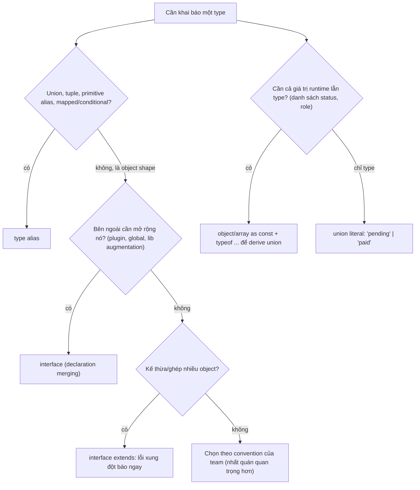

## Bối cảnh & vấn đề

Ba cuộc tranh luận lặp lại ở gần như mọi team TypeScript. Thứ nhất: "dùng `type` hay `interface`?", thường kết thúc bằng "tuỳ sở thích", một câu trả lời sai một nửa. Thứ hai: hằng số trạng thái đơn hàng nên là `enum OrderStatus`, một union `"pending" | "paid"`, hay một object `as const`? Lựa chọn này ảnh hưởng tới JSON, DB, bundle size, và từ Node 22.18+/23.6+ còn quyết định file `.ts` có **chạy được** trực tiếp hay không. Thứ ba: một API PATCH nhận `{ nickname?: string }`. Client gửi `{"nickname": null}` để xoá nickname, và `{}` để giữ nguyên. Type `nickname?: string` không phân biệt được "không gửi" và "gửi `undefined`", và bug thường chỉ lộ ra khi có user phàn nàn dữ liệu bị xoá.

Cả ba đều là câu hỏi về **cách khai báo type** chứ không phải logic. Nhưng chúng quyết định compiler bắt được lỗi nào. Bài này giải thích sự khác biệt thật giữa `type` và `interface` (declaration merging, cách báo lỗi khi xung đột), cách TypeScript suy ra literal type và khi nào nó "widen", ba công cụ bất biến (`as const`, `Readonly`, `Object.freeze`) khác nhau ra sao, và cách mô hình hoá optional property chính xác.

**Interview angle:** interviewer hỏi "type vs interface" không để nghe bảng so sánh; họ muốn nghe **declaration merging** (và ví dụ augment `Express.Request`), cùng lý do interface báo lỗi xung đột sớm hơn intersection.

## Khái niệm

### type alias

`type X = ...` đặt **tên** cho một type bất kỳ: primitive (`type Id = string`), union, tuple, function, object, mapped hay conditional type. Nó **không tạo type mới**; `Id` và `string` là một. Alias là "đóng" (closed): khai báo lại cùng tên là lỗi `Duplicate identifier`. Vì biểu diễn được union và các phép biến đổi ở tầng type, `type` là công cụ cho **logic của type system**: state machine, kết quả API success/error, utility type.

### interface

`interface X { ... }` mô tả **shape của object** (bao gồm cả call signature, index signature, method overload). Hai đặc điểm phân biệt nó với `type`. Một là **declaration merging**: khai báo cùng tên nhiều lần (kể cả ở file khác, trong `declare global` hay `declare module`), TypeScript **gộp** chúng thành một. Hai là `extends` **kiểm tra xung đột ngay**: `interface B extends A { x: number }` khi `A` có `x: string` là lỗi `TS2430` tại chỗ khai báo.

Interface không biểu diễn được union, tuple hay conditional type, và không thể `extends` một union. Cả hai đều dùng được với `implements` của class (với `type` là object type) và đều bị xoá hoàn toàn lúc runtime; ghi chú rằng "interface có tồn tại ở runtime" là sai.

### Intersection & và xung đột âm thầm

`A & B` (intersection) là giao của hai tập: giá trị phải thoả cả hai. Với object, kết quả có mọi property của cả hai. Khi cùng một property có type không tương thích (`x: string` và `x: number`), intersection **không báo lỗi** ở khai báo; property đó thành `string & number`, tức `never`, và lỗi chỉ lộ ra khi bạn cố tạo giá trị. Đây là lý do nhiều style guide nói "dùng `interface extends` cho object kế thừa". TypeScript performance wiki cũng khuyến nghị interface thay vì intersection lớn, vì quan hệ giữa các interface được cache, còn intersection phải tính lại mỗi lần.

### Declaration merging và module augmentation

**Declaration merging** là cơ chế cho phép bên ngoài **mở rộng** một interface đã có. Thư viện dùng nó làm điểm mở rộng: `Express.Request`, `Window`, `NodeJS.ProcessEnv`, `Fastify.FastifyRequest`. Khi bạn viết `declare global { namespace Express { interface Request { user?: AuthUser } } }` trong một file `.d.ts`, interface `Request` của `@types/express` và của bạn được gộp. Với `type`, điều này không thể: bạn không mở rộng được type của người khác.

Có hai điều kiện để merging có hiệu lực: file phải nằm trong `include`/`files` của tsconfig mà **CI dùng** (không chỉ IDE thấy), và nếu file augmentation là module (có `import`/`export`), phần global phải nằm trong `declare global`. Augmentation là **toàn cục**: mọi handler, kể cả route công khai, đều "có" `req.user`.

### Literal type và widening

**Literal type** là type chỉ gồm đúng một giá trị: `"admin"`, `42`, `true`. TypeScript suy ra literal khi biến không thể đổi: `const role = "admin"` có type `"admin"`. Với `let role = "admin"`, type được **widen** thành `string` vì bạn có thể gán lại. Property của object cũng bị widen: `const u = { role: "admin" }` cho `u.role: string`, vì property của object mutable. Widening là lý do `const u = { status: "paid" }` không gán được vào `{ status: "paid" | "pending" }` khi truyền qua biến.

### as const

`as const` (const assertion) nói với compiler: "suy ra type **hẹp nhất** có thể". Cụ thể: literal không bị widen, mọi property thành `readonly` **ở mọi tầng**, array thành **readonly tuple**. `["admin", "staff"] as const` có type `readonly ["admin", "staff"]`, và `(typeof ROLES)[number]` cho union `"admin" | "staff"`. Đây là cách phổ biến nhất để có **một nguồn sự thật** vừa là giá trị runtime (để iterate, validate) vừa là type. Nó chỉ tác động lúc compile; runtime không freeze gì cả.

### Readonly<T> và Object.freeze

`Readonly<T>` là mapped type thêm `readonly` vào **tầng đầu tiên** của property. Nó không đổi `number` thành literal, và object lồng bên trong vẫn sửa được. `Object.freeze(obj)` là **runtime**: nó chặn ghi vào object (throw `TypeError` trong strict mode, ESM luôn strict), nhưng cũng chỉ **shallow**. Type trả về của `freeze` là `Readonly<T>`. Muốn bất biến sâu thật sự lúc runtime, phải freeze đệ quy; muốn bất biến sâu lúc compile, dùng `as const` hoặc một `DeepReadonly` tự viết.

### enum, const enum và các thay thế

`enum Status { Pending, Paid }` là một trong ít cú pháp TypeScript **sinh code runtime**: nó biên dịch thành một object. Numeric enum có **reverse mapping** (`Status[0] === "Pending"`) và nhận **bất kỳ biến `number` nào** (từ TS 5.0, literal ngoài tập như `42` mới bị chặn). String enum không có reverse mapping và **nominal một phần**: `const s: Status = "PAID"` là lỗi, bạn phải viết `Status.Paid`, gây khó chịu khi dữ liệu đến từ JSON/DB.

Vì sinh code, enum **không phải erasable syntax**. Node type stripping (strip-only) từ chối chạy nó với `ERR_UNSUPPORTED_TYPESCRIPT_SYNTAX`, và flag `erasableSyntaxOnly` (TS 5.8) biến nó thành lỗi compile. `const enum` được inline lúc compile nhưng cần thông tin cross-file, nên gãy với transpiler từng file (`isolatedModules`, swc, esbuild) và khi publish `.d.ts`. Thay thế phổ biến hiện nay: **object `as const` + union type cùng tên**, cho cả giá trị runtime lẫn type, và không sinh cú pháp đặc biệt nào.

### Optional property và exactOptionalPropertyTypes

`age?: number` nghĩa là key **có thể vắng mặt**; mặc định TypeScript cũng chấp nhận `{ age: undefined }`. `age: number | undefined` nghĩa là key **bắt buộc có mặt**, giá trị có thể là `undefined`. Hai cái khác nhau về hành vi runtime: `"age" in obj`, `Object.keys` và `hasOwnProperty` thấy key có giá trị `undefined`, nhưng `JSON.stringify` bỏ nó đi.

Bật `exactOptionalPropertyTypes`, `age?: number` **không** nhận `undefined` gán tường minh nữa; muốn nhận, phải viết `age?: number | undefined`. Flag này không nằm trong `strict` vì nó làm vỡ nhiều code và `.d.ts` cũ, nhưng rất đáng giá cho API PATCH, nơi "không gửi" (giữ nguyên) và "gửi null" (xoá) là hai ý nghĩa khác nhau.

**Interview angle:** câu "`?:` và `| undefined` có tương đương?" có đáp án chuẩn là "gần như, trừ ba chỗ: key bắt buộc có mặt, hành vi `in`/`Object.keys`, và `exactOptionalPropertyTypes`".

## Cơ chế hoạt động

Quyết định chọn cách khai báo có thể đi theo cây sau:



Nhánh trên trả lời "type hay interface"; nhánh dưới trả lời "enum hay gì khác". Chú ý rằng không nhánh nào kết thúc ở `enum`: không có use case nào mà `as const` object + union không làm được, trong khi enum thêm chi phí runtime và chặn type stripping.

Declaration merging diễn ra khi compiler xây **symbol table**: mọi khai báo `interface Request` trong cùng scope (ở đây là namespace global `Express`) được gom vào **một symbol**, và các member được gộp. Nếu hai khai báo cùng định nghĩa một property với type khác nhau, đó là lỗi `TS2717` (subsequent property declarations must have the same type). Với method, các khai báo sau được xếp như **overload** lên trước. Vì symbol table được xây từ **mọi file trong program**, file augmentation không được include thì với compiler nó không tồn tại, dù IDE có thể vẫn thấy nếu mở file đó.

## Ví dụ thực tế

### type và interface khi xung đột (tsc 5.9)

```ts
interface Box { a: string }
interface Box { b: number }
const bx: Box = { a: "x" };               // thiếu b: merging đã xảy ra
type T1 = { a: string };
type T1 = { b: number };                  // alias không merge
interface A { x: string }
interface B extends A { x: number }       // xung đột: báo ngay
type C = { x: string } & { x: number };   // xung đột: im lặng
const c: C = { x: "s" };
type Status = "idle" | "loading";
interface Bad extends Status {}
```

```text
ti.ts(3,7): error TS2741: Property 'b' is missing in type '{ a: string; }' but required in type 'Box'.
ti.ts(4,6): error TS2300: Duplicate identifier 'T1'.
ti.ts(5,6): error TS2300: Duplicate identifier 'T1'.
ti.ts(7,11): error TS2430: Interface 'B' incorrectly extends interface 'A'.
  Types of property 'x' are incompatible.
    Type 'number' is not assignable to type 'string'.
ti.ts(9,16): error TS2322: Type 'string' is not assignable to type 'never'.
ti.ts(11,23): error TS2312: An interface can only extend an object type or intersection of object types with statically known members.
```

Để ý vị trí lỗi: với `interface extends` lỗi ở dòng 7 (khai báo), với intersection lỗi ở dòng 9 (nơi dùng), và thông báo nói về `never` chứ không nói "hai type xung đột".

### Augment Express Request, và khi CI không thấy augmentation

```ts
// src/types/express.d.ts
import type { AuthUser } from "../auth.js";
declare global {
  namespace Express {
    interface Request { user?: AuthUser; tenantId?: string }
  }
}
export {};
```

```ts
// src/app.ts
app.get("/me", (req, res) => { res.json({ id: req.user.id }); });   // user là optional
type AuthedRequest = Request & { user: AuthUser; tenantId: string };
const authed = (h: (req: AuthedRequest, res: Response) => unknown): RequestHandler =>
  (req, res, next) => {
    if (!req.user || !req.tenantId) { res.status(401).end(); return; }
    Promise.resolve(h(req as AuthedRequest, res)).catch(next);
  };
app.get("/orders", authed((req, res) => res.json({ tenant: req.tenantId, user: req.user.id })));
```

```text
$ tsc -p tsconfig.json            # include: ["src/**/*.ts"]
src/app.ts(4,47): error TS18048: 'req.user' is possibly 'undefined'.

$ tsc -p tsconfig.ci.json         # files: ["src/app.ts"]  (quên include .d.ts)
src/app.ts(4,51): error TS2339: Property 'user' does not exist on type 'Request<{}, any, any, ParsedQs, Record<string, any>>'.
...
```

Lần chạy đầu: augmentation hoạt động, và vì `user` optional nên handler phải check; wrapper `authed` kiểm tra một lần rồi trao cho handler một type mà `user` **bắt buộc**, không cần `!` ở mỗi route. Lần chạy thứ hai mô phỏng tsconfig của CI chỉ liệt kê entry file: `.d.ts` không nằm trong program nên `user` "biến mất". Lỗi kiểu "IDE thấy, CI không thấy" gần như luôn do `include`/`files`/`typeRoots`. (Chi tiết Express middleware ở track [Express](/tracks/express).)

### PATCH: phân biệt "không gửi" và "xoá"

```ts
interface Patch { nickname?: string }
const a: Patch = {};
const b: Patch = { nickname: undefined };     // lỗi chỉ khi bật exactOptionalPropertyTypes
console.log("nickname" in a, "nickname" in b, JSON.stringify(b), Object.keys(b));
```

```text
$ tsc --strict --exactOptionalPropertyTypes opt.ts
opt.ts(4,7): error TS2375: Type '{ nickname: undefined; }' is not assignable to type 'Patch' with 'exactOptionalPropertyTypes: true'. Consider adding 'undefined' to the types of the target's properties.
$ node opt.ts
false true {} [ 'nickname' ]
```

`b` có key `nickname` (thấy qua `in` và `Object.keys`) nhưng `JSON.stringify` làm mất nó. Mô hình đúng cho PATCH là tách ba trạng thái bằng type: vắng mặt = giữ, `null` = xoá, giá trị = cập nhật.

```ts
type UserPatch = { nickname?: string | null; age?: number };
function toSql(p: UserPatch) {
  const sets: string[] = [];
  if ("nickname" in p) sets.push(p.nickname === null ? "nickname = NULL" : `nickname = '${p.nickname}'`);
  if (p.age !== undefined) sets.push(`age = ${p.age}`);
  return sets.join(", ") || "(no-op)";
}
console.log(toSql({}));
console.log(toSql({ nickname: null }));
console.log(toSql({ nickname: "Bo", age: 30 }));
```

```text
(no-op)
nickname = NULL
nickname = 'Bo', age = 30
```

(Đoạn code nối chuỗi SQL chỉ để minh hoạ; code thật dùng parameterized query.) Với `exactOptionalPropertyTypes`, `{ nickname: undefined }` không còn là một `UserPatch` hợp lệ, nên nhánh `"nickname" in p` không bao giờ nhận `undefined` từ code TypeScript. Dữ liệu từ `JSON.parse` vẫn cần schema, vì JSON không có `undefined` nhưng client có thể gửi bất cứ gì.

### as const, Readonly và Object.freeze

```ts
const ROLES = ["admin", "staff", "customer"] as const;
type Role = (typeof ROLES)[number];            // "admin" | "staff" | "customer"
const cfg = { retries: 3, db: { host: "pg" } } as const;
const ro: Readonly<{ retries: number; db: { host: string } }> = { retries: 3, db: { host: "pg" } };
ro.db.host = "x";      // Readonly một tầng: cho phép
cfg.db.host = "x";     // as const sâu: lỗi
const fz = Object.freeze({ retries: 3, db: { host: "pg" } });
fz.db.host = "changed"; // freeze shallow: compile và chạy được
console.log(fz.db.host);
try { (fz as any).retries = 9; } catch (e) { console.log((e as Error).message); }
const r: Role = "owner";
```

```text
constants.ts(6,8): error TS2540: Cannot assign to 'host' because it is a read-only property.
constants.ts(11,7): error TS2322: Type '"owner"' is not assignable to type '"admin" | "staff" | "customer"'.
$ node constants.ts        # sau khi bỏ hai dòng lỗi
changed
Cannot assign to read only property 'retries' of object '#<Object>'
```

### enum dưới type stripping

```ts
enum Role { Admin, User }
enum Status { Pending = "PENDING", Paid = "PAID" }
console.log(Role, Status);
export const OrderStatus = { Pending: "pending", Paid: "paid" } as const;
export type OrderStatus = (typeof OrderStatus)[keyof typeof OrderStatus];
const s: OrderStatus = "paid";                 // nhận thẳng string từ JSON/DB
console.log(Object.values(OrderStatus));
```

```text
$ node enum.ts
SyntaxError [ERR_UNSUPPORTED_TYPESCRIPT_SYNTAX]: TypeScript enum is not supported in strip-only mode
$ tsc --noEmit --erasableSyntaxOnly enum.ts
enum.ts(1,6): error TS1294: This syntax is not allowed when 'erasableSyntaxOnly' is enabled.
enum.ts(2,6): error TS1294: This syntax is not allowed when 'erasableSyntaxOnly' is enabled.
$ node --experimental-transform-types enum.ts
{ '0': 'Admin', '1': 'User', Admin: 0, User: 1 } { Pending: 'PENDING', Paid: 'PAID' }
[ 'pending', 'paid' ]
```

Output của `console.log(Role)` cho thấy reverse mapping của numeric enum. Chạy trên Node 24.21; hành vi strip-only mặc định có từ Node 22.18/23.6 (verify với version của bạn).

## Trade-offs & lựa chọn thay thế

| Lựa chọn | Runtime | Nhận string từ JSON/DB | Iterate được | Erasable (Node strip, `erasableSyntaxOnly`) | Ghi chú |
|---|---|---|---|---|---|
| `enum` numeric | Object + reverse mapping | Không (là số) | Có, nhưng lẫn key số | Không | Nhận mọi biến `number`: unsound |
| `enum` string | Object | Không, phải `Status.Paid` | Có | Không | Nominal một phần, khó dùng với JSON |
| `const enum` | Inline, không object | Không | Không | Không | Gãy với `isolatedModules`, `.d.ts` publish |
| Union literal | Không có | Có | Không | Có | Đơn giản nhất nếu không cần danh sách runtime |
| Object `as const` + union | Object thường | Có | Có (`Object.values`) | Có | Lựa chọn mặc định hiện nay |
| `interface` | Không | n/a | n/a | Có | Object contract, augmentation, extends báo lỗi sớm |
| `type` | Không | n/a | n/a | Có | Union, tuple, mapped, conditional |

Chọn thế nào: cho hằng số domain (status, role, permission), dùng **object `as const`** hoặc **array `as const`** rồi derive union; bạn có danh sách runtime để validate (`z.enum(ROLES)`), autocomplete, và code chạy được dưới mọi transpiler. Chỉ giữ `enum` khi codebase cũ đã dùng rộng và chi phí migrate lớn hơn lợi ích. Với object shape, `interface` là default hợp lý (merging, lỗi `extends` rõ, performance tốt hơn intersection lớn); `type` cho mọi thứ có logic. Điều quan trọng nhất là **một quy ước**, được lint (`@typescript-eslint/consistent-type-definitions`) thay vì tranh luận trong mỗi PR.

## Edge cases & failure modes

- **Merging vô tình**: đặt tên `interface Request` trong file global script (không có `import`/`export`) gộp với `Request` của Fetch API trong `lib.dom.d.ts`. Luôn biến file thành module hoặc đặt trong namespace.
- **Augmentation cho version sai**: `@types/express` v4 và v5 khai báo khác nhau; augmentation vào `express-serve-static-core` so với `Express` namespace. Khi nâng version, augmentation có thể "không ăn" mà không báo lỗi.
- **`as const` với array dùng như `string[]`**: `readonly ["a", "b"]` không gán được cho `string[]` (mutable). Hàm nhận tham số nên khai báo `readonly string[]`.
- **Numeric enum và dữ liệu ngoài**: `setRole(n)` với `n: number` từ request compile vô tư, kể cả `n = 42`. Enum không validate gì lúc runtime.
- **`JSON.stringify` và `undefined`**: field `undefined` biến mất khỏi payload, nên "gửi undefined để xoá" không bao giờ tới server. Dùng `null` cho "xoá".
- **Optional + default trong destructuring**: `function f({ page = 1 }: { page?: number })` nhận `{ page: undefined }` và dùng default 1; dưới `exactOptionalPropertyTypes` caller không truyền được `undefined` nữa, nên các wrapper chuyển tiếp `opts` có thể vỡ khi bật flag.
- **Intersection với discriminant mâu thuẫn**: `{ kind: "a" } & { kind: "b" }` bị giản lược thành `never` cho **cả object** (TS 3.9+), không chỉ property; lỗi ở chỗ dùng rất khó đọc.

## Pitfalls

- ❌ "type và interface giống hệt nhau, chỉ là sở thích" → ✅ interface có declaration merging và báo lỗi `extends` sớm; type biểu diễn được union/tuple/conditional. Chọn một convention và lint nó.
- ❌ Ghép object bằng `A & B & C` lớn và lồng nhau → ✅ `interface X extends A, B, C`: lỗi xung đột rõ hơn, compiler cache được quan hệ.
- ❌ Augment `Request` với `user: AuthUser` (bắt buộc) → ✅ để optional trong augmentation toàn cục, và dùng wrapper/type riêng cho route đã qua auth.
- ❌ Dùng `enum` mới trong code chạy bằng Node type stripping → ✅ object `as const` + union; bật `erasableSyntaxOnly` để CI chặn sớm.
- ❌ Tin `Object.freeze` hoặc `Readonly` là bất biến sâu → ✅ cả hai đều shallow; `as const` sâu nhưng chỉ lúc compile.
- ❌ Dùng `nickname?: string` cho PATCH rồi coi `undefined` là "xoá" → ✅ `nickname?: string | null` + `exactOptionalPropertyTypes`, và validate runtime vì JSON không có `undefined`.
- ❌ `let status = "paid"` rồi truyền vào hàm nhận `"paid" | "pending"` → ✅ `const`, `as const`, hoặc annotate; `let` widen thành `string`.

## Tóm tắt

- `type` đặt tên cho mọi type (union, tuple, mapped, conditional); `interface` mô tả object shape, **merge** được và báo lỗi `extends` ngay tại khai báo.
- Intersection với property xung đột cho `never` âm thầm; ưu tiên `interface extends` cho kế thừa object.
- Declaration merging là cách augment `Express.Request`, `Window`, `ProcessEnv`; file `.d.ts` phải nằm trong program của CI, và augmentation là toàn cục.
- `const` giữ literal, `let` và property object bị widen; `as const` giữ literal + readonly sâu + tuple, chỉ lúc compile.
- `Readonly<T>` một tầng, `Object.freeze` runtime nhưng shallow.
- `enum` sinh code, không erasable, numeric enum unsound; mặc định dùng object `as const` + union.
- `?:` cho key có thể vắng, `| undefined` cho key bắt buộc; `exactOptionalPropertyTypes` tách "không gửi" khỏi "gửi undefined", hữu ích cho PATCH.
