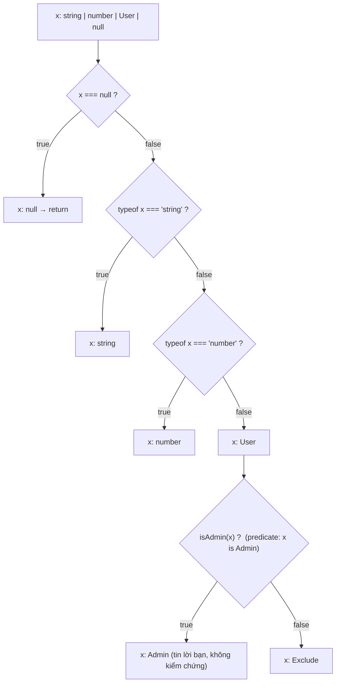
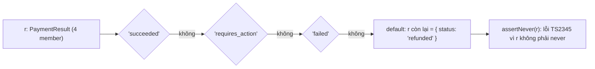

## Bối cảnh & vấn đề

Một màn hình checkout giữ state bằng "túi optional": `{ loading: boolean; data?: Order; error?: string }`. Theo type, cả bốn tổ hợp đều hợp lệ, kể cả `loading: true` cùng lúc với `error` và `data`. Một lần refactor quên reset `error` khi retry, và user thấy banner lỗi đỏ nằm ngay trên đơn hàng vừa đặt thành công. Không ai sai logic ở từng dòng; **type cho phép trạng thái không thể xảy ra**.

Ở backend, một service gọi payment provider nhận về `status: "succeeded" | "requires_action" | "failed"`. Provider thêm `"refunded"`, team cập nhật type nhưng quên một trong năm chỗ `switch`. Hàm đó rơi xuống nhánh cuối, trả `undefined`, và một đơn hoàn tiền bị ghi nhận là "đã thanh toán". Với **discriminated union** và **exhaustive check**, chỗ quên đó là một lỗi compile, không phải một incident.

Hai công cụ đứng sau: **narrowing** (compiler thu hẹp type của một biến dựa trên các câu kiểm tra trong control flow) và **discriminated union** (union các object có một field literal chung để phân nhánh). Bài này giải thích cơ chế, các loại guard, chỗ nào compiler **tin bạn mà không kiểm tra** (type predicate, assertion function), và thay đổi của TS 5.5 với `filter`.

**Interview angle:** câu hỏi thực chất là "làm sao để compiler ép bạn xử lý mọi trường hợp", và follow-up là "type guard sai thì sao", nơi phân biệt người hiểu soundness với người chỉ thuộc cú pháp.

## Khái niệm

### Control flow analysis

**Narrowing** là việc compiler tính type của một biến **tại từng điểm** trong code, dựa trên các nhánh đã đi qua. Biến `x: string | number` bên trong `if (typeof x === "string") { ... }` có type `string`; sau một `return` sớm trong nhánh đó, phần code còn lại thấy `x: number`. Compiler làm điều này bằng **control flow analysis**: nó dựng đồ thị các nhánh (if, switch, return, throw, `&&`, `||`, `?:`) và ở mỗi node, loại khỏi union những member không thể tới được đó.

Narrowing chỉ áp dụng cho **reference** mà compiler theo dõi được: biến local, parameter, property access với tên cố định (`r.status`). Nó bị **reset** khi có phép gán mới vào chính reference đó. Điều nhiều người không ngờ: một lời gọi function (hay `await`) ở giữa **không** huỷ narrowing của property, dù function đó có thể đã mutate object. Đây là một đánh đổi thực dụng có chủ đích (nếu huỷ, gần như mọi narrowing trên property đều vô dụng), và nó là một chỗ unsound; chi tiết ở phần edge cases.

### Các loại guard có sẵn

- `typeof x === "string" | "number" | "bigint" | "boolean" | "symbol" | "undefined" | "object" | "function"`. Lưu ý `typeof null === "object"`, nên `typeof x === "object"` vẫn còn `null`.
- `x instanceof Date`: narrow theo prototype chain; chỉ dùng được với class (value), không với `interface`/`type`.
- `"email" in x`: narrow union object theo sự **có mặt** của key; từ TS 4.9 còn narrow được `unknown`/`object` thành `object & Record<"email", unknown>`.
- Equality: `x === null`, `x !== undefined`, `x == null` (bắt cả hai).
- Truthiness: `if (x)` loại `null`, `undefined`, nhưng cũng loại `""`, `0`, `NaN`, `false`: nguồn bug kinh điển.
- `Array.isArray(x)`, và **discriminant**: `r.status === "failed"` narrow cả object `r` về member có `status: "failed"`.

### Discriminated union

**Discriminated union** (tagged union) là union các object type cùng có một property **literal** (thường tên `kind`, `type`, `status`), mỗi member một giá trị khác nhau. Khi so sánh property đó với một literal, compiler chọn đúng member, và mọi property riêng của member đó dùng được mà không cần `?.`. Đây là cách biểu diễn state machine: `{ status: "loading" } | { status: "success"; data: Order } | { status: "error"; message: string }` loại bỏ hẳn các tổ hợp vô nghĩa của "túi optional".

Từ TS 4.6, destructure discriminant ra biến riêng (`const { status } = r; if (status === "failed") r.reason`) vẫn narrow được `r`, miễn là cả hai là `const`/không bị gán lại.

### Exhaustiveness bằng never

Sau khi `switch` đã xử lý mọi member, ở nhánh `default` biến bị narrow thành `never` (tập rỗng). Gán nó vào một biến kiểu `never`, hoặc truyền vào `assertNever(x: never)`, là hợp lệ. Khi ai đó thêm member mới, nhánh `default` không còn là `never` nữa, và phép gán thành **lỗi compile** chỉ đúng vị trí cần sửa. Hàm `assertNever` nên `throw` lúc runtime, vì dữ liệu thật (từ provider, từ DB, từ client cũ) có thể chứa giá trị mà type không biết.

### Type predicate: x is T

Một function trả `x is User` (**type predicate**) nói với compiler: "nếu tôi trả `true`, hãy coi `x` là `User` trong nhánh đó". Nó cho phép đóng gói logic kiểm tra phức tạp thành một guard tái sử dụng. Điểm quan trọng nhất: compiler **không kiểm tra** thân hàm có thực sự chứng minh `x` là `User` hay không. Một guard chỉ check `"id" in x` mà khẳng định `x is User` (có `email: string`) là hoàn toàn hợp lệ với compiler, và là một lỗ **unsound** tự tạo.

### Assertion function: asserts x is T

**Assertion function** (TS 3.7) có signature `asserts x is T` (hoặc `asserts condition`): nếu hàm return bình thường thì `x` là `T` cho **mọi code phía sau** lời gọi; nếu không đúng, hàm phải `throw`. Khác với predicate (narrow trong nhánh `if`), assertion narrow theo dòng chảy tuyến tính, nên hợp với precondition: `assertDefined(user, "user not found")`. Có một ràng buộc kỹ thuật: lời gọi assertion phải qua một **tên có type tường minh** (function declaration, hoặc `const` có annotation). Gọi qua một arrow `const` chỉ được infer type sẽ báo `TS2775`, vì compiler cần biết signature assertion **trước** khi phân tích control flow, để tránh vòng lặp suy luận.

### Inferred type predicates (TS 5.5)

Trước TS 5.5, `ids.filter((x) => x !== undefined)` vẫn trả `(string | undefined)[]`, vì callback trả `boolean`, không phải predicate. TS 5.5 tự **suy ra** type predicate cho function không có return type annotation, chỉ có một `return`, không mutate tham số, và trả một biểu thức boolean liên quan tới narrowing của tham số. Điều kiện then chốt: predicate chỉ được suy ra khi nó đúng **cả hai chiều**: `true` nghĩa là `x` là `T`, và `false` nghĩa là `x` **không** là `T`. `(x) => !!x` trên `string | undefined` không thoả chiều thứ hai (vì `""` cho `false` nhưng vẫn là `string`), nên không có predicate. `Boolean` thì là constructor với signature `(value?: unknown) => boolean`, không bao giờ là predicate.

**Interview angle:** "vì sao `filter(Boolean)` không narrow" có ba lớp đáp án: signature của `Boolean`, điều kiện "if and only if" của inferred predicate, và bug thật `Boolean` loại mất `0` và `""`.

## Cơ chế hoạt động

Với một biến `x: string | number | User | null`, compiler theo dõi type qua từng nhánh:



Mỗi node quyết định cắt union thành hai phần: phần thoả điều kiện đi nhánh `true`, phần còn lại đi nhánh `false`. Với built-in guard (`===`, `typeof`), compiler **biết** ngữ nghĩa nên việc cắt là chính xác. Với predicate tự viết (node cuối), compiler chỉ áp dụng signature: nhánh `true` nhận `Admin`, nhánh `false` nhận phần còn lại. Nếu logic bên trong `isAdmin` sai, cả hai nhánh đều sai theo, và không có cảnh báo nào.

Exhaustive check dùng đúng cơ chế đó ở cuối chuỗi:



Khi cả bốn case được xử lý, `r` ở `default` là `never` và `assertNever(r)` compile. Thiếu một case, phần còn lại lọt xuống `default`, và lỗi chỉ đúng member bị quên.

## Ví dụ thực tế

### Exhaustive switch bắt variant mới

```ts
type PaymentResult =
  | { status: "succeeded"; chargeId: string }
  | { status: "requires_action"; redirectUrl: string }
  | { status: "failed"; reason: string }
  | { status: "refunded"; refundId: string };           // variant mới
function assertNever(x: never): never { throw new Error(`Unhandled variant: ${JSON.stringify(x)}`); }
function handle(r: PaymentResult): string {
  switch (r.status) {
    case "succeeded": return `ok ${r.chargeId}`;
    case "requires_action": return `redirect ${r.redirectUrl}`;
    case "failed": return `fail ${r.reason}`;
    default: return assertNever(r);
  }
}
function destructured(r: PaymentResult) {
  const { status } = r;
  if (status === "failed") return r.reason;               // TS 4.6+: vẫn narrow r
}
```

```text
union.ts(12,33): error TS2345: Argument of type '{ status: "refunded"; refundId: string; }' is not assignable to parameter of type 'never'.
```

Lỗi nói rõ member nào chưa được xử lý. Nếu hàm có return type `string` và **không** có nhánh `default`, TypeScript cũng báo "Function lacks ending return statement" (`TS2366`), nhưng với hàm `void` thì không; `assertNever` hoạt động cho mọi trường hợp. Lint rule `@typescript-eslint/switch-exhaustiveness-check` là lớp bảo vệ thứ hai.

### Assertion function và lỗi TS2775

```ts
type User = { id: string; email: string };
declare function find(id: string): Promise<User | null>;
function assertDefined<T>(v: T, msg: string): asserts v is NonNullable<T> {
  if (v == null) throw new Error(msg);
}
const assertDefinedArrow = <T,>(v: T, msg: string): asserts v is NonNullable<T> => {
  if (v == null) throw new Error(msg);
};
const typedAssert: <T>(v: T, msg: string) => asserts v is NonNullable<T> = assertDefinedArrow;
export async function main() {
  const u1 = await find("1");  assertDefined(u1, "nf");       u1.email;
  const u2 = await find("2");  assertDefinedArrow(u2, "nf");  u2.email;
  const u3 = await find("3");  typedAssert(u3, "nf");         u3.email;
}
```

```text
assert.ts(14,3): error TS2775: Assertions require every name in the call target to be declared with an explicit type annotation.
assert.ts(14,33): error TS18047: 'u2' is possibly 'null'.
```

Function declaration (`u1`) và `const` có annotation (`u3`) đều narrow. Arrow `const` **không** annotation (`u2`) bị từ chối, dù bản thân arrow có ghi `asserts`: annotation phải nằm trên **biến**, không phải trên giá trị.

### filter(Boolean) và inferred predicates

```ts
const ids: (string | undefined)[] = ["a", undefined, "b", ""];
const a = ids.filter(Boolean);
const b = ids.filter((x) => x !== undefined);
const c = ids.filter((x): x is string => !!x);
const d = ids.filter((x) => !!x);
const nums = [0, 1, 2, undefined];
const e = nums.filter(Boolean);
const f = nums.filter((x) => typeof x === "number");
console.log(a, b, e, f);
```

Type do compiler suy ra (in bằng TypeScript compiler API), so sánh hai version:

```text
            TS 5.4                      TS 5.9
a:  (string | undefined)[]     (string | undefined)[]
b:  (string | undefined)[]     string[]
c:  string[]                   string[]
d:  (string | undefined)[]     (string | undefined)[]
e:  (number | undefined)[]     (number | undefined)[]
f:  (number | undefined)[]     number[]

$ node filter.ts
[ 'a', 'b' ] [ 'a', 'b', '' ] [ 1, 2 ] [ 0, 1, 2 ]
```

`b` và `f` được narrow từ 5.5 nhờ inferred predicate. `a`, `d`, `e` không bao giờ narrow. Output runtime cho thấy cái giá thật của `Boolean`: `""` và `0` biến mất. Với mảng số hoặc chuỗi có thể rỗng, luôn so sánh tường minh với `undefined`/`null`. Predicate tường minh (`c`) hoạt động trên mọi version, nhưng `!!x` bên trong là một lời nói dối nhỏ: nó loại `""` trong khi khẳng định chỉ loại `undefined`.

### Narrow `catch (e)`: đọc message an toàn

Dưới `strict`, `catch (e)` có type `unknown` (`useUnknownInCatchVariables`), vì JavaScript cho phép `throw` **bất kỳ giá trị nào**. Một helper nhỏ kết hợp ba loại guard:

```ts
function errorMessage(e: unknown): string {
  if (e instanceof Error) return e.message;
  if (typeof e === "object" && e !== null && "message" in e && typeof e.message === "string") return e.message;
  return String(e);
}
const throwers: (() => never)[] = [
  () => { throw new TypeError("bad input"); },
  () => { throw "plain string"; },
  () => { throw { message: "from a lib", code: 42 }; },
  () => { throw null; },
];
for (const t of throwers) {
  try { t(); } catch (e) { console.log(errorMessage(e)); }
}
try { throw null; } catch (e) { try { console.log((e as Error).message); } catch (inner) { console.log("handler crashed:", String(inner)); } }
function unsafe() { try { throw "x"; } catch (e) { return e.message; } }
```

```text
catch.ts(18,59): error TS18046: 'e' is of type 'unknown'.
$ node catch.ts        # sau khi bỏ hàm unsafe
bad input
plain string
from a lib
null
handler crashed: TypeError: Cannot read properties of null (reading 'message')
```

`instanceof Error` bắt trường hợp phổ biến; `in` + `typeof` (TS 4.9 narrow được `e.message` sau `"message" in e`) bắt object "giống error" mà một số thư viện throw; `String(e)` là lưới cuối. Dòng cuối cho thấy vì sao `(e as Error).message` nguy hiểm: `as` làm compiler im lặng, và chính error handler crash khi gặp `throw null`, che mất lỗi gốc. `unsafe()` là thứ `useUnknownInCatchVariables` chặn được. Đây là follow-up của câu "any vs unknown" trong [bài nền tảng](/tracks/typescript/learn/type-system-foundations).

### Type guard viết sai và cách sửa

```ts
interface User { id: string; email: string }
function isUser(x: unknown): x is User {
  return typeof x === "object" && x !== null && "id" in x;
}
const payload: unknown = JSON.parse('{"id":"u1","email":null}');
try {
  if (isUser(payload)) console.log(payload.email.toLowerCase());
} catch (e) { console.log(String(e)); }
function isUserStrict(x: unknown): x is User {
  return typeof x === "object" && x !== null &&
    "id" in x && typeof x.id === "string" &&
    "email" in x && typeof x.email === "string";
}
console.log(isUserStrict(payload));
const isStr = (x: unknown) => typeof x === "string";   // TS 5.5: (x: unknown) => x is string
```

```text
$ tsc --noEmit --strict guard.ts     # không lỗi nào
$ node guard.ts
TypeError: Cannot read properties of null (reading 'toLowerCase')
false
```

Compiler không phàn nàn gì về `isUser`, dù nó chỉ kiểm tra `id`. Bản `isUserStrict` dùng narrowing của `in` (TS 4.9+) để kiểm tra từng field. Nhưng mỗi lần `User` thêm field, cả hai bản đều phải sửa tay, và không có gì nhắc bạn. Cách bền vững là sinh cả guard lẫn type từ **một schema** (`UserSchema.safeParse`), nội dung của bài [runtime validation](/tracks/typescript/learn/runtime-validation-contracts).

## Trade-offs & lựa chọn thay thế

| Công cụ | Compiler kiểm chứng logic? | Phạm vi narrow | Dùng khi | Rủi ro |
|---|---|---|---|---|
| `typeof`/`instanceof`/`in`/`===` | Có | Trong nhánh | Kiểm tra đơn giản, tại chỗ | `typeof null`, truthiness loại `0`/`""` |
| Discriminant (`r.kind === ...`) | Có | Cả object | State, event, result có nhiều dạng | Discriminant phải là literal |
| Type predicate `x is T` | **Không** | Trong nhánh | Đóng gói check phức tạp, `filter` | Guard sai = unsound, không cảnh báo |
| Assertion `asserts x is T` | **Không** | Mọi code phía sau | Precondition, invariant | Quên throw; TS2775 với arrow |
| Inferred predicate (TS 5.5+) | Có (điều kiện iff) | Trong nhánh | Callback `filter`/`find` đơn giản | Phụ thuộc version |
| Schema (`zod.safeParse`) | Có (schema là nguồn sự thật) | Kết quả parse | Dữ liệu ngoài process | Chi phí runtime, thêm dependency |

Chọn thế nào: trong code nội bộ, ưu tiên discriminated union và guard built-in, vì compiler kiểm chứng được. Khi cần predicate tự viết, giữ nó **nhỏ** và có unit test với dữ liệu xấu. Ở boundary (HTTP, queue, file), đừng viết guard tay cho object nhiều field; dùng schema. Assertion function hợp cho invariant (`assertDefined`, `assertNever`) hơn là kiểm tra shape.

## Edge cases & failure modes

- **Narrowing property không bị huỷ sau function call**: `if (order.status === "paid") { await refundAll(); order.status }` vẫn narrow là `"paid"` dù `refundAll` có thể đã đổi nó. TypeScript chọn tính thực dụng thay vì sound. Copy ra biến `const status = order.status` khi logic phụ thuộc thứ tự.
- **Narrowing mất trong callback**: một `let x: string | undefined` đã narrow bên ngoài lại là `string | undefined` bên trong callback nếu phía sau còn phép gán `x = ...` (callback có thể chạy sau lần gán đó), và bạn nhận `TS18048: 'x' is possibly 'undefined'`. Từ TS 5.4, closure tạo **sau** lần gán cuối cùng giữ được narrowing; với `const` thì không bao giờ có vấn đề (đã kiểm chứng trên tsc 5.9).
- **Discriminant không phải literal**: nếu một member có `status: string`, union không còn là discriminated, và `r.status === "failed"` không narrow được gì.
- **Dữ liệu runtime ngoài union**: exhaustive check chỉ đúng lúc compile. Provider gửi `"refunded"` trước khi code cập nhật thì runtime rơi xuống `default`; `assertNever` phải throw (hoặc log + đưa vào DLQ) thay vì trả `undefined`.
- **`in` với prototype**: `"toString" in obj` luôn `true` do prototype chain; `in` không phân biệt own property.
- **`instanceof` qua realm/package**: object từ iframe khác, `vm` context, hoặc từ bản copy thứ hai của package trong `node_modules` làm `instanceof` trả `false`. Discriminant field bền hơn.
- **Predicate trên generic**: `function isDefined<T>(x: T): x is NonNullable<T>` an toàn; nhưng `function isType<T>(x: unknown): x is T` (không có runtime info về `T`) luôn là nói dối.

## Pitfalls

- ❌ State dạng "túi optional" `{ loading; data?; error? }` → ✅ discriminated union theo `status`; trạng thái vô nghĩa trở thành không biểu diễn được.
- ❌ `switch` không có `default` và tin "đã đủ case" → ✅ `default: return assertNever(x)` để thêm variant là lỗi compile, và throw nếu runtime gặp giá trị lạ.
- ❌ Guard `x is User` chỉ check một field → ✅ check mọi field cần dùng, hoặc derive guard từ schema; viết test với payload thiếu/sai field.
- ❌ `arr.filter(Boolean)` trên `number[]` hoặc `string[]` → ✅ `arr.filter((x) => x !== undefined)`; `Boolean` loại mất `0` và `""`.
- ❌ Khai báo assertion bằng arrow không annotation → ✅ `function assertX(...)` hoặc `const assertX: Assert = ...`; nếu không sẽ gặp `TS2775`.
- ❌ `if (user)` để kiểm tra `number | undefined` → ✅ `if (user !== undefined)`; truthiness loại cả `0`.
- ❌ Nghĩ inferred predicate hoạt động cho mọi callback → ✅ chỉ khi không có return annotation, một `return`, và điều kiện đúng cả hai chiều; và chỉ từ TS 5.5.

## Tóm tắt

- Narrowing = control flow analysis: compiler cắt union tại mỗi nhánh dựa trên `typeof`, `instanceof`, `in`, equality, truthiness, discriminant.
- Discriminated union (field literal chung) biến state machine thành type; loại bỏ tổ hợp không hợp lệ của "túi optional".
- Exhaustive check: nhánh `default` gán vào `never`; thêm variant mới là lỗi compile. Runtime vẫn cần throw cho giá trị lạ.
- Type predicate (`x is T`) và assertion function (`asserts x is T`) **không được compiler kiểm chứng**; guard sai là unsound.
- Assertion function phải được gọi qua tên có type tường minh (tránh `TS2775`).
- TS 5.5 suy ra predicate cho callback đơn giản khi điều kiện đúng cả hai chiều; `filter(Boolean)` không bao giờ narrow và còn loại `0`/`""`.
- Với dữ liệu ngoài process, dùng schema để guard và type cùng một nguồn.
