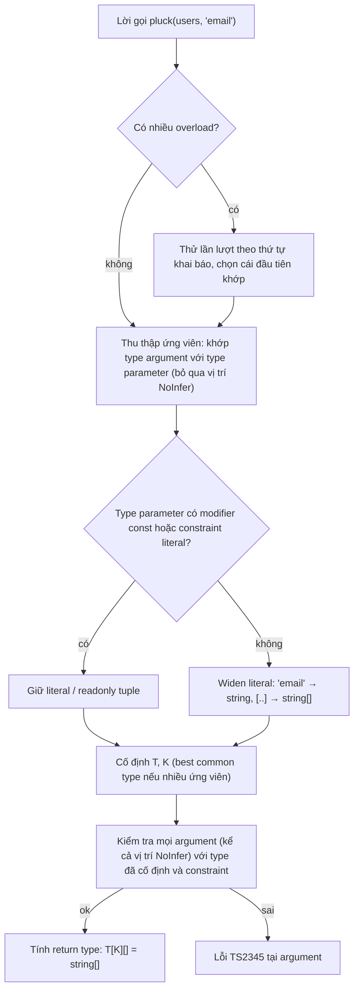
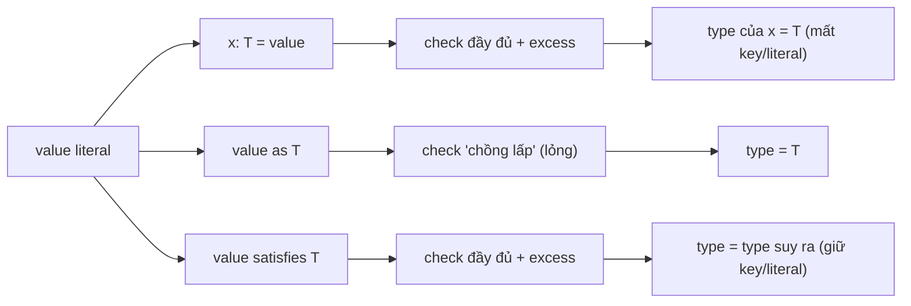

## Bối cảnh & vấn đề

Một repository helper được viết để "dùng cho mọi entity": `function getField(obj: any, key: string): any`. Nó chạy, nhưng mọi chỗ gọi đều nhận `any`, gõ sai tên field (`"emali"`) không ai biết, và `any` lan sang cả tầng service. Người viết không muốn dùng `any`; họ chỉ chưa biết cách nói "key phải là một key của object này, và kết quả có type của đúng field đó". Đó là việc của **generics** với constraint `K extends keyof T`.

Một vấn đề khác: file cấu hình route được khai báo `const routes: Record<string, Route> = { home: ..., orders: ... }`. Compiler kiểm tra từng route đúng shape, nhưng `routes.ordres` (gõ sai) cũng compile, vì annotation đã **xoá** thông tin về key cụ thể. Đổi sang `as Record<string, Route>` còn tệ hơn: một route thiếu `auth` vẫn lọt qua. `satisfies` (TS 4.9) giải quyết đúng vấn đề này: kiểm tra mà không làm mất type đã suy ra.

Bài này đi qua cách generics hoạt động, compiler suy ra type parameter từ đâu, lúc nào nên dùng overload thay vì generic, các công cụ điều khiển inference mới (`const` type parameter, `NoInfer`), và sự khác biệt thật giữa annotation, `as` và `satisfies`.

**Interview angle:** interviewer hay yêu cầu viết `getProperty`/`pluck` tại chỗ, rồi hỏi tiếp `pick(obj, ...keys)`; đây là bài kiểm tra bạn hiểu `keyof`, indexed access và inference, không phải thuộc cú pháp.

## Khái niệm

### Type parameter

**Generic** là function (hoặc type, class, interface) nhận **type parameter**, một biến ở tầng type: `function identity<T>(x: T): T`. Mỗi lần gọi, `T` được gán một type cụ thể, thường do compiler **suy ra** (infer) từ argument: `identity(42)` cho `T = number`. Mục đích của generic là **giữ quan hệ** giữa input và output: output của `identity` có đúng type của input, điều mà `(x: unknown) => unknown` hay `(x: any) => any` không nói được.

Quy tắc thực hành từ Handbook: một type parameter chỉ đáng tồn tại nếu nó xuất hiện **ít nhất hai lần** (liên kết hai vị trí). `function log<T>(x: T): void` là generic vô nghĩa; `(x: unknown): void` nói cùng điều đó rõ hơn.

### Constraint: extends

`T extends Something` giới hạn `T` chỉ nhận type là tập con của `Something`. Bên trong function, bạn được dùng những gì `Something` đảm bảo: `function len<T extends { length: number }>(x: T) { return x.length; }`. Constraint khác **default** (`<T = string>`): constraint giới hạn các giá trị hợp lệ, default chỉ được dùng khi không có gì để suy ra.

### keyof và indexed access T[K]

`keyof T` là union các key (literal) của `T`: với `User = { id: string; email: string; age: number }`, `keyof User` là `"id" | "email" | "age"`. **Indexed access** `T[K]` là type của property `K` trong `T`: `User["age"]` là `number`, và `User["id" | "age"]` là `string | number`. Kết hợp: `function getProperty<T, K extends keyof T>(obj: T, key: K): T[K]`. `K` bị giới hạn trong các key hợp lệ, và return type được tính **theo đúng key được truyền**.

### Inference từ argument và contextual typing

Compiler suy ra type parameter bằng cách **khớp** type của argument với type của parameter. Với `pluck(users, "email")`: argument đầu `User[]` khớp `T[]` nên `T = User`; argument thứ hai là literal `"email"` khớp `K extends keyof User` nên `K = "email"` (literal được giữ vì có constraint là union literal). Ngược chiều, **contextual typing** đẩy type từ ngoài vào: trong `users.map((u) => u.email)`, `u` có type `User` vì `map` đã biết `T`. Khi inference không có nguồn nào, `T` rơi về constraint (hoặc `unknown`).

Khi có **nhiều ứng viên** cho cùng một `T` (từ nhiều argument), compiler tìm "best common type", thường là union. Đó là lý do `createFSM(["idle", "loading"], "crashed")` suy ra `S = "idle" | "loading" | "crashed"`: tham số thứ hai cũng góp ứng viên. `NoInfer` sinh ra để chặn đúng hiện tượng này.

### Generic class và constraint trên entity

Generic không chỉ cho function. Một class `Repo<T extends { id: string }>` khai báo type parameter một lần cho mọi method, và constraint `{ id: string }` cho phép implementation dùng `row.id` mà không cần biết `T` cụ thể là gì. Các method bên trong có thể có type parameter **riêng** (`findBy<K extends keyof T>`), kết hợp với `T` của class. Khác với function, type parameter của class thường **không suy ra được** từ constructor (không có argument mang thông tin), nên caller viết tường minh `new Repo<Product>()`; đó là trường hợp hợp lý để truyền generic bằng tay.

### Overload

**Overload** là nhiều signature cho cùng một function, theo sau bởi một **implementation signature** mà caller không nhìn thấy. Compiler thử các overload **theo thứ tự khai báo** và chọn cái đầu tiên khớp. Overload phù hợp khi **return type phụ thuộc vào kiểu input** theo cách rời rạc: `find(id: string): Promise<User | null>` và `find(ids: string[]): Promise<User[]>`. Nhược điểm lớn: một argument có type union (`string | string[]`) **không khớp overload nào**, vì mỗi overload chỉ nhận một nhánh. Handbook khuyến nghị: nếu có thể, dùng union parameter thay vì overload.

### Conditional return type thay cho overload

Có thể viết `find<T extends string | string[]>(x: T): Promise<T extends string ? User | null : User[]>`. Caller có type chính xác, kể cả khi truyền union (kết quả là union). Nhưng bên trong implementation, TypeScript **không narrow** được conditional type theo `typeof x`, nên mọi `return` đều bị báo lỗi và bạn phải cast. Đó là cái giá: type đẹp cho caller, code xấu cho người viết.

### const type parameter (TS 5.0)

Mặc định, compiler **widen** literal khi suy ra: `routes(["home", "orders"])` cho `T = string[]`. Thêm modifier `const` vào type parameter (`<const T extends readonly string[]>`) khiến compiler suy ra như thể caller đã viết `as const`: `readonly ["home", "orders"]`. Nó chỉ tác động lên **literal viết tại chỗ gọi**; truyền một biến đã có type `string[]` thì vẫn là `string[]`. Constraint nên là `readonly` array; với constraint mutable (`T extends string[]`), TS 5.3+ vẫn suy ra tuple, nhưng các version trước rơi về `string[]` (verify nếu bạn hỗ trợ TS cũ).

### NoInfer (TS 5.4)

`NoInfer<T>` đánh dấu một vị trí **không được tham gia inference**: `T` chỉ được suy ra từ các vị trí khác, rồi vị trí `NoInfer` được **kiểm tra** với kết quả đó. `createFSM<S extends string>(states: S[], initial: NoInfer<S>)` suy ra `S` từ `states`, và `initial` phải là một trong số đó. Trước 5.4, trick phổ biến là thêm type parameter thứ hai `I extends S`, vì constraint không góp ứng viên inference.

### Annotation, as, satisfies

Ba cách gắn type cho một giá trị khác nhau ở hai câu hỏi: **có kiểm tra không**, và **type của biến sau đó là gì**.

- **Annotation** `const x: T = value`: kiểm tra đầy đủ (kể cả excess property), và type của `x` **là `T`**. Mọi thông tin chi tiết hơn (key cụ thể, literal) bị mất.
- **Assertion** `value as T`: chỉ kiểm tra rằng hai type **"đủ chồng lấp"** (một bên gán được cho bên kia). Nếu `value` có ít property hơn `T`, vẫn qua. Type của `x` là `T`. Bạn đang nói "tôi biết hơn compiler".
- **`satisfies T`** (TS 4.9): kiểm tra đầy đủ như annotation (kể cả excess property), nhưng type của biến là **type đã suy ra** từ value, chỉ được "hướng dẫn" bởi `T` (contextual typing). Key cụ thể, literal của boolean/union được giữ.

**Interview angle:** "khi nào dùng `satisfies`?" Đáp án đúng: khi bạn vừa muốn validate một hằng số trong code theo một contract, vừa muốn giữ type chính xác để dùng (autocomplete key, literal). Follow-up: nó **không** thay runtime validation cho JSON đọc từ file.

## Cơ chế hoạt động

Quá trình compiler xử lý một lời gọi generic:



Có ba điểm đáng nhớ. Một: inference và kiểm tra là **hai pha**; `NoInfer` chỉ tác động pha đầu, nên vị trí đó vẫn bị kiểm tra ở pha sau. Hai: widening xảy ra **trước** khi cố định type, nên `const` modifier phải nằm ở type parameter chứ không phải ở chỗ dùng. Ba: với overload, lỗi báo cáo liệt kê từng overload đã thử, nên thông báo dài; đó là một chi phí DX thật.

Với ba cách gắn type, luồng xử lý khác nhau ở pha cuối:



## Ví dụ thực tế

### getProperty, pluck, pick

```ts
type User = { id: string; email: string; age: number };
declare const users: User[];
function getProperty<T, K extends keyof T>(obj: T, key: K): T[K] { return obj[key]; }
function pluck<T, K extends keyof T>(items: T[], key: K): T[K][] { return items.map((i) => i[key]); }
function pick<T, K extends keyof T>(obj: T, ...keys: K[]): Pick<T, K> {
  const out = {} as Pick<T, K>;
  for (const k of keys) out[k] = obj[k];
  return out;
}
function loose(obj: Record<string, unknown>, key: string) { return obj[key]; }
const age = getProperty(users[0], "age");
const emails = pluck(users, "email");
const preview = pick(users[0], "id", "email");
const l = loose(users[0], "age");
const wrong = pluck(users, "emali");
const idOrAge = getProperty(users[0], Math.random() > 0.5 ? "id" : "age");
```

Type do compiler suy ra và lỗi (tsc 5.9, in bằng compiler API):

```text
age: number
emails: string[]
preview: { id: string; email: string; }
l: unknown
wrong: (string | number)[]
idOrAge: string | number
  error TS2345 (line 15): Argument of type '"emali"' is not assignable to parameter of type 'keyof User'.
```

`pick` trả đúng hai key được chọn nhờ `Pick<T, K>` với `K` là union các literal từ rest argument. `idOrAge` cho thấy `K` có thể là union, và `T[K]` phân phối thành `string | number`. Để ý `const out = {} as Pick<T, K>` bên trong `pick`: implementation của generic hay cần một cast cục bộ, và đó là chỗ chấp nhận được vì nó được bao bởi signature chính xác.

### Generic repository

```ts
type Entity = { id: string };
class InMemoryRepo<T extends Entity> {
  private rows = new Map<string, T>();
  insert(row: T): T { this.rows.set(row.id, row); return row; }
  findBy<K extends keyof T>(key: K, value: T[K]): T[] {
    return [...this.rows.values()].filter((r) => r[key] === value);
  }
  update(id: string, patch: Partial<Omit<T, "id">>): T | undefined {
    const cur = this.rows.get(id);
    if (!cur) return undefined;
    const next = { ...cur, ...patch };
    this.rows.set(id, next);
    return next;
  }
}
type Product = { id: string; sku: string; price: number; active: boolean };
const products = new InMemoryRepo<Product>();
products.insert({ id: "p1", sku: "A1", price: 100, active: true });
products.insert({ id: "p2", sku: "B2", price: 250, active: false });
console.log(products.findBy("active", true).map((p) => p.sku));
console.log(products.update("p2", { price: 199 }));
products.findBy("price", "100");
products.update("p1", { id: "hack" });
products.findBy("colour", "red");
const bad = new InMemoryRepo<{ name: string }>();
```

```text
repo.ts(22,26): error TS2345: Argument of type 'string' is not assignable to parameter of type 'number'.
repo.ts(23,25): error TS2353: Object literal may only specify known properties, and 'id' does not exist in type 'Partial<Omit<Product, "id">>'.
repo.ts(24,17): error TS2345: Argument of type '"colour"' is not assignable to parameter of type 'keyof Product'.
repo.ts(25,30): error TS2344: Type '{ name: string; }' does not satisfy the constraint 'Entity'.
  Property 'id' is missing in type '{ name: string; }' but required in type 'Entity'.

$ node repo.ts         # sau khi bỏ bốn dòng lỗi
[ 'A1' ]
{ id: 'p2', sku: 'B2', price: 199, active: false }
```

`findBy("price", "100")` bị bắt vì `value: T[K]` được tính theo đúng key; `update` không cho sửa `id` nhờ `Omit<T, "id">`; constraint `T extends Entity` chặn entity không có `id`. Đây là hình dạng của nhiều repository/ORM helper thật; bản multi-tenant (repository nhận tenant context) ở bài [domain modeling](/tracks/typescript/learn/branded-types-domain-modeling). Lưu ý `Partial<Omit<...>>` vẫn là type-level: `update` nhận object từ `req.body` qua biến thì excess property check không chạy, nên body vẫn phải được parse.

### Overload và union argument

```ts
function find(id: string): Promise<User | null>;
function find(ids: string[]): Promise<User[]>;
function find(x: string | string[]): Promise<User | null | User[]> { return Promise.resolve(null); }
declare const v: string | string[];
const one = find("a");            // Promise<User | null>
const many = find(["a"]);         // Promise<User[]>
const both = find(v);
function find2<T extends string | string[]>(x: T): Promise<T extends string ? User | null : User[]> {
  if (typeof x === "string") return Promise.resolve(null);
  return Promise.resolve([]);
}
const r2 = find2(v);              // Promise<User | User[] | null>
```

```text
  error TS2769 (line 8): No overload matches this call.
  Overload 1 of 2, '(id: string): Promise<User | null>', gave the following error.
    Argument of type 'string | string[]' is not assignable to parameter of type 'string'.
  Overload 2 of 2, '(ids: string[]): Promise<User[]>', gave the following error.
    Argument of type 'string | string[]' is not assignable to parameter of type 'string[]'.
  error TS2322 (line 10): Type 'Promise<null>' is not assignable to type 'Promise<T extends string ? User | null : User[]>'.
  error TS2322 (line 11): Type 'Promise<never[]>' is not assignable to type 'Promise<T extends string ? User | null : User[]>'.
```

Overload cho type chính xác với input cụ thể nhưng từ chối union. Conditional return type nhận union, nhưng implementation không compile nếu không cast (`as any` hoặc `as Promise<...>`). Cách chữa thông dụng cho overload là thêm một overload thứ ba `find(x: string | string[]): Promise<User | null | User[]>` ở **cuối**.

### NoInfer và const type parameter

```ts
function fsmLoose<S extends string>(states: S[], initial: S) { return { states, initial }; }
function fsm<S extends string>(states: S[], initial: NoInfer<S>) { return { states, initial }; }
function fsmOld<S extends string, I extends S>(states: S[], initial: I) { return { states, initial }; }
const m1 = fsmLoose(["idle", "loading"], "crashed");
const m3 = fsm(["idle", "loading"], "crashed");
const m4 = fsmOld(["idle", "loading"], "crashed");
function routes<T extends readonly string[]>(r: T) { return r; }
function routesConst<const T extends readonly string[]>(r: T) { return r; }
const r1 = routes(["home", "orders"]);
const r2 = routesConst(["home", "orders"]);
const arr = ["home", "orders"];
const r4 = routesConst(arr);
```

```text
m1: { states: ("idle" | "loading" | "crashed")[]; initial: "idle" | "loading" | "crashed"; }
r1: string[]
r2: readonly ["home", "orders"]
r4: string[]
  error TS2345 (line 6): Argument of type '"crashed"' is not assignable to parameter of type '"idle" | "loading"'.
  error TS2345 (line 7): Argument of type '"crashed"' is not assignable to parameter of type '"idle" | "loading"'.
```

`fsmLoose` im lặng chấp nhận `"crashed"` bằng cách mở rộng union: bug không có lỗi. `NoInfer` và trick cũ `I extends S` đều bắt được. `r4` nhắc lại rằng `const` chỉ giữ literal viết tại chỗ gọi.

### Annotation, as, satisfies trên cùng một route table

```ts
type Route = { path: string; auth: boolean };
const annotated: Record<string, Route> = { home: { path: "/", auth: false }, orders: { path: "/orders", auth: true } };
const checked = { home: { path: "/", auth: false }, orders: { path: "/orders", auth: true } } satisfies Record<string, Route>;
const asserted = { home: { path: "/", auth: false }, orders: { path: "/orders", auht: true } } as Record<string, Route>;
const partial = { path: "/" } as Route;          // thiếu auth: vẫn qua
const bad = { home: { path: "/", auht: false } } satisfies Record<string, Route>;
type K1 = keyof typeof annotated;
type K2 = keyof typeof checked;
const n1 = annotated.nope;
const n2 = checked.nope;
```

```text
checked: { home: { path: string; auth: false; }; orders: { path: string; auth: true; }; }
type K1 = string
type K2 = "home" | "orders"
n1: { path: string; auth: boolean; }
  error TS2352: Conversion of type '{ home: ...; orders: { path: string; auht: boolean; }; }' to type 'Record<string, Route>' may be a mistake because neither type sufficiently overlaps with the other. ...
  error TS2353: Object literal may only specify known properties, and 'auht' does not exist in type 'Route'.
  error TS2339: Property 'nope' does not exist on type '{ home: { path: string; auth: false; }; orders: { path: string; auth: true; }; }'.
```

Với annotation, `annotated.nope` compile và có type `Route` (nhưng runtime là `undefined`). Với `satisfies`, key thật được giữ nên `checked.nope` là lỗi, và `auth` còn giữ literal `false`/`true`. `as` bắt được typo `auht` ở đây chỉ vì `orders` **thiếu** `auth` khiến hai type không chồng lấp; `{ path: "/" } as Route` thiếu hẳn một field vẫn qua. Kết hợp `as const satisfies T` cho cả readonly sâu lẫn kiểm tra.

## Trade-offs & lựa chọn thay thế

| Kỹ thuật | Caller thấy gì | Implementation | Dùng khi | Tránh khi |
|---|---|---|---|---|
| Union parameter | Một signature, return cố định | Narrow bình thường | Xử lý như nhau, return không đổi | Return phụ thuộc input |
| Overload | Return chính xác theo từng dạng input | Implementation signature rộng, không kiểm tra từng overload | 2–3 dạng rời rạc, API public | Caller hay có union; nhiều tổ hợp |
| Generic | Giữ/biến đổi type input | Có thể cần cast cục bộ | `identity`, `pluck`, container, repository | Type param chỉ xuất hiện một lần |
| Conditional return | Chính xác kể cả với union | Phải cast ở mọi `return` | Thư viện, khi union input là phổ biến | Code ứng dụng thường ngày |
| Annotation `: T` | Type `T` | n/a | Biến sẽ bị gán lại, public API | Muốn giữ key/literal |
| `as T` | Type `T` | n/a | Bạn thật sự biết hơn compiler (DOM, test) | Dữ liệu ngoài, "cho compile qua" |
| `satisfies T` | Type suy ra | n/a | Config, route table, permission map | Dữ liệu runtime (JSON từ file/HTTP) |

Chọn thế nào: bắt đầu từ union parameter; chuyển sang generic khi output cần mang type của input; chỉ dùng overload khi có vài dạng input rời rạc với return khác nhau rõ rệt và caller hiếm khi có union. Với hằng số trong code, `satisfies` gần như luôn tốt hơn annotation. `as` nên hiếm tới mức mỗi lần xuất hiện đều có lý do trong review.

## Edge cases & failure modes

- **Inference thất bại lặng lẽ thành `unknown`**: `function make<T>() : T[]` gọi `make()` không có nguồn suy ra, `T = unknown`. Không lỗi, nhưng mọi thứ phía sau phải narrow.
- **Widening phá discriminant**: `const r = { status: "ok" }` truyền vào hàm nhận `{ status: "ok" | "err" }` qua biến lỗi vì `status: string`. `as const`, `satisfies`, hoặc annotate.
- **Overload order**: đặt `find(x: string | string[])` lên đầu thì overload cụ thể phía sau không bao giờ được chọn; overload cụ thể phải đứng trước.
- **`ReturnType`/`Parameters` trên overload**: chỉ lấy signature **cuối cùng**, không phải union (xem bài [conditional & mapped types](/tracks/typescript/learn/conditional-mapped-types)).
- **Generic trên arrow trong file `.tsx`**: `<T>(x: T) => x` bị hiểu là JSX; viết `<T,>` hoặc `<T extends unknown>`.
- **`K extends keyof T` với `T` là union**: `keyof (A | B)` chỉ gồm key **chung**; `getProperty(aOrB, "onlyInA")` bị từ chối, đúng về mặt soundness nhưng hay gây bối rối.
- **`satisfies` không đổi type khi bị gán lại**: `let cfg = {...} satisfies Config; cfg = other` kiểm tra theo type suy ra, không theo `Config`; với biến sẽ gán lại, dùng annotation.

## Pitfalls

- ❌ `getField(obj: any, key: string): any` → ✅ `<T, K extends keyof T>(obj: T, key: K): T[K]`; typo thành lỗi compile, return có type thật.
- ❌ Generic chỉ xuất hiện một lần (`<T>(x: T): void`) → ✅ dùng type trực tiếp (`unknown`); generic phải liên kết ít nhất hai vị trí.
- ❌ Viết `<User, "email">` thủ công ở mọi lời gọi → ✅ để compiler suy ra từ argument; truyền tường minh chỉ khi không có nguồn suy ra.
- ❌ Annotation `Record<string, Route>` cho route table hằng số → ✅ `satisfies Record<string, Route>` để giữ key và literal.
- ❌ `as Config` cho JSON đọc từ file → ✅ parse bằng schema; cả `as` lẫn `satisfies` đều không chạy lúc runtime.
- ❌ Overload cho mọi tổ hợp input → ✅ union hoặc generic; overload chỉ cho vài dạng rời rạc, và thêm overload "union" cuối nếu caller có union.
- ❌ Dựa vào inference nhiều ứng viên cho tham số "phụ" (`initial`) → ✅ `NoInfer<T>` (TS 5.4+) để nó chỉ được kiểm tra.

## Tóm tắt

- Generic giữ quan hệ giữa input và output; một type parameter phải xuất hiện ít nhất hai lần.
- `K extends keyof T` giới hạn key hợp lệ, `T[K]` cho đúng type của field; compiler suy ra `T`, `K` từ argument.
- Inference có hai pha: thu thập ứng viên (widen literal trừ khi có `const`/constraint literal), rồi kiểm tra argument.
- Overload chọn theo thứ tự khai báo và từ chối argument union; conditional return nhận union nhưng buộc cast trong implementation.
- `const` type parameter (5.0) suy ra như `as const`; `NoInfer` (5.4) loại một vị trí khỏi inference.
- Annotation kiểm tra và widen về `T`; `as` chỉ cần "chồng lấp"; `satisfies` kiểm tra đầy đủ mà giữ type suy ra. Không cái nào thay runtime validation.
