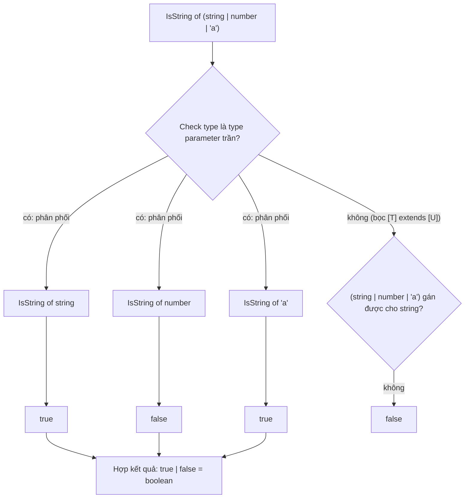
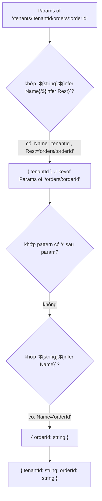

## Bối cảnh & vấn đề

Một team có 40 endpoint, mỗi endpoint cần ba type gần giống nhau: entity `User`, body tạo mới (không có `id`, `createdAt`), và body PATCH (mọi field optional, không có `id`). Họ viết tay cả 120 type. Sáu tháng sau, `User` có thêm `phone`, và chỉ 2 trong 3 type được cập nhật; API create nhận `phone` nhưng PATCH thì không, không ai phát hiện cho tới khi mobile app báo bug. Type viết tay **trùng lặp thông tin**, và thông tin trùng lặp sẽ lệch nhau.

Giải pháp là **suy ra** type từ một nguồn: `type CreateUser = Omit<User, "id" | "createdAt">`, `type PatchUser = Partial<CreateUser>`. Đằng sau `Omit` và `Partial` là hai cơ chế: **mapped type** (lặp qua key) và **conditional type** (rẽ nhánh theo type). Hiểu chúng giúp bạn đọc được `lib.es5.d.ts`, tự viết utility khi thư viện chuẩn không đủ, và biết khi nào **dừng lại** trước khi type trở nên quá "thông minh" để ai đọc được hay compiler chạy nổi.

Bài này đi từ mapped type, qua conditional type và tính **distributive** (điểm hay bị hỏi nhất), tới `infer` và template literal type, rồi kết thúc bằng một parser route params hoạt động được và giới hạn thật của compiler.

**Interview angle:** câu kinh điển là "implement `Partial`/`Pick`", rồi "`IsString<string | number>` ra gì". Người trả lời đúng `boolean` và giải thích được distributive thường được hỏi tiếp về `infer` và `[T] extends [U]`.

## Khái niệm

### Mapped type: vòng lặp qua key

**Mapped type** có dạng `{ [K in Keys]: ... }`: với mỗi `K` trong union `Keys`, tạo một property. Khi `Keys` là `keyof T`, ta được một bản sao của `T` có thể biến đổi: `{ [K in keyof T]?: T[K] }` là `Partial<T>`, thêm `readonly` là `Readonly<T>`. Modifier có thể **bỏ** bằng dấu trừ: `-?` (thành bắt buộc, chính là `Required<T>`), `-readonly` (thành mutable).

Mapped type dạng `[K in keyof T]` là **homomorphic**: nó giữ modifier gốc (`?`, `readonly`) của từng property, và khi `T` là array/tuple thì kết quả vẫn là array/tuple. Đó là lý do `Partial<[string, number]>` là `[string?, number?]` chứ không phải object có key `"0"`, `"1"`, `"length"`.

### Pick, Omit, Record

`Pick<T, K extends keyof T> = { [P in K]: T[P] }` lặp qua **tập key được chọn**. `Record<K extends keyof any, V> = { [P in K]: V }` tạo object từ union key, rất hợp cho bảng tra (`Record<Role, Permission[]>` bắt buộc đủ mọi role). `Omit<T, K extends keyof any> = Pick<T, Exclude<keyof T, K>>`. Chú ý constraint của `Omit`: `K extends keyof any` (tức `string | number | symbol`), **không** phải `keyof T`. Gõ sai tên key (`Omit<User, "passwrod">`) không báo lỗi và không bỏ gì. Lý do thiết kế: `Omit` được dùng nhiều với generic `T` chưa biết key; muốn chặt, tự viết `StrictOmit<T, K extends keyof T>`.

### Key remapping với as (TS 4.1)

Trong mapped type có thể **đổi tên key** bằng `as`: `{ [K in keyof T as NewKey]: ... }`. Nếu `NewKey` là `never`, key bị **loại bỏ**, đây là cách lọc key theo điều kiện: `as T[K] extends Function ? never : K` giữ lại các field dữ liệu. Kết hợp với template literal type để sinh tên mới: `` as `on${Capitalize<string & K>}` `` biến `orderCreated` thành `onOrderCreated`. `string & K` cần thiết vì `keyof T` có thể gồm `number | symbol`, mà template literal chỉ nhận string/number/bigint/boolean.

### Conditional type: if/else ở tầng type

`T extends U ? X : Y` đọc là "nếu `T` gán được cho `U` thì `X`, ngược lại `Y`". Nó được đánh giá lúc compile, khi `T` đã biết. Conditional type là nền tảng của `Exclude<T, U> = T extends U ? never : T`, `Extract`, `NonNullable<T> = T & {}` (định nghĩa hiện tại trong lib; trước TS 4.8 là conditional).

### Distributive conditional type

Khi phần kiểm tra là một **type parameter "trần"** (naked, không bọc trong gì) và được instantiate bằng một **union**, conditional type **phân phối** qua từng member rồi hợp kết quả lại: `IsString<string | number>` = `IsString<string> | IsString<number>` = `true | false` = `boolean`. Đây là hành vi có chủ đích: nó khiến `Exclude` hoạt động như một **filter** trên union. Hai hệ quả hay bị hỏi: `IsString<never>` là `never` (phân phối trên union rỗng cho kết quả rỗng), và `ToArray<string | number>` là `string[] | number[]`, không phải `(string | number)[]`.

Để **tắt** distribution, bọc cả hai phía trong tuple: `[T] extends [U] ? X : Y`. Lúc này `T` không còn "trần", union được so sánh như một khối. Đây cũng là cách viết `IsNever<T> = [T] extends [never] ? true : false`. Distribution chỉ xảy ra với type parameter; viết thẳng `(string | number) extends string ? ...` thì không phân phối.

### infer: pattern matching ở tầng type

`infer X` chỉ dùng được trong mệnh đề `extends` của conditional type. Nó khai báo một biến type mà compiler **điền vào** khi pattern khớp: `T extends (...args: any[]) => infer R ? R : never` là `ReturnType`. Tương tự `Parameters` (`infer P` ở vị trí tham số), `Awaited` (unwrap promise, **đệ quy**), `ConstructorParameters`, `InstanceType`. Với function có **overload**, `infer` khớp **signature cuối cùng**, không phải union của các overload.

### Template literal type

**Template literal type** ghép chuỗi ở tầng type: `` `${Resource}:${Action}` `` với hai union tạo ra **tích Descartes** mọi tổ hợp. Có bốn intrinsic để biến đổi: `Uppercase`, `Lowercase`, `Capitalize`, `Uncapitalize`. Kết hợp với `infer`, template literal trở thành **parser**: `` P extends `${string}:${infer Name}/${infer Rest}` `` tách tên param đầu tiên và phần còn lại, rồi đệ quy trên `Rest`. Các router có type (Hono, Next.js typed routes, ts-rest) dùng kỹ thuật này.

### Giới hạn của compiler

Type-level programming có trần. Union có quá **100.000 member** gây lỗi `TS2590: Expression produces a union type that is too complex to represent`. Đệ quy quá sâu gây `TS2589: Type instantiation is excessively deep and possibly infinite` (đo trên tsc 5.9: một conditional type đệ quy **không** ở vị trí tail, như `[0, ...NonTail<...>]`, lỗi từ khoảng 50 tầng, 45 tầng thì qua; bản **tail-recursive** (kết quả của nhánh là chính lời gọi đệ quy) được tối ưu từ TS 4.5 và chạy tới 999 tầng, lỗi ở 1001). Trước khi chạm trần, bạn đã trả giá bằng thời gian type-check và IDE chậm (bài [scale & upgrade](/tracks/typescript/learn/scale-upgrades-team)).

**Interview angle:** "What happens with 50 resources × 10 actions?" 500 member là ổn. Ghép thêm một tầng nữa (`${Permission}:${Scope}`) là 50.000, và thêm lần nữa thì chạm `TS2590`. Senior trả lời bằng con số và đề xuất dùng `string` có brand + validate runtime khi tập quá lớn.

## Cơ chế hoạt động

Compiler đánh giá `IsString<T>` với `T = string | number | "a"` như sau:



Nhánh trái là distributive: compiler tách union, đánh giá từng member độc lập, rồi gộp (và rút gọn: `true | true | false` thành `boolean`). Nhánh phải là non-distributive: cả union được kiểm tra một lần; vì `number` không phải string nên kết quả là `false`. Với `T = never`, nhánh trái có **không** member nào để đánh giá, nên kết quả là `never`, không phải `false`.

Parser route params hoạt động như một hàm đệ quy trên chuỗi:



`${string}` ở đầu pattern khớp ngắn nhất có thể trước dấu `:` đầu tiên, và `infer Name` khớp tới dấu `/` đầu tiên sau đó. Mỗi bước bóc một param rồi đệ quy trên phần còn lại; khi không còn `/`, nhánh thứ hai bắt param cuối; khi không còn `:`, trả `{}`.

## Ví dụ thực tế

### Tự viết utility types

```ts
type User = { id: string; email: string; password: string; save(): void };
type MyPartial<T> = { [K in keyof T]?: T[K] };
type MyPick<T, K extends keyof T> = { [P in K]: T[P] };
type P1 = MyPartial<Pick<User, "id" | "email">>;
type P2 = MyPick<User, "id" | "email">;
type O1 = Omit<User, "passwrod">;                          // typo: không lỗi, không bỏ gì
type StrictOmit<T, K extends keyof T> = Omit<T, K>;
type O2 = StrictOmit<User, "passwrod">;
type DataOnly<T> = { [K in keyof T as T[K] extends Function ? never : K]: T[K] };
type D1 = DataOnly<User>;
type Mutable<T> = { -readonly [K in keyof T]: T[K] };
type DeepPartial<T> = T extends object ? { [K in keyof T]?: DeepPartial<T[K]> } : T;
type DP = DeepPartial<{ a: { b: { c: number } } }>;
```

Kết quả (tsc 5.9, compiler API):

```text
type P1 = { id?: string | undefined; email?: string | undefined; }
type P2 = { id: string; email: string; }
type O1 = { id: string; email: string; password: string; save: () => void; }
type D1 = { id: string; email: string; password: string; }
type DP = { a?: { b?: { c?: number | undefined; } | undefined; } | undefined; }
  error TS2344 (line 8): Type '"passwrod"' does not satisfy the constraint 'keyof User'.
```

`O1` vẫn còn `password`: bug bảo mật tiềm năng nếu type này dùng làm response DTO. `StrictOmit` bắt được typo. `DataOnly` lọc method bằng remap về `never`. `DeepPartial` dùng conditional + mapped đệ quy; bản này còn thô (nó cũng biến `Date` và array thành object optional), bản production cần xử lý riêng các built-in.

### Distributive: output của các câu đố

```ts
type IsString<T> = T extends string ? true : false;
type A = IsString<string | number>;
type B = IsString<never>;
type ToArray<T> = T extends unknown ? T[] : never;
type C = ToArray<string | number>;
type IsStringStrict<T> = [T] extends [string] ? true : false;
type D = IsStringStrict<string | number>;
type IsNever<T> = [T] extends [never] ? true : false;
type F = IsNever<never>;
type MyExclude<T, U> = T extends U ? never : T;
type G = MyExclude<"a" | "b" | "c", "b">;
type NoDist<T, U> = [T] extends [U] ? never : T;
type H = NoDist<"a" | "b" | "c", "b">;
type I = IsString<any>;
type Inline = (string | number) extends string ? true : false;
```

```text
type A = boolean
type B = never
type C = string[] | number[]
type D = false
type F = true
type G = "a" | "c"
type H = "a" | "b" | "c"
type I = boolean
type Inline = false
```

`G` và `H` cho thấy vì sao `Exclude` **cần** distribution: tắt nó đi, cả union bị so sánh một khối với `"b"`, không gán được, nên không loại gì. `IsString<any>` là `boolean` vì `any` được xử lý như "cả hai nhánh". `Inline` không phân phối vì không có type parameter.

### ReturnType, Parameters trên overload và instantiation expression

```ts
function fn(x: string): string;
function fn(x: number, y: number): number;
function fn(...args: any[]) { return args[0]; }
type R = ReturnType<typeof fn>;
type P = Parameters<typeof fn>;
class Box<T> { value!: T }
type NB = InstanceType<typeof Box<number>>;
async function fetchUser() { return { id: 1 }; }
type RU = ReturnType<typeof fetchUser>;
type AU = Awaited<ReturnType<typeof fetchUser>>;
type SimpleAwaited<T> = T extends Promise<infer U> ? SimpleAwaited<U> : T;
type Deep = SimpleAwaited<Promise<Promise<boolean>>>;
```

```text
type R = number
type P = [x: number, y: number]
type NB = Box<number>
type RU = Promise<{ id: number; }>
type AU = { id: number; }
type Deep = boolean
```

`ReturnType` và `Parameters` của function overload lấy **overload cuối cùng**, không phải union của mọi overload (ghi chú Notion của tác giả nói ngược lại; xem mục Notion corrections). `InstanceType<typeof Box<number>>` hợp lệ nhờ **instantiation expression** (TS 4.7). `SimpleAwaited` là phiên bản đơn giản của `Awaited`; bản trong lib dùng `then` (thenable) chứ không chỉ `Promise`, để unwrap cả object "giống promise".

### Handlers từ event map và permission string

```ts
type Events = { orderCreated: { id: string }; orderPaid: { id: string; amount: number } };
type Handlers = { [K in keyof Events as `on${Capitalize<string & K>}`]: (payload: Events[K]) => void };
type Resource = "order" | "user" | "tenant";
type Action = "read" | "write";
type Permission = `${Resource}:${Action}`;
```

```text
type Handlers = { onOrderCreated: (payload: { id: string; }) => void; onOrderPaid: (payload: { id: string; amount: number; }) => void; }
type Permission = "order:read" | "order:write" | "user:read" | "user:write" | "tenant:read" | "tenant:write"
```

### Typed event emitter chạy thật

Mapped type không chỉ để "đọc" type; nó giúp viết implementation có type chặt. Một event bus nội bộ, với event map là nguồn sự thật:

```ts
type Events = { orderCreated: { id: string }; orderPaid: { id: string; amount: number } };
type Listener<P> = (payload: P) => void;
class TypedEmitter<E extends Record<string, object>> {
  private listeners: { [K in keyof E]?: Listener<E[K]>[] } = {};
  on<K extends keyof E>(event: K, fn: Listener<E[K]>): () => void {
    (this.listeners[event] ??= []).push(fn);
    return () => { this.listeners[event] = this.listeners[event]?.filter((f) => f !== fn); };
  }
  emit<K extends keyof E>(event: K, payload: E[K]): void {
    for (const fn of this.listeners[event] ?? []) fn(payload);
  }
}
const bus = new TypedEmitter<Events>();
const off = bus.on("orderPaid", (p) => console.log("paid", p.id, p.amount));
bus.emit("orderPaid", { id: "o1", amount: 1999 });
bus.emit("orderCreated", { id: "o2" });
off();
bus.emit("orderPaid", { id: "o3", amount: 5 });
bus.emit("orderPayed", { id: "x" });
bus.emit("orderPaid", { id: "o4" });
bus.on("orderCreated", (p) => p.amount);
```

```text
emitter.ts(19,10): error TS2345: Argument of type '"orderPayed"' is not assignable to parameter of type 'keyof Events'.
emitter.ts(20,23): error TS2345: Argument of type '{ id: string; }' is not assignable to parameter of type '{ id: string; amount: number; }'.
  Property 'amount' is missing in type '{ id: string; }' but required in type '{ id: string; amount: number; }'.
emitter.ts(21,33): error TS2339: Property 'amount' does not exist on type '{ id: string; }'.

$ node emitter.ts      # sau khi bỏ ba dòng lỗi
paid o1 1999
```

Ba loại lỗi thường gặp với event bus string-based (sai tên event, thiếu field payload, đọc field không có) đều thành lỗi compile, trong khi runtime chỉ là một object chứa array function. Lưu trữ nội bộ `{ [K in keyof E]?: Listener<E[K]>[] }` là một mapped type: mỗi event có mảng listener với đúng kiểu payload của nó, nên `emit` không cần cast. Đây là pattern mà `Handlers` ở trên mô tả ở tầng type; `EventEmitter` của Node có thể được type theo cách tương tự (`@types/node` hỗ trợ generic event map từ các bản gần đây; verify).

### Route params parser, và chạm trần 100.000

```ts
type Params<P extends string> =
  P extends `${string}:${infer Name}/${infer Rest}`
    ? { [K in Name | keyof Params<`/${Rest}`>]: string }
    : P extends `${string}:${infer Name}`
      ? { [K in Name]: string }
      : {};
type X = Params<"/tenants/:tenantId/orders/:orderId">;
type Z = Params<"/a/:x/b/:y/c/:z">;
declare function route<P extends string>(path: P, h: (params: Params<P>) => void): void;
route("/tenants/:tenantId/orders/:orderId", (p) => { p.tenantId; p.orderID; });

type R50 = `r${0|1|2|3|4|5|6|7|8|9}${0|1|2|3|4}`;          // 50 resources
type A10 = "a0"|"a1"|"a2"|"a3"|"a4"|"a5"|"a6"|"a7"|"a8"|"a9"; // 10 actions
type Perm = `${R50}:${A10}`;                                 // 500: ổn
type Big = `${R50}:${A10}:${R50}:${A10}`;                    // 250.000
```

```text
type X = { tenantId: string; orderId: string; }
type Z = { x: string; y: string; z: string; }
params.ts(11,68): error TS2551: Property 'orderID' does not exist on type '{ tenantId: string; orderId: string; }'. Did you mean 'orderId'?
params.ts(16,12): error TS2590: Expression produces a union type that is too complex to represent.
```

Handler nhận `p` có đúng hai key suy ra từ chuỗi path, và typo `orderID` bị bắt. `Big` vượt 100.000 member và compiler bỏ cuộc (`Big` thành `any`). 500 permission thì hoàn toàn ổn; vấn đề chỉ xuất hiện khi bạn **ghép tiếp** các union lớn.

## Trade-offs & lựa chọn thay thế

| Cách tiếp cận | Ưu | Nhược | Dùng khi |
|---|---|---|---|
| Type viết tay cho từng DTO | Dễ đọc, lỗi rõ | Trùng lặp, lệch khi entity đổi | Contract public cần ổn định độc lập với entity |
| Utility có sẵn (`Pick`, `Omit`, `Partial`) | Một nguồn sự thật, ai cũng hiểu | `Omit` không check key; `Partial` một tầng | Đa số DTO derive từ entity |
| Mapped + remap tự viết | Biểu diễn được quy ước (handlers, getters) | Error message khó đọc hơn | Pattern lặp lại nhiều lần trong codebase |
| Conditional + `infer` | Trích xuất type từ function/promise/string | Distribution gây bất ngờ; đệ quy tốn compiler | Thư viện, adapter, typed router |
| Template literal lớn | Autocomplete chuỗi, bắt typo | Tích Descartes bùng nổ, chậm IDE | Tập nhỏ (< vài nghìn) |
| Schema (zod) → `z.infer` | Type và validation từ một nguồn | Type là output của schema, khó tuỳ biến sâu | Dữ liệu qua boundary |

Chọn thế nào: derive bằng utility có sẵn trước; tự viết mapped/conditional khi một pattern lặp lại đủ nhiều để đáng một abstraction, và đặt tên rõ nghĩa. Dừng lại khi đồng nghiệp không đọc được error message nữa: type là để **người** đọc, compiler chỉ là người kiểm tra. Với tập chuỗi lớn hoặc động (permission do tenant định nghĩa), bỏ template literal, dùng `string` có brand và validate lúc runtime.

## Edge cases & failure modes

- **Distribution ngoài ý muốn**: một utility `IsArray<T>` trả `boolean` thay vì `false` khi `T` là union. Nếu logic cần "cả union", bọc `[T]`.
- **`never` biến mất**: `Foo<never>` với distributive conditional là `never`, và một object có property `never` có thể làm cả object không tạo được. Kiểm tra `[T] extends [never]` trước.
- **Mapped type trên union**: homomorphic mapped type phân phối trên union (`Partial<A | B>` = `Partial<A> | Partial<B>`), còn `keyof (A | B)` chỉ lấy key chung. Hai hành vi này hay bị nhầm.
- **`Omit` trên union** mất discriminant: `Omit<A | B, "x">` dùng `keyof (A | B)` nên chỉ giữ key chung, phá discriminated union. Viết `DistributiveOmit<T, K> = T extends unknown ? Omit<T, K> : never`.
- **Method thành property**: mapped type biến `save(): void` thành `save: () => void` (thấy trong output `O1`), làm thay đổi variance (bivariant thành contravariant dưới `strictFunctionTypes`).
- **Đệ quy sâu**: parse chuỗi dài hoặc `DeepPartial` trên type tự tham chiếu có thể chạm `TS2589`. Giới hạn độ sâu bằng một tuple đếm, hoặc dừng ở kiểu built-in.
- **Template literal với `number`**: `` `${number}` `` nhận cả `"1e3"`, `"0x10"`, `" 1"` (có khoảng trắng) và `"1.50"`, chỉ từ chối những chuỗi như `""` hay `"abc"` (đã chạy trên tsc 5.9). Nó không phải validator cho input số; dùng schema.

## Pitfalls

- ❌ Viết tay `CreateUserDto`, `UpdateUserDto` song song với `User` → ✅ derive bằng `Omit`/`Partial`/`Pick`, hoặc derive tất cả từ một schema.
- ❌ Tin `Omit<User, "passwrod">` đã bỏ `password` → ✅ `StrictOmit<T, K extends keyof T>` hoặc lint; với response DTO, **pick** field cho phép thay vì omit field cấm.
- ❌ "`IsString<string | number>` là `false`" → ✅ `boolean`, do distribution; muốn `false` thì `[T] extends [string]`.
- ❌ "`ReturnType` của overload là union" → ✅ là return type của overload **cuối cùng**; tương tự `Parameters`.
- ❌ Ghép template literal nhiều tầng từ union lớn → ✅ tính số tổ hợp trước; quá vài nghìn thì dùng brand + runtime validation.
- ❌ `Partial` cho nested PATCH → ✅ `Partial` một tầng; cần `DeepPartial` có xử lý `Date`/array, hoặc thiết kế PATCH phẳng.
- ❌ Type "thông minh" mà không ai đọc được lỗi → ✅ ưu tiên type dễ hiểu, thêm test type (`expectTypeOf`, `// @ts-expect-error`) cho utility phức tạp.

## Tóm tắt

- Mapped type lặp qua key (`[K in keyof T]`), thêm/bỏ `?` và `readonly`; homomorphic mapped giữ modifier và tuple.
- `Pick` lặp qua key được chọn; `Omit` không kiểm tra key tồn tại; `Record` bắt buộc đủ key khi key là union hữu hạn.
- Key remapping (`as`) đổi tên hoặc loại key (remap về `never`); kết hợp template literal để sinh tên.
- Conditional type trên type parameter trần **phân phối** qua union; `IsString<string | number>` là `boolean`, `IsString<never>` là `never`; tắt bằng `[T] extends [U]`.
- `infer` pattern-match trong `extends`; `ReturnType`/`Parameters` lấy overload cuối; `Awaited` đệ quy trên thenable.
- Template literal type ghép chuỗi (tích Descartes) và parse chuỗi bằng `infer` + đệ quy.
- Trần của compiler: union > 100.000 member (`TS2590`), đệ quy quá sâu (`TS2589`); đo trước khi viết type lớn.
