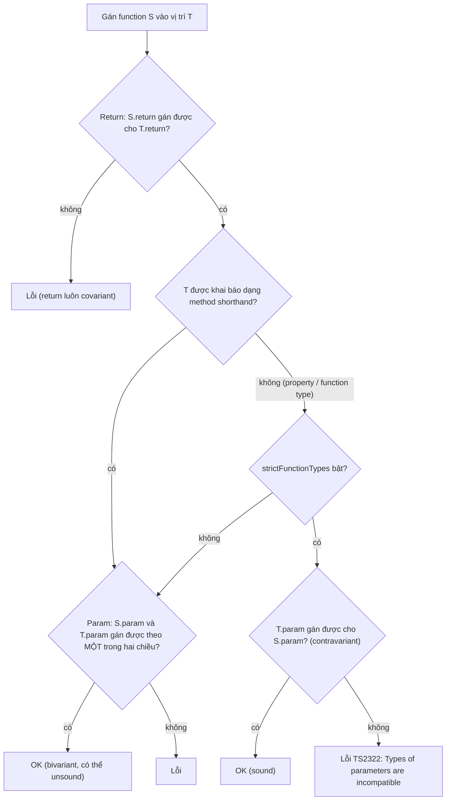
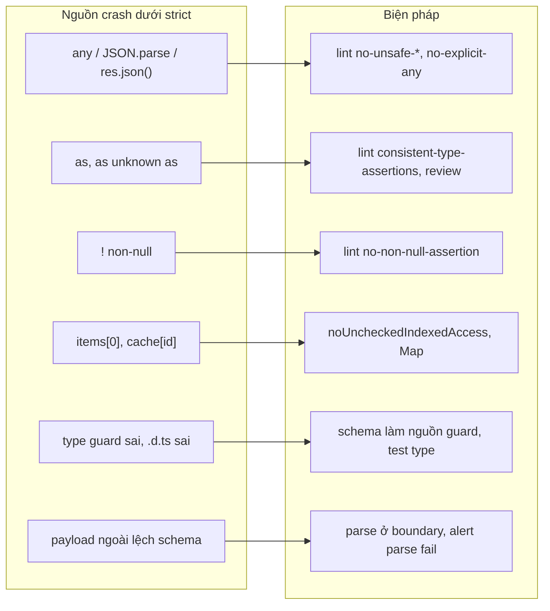

## Bối cảnh & vấn đề

Log production ghi `TypeError: Cannot read properties of undefined (reading 'price')` trong `calculateTotal(cart)`. Codebase bật `strict`, CI xanh, không có `any` nào trong file đó. Dev đầu tiên nhìn vào nói "TypeScript không bắt được lỗi này à?". Đúng: dòng gây lỗi là `cart.items[0].price`, và dưới `strict` mặc định, `items[0]` có type `Item`, không phải `Item | undefined`. Giỏ hàng rỗng là một trạng thái hợp lệ mà type system **cố ý** bỏ qua.

TypeScript không phải một hệ thống type **sound** (hoàn toàn đúng đắn), và đó là quyết định có ghi trong Design Goals: "Non-goal: apply a sound or provably correct type system. Instead, strike a balance between correctness and productivity." Có một danh sách hữu hạn những chỗ compiler **biết** là có thể sai mà vẫn cho qua. Senior engineer không cần thuộc lý thuyết type, nhưng cần thuộc **danh sách này**, vì đó là nơi bug lọt qua "code compile dưới strict".

Bài này định nghĩa soundness và variance, giải thích ba chỗ unsound có chủ đích (method bivariance, array covariance, index access), và kết thúc bằng một "bản đồ" các nguồn crash cùng cách chặn từng nguồn bằng flag, lint và runtime validation.

**Interview angle:** "code compile dưới strict mà vẫn crash, sao có thể?" là câu scenario rất phổ biến. Câu trả lời tốt liệt kê được 5–6 nguồn cụ thể và cách phòng ngừa có hệ thống, không dừng ở "do `any`".

## Khái niệm

### Soundness

Một type system **sound** đảm bảo: nếu chương trình type-check, thì lúc chạy mọi giá trị đều thực sự thuộc type mà compiler đã gán cho nó. TypeScript không đảm bảo điều này, vì hai lý do. Một: nó phải mô tả JavaScript có sẵn (DOM API, thư viện cũ, pattern động), nhiều thứ trong đó vốn không sound. Hai: một số quy tắc sound sẽ bắt bạn viết quá nhiều code phòng thủ cho trường hợp hiếm, làm giảm năng suất. Vì vậy có những chỗ compiler **chọn tin** bạn.

Phân biệt hai loại lỗ hổng: **có chủ đích** (thiết kế của ngôn ngữ, như array covariance) và **do người dùng tạo** (`as`, `any`, `!`, type predicate sai). Loại thứ hai kiểm soát được hoàn toàn bằng quy trình; loại thứ nhất cần flag và thói quen.

### Variance

**Variance** mô tả: nếu `Dog` là subtype của `Animal`, thì quan hệ giữa `F<Dog>` và `F<Animal>` là gì? Có bốn khả năng:

- **Covariant** (cùng chiều): `F<Dog>` gán được cho `F<Animal>`. Đúng cho vị trí **output/đọc**: một hàm trả `Dog` dùng được ở chỗ cần hàm trả `Animal`.
- **Contravariant** (ngược chiều): `F<Animal>` gán được cho `F<Dog>`. Đúng cho vị trí **input/ghi**: một handler nhận `Animal` dùng được ở chỗ cần handler nhận `Dog` (nó xử lý được mọi con vật, kể cả chó), nhưng không ngược lại.
- **Invariant**: không chiều nào; đúng cho thứ vừa đọc vừa ghi.
- **Bivariant**: cả hai chiều; luôn **unsound** vì cho phép một hướng sai.

Ví dụ trực giác: một hàng đợi chỉ **đọc** (`Producer<Dog>`) an toàn khi coi là `Producer<Animal>`. Một hàng đợi chỉ **ghi** (`Consumer<Animal>`) an toàn khi coi là `Consumer<Dog>`. Một mảng vừa đọc vừa ghi thì không an toàn theo chiều nào.

### strictFunctionTypes và method bivariance

Trước TS 2.6, parameter của mọi function type được so sánh **bivariant**. Flag `strictFunctionTypes` (nằm trong `strict`) chuyển sang **contravariant**, nhưng chỉ cho **function type** (khai báo dạng property: `handle: (x: Dog) => void`, type alias function, callback). **Method** (khai báo dạng `handle(x: Dog): void` trong interface/class) vẫn **bivariant**. Lý do: rất nhiều type built-in dùng method syntax, quan trọng nhất là `Array<T>` (`push(...items: T[])`). Nếu method bị check contravariant, `Array<Dog>` sẽ không còn gán được cho `Array<Animal>`, phá vỡ gần như mọi codebase.

Hệ quả thực tế: khai báo callback trong interface của bạn bằng **property syntax** để được check chặt: `interface Hooks { onEvent: (e: OrderEvent) => void }` thay vì `onEvent(e: OrderEvent): void`.

### Array covariance

`Dog[]` gán được cho `Animal[]`. Đọc thì an toàn (mỗi `Dog` là `Animal`), nhưng qua alias `Animal[]` bạn có thể `push(new Cat())`, và mảng gốc kiểu `Dog[]` giờ chứa một con mèo. Đây là unsoundness kinh điển (Java cũng có với array, và throw `ArrayStoreException` lúc runtime; TypeScript thì không kiểm tra gì). Cách chữa ở phía API: nhận `readonly T[]` (hay `ReadonlyArray<T>`) khi hàm không mutate. `ReadonlyArray` không có `push`/`splice`, nên covariance của nó là **sound**.

### Variance annotations: in, out

TS 4.7 cho phép chú thích variance cho type parameter của type tự định nghĩa: `interface Producer<out T>`, `interface Consumer<in T>`, `interface Cell<in out T>`. Compiler **kiểm tra** annotation khớp với cách `T` được dùng, và dùng nó thay vì tự đo variance bằng cách so sánh cấu trúc, giúp nhanh hơn với type lớn, đệ quy. Chúng không sửa unsoundness của `Array` hay method built-in; mục đích chính là tài liệu hoá và hiệu năng.

### Index signature và noUncheckedIndexedAccess

Với `Record<string, User>` hay `User[]`, truy cập `cache[id]` hay `items[0]` mặc định có type `User`: compiler giả định key/index **luôn tồn tại**. Giả định đó sai mỗi khi cache miss hay mảng rỗng. Flag `noUncheckedIndexedAccess` (không nằm trong `strict`) thêm `| undefined` vào mọi truy cập qua index signature và index số của array, buộc bạn xử lý trường hợp thiếu. Nó **không** ảnh hưởng tới property đã khai báo (`fixed.a` với `Record<"a" | "b", number>`) hay tuple có độ dài cố định (`tuple[0]`), vì ở đó compiler biết chắc.

`Map.get()` đã trả `V | undefined` sẵn, nên `Map` là lựa chọn an toàn hơn object cho cache động, không phụ thuộc flag.

### Các nguồn unsoundness khác

- **`any`** (tường minh hoặc ngầm từ `JSON.parse`, `res.json()`, lib không type): tắt check, lây sang biểu thức khác.
- **Type assertion `as`**: chỉ cần hai type "chồng lấp"; `as unknown as T` bỏ qua hoàn toàn.
- **Non-null assertion `!`**: `user!.email` nói "không bao giờ null" mà không kiểm tra.
- **Type predicate / assertion function sai** (bài [narrowing](/tracks/typescript/learn/narrowing-discriminated-unions)).
- **`.d.ts` sai hoặc lỗi thời**: thư viện khai báo `findUser(): User` trong khi thực tế trả `User | null`.
- **Narrowing property không bị huỷ sau function call**, **optional parameter bivariance**, **`Object.assign`** và spread với getter.
- **Dữ liệu ngoài lệch contract** (schema drift): nguồn phổ biến nhất trong production, không phải lỗi của compiler mà là giả định sai ở boundary.

**Interview angle:** follow-up "tìm mọi `any` chảy vào domain layer trong 200k dòng" có đáp án thực tế: bật `@typescript-eslint/no-unsafe-*` ở mức warn để đếm, chạy `type-coverage` để đo tỉ lệ, rồi siết dần theo thư mục.

## Cơ chế hoạt động

Compiler so sánh hai function type `S` (source) và `T` (target) khi gán `S` vào `T`:



Đọc sơ đồ: return type luôn được so sánh covariant. Với parameter, mọi thứ phụ thuộc **cách khai báo của target** chứ không phải của source: `onlyDogs` (một arrow `(d: Dog) => string`) bị từ chối khi gán vào property `handle: (x: Animal) => void` nhưng được chấp nhận khi gán vào method `handle(x: Animal): void`. Tắt `strictFunctionTypes` thì mọi thứ quay về bivariant.

Bản đồ từ nguồn unsoundness tới biện pháp:



## Ví dụ thực tế

### Method bivariance và array covariance, chạy thật

```ts
class Animal { name = "animal" }
class Dog extends Animal { bark() { return "woof"; } }
class Cat extends Animal { meow() { return "meow"; } }
interface A { handle(x: Animal): void }           // method shorthand
interface B { handle: (x: Animal) => void }       // property
const onlyDogs = (d: Dog) => d.bark();
const a: A = { handle: onlyDogs };                // compile (unsound)
const b: B = { handle: onlyDogs };                // lỗi
try { a.handle(new Cat()); } catch (e) { console.log("method bivariance:", String(e)); }

const dogs: Dog[] = [new Dog()];
const animals: Animal[] = dogs;
animals.push(new Cat());
try { dogs[1].bark(); } catch (e) { console.log("array covariance:", String(e)); }

const ro: readonly Animal[] = dogs;
ro.push(new Cat());
interface Producer<out T> { get(): T }
interface Consumer<in T> { accept(x: T): void }
const cbad: Consumer<Animal> = {} as Consumer<Dog>;
```

```text
$ tsc --noEmit --strict variance.ts
variance.ts(8,16): error TS2322: Type '(d: Dog) => string' is not assignable to type '(x: Animal) => void'.
  Types of parameters 'd' and 'x' are incompatible.
    Property 'bark' is missing in type 'Animal' but required in type 'Dog'.
variance.ts(18,4): error TS2339: Property 'push' does not exist on type 'readonly Animal[]'.
variance.ts(24,7): error TS2322: Type 'Consumer<Dog>' is not assignable to type 'Consumer<Animal>'.
  Property 'bark' is missing in type 'Animal' but required in type 'Dog'.

$ tsc --noEmit --strict --strictFunctionTypes false variance.ts   # dòng 8 không còn lỗi

$ node variance.ts            # sau khi bỏ các dòng lỗi
method bivariance: TypeError: d.bark is not a function
array covariance: TypeError: dogs[1].bark is not a function
```

Hai crash runtime từ code **không có lỗi compile**. Chú ý `Consumer<in T>` dùng method syntax (`accept(x: T)`) nhưng vẫn bị check contravariant: variance annotation ghi đè phép đo bivariant của method.

### Index access dưới hai cấu hình

```ts
type User = { email: string };
type Item = { sku: string; price: number };
const cache: Record<string, User> = {};
const m = new Map<string, User>();
const items: Item[] = [];
const a = cache["u1"];
const b = m.get("u1");
const c = items[0];
const fixed: Record<"a" | "b", number> = { a: 1, b: 2 };
const d = fixed.a;
const tuple: [string, number] = ["x", 1];
const e = tuple[0];
try { console.log(cache["u1"].email); } catch (err) { console.log(String(err)); }
try { console.log(items[0].price); } catch (err) { console.log(String(err)); }
```

```text
               strict                    strict + noUncheckedIndexedAccess
a:  { email: string; }                   User | undefined
b:  User | undefined                     User | undefined
c:  { sku: string; price: number; }      Item | undefined
d:  number                               number
e:  string                               string
  (với flag) error TS2532 (line 15): Object is possibly 'undefined'.
  (với flag) error TS2532 (line 16): Object is possibly 'undefined'.

$ node index.ts
TypeError: Cannot read properties of undefined (reading 'email')
TypeError: Cannot read properties of undefined (reading 'price')
```

Đây đúng là crash trong phần mở đầu. Với flag, hai dòng cuối là lỗi compile; không có flag, chúng chỉ là crash runtime. `Map.get` an toàn ở cả hai cấu hình; key hữu hạn (`fixed.a`) và tuple không bị ảnh hưởng.

### any lan truyền, và cách đo nó

```ts
type Item = { sku: string; price: number };
const raw = JSON.parse('{"items":[{"sku":"A1","price":"10"}]}');
const items = raw.items;
const first = items[0];
const price = first.price;
const doubled = price * 2;
const label = `${first.sku}: ${price}`;
const typed: Item[] = raw.items;
const total = typed.reduce((s, i) => s + i.price, 0);
console.log(doubled, total);
```

Type do compiler suy ra (tsc 5.9, compiler API), output runtime, và báo cáo của `type-coverage`:

```text
raw: any
items: any
first: any
price: any
doubled: number
label: string
typed: Item[]
total: number

$ node anyflow.ts
20 010

$ npx type-coverage -p tsconfig.cov.json --detail
anyflow.ts:2:7: raw
anyflow.ts:3:7: items
anyflow.ts:4:7: first
anyflow.ts:5:7: price
...
anyflow.ts:8:27: items
(21 / 36) 58.33%
```

Một `JSON.parse` sinh ra bốn biến `any` liên tiếp. Chú ý hai điều. Một: `doubled` và `label` có type "đẹp" (`number`, `string`) vì phép toán trên `any` trả type của phép toán, nên người đọc code phía sau không thấy dấu vết của `any`. Hai: `typed: Item[]` được gán từ `any` mà không có lỗi nào, và `total` là `number` theo compiler nhưng là chuỗi `"010"` lúc runtime (`0 + "10"` nối chuỗi) vì `price` thật ra là string. `type-coverage` liệt kê từng identifier có type `any`: đó là công cụ để trả lời câu "tìm mọi `any` chảy vào domain layer". Cách làm trên codebase lớn: chạy `type-coverage --detail` theo thư mục để có baseline, bật `@typescript-eslint/no-unsafe-assignment`/`no-unsafe-member-access` ở mức warn để thấy **điểm vào** của `any`, sửa từ boundary (thay `JSON.parse`/`res.json()` bằng parse có schema), rồi ratchet con số trong CI.

### Rollout noUncheckedIndexedAccess trên codebase lớn

Bật flag trên 200k dòng thường sinh vài trăm lỗi. Cách làm không chặn team:

```ts
// 1) Thay pattern for-index bằng for-of / entries: không còn undefined
for (const item of items) total += item.price;
for (const [i, item] of items.entries()) console.log(i, item.sku);

// 2) Dùng .at() + xử lý rõ ràng khi cần phần tử đầu
const first = items.at(0);
if (!first) throw new AppError("EMPTY_CART", "cart has no items");

// 3) Cache động: Map thay vì Record<string, T>
const users = new Map<string, User>();
const u = users.get(id) ?? (await loadUser(id));
```

Quy trình: bật flag trong một `tsconfig.strict.json` riêng chạy ở CI dạng **báo cáo** (không fail), đếm lỗi theo thư mục, sửa theo package (bắt đầu từ domain layer), rồi ratchet: số lỗi chỉ được giảm. Khi về 0, chuyển flag vào tsconfig chính. Tránh sửa hàng loạt bằng `!`: đó là đổi một unsoundness lấy một unsoundness khác, còn khó tìm hơn.

## Trade-offs & lựa chọn thay thế

| Chỗ unsound | Vì sao TS cho phép | Cái giá | Biện pháp |
|---|---|---|---|
| Method bivariance | Tương thích `Array<T>`, DOM, lib cũ | Callback nhận subtype lọt qua | Khai báo callback bằng property syntax |
| Array covariance | Array cực phổ biến, invariant quá khắt khe | Mảng chứa phần tử sai type | Parameter `readonly T[]`, không mutate input |
| Index access không `undefined` | Tránh `!` ở mọi vòng lặp | Crash khi miss/rỗng | `noUncheckedIndexedAccess`, `Map`, `for...of` |
| `any` | Migration từ JS, interop | Tắt check, lây | Lint `no-unsafe-*`, `unknown` ở boundary |
| `as` / `!` | Bạn đôi khi biết hơn compiler | Nói dối compiler | Lint + review; khoanh vùng trong adapter |
| Narrowing giữ qua function call | Nếu huỷ, narrowing property vô dụng | Đọc giá trị cũ sau mutation | Copy ra `const` trước khi gọi |

Chọn thế nào: với backend mới, bật `strict` + `noUncheckedIndexedAccess` ngay từ đầu (chi phí thấp khi codebase nhỏ). Với codebase cũ, ưu tiên theo **tần suất gây incident**: boundary validation (loại bỏ `any` từ dữ liệu ngoài) trước, rồi `noUncheckedIndexedAccess`, rồi lint `as`/`!`. Method bivariance và array covariance hiếm gây incident hơn; xử lý bằng convention (property syntax, `readonly` parameter).

## Edge cases & failure modes

- **`!` "sửa" lỗi hàng loạt khi bật flag**: build xanh nhưng mọi chỗ `!` là một crash chờ xảy ra; grep số `!` trước/sau.
- **`.d.ts` của thư viện sai**: không flag nào bắt được; phát hiện qua test tích hợp hoặc `skipLibCheck: false` (chỉ bắt lỗi cú pháp/type trong `.d.ts`, không bắt sai ngữ nghĩa).
- **Optional parameter và callback**: một callback `(a: string, b?: number) => void` gán được vào vị trí `(a: string) => void`, và caller không bao giờ truyền `b`; thường vô hại nhưng có thể che bug.
- **`Object.values(record)` và `Object.entries`**: an toàn hơn index access vì chỉ trả giá trị có thật; ưu tiên chúng khi iterate.
- **Destructuring array**: `const [first] = items` cũng thành `Item | undefined` dưới flag; `const [a, b] = str.split(",")` hay gặp.
- **Generic `T[K]` với `K` là `string`**: `Record<string, T>` trong generic helper vẫn trả `T` nếu bạn không bật flag; lỗi lan qua helper dùng chung.
- **Mảng được mutate qua alias trong async code**: một `Dog[]` được truyền vào hàm nhận `Animal[]` rồi hàm đó `push` sau `await`; crash xảy ra ở chỗ khác, lúc khác.

## Pitfalls

- ❌ "Code compile dưới strict thì không crash vì type" → ✅ strict không bao gồm `noUncheckedIndexedAccess`, không chặn `as`/`!`/`any` ngầm, và không biết gì về dữ liệu runtime.
- ❌ Khai báo callback bằng method shorthand trong interface → ✅ property syntax (`onEvent: (e: E) => void`) để được check contravariant.
- ❌ Nhận `Animal[]` ở parameter rồi mutate → ✅ nhận `readonly Animal[]`; trả mảng mới thay vì sửa input.
- ❌ `Record<string, T>` cho cache động → ✅ `Map<K, V>` (`get` trả `V | undefined`), hoặc `Partial<Record<...>>`.
- ❌ Bật `noUncheckedIndexedAccess` rồi thêm `!` khắp nơi → ✅ đổi sang `for...of`, `.at()` + check, `Map`; rollout theo thư mục với ratchet.
- ❌ Trả lời "bug là do `any`" cho mọi crash → ✅ liệt kê đủ nguồn: `any` ngầm, `as`, `!`, index access, guard sai, `.d.ts` sai, schema drift.

## Tóm tắt

- TypeScript cố ý không sound: nó cân bằng giữa đúng đắn và năng suất (Design Goals).
- Variance: output covariant, input contravariant, đọc-ghi invariant, bivariant là unsound.
- `strictFunctionTypes` check parameter contravariant cho function type/property, nhưng method shorthand vẫn bivariant (để `Array<T>` còn covariant).
- Array covariant: `Dog[]` gán cho `Animal[]` rồi `push(cat)`; dùng `readonly T[]` ở parameter.
- Index access mặc định không có `undefined`; `noUncheckedIndexedAccess` sửa điều đó cho index signature và array (không ảnh hưởng key hữu hạn, tuple).
- Crash dưới strict thường đến từ `any` ngầm, `as`, `!`, index access, guard hay `.d.ts` sai, và dữ liệu ngoài lệch schema; chặn bằng flag + lint + parse ở boundary.
