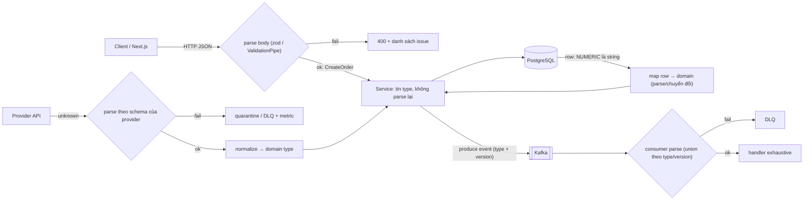

## Bối cảnh & vấn đề

Một màn hình hoá đơn hiển thị tổng tiền `1000` cộng phí `100` thành `"1000100"`. Type trên frontend ghi rõ `total: number`, code review không ai nghi ngờ. Nguyên nhân nằm ở backend: cột `total` kiểu `NUMERIC` trong PostgreSQL, và driver `node-postgres` trả `NUMERIC` dưới dạng **string** để không mất độ chính xác. Backend `res.json(row)`, frontend `(await r.json()) as Invoice`. Không có dòng nào kiểm tra `total` thực sự là number; phép `+` của JavaScript thấy một string và nối chuỗi.

Cùng một gốc rễ gây ra hàng loạt incident khác: webhook của provider đổi field, message Kafka từ producer cũ thiếu field mới, biến môi trường `PORT` là string, document Elasticsearch có field bị dynamic mapping đoán sai type. Tất cả đều là **dữ liệu đi qua boundary** (ranh giới process) mà code tin vào type khai báo. Vì TypeScript **xoá type** khi build, không có gì ở runtime biết `Invoice` phải có `total: number`.

Bài này trình bày nguyên tắc "parse, don't validate" và cách áp dụng với zod: schema là nguồn sự thật, type được suy ra từ schema, dữ liệu được parse **một lần** ở edge. Sau đó áp dụng cho các boundary thật trong một hệ thống e-commerce nhiều service: HTTP body, response của provider, event Kafka, document Elasticsearch, và type chia sẻ giữa frontend và backend.

**Interview angle:** "TypeScript validate request body cho chúng ta" là red flag lớn nhất của track này. Interviewer muốn nghe: ở đâu parse, parse xong thì bên trong tin type, và xử lý thế nào khi parse fail.

## Khái niệm

### Type erasure và hệ quả

**Type erasure** nghĩa là toàn bộ annotation, interface, type alias, generic bị xoá khi chuyển sang JavaScript. Ba hệ quả thực tế cho backend. Một: không thể `x instanceof User` khi `User` là `interface`/`type`, và không có reflection của type (ngoại lệ hạn chế: `emitDecoratorMetadata` của legacy decorator, bài [emit & decorators](/tracks/typescript/learn/emit-classes-decorators)). Hai: `req.body as CreateOrderDto` là **không có gì** lúc runtime; client gửi gì, handler nhận nấy. Ba: mọi boundary (HTTP, queue, file, env, DB JSON column, response bên thứ ba, `localStorage`) đều cần kiểm tra lúc runtime nếu bạn muốn type là sự thật.

### Validate so với parse

**Validate** là kiểm tra dữ liệu rồi trả `true/false`, trong khi biến vẫn giữ type cũ (thường là `any`/`unknown`), và bạn phải "nhớ" rằng nó đã được kiểm tra. **Parse** là biến dữ liệu chưa tin cậy thành một giá trị **có type mới**, hoặc thất bại. Sau `const order = CreateOrder.parse(body)`, type `CreateOrder` chứng minh rằng việc kiểm tra đã xảy ra; không có cách nào có được giá trị đó mà bỏ qua parse. Parse còn **chuẩn hoá**: loại field lạ, ép kiểu có kiểm soát (`"2"` thành `2` nếu bạn chọn `coerce`), điền default, chuyển string `NUMERIC` thành số nguyên minor units.

### Schema là nguồn sự thật

Viết type **và** guard tay cho cùng một shape tạo hai nguồn sự thật sẽ lệch nhau (bài [narrowing](/tracks/typescript/learn/narrowing-discriminated-unions) có ví dụ guard sai). Với thư viện schema (zod, valibot, TypeBox, ArkType), bạn khai báo schema một lần, và `type T = z.infer<typeof Schema>` suy ra type từ nó. Thêm field vào schema là type thay đổi theo, và guard thay đổi theo. TypeBox khác ở chỗ sinh ra JSON Schema chuẩn, hợp khi cần OpenAPI hay validator nhanh như Ajv.

### Parse ở đâu

Quy tắc: parse ở **cạnh ngoài cùng** của hệ thống, ngay khi dữ liệu đi vào, và **đúng một lần**. Với HTTP, đó là middleware/pipe validation hoặc dòng đầu của controller, trước khi gọi service. Service nhận type đã parse và **tin** nó; nó không nhận `unknown`. Lý do: nếu service cũng parse, bạn có logic lặp lại và không rõ chỗ nào chịu trách nhiệm trả 400. Nếu parse nằm sâu trong service, dữ liệu xấu đã đi qua nhiều lớp và có thể đã được log, cache, hay dùng để query. Với NestJS, `ValidationPipe` với `whitelist: true` là cơ chế tương đương (track [NestJS](/tracks/nestjs)).

### Strip, strict, passthrough

Khi object có field không có trong schema, có ba chính sách. **Strip** (mặc định của `z.object`): bỏ field lạ, trả object sạch; chống mass assignment cho body của client. **Strict** (`.strict()`, trong zod 4 còn có `z.strictObject`): field lạ là lỗi; hợp cho config và API nội bộ, nơi field lạ gần như chắc chắn là bug. **Passthrough/loose** (`.passthrough()`, zod 4 `z.looseObject`): giữ nguyên field lạ; hợp khi bạn chỉ đọc một phần payload và muốn chuyển tiếp phần còn lại. Với payload của provider bên ngoài, non-strict (strip) + **log field lạ** thường tốt hơn strict: provider thêm field là chuyện bình thường, không nên làm sập pipeline.

### Số, tiền và JSON

JSON chỉ có một kiểu số, được JavaScript đọc thành IEEE 754 double: số nguyên an toàn tới `2^53 - 1`, số thập phân có sai số (`0.1 + 0.2`). Vì vậy driver database thường trả `NUMERIC`/`DECIMAL` và `BIGINT` dưới dạng **string** (node-postgres, mssql tuỳ cấu hình), và đó là quyết định **đúng**, chỉ có type phía TypeScript là sai. Với tiền, ba lựa chọn hợp lý cho API contract: số nguyên **minor units** (cents, đồng) kèm `currency`; **decimal string** có định dạng rõ (`"1000.50"`) và type là `string`; hoặc `bigint` bên trong service (không qua JSON trực tiếp được). `number` float cho tiền là lựa chọn sai. Chi tiết về số và JSON ở bài [numbers & JSON](/tracks/javascript/learn/numbers-json-dates).

### Contract giữa các service

Khi hai process trao đổi dữ liệu, **contract** là thoả thuận về shape đó. TypeScript giúp khi cả hai phía import **cùng một định nghĩa**, nhưng hai phía được **deploy độc lập**: frontend cũ gọi backend mới, consumer cũ đọc event từ producer mới. Vì vậy contract cần **quy tắc tiến hoá**: chỉ thêm field optional, không xoá hay đổi nghĩa field cũ, consumer chịu được field lạ, thay đổi phá vỡ thì tạo version mới. Và phía nhận **luôn parse**, vì type import lúc build không nói gì về message được gửi bởi một version khác.

**Interview angle:** câu "source of truth cho type FE/BE là gì" không có đáp án duy nhất; interviewer chấm cách bạn so sánh schema-first, OpenAPI-first và tRPC, và bạn có nhắc tới deploy lệch version hay không.

## Cơ chế hoạt động

Luồng dữ liệu qua một service, với các điểm parse:



Mỗi mũi tên đi **vào** service từ bên ngoài đều đi qua một node parse, và mỗi node parse có một nhánh fail được xử lý rõ ràng (400, quarantine, DLQ). Bên trong service, dữ liệu đã có type thật và không cần kiểm tra lại. Chú ý DB cũng là một boundary: driver trả dữ liệu theo quy tắc riêng của nó, và layer repository chịu trách nhiệm chuyển thành domain type.

Với contract có version, phía consumer xử lý theo thứ tự: parse thành union các version đã biết; nếu không khớp version nào, đưa vào DLQ thay vì crash hay bỏ qua im lặng; nếu khớp, `switch` exhaustive trên `type` rồi `version`. Khi producer bắt đầu gửi version mới, consumer phải được deploy **trước** với khả năng đọc version đó (consumer-first rollout).

## Ví dụ thực tế

### Parse body với zod 4: strip, strict và thông báo lỗi

```ts
import { z } from "zod";
const CreateOrder = z.object({ sku: z.string().min(1), qty: z.number().int().positive() });
type CreateOrder = z.infer<typeof CreateOrder>;
const bodies: unknown[] = [
  { sku: "A1", qty: 2 },
  { sku: "A1", qty: "2" },
  { sku: "", qty: -1, isAdmin: true },
];
for (const b of bodies) {
  const r = CreateOrder.safeParse(b);
  if (r.success) console.log("ok", r.data);
  else console.log("400", JSON.stringify(r.error.issues.map((i) => ({ path: i.path.join("."), code: i.code, message: i.message }))));
}
console.log("strip:", CreateOrder.parse({ sku: "A1", qty: 1, isAdmin: true }));
const r = CreateOrder.strict().safeParse({ sku: "A1", qty: 1, isAdmin: true });
console.log("strict:", r.success ? r.data : r.error.issues[0]?.message);
```

```text
$ node zod.ts          # zod 4.6.5, Node 24
ok { sku: 'A1', qty: 2 }
400 [{"path":"qty","code":"invalid_type","message":"Invalid input: expected number, received string"}]
400 [{"path":"sku","code":"too_small","message":"Too small: expected string to have >=1 characters"},{"path":"qty","code":"too_small","message":"Too small: expected number to be >0"}]
strip: { sku: 'A1', qty: 1 }
strict: Unrecognized key: "isAdmin"
```

`qty: "2"` bị từ chối: schema không tự ép kiểu trừ khi bạn chọn `z.coerce.number()` (hữu ích cho query string, nguy hiểm cho body vì `z.coerce.number()` biến `""` thành `0`). Mặc định strip loại `isAdmin` khỏi kết quả, nên spread `data` vào entity là an toàn; `.strict()` biến nó thành lỗi. Trong Express, handler có dạng `const body = CreateOrder.parse(req.body)` ở dòng đầu, với một error middleware chuyển `ZodError` thành 400.

### Hoá đơn "1000100": tái hiện và sửa

```ts
import { z } from "zod";
import http from "node:http";
// Backend giả lập: driver trả NUMERIC dạng string (như node-postgres)
const server = http.createServer((_, res) => res.end(JSON.stringify({ id: "1", total: "1000" }))).listen(0);
const url = `http://localhost:${(server.address() as any).port}/api/invoices/1`;

type Invoice = { id: string; total: number };
async function getInvoiceUnsafe(): Promise<Invoice> {
  const r = await fetch(url);
  return (await r.json()) as Invoice;
}
const InvoiceSchema = z.object({
  id: z.string(),
  total: z.string().regex(/^\d+(\.\d{1,2})?$/).transform((s) => Math.round(Number(s) * 100)), // cents
});
async function getInvoice() { const r = await fetch(url); return InvoiceSchema.parse(await r.json()); }

const inv = await getInvoiceUnsafe();
console.log("unsafe:", inv.total + 100, typeof inv.total);
const safe = await getInvoice();
console.log("parsed (cents):", safe.total + 100 * 100);
const Strict = z.object({ id: z.string(), total: z.number() });
console.log("strict number schema:", Strict.safeParse(await (await fetch(url)).json()).error?.issues[0]?.message);
server.close();
```

```text
unsafe: 1000100 string
parsed (cents): 110000
strict number schema: Invalid input: expected number, received string
```

Bản `as Invoice` tái hiện đúng bug. Bản parse nói rõ contract thật (`total` là decimal string) và chuyển nó thành số nguyên cents, nên phép cộng đúng. Ngay cả schema "ngây thơ" `total: z.number()` cũng có giá trị: nó **fail sớm** với thông báo rõ ràng thay vì hiển thị số sai cho người dùng. (Chuyển đổi `Number(s) * 100` ổn với 2 chữ số thập phân và giá trị vừa phải; với số lớn hoặc nhiều chữ số, dùng thư viện decimal hoặc tách phần nguyên/thập phân bằng string.) Lint `@typescript-eslint/no-unsafe-return` bắt được `return (await r.json()) as ...`? Không: `as` biến `any` thành type cụ thể nên lint không thấy; rule `no-unsafe-type-assertion` (typescript-eslint v8) mới bắt được (verify version).

### Event contract có version, consumer parse và DLQ

```ts
import { z } from "zod";
const OrderCreatedV1 = z.object({ type: z.literal("order.created"), version: z.literal(1), orderId: z.string(), total: z.number().int() });
const OrderCreatedV2 = z.object({ type: z.literal("order.created"), version: z.literal(2), orderId: z.string(), totalMinor: z.number().int(), currency: z.string().length(3) });
const OrderCancelled = z.object({ type: z.literal("order.cancelled"), version: z.literal(1), orderId: z.string(), reason: z.string().optional() });
const OrderEvent = z.union([OrderCreatedV1, OrderCreatedV2, OrderCancelled]);
type OrderEvent = z.infer<typeof OrderEvent>;

function handle(e: OrderEvent): string {
  switch (e.type) {
    case "order.created":
      return e.version === 1 ? `created ${e.orderId} ${e.total} VND` : `created ${e.orderId} ${e.totalMinor} ${e.currency}`;
    case "order.cancelled":
      return `cancelled ${e.orderId}`;
    default: { const _n: never = e; return _n; }
  }
}
const raw = [
  '{"type":"order.created","version":1,"orderId":"o1","total":150000}',
  '{"type":"order.created","version":2,"orderId":"o2","totalMinor":1999,"currency":"USD","channel":"app"}',
  '{"type":"order.refunded","version":1,"orderId":"o3"}',
  '{"type":"order.created","version":2,"orderId":"o4","totalMinor":"1999","currency":"USD"}',
];
for (const m of raw) {
  const r = OrderEvent.safeParse(JSON.parse(m));
  if (r.success) console.log("handled:", handle(r.data));
  else console.log("to DLQ:", JSON.parse(m).type, "-", r.error.issues.length, "issue(s), first:", r.error.issues[0]?.message);
}
```

```text
handled: created o1 150000 VND
handled: created o2 1999 USD
to DLQ: order.refunded - 1 issue(s), first: Invalid input
to DLQ: order.created - 1 issue(s), first: Invalid input
```

Message V2 có thêm `channel` (field producer mới thêm) vẫn được xử lý: consumer chịu được field lạ. Event type chưa biết (`order.refunded`) và message sai kiểu (`totalMinor` là string) đi vào DLQ thay vì crash consumer hay bị commit offset im lặng. Thông báo `Invalid input` của `z.union` khá mơ hồ; trong production, parse theo hai bước (`type` + `version` trước, rồi schema cụ thể) để log lỗi chính xác. Cách xử lý offset, retry và DLQ thuộc track [Kafka](/tracks/messaging-kafka).

### Payload của provider và document Elasticsearch

Service enrichment nhận sản phẩm từ nhiều provider. Mỗi provider có **schema riêng**, và một hàm normalize chuyển về domain type chung:

```ts
const ProviderA = z.object({ sku: z.string(), price_cents: z.number().int(), cat: z.string() });
const ProviderB = z.object({ id: z.string(), price: z.object({ amount: z.string(), currency: z.string() }), categoryPath: z.array(z.string()) });
type Product = { sku: string; priceMinor: number; currency: string; category: string };
const fromA = (p: z.infer<typeof ProviderA>): Product => ({ sku: p.sku, priceMinor: p.price_cents, currency: "USD", category: p.cat });
```

Nguyên tắc: provider type và domain type **tách biệt**, thay đổi của provider chỉ chạm tới schema và hàm `fromX` của nó; record không parse được đi vào quarantine kèm lý do (không làm hỏng cả batch); metric "parse fail rate theo provider" có alert. Phía indexer làm điều ngược lại: `toDoc(p: Product): ProductDoc` là function có type rõ, `ProductDoc` và **explicit mapping** của Elasticsearch được giữ đồng bộ (sinh mapping từ một định nghĩa, hoặc test so sánh key của document với mapping trong CI), và `dynamic: "strict"` trên index để field lạ bị từ chối thay vì dynamic mapping đoán sai `text`/`keyword`. Chi tiết reindex qua alias ở track [NoSQL & Search](/tracks/nosql-search). (Đoạn trên là minh hoạ thiết kế, không phải output chạy thật.)

## Trade-offs & lựa chọn thay thế

| Cách chia sẻ contract | Nguồn sự thật | Runtime validation | Hợp với | Hạn chế |
|---|---|---|---|---|
| Schema-first (package `contracts` dùng zod/valibot) | Schema TS | Có, cùng schema ở cả hai phía | Monorepo, FE và BE cùng TypeScript | Consumer ngoài TS không dùng được trực tiếp |
| OpenAPI-first + codegen | File spec | Tuỳ (codegen validator hoặc Ajv) | API public, nhiều ngôn ngữ, mobile | Pipeline codegen, spec có thể lệch implementation |
| tRPC / ts-rest | Router/contract TS | Có (input schema) | App nội bộ, FE-BE gắn chặt | Không hợp public API; khó version |
| Schema registry (Avro/Protobuf/JSON Schema) | Registry | Có, kèm kiểm tra tương thích | Event Kafka nhiều team | Hạ tầng thêm, codegen cho TS |
| Import type trực tiếp từ BE (entity/ORM) | Code BE | Không | Không nên dùng | Lộ field nội bộ, kéo code server vào bundle |
| `as T` ở mọi boundary | Không có | Không | Không nên dùng | Mọi incident trong bài này |

Chọn thế nào: trong monorepo TypeScript với Next.js và API Node, **schema-first** trong một package `contracts` là điểm khởi đầu tốt; nếu có consumer ngoài monorepo (mobile, đối tác), sinh OpenAPI từ schema (zod-to-openapi, hoặc TypeBox) để có một spec chuẩn. tRPC rất năng suất cho app nội bộ nhưng làm version khó hơn. Với event, dùng schema registry khi nhiều team và ngôn ngữ; nếu chỉ một team TypeScript, package contract + discriminated union có `version` là đủ, miễn là consumer luôn parse. Dù chọn gì, **không** để frontend import entity của backend.

## Edge cases & failure modes

- **Deploy lệch version**: FE cũ (cache ở CDN, app mobile pin version) gửi body thiếu field mới; nếu field mới bắt buộc, mọi request cũ thành 400. Field mới phải optional hoặc có default ở server.
- **`z.coerce` quá dễ dãi**: `z.coerce.number()` với `""` cho `0`, `z.coerce.boolean()` với `"false"` cho `true`. Dùng `z.stringbool()` (zod 4) hoặc transform tự viết cho query string.
- **Parse tốn CPU với payload lớn**: schema lồng sâu trên mảng 100k phần tử có thể tốn hàng trăm ms và chặn event loop; parse theo trang, stream, hoặc validator biên dịch sẵn (Ajv, TypeBox).
- **Schema và DB lệch nhau**: schema cho phép chuỗi 500 ký tự nhưng cột là `varchar(255)`; lỗi xuất hiện ở tầng DB. Giới hạn trong schema nên phản chiếu constraint của DB.
- **Consumer mới, message cũ**: sau khi consumer chuyển sang V2, message V1 còn trong topic (retention 7 ngày) hoặc được replay; consumer phải đọc được cả hai, hoặc có upcaster V1 → V2.
- **Dynamic mapping Elasticsearch**: document đầu tiên có `price: "10"` khiến field thành `text`, các document sau không sort được theo giá; chỉ sửa được bằng reindex.
- **Env vars**: `process.env.PORT` luôn là `string | undefined`; parse toàn bộ env một lần lúc khởi động và crash sớm nếu thiếu, thay vì lỗi lúc request đầu tiên.

## Pitfalls

- ❌ `const body = req.body as CreateOrderDto` → ✅ `const body = CreateOrder.parse(req.body)` ở edge; lỗi thành 400 có danh sách issue.
- ❌ Parse ở cả controller lẫn service "cho chắc" → ✅ parse một lần ở boundary; bên trong nhận type đã parse và tin nó.
- ❌ `total: number` cho cột `NUMERIC`/`BIGINT` → ✅ contract rõ: integer minor units + currency, hoặc decimal string; parse/transform ở repository hoặc client.
- ❌ Schema strict cho payload của provider → ✅ strip + log field lạ; strict chỉ khi field lạ chắc chắn là bug (config, API nội bộ).
- ❌ Consumer tin type của event vì "cùng import package contracts" → ✅ consumer luôn parse; message có thể từ producer version khác, replay, hay ngôn ngữ khác.
- ❌ Đổi nghĩa hoặc xoá field trong event đang dùng → ✅ chỉ thêm field optional; thay đổi phá vỡ thì event type/version mới, consumer deploy trước.
- ❌ Frontend import type entity/ORM của backend → ✅ package contract riêng chỉ chứa shape công khai.

## Tóm tắt

- Type bị xoá khi chạy: `as T` và annotation không kiểm tra dữ liệu; mọi boundary cần runtime validation.
- Parse, don't validate: biến `unknown` thành giá trị có type, hoặc fail; schema là nguồn sự thật và `z.infer` suy ra type.
- Parse một lần ở edge (middleware/pipe/dòng đầu controller); service tin type đã parse.
- Strip chống mass assignment, strict cho config/API nội bộ, passthrough khi chuyển tiếp; payload provider nên strip + log.
- JSON chỉ có double: `NUMERIC`/`BIGINT` về dạng string là đúng; tiền nên là integer minor units + currency hoặc decimal string.
- Contract giữa các service tiến hoá bằng field optional và version mới; phía nhận luôn parse, lỗi đi vào 400/quarantine/DLQ.
- Chia sẻ type FE/BE: schema-first cho monorepo TS, OpenAPI khi có consumer ngoài, tránh import entity backend.
