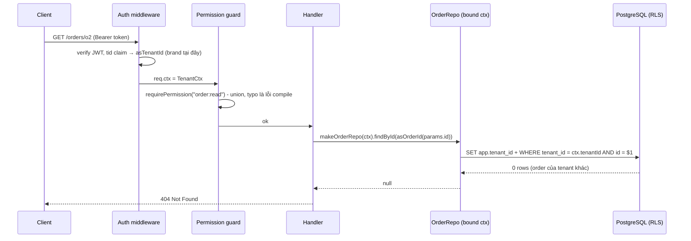
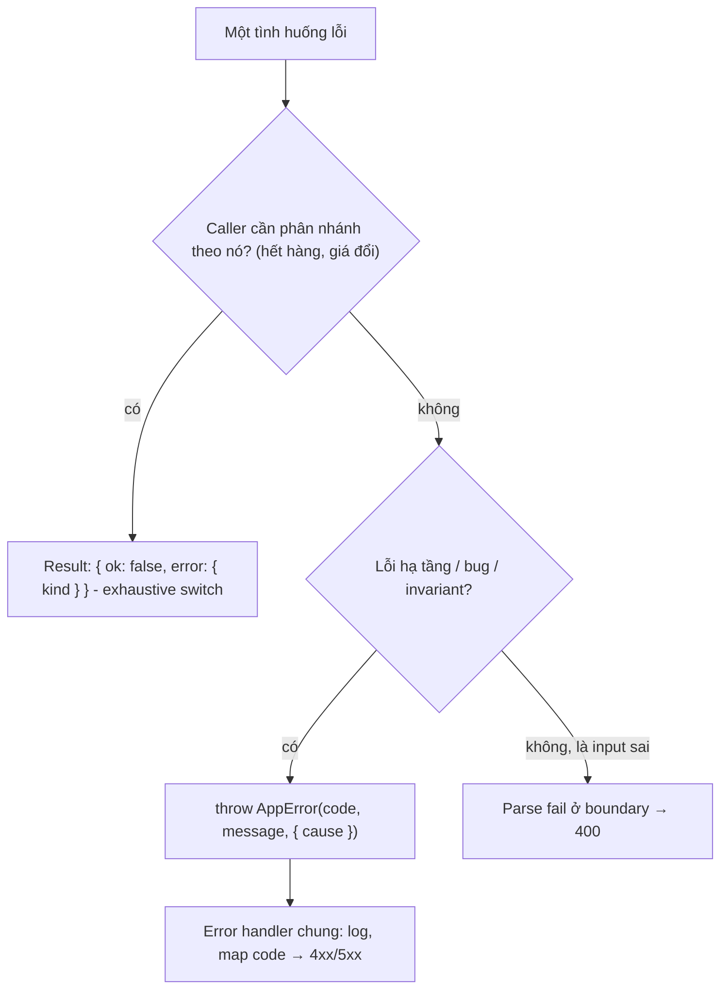

## Bối cảnh & vấn đề

Nền tảng e-commerce B2B2C phục vụ nhiều tenant (mỗi thương hiệu là một tenant) trên cùng database. Hàm `getProduct(tenantId: string, productId: string)` được gọi ở 60 chỗ. Một lần refactor đảo thứ tự hai tham số ở một chỗ, và vì cả hai đều là `string`, compiler im lặng. Query `WHERE tenant_id = $1 AND id = $2` với tham số đảo ngược trả về rỗng ở hầu hết trường hợp, nên không ai phát hiện, cho tới khi một product ID của tenant A trùng định dạng với tenant ID của tenant B. Tệ hơn, ở một endpoint khác, `tenantId` được lấy từ `req.body` thay vì từ token: một user có thể đọc đơn hàng của tenant khác bằng cách sửa JSON. Đó là **BOLA** (Broken Object Level Authorization), lỗ hổng số một trong OWASP API Top 10.

Không có công cụ nào loại bỏ hoàn toàn loại lỗi này, nhưng type system có thể biến nhiều cách sai thành **lỗi compile**: ID của tenant và ID của product là hai type khác nhau; tenant ID chỉ có được từ một nguồn tin cậy; repository không thể được gọi mà thiếu tenant context; tên permission gõ sai không build được. Bài này trình bày các kỹ thuật đó, cùng cách mô hình hoá **lỗi nghiệp vụ** bằng type, và quan trọng không kém: **chỗ nào type không giúp được**.

**Interview angle:** câu hỏi CV kiểu "bạn phụ trách tenant-aware data access, TypeScript giúp chống leak thế nào" đo hai thứ: bạn có cơ chế cụ thể (signature thật), và bạn có biết giới hạn (raw SQL, background job, cache key, Elasticsearch filter).

## Khái niệm

### Branded type

Vì TypeScript structural, `type TenantId = string` không khác gì `string` (bài [nền tảng](/tracks/typescript/learn/type-system-foundations)). **Branded type** giả lập nominal typing bằng cách intersect với một property "ma" (phantom) chỉ tồn tại ở tầng type: `type TenantId = string & { readonly [brand]: "TenantId" }`. Một `string` thường thiếu property đó nên không gán được cho `TenantId`; một `ProductId` có brand khác nên cũng không gán được. Lúc runtime, giá trị vẫn chỉ là string: **zero cost**, `JSON.stringify` và so sánh `===` hoạt động bình thường.

Dùng `declare const brand: unique symbol` làm key thay vì `__brand` giúp brand không bao giờ trùng với property thật và không hiện trong autocomplete. Một helper chung `type Brand<T, B extends string> = T & { readonly [brand]: B }` cho phép khai báo nhanh `TenantId`, `OrderId`, `Email`, `Cents`.

### Nơi được phép brand

Brand chỉ có giá trị nếu giá trị có brand **thật sự đã được kiểm tra**. Vì vậy chỉ tạo brand ở một vài nơi tin cậy: sau khi validate (một hàm `asTenantId(s)` kiểm tra định dạng, hay zod `.brand<"TenantId">()`), khi đọc từ auth context (claim trong token đã verify), hoặc khi đọc từ DB. Mọi chỗ khác nhận brand qua tham số. `s as TenantId` rải rác trong code là phá vỡ mô hình; cấm bằng lint (`no-restricted-syntax` trên `TSAsExpression` với type brand) hoặc review. Brand cũng không đi qua JSON: sau khi parse một response, giá trị lại là `string` và phải được brand lại ở boundary.

### Lỗi trong TypeScript: throw không có type

TypeScript không có **checked exception**: signature `function checkout(): Order` không nói nó có thể throw gì, và `catch (e)` luôn nhận `unknown` (dưới `useUnknownInCatchVariables`, mặc định trong `strict`) vì mọi thứ đều có thể bị throw: `Error`, string, `null`, object từ thư viện. Hai công cụ bổ sung nhau. **Error class** có `code` ổn định (`class AppError extends Error { code }`), kèm `cause` (ES2022) để giữ chuỗi lỗi gốc, và narrow bằng `instanceof` hoặc kiểm tra `code`. **Result type** `{ ok: true; value: T } | { ok: false; error: E }` biến lỗi thành **giá trị** có type, và compiler ép caller xử lý nhánh lỗi.

### Khi nào Result, khi nào throw

Result hợp với lỗi **nghiệp vụ dự đoán được**, mà caller cần phân nhánh: hết hàng, giá đã đổi, voucher hết hạn, vượt hạn mức. `E` là discriminated union (`{ kind: "OUT_OF_STOCK"; sku }`), nên caller `switch` exhaustive và map sang HTTP status. Throw hợp với lỗi **hạ tầng** hoặc bug: mất kết nối DB, timeout, invariant bị phá; chúng đi lên một error handler chung (middleware, exception filter), được log và trả 500/503. Dùng Result cho **mọi thứ** làm code dài và khó đọc (mọi lời gọi thành `if (!r.ok) return r`); dùng throw cho mọi thứ khiến lỗi nghiệp vụ không hiện trên signature.

### instanceof và nhiều bản copy package

`instanceof AppError` so sánh prototype chain với **một** constructor cụ thể. Trong monorepo có hai version của package `errors`, hoặc package dual CJS/ESM được load cả hai bản (dual package hazard), sẽ có hai class `AppError` khác nhau, và `instanceof` trả `false`. Kiểm tra `err.code`/`err.name`, hoặc một brand symbol dùng `Symbol.for("app.error")`, bền hơn qua ranh giới package.

### Tenant context và repository có scope

Nguyên tắc: tenant ID đến từ **token đã verify** (qua auth middleware), không bao giờ từ body, query hay path param do client điều khiển. Middleware tạo một `TenantCtx` (tenant ID có brand, user ID, roles) và đưa vào request context. Repository **bắt buộc** nhận context đó, theo một trong hai cách: tham số đầu tiên của mọi method (`findById(ctx, id)`), hoặc được **bind** khi tạo repository per request (`makeOrderRepo(ctx)`). Cách thứ hai khiến việc "quên" tenant là không thể, vì không có method nào nhận thiếu nó. Client ORM hay query builder thô **không** được export ra ngoài data-access layer.

### Chỗ type không giúp được

Type kiểm tra **hình dạng code**, không kiểm tra **nội dung query**. Raw SQL string quên `AND tenant_id = $1`, một filter Elasticsearch thiếu `term: { tenantId }`, cache key `product:${id}` thiếu tenant, background job không có request context và dùng một "system context" quá rộng: tất cả đều compile. Vì vậy cần defense in depth: **Row-Level Security** trên PostgreSQL (policy `tenant_id = current_setting('app.tenant_id')`), test tự động gọi endpoint bằng token của tenant A với ID của tenant B và kỳ vọng 404, và API riêng có tên rõ ràng cho truy cập cross-tenant (`unsafeCrossTenantReport`) kèm audit log. Xem thêm track [Multi-tenancy](/tracks/multi-tenancy).

### RBAC có type

Với **RBAC** (role → permission), nguồn sự thật là một array `as const` các permission (hoặc template literal `${Resource}:${Action}` khi tập đều đặn). `type Permission = (typeof PERMISSIONS)[number]` cho union, và mọi guard/middleware nhận `Permission`, nên `requirePermission("order:delet")` là lỗi compile. Bảng role → permission khai báo bằng `satisfies Record<Role, readonly Permission[]>`: thiếu role hay gõ sai permission đều fail build. Khi permission được lưu trong DB (role tuỳ biến theo tenant), giá trị đọc từ DB phải được **validate** với danh sách đã biết; permission không nhận ra được log và bỏ qua. RBAC chỉ trả lời "role này có được làm hành động này không"; câu hỏi "user này có được đụng **object này** không" (ownership, tenant) là check riêng, và type không thay thế được nó.

**Interview angle:** follow-up "tenant muốn tạo custom role lúc runtime" kiểm tra bạn tách được **permission** (cố định trong code, có type) khỏi **role** (dữ liệu, có thể động), để mô hình compile-time vẫn đứng vững.

## Cơ chế hoạt động

Luồng một request qua các lớp, và nơi mỗi đảm bảo được tạo ra:



Mỗi mũi tên chuyển giao một đảm bảo. Brand `TenantId` được tạo đúng một lần, ở middleware, từ claim đã verify. Guard nhận `Permission` là union. Handler không thể gọi repository mà thiếu context, vì repository được tạo **từ** context. Tầng cuối là database: nếu một developer viết raw query quên điều kiện tenant, RLS vẫn lọc. Trả **404** thay vì 403 cho object của tenant khác để không tiết lộ rằng object đó tồn tại.

Quyết định giữa Result và throw theo từng loại lỗi:



## Ví dụ thực tế

### Branded ID: swap bị bắt, zero cost lúc runtime

```ts
import { z } from "zod";
declare const brand: unique symbol;
type Brand<T, B extends string> = T & { readonly [brand]: B };
type TenantId = Brand<string, "TenantId">;
type ProductId = Brand<string, "ProductId">;
const TenantIdSchema = z.string().uuid().brand<"TenantId">();
type TenantIdZ = z.infer<typeof TenantIdSchema>;

function asTenantId(s: string): TenantId {
  if (!/^[0-9a-f-]{36}$/.test(s)) throw new Error(`invalid tenant id: ${s}`);
  return s as TenantId; // chỗ DUY NHẤT được phép cast
}
const asProductId = (s: string) => s as ProductId;
function getProduct(tenant: TenantId, id: ProductId) { return `SELECT * FROM products WHERE tenant_id='${tenant}' AND id='${id}'`; }

const tenantId = asTenantId("7c9e6679-7425-40de-944b-e07fc1f90ae7");
const productId = asProductId("p_42");
getProduct(tenantId, productId);
getProduct(productId, tenantId);                                   // đảo tham số
getProduct("7c9e6679-7425-40de-944b-e07fc1f90ae7", productId);     // string thô
const t2: TenantId = tenantId.toUpperCase();                       // biến đổi làm mất brand
const z2: TenantId = TenantIdSchema.parse("7c9e6679-7425-40de-944b-e07fc1f90ae7");
console.log(getProduct(tenantId, productId), JSON.stringify({ tenantId }));
```

```text
brand.ts(20,12): error TS2345: Argument of type 'ProductId' is not assignable to parameter of type 'TenantId'.
  Type 'ProductId' is not assignable to type '{ readonly [brand]: "TenantId"; }'.
    Types of property '[brand]' are incompatible.
      Type '"ProductId"' is not assignable to type '"TenantId"'.
brand.ts(21,12): error TS2345: Argument of type 'string' is not assignable to parameter of type 'TenantId'.
brand.ts(23,7): error TS2322: Type 'string' is not assignable to type 'TenantId'.
brand.ts(25,7): error TS2322: Type 'string & $brand<"TenantId">' is not assignable to type 'TenantId'.
  Property '[brand]' is missing in type 'String & $brand<"TenantId">' but required in type 'TenantId'.

$ node brand.ts       # sau khi bỏ các dòng lỗi
SELECT * FROM products WHERE tenant_id='7c9e6679-7425-40de-944b-e07fc1f90ae7' AND id='p_42' {"tenantId":"7c9e6679-7425-40de-944b-e07fc1f90ae7"}
```

Bốn lỗi, bốn bài học. Đảo tham số và truyền string thô bị chặn. `toUpperCase()` trả `string` thường nên brand mất; mọi phép biến đổi phải brand lại qua hàm kiểm tra. Brand của zod (`$brand<"TenantId">`) và brand tự viết **không tương thích** nhau; chọn một cơ chế cho cả codebase. Runtime chỉ còn string. (Query nối chuỗi chỉ để in ra; code thật dùng tham số `$1`.)

### Repository bind theo tenant context

```ts
type TenantCtx = { readonly tenantId: TenantId; readonly userId: string };
type Order = { id: OrderId; tenantId: TenantId; total: number };
const rows: Order[] = [
  { id: "o1" as OrderId, tenantId: "t_a" as TenantId, total: 100 },
  { id: "o2" as OrderId, tenantId: "t_b" as TenantId, total: 999 },
];
// Module duy nhất chạm vào `rows` (bảng thô không được export)
function makeOrderRepo(ctx: TenantCtx) {
  return {
    findById: async (id: OrderId) => rows.find((r) => r.tenantId === ctx.tenantId && r.id === id) ?? null,
    list: async () => rows.filter((r) => r.tenantId === ctx.tenantId),
  };
}
type OrderRepo = ReturnType<typeof makeOrderRepo>;
function ctxFromToken(claims: { tid: string; sub: string }): TenantCtx {
  return { tenantId: claims.tid as TenantId, userId: claims.sub };   // brand từ token đã verify
}
const repo: OrderRepo = makeOrderRepo(ctxFromToken({ tid: "t_a", sub: "u1" }));
console.log(await repo.findById("o1" as OrderId));
console.log(await repo.findById("o2" as OrderId));   // order của tenant khác
console.log((await repo.list()).length);
```

```text
{ id: 'o1', tenantId: 't_a', total: 100 }
null
1
```

`OrderRepo` không có method nào nhận tenant từ caller: tenant đã nằm trong closure. Cách chứng minh "không endpoint nào đọc được order của tenant khác" trong review và test: (1) grep không có import client DB ngoài thư mục `data-access`; (2) test tích hợp cho **mọi** route có ID trong path, gọi bằng token tenant A với ID của tenant B, kỳ vọng 404; (3) RLS bật trên các bảng có `tenant_id`, và kết nối của app không có quyền `BYPASSRLS`.

### Result type cho lỗi nghiệp vụ, AppError cho hạ tầng

```ts
type Result<T, E> = { ok: true; value: T } | { ok: false; error: E };
type CheckoutError = { kind: "OUT_OF_STOCK"; sku: string } | { kind: "PRICE_CHANGED"; oldPrice: number; newPrice: number };
type Order = { id: string; total: number };
const stock: Record<string, number> = { A1: 0, B2: 5 };
async function checkout(sku: string, price: number): Promise<Result<Order, CheckoutError>> {
  if ((stock[sku] ?? 0) <= 0) return { ok: false, error: { kind: "OUT_OF_STOCK", sku } };
  if (price !== 100) return { ok: false, error: { kind: "PRICE_CHANGED", oldPrice: price, newPrice: 100 } };
  return { ok: true, value: { id: "o_1", total: 100 } };
}
class AppError extends Error {
  readonly code: string;
  constructor(code: string, message: string, options?: { cause?: unknown }) { super(message, options); this.code = code; this.name = "AppError"; }
}
function toHttp(r: Result<Order, CheckoutError>): [number, string] {
  if (r.ok) return [201, r.value.id];
  switch (r.error.kind) {
    case "OUT_OF_STOCK": return [409, `sku ${r.error.sku} out of stock`];
    case "PRICE_CHANGED": return [409, `price changed ${r.error.oldPrice} -> ${r.error.newPrice}`];
  }
}
for (const [sku, price] of [["A1", 100], ["B2", 90], ["B2", 100]] as const) console.log(toHttp(await checkout(sku, price)));
try {
  try { JSON.parse("{bad"); } catch (e) { throw new AppError("CONFIG_INVALID", "cannot load config", { cause: e }); }
} catch (e: unknown) {
  if (e instanceof AppError) console.log(e.code, "<-", (e.cause as Error).name);
  console.log(e instanceof Error ? e.message : String(e));
}
```

```text
[ 409, 'sku A1 out of stock' ]
[ 409, 'price changed 90 -> 100' ]
[ 201, 'o_1' ]
CONFIG_INVALID <- SyntaxError
cannot load config
```

`toHttp` không cần nhánh `default`: TypeScript biết `switch` đã đủ và không báo "lacks ending return". `AppError` được viết với field khai báo thường thay vì parameter property (`constructor(readonly code: string)`), vì parameter property **không erasable**: bản đầu tiên của ví dụ này chạy bằng Node type stripping và bị từ chối với `ERR_UNSUPPORTED_TYPESCRIPT_SYNTAX` (xem bài [emit](/tracks/typescript/learn/emit-classes-decorators)).

### Permission: typo làm fail build

```ts
const PERMISSIONS = ["order:read", "order:write", "user:read", "user:invite", "report:export"] as const;
type Permission = (typeof PERMISSIONS)[number];
type Role = "owner" | "staff" | "viewer";
const ROLE_PERMISSIONS = {
  owner: ["order:read", "order:write", "user:read", "user:invite", "report:export"],
  staff: ["order:read", "order:write"],
  viewer: ["order:read", "report:exprot"],
} satisfies Record<Role, readonly Permission[]>;
function can(role: Role, p: Permission) { return (ROLE_PERMISSIONS[role] as readonly Permission[]).includes(p); }
can("staff", "order:delete");
```

```text
rbac.ts(7,26): error TS2820: Type '"report:exprot"' is not assignable to type '"order:read" | "order:write" | "user:read" | "user:invite" | "report:export"'. Did you mean '"report:export"'?
rbac.ts(10,14): error TS2345: Argument of type '"order:delete"' is not assignable to parameter of type '"order:read" | "order:write" | "user:read" | "user:invite" | "report:export"'.
```

Custom role của tenant lưu trong DB (bảng `role_permissions`) được validate khi load bằng chính danh sách `PERMISSIONS`:

```ts
const isPermission = (s: string): s is Permission => (PERMISSIONS as readonly string[]).includes(s);
const fromDb = ["order:read", "order:wirte", "user:invite"];
console.log({ valid: fromDb.filter(isPermission), unknown: fromDb.filter((s) => !isPermission(s)) });
```

```text
{ valid: [ 'order:read', 'user:invite' ], unknown: [ 'order:wirte' ] }
```

Permission là **code** (có type, review khi thêm), role là **dữ liệu** (tenant tự ghép). Permission lạ trong DB bị bỏ qua và log, không bao giờ cấp quyền ngầm.

## Trade-offs & lựa chọn thay thế

| Kỹ thuật | Chặn được | Không chặn được | Chi phí |
|---|---|---|---|
| Branded ID | Đảo tham số, truyền string thô, nhầm loại ID | `as TenantId` tuỳ tiện, dữ liệu sau JSON | Brand ở boundary, helper `asX` |
| Repository bind ctx | Quên truyền tenant, tenant từ body | Raw SQL/ES query thiếu filter bên trong repo | Tạo repo per request |
| RLS (PostgreSQL) | Mọi query thiếu điều kiện tenant | Cache, Elasticsearch, file storage | `SET` session var mỗi transaction, cẩn thận với pooler |
| Result type | Quên xử lý lỗi nghiệp vụ | Lỗi hạ tầng, bug | Code dài hơn, `if (!r.ok)` lan truyền |
| Error class + code | Phân loại lỗi, giữ `cause` | Signature không hiện lỗi | `instanceof` gãy qua nhiều bản package |
| Permission union + `satisfies` | Typo permission, thiếu role | Check ownership/tenant của object | Permission mới cần deploy |

Chọn thế nào: với hệ thống multi-tenant, kết hợp cả ba lớp: brand + repository bind context (bắt lỗi lúc compile), RLS (bắt lỗi lúc chạy ở DB), test cross-tenant (bắt lỗi trước khi deploy). Với lỗi, dùng Result ở tầng domain cho vài lỗi nghiệp vụ caller thật sự phân nhánh, còn lại throw error class có `code`. Với RBAC, giữ permission trong code và role trong dữ liệu.

## Edge cases & failure modes

- **Background job và consumer**: không có request, không có token; job tự tạo `TenantCtx` từ message. Message phải mang `tenantId`, và job xử lý nhiều tenant phải tạo context **mỗi** message, không dùng chung.
- **Cache key thiếu tenant**: `product:${id}` được đọc chéo giữa các tenant nếu ID có thể trùng; key phải có tenant (`t:${tenantId}:product:${id}`), tốt nhất sinh bởi một helper nhận `TenantCtx`.
- **RLS và connection pool**: `SET app.tenant_id` ở mức session trên PgBouncer transaction mode rò sang request khác; dùng `SET LOCAL` trong transaction.
- **Admin/cross-tenant report**: nếu dùng chung repository với "system context", mọi bug đều thành leak toàn cục; tách API riêng, tên rõ ràng, audit log.
- **`instanceof` qua worker/realm**: error được gửi qua `postMessage` hay qua process khác mất prototype; serialize `code`, `message`, `cause` thay vì dựa vào class.
- **Result bị bỏ qua**: `await checkout(...)` không đọc kết quả thì lỗi biến mất lặng lẽ; lint `@typescript-eslint/no-floating-promises` không bắt được vì promise đã được await. Một số team dùng rule tuỳ biến hoặc thư viện `neverthrow` kèm lint `must-use-result`.
- **Brand trên số**: `type Cents = Brand<number, "Cents">`; `a + b` trả `number` thường, nên mọi phép toán phải qua helper, dễ khiến team bỏ cuộc. Brand số chỉ đáng khi nhầm đơn vị gây hậu quả lớn.

## Pitfalls

- ❌ `type TenantId = string` và nghĩ đã an toàn → ✅ brand bằng phantom property; alias không tạo type mới.
- ❌ `s as TenantId` ở bất cứ đâu cần → ✅ brand ở một vài chỗ tin cậy (validate, token, DB), cấm cast tự do bằng lint.
- ❌ Lấy `tenantId` từ body/query/path → ✅ từ token đã verify, qua middleware, vào `TenantCtx`.
- ❌ Export ORM client/query builder cho service dùng thẳng → ✅ chỉ export repository đã scope; client thô nằm trong data-access layer.
- ❌ Tin type thay cho RLS và test → ✅ type bắt lỗi hình dạng code; raw query, cache, Elasticsearch cần defense in depth.
- ❌ Result cho mọi lỗi, hoặc throw string → ✅ Result cho lỗi nghiệp vụ caller phân nhánh; throw `AppError` có `code` + `cause` cho phần còn lại; không bao giờ throw giá trị không phải `Error`.
- ❌ Permission là `string` tự do trong guard → ✅ union từ `as const`, bảng role dùng `satisfies`; permission từ DB được validate khi load.

## Tóm tắt

- Branded type (`T & { readonly [brand]: B }`) giả lập nominal typing, zero cost, chặn đảo tham số và nhầm loại ID.
- Chỉ brand ở nơi tin cậy (sau validate, từ token, từ DB); brand mất qua JSON và qua phép biến đổi.
- `throw` không có type và `catch (e)` là `unknown`; Result type cho lỗi nghiệp vụ dự đoán được, error class có `code` + `cause` cho hạ tầng.
- Tenant ID lấy từ token, không từ body; repository bắt buộc hoặc bind `TenantCtx`, không export client thô.
- Type không kiểm tra nội dung query: thêm RLS, cache key có tenant, test cross-tenant, API riêng cho truy cập chéo tenant.
- RBAC có type: permission là union từ `as const`, bảng role dùng `satisfies`; role động từ DB được validate; RBAC không thay check ownership.
