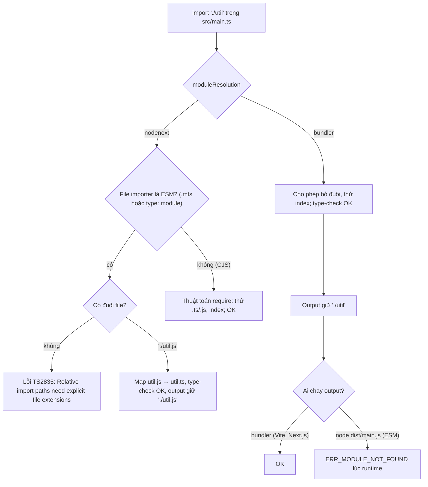
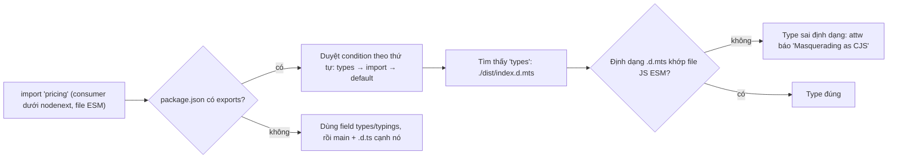

## Bối cảnh & vấn đề

Ba câu chuyện có thật về tsconfig. Một: một thư viện nội bộ build pass, Next.js app dùng nó chạy tốt, nhưng một service Node ESM import nó thì crash ngay khi khởi động với `ERR_MODULE_NOT_FOUND`. Thư viện được build với `moduleResolution: "bundler"`, nên source viết `import "./util"` không có đuôi file, điều mà bundler chấp nhận còn Node ESM thì không. Hai: một team nâng TypeScript lên 6.0 và sáng hôm sau CI đỏ với hàng trăm lỗi `Cannot find name 'process'`, vì TS 6.0 đổi default của `types` thành `[]`. Ba: một package JavaScript nội bộ được viết `.d.ts` tay khai báo `findUser(): User`, trong khi thực tế nó trả `null` khi không tìm thấy; type-check xanh, production crash.

tsconfig có hơn 100 option, và phần lớn thời gian bạn không nghĩ tới nó. Nhưng một số option quyết định **ngữ nghĩa** của type-check (strict family, `noUncheckedIndexedAccess`), một số quyết định code chạy được ở runtime hay không (`module`, `moduleResolution`), và một số quyết định bạn tin `.d.ts` của người khác tới mức nào (`skipLibCheck`). Bài này đi qua những option đó cho một backend Node hiện đại, và cách viết, kiểm tra, publish declaration file.

**Interview angle:** câu "strict thực sự bật gì" là câu dễ, nhưng follow-up "bật `noUncheckedIndexedAccess` trên codebase lớn, 800 lỗi, rollout thế nào" và "vì sao import phải có `.js`" phân biệt người đã tự cấu hình dự án với người chỉ dùng template.

## Khái niệm

### Họ flag strict

`"strict": true` là một **công tắc tổng**: nó bật một nhóm flag, và mỗi version TypeScript có thể thêm flag mới vào nhóm. Ở TS 5.9, nhóm gồm: `noImplicitAny` (tham số không có type và không suy ra được là lỗi), `strictNullChecks` (`null`/`undefined` là type riêng, không gán ngầm vào mọi type), `strictFunctionTypes` (parameter contravariant cho function type), `strictBindCallApply` (kiểm tra argument của `bind`/`call`/`apply`), `strictPropertyInitialization` (field của class phải được khởi tạo trong constructor), `noImplicitThis`, `useUnknownInCatchVariables` (`catch (e)` là `unknown`), `alwaysStrict` (emit `"use strict"`), và `strictBuiltinIteratorReturn` (TS 5.6). Vì nhóm có thể lớn lên, nâng version TypeScript có thể sinh lỗi mới dù bạn không đổi gì trong tsconfig.

`strictNullChecks` là flag quan trọng nhất trong nhóm. Không có nó, `let name: string = null` hợp lệ và mọi type đều ngầm chứa `null`, nên gần như mọi lợi ích về an toàn của TypeScript biến mất.

### Flag nên thêm cho backend mới

Ngoài `strict`, những flag đáng bật từ đầu (chi phí thấp khi codebase còn nhỏ):

- `noUncheckedIndexedAccess`: `arr[i]` và `record[key]` có `| undefined` (bài [soundness](/tracks/typescript/learn/soundness-variance)).
- `exactOptionalPropertyTypes`: tách "vắng key" khỏi "key = undefined" (bài [type & interface](/tracks/typescript/learn/type-interface-literals)); cân nhắc vì một số thư viện chưa tương thích.
- `noImplicitOverride`: method ghi đè class cha phải có `override`, tránh "tưởng override nhưng tên sai".
- `noFallthroughCasesInSwitch`, `noImplicitReturns`: bắt lỗi control flow phổ biến.
- `verbatimModuleSyntax` và `isolatedModules`: đảm bảo mỗi file transpile được độc lập (bài [emit](/tracks/typescript/learn/emit-classes-decorators)).
- `erasableSyntaxOnly` (TS 5.8): nếu code chạy bằng Node type stripping.
- `module`/`moduleResolution`: `nodenext` cho code chạy trực tiếp trên Node.

Lint bổ sung những gì compiler không làm: `@typescript-eslint/no-floating-promises` (promise không được await/handle), `no-unsafe-*` (dùng giá trị `any`), `no-explicit-any`, `ban-ts-comment`.

### TS 6.0 đổi default

TypeScript 6.0 là bản "cầu nối" sang compiler native TS 7. Nó đổi một số default để khớp với thực tế hiện đại: `strict` mặc định bật, `module` mặc định là ESM hiện đại (`esnext`), `types` mặc định là `[]` (không còn tự động include mọi package trong `node_modules/@types`), và **deprecate** các option cũ như `moduleResolution: "node"` (node10), `baseUrl`, `target: "es5"`; trong TS 7 chúng bị **xoá** hẳn. Vì vậy lời khuyên là ghi **tường minh** mọi option quan trọng trong tsconfig base, để default thay đổi không làm vỡ ngầm (verify danh sách đầy đủ ở release notes của version bạn nâng lên).

### Module resolution là gì

**Module resolution** là thuật toán compiler dùng để tìm file ứng với một chuỗi import (`"./util"`, `"zod"`, `"#config"`). Mục tiêu của nó là **mô phỏng đúng runtime** hoặc bundler sẽ chạy code, để type-check pass đồng nghĩa với import chạy được. `moduleResolution` chọn thuật toán; `module` chọn định dạng output (và với `node16`/`nodenext`, hai option đi đôi với nhau).

### nodenext: mô phỏng Node

`nodenext` (và `node16`, `node18`, `node20`) mô phỏng thuật toán của Node, gồm cả việc phân biệt ESM và CommonJS theo từng file: `.mts`/`.cts`, hoặc field `"type"` trong `package.json` gần nhất. Trong file ESM, Node **không** tự thêm đuôi file hay tìm `index.js`, nên import tương đối phải ghi đầy đủ. Điểm gây bối rối: trong `main.ts` bạn viết `import "./util.js"`, dù file trên đĩa là `util.ts`. TypeScript hiểu `.js` là "file JavaScript sẽ được sinh ra từ `util.ts`" và map về source; output giữ nguyên chuỗi import, nên nó đúng lúc chạy. `nodenext` cũng đọc `exports`/`imports` của `package.json` với đúng condition (`import`, `require`, `types`, `node`).

### bundler: cho code đi qua bundler

`bundler` dành cho code được Vite, webpack, esbuild, Next.js hay Bun xử lý trước khi chạy. Bundler cho phép bỏ đuôi file và tìm `index`, nên TypeScript cũng cho phép; nó vẫn đọc `exports` của package. Dùng `bundler` cho code **không** bao giờ được Node chạy trực tiếp (frontend, app Next.js). Dùng nó cho thư viện hay service Node là nguồn của câu chuyện đầu bài: type-check pass, runtime crash. Các lựa chọn liên quan: `allowImportingTsExtensions` (viết `./util.ts`, chỉ khi `noEmit` hoặc emit bởi công cụ khác) và `rewriteRelativeImportExtensions` (TS 5.7, tsc tự đổi `./util.ts` thành `./util.js` khi emit), hữu ích khi cùng một source vừa chạy bằng Node type stripping vừa build bằng tsc.

### Declaration file (.d.ts)

**Declaration file** chứa chỉ type (không có implementation), mô tả API của một module JavaScript. Có ba cách một package có type: tự đi kèm `.d.ts` (sinh bởi `tsc --declaration` hoặc viết tay), package `@types/x` từ DefinitelyTyped, hoặc bạn tự khai báo `declare module "x" { ... }` trong thư mục `types/` của app. Package trỏ tới type qua field `types` (hoặc `typings`) và, quan trọng hơn với package hiện đại, qua condition `"types"` trong `exports`, đặt **đầu tiên** trong mỗi nhánh condition. Package dual CJS + ESM cần `.d.cts` và `.d.mts` (hoặc hai thư mục có `package.json` riêng) khớp định dạng của từng file JS; nếu không, consumer dưới `nodenext` nhận type sai định dạng ("masquerading as ESM/CJS"). Công cụ **Are The Types Wrong?** (`npx @arethetypeswrong/cli`) kiểm tra các lỗi này.

### skipLibCheck

`skipLibCheck: true` bảo compiler **không type-check nội bộ** các file `.d.ts` (của bạn và của `node_modules`). Type trong `.d.ts` vẫn được **dùng**, chỉ không bị kiểm tra tính nhất quán. Lợi ích: type-check nhanh hơn đáng kể, và bạn không bị chặn bởi xung đột giữa hai `.d.ts` bên thứ ba (hai version `@types/node` cùng khai báo một global). Cái giá: một `.d.ts` bạn tự viết có lỗi (typo tên type, mâu thuẫn) không bị phát hiện, và type sai đó lan vào code dùng nó. Quan trọng hơn: **không** flag nào kiểm tra `.d.ts` có **khớp với hành vi thật** của JavaScript hay không. Một `.d.ts` nói `User` trong khi code trả `User | null` luôn pass, với hay không có `skipLibCheck`.

**Interview angle:** "`.d.ts` nói trả `User` nhưng thật ra trả `User | null`, ai bắt được và khi nào?" Đáp án: không phải compiler; chỉ test chạy code thật (unit test của package, test tích hợp của consumer), type test (`expectTypeOf`), hoặc sinh `.d.ts` từ source TypeScript thay vì viết tay.

## Cơ chế hoạt động

Khi gặp `import { add } from "./util"`, compiler chọn đường đi theo `moduleResolution`:



Điểm mấu chốt nằm ở nhánh cuối: TypeScript **không viết lại** chuỗi import (trừ khi bật `rewriteRelativeImportExtensions` với đuôi `.ts`). Nó chỉ kiểm tra chuỗi đó có resolve được **theo thuật toán bạn chọn**. Chọn thuật toán không khớp với runtime thật thì type-check nói dối. `nodenext` báo lỗi sớm ngay trong IDE, vì nó biết Node ESM sẽ thất bại.

Với package, resolution đọc `package.json`:



## Ví dụ thực tế

### nodenext so với bundler, chạy thật

```ts
// src/util.ts
export const add = (a: number, b: number) => a + b;
// src/main.ts
import { add } from "./util";
console.log(add(1, 2));
```

`package.json` có `"type": "module"`, build bằng tsc 5.9 rồi chạy `node dist/main.js`:

```text
--- module=nodenext moduleResolution=nodenext
src/main.ts(1,21): error TS2835: Relative import paths need explicit file extensions in ECMAScript imports when '--moduleResolution' is 'node16' or 'nodenext'. Did you mean './util.js'?
Error [ERR_MODULE_NOT_FOUND]: Cannot find module '.../dist/util' imported from .../dist/main.js
--- module=esnext moduleResolution=bundler
Error [ERR_MODULE_NOT_FOUND]: Cannot find module '.../dist/util' imported from .../dist/main.js
=== sau khi sửa thành "./util.js"
--- module=nodenext moduleResolution=nodenext
3
--- module=esnext moduleResolution=bundler
3
```

Cùng một bug runtime, nhưng `nodenext` báo nó lúc compile (kèm gợi ý sửa), còn `bundler` im lặng. (tsc vẫn emit dù có lỗi vì không bật `noEmitOnError`.) Khi thư viện của bạn chạy trong Next.js nhưng crash trong Node ESM, checklist là: `moduleResolution` khi build, đuôi file trong import tương đối, `exports` có condition `import` trỏ đúng file ESM, condition `types` đứng đầu, và chạy `attw` trên tarball (`npm pack`).

### TS 6.0 và TS 7 với tsconfig trống và option cũ

Hai file nhỏ, mỗi file đi kèm một tsconfig chỉ có `include` (không có `compilerOptions` nào):

```ts
// a.ts
function f(x) { return x; }
let s: string = null;
export {};
// b.ts
console.log(process.env.HOME);
export {};
```

```text
--- tsc 5.9.3
(a.ts, b.ts: không lỗi; strict tắt mặc định, @types/node được tự include, output là CommonJS)
--- tsc 6.0.3
a.ts(1,12): error TS7006: Parameter 'x' implicitly has an 'any' type.
a.ts(2,5): error TS2322: Type 'null' is not assignable to type 'string'.
b.ts(1,13): error TS2591: Cannot find name 'process'. Do you need to install type definitions for node? Try `npm i --save-dev @types/node` and then add 'node' to the types field in your tsconfig.
--- tsc 7.0.2
(cùng các lỗi trên; output của b.ts là ESM, giữ nguyên "export {}")
```

Và với tsconfig cũ `{ "moduleResolution": "node", "baseUrl": ".", "target": "es5" }`:

```text
--- tsc 6.0.3
error TS5107: Option 'moduleResolution=node10' is deprecated and will stop functioning in TypeScript 7.0. Specify compilerOption '"ignoreDeprecations": "6.0"' to silence this error.
error TS5101: Option 'baseUrl' is deprecated and will stop functioning in TypeScript 7.0. ...
error TS5107: Option 'target=ES5' is deprecated and will stop functioning in TypeScript 7.0. ...
--- tsc 7.0.2
error TS5108: Option 'moduleResolution=node10' has been removed. Please remove it from your configuration.
error TS5102: Option 'baseUrl' has been removed. Please remove it from your configuration.
  Use '"paths": {"*": ["./*"]}' instead.
error TS5108: Option 'target=ES5' has been removed. Please remove it from your configuration.
```

(Chạy với các bản npm `typescript@5.9.3`, `6.0.3`, `7.0.2` tại thời điểm viết; verify với version bạn dùng.) Bài học: tsconfig base nên ghi rõ `strict`, `module`, `moduleResolution`, `target`, `types: ["node"]`, và chạy thử version mới trong CI trước khi nâng. Lộ trình nâng version cho nhiều package ở bài [scale & upgrade](/tracks/typescript/learn/scale-upgrades-team).

### Một tsconfig base hợp lý cho service Node

```json
{
  "compilerOptions": {
    "target": "es2023",
    "module": "nodenext",
    "moduleResolution": "nodenext",
    "types": ["node"],
    "strict": true,
    "noUncheckedIndexedAccess": true,
    "noImplicitOverride": true,
    "noFallthroughCasesInSwitch": true,
    "verbatimModuleSyntax": true,
    "isolatedModules": true,
    "skipLibCheck": true,
    "outDir": "dist",
    "sourceMap": true
  },
  "include": ["src"]
}
```

`skipLibCheck: true` ở đây là lựa chọn có ý thức: bạn không kiểm soát `.d.ts` của `node_modules`, và lỗi trong đó không phải việc của service. Package nội bộ có `.d.ts` viết tay thì nên có một bước CI riêng chạy `tsc --noEmit --skipLibCheck false` chỉ trên package đó.

### .d.ts viết tay sai và skipLibCheck

```text
node_modules/legacy-pricing/
  index.js      module.exports.findUser = (id) => (id === "1" ? { id, email: "a@x.io" } : null);
  index.d.ts    export interface User { id: string; email: string }
                export declare function findUser(id: string): User;
                export declare const broken: Promise<Strng>;
main.ts         import { findUser } from "legacy-pricing";
                console.log(findUser("2").email.toLowerCase());
```

```text
--- skipLibCheck=false
node_modules/legacy-pricing/index.d.ts(3,38): error TS2552: Cannot find name 'Strng'. Did you mean 'String'?
--- skipLibCheck=true
(không lỗi)
$ node main.ts
TypeError: Cannot read properties of null (reading 'email')
```

`skipLibCheck: false` bắt được typo `Strng` trong `.d.ts`, nhưng **không** bắt được lời nói dối `findUser(): User`. Cả hai cấu hình đều để crash lọt qua. Cách viết type cho package JS nội bộ: bắt đầu với phần API thật sự được dùng, chú ý giá trị `null`/`undefined` (đọc code, không đọc tài liệu), thêm type test (`expectTypeOf(findUser("x")).toEqualTypeOf<User | null>()` với vitest, hoặc `// @ts-expect-error` trong một file test), và tốt nhất là chuyển dần package sang TypeScript để `.d.ts` được **sinh** thay vì viết tay.

## Trade-offs & lựa chọn thay thế

| Option | Bật khi | Đổi lại | Ghi chú |
|---|---|---|---|
| `strict` | Luôn luôn | Migration từ JS tốn công | Nhóm flag lớn dần theo version |
| `noUncheckedIndexedAccess` | Backend mới; codebase cũ theo lộ trình | Nhiều check `undefined` hơn | Không nằm trong `strict` |
| `exactOptionalPropertyTypes` | API có PATCH, domain chặt | Một số lib/`.d.ts` không tương thích | Không nằm trong `strict` |
| `moduleResolution: nodenext` | Code chạy trực tiếp trên Node, thư viện publish | Phải ghi đuôi `.js` | Mô phỏng đúng Node |
| `moduleResolution: bundler` | Frontend, Next.js, code qua bundler | Không bắt lỗi của Node ESM | Không dùng cho lib chạy trên Node |
| `skipLibCheck: true` | Hầu hết app | Không phát hiện lỗi trong `.d.ts` | Không kiểm tra `.d.ts` khớp runtime dù bật hay tắt |
| `.d.ts` viết tay | Package JS chưa chuyển được | Dễ lệch với implementation | Cần type test + test runtime |
| `.d.ts` sinh từ TS | Package viết bằng TS | Build thêm bước | Nguồn sự thật là code |

Chọn thế nào: service Node dùng `nodenext`; app frontend dùng `bundler`; thư viện dùng chung giữa hai phía dùng `nodenext` (code đúng với Node thì cũng đúng với bundler, chiều ngược lại thì không). Bật `skipLibCheck` cho app, nhưng kiểm tra `.d.ts` của chính bạn trong CI của package đó. Ghi tường minh mọi option quan trọng để nâng version không đổi hành vi ngầm.

## Edge cases & failure modes

- **`types: []` hoặc `types` liệt kê thiếu**: global của `@types/jest`, `@types/node` biến mất; lỗi `Cannot find name 'describe'` trong file test. Test có thể cần tsconfig riêng có `types: ["node", "vitest/globals"]`.
- **Hai version `@types/node`** (một từ app, một kéo theo dependency) khai báo trùng global: lỗi trong `node_modules` mà `skipLibCheck` che đi, nhưng type bạn thấy có thể là của version sai.
- **`paths` không phải runtime**: alias `@/lib/*` trong tsconfig chỉ giúp compiler; Node không biết nó. Cần bundler, `tsc-alias`, hoặc dùng `imports` (`#lib/*`) trong `package.json`, thứ mà cả Node lẫn `nodenext` đều hiểu.
- **`.d.ts` augmentation không được include**: IDE thấy type vì file đang mở, CI thì không (bài [type & interface](/tracks/typescript/learn/type-interface-literals)).
- **Dual package với một `.d.ts` duy nhất**: consumer CJS nhận type ESM (`export default` sai cách), `import x from` chạy được lúc compile nhưng `x` là `undefined` lúc chạy. Chạy `attw` trước khi publish.
- **`noEmitOnError` tắt**: tsc vẫn emit JavaScript dù có lỗi type (thấy ở ví dụ nodenext); pipeline chỉ dựa vào "build có output" sẽ deploy code lỗi. CI phải fail theo exit code của `tsc`.
- **Nâng TS trong khi tool phụ thuộc compiler API** (ts-jest, ts-morph, typescript-eslint) chưa hỗ trợ: lỗi khó hiểu trong tool, không phải trong code.

## Pitfalls

- ❌ Tin `strict` là "bật hết" → ✅ `noUncheckedIndexedAccess`, `exactOptionalPropertyTypes`, `noImplicitOverride` nằm ngoài; thêm tường minh.
- ❌ Dựa vào default của tsconfig → ✅ ghi rõ `strict`, `module`, `moduleResolution`, `target`, `types`; TS 6.0 đã đổi nhiều default.
- ❌ `moduleResolution: bundler` cho thư viện hay service chạy bằng Node → ✅ `nodenext` và ghi `import "./util.js"`.
- ❌ Bật `noUncheckedIndexedAccess` rồi sửa 800 lỗi bằng `!` → ✅ rollout theo thư mục với ratchet; sửa bằng `for...of`, `.at()` + check, `Map`.
- ❌ Nghĩ `skipLibCheck: false` sẽ phát hiện `.d.ts` sai với runtime → ✅ nó chỉ kiểm tra `.d.ts` nhất quán với chính nó; cần test runtime và type test.
- ❌ Viết `.d.ts` cho toàn bộ package JS ngay từ đầu → ✅ bắt đầu từ API đang dùng, ghi đúng `null`/`undefined`, thêm type test, rồi chuyển package sang TS.
- ❌ Dùng `paths` như alias runtime → ✅ `imports` field (`#src/*`) trong `package.json`, hoặc bundler.

## Tóm tắt

- `strict` là công tắc tổng cho một nhóm flag lớn dần theo version; `strictNullChecks` quan trọng nhất.
- Backend mới nên thêm `noUncheckedIndexedAccess`, `noImplicitOverride`, `verbatimModuleSyntax`, `isolatedModules`, cân nhắc `exactOptionalPropertyTypes`.
- TS 6.0 đổi default (`strict` bật, ESM, `types: []`) và deprecate `moduleResolution: node`, `baseUrl`, `target: es5`; TS 7 xoá chúng. Ghi option tường minh.
- `nodenext` mô phỏng Node: import tương đối trong ESM cần đuôi `.js`; `bundler` cho code đi qua bundler và không bắt lỗi của Node ESM.
- Package publish type qua condition `types` trong `exports`; dual package cần `.d.cts`/`.d.mts`; kiểm tra bằng `attw`.
- `skipLibCheck` bỏ kiểm tra nội bộ `.d.ts` để nhanh hơn; không cấu hình nào kiểm tra `.d.ts` khớp với hành vi runtime, việc đó thuộc về test.
