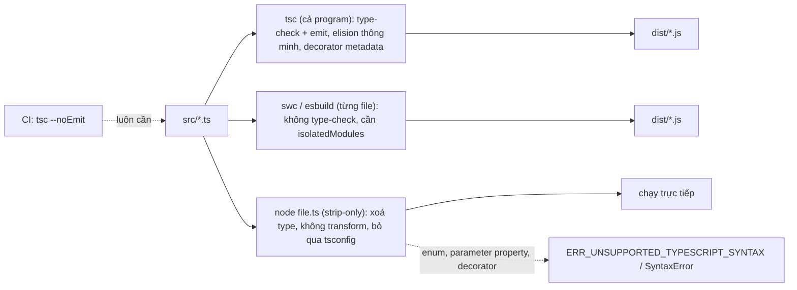
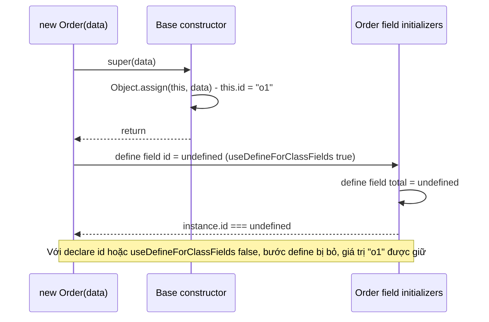

## Bối cảnh & vấn đề

Một team NestJS chuyển build từ `tsc` sang `swc` để tăng tốc. Build nhanh gấp 10 lần, test xanh, nhưng khi khởi động app báo: `Nest can't resolve dependencies of the OrdersService (?). Please make sure that the argument at index [0] is available`. Một dev khác, để dọn warning lint, đổi `import { OrdersRepo } from "./repo"` thành `import type { OrdersRepo }`, và lỗi y hệt xuất hiện ngay cả với `tsc`. Cùng tuần đó, một PR nâng `target` từ `ES2021` lên `ES2022` làm mọi entity có field `undefined`, dù không dòng code nào thay đổi.

Ba sự cố có chung một nguyên nhân: coi TypeScript như "JavaScript có thêm type, xoá type đi là xong". Thực tế, một số cú pháp TypeScript **sinh code runtime** (enum, parameter property, decorator, metadata), việc xoá import phụ thuộc vào việc compiler **biết** import nào chỉ là type, và semantics của class field phụ thuộc vào `target`. Mỗi công cụ (tsc, swc, esbuild, Node type stripping) xử lý những điều này khác nhau.

Bài này đi theo đường đi của một file `.ts` tới runtime: công cụ nào làm gì, cú pháp nào "erasable", vì sao `import type` và `verbatimModuleSyntax` tồn tại, class field semantics thay đổi ra sao, và decorator legacy (thứ NestJS, TypeORM, class-validator dựa vào) khác decorator chuẩn TC39 thế nào.

**Interview angle:** câu hỏi decorator trong phỏng vấn NestJS gần như luôn dẫn tới `emitDecoratorMetadata` và `design:paramtypes`; follow-up "bật `isolatedModules` rồi `import type` một class dùng trong constructor thì sao" là câu phân loại senior.

## Khái niệm

### Ba con đường từ .ts ra JavaScript

**tsc** vừa type-check vừa emit; nó có thông tin của **toàn bộ program**, nên biết import nào chỉ là type, biết `const enum` có giá trị gì, và biết type của tham số constructor để emit metadata. **Transpiler từng file** (esbuild, swc, Babel, Sucrase) xử lý mỗi file độc lập, không type-check, và không biết gì về file khác; chúng nhanh hơn hàng chục lần nhưng phải **đoán** những gì cần thông tin cross-file. **Node type stripping** (mặc định từ Node 22.18/23.6, dùng Amaro dựa trên swc) chỉ **xoá** cú pháp type, thay bằng khoảng trắng để giữ vị trí cột, không transform gì, và **bỏ qua tsconfig** hoàn toàn.

Hệ quả: dù build bằng gì, CI vẫn cần `tsc --noEmit` để type-check; và code phải được viết sao cho transpiler từng file hiểu đúng. `isolatedModules` là flag bảo `tsc` báo lỗi những chỗ transpiler từng file sẽ hiểu sai.

### Erasable syntax

**Erasable syntax** là cú pháp TypeScript có thể xoá đi mà phần còn lại là JavaScript hợp lệ, cùng ngữ nghĩa: annotation, `interface`, `type`, generic, `as`, `satisfies`, `import type`, `declare`. Cú pháp **không** erasable là cú pháp sinh code runtime: `enum` (sinh object), `namespace` có code, **parameter property** (`constructor(private readonly repo: Repo)` sinh `this.repo = repo`), `import x = require()`, `export =`, và decorator legacy (sinh lời gọi `__decorate`). Node strip-only từ chối chúng với `ERR_UNSUPPORTED_TYPESCRIPT_SYNTAX`; flag `erasableSyntaxOnly` (TS 5.8) biến chúng thành lỗi compile để bắt sớm. `--experimental-transform-types` của Node transform được một phần (enum, namespace, parameter property), nhưng vẫn là tính năng experimental (verify theo version Node).

### Import elision và vấn đề của transpiler từng file

Khi bạn viết `import { User } from "./types"` mà chỉ dùng `User` như một type, tsc **xoá** import đó khỏi output (**import elision**), vì nó biết `User` là interface. Transpiler từng file không biết: `User` có thể là class (value) hay interface (type), vì định nghĩa nằm ở file khác. Nếu nó giữ import, runtime có thể báo `does not provide an export named 'User'` (với ESM) hoặc chạy side effect của module không cần thiết; nếu nó xoá, có thể xoá nhầm một import thật. Tệ hơn với circular import: hai file chỉ chia sẻ type nhưng import lẫn nhau bằng import thường sẽ thành circular dependency **thật** ở runtime khi import không được xoá, dẫn tới giá trị `undefined` lúc module đang khởi tạo.

### import type và verbatimModuleSyntax

`import type { User } from "./types"` nói rõ: import này chỉ dành cho type, **luôn bị xoá**, không bao giờ ảnh hưởng runtime. Inline modifier `import { type User, createUser }` đánh dấu từng tên. **`verbatimModuleSyntax`** (TS 5.0) đặt một quy tắc đơn giản, dự đoán được: import/export **không** có `type` được **giữ nguyên** trong output, import/export có `type` bị xoá. Không còn elision "thông minh". Import một type mà không có `type` là lỗi `TS1484`. Flag này thay thế `importsNotUsedAsValues` và `preserveValueImports` cũ, và buộc code khớp với cách transpiler từng file và Node type stripping xử lý.

Một chi tiết tinh tế: với inline modifier `import { type User } from "./types"`, dưới `verbatimModuleSyntax`, output còn `import {} from "./types"` hoặc `import "./types"`, tức module **vẫn được load** và side effect của nó vẫn chạy. Chỉ `import type { User }` mới xoá hoàn toàn.

### Class field: [[Set]] và [[Define]]

Có hai ngữ nghĩa cho một khai báo field `id!: string;` trong class. **Legacy** (TypeScript cũ): field không có initializer thì không sinh code gì; field có initializer thành phép gán `this.x = ...` trong constructor (**[[Set]]**, gọi setter nếu có). **Chuẩn ES2022** (class fields của TC39): mọi field khai báo, kể cả không có initializer, được **define** trên instance bằng `Object.defineProperty` với giá trị `undefined` (**[[Define]]**), ngay sau khi `super()` trả về. `useDefineForClassFields` chọn ngữ nghĩa; mặc định là `true` khi `target >= ES2022` (bao gồm `ESNext`).

Vì sao điều này làm hỏng code? Khi class cha gán giá trị trong constructor của nó (`Object.assign(this, data)`, hoặc ORM/hydrator set property), thứ tự là: constructor cha chạy và gán `id = "o1"`, rồi quay về class con, nơi field `id` được **define lại** thành `undefined`, ghi đè giá trị vừa gán. Cùng hiện tượng xảy ra với decorator legacy định nghĩa accessor trên prototype: field define trên instance che mất accessor đó. Sửa bằng `declare id: string;` (chỉ khai báo type, không emit field nào) hoặc `useDefineForClassFields: false`. Node type stripping giữ nguyên field declaration như viết, nên luôn có ngữ nghĩa [[Define]] của engine.

### Legacy decorators (experimentalDecorators)

**Decorator** là function được áp lên class, method, accessor, property hay parameter để thay đổi hoặc ghi nhận nó. Phiên bản TypeScript hỗ trợ từ lâu (`experimentalDecorators`) theo một draft cũ của TC39: decorator nhận `(target, propertyKey, descriptor)`, có **parameter decorator** (`constructor(@Inject(TOKEN) x)`), và đi kèm `emitDecoratorMetadata`: compiler emit `design:type`, `design:paramtypes`, `design:returntype` qua `Reflect.metadata`, dựa trên **type** của tham số. NestJS đọc `design:paramtypes` để biết constructor cần inject gì; TypeORM, class-validator, class-transformer dùng cơ chế tương tự. Đây là lý do NestJS vẫn yêu cầu `experimentalDecorators` và `emitDecoratorMetadata`.

Metadata là chỗ type **thoát khỏi** erasure: tsc đổi type `OrdersRepo` thành **tham chiếu tới giá trị** `OrdersRepo` (class) trong output. Nếu `OrdersRepo` là interface (không có giá trị), hoặc chỉ được import bằng `import type`, metadata thành `Object`/`Function`, và Nest không biết inject gì. Đó là lý do NestJS dùng injection token (`@Inject(ORDERS_REPO)`) cho interface.

### Standard decorators (TC39, TS 5.0)

TS 5.0 hỗ trợ **decorator chuẩn** (proposal stage 3) khi **không** bật `experimentalDecorators`. API khác hẳn: decorator nhận `(value, context)` với `context.kind`, `context.name`, `context.addInitializer`, `context.metadata`. **Không có parameter decorator**, và **không** có `emitDecoratorMetadata` (không emit type); `Symbol.metadata` cho phép decorator tự ghi metadata, nhưng không phải từ type. Vì vậy framework dựa vào DI theo type (NestJS, Angular trước đây) không chuyển sang được một cách đơn giản. Cả hai loại decorator đều cần transform: Node type stripping không chạy được, và V8 chưa hỗ trợ decorator natively tại thời điểm viết (verify).

**Interview angle:** "khi nào dùng decorator chuẩn?" Đáp án thực tế: code mới không phụ thuộc framework DI legacy (logging, memoize, validation tự viết); còn trong NestJS, giữ legacy decorators và hiểu rõ các ràng buộc của nó với `isolatedModules` và swc.

## Cơ chế hoạt động

Đường đi của source qua các công cụ:



Ba nhánh cho thấy vì sao tsconfig phải "hạ chuẩn" về mức của công cụ yếu nhất trong pipeline. Nếu dev chạy local bằng `node --watch src/main.ts`, build production bằng swc, và test bằng vitest (esbuild), thì code phải erasable (cho Node), transpile được từng file (cho swc/esbuild), và vẫn type-check bằng tsc. `verbatimModuleSyntax` + `isolatedModules` + `erasableSyntaxOnly` là bộ flag khiến tsc báo lỗi đúng những gì các công cụ kia sẽ làm sai.

Thứ tự khởi tạo của một instance `new Order(data)` dưới [[Define]]:



Field initializer của class con **luôn** chạy sau `super()`, theo cả hai ngữ nghĩa. Khác biệt duy nhất là field **không có initializer** có sinh ra bước define hay không. Dưới [[Set]], không có bước đó nên giá trị của class cha sống sót.

## Ví dụ thực tế

### import không có type dưới Node type stripping

```ts
// types.ts
console.log("[side effect] types.ts evaluated");
export interface User { id: string }
export const VERSION = 1;
// a2.ts: import thường một interface
import { User } from "./types.ts";
export const u: User = { id: "1" };
console.log(u);
// c2.ts: inline type modifier
import { type User } from "./types.ts";
export const u: User = { id: "1" };
console.log(u);
// b.ts: import type
import type { User } from "./types.js";
export const u: User = { id: "1" };
console.log(u);
```

```text
$ node a2.ts
SyntaxError: The requested module './types.ts' does not provide an export named 'User'
$ node c2.ts
[side effect] types.ts evaluated
{ id: '1' }
$ node b.ts
{ id: '1' }
$ tsc --noEmit --verbatimModuleSyntax --module nodenext a.ts b.ts c.ts
a.ts(1,10): error TS1484: 'User' is a type and must be imported using a type-only import when 'verbatimModuleSyntax' is enabled.
$ tsc --verbatimModuleSyntax ... c.ts && cat out/c.js
import {} from "./types.js";
export const u = { id: "1" };
```

Node strip-only giữ nguyên import thường, và ESM không tìm thấy export `User` (interface không tồn tại lúc runtime). Inline `type` sửa được lỗi nhưng module vẫn được load: side effect vẫn chạy, và nếu có circular import thì nó vẫn là circular. Chỉ `import type` xoá hoàn toàn. `verbatimModuleSyntax` bắt lỗi của `a.ts` ngay lúc compile, và output của `c.ts` cho thấy rõ import rỗng còn lại.

### useDefineForClassFields sau khi nâng target

```ts
class Base {
  constructor(data: Record<string, unknown>) { Object.assign(this, data); }
}
class Order extends Base {
  id!: string;
  total!: number;
}
class OrderDeclare extends Base {
  declare id: string;
  declare total: number;
}
console.log(new Order({ id: "o1", total: 10 }).id, new OrderDeclare({ id: "o1", total: 10 }).id);
```

```text
--- target es2021:
o1 o1
--- target es2022:
undefined o1
--- emitted Order class (es2022)
class Order extends Base {
    id;
    total;
}
--- es2021 emit
class Order extends Base {
}
--- node strip-only (node order.ts)
undefined o1
```

Output emit giải thích tất cả: với ES2022, `id;` là một class field declaration thật, được engine define thành `undefined` sau `super()`. `id!:` (definite assignment assertion) chỉ tắt lỗi `strictPropertyInitialization` lúc compile; nó **vẫn** emit field. `declare id` không emit gì. Chạy trực tiếp bằng Node cho kết quả giống ES2022, vì type stripping giữ nguyên dòng `id;` sau khi xoá `!: string`.

### Legacy decorators, metadata và import type

```ts
import "reflect-metadata";
import { OrdersRepo } from "./repo.js";
function Injectable(): ClassDecorator { return () => {}; }
@Injectable()
export class OrdersService {
  constructor(private readonly repo: OrdersRepo, private readonly retries: number) {}
}
console.log(Reflect.getMetadata("design:paramtypes", OrdersService));
```

```text
$ tsc --experimentalDecorators --emitDecoratorMetadata --module commonjs ... && node out-legacy/legacy.js
[ [class OrdersRepo], [Function: Number] ]
$ grep __metadata out-legacy/legacy.js
    __metadata("design:paramtypes", [repo_js_1.OrdersRepo, Number])

# đổi thành: import type { OrdersRepo } from "./repo.js";
$ grep __metadata out-type/legacy-type.js
    __metadata("design:paramtypes", [Function, Number])

# constructor(private readonly clock: Clock) với Clock là interface, import thường, isolatedModules bật
legacy-iface.ts(5,54): error TS1272: A type referenced in a decorated signature must be imported with 'import type' or a namespace import when 'isolatedModules' and 'emitDecoratorMetadata' are enabled.
```

Metadata chứa **giá trị** `OrdersRepo`, thứ Nest dùng để tra provider. Với `import type`, tsc không được phép tham chiếu tới giá trị, nên emit `Function` chung chung, và Nest báo "can't resolve dependencies". Với interface dưới `isolatedModules`, tsc báo `TS1272` vì transpiler từng file không biết `Clock` là type hay value. Quy tắc cho NestJS: class được inject theo type phải import **thường**; interface phải dùng injection token. Lint rule tự động "sửa" import thành `import type` (`@typescript-eslint/consistent-type-imports`) phải biết project dùng decorator metadata, qua `parserOptions.emitDecoratorMetadata` và `experimentalDecorators`, để không đổi import của class dùng trong signature có decorator (verify theo version typescript-eslint).

### Standard decorator và giới hạn

```ts
function logged<This, Args extends unknown[], R>(
  target: (this: This, ...args: Args) => R,
  ctx: ClassMethodDecoratorContext<This, (this: This, ...args: Args) => R>,
) {
  return function (this: This, ...args: Args): R {
    console.log(`-> ${String(ctx.name)}(${JSON.stringify(args)})`);
    return target.call(this, ...args);
  };
}
class Pricing {
  @logged total(qty: number, unit: number) { return qty * unit; }
}
console.log(new Pricing().total(3, 50));
```

```text
$ tsc --target es2022 --module commonjs standard.ts && node out-std/standard.js
-> total([3,50])
150
$ tsc --noEmit param.ts        # class S { constructor(@Inject x: string) {} } không có experimentalDecorators
param.ts(2,23): error TS1206: Decorators are not valid here.
$ node standard.ts
SyntaxError: Invalid or unexpected token
```

Decorator chuẩn có type đầy đủ (`ClassMethodDecoratorContext`) và không cần `reflect-metadata`. Nhưng parameter decorator là lỗi `TS1206`, và Node 24 không chạy được cú pháp `@` (engine chưa hỗ trợ, và strip-only không transform).

## Trade-offs & lựa chọn thay thế

| Công cụ / lựa chọn | Type-check | Transform (enum, decorator, param property) | Tốc độ | Dùng khi |
|---|---|---|---|---|
| `tsc` emit | Có | Đầy đủ, cả metadata | Chậm nhất | Thư viện cần `.d.ts`, NestJS build chuẩn |
| swc / esbuild | Không | Phần lớn; metadata ở mức hạn chế (swc có `decoratorMetadata`) | Rất nhanh | Build app, test runner; CI vẫn chạy `tsc --noEmit` |
| Node type stripping | Không | Không (strip-only) | Không có bước build | Script, tool nội bộ, service viết erasable-only |
| `enum` | n/a | Cần transform | n/a | Tránh trong code mới; dùng `as const` object |
| Parameter property | n/a | Cần transform | n/a | Tiện trong NestJS; tránh nếu chạy bằng Node strip |
| Legacy decorators | n/a | Cần transform + metadata | n/a | NestJS, TypeORM, class-validator |
| Standard decorators | n/a | Cần transform | n/a | Code mới không phụ thuộc DI theo type |

Chọn thế nào: xác định công cụ yếu nhất trong pipeline và bật flag tương ứng trong tsconfig để tsc bắt lỗi trước. Service Node thuần có thể chọn "erasable only" (không enum, không parameter property, không decorator) để chạy trực tiếp bằng Node và bỏ bước build. Service NestJS giữ legacy decorators, build bằng tsc hoặc swc có cấu hình metadata, và không bật `erasableSyntaxOnly`. Nâng `target` là một thay đổi **runtime**, cần test các class có kế thừa và decorator.

## Edge cases & failure modes

- **`const enum` với `isolatedModules`**: transpiler từng file không biết giá trị để inline, nên chỉ có thể emit `Dir.Up` như truy cập property thường. Với const enum khai báo trong file `.ts` khác, điều đó vẫn chạy vì `isolatedModules` bật ngầm `preserveConstEnums` (object được giữ); nhưng const enum **ambient** (từ `.d.ts`, ví dụ của một package publish) không có object nào lúc runtime, và tsc báo `TS2748: Cannot access ambient const enums when 'isolatedModules' is enabled` (đã chạy trên tsc 5.9).
- **Re-export type không có `type`**: `export { User } from "./types"` trong barrel file bị giữ nguyên dưới `verbatimModuleSyntax`/strip-only và gây lỗi runtime; phải là `export type { User }`.
- **Circular import chỉ vì type**: hai module import type lẫn nhau bằng import thường; dưới transpiler không elide, nó thành circular runtime, và một export đọc được là `undefined` (TDZ `ReferenceError` với `class`/`const`).
- **swc và `emitDecoratorMetadata`**: swc emit metadata dựa trên phân tích từng file; type được import (không phải class khai báo trong file) có thể bị emit sai nếu không có thông tin; kiểm tra bằng test khởi động app (Nest `Test.createTestingModule`) trong CI.
- **Accessor decorator và [[Define]]**: legacy decorator định nghĩa getter/setter trên prototype (MobX cũ, một số ORM) bị field instance che khuất khi `useDefineForClassFields: true`.
- **Node bỏ qua tsconfig**: `paths`, `target`, `experimentalDecorators` không có tác dụng khi chạy `node file.ts`; import phải có đuôi `.ts` thật, và file trong `node_modules` không được strip.
- **Stack trace và source map**: type stripping thay type bằng khoảng trắng nên giữ đúng dòng/cột, không cần source map; swc/esbuild/tsc cần `--enable-source-maps` (Node) để stack trace trỏ về `.ts`.

## Pitfalls

- ❌ Build bằng swc/esbuild rồi bỏ `tsc` khỏi CI → ✅ transpiler không type-check; CI luôn chạy `tsc --noEmit`.
- ❌ `import { User }` cho type khi dùng transpiler từng file → ✅ `import type` (xoá hoàn toàn) và bật `verbatimModuleSyntax` để tsc bắt lỗi.
- ❌ Nghĩ `import { type X }` tương đương `import type { X }` → ✅ inline modifier vẫn giữ import rỗng: module được load, side effect chạy.
- ❌ Nâng `target` lên ES2022 như một thay đổi "chỉ syntax" → ✅ nó bật [[Define]] cho class field; dùng `declare` cho field được set bởi class cha/ORM, hoặc `useDefineForClassFields: false`, và chạy test.
- ❌ `id!: string` để "báo compiler là field sẽ được set" → ✅ `!` vẫn emit field; `declare id: string` mới không emit.
- ❌ Đổi import của class được inject trong NestJS thành `import type` → ✅ giữ import thường cho class inject theo type; interface dùng injection token.
- ❌ Viết `enum` và parameter property trong code chạy bằng Node type stripping → ✅ `as const` object và field khai báo thường; bật `erasableSyntaxOnly`.

## Tóm tắt

- tsc thấy cả program (type-check, elision, metadata); swc/esbuild xử lý từng file và không type-check; Node type stripping chỉ xoá type và bỏ qua tsconfig.
- Erasable syntax xoá được mà không đổi ngữ nghĩa; `enum`, `namespace` có code, parameter property, decorator thì không. `erasableSyntaxOnly` bắt chúng lúc compile.
- `import type` luôn bị xoá; `verbatimModuleSyntax` giữ nguyên mọi import không có `type` và báo `TS1484` khi import type bằng import thường.
- `useDefineForClassFields` (mặc định với `target >= ES2022`) define field thành `undefined` sau `super()`, ghi đè giá trị class cha đã gán; dùng `declare` field.
- Legacy decorators + `emitDecoratorMetadata` emit `design:paramtypes` bằng giá trị class: nền tảng DI của NestJS; `import type` hay interface làm metadata mất thông tin.
- Standard decorators (TS 5.0) có API `context`, không có parameter decorator và không emit metadata type; cả hai loại đều cần transform.
